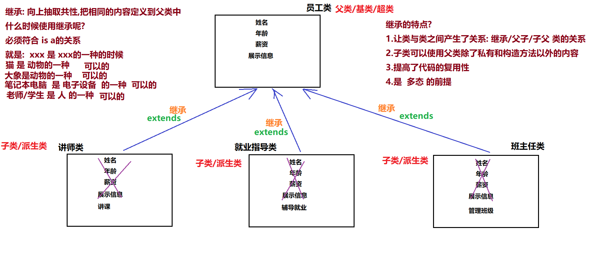
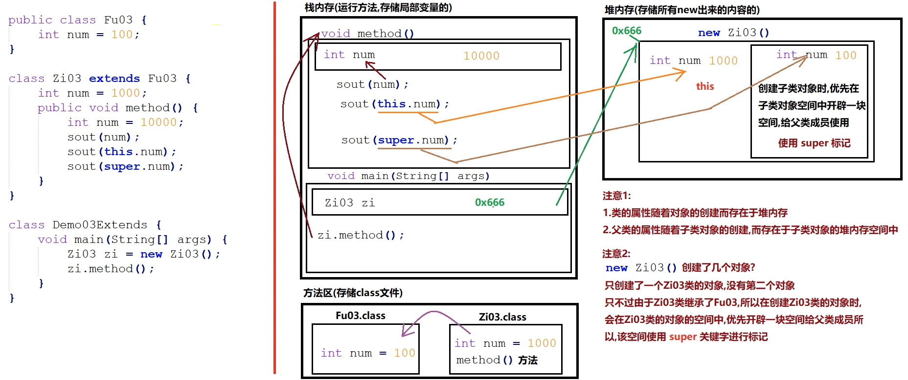
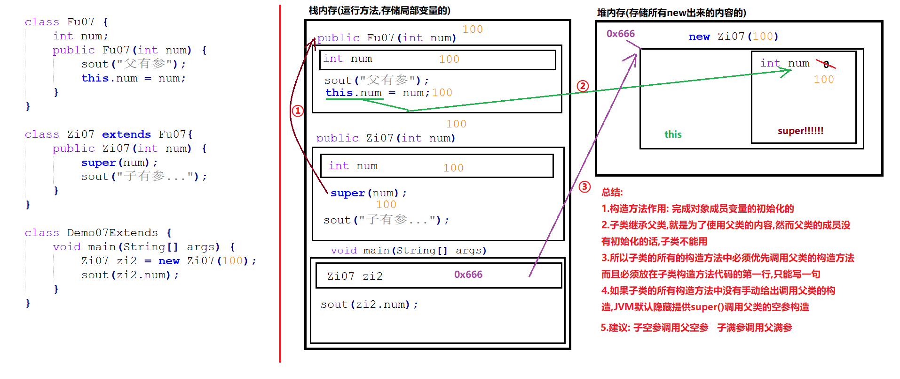
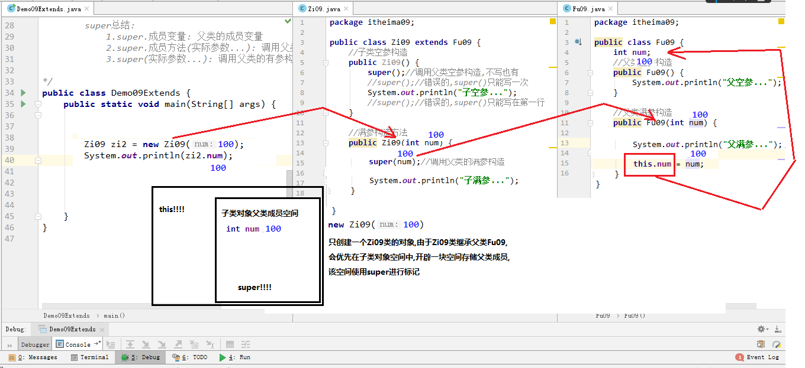
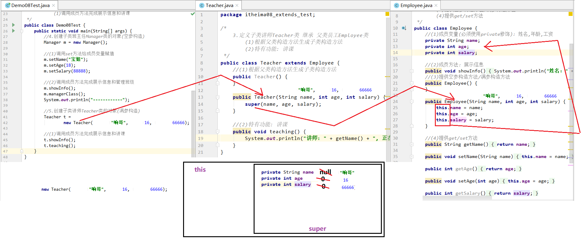
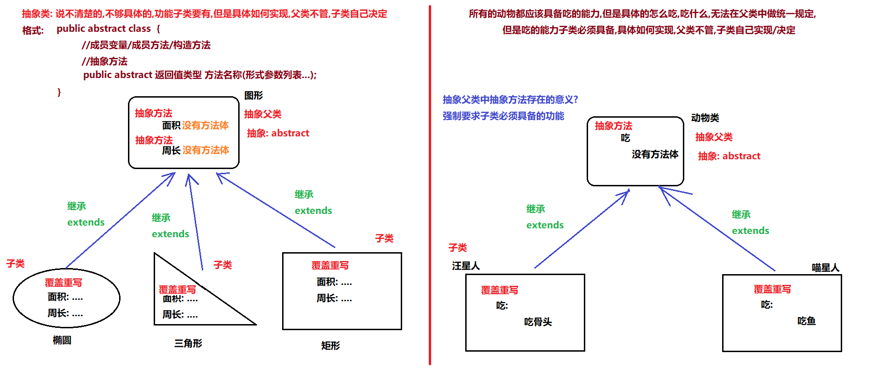

# <center>继承和抽象类</center>

[toc]

## 继承

### 继承的概述

#### 1、继承介绍

在Java中，类的继承是指在一个现有类的基础上去构建一个新的类，构建出来的新类被称作子类，现有类被称作父类，子类会自动拥有父类所有可继承的属性和方法。

#### 继承概念

当要定义一个类(讲师)时，发现已有类(员工)和要定义的类相似，并且要定义的类属于已有类的一种时，可以将要定义类定义为已有类的子类。同时反过来思考：当多个类(讲师，助教，班主任)有共性内容，可以将共性内容向上抽取，抽取到一个新的类(员工)
中,那么多个类和新类的关系叫做继承。(总的来说就是向上抽取共性，把相同的内容定义在父类中)

#### 2、使用继承满足的条件

(1)必须满足 is a 的关系  
(2)xxx是yyy的一种,例如：

+ 讲师是员工的一种
+ 班主任是员工的一种
+ 兔子是 动物的一种

#### 3、继承的好处

(1)提高了代码的复用性  
(2)让类与类之间差生了关系(父子类的关系)  
(3)是多态的前提  
(4)子类可以使用父类的除private修饰的和构造方法以外的内容  


### 继承的表示

#### 1、继承的格式

```java
public class 父类 {
    //成员变量
    //成员方法
    //构造方法
}

public class 子类 extends 父类 {
    //成员变量
    //成员方法
    //构造方法
}

public class A extends B {
    //...
}
    /*注意:
            1.B是父类,又叫做基类/超类,A是子类
            2.子类可以使用父类中除了private修饰的和构造方法以外的内容
            3.单继承(一个类的直接父类只有一个)
            4.可以多层继承
            5.所有类的最终父类都是object类
    */
``` 

#### 2、继承的成员变量访问特点

1. 不重名的成员变量  
   (1)子类自己有: 优先使用子类自己的  
   (2)子类没有: 找父类  
   (3)注意: 子类可以找父类,但是父类不能找子类
2. 重名的成员变量  
   (1)方法内部,直接写变量名  
   从方法内部开始向上找  
   方法内部有: 直接使用  
   方法内部没有: 向上找,本类的成员位置  
   本类的成员位置有: 直接使用  
   本类的成员位置没有: 向上找,父类的成员位置  
   (2)方法内部,直接写this.变量名  
   从本类的成员位置开始向上找  
   本类的成员位置有: 直接使用  
   本类的成员位置没有: 向上找,父类的成员位置  
   (3)方法内部,直接写super.变量名  
   从父类成员位置开始向上找  
   父类的成员位置有: 直接使用  
   父类的成员位置没有: 继续向上找  
   (4)总结:就近原则

```java
//父类：
public class Fu02 {
    int numFu = 20;
    int num = 100;
}

//子类：
public class Zi02 extends Fu02 {
    int numZi = 2000;
    int num = 1000;

    //成员方法
    public void show() {
        System.out.println(numZi);//使用子类自己的numZi: 2000
        System.out.println(numFu);//子类自己没有,使用父类的numFu: 200
    }

    //成员方法
    public void method() {
        int num = 10000;
        System.out.println(num);//使用方法内部的局部变量num:10000
        System.out.println(this.num);//使用Zi02类的成员变量num: 1000
        System.out.println(super.num);//使用Fu02类的成员变量num: 100
    }
}

//测试类：
public class Demo02ExtendsVar {
    public static void main(String[] args) {
        //创建子类对象
        Zi02 zi = new Zi02();
        //调用子类成员方法
        zi.show();
        System.out.println("-----------");
        zi.method();
        System.out.println("------------");
        //输出子类成员变量
        System.out.println("zi.numZi = " + zi.numZi);//使用子类自己的numZi: 2000
        System.out.println("zi.numFu = " + zi.numFu);//子类没有,使用父类的numFu: 200
        System.out.println("zi.num=" + zi.num);//使用子类自己的num: 1000
    }
}
```   

#### 3、this和super关键字图解


this和super关键字的区别：  
this.成员变量: 从本类的成员变量开始找  
this.成员方法(参数列表...): 调用本类自己的其它方法  
this(参数列表...): 调用子类自己的有参构造方法  
super.成员变量: 从父类的成员变量开始找  
super.成员方法(参数列表...): 调用父类自己的其它方法  
super(参数列表...): 调用父类自己的有参构造方法

#### 4、继承的方法重写

1. 重写的格式

```java
/*
方法重写
        1.概念:
            子类中出现与父类一模一样的方法时（返回值类型，方法名和参数列表都相同），
            会出现覆盖效果，也称为重写或者复写。声明不变，重新实现。
            必要条件:方法名和参数列表必须相同
            可选条件:返回值类型可以不一致(后面讲)
        2.最简单的方法重写形式:
            子类方法声明(定义方法的第一行)和父类方法声明一模一样
        3.@Override注解:用来检测子类方法,是否是对父类方法的覆盖重写
        4.与方法重载区分开: 
            方法重载作用:是节约命名空间
            方法重载要求: 方法名称相同,参数列表不同(类型不同,数量不同,多个不同类型的顺序不同)
        5.方法重写快捷键:
            ctrl + o --> 选择要重写的方法 --> ok
*/
//父类
public class Fu03 {
    //成员方法
    public void methodFu() {
        System.out.println("Fu04....methodFu....");
    }

    //开车
    public void drive() {
        System.out.println("开着奥拓,冒着狼烟去东北...");
    }

    //展示信息
    public void show(String name, int age) {
        System.out.println(name + "::::" + age);
    }
}
```

```java
//子类
public class Zi03 extends Fu03 {
    //成员方法
    public void methodZi() {
        System.out.println("Zi04....methodZi....");
    }

    //重写父类的drive方法
    @Override
    public void drive() {
        System.out.println("开着玛莎拉蒂,一路高歌去东莞...");
    }

    //开车
    //@Override //该方法不是对父类方法的覆盖重写,使用@Override 会报错
    //此方法和上面的方法构成了重载
    public void drive(String car) {
        System.out.println("开着" + car + ",一路高歌去东莞...");
    }

    @Override
    public void show(String name, int age) {
        System.out.println("姓名: " + name + ", 年龄: " + age);
    }
}

```

```java
//测试类
public class Demo03Extends {
    public static void main(String[] args) {
        //创建子类对象
        Zi03 zi = new Zi03();

        //使用子类对象调用成员方法
        zi.methodZi();//调用子类自己的methodZi方法

        //调用的是父类的methodFu方法
        zi.methodFu();//子类没有,找父类

        //子父类中重名的方法(方法重写): 优先使用子类自己的
        zi.drive();
        zi.show("张三", 18);
    }
}
```

2. 重写的注意事项

```java
/*
    1. 子类方法覆盖父类方法，必须要保证权限大于等于父类权限。
        权限:
            public > protected > 默认(什么都不写) > private

    2. 子类方法覆盖父类方法，
        返回值类型、函数名和参数列表都要一模一样。
        必要条件:
            函数名和参数列表都要一模一样
        可选条件:
            返回值类型可以不一样
        子类覆盖重写后的方法的返回值类型 <= 父类方法返回值类型

    3. 私有方法不能被重写(父类私有成员子类是不能继承的)  
*/
//父类            
public class Fu05 {
    public void a() {

    }

    //默认权限
    void b() {

    }

    public void c() {

    }

    public Object d() {
        return new Object();
    }

    public String e() {
        return "Hello";
    }

    private void f() {

    }
}

//子类
public class Zi05 extends Fu05 {
    //子父类方法权限相同
    @Override
    public void a() {

    }

    //子类重写后的方法的权限>父类方法权限
    @Override
    public void b() {

    }

    //错误: 子类重写后的方法的权限 < 父类方法权限
    //不允许
    /*void c() {

    }*/

    //正确: 子类重写后的方法的返回值类型 < 父类方法的返回值类型
    //子类重写后的方法的返回值类型 是 父类方法的返回值类型的子类
    @Override
    public String d() {
        return "hello";
    }

    //错误: 子类重写后的方法的返回值类型 > 父类方法的返回值类型
    //子类重写后的方法的返回值类型 是 父类方法的返回值类型的父类
    /*public Object e() {
        return new Object();
    }*/

    //父类方法时private修饰的,子类无法继承,更无法覆盖重写
    //不加@Override是没错的,因为此时f属于子类自己的方法,和父类方法无关
    //@Override
    public void f() {

    }
}

//测试类
public class Demo05OverrideNotice {
    public static void main(String[] args) {

    }
}
```

#### 5、继承中构造器的访问特点

```java
/*
    1.构造方法的名字是与类名一致的。所以子类是无法继承父类构造方法的
    2.子类继承父类,是为了使用父类的内容,所以子类创建对象调用构造方法时,必须先调用父类的构造方法,
        完成父类成员的初始化动作,子类才可以使用父类的成员,super()表示调用父类的空参构造
    3.子类的构造方法中如果没有手动给出super调用父类构造,
            编译器默认提供一个super()调用父类的空参构造
    4.super调用父类构造,只能写在第一句
    5.构造方法可以重载,所以:
            super(...):调用父类带参数的构造方法
*/ 
```

```java
//父类
public class Fu06 {
    int num;

    //父空参构造
    public Fu06() {
        System.out.println("父空参...");
    }

    //父有参构造
    public Fu06(int num) {
        System.out.println("父有参");
        this.num = num;
    }
}
```

```java
//子类
public class Zi06 extends Fu06 {
    //子空参构造
    public Zi06() {
        super();//调用父类空参构造,不写也有
        //super();//错误: 只能调用一次
        System.out.println("子空参...");
        //super();//错误: 必须写在第一行,先调用父类空参构造
    }

    //子有参构造
    public Zi06(int num) {
        /*
            子类所有构造方法中,
            只要没有手动给出super调用父类构造,
            JVM会隐藏提供super()调用父类空参构造
         */
        //super();
        super(num);
        System.out.println("子有参...");
    }
}
```

```java
//测试类
public class Demo06Extends {
    public static void main(String[] args) {
        //空参构造创建对象
        Zi06 zi = new Zi06();
        System.out.println("----");
        //有参构造创建对象
        Zi06 zi2 = new Zi06(100);
        System.out.println(zi2.num);
    }
}
```





## 抽象类

### 抽象类的概念

在类的设计中，把说不清楚的,不够具体的,但是子类要有的功能，在父类中声明为抽象方法,此时的类就必须是抽象类。父类具体无法实现的方法称为抽象方法,即父类不管,子类自己决定。  


### 抽象的定义，使用和注意事项

```java
/*
    3.抽象类的定义格式:
        public abstract class 类名 {
            ...
        }
    4.抽象方法的定义格式:
        修饰符 abstract 返回值类型 方法名称(参数列表...);
        注意:
            (1)和以前定义方法一样,但是去掉{},添加abstract关键字
            (2)返回值类型和参数列表根据需求确定
            (3)含有抽象方法的类,必须定义为抽象类,但是抽象类中不一定含有抽象方法
    5.抽象类的使用
        (1)不能直接创建抽象类的对象
        (2)定义子类,继承抽象父类
        (3)子类中覆盖重写抽象父类中的所有抽象方法
                    去掉abstract关键字,添加{}
                    快捷键: ctrl + i
        (4)创建子类对象
        (5)子类对象调用方法
    6.抽象类的注意事项：
       1.抽象类不能创建对象，如果创建，编译无法通过而报错。只能创建其非抽象子类的对象
       2.抽象类中，必须有构造方法，是供子类创建对象时，初始化父类成员使用的
       3.抽象类中，不一定包含抽象方法，但是有抽象方法的类必定是抽象类 
       4.抽象类的子类，必须重写抽象父类中所有的抽象方法，否则，编译无法通过而报错。除非该子类也是抽象类
       5.抽象类中的抽象方法可以一直继承下去，但在继承过程中该子类必须是抽象类，直到实现父类中所有的抽象方法。
*/    
```
```java
//定义抽象父类动物Animal类(父类)
public abstract class Animal {
    //抽象方法
    public abstract void eat();
}
```
```java
//定义子类Dog类继承抽象父类Animal类
public class Dog extends Animal {
    @Override
    public void eat() {
        System.out.println("狗吃骨头....");
    }
}
//定义子类Cat类继承抽象父类Animal类
public class Cat extends Animal {

    @Override
    public void eat() {
        System.out.println("猫吃鱼....");
    }
}
```
```java
//测试类
public class Demo10Abstract {
    public static void main(String[] args) {
        //错误: 不能直接创建抽象类的对象
        //Animal a = new Animal();
        //创建子类对象
        Dog dog = new Dog();
        dog.eat();

        Cat cat = new Cat();
        cat.eat();
    }
}
```
