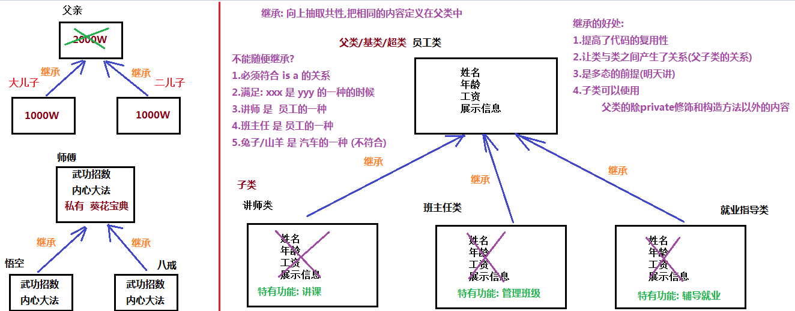
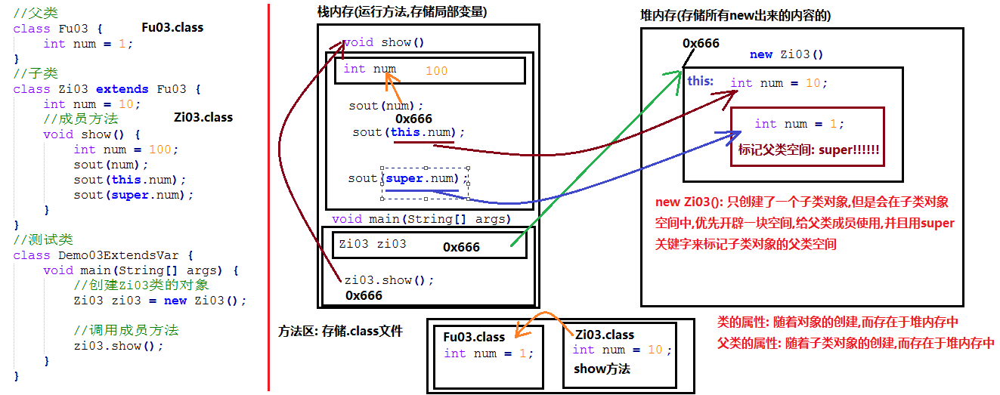
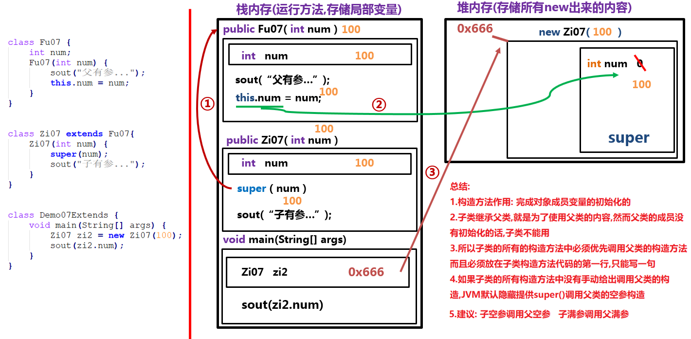
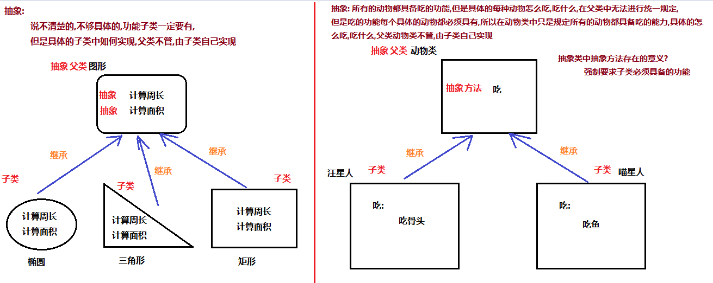

# day01 【继承、抽象类、综合案例】
[toc]
今日内容介绍

```java
继承
方法重写
this/super关键字
抽象类 
```

## 第一章 继承

### 1.1 继承的概念【重点】

```java
假如我们要定义如下类: 讲师类,班主任类和就业指导类，分析如下：
    1. 讲师类 属性:姓名,年龄,工资 行为:展示信息,讲课
    2. 班主任类 属性:姓名,年龄，工资 行为:展示信息,管理班级
    3. 就业指导类 属性:姓名,年龄，工资 行为:吃饭,展示信息，辅导就业
    
如果我们定义三个类,每个类都有姓名,年龄,工资,展示信息,代码重复了,需要把重复的代码单独定义到一个类中

在一个已知类A的基础上,创建新类B的过程,称之为继承    
	这里类A,称为父类,基类,超类
	这里类B,称为子类,派生类
```

```java
1.继承的概念:
	向上抽取共性,把相同的内容定义在父类中
	
2.什么情况下使用继承(不能随便继承)?
    (1)必须满足 is a 的关系
    (2)xxx是yyy的一种
    (3)讲师是员工的一种
    (4)班主任是员工的一种
    (5)兔子是 动物的一种
    
3.继承的好处
	(1)提高了代码的复用性
	(2)让类与类之间差生了关系(父子类的关系)
    (3)是多态的前提
    (4)子类可以使用父类的除private修饰的和构造方法以外的内容
```




### 1.2 继承的格式和代码体现【重点】01

```java
格式:
	public class 父类 {
        //成员变量
        //成员方法
        //构造方法
    }
	
	public class 子类 extends 父类 {
        //成员变量
        //成员方法
        //构造方法
    }

	public class A extends B {
        //...
    }

注意:
	1.B是父类,又叫做基类/超类,A是子类
	2.子类可以使用父类中除了private修饰的和构造方法以外的内容
	

代码体现:
//定义父类员工类
public class Employee {
    String name;//姓名
    int age;//年龄
    int salary;//工资

    //成员方法
    public void show() {
        System.out.println("姓名: "+name+", 年龄: "+age+", 工资: "+salary);
    }
}
//定义子类讲师类 继承 父类 员工类
public class Teacher extends Employee {
    //特有功能: 讲课
    public void teaching() {
        System.out.println(name+"正在讲解面向对象.....");
    }

}
//定义子类班主任类 继承 父类 员工类
public class Manager extends Employee{
    //特有功能: 管理班级
    public void manageClass() {
        System.out.println(name+"正在管理班级....");
    }
}
//测试类: 继承的基本使用
public class Demo01Extends {
    public static void main(String[] args) {
        //创建Teacher类的对象
        Teacher t = new Teacher();
        //给成员变量赋值
        t.name = "响哥";
        t.age = 18;
        t.salary = 60000;
        //调用成员方法
        t.show();
        t.teaching();
        System.out.println("-----");

        //创建Manager类的对象
        Manager m = new Manager();
        //给成员变量赋值
        m.name = "玉姐";
        m.age = 16;
        m.salary = 80000;
        //调用成员方法
        m.show();
        m.manageClass();
    }
}
```


### 1.3 继承中的成员变量访问特点【重点】

```java
/*
	继承中的成员变量访问特点
        1.不重名的成员变量
            (1)子类自己有: 优先使用子类自己的
            (2)子类没有: 找父类
            (3)注意: 子类可以找父类,但是父类不能找子类
        2.重名的成员变量
    		(1)方法内部,直接写变量名
                从方法内部开始向上找
                方法内部有: 直接使用
                方法内部没有: 向上找,本类的成员位置
                本类的成员位置有: 直接使用
                本类的成员位置没有: 向上找,父类的成员位置
            (2)方法内部,直接写this.变量名
                从本类的成员位置开始向上找
                本类的成员位置有: 直接使用
                本类的成员位置没有: 向上找,父类的成员位置
            (3)方法内部,直接写super.变量名
                从父类成员位置开始向上找
                父类的成员位置有: 直接使用
                父类的成员位置没有: 继续向上找
            (4)总结:就近原则
*/
//父类
public class Fu02 {
    int numFu = 20;
    int num = 100;
}
```

```java
//子类
public class Zi02 extends Fu02{
    int numZi = 2000;
    int num = 1000;

    //成员方法
    public void show() {
        System.out.println(numZi);//使用子类自己的numZi: 2000
        System.out.println(numFu);//子类自己没有,使用父类的numFu: 200
    }

    //成员方法
    public void method() {
        int num = 10000;
        System.out.println(num);//使用方法内部的局部变量num:10000
        System.out.println(this.num);//使用Zi02类的成员变量num: 1000
        System.out.println(super.num);//使用Fu02类的成员变量num: 100
    }
}
```

```java
//测试类
public class Demo02ExtendsVar {
    public static void main(String[] args) {
        //创建子类对象
        Zi02 zi = new Zi02();
        //调用子类成员方法
        zi.show();
        System.out.println("-----------");
        zi.method();
        System.out.println("------------");
        //输出子类成员变量
        System.out.println("zi.numZi = " + zi.numZi);//使用子类自己的numZi: 2000
        System.out.println("zi.numFu = " + zi.numFu);//子类没有,使用父类的numFu: 200
        System.out.println("zi.num=" + zi.num);//使用子类自己的num: 1000
    }
}
```

### 1.4 this和super的图解【了解】




### 1.5 继承中成员方法的访问特点【重点】

```java
/*
	继承中成员方法的访问特点
        1.子类自己有: 优先使用子类自己的
        2.子类没有: 向上找父类
        3.重名的方法(方法重写): 优先使用子类自己的
    方法重写
        1.概念:
            子类中出现与父类一模一样的方法时（返回值类型，方法名和参数列表都相同），
            会出现覆盖效果，也称为重写或者复写。声明不变，重新实现。
            必要条件:方法名和参数列表必须相同
            可选条件:返回值类型可以不一致(后面讲)
        2.最简单的方法重写形式:
            子类方法声明(定义方法的第一行)和父类方法声明一模一样
        3.@Override注解:用来检测子类方法,是否是对父类方法的覆盖重写
        4.与方法重载区分开: 
            方法重载作用:是节约命名空间
            方法重载要求: 方法名称相同,参数列表不同(类型不同,数量不同,多个不同类型的顺序不同)
        5.方法重写快捷键:
            ctrl + o --> 选择要重写的方法 --> ok
*/
//父类
public class Fu03 {
    //成员方法
    public void methodFu() {
        System.out.println("Fu04....methodFu....");
    }
    //开车
    public void drive() {
        System.out.println("开着奥拓,冒着狼烟去东北...");
    }
    //展示信息
    public void show(String name, int age) {
        System.out.println(name + "::::" + age);
    }
}
```

```java
//子类
public class Zi03 extends Fu03 {
    //成员方法
    public void methodZi() {
        System.out.println("Zi04....methodZi....");
    }
    //重写父类的drive方法
    @Override
    public void drive() {
        System.out.println("开着玛莎拉蒂,一路高歌去东莞...");
    }
    //开车
    //@Override //该方法不是对父类方法的覆盖重写,使用@Override 会报错
    //此方法和上面的方法构成了重载
    public void drive(String car) {
        System.out.println("开着" + car + ",一路高歌去东莞...");
    }
    @Override
    public void show(String name, int age) {
        System.out.println("姓名: " + name + ", 年龄: " + age);
    }
}
```

```java
public class Demo03Extends {
    public static void main(String[] args) {
        //创建子类对象
        Zi03 zi = new Zi03();

        //使用子类对象调用成员方法
        zi.methodZi();//调用子类自己的methodZi方法

        //调用的是父类的methodFu方法
        zi.methodFu();//子类没有,找父类

        //子父类中重名的方法(方法重写): 优先使用子类自己的
        zi.drive();
        zi.show("张三",18);
    }
}
```

### 1.6 方法重写的应用_手机类的分析【重点】

```java
/*
    1.老款手机: 打电话,发短信,显示来电(只显示电话号码)
    2.新款手机: 打电话,发短信,显示来电(显示电话号码,显示头像,显示位置)

    实现步骤:
        1.定义老款手机OldPhone类
            成员方法: 发短信,打电话,显示来电
        2.创建OldPhone类的对象
        3.使用OldPhone类的对象调用方法,演示功能
        4.定义新款手机NewPhone类,继承老款手机OldPhone类
            (1)对于打电话和发短信功能不变,直接使用父类的功能
            (2)对于来电显示功能需要增强: 覆盖重写父类的来电显示功能
        5.创建新款手机NewPhone类的对象
        6.使用新款手机NewPhone类的对象调用方法,演示功能

    注意:
        super.成员方法名称(实际参数列表...): 表示直接调用父类的成员方法,父类没有继续向上找
*/		
```


### 1.7 方法重写的应用_手机类的代码实现【重点】

```java
/*
    1.定义老款手机OldPhone类
            成员方法: 发短信,打电话,显示来电
 */
public class OldPhone {
    //成员方法
    //打电话
    public void call(String who) {
        System.out.println("正在给..."+who+"...打电话...");
    }

    //发短信
    public void sendMessage(String who, String msg) {
        System.out.println("正在给..."+who+"...发短信..."+msg);
    }

    //显示来电
    public void show() {
        System.out.println("110来电....");
    }
}
```

```java
/*
    4.定义新款手机NewPhone类,继承老款手机OldPhone类
        (1)对于打电话和发短信功能不变,直接使用父类的功能
        (2)对于来电显示功能需要增强: 覆盖重写父类的来电显示功能
 */
public class NewPhone extends OldPhone {
    //(2)对于来电显示功能需要增强: 覆盖重写父类的来电显示功能
    @Override
    public void show() {
        //显示电话号码功能,父类已经实现了
        //直接调用父类的此功能就可以了
        super.show();
        //System.out.println("110来电....");
        System.out.println("你不是说去出差吗?怎么在东莞呢....");
        System.out.println("头像怎么突然间绿了....");
    }
}
```

```java
//测试类
public class Demo04ExtendsOverrideTest {
    public static void main(String[] args) {
        //2.创建OldPhone类的对象
        OldPhone op = new OldPhone();
        //3.使用OldPhone类的对象调用方法,演示功能
        op.call("宏伟哥");
        op.sendMessage("宏伟哥","最近可好,哥哥.....");
        op.show();
        System.out.println("-----------");
        //5.创建新款手机NewPhone类的对象
        NewPhone np = new NewPhone();
        np.call("岩岩");
        np.sendMessage("岩岩","妹妹最近可好,哥哥最近有点郁闷....");
        np.show();
    }
}
```


### 1.8 方法重写的注意事项【了解】

```java
/*
    1. 子类方法覆盖父类方法，必须要保证权限大于等于父类权限。
        权限:
            public > protected > 默认(什么都不写) > private

    2. 子类方法覆盖父类方法，
        返回值类型、函数名和参数列表都要一模一样。
        必要条件:
            函数名和参数列表都要一模一样
        可选条件:
            返回值类型可以不一样
        子类覆盖重写后的方法的返回值类型 <= 父类方法返回值类型

    3. 私有方法不能被重写(父类私有成员子类是不能继承的)  
*/
//父类            
public class Fu05 {
    public void a() {

    }
    //默认权限
    void b() {

    }
    public void c() {

    }

    public Object d(){
        return new Object();
    }

    public String e() {
        return "Hello";
    }

    private void f() {

    }
}

//子类
public class Zi05 extends Fu05{
    //子父类方法权限相同
    @Override
    public void a() {

    }
    //子类重写后的方法的权限>父类方法权限
    @Override
    public void b() {

    }

    //错误: 子类重写后的方法的权限 < 父类方法权限
    //不允许
    /*void c() {

    }*/

    //正确: 子类重写后的方法的返回值类型 < 父类方法的返回值类型
    //子类重写后的方法的返回值类型 是 父类方法的返回值类型的子类
    @Override
    public String d() {
        return "hello";
    }

    //错误: 子类重写后的方法的返回值类型 > 父类方法的返回值类型
    //子类重写后的方法的返回值类型 是 父类方法的返回值类型的父类
    /*public Object e() {
        return new Object();
    }*/

    //父类方法时private修饰的,子类无法继承,更无法覆盖重写
    //不加@Override是没错的,因为此时f属于子类自己的方法,和父类方法无关
    //@Override
    public void f() {

    }
}
//测试类
public class Demo05OverrideNotice {
    public static void main(String[] args) {

    }
}
```


### 1.9 继承中构造方法的访问特点【重点】  07

```java
/*
    1.构造方法的名字是与类名一致的。所以子类是无法继承父类构造方法的
    2.子类继承父类,是为了使用父类的内容,所以子类创建对象调用构造方法时,必须先调用父类的构造方法,
        完成父类成员的初始化动作,子类才可以使用父类的成员,super()表示调用父类的空参构造
    3.子类的构造方法中如果没有手动给出super调用父类构造,
            编译器默认提供一个super()调用父类的空参构造
    4.super调用父类构造,只能写在第一句
    5.构造方法可以重载,所以:
            super(...):调用父类带参数的构造方法
*/        
//父类
public class Fu06 {
    int num;
    //父空参构造
    public Fu06(){
        System.out.println("父空参...");
    }
    //父有参构造
    public Fu06(int num) {
        System.out.println("父有参");
        this.num = num;
    }
}

//子类
public class Zi06 extends Fu06{
    //子空参构造
    public Zi06(){
        super();//调用父类空参构造,不写也有
        //super();//错误: 只能调用一次
        System.out.println("子空参...");
        //super();//错误: 必须写在第一行,先调用父类空参构造
    }
    //子有参构造
    public Zi06(int num) {
        /*
            子类所有构造方法中,
            只要没有手动给出super调用父类构造,
            JVM会隐藏提供super()调用父类空参构造
         */
        //super();
        super(num);
        System.out.println("子有参...");
    }
}
//测试类
public class Demo06Extends {
    public static void main(String[] args) {
        //空参构造创建对象
        Zi06 zi = new Zi06();
        System.out.println("----");
        //有参构造创建对象
        Zi06 zi2 = new Zi06(100);
        System.out.println(zi2.num);
    }
}
```


### 1.10 继承中构造方法的访问内存图解【了解】



### 1.11继承综合案例 08

```java
/*
    继承综合案例--员工类
    实现步骤:
        1.定义父类员工Employee类
            (1)成员变量: 姓名,年龄
            (2)成员方法: 展示信息
            (3)所有成员变量private修饰,提供空参/满参/set/get方法

        2.定义子类讲师Teacher类 继承 父类员工Employee类
            (1)根据父类生成空参/满参构造方法
            (2)定义子类特有功能: 讲课

        3.定义子类班主任Manager类 继承 父类员工Employee类
            (1)根据父类生成空参/满参构造方法
            (2)定义子类特有功能: 管理班级

 */
public class Demo07Test {
    public static void main(String[] args) {
        //4.创建子类班主任Manager类的对象(空参构造)
        Manager m = new Manager();
        //(1)调用set方法给成员变量赋值
        m.setName("宝姐");
        m.setAge(18);
        m.setSalary(88888);
        //(2)调用成员方法完成展示信息和管理班级
        m.showInfo();
        m.managerClass();
        System.out.println("------------");

        //5.创建子类讲师Teacher类的对象(满参构造)
        Teacher t = new Teacher("响哥", 16, 66666);
        //(1)调用成员方法完成展示信息和讲课
        t.showInfo();
    }
}

/*
    1.定义父类员工Employee类
        (1)成员变量(必须使用private修饰): 姓名,年龄,工资
        (2)成员方法: 展示信息
        (3)提供空参构造方法/满参构造方法
        (4)提供get/set方法
 */
public class Employee {
    //(1)成员变量(必须使用private修饰): 姓名,年龄,工资
    private String name;
    private int age;
    private int salary;

    //(2)成员方法: 展示信息
    public void showInfo() {
        System.out.println("姓名: " + name + ", 年龄: " + age + ", 薪资: " + salary);
    }
    //(3)提供空参构造方法/满参构造方法
    public Employee() {
    }

    public Employee(String name, int age, int salary) {
        this.name = name;
        this.age = age;
        this.salary = salary;
    }

    //(4)提供get/set方法
    public String getName() {
        return name;
    }

    public void setName(String name) {
        this.name = name;
    }

    public int getAge() {
        return age;
    }

    public void setAge(int age) {
        this.age = age;
    }

    public int getSalary() {
        return salary;
    }

    public void setSalary(int salary) {
        this.salary = salary;
    }
}
/*
    2.定义子类讲师Teacher类 继承 父类员工Employee类
        (1)根据父类生成空参/满参构造方法
        (2)定义子类特有功能: 讲课
 */
public class Teacher extends Employee {
    //(1)根据父类构造方法生成子类构造方法
    public Teacher() {
    }
    public Teacher(String name, int age, int salary) {
        super(name, age, salary);
    }
    //(2)特有功能: 讲课
    public void teaching() {
        System.out.println("讲师: " + getName() + ", 正在讲解面向对象");
    }
}
/*
    3.定义子类班主任Manager类 继承 父类员工Employee类
        (1)根据父类生成空参/满参构造方法
        (2)定义子类特有功能: 管理班级
 */
public class Manager extends Employee{
    //(1)根据父类构造方法生成子类构造方法
    public Manager() {
    }
    public Manager(String name, int age, int salary) {
        super(name, age, salary);
    }
    //(2)特有功能: 管理班级
    public void managerClass() {
        System.out.println("班主任老师: "+getName()+" ,正在严格的管理班级...");
    }
}
```


### 1.12 继承的特点【了解】

```java
/*
    1.Java只支持单继承，不支持多继承。
    2.Java支持多层继承(继承体系)。
    3.所有的类都直接或者间接继承了Object类，Object类是所有类的最终父类。
*/
//父类
public class Fu0801 {
}
//父类
public class Fu0802 extends Fu0803 {
    public void a() {
        System.out.println("a....");
    }
}
//父类
public class Fu0803 extends Object {
    public void b() {
        System.out.println("b....");
    }
}
//一个类只能有一个直接父类
public class Zi0801 /*extends Fu0801 ,Fu0802*/ {
}
//子类
public class Zi0802 extends Fu0802 {
    public void c() {
        System.out.println("c....");
    }
}
public class Demo08ExtendsTeDian {
    public static void main(String[] args) {
        //创建子类对象
        Zi0802 zi0802 = new Zi0802();
        zi0802.c();
        zi0802.a();
        zi0802.b();
        zi0802.hashCode();
    }
}
```


## 第二章 抽象类 

### 2.1 抽象类的概念和引入【重点】

```java
/*
    抽象:
    1.概念:
        说不清楚的,不够具体的,功能子类要有,但是具体如何实现,父类不管,子类自己决定
        举例:
            所有的动物都应该具备吃的能力,但是具体的怎么吃,吃什么,无法在父类中做统一规定,
            但是吃的能力子类必须具备,具体如何实现,父类不管,子类自己实现/决定
    2.抽象类中抽象方法存在的意义:强制要求子类必须具备的能力
*/
```





### 2.2 抽象类的定义和使用【重点】

```java
/*
    3.抽象类的定义格式:
        public abstract class 类名 {
            ...
        }
    4.抽象方法的定义格式:
        修饰符 abstract 返回值类型 方法名称(参数列表...);
        注意:
            (1)和以前定义方法一样,但是去掉{},添加abstract关键字
            (2)返回值类型和参数列表根据需求确定
            (3)含有抽象方法的类,必须定义为抽象类,但是抽象类中不一定含有抽象方法
    5.抽象类的使用
        (1)不能直接创建抽象类的对象
        (2)定义子类,继承抽象父类
        (3)子类中覆盖重写抽象父类中的所有抽象方法
                    去掉abstract关键字,添加{}
                    快捷键: ctrl + i
        (4)创建子类对象
        (5)子类对象调用方法  
*/    
//定义抽象父类动物Animal类
public abstract class Animal {
    //抽象方法
    public abstract void eat();
}
//定义子类Dog类继承抽象父类Animal类
public class Dog extends Animal {
    @Override
    public void eat() {
        System.out.println("狗吃骨头....");
    }
}
//定义子类Cat类继承抽象父类Animal类
public class Cat extends Animal {

    @Override
    public void eat() {
        System.out.println("猫吃鱼....");
    }
}
//测试类
public class Demo10Abstract {
    public static void main(String[] args) {
        //错误: 不能直接创建抽象类的对象
        //Animal a = new Animal();
        //创建子类对象
        Dog dog = new Dog();
        dog.eat();

        Cat cat = new Cat();
        cat.eat();

    }
}
```


### 2.3 抽象类的注意事项【了解】

```java
/*
    1.抽象类不能创建对象，如果创建，编译无法通过而报错。只能创建其非抽象子类的对象
    2.抽象类中，必须有构造方法，是供子类创建对象时，初始化父类成员使用的
    3.抽象类中，不一定包含抽象方法，但是有抽象方法的类必定是抽象类 看: MyAbstractClass
    4.抽象类的子类，必须重写抽象父类中所有的抽象方法，否则，编译无法通过而报错。除非该子类也是抽象类
                看: Cat10类,BoSiCat10类
*/            
//没有抽象方法的类,也可以定义为抽象类
//目的: 不让你创建该类的对象,必须通过子类对象调用方法
public abstract class MyAbstractClass {
    public void method() {
        System.out.println("method....");
    }
}
//定义抽象父类
public abstract class Animal10 {
    private String name;//名字
    //抽象方法
    public abstract void eat();
    public abstract void sleep();
    //空参构造方法
    public Animal10() {
    }
    //满参构造方法
    public Animal10(String name) {
        this.name = name;
    }
    //get和set方法
    public String getName() {
        return name;
    }
    public void setName(String name) {
        this.name = name;
    }
}
//定义子类,继承抽象父类
public class Dog10 extends Animal10 {
    //空参构造
    public Dog10() {
        super();
    }
    @Override
    public void eat() {
        System.out.println(getName()+"....狗吃骨头....");
    }
    @Override
    public void sleep() {
        System.out.println(getName()+"....狗瞪着眼珠子睡觉....");
    }
}
//定义抽象子类继承抽象父类
public abstract class Cat10 extends Animal10 {
    //空参构造
    public Cat10() {
    }
    //满参构造
    public Cat10(String name) {
        super(name);
    }
    @Override
    public void eat() {
        System.out.println(getName()+"....猫吃鱼....");
    }
    /*
        抽象父类Animal中有两个抽象方法eat和sleep
        子类只重写了一个抽象方法eat,相当于子类自己内部还有一个抽象方法
        所以子类必须定义为抽象类
        public abstract void sleep();
     */
}
//定义子类继承Cat10
public class BoSiCat10 extends Cat10 {
    //空参构造
    public BoSiCat10() {
    }
    //满参构造
    public BoSiCat10(String name) {
        super(name);
    }
    @Override
    public void sleep() {
        System.out.println(getName()+"....波斯猫...蹬着腿睡...");
    }
}
//测试类
public class Demo10AbstractTeDian {
    public static void main(String[] args) {
        //创建Dog10类的对象: 空参构造
        Dog10 dog = new Dog10();
        //调用set方法给成员变量赋值
        dog.setName("哈士奇");
        //调用成员方法
        dog.eat();
        dog.sleep();
        //创建BoSiCat10类的对象: 满参构造
        BoSiCat10 cat = new BoSiCat10("小花");
        cat.eat();
        cat.sleep();
    }
}
```

