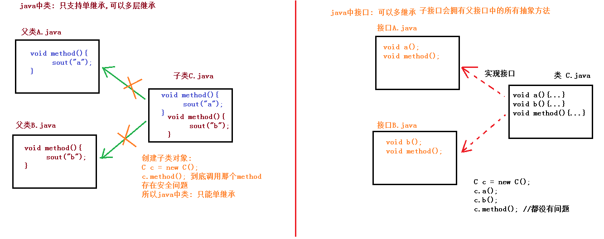
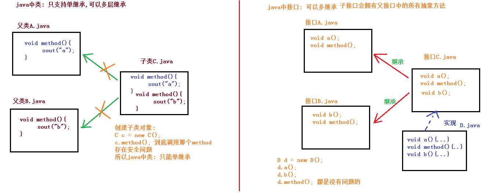
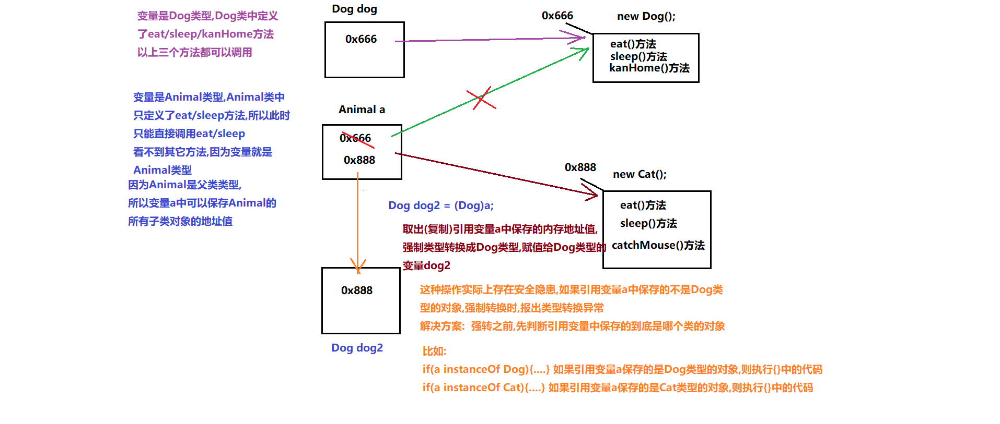
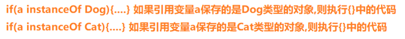
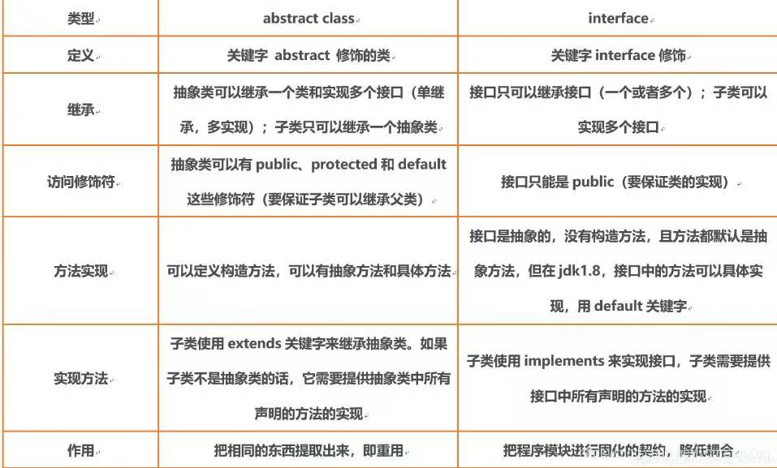

# <center>接口和多态</center>
[toc]
## 接口
### 接口的概念
#### 概念
对外暴露的规则/规范/标准，只要符合该规则/规范/标准的东西都可以使用
####接口
Java语言中一种引用类型，编译后也有对应的class文件，是方法的汇总
#### 作用
实现对类的功能的扩展，解决Java中类的单继承的局限性
### 接口的定义内容
#### 抽象方法
```java
public abstract 返回值类型 方法名称(形式参数列表...);
```
#### 默认方式[jdk8开始]
```java
public default 返回值类型 方法名称(形参列表...){...};
```
#### 静态方法[jdk8开始]
```java
public static 放回值类型 方法名称(形参列表...){...};
```
#### 常量
```java
public static final 数据类型 变量 = 数据值;
//改值一经定义无法改变
```
### 接口的定义格式
```java
//类的定义格式:
public class 类名{
    //成员常量
    //成员方法
    //构造方法
    //静态方法        
}
```
```java
//接口的定义格式：
public interface 类名{
    //常量
    //抽象方法
    //默认方法
    //静态方法
}
```
#### 接口中抽象方法的定义格式和使用
```java
/*
    1.接口中抽象方法的定义格式
        public abstract 返回值类型 方法名称(形式参数列表...);
        注意:
            (1)和以前定义方法格式相同,但是需要去掉{},添加abstract
            (2)返回值类型和参数列表根据需求确定
            (3)接口中抽象方法,有默认修饰符public abstract,不写也有
                抽象类中抽象方##法必须写public abstract,不能省略

    2.接口中抽象方法的使用
        (1)不能直接创建接口的对象
        (2)定义实现类 实现 接口 关键字 implements
           格式:
                public class 类名 implements 接口A,接口B {
                    //覆盖重写接口中的所有的抽象方法
                }
        (3)实现类中覆盖重写接口中的所有的抽象方法
            去掉abstract关键字,添加{}
            快捷键: ctrl + i
        (4)创建实现类对象
        (5)使用实现类对象调用方法
*/
```
```java
//USB接口
public interface USB {
    //抽象方法
    //开启功能
    public abstract void open();
    //抽象方法: public abstract 是默认修饰符,可以省略
    //关闭功能
    void close();//修饰符省略后的抽象方法格式
}
```
```java
//USB接口实现类U盘
public class UDisk implements USB {
    //实现接口中抽象方法时，abstract关键字消失
    @Override
    public void open() {
        System.out.println("U盘已经开启....");
    }
    @Override
    public void close() {
        System.out.println("U盘已经关闭....");
    }    
}
```
#### 接口中默认方法的定义格式和使用
```java
/*
    接口中默认方法的定义格式和使用
        问题:
            定义接口后,有很多实现类在使用接口,如果对接口功能升级添加了新的抽象方法
            导致所有的实现类必须修改代码,太麻烦
        解决方案: 默认方法
        默认方法的定义格式:
            public default 返回值类型 方法名称(形式参数列表...){
                //方法体;
            }
        默认方法的使用: 只能使用实现类对象调用默认方法
        注意:
            1.接口中的默认方法,不强制要求实现类进行覆盖重写
            2.但是实现类可以根据需求,选择性的覆盖重写接口中的默认方法
            3.如果实现类覆盖重写接口中的默认方法,必须去掉default关键字
        默认方法的使用和继承中方法的使用一个道理
*/  
```
```java
//USB接口
public interface USB {
    //默认方法
    public default void driver() {
        System.out.println("USB接口提供的默认驱动程序....");
    }
}
```
```java
//USB接口实现类扫描仪
public class HMScanner implements USB {
	//该实现类发现接口中的默认方法无法满足需求,进行了覆盖重写
    @Override
    public void driver() {
        System.out.println("使用扫描仪专用驱动");
    }
}
```
#### 接口中静态方法的定义和使用
```java
/*
    1.定义格式
        public static 返回值类型 方法名称(形式参数列表...) {
            方法体;
       }
    2.使用格式: 只能使用接口名称调用接口中的静态方法
    3.注意:
        (1)接口中的静态方法,属于接口本身,与实现类无关,在实现类中不存在覆盖重写
        (2)类中的静态方法,属于类本身,与接口无关,与对象无关
        (3)类中的静态方法:
             类名直接调用 ---推荐使用
             对象直接调用 ---不推荐使用
    总结: 静态的内容要么用接口名称调用,要么用类名称调用
*/
```
```java
//USB接口
public interface USB {
    //静态方法
    public static void thanks() {
        System.out.println("感谢使用USB接口....");
    }
}
```
```java
//USB接口实现类扫描仪
public class HMScanner implements USB {
	//静态方法
    public static void thanks() {
        System.out.println("感谢使用扫描仪....");
    }
}
```
```java
public class Demo {
    public static void main(String[] args) {
        //创建实现类对象
        HMScanner hmScanner = new HMScanner();
        //对象.静态方法(...): 不推荐使用,内部仍然使用类名调用静态方法
        hmScanner.thanks();//只是一个表象,内部编译后会变成HMScanner.thanks()
        //实现类名称调用静态方法
        HMScanner.thanks();
        //接口名称调用静态方法
        USB.thanks();
    }
}
总结：静态方法不能被覆盖，在实现类中的静态方法等价于自己创建了一个方法
```
#### 成员变量的定义和使用
```java
/*
    接口中成员变量的使用
    接口中定义的变量,都是常量(值不可以改变)
    默认修饰符public static final 不写也有
    接口中常量默认值认为是无效的必须显式赋值
    接口中的常量的使用: 接口名称.常量名称
    建议: 接口中常量的命名全部使用大写字母,单词之间用_分隔
*/
/*
    USB接口
        接口中不能定义变量,只能定义常量,而且常量有默认修饰符public static final
        接口中的常量默认值认为是无效的,必须显式赋值
        常量建议全部使用大写字母,单词之间使用_分隔
 */
public interface USB {
    //版本
    public static final double VERSION = 3.0;//版本
    public static final int MAX_SPEED_OF_TRANSFER = 500;//最大传输速度

    //静态方法: 展示USB接口的相关信息
    public static void show() {
        System.out.println("USB接口版本: " + VERSION + ", 最大传输速度: " + MAX_SPEED_OF_TRANSFER + "MB/s");
        //show方法和内部输出的常量,都在USB接口中,所以可以省略接口名
        System.out.println("USB接口版本: " + USB.VERSION + ", 最大传输速度: " + USB.MAX_SPEED_OF_TRANSFER + "MB/s");
    }
}
```
```java
    /*
    接口中成员变量的使用
    接口中定义的变量,都是常量(值不可以改变)
    默认修饰符public static final 不写也有
    接口中常量默认值认为是无效的必须显式赋值
    接口中的常量的使用: 接口名称.常量名称
    建议: 接口中常量的命名全部使用大写字母,单词之间用_分隔
*/
public class Demo04InterConstant {
    public static void main(String[] args) {
        //调用接口中的静态方法
        USB.show();
        System.out.println("--------");

        //直接输出接口中的常量
        System.out.println("USB接口版本: " + USB.VERSION);
        System.out.println("USB接口最大传输速度: " + USB.MAX_SPEED_OF_TRANSFER);
    }
}
```
### 接口的多实现
```java
/*
在继承体系中，一个类只能继承一个父类【类的单继承： 亲爹只能有一个】。

对于接口而言，一个类是可以实现多个接口的，这叫做接口的多实现

【类实现接口的多实现： 干爹可以有多个】。并且，一个类能继承一个父类，同时实现多个接口。

一个类能继承一个父类，同时实现多个接口格式:
public class 子类名 extends 父类名 implements 接口名A,接口名B {
    覆盖重写抽象父类和接口中的所有的抽象方法
}  
注意:
        子类必须重写父类和接口中的所有抽象方法,只要有一个抽象方法没有被重写,*/

```

### 接口的多继承

接口的多继承关系：子接口会拥有父接口中的所有抽象方法
## 多态
### 多态的概念
同一行为，通过不同的事物，可以体现出来的不同的形态。多态，描述的就是这样的状态。  
也就是：同一个事物,表现出来不同的形态  
Java中的多态指的是对象具备多态性  
例如：
比如说你自己
在学校中: 是一个学生
在餐馆中: 是一个顾客
在公司中: 是一个员工
在你家里: 是妻子/丈夫
回老家: 是一个孩子
### 多态的代码体现
```java
/*
多态的前提:
        (1)必须要有继承或者接口实现
        (2)必须要有父类引用指向子类对象(父类类型的变量保存子类对象的地址值)
        (3)必须要有方法的覆盖重写,否则将失去多态的意义
多态的本质：
        (1)就是把子类对象当成父类类型使用
            父类引用指向子类对象(父类类型的变量保存子类对象的地址值)
        (2)多态的方式调用方法,方法跟着对象走        
*/
//格式为：
父类 对象名 = new 子类();
```
### 多态的好处和弊端
```
    多态的好处:
       可以使用父类/接口,作为方法的参数,提高方法的扩展性   
    问题:
       用Animal的子类Dog和Cat作为方法参数,定义了两个方法
       Animal的子类可以有任意多个,这样定义的方法也就会有任意多个
       每创建一个子类,就得再添加一个方法,太麻烦
       解决方案:
           所有的子类对象,都可以当做父类类型使用
           所以可以使用父类类型作为方法的参数    
        类作为方法的参数:
            调用方法时,传递的是该类的对象或者是该类的子类对象

        类的数据体现形式是对象
        抽象类的数据体现形式是子类对象
        接口的数据体现形式是实现类对象
        暴露新的问题: 方法内部不能直接调用子类的特有行为了
    简单理解为：
    父类 对象名 = new 子类();
    在多态调用中，对象名只能调用改父类中的抽象方法，子类独有方法无法调用，这样的好处是方便了代码的修改和扩展，提高了代码的灵活性
```
### 多态的向上向下转型(解决父类无法调用子类的独有方法问题)
```java
/*
	多态中的向上转型
        多态的本质(父类引用指向子类对象): 就是向上转型
        类似于 基本类型的自动类型转换
        取值范围小的数据或者变量可以直接赋值给取值范围大的变量
        int a = 100;//int: 占4个字节
        double d = a;//double: 占8个字节
        不需要进行特殊的处理
    多态中的向下转型
        类似于 基本类型的强制类型转换
        取值范围大的数据或者变量不可以直接赋值给取值范围小的变量
        double d2 = 100;//double: 占8个字节
        int c = (int)d2;//int: 占4个字节
        强制类型转换:
            转后类型 对象名称 = (转后类型)转前的对象或者变量名称;            
	注意:多态的向下转型(强制类型转换)存在安全隐患
        如果转换前的类型和转换后的类型不一致,就会报出类型转换异常(ClassCastException)
        如何解决这个问题呢?
*/
```

```java
public class Demo06DuoTai {
    public static void main(String[] args) {
        //多态的方式创建Animal类型的对象: 向上转型
        //Animal为父类，Dog为子类
        Animal a = new Dog();
        //此时只能直接调用Animal中规定好的方法
        a.eat();
        a.sleep();
        /*
            在多态中是把Dog对象当成父类Animal类型使用,
            此时Dog对象表现的是父类Animal的形态
            多态(父类变量)调用kanHome方法
            编译时期: 检测父类Animal中是否有kanHome方法的定义
            发现父类中: 没有kanHome方法的定义,编译失败(报错了)
         */
        //a.kanHome();
        //把Cat对象重新存储到Animal变量中
        a = new Cat();
        //向下转型: 把Animal类型的变量a,强制转换成Dog类型
        Dog dog = (Dog)a;
        //就可以调用Dog类的特有行为了
        dog.kanHome();
    }
}
```
#### instanceof关键字(解决转换前的类型和转换后的类型不一致问题)

```java
/*
如何判断变量a指向的到底是哪种类型的对象呢?
        使用instanceof关键字
        使用格式:
        boolean result = 对象名 instanceof 类名
        如果对象名称中保存的是该类的对象,返回true。
        如果对象名称中保存的不是该类的对象,返回false。
*/
```
## instanceof , == , equals三个相等的区别
 + ==：一般用于基本数据类型的比较，在引用数据类型中比较的是地址
 + equals：一般用于引用数据类型的比较，比较的是内容是否相等。格式为：值1.equals(值2)
 + instanceof：一般用于类的比较。格式为：变量名 instanceof 类型   
    通俗的理解为：判断关键字左边的变量，是否是右边的类型，放回boolean类型结果
## 接口跟抽象类的区别

注：在接口中抽象方法可以没有public abstract，但抽象方法中不可以