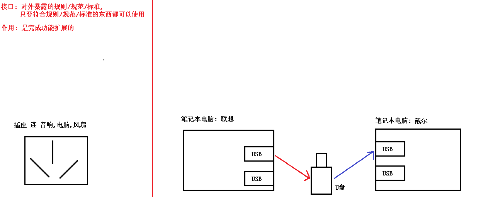
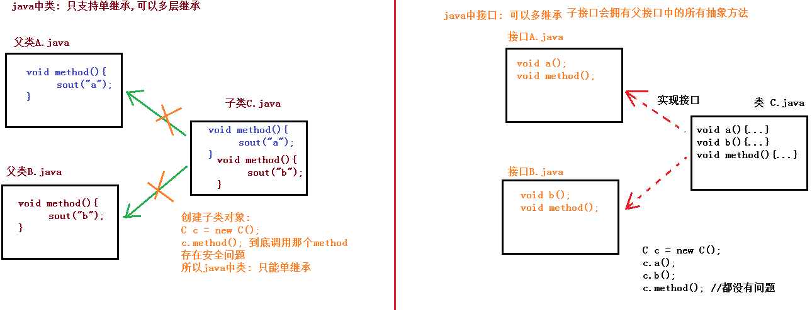
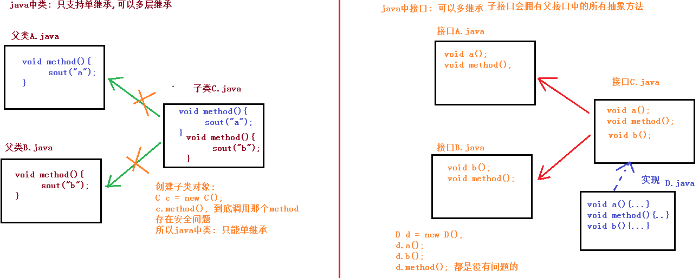

# day02 【接口、多态】

今日内容介绍

```java
接口
多态
```

## 第一章 接口

### 1.1 接口的概念【重点】

```java
1.概念:
	对外暴露的规则/规范/标准,只要符合该规则/规范/标准的东西都可以使用
	
2.接口，是Java语言中一种引用类型，编译后也有对应的class文件,是方法的汇总

3.作用: 实现对类的功能的扩展,解决java中类的单继承的局限性
```




### 1.2 接口中可以定义的内容【重点】

```java
1.抽象方法: 		  public abstract 返回值类型 方法名称(形式参数列表...);
2.默认方法【jdk8开始】: public default 返回值类型 方法名称(形式参数列表...) {...}
3.静态方法【jdk8开始】: public static 返回值类型 方法名称(形式参数列表...) {...}
4.常量：	           public staitc final 数据类型 变量名称 = 数据值;
	注意:
		接口在设计之初,目的只是为了制定一套规则/规范/标准,所以设计之初接口中只能定义抽象方法和常量
		必须要掌握接口的定义格式和接口中抽象方法的定义和使用格式【最重要】
		
```


### 1.3 接口的定义格式【重点】

```java
类的定义格式【复习】
	public class 类名 {
		//成员变量
		//成员方法
		//构造方法
		//静态方法	
	}     
接口的定义格式
	public interface 类名 {
		//常量
		//抽象方法
		//默认方法
		//静态方法	
	}  
```


### 1.4 接口中抽象方法的定义格式和使用【重点】

```java
/*
    1.接口中抽象方法的定义格式
        public abstract 返回值类型 方法名称(形式参数列表...);
        注意:
            (1)和以前定义方法格式相同,但是需要去掉{},添加abstract
            (2)返回值类型和参数列表根据需求确定
            (3)接口中抽象方法,有默认修饰符public abstract,不写也有
                抽象类中抽象方法必须写public abstract,不能省略

    2.接口中抽象方法的使用
        (1)不能直接创建接口的对象
        (2)定义实现类 实现 接口 关键字 implements
           格式:
                public class 类名 implements 接口A,接口B {
                    //覆盖重写接口中的所有的抽象方法
                }
        (3)实现类中覆盖重写接口中的所有的抽象方法
            去掉abstract关键字,添加{}
            快捷键: ctrl + i
        (4)创建实现类对象
        (5)使用实现类对象调用方法
*/
//USB接口
public interface USB {
    //抽象方法
    //开启功能
    public abstract void open();
    //抽象方法: public abstract 是默认修饰符,可以省略
    //关闭功能
    void close();
}
```

```java
//USB接口实现类U盘
public class UDisk implements USB {
    @Override
    public void open() {
        System.out.println("U盘已经开启....");
    }
    @Override
    public void close() {
        System.out.println("U盘已经关闭....");
    }    
}
```

```java
//USB接口实现类扫描仪
public class HMScanner implements USB {
    @Override
    public void open() {
        System.out.println("扫描仪已经打开...");
    }
    @Override
    public void close() {
        System.out.println("扫描仪已经关闭...");
    }   
}
```

```java
//测试类
public class Demo01Inter {
    public static void main(String[] args) {
        //创建实现类对象
        UDisk uDisk = new UDisk();
        //实现类对象调用成员方法
        uDisk.open();
        uDisk.close();
        System.out.println("==================");

        //创建实现类对象
        HMScanner hmScanner = new HMScanner();
        //实现类对象调用成员方法
        hmScanner.open();
        hmScanner.close();
    }
}
```

### 1.5 接口中默认方法的定义格式和使用【了解】

```java
/*
    接口中默认方法的定义格式和使用
        问题:
            定义接口后,有很多实现类在使用接口,如果对接口功能升级添加了新的抽象方法
            导致所有的实现类必须修改代码,太麻烦
        解决方案: 默认方法
        默认方法的定义格式:
            public default 返回值类型 方法名称(形式参数列表...){
                //方法体;
            }
        默认方法的使用: 只能使用实现类对象调用默认方法
        注意:
            1.接口中的默认方法,不强制要求实现类进行覆盖重写
            2.但是实现类可以根据需求,选择性的覆盖重写接口中的默认方法
            3.如果实现类覆盖重写接口中的默认方法,必须去掉default关键字
*/  
//定义接口
//USB接口
public interface USB {
    //抽象方法
    //开启功能
    public abstract void open();
    //抽象方法: public abstract 是默认修饰符,可以省略
    //关闭功能
    void close();
    //默认方法
    public default void driver() {
        System.out.println("USB接口提供的默认驱动程序....");
    }
}
```

```java
//USB接口实现类U盘
public class UDisk implements USB {
    @Override
    public void open() {
        System.out.println("U盘已经开启....");
    }
    @Override
    public void close() {
        System.out.println("U盘已经关闭....");
    }
    //该实现类发现接口中的默认方法可以满足需求,就不需要重写
}
```

```java
//USB接口实现类扫描仪
public class HMScanner implements USB {
    @Override
    public void open() {
        System.out.println("扫描仪已经打开...");
    }
    @Override
    public void close() {
        System.out.println("扫描仪已经关闭...");
    }
	//该实现类发现接口中的默认方法无法满足需求,进行了覆盖重写
    @Override
    public void driver() {
        System.out.println("使用扫描仪专用驱动");
    }
}
```

```java
public class Demo01Inter {
    public static void main(String[] args) {
        //创建实现类对象
        UDisk uDisk = new UDisk();
        //实现类对象调用成员方法
        uDisk.open();
        uDisk.close();
        //实现类对象调用默认方法
        uDisk.driver();
        System.out.println("==================");

        //创建实现类对象
        HMScanner hmScanner = new HMScanner();
        //实现类对象调用成员方法
        hmScanner.open();
        hmScanner.close();
        //实现类对象调用默认方法
        hmScanner.driver();        
    }
}
```


### 1.6 接口中的静态方法的定义和使用【了解】

```java
/*
    1.定义格式
        public static 返回值类型 方法名称(形式参数列表...) {
            方法体;
       }
    2.使用格式: 只能使用接口名称调用接口中的静态方法
    3.注意:
        (1)接口中的静态方法,属于接口本身,与实现类无关,在实现类中不存在覆盖重写
        (2)类中的静态方法,属于类本身,与接口无关,与对象无关
        (3)类中的静态方法:
             类名直接调用 ---推荐使用
             对象直接调用 ---不推荐使用
    总结: 静态的内容要么用接口名称调用,要么用类名称调用
*/
//USB接口
public interface USB {
    //抽象方法
    //开启功能
    public abstract void open();
    //抽象方法: public abstract 是默认修饰符,可以省略
    //关闭功能
    void close();
    //默认方法
    public default void driver() {
        System.out.println("USB接口提供的默认驱动程序....");
    }
    //静态方法
    public static void thanks() {
        System.out.println("感谢使用USB接口....");
    }
}
```

```java
//USB接口实现类U盘
public class UDisk implements USB {
    @Override
    public void open() {
        System.out.println("U盘已经开启....");
    }
    @Override
    public void close() {
        System.out.println("U盘已经关闭....");
    }	
	//静态方法
    public static void thanks() {
        System.out.println("感谢使用U盘....");
    }
}
```

```java
//USB接口实现类扫描仪
public class HMScanner implements USB {
    @Override
    public void open() {
        System.out.println("扫描仪已经打开...");
    }
    @Override
    public void close() {
        System.out.println("扫描仪已经关闭...");
    }
    @Override
    public void driver() {
        System.out.println("使用扫描仪专用驱动");
    }	
	//静态方法
    public static void thanks() {
        System.out.println("感谢使用扫描仪....");
    }
}
```

```java
public class Demo {
    public static void main(String[] args) {
        //创建实现类对象
        UDisk uDisk = new UDisk();
        //实现类对象调用成员方法
        uDisk.open();
        uDisk.close();
        //实现类对象调用默认方法
        uDisk.driver();
        //实现类名称调用静态方法
        UDisk.thanks();
        //接口名称调用静态方法
        USB.thanks();
        System.out.println("==================");

        //创建实现类对象
        HMScanner hmScanner = new HMScanner();
        //实现类对象调用成员方法
        hmScanner.open();
        hmScanner.close();
        //实现类对象调用默认方法
        hmScanner.driver();
        //实现类名称调用静态方法
        HMScanner.thanks();
        //接口名称调用静态方法
        USB.thanks();
    }
}
```

### 1.7 接口中成员变量的使用【了解】

```java
/*
    接口中成员变量的使用
    接口中定义的变量,都是常量(值不可以改变)
    默认修饰符public static final 不写也有
    接口中常量默认值认为是无效的必须显式赋值
    接口中的常量的使用: 接口名称.常量名称
    建议: 接口中常量的命名全部使用大写字母,单词之间用_分隔
*/
/*
    USB接口
        接口中不能定义变量,只能定义常量,而且常量有默认修饰符public static final
        接口中的常量默认值认为是无效的,必须显式赋值
        常量建议全部使用大写字母,单词之间使用_分隔
 */
public interface USB {
    //版本
    public static final double VERSION = 3.0;//版本
    public static final int MAX_SPEED_OF_TRANSFER = 500;//最大传输速度

    //静态方法: 展示USB接口的相关信息
    public static void show() {
        System.out.println("USB接口版本: " + VERSION + ", 最大传输速度: " + MAX_SPEED_OF_TRANSFER + "MB/s");
        //show方法和内部输出的常量,都在USB接口中,所以可以省略接口名
        System.out.println("USB接口版本: " + USB.VERSION + ", 最大传输速度: " + USB.MAX_SPEED_OF_TRANSFER + "MB/s");
    }
	//前面定义好的其它方法省略了...
}
```

```java
/*
    接口中成员变量的使用
    接口中定义的变量,都是常量(值不可以改变)
    默认修饰符public static final 不写也有
    接口中常量默认值认为是无效的必须显式赋值
    接口中的常量的使用: 接口名称.常量名称
    建议: 接口中常量的命名全部使用大写字母,单词之间用_分隔
*/
public class Demo04InterConstant {
    public static void main(String[] args) {
        //调用接口中的静态方法
        USB.show();
        System.out.println("--------");

        //直接输出接口中的常量
        System.out.println("USB接口版本: " + USB.VERSION);
        System.out.println("USB接口最大传输速度: " + USB.MAX_SPEED_OF_TRANSFER);
    }
}
```

### 1.8 接口的多实现【重点】

```java
/*
    接口的多实现
        在继承体系中，一个类只能继承一个父类【类的单继承： 亲爹只能有一个】。
        对于接口而言，一个类是可以实现多个接口的，这叫做接口的多实现
        【类实现接口的多实现： 干爹可以有多个】。并且，一个类能继承一个父类，同时实现多个接口。

    一个类能继承一个父类，同时实现多个接口格式:
        public class 子类名 extends 父类名 implements 接口名A,接口名B {
            覆盖重写抽象父类和接口中的所有的抽象方法
        }

    实现步骤:
        1.创建抽象父类AbstractClass,内部定义抽象方法
        2.创建接口MyInterA和MyInterB,内部定义抽象方法
        3.创建子类MyClass 继承 抽象父类AbstractClass 实现接口 MyInterA和MyInterB
        4.子类MyClass 覆盖重写抽象父类和接口中的所有的抽象方法
        5.创建子类MyClass的对象
        6.使用子类MyClass的对象调用方法

    注意:
        子类必须重写父类和接口中的所有抽象方法,只要有一个抽象方法没有被重写,
        该子类必须定义为抽象类,看MyClass02类
*/
```

```java
//创建抽象父类AbstractClass,内部定义抽象方法
public abstract class AbstractClass {
    //抽象方法
    public abstract void method();
}
```

```java
//2.创建接口MyInterA内部定义抽象方法
public interface MyInterA {
    //抽象方法
    void show();
}
```

```java
//2.创建接口MyInterB内部定义抽象方法
public interface MyInterB {
    //抽象方法
    void fun();
}
```

```java
//3.创建子类MyClass 继承 抽象父类AbstractClass 实现接口 MyInterA和MyInterB
public class MyClass extends AbstractClass implements MyInterA, MyInterB {
    //4.子类MyClass 覆盖重写抽象父类和接口中的所有的抽象方法
    @Override
    public void method() {
        System.out.println("MyClass...method...");
    }
    @Override
    public void show() {
        System.out.println("MyClass...show...");
    }
    @Override
    public void fun() {
        System.out.println("MyClass...fun...");
    }
}
```

```java
/*
    接口的多实现
        在继承体系中，一个类只能继承一个父类【类的单继承： 亲爹只能有一个】。
        对于接口而言，一个类是可以实现多个接口的，这叫做接口的多实现
        【类实现接口的多实现： 干爹可以有多个】。并且，一个类能继承一个父类，同时实现多个接口。

    一个类能继承一个父类，同时实现多个接口格式:
        public class 子类名 extends 父类名 implements 接口名A,接口名B {
            覆盖重写抽象父类和接口中的所有的抽象方法
        }

    实现步骤:
        1.创建抽象父类AbstractClass,内部定义抽象方法
        2.创建接口MyInterA和MyInterB,内部定义抽象方法
        3.创建子类MyClass 继承 抽象父类AbstractClass 实现接口 MyInterA和MyInterB
        4.子类MyClass 覆盖重写抽象父类和接口中的所有的抽象方法
        5.创建子类MyClass的对象
        6.使用子类MyClass的对象调用方法

    注意:
        子类必须重写父类和接口中的所有抽象方法,只要有一个抽象方法没有被重写,
        该子类必须定义为抽象类,看MyClass02类
*/
public class Demo02InterNotice {
    public static void main(String[] args) {
        //5.创建子类MyClass的对象
        MyClass myClass = new MyClass();
        //6.使用子类MyClass的对象调用方法
        myClass.method();
        myClass.show();
        myClass.fun();
    }
}
```

```java
/*
    子类继承父类 实现多个接口时,
    必须覆盖重写所有抽象方法,只要有一个抽象方法没有被重写,
    该子类必须定义为抽象类
 */
public abstract class MyClass02 extends AbstractClass implements MyInterA,MyInterB {
    @Override
    public void method() {
        System.out.println("MyClass02...method...");
    }

    @Override
    public void show() {
        System.out.println("MyClass02...show...");
    }
    /*@Override
    public void fun() {
        System.out.println("MyClass02...fun...");
    }*/
}
```




### 1.9 接口的多继承关系【了解】

```java
接口的多继承关系
	子接口会拥有父接口中的所有抽象方法
```



```java
public interface MyInter03A {
    //抽象方法
    void a();
}
```

```java
public interface MyInter03B {
    //抽象方法
    void b();
}
```

```java
public interface MyInter03C {
    //抽象方法
    void c();
}
```

```java
/*
    接口可以多继承,子接口自动拥有父接口中的所有抽象方法
 */
public interface MyInter03D extends MyInter03A, MyInter03B, MyInter03C {
    //抽象方法
    /*
        抽象方法a,b,c分别已经在其它接口中定义好了,
        此处没有必要重新定义了,只需要继承其它接口
     */
    //void a();
    //void b();
    //void c();
    void d();
}
```

```java
public class MyInter03DImpl implements MyInter03D {
    @Override
    public void a() {
        System.out.println("MyInter03DImpl...a...");
    }

    @Override
    public void b() {
        System.out.println("MyInter03DImpl...b...");
    }

    @Override
    public void c() {
        System.out.println("MyInter03DImpl...c...");
    }

    @Override
    public void d() {
        System.out.println("MyInter03DImpl...d...");
    }
}
```

```java
/*
    接口的多继承关系
	子接口会拥有父接口中的所有抽象方法
 */
public class Demo03Inter {
    public static void main(String[] args) {
        //创建接口实现类对象
        MyInter03DImpl myInter03D = new MyInter03DImpl();

        //调用成员方法
        myInter03D.a();
        myInter03D.b();
        myInter03D.c();
        myInter03D.d();
    }
}
```

## 第二章 多态

### 2.1 生活中的多态【重点】

```java
/*
    面向对象的三大特征: 封装,继承,多态
    封装: 提高代码的安全性
    继承: 提高代码的复用性
    多态: 提高代码的扩展性
    多态的概念:同一行为，通过不同的事物，可以体现出来的不同的形态。多态，描述的就是这样的状态。
    简单的理解: 同一个事物,表现出来不同的形态
    举个栗子:
        比如说你自己
            在学校中: 是一个学生
            在餐馆中: 是一个顾客
            在公司中: 是一个员工
            在你家里: 是妻子/丈夫
            回老家: 是一个孩子
            
        比如说H2O:
            在常温下: 是液体
            在高温下: 是水蒸气
            在低温下: 是固体冰
*/		
```


### 2.2 多态中的代码体现【重点】

```java
/*
    多态中的代码体现
    1.概念:
        同一行为，通过不同的事物，可以体现出来的不同的形态。多态，描述的就是这样的状态。
        java中的多态: 指的是对象具备多态性
        
    2.举例:
        假设学生Student类是人Person类的子类
        学生 是 一个学生	
        //不是多态 左侧是Student类型,右侧是Student对象,左右一致
        Student stu = new Student();

        学生 是 一个人
        //是多态 左侧是Person类型,右侧是Student对象,左右不一致,左边是父类,右边是子类对象
        Person p = new Student();

    3.多态的前提:
        (1)必须要有继承或者接口实现
        (2)必须要有父类引用指向子类对象(父类类型的变量保存子类对象的地址值)
        (3)必须要有方法的覆盖重写,否则将失去多态的意义

    4.多态的本质
        (1)就是把子类对象当成父类类型使用
            父类引用指向子类对象(父类类型的变量保存子类对象的地址值)

        (2)多态的方式调用方法,方法跟着对象走
*/
//定义父类
public class Person {
    //吃饭
    public void eat() {
        System.out.println("人吃饭...");
    }
}

//定义子类
public class Student extends Person {
    @Override
    public void eat() {
        System.out.println("学生时间比较紧张,吃点快餐,抓紧回去学习....");
    }
}

//定义子类
public class Teacher extends Person {
    @Override
    public void eat() {
        System.out.println("老师上课很辛苦,吃点好的,补一补...");
    }
}
//测试类
public class Demo01DuoTai {
    public static void main(String[] args) {
        //不是多态:左侧是Student类型,右侧是Student对象,左右一致
        Student stu = new Student();
        stu.eat();
        System.out.println("----------");

        //多态的方式创建Student类的对象
        //Person类型变量保存子类Student类型的对象
        Person p = new Student();
        p.eat();

        //Person类型变量保存子类Teacher类型的对象
        p = new Teacher();
        p.eat();
    }
}

```


### 2.3 多态中成员方法的访问特点【重点】

```java
//编译时期看左边(父类/接口),运行时期看右边(子类/实现类)
//定义抽象父类Animal02
public abstract class Animal02 {
    //抽象方法
    public abstract void eat();//吃
    public abstract void sleep();//睡
}
//定义子类Dog02 继承 抽象父类Animal02
public class Dog02 extends Animal02 {
    @Override
    public void eat() {
        System.out.println("狗吃骨头...");
    }

    @Override
    public void sleep() {
        System.out.println("小狗在眯着眼睡...");
    }

    //特有功能
    public void kanHome() {
        System.out.println("小狗在看家....");
    }
}
//测试类
public class Demo02DuoTai {
    public static void main(String[] args) {
        //多态的方式创建Animal02的对象
        Animal02 a = new Dog02();

        //调用成员方法
        /*
            在多态中把Dog02对象(子类对象)当成Animal02类型(父类)使用,
            此时Dog02对象表现的是父类Animal02的形态
            多态的方式调用eat方法
            编译时期: 检测父类Animal02中是否有eat方法的定义
            发现父类中: 有eat方法的定义,编译通过
            运行时期:   运行的是Dog02类中重写后的eat方法
         */
        a.eat();
        /*
            在多态中把Dog02对象(子类对象)当成Animal02类型(父类)使用,
            此时Dog02对象表现的是父类Animal02的形态
            多态的方式调用sleep方法
            编译时期: 检测父类Animal02中是否有sleep方法的定义
            发现父类中: 有sleep方法的定义,编译通过
            运行时期:   运行的是Dog02类中重写后的sleep方法
         */
        a.sleep();
        /*
            在多态中把Dog02对象(子类对象)当成Animal02类型(父类)使用,
            此时Dog02对象表现的是父类Animal02的形态
            多态的方式调用kanHome方法
            编译时期: 检测父类Animal02中是否有kanHome方法的定义
            发现父类中: 没有kanHome方法的定义,编译报错

         */
        //a.kanHome();
    }
}
```


### 2.4 多态的好处和弊端

```java
/*
    多态的好处和弊端
    不使用多态:
        好处: 可以调用子类的特有行为
        弊端: 扩展性极差
    使用多态:
        好处: 扩展性强
        弊端: 不可以调用子类的特有行为
*/
//测试代码
public class Demo03DuoTai {
    public static void main(String[] args) {
        //不使用多态
        Dog dog = new Dog();
        //调用成员方法
        dog.eat();
        dog.kanHome();
        dog.sleep();
        //错误: 左右两边类型不匹配
        //dog = new Cat();
        System.out.println("----------");

        //使用多态
        Animal a = new Dog();

        a.eat();
        a.sleep();
        /*
            在多态中是把Dog对象当成父类Animal类型使用,
            此时Dog对象表现的是父类Animal的形态
            多态(父类变量)调用kanHome方法
            编译时期: 检测父类Animal中是否有kanHome方法的定义
            发现父类中: 没有kanHome方法的定义,编译失败(报错了)
         */
        //a.kanHome();

        //重新把Cat对象保存到父类Animal变量a中
        a = new Cat();
        a.eat();
        a.sleep();
        /*
            在多态中是把Cat对象当成父类Animal类型使用,
            此时Cat对象表现的是父类Animal的形态
            多态(父类变量)调用catchMouse方法
            编译时期: 检测父类Animal中是否有catchMouse方法的定义
            发现父类中: 没有catchMouse方法的定义,编译失败(报错了)
         */
        //a.catchMouse();
    }
}
    

```

```java
/*
    多态的好处:
       可以使用父类/接口,作为方法的参数,提高方法的扩展性
       
    问题:
       下面分别是用Animal的子类Dog和Cat作为方法参数,定义了两个方法
       Animal的子类可以有任意多个,这样定义的方法也就会有任意多个
       每创建一个子类,就得再添加一个方法,太麻烦

       解决方案:
           所有的子类对象,都可以当做父类类型使用
           所以可以使用父类类型作为方法的参数
           
        类作为方法的参数:
            调用方法时,传递的是该类的对象或者是该类的子类对象

        类的数据体现形式是对象
        抽象类的数据体现形式是子类对象
        接口的数据体现形式是实现类对象
        暴露新的问题: 方法内部不能直接调用子类的特有行为了(后面解决)
*/
//测试类
public class Demo04DuoTai {
    public static void main(String[] args) {
        //创建Dog类型的对象
        Dog dog = new Dog();
        //调用showDog传递Dog类型的对象dog
        showDog(dog);
        System.out.println("----------------");

        //创建Cat类型的对象
        Cat cat = new Cat();
        //调用showCat传递Cat类型的对象cat
        showCat(cat);
    }

    //定义方法,参数是Dog类型
    public static void showDog(Dog dog) {
        dog.eat();
        dog.kanHome();
        dog.sleep();
    }

    //定义方法,参数是Cat类型
    public static void showCat(Cat cat) {
        cat.eat();
        cat.catchMouse();
        cat.sleep();
    }
}
//测试类
public class Demo05DuoTai {
    public static void main(String[] args) {
        //创建Dog类型的对象
        Dog dog = new Dog();
        //调用showAnimal传递Dog类型的对象dog
        showAnimal(dog);
        System.out.println("----------------");

        //创建Cat类型的对象
        Cat cat = new Cat();
        //调用showAnimal传递Cat类型的对象cat
        showAnimal(cat);
    }

    //定义方法,参数是Animal类型
    public static void showAnimal(Animal a) {
        a.eat();
        a.sleep();
        //错误: 你传递的所有对象都被当成Animal类型使用
        //然而Animal类型中没有定义kanHome和catchMouse方法
        //a.kanHome();
        //a.catchMouse();
    }

}
```


### 2.6 多态中的向上向下转型

```java
/*
	多态中的向上转型
        多态的本质(父类引用指向子类对象): 就是向上转型
        类似于 基本类型的自动类型转换
        取值范围小的数据或者变量可以直接赋值给取值范围大的变量
        int a = 100;//int: 占4个字节
        double d = a;//double: 占8个字节
        不需要进行特殊的处理
    多态中的向下转型
        类似于 基本类型的强制类型转换
        取值范围大的数据或者变量不可以直接赋值给取值范围小的变量
        double d2 = 100;//double: 占8个字节
        int c = (int)d2;//int: 占4个字节
        强制类型转换:
            转后类型 对象名称 = (转后类型)转前的对象或者变量名称;            
	注意:多态的向下转型(强制类型转换)存在安全隐患
        如果转换前的类型和转换后的类型不一致,就会报出类型转换异常(ClassCastException)
        如何解决这个问题呢?
*/
public class Demo06DuoTai {
    public static void main(String[] args) {
        //多态的方式创建Animal类型的对象: 向上转型
        Animal a = new Dog();
        //此时只能直接调用Animal中规定好的方法
        a.eat();
        a.sleep();
        /*
            在多态中是把Dog对象当成父类Animal类型使用,
            此时Dog对象表现的是父类Animal的形态
            多态(父类变量)调用kanHome方法
            编译时期: 检测父类Animal中是否有kanHome方法的定义
            发现父类中: 没有kanHome方法的定义,编译失败(报错了)
         */
        //a.kanHome();
        //把Cat对象重新存储到Animal变量中
        a = new Cat();
        //向下转型: 把Animal类型的变量a,强制转换成Dog类型
        Dog dog = (Dog)a;
        //就可以调用Dog类的特有行为了
        dog.kanHome();
    }
}
    
```


### 2.7 instanceof关键字

```java
/*
    强制类型转换(向下转型)存在安全隐患:
        如果转后类型和创建对象的具体类型不一致,报出类型转换异常 ClassCastException
    
    如何解决呢?
        如果变量a指向的是Dog类型,把Animal类型的变量a强制转换成Dog类型
        如果变量a指向的是Cat类型,把Animal类型的变量b强制转换成Cat类型
    
    如何判断变量a指向的到底是哪种类型的对象呢?
        使用instanceof关键字
        使用格式:
            boolean result = 对象名 instanceof 类名
                如果对象名称中保存的是该类的对象,返回true。
                如果对象名称中保存的不是该类的对象,返回false。
*/
```

```java
//测试类
public class Demo07DuoTai {
    public static void main(String[] args) {
        //多态的方式创建Animal类型的对象: 向上转型
        //Animal a = new Dog();
        Animal a = new Cat();
        //此时只能直接调用Animal中规定好的方法
        a.eat();
        a.sleep();
        //如果引用变量a存储的是Dog类型的变量
        if (a instanceof Dog) {
            //向下转型: 把Animal类型的变量a,强制转换成Dog类型
            Dog dog = (Dog)a;
            //就可以调用Dog类的特有行为了
            dog.kanHome();
        }
        //如果引用变量a存储的是Cat类型的变量
        if (a instanceof Cat) {
            //向下转型: 把Animal类型的变量a,强制转换成Cat类型
            Cat cat = (Cat)a;
            //就可以调用Cat类的特有行为了
            cat.catchMouse();
        }
    }
}
/*
	测试类
	类作为方法的参数:
        调用方法时,传递的是该类的对象或者是该类的子类对象
    类的数据体现形式是对象
    抽象类的数据体现形式是子类对象
    接口的数据体现形式是实现类对象
    暴露新的问题: 方法内部不能直接调用子类的特有行为了
    解决方案: 使用instanceof + 向下转型
*/
public class Demo08DuoTai {
    public static void main(String[] args) {
        //创建Dog类型的对象
        Dog dog = new Dog();
        //调用showAnimal传递Dog类型的对象dog
        showAnimal(dog);
        System.out.println("----------------");
        //创建Cat类型的对象
        Cat cat = new Cat();
        //调用showAnimal传递Cat类型的对象cat
        showAnimal(cat);
    }
    //定义方法,参数是Animal类型
    public static void showAnimal(Animal a) {
        a.eat();
        a.sleep();
        //如果引用变量a存储的是Dog类型的变量
        if (a instanceof Dog) {
            //向下转型: 把Animal类型的变量a,强制转换成Dog类型
            Dog dog = (Dog)a;
            //就可以调用Dog类的特有行为了
            dog.kanHome();
        }
        //如果引用变量a存储的是Cat类型的变量
        if (a instanceof Cat) {
            //向下转型: 把Animal类型的变量a,强制转换成Cat类型
            Cat cat = (Cat)a;
            //就可以调用Cat类的特有行为了
            cat.catchMouse();
        }
    }
}
```

## 第三章  综合案例1--笔记本案例【重点】

### 3.1 笔记本综合案例分析

```java
定义笔记本类，具备开机，关机和使用USB设备的功能。具体是什么USB设备，笔记本并不关心，只要符合USB规格的设备都可以。 鼠标和键盘要想能在电脑上使用，那么鼠标和键盘也必须遵守USB规范，不然鼠标和键盘的生产出来无法使用; 进行描述笔记本类，实现笔记本使用USB鼠标、USB键盘

USB接口，包含开启功能、关闭功能
笔记本类，包含运行功能、关机功能、使用USB设备功能
鼠标类，要符合USB接口
键盘类，要符合USB接口

```

/05_%E7%AC%94%E8%AE%B0/img/1600521525598.png)

### 3.2 笔记本综合案例实现步骤分析

```java
1.定义USB接口
	抽象方法: 开启功能,关闭功能
2.定义笔记本Computer类
	成员方法: 开机功能,使用USB接口的功能,关机功能
3.定义鼠标Mouse类 实现 USB接口
	(1)覆盖重写抽象方法:开启功能,关闭功能
    (2)定义特有方法: 点击鼠标功能
4.定义键盘KeyBoard类 实现 USB接口
	(1)覆盖重写抽象方法:开启功能,关闭功能
    (2)定义特有方法: 敲击功能
5.测试类
	(1)创建笔记本Computer类的对象
	(2)创建外部设备鼠标Mouse类的对象
	(3)创建外部设备键盘KeyBoard类的对象
	(4)笔记本Computer类的对象调用开机功能
	(5)笔记本Computer类的对象调用使用USB接口的功能,传递外部设备鼠标Mouse类的对象
	(6)笔记本Computer类的对象调用使用USB接口的功能,传递外部设备键盘KeyBoard类的对象
	(7)笔记本Computer类的对象调用关机功能
```


### 3.3 笔记本综合案例代码实现

```java
/*
    1.定义USB接口
        抽象方法: 开启功能,关闭功能
 */
public interface USB {
    //抽象方法: 开启功能
    public abstract void open();

    //抽象方法: 关闭功能
    public abstract void close();
}
/*
    2.定义笔记本Computer类
        成员方法: 开机功能,使用USB接口的功能,关机功能
 */
public class Computer {
    //成员方法: 开机功能
    public void powerOn() {
        System.out.println("开机....");
    }


    /*
    //下面的定义方式不好,因为有多少外部设备就得定义多少方法
    //但是所有的外部设备都可以当成USB接口使用
    //可以定义方法使用USB接口作为参数

    //成员方法: 使用鼠标Mouse的功能
    public void useMouse(Mouse mouse) {

    }
    //成员方法: 使用键盘KeyBoard的功能
    public void useMouse(KeyBoard keyBoard) {

    }
    */

    //成员方法: 使用USB接口的功能
    /*
        方法被调用时:
            USB usb = 0x666 = new Mouse();//多态
     */
    public void useUSB(USB usb) {
        //传递进来的所有外部设备都当成USB接口使用
        //只能直接调用USB接口中规定的方法
        //调用开启设备的功能
        usb.open();


        //想调用特有方法,必须进行强制类型转换
        //判断如果usb变量中保存的是Mouse类的对象
        if (usb instanceof Mouse) {
            //把USB类型的变量usb,强制转换成Mouse类型的变量
            Mouse mouse = (Mouse)usb;

            //调用点击鼠标的功能
            mouse.click();
        }

        //判断如果usb变量中保存的是KeyBoard类的对象
        if (usb instanceof KeyBoard) {
            //把USB类型的变量usb,强制转换成KeyBoard类型的变量
            KeyBoard keyBoard = (KeyBoard)usb;

            //调用敲击键盘的功能
            keyBoard.type();
        }

        //调用关闭设备的功能
        usb.close();
    }

    //成员方法: 关机功能
    public void powerOff() {
        System.out.println("关机...");
    }
}
/*
    3.定义鼠标Mouse类 实现 USB接口
        (1)覆盖重写抽象方法:开启功能,关闭功能
        (2)定义特有方法: 点击鼠标功能
 */
public class Mouse implements USB {
    //(1)覆盖重写抽象方法:开启功能
    @Override
    public void open() {
        System.out.println("鼠标开启,红灯闪闪...");
    }

    //(1)覆盖重写抽象方法:关闭功能
    @Override
    public void close() {
        System.out.println("鼠标关闭,红灯闪闪...");
    }

    //(2)定义特有方法: 点击鼠标功能
    public void click() {
        System.out.println("点击鼠标,打开文件...");
    }
}
/*
    4.定义键盘KeyBoard类 实现 USB接口
        (1)覆盖重写抽象方法:开启功能,关闭功能
        (2)定义特有方法: 敲击功能
 */
public class KeyBoard implements USB{
    //(1)覆盖重写抽象方法:开启功能
    @Override
    public void open() {
        System.out.println("键盘开启,绿灯闪闪...");
    }
    //(1)覆盖重写抽象方法:关闭功能
    @Override
    public void close() {
        System.out.println("键盘关闭,绿灯闪闪...");
    }
    //(2)定义特有方法: 敲击功能
    public void type() {
        System.out.println("敲击键盘,向文件中写内容...");
    }
}
//测试类
public class Demo03Computer {
    public static void main(String[] args) {
        //(1)创建笔记本Computer类的对象
        Computer computer = new Computer();

        //(2)创建外部设备鼠标Mouse类的对象
        Mouse mouse = new Mouse();//假设地址值: 0x666

        //(3)创建外部设备键盘KeyBoard类的对象
        KeyBoard keyBoard = new KeyBoard();

        //(4)笔记本Computer类的对象调用开机功能
        computer.powerOn();

        //(5)笔记本Computer类的对象调用使用USB接口的功能,传递外部设备鼠标Mouse类的对象
        //调用方法: computer.useUSB(0x666)
        computer.useUSB(mouse);

        //(6)笔记本Computer类的对象调用使用USB接口的功能,传递外部设备键盘KeyBoard类的对象
        computer.useUSB(keyBoard);

        //(7)笔记本Computer类的对象调用关机功能
        computer.powerOff();
    }
}

```


