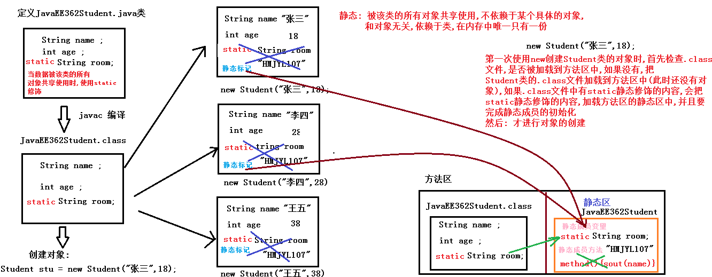

# <center>内部类和修饰符</center>
[toc]
## final关键字
### 概述
final代表不可变，可用于修饰类，方法和变量
### 修饰类
+ 被修饰的类不能被修改
```java
//格式：
public final class 类名{
    代码块;
}
```
### 修饰方法
+ 被修饰的方法不能被覆盖，继承的使用还是可以的
```java
//格式：
修饰符 final 返回值类型 方法名(参数){
    方法体;
    return 返回值类型;
        }
```
+ 注：final和abstract不行同时被使用  
final：不能被覆盖重写  
abstract：抽象方法中使用，必须重写  
  二者发送冲突不能同时使用
### 修饰变量
+ 修饰局部变量：  
  1.特点: 只能赋值一次,不可以进行第二次赋值,变量的值是不可以发生改变的，称为常量
```java
格式：
修饰符 返回值类型 方法名(final 基本数据类型 参数名称1){
    final  基本数据类型 变量名称2;
    final  基本数据类型 变量名称3=数据值;
    return 结果数据;
}
特点：
1、方法参数上final修饰的基本数据类型局部变量，方法内部不能进行再次赋值/修改值。  
2、方法内部final修饰的基本数据类型局部变量，不能进行第二次赋值。
3、final修饰两种类型的变量:  
        (1)基本类型: 基本类型变量中存储的具体的数字是不可以被改变的
        (2)引用类型: 存储的对象的地址值,被final修饰后,说明变量存储的对象的地址值是不可以被改变的，但是该地址代表的内存空间中的内容是可以改变的
```
+ 修饰成员变量：
```java
格式：
final 数据类型 变量名;
final 数据类型 变量名 = 值;
修饰成员变量的两种情况：
        (1)定义未赋值：
                所有构造方法中,必须完成对final修饰的变量的赋值,数据类型默认值无效
                所有成员方法中,不能修改final修饰的变量的值
        (2)定义并赋值:
                所有构造方法/成员方法中,不能修改final修饰的变量的值
```
```java
//空参构造
    public MyClass03() {
        num = 10;
        //num2 = 200;//错误
    }

    //有参构造
    public MyClass03(int num) {
        this.num = num;
        //num2 = 200;//错误
    }

    //满参构造
    public MyClass03(String name, int num) {
        this.name = name;
        this.num = num;
        //num2 = 200;//错误
    }
```
### 权限修饰符
| 作用域 | public | protected | 默认(什么都不写) | private |
|:-------:|:-----:|:----:|:----:|:---:|
|在同一个类中|√|√|√|√|
|在同一个包中|√|√|√||
|不同包的子类|√|√|||
|不同包的无关类|√||||
## static关键字
### 概念
被该类的所有对象共享使用,不依赖于某个具体的对象,和对象无关,依赖于类,在内存中唯一只有一份

### 类的加载过程:
第一次使用new创建Student类的对象时,首先检查.class文件,是否被加载到方法区中,如果没有,把
Student类的.class文件加载到方法区中(此时还没有对象),如果.class文件中有static静态修饰的内容,
会把static静态修饰的内容,加载方法区的静态区中,并且要完成静态成员的初始化然后: 才进行对象的创建

### static静态修饰
+ 使用static修饰被调用的时候使用类名来调用，与对象无关
#### 修饰成员变量的使用
```java
static修饰修饰成员变量(类变量: 依赖于类,与对象无关)
1.定义格式:
    static 数据类型 变量名称 = 数据值;

2.使用格式:
    类名.静态成员变量名称;        推荐使用
    对象名.静态成员变量名称;      不推荐使用
```
#### 修饰成员方法的使用
```java
static修饰成员方法(类方法: 依赖于类,与对象无关)
1.定义格式:
    public static 返回值类型 方法名称(参数列表...) {...}

2.使用格式:
   类名.静态成员方法名称(...)        推荐使用
    对象名.静态成员方法名称(...)      不推荐使用
    
3.注意:
	静态成员变量也有默认初始化值
```
#### 静态的注意事项
静态的内容只能使用静态的内容,不能使用非静态的内容  
1. 解释:  
  + 静态当中不能使用非静态
  + 静态的内容,是最先被加载到内存方法区中的静态区中,并完成初始化,但是此时没有对象(非静态的内容存在于对象中)既然没有对象,就不能使用非静态的内容
  + 静态(先人),非静态(后人)  
2. 静态的注意事项
  + 静态方法可以直接访问静态变量和静态方法。
  + 静态方法不能直接访问非静态成员变量或非静态成员方法。 反之，非静态方法可以直接访问静态变量或静态方法。 
  + 静态方法中，不能使用this关键字。
```java
//此类只针对老师
public class Teacher {
    String name;//不能使用static修饰: 属于每个对象的特有数据
    static String country = "CHINA";//使用static修饰: 属于所有对象的共享数据

    //静态方法
    public static void show() {
        //静态方法中可以直接使用静态成员变量
        //静态的内容是统一最先被加载到内存的静态区的
        System.out.println("国籍: "+country);
        /*
            静态内容是最先被加载到内存的静态区中的,此时没有对象(哪来的this),
            而非静态的成员变量存在于对象中,既然没有对象,就不能使用非静态内容
         */
        //System.out.println("姓名: "+name);

        //System.out.println("姓名: "+this.name);

        //调用静态
        //method方法和show方法在同一个类中,可以省略类名
        method();
        //Teacher.method();

        /*
            静态内容是最先被加载到内存的静态区中的,此时没有对象,
            而非静态的成员方法存在于对象中,既然没有对象,就不能使用非静态内容
         */
        //printName();

    }

    //静态方法
    public static void method() {
        System.out.println("静态方法...method...");
    }

    //非静态方法
    public void printName() {
        /*
            非静态方法必须由对象调用,对象都已经有了,
            class文件早已经被加载到内存中了,
            那静态的内容也已经被加载到内存中并初始化了
         */
        System.out.println("姓名: "+name+", 国籍: "+country);

        //调用静态方法
        show();

    }
}
```
```java
//测试类
public class Demo06StaticNotice {
    public static void main(String[] args) {
        //直接使用类名调用静态方法,根本没有对象
        //HMTeacher.show();

        //创建对象
        HMTeacher ht = new HMTeacher();

        //对象调用成员方法
        ht.printName();
    }
}
```
#### 静态代码块
```
静态代码块
1.格式:
	static {
    	...
	}

2.特点:
    (1)假如只创建对象,静态代码块会优先于构造方法执行,唯一执行一次
    (2)静态代码块,随着类的加载而加载并唯一执行一次
    (3)完成静态成员变量的赋值
    (4)静态代码块,仍然属于静态内容,内部不能使用非静态
    (5)完成项目的初始化工作

```
```java
//此类只针对咱们中国人
public class Person {
    String name;//不能使用static修饰: 每个对象的特有数据
    static String country = "CHINESE";//必须使用static修饰: 所有的对象的共享数据

    //空参构造方法
    public Person(){
        System.out.println("空参构造被执行了...");
    }

    //静态代码块
    static {
        System.out.println("静态代码块执行了...");
        //(3)完成静态成员变量的赋值
        country = "CHINA";
        //(4)静态代码块,仍然属于静态内容,内部不能使用非静态
        /*
            name属于非静态成员变量,必须由对象调用,
            但是静态代码块执行时,还没有完成对象的创建,
            所以静态代码块中不能使用非静态的内容
         */
        //System.out.println(name);
        /*
            this代表对象,但是静态代码块执行时,还没有完成对象的创建
         */
        //System.out.println(this.name);

        //(5)完成项目的初始化工作
        init();
    }

    //模拟项目初始化的方法
    public static void init() {
        System.out.println("项目正在完成初始化,需要稍等10秒钟....");
        for (int i = 10; i > 0; i--) {
            //此代码直接复制,后面多线程中讲解
            try {
                Thread.sleep(1000);//1000毫秒,程序在此处休眠1000毫秒(1秒)
            } catch (InterruptedException e) {
                e.printStackTrace();
            }
            System.out.println(i);
        }
        System.out.println("项目初始化完成,你可以尽情使用了....");
    }
}
```
```java
public class Demo07StaticKuai {
    public static void main(String[] args) {
        System.out.println(Person.country);
    }
}
```
## 内部类
### 概念
将一个类A定义在另一个类B里面，里面的那个类A就称为内部类，B则称为外部类。  
举例:  
+ 汽车(外部类)内部有个发动机(内部类)
+ 人体(外部类)内部有心肝脾肺肾(内部类)
+ 定义一个类来描述一个事物时,该类的内部又定义了一个/多个类来描述其内部的事物
+ 一个东西(外部类)内部包含另外一个/多个东西(内部类)
### 分类:
1. 成员内部类: 定义在外部类的成员位置(和成员变量/成员方法 地位相同)
可以使用: public/private/static进行修饰
2. 局部内部类: 定义在外部类的方法内部,该内部类出了方法就没有用了
#### 成员内部类的定义和使用 
```java
/*
成员内部类(和成员变量/成员方法 处于同一位置)
1.定义格式:
	public class 外部类名 {//外部类
        //外部类成员变量
        //外部类成员方法
        //外部类构造方法
        //成员内部类
        public class 内部类名 {
            //内部类成员变量
        	//内部类成员方法
        	//内部类构造方法
        }
    }

2.成员内部类的使用格式:
	(1)外部类要访问内部类的成员，必须要建立内部类的对象。
        外部类.内部类 对象名 = 外部类对象.new 内部类();
        外部类.内部类 对象名 = new 外部类().new 内部类();
        简单来讲: 外.内 对象名 = new 外().new 内();

    (2)内部类可以直接访问外部类的成员，包括私有成员。

3.注意:
 	(1)内部类也是类,编译后也有对应的class文件: 外部类名$内部类名.class
    (2)内部类可以使用public修饰,也可以使用private修饰,还可以使用static修饰
    (3)可以在方法内部定义内部类(局部内部类),出了方法就失效了(必须在方法内部创建内部类的对象并使用)
*/ 
```
#### 内部类中3个重名变量的使用
```java
内部类中3个重名变量的使用
直接写变量名: 方法内部局部变量
this.变量名: 内部类成员变量
Outer.this.变量名: 外部类成员变量
```
#### 匿名内部类引入
```java
/*
	需求: 
		调用一次FlyAble接口中的抽象方法fly
	实现步骤:
    	1.定义实现类实现FlyAble接口
    	2.实现类覆盖重写FlyAble接口的所有抽象方法
    	3.创建实现类的对象
    	4.实现类对象调用fly方法

	发现问题:
    	就为了调用一次FlyAble接口中的fly方法,我们目前需要定义实现类实现接口,
    	实现类覆盖重写接口中所有的抽象方法,创建实现类对象,实现类对象调用方法,
    	总共需要四步完成,太麻烦

	解决方案: 匿名内部类对象
*/
```
#### 匿名内部类的使用
```java
/*
    匿名内部类对象
    1.概念:
        是内部类的简化写法。它的本质是一个 带具体实现的 父类或者父接口的 匿名的 子类对象。

    2.作用:
        (1)是一种创建接口实现类对象的快捷方式
            把创建实现类,覆盖重写抽象方法,创建实现类对象,实现类对象调用方法这四步合成一步完成

        (2)是一种创建抽象父类的子类对象的快捷方式
            把创建子类,覆盖重写抽象方法,创建子类对象,子类对象调用方法这四步合成一步完成

    3.匿名内部类对象创建格式:
        new 抽象父类/接口(); //错误: 不能直接new抽象父类/接口的对象

        new 抽象父类/接口() {
            覆盖重写所有的抽象方法;
        }

        注意:
            (1)上面只是创建了一个抽象父类的子类对象或者接口的实现类对象
            (2)该对象目前没有名字
            (3)该对象所属的类是没有名字的
                (注意:其实有名字(外部类名$1.class),只是该名字不是我们起的,是JVM帮助我们起的)
*/
```
