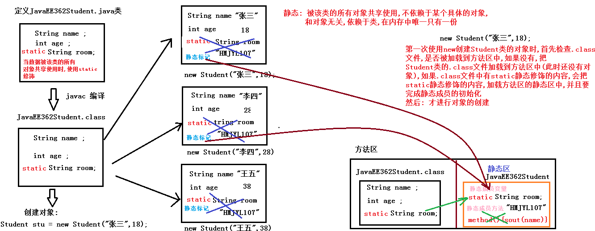

# day03 【修饰符，内部类】

今日内容介绍

```java
final关键字
static关键字
访问权限
内部类
```

## 第一章 final关键字

### 1.1 final的概述【重点】

```java
final关键字: 代表最终的,不可改变
可以修饰的内容:
1.类:
    不可以被继承,不能够有子类
    看: MyString和MyArrayList
    称之为太监类: 不能有子类,但是有父类
2.方法:
    不能被子类覆盖重写

3.变量:   只能赋值一次,不可以进行第二次赋值,变量的值是不可以发生改变的     常量
```


### 1.2 final修饰的类的特点【重点】01

```java
final修饰的类的特点
    该类不可以被继承,不能有子类
//父类
public final class Fu01 extends Object {
    public void method() {
        System.out.println("Fu01...method...");
    }
    public void show() {
        System.out.println("Fu01...show...");
    }
}
/*
    子类: Fu01被final修饰以后,不能被继承,不能有子类
    太监类,没有子类,但是有父类
 */
public class Zi01 /*extends Fu01*/ {
}

//String类被final修饰,不能有子类
public class MyString /*extends String*/ {
}
//ArrayList集合没有被final修饰,可以被继承
public class MyArrayList extends ArrayList {
    public MyArrayList(int initialCapacity) {
        super(initialCapacity);
    }

    public MyArrayList() {
    }

    public MyArrayList(Collection c) {
        super(c);
    }
}
```


### 1.3 final修饰的方法的特点【重点】02

```java
被final修饰的方法: 不能被子类覆盖重写

//父类
public class Fu02 {
    public final void method() {
        System.out.println("Fu02...method...");
    }

    public void show() {
        System.out.println("Fu02...show...");
    }
}
//子类
public class Zi02 extends Fu02 {
    /*
    //父类method方法被final修饰,子类不能进行覆盖重写
    @Override
    public void method() {
        System.out.println("Zi02...method...");
    }*/

    //子类如果可以重写父类的方法,
    //子类重写后的方法可以添加final关键字
    @Override
    public final void show() {
        System.out.println("Zi02...show...");
    }
}
//测试类
public class Demo02FinalMethod {
    public static void main(String[] args) {
        //创建子类对象
        Zi02 zi02 = new Zi02();

        zi02.method();
        zi02.show();
    }
}
```

### 1.4 final修饰的变量的特点【重点】03

```java
final修饰变量:   
	1.特点: 只能赋值一次,不可以进行第二次赋值,变量的值是不可以发生改变的     常量
    2.修饰局部变量(方法内部定义的变量):
    	(1)基本类型: 基本类型变量中存储的具体的数字是不可以被改变的

    	(2)引用类型: 存储的对象的地址值,被final修饰后,说明变量存储的对象的地址值是不可以被改变的
                            但是该地址代表的内存空间中的内容是可以改变的

    3.成员变量: 看MyClass03 认为默认值无效,要么显式赋值,要么构造方法中赋值
        (1)定义未赋值:
            所有构造方法中,必须完成对final修饰的变量的赋值
            所有成员方法中,不能修改final修饰的变量的值

        (2)定义并赋值:
            所有构造方法/成员方法中,不能修改final修饰的变量的值
```

```java
//final修饰局部变量
public class Demo03FinalVar {
    public static void main(String[] args) {
        final int num = 10;//定义变量,并第一次赋值
        System.out.println(num);//10
        //num = 20;//错误: 不能进行第二次赋值(不能修改变量中的值)

        final int num2;//定义变量,未赋值

        num2 = 100;//正确: 第一次赋值

        System.out.println(num2);//100

        //num2 = 1000;//错误: 不能进行第二次赋值(不能修改变量中的值)

        System.out.println("--------------");

        //创建Student类的对象
        final Student stu = new Student("张三", 18);

        stu.show();

        //stu被final修饰,存储的地址值是不可以发生改变的
        //stu = new Student("李四",28);


        stu.setName("李四");
        stu.setAge(28);

        stu.show();
        System.out.println("-------------");

        //数组名保存地址值,被final修饰后,地址值不可以被改变
        final int[] arr = new int[]{10,20,30};
        System.out.println(Arrays.toString(arr));

        //arr = new int[]{100,200,300};

        //把每个元素扩大10被
        for (int i = 0; i < arr.length; i++) {
            arr[i] *= 10;
        }
        System.out.println(Arrays.toString(arr));
    }
}
//final修饰成员变量
public class Demo03FinalVar2 {
    String name;
    //定义未赋值
    final int num;
    //定义并赋值
    final int num2 = 20;
    //空参构造
    public Demo03FinalVar2() {
        num = 10;
        //错误: 第二次赋值
        //num2 = 200;
    }
    //满参构造
    public Demo03FinalVar2(String name) {
        this.name = name;
        num = 10;
        //错误: 第二次赋值
        //num2 = 200;
    }
    //成员方法
    public void show() {
        //num = 100;
        //错误: 第二次赋值
        //num2 = 200;
    }
}

```


### 1.5 权限修饰符 04

```java
在java中有四种权限修饰符：范围从大到小分别是：public、protect、default(friendly)、private
```

| 作用域                    | public | protected | 默认(什么都不写) | private |
| ------------------------- | :----: | :-------: | :--------------: | :-----: |
| 在同一个类中              |   √    |     √     |        √         |    √    |
| 在同一个包中(子类/无关类) |   √    |     √     |        √         |         |
| 不同包的子类              |   √    |     √     |                  |         |
| 不同包的无关类            |   √    |           |                  |         |

```java
//父类: com.itheima04包中
public class Fu04 {
    //用四种权限定义不同的变量
    public int a = 1;
    protected int b = 11;
    int c = 111;
    private int d = 1111;

    //成员方法
    //在同一个类中,四种权限都可以使用
    public void show() {
        System.out.println(a);
        System.out.println(b);
        System.out.println(c);
        System.out.println(d);
    }
}
//子类: com.itheima04包中
//同一个包中的子类: 除了private以外,另外三种权限都可以使用
public class Zi04 extends Fu04 {

    public void method() {
        System.out.println(a);
        System.out.println(b);
        System.out.println(c);
        //System.out.println(d);
    }
}
//无关类: com.itheima04包中
public class Demo04QuanXian {
    public static void main(String[] args) {
        //创建Fu04类的对象
        Fu04 fu04 = new Fu04();
        System.out.println(fu04.a);
        System.out.println(fu04.b);
        System.out.println(fu04.c);
        //同一个包中的无关类: 除了private以外,另外三种权限都可以使用
        //System.out.println(fu04.d);
    }
}
//不同包子类:com.itheima04.sub包中
//不同包的子类: 除了private和默认权限以外,另外两种权限都可以使用
public class Zi0402 extends Fu04 {
    public void fun() {
        System.out.println(a);
        System.out.println(b);
        //System.out.println(c);
        //System.out.println(d);
    }
}
//不同包无关类:com.itheima04.sub包中
//在不同的包的无关类: 只有public权限可以使用,其余权限不能用
public class Demo04WuGuan {
    public static void main(String[] args) {
        //创建Fu04类的对象
        Fu04 fu04 = new Fu04();
        System.out.println(fu04.a);
        //System.out.println(fu04.b);
        //System.out.println(fu04.c);
        //System.out.println(fu04.d);
    }
}
```


## 第二章 static关键字

### 2.1 static关键字的概念【重点】

```java
static关键字:
1.概念:
    被该类的所有对象共享使用,不依赖于某个具体的对象,和对象无关,依赖于类,在内存中唯一只有一份

2.类的加载过程:
    第一次使用new创建Student类的对象时,首先检查.class文件,是否被加载到方法区中,如果没有,把
    Student类的.class文件加载到方法区中(此时还没有对象),如果.class文件中有static静态修饰的内容,
    会把static静态修饰的内容,加载方法区的静态区中,并且要完成静态成员的初始化然后: 才进行对象的创建
```



### 2.2 static修饰成员变量的使用【重点】

```java
static修饰修饰成员变量(类变量: 依赖于类,与对象无关)
1.定义格式:
    static 数据类型 变量名称 = 数据值;

2.使用格式:
    类名.静态成员变量名称;        推荐使用
    对象名.静态成员变量名称;      不推荐使用
```


### 2.3 static修饰成员方法的使用【重点】05

```java
static修饰成员方法(类方法: 依赖于类,与对象无关)
1.定义格式:
    public static 返回值类型 方法名称(参数列表...) {...}

2.使用格式:
   类名.静态成员方法名称(...)        推荐使用
    对象名.静态成员方法名称(...)      不推荐使用
    
3.注意:
	静态成员变量也有默认初始化值
```

```java

public class JavaEE372Student {
    String name;//不能使用static修饰: 属于每个对象的特有数据
    static String room;//使用static修饰: 属于所有对象的共享数据

    //定义静态方法
    public static void show() {
        System.out.println("班级: "+room);
    }
}
//测试类
public class Demo05Static {
    public static void main(String[] args) {
        System.out.println(JavaEE370Student.room);//null
        //创建JavaEE372Student类的对象
        JavaEE372Student stu = new JavaEE372Student();
        //不推荐使用对象调用静态成员
        System.out.println(stu.room);//null

        System.out.println("---------");
        //给静态成员赋值
        JavaEE372Student.room = "HMTBD1002";
        System.out.println(JavaEE372Student.room);//HMTBD1002
        System.out.println(stu.room);//HMTBD1002

        System.out.println("---------");
        JavaEE372Student stu2 = new JavaEE372Student();

        stu2.room = "HMTBD1003";

        System.out.println(stu.room);//HMTBD1003
        System.out.println(stu2.room);//HMTBD1003
        System.out.println(JavaEE372Student.room);//HMTBD1003

        System.out.println("---------");
        //调用静态成员方法
        //推荐使用类名调用
        JavaEE372Student.show();//班级: HMTBD1003

        //不推荐使用对象调用
        stu.show();//班级: HMTBD1003
    }
}

```

### 2.4 静态的注意事项【了解】06

```java
静态的内容只能使用静态的内容,不能使用非静态的内容
        1.解释:
            (1)静态当中不能使用非静态
            (2)静态的内容,是最先被加载到内存方法区中的静态区中,并完成初始化,但是此时没有对象(非静态的内容存在			于对象中)既然没有对象,就不能使用非静态的内容
            (3)静态(先人),非静态(后人)

        2.静态的注意事项
            (1)静态方法可以直接访问静态变量和静态方法。
            (2)静态方法不能直接访问非静态成员变量或非静态成员方法。
                反之，非静态方法可以直接访问静态变量或静态方法。
            (3)静态方法中，不能使用this关键字。
```

```java
//此类只针对黑马的老师
public class HMTeacher {
    String name;//不能使用static修饰: 属于每个对象的特有数据
    static String country = "CHINA";//使用static修饰: 属于所有对象的共享数据

    //静态方法
    public static void show() {
        //静态方法中可以直接使用静态成员变量
        //静态的内容是统一最先被加载到内存的静态区的
        System.out.println("国籍: "+country);
        /*
            静态内容是最先被加载到内存的静态区中的,此时没有对象(哪来的this),
            而非静态的成员变量存在于对象中,既然没有对象,就不能使用非静态内容
         */
        //System.out.println("姓名: "+name);

        //System.out.println("姓名: "+this.name);

        //调用静态
        //method方法和show方法在同一个类中,可以省略类名
        method();
        //HMTeacher.method();

        /*
            静态内容是最先被加载到内存的静态区中的,此时没有对象,
            而非静态的成员方法存在于对象中,既然没有对象,就不能使用非静态内容
         */
        //printName();

    }

    //静态方法
    public static void method() {
        System.out.println("静态方法...method...");
    }

    //非静态方法
    public void printName() {
        /*
            非静态方法必须由对象调用,对象都已经有了,
            class文件早已经被加载到内存中了,
            那静态的内容也已经被加载到内存中并初始化了
         */
        System.out.println("姓名: "+name+", 国籍: "+country);

        //调用静态方法
        show();

    }
}
//测试类
public class Demo06StaticNotice {
    public static void main(String[] args) {
        //直接使用类名调用静态方法,根本没有对象
        //HMTeacher.show();

        //创建对象
        HMTeacher ht = new HMTeacher();

        //对象调用成员方法
        ht.printName();
    }
}
```


### 2.6 静态代码块【重点】07

```java
静态代码块
1.格式:
	static {
    	...
	}

2.特点:
    (1)假如只创建对象,静态代码块会优先于构造方法执行,唯一执行一次
    (2)静态代码块,随着类的加载而加载并唯一执行一次
    (3)完成静态成员变量的赋值
    (4)静态代码块,仍然属于静态内容,内部不能使用非静态
    (5)完成项目的初始化工作

```

```java
/*
    静态代码块
    1.格式:
        static {
            ...
        }

    2.特点:
        (1)假如只创建对象,静态代码块会优先于构造方法执行,唯一执行一次
        (2)静态代码块,随着类的加载而加载并唯一执行一次
        (3)完成静态成员变量的赋值
        (4)静态代码块,仍然属于静态内容,内部不能使用非静态
        (5)完成项目的初始化工作
 */
public class Demo07StaticKuai {
    public static void main(String[] args) {
        //创建对象
        //Person p = new Person();
        //Person p2 = new Person();

        System.out.println(Person.country);
    }
}
//此类只针对咱们中国人
public class Person {
    String name;//不能使用static修饰: 每个对象的特有数据
    static String country = "CHINESE";//必须使用static修饰: 所有的对象的共享数据

    //空参构造方法
    public Person(){
        System.out.println("空参构造被执行了...");
    }

    //静态代码块
    static {
        System.out.println("静态代码块执行了...");
        //(3)完成静态成员变量的赋值
        country = "CHINA";
        //(4)静态代码块,仍然属于静态内容,内部不能使用非静态
        /*
            name属于非静态成员变量,必须由对象调用,
            但是静态代码块执行时,还没有完成对象的创建,
            所以静态代码块中不能使用非静态的内容
         */
        //System.out.println(name);
        /*
            this代表对象,但是静态代码块执行时,还没有完成对象的创建
         */
        //System.out.println(this.name);

        //(5)完成项目的初始化工作
        init();
    }

    //模拟项目初始化的方法
    public static void init() {
        System.out.println("项目正在完成初始化,需要稍等10秒钟....");
        for (int i = 10; i > 0; i--) {
            //此代码直接复制,后面多线程中讲解
            try {
                Thread.sleep(1000);//1000毫秒,程序在此处休眠1000毫秒(1秒)
            } catch (InterruptedException e) {
                e.printStackTrace();
            }
            System.out.println(i);
        }
        System.out.println("项目初始化完成,你可以尽情使用了....");
    }
}

```

## 第三章  内部类【了解】

### 3.1 内部类的概念

```java
内部类概念:
	将一个类A定义在另一个类B里面，里面的那个类A就称为内部类，B则称为外部类。
	举例:
		汽车(外部类)内部有个发动机(内部类)
        人体(外部类)内部有心肝脾肺肾(内部类)
        定义一个类来描述一个事物时,该类的内部又定义了一个/多个类来描述其内部的事物
        一个东西(外部类)内部包含另外一个/多个东西(内部类)
    分类:
		1.成员内部类: 定义在外部类的成员位置(和成员变量/成员方法 地位相同)
            可以使用: public/private/static进行修饰
        2.局部内部类: 定义在外部类的方法内部,该内部类出了方法就没有用了
```


### 3.2 成员内部类的定义和使用 08

```java
/*
成员内部类(和成员变量/成员方法 处于同一位置)
1.定义格式:
	public class 外部类名 {//外部类
        //外部类成员变量
        //外部类成员方法
        //外部类构造方法
        //成员内部类
        public class 内部类名 {
            //内部类成员变量
        	//内部类成员方法
        	//内部类构造方法
        }
    }

2.成员内部类的使用格式:
	(1)外部类要访问内部类的成员，必须要建立内部类的对象。
        外部类.内部类 对象名 = 外部类对象.new 内部类();
        外部类.内部类 对象名 = new 外部类().new 内部类();
        简单来讲: 外.内 对象名 = new 外().new 内();

    (2)内部类可以直接访问外部类的成员，包括私有成员。

3.注意:
 	(1)内部类也是类,编译后也有对应的class文件: 外部类名$内部类名.class
    (2)内部类可以使用public修饰,也可以使用private修饰,还可以使用static修饰
    (3)可以在方法内部定义内部类(局部内部类),出了方法就失效了(必须在方法内部创建内部类的对象并使用)
*/ 
```

```java
public class Person {//外部类
    //外部类的成员变量,成员方法,构造方法
    public int age = 5;

    private int count = 100;//跳动次数

    //成员内部类
    public class Heart {//内部类
        //内部类的成员变量,成员方法,构造方法

        //成员方法
        public void jump() {
            for (int i = 0; i < count; i++) {
                System.out.println("我的小心脏那个扑通扑通的跳啊.....");
            }
        }
    }
}

```

```java
//测试类
public class Demo06InnerClass {
    public static void main(String[] args) {
        //创建外部类对象
        Person p = new Person();
        //使用外部类成员变量
        System.out.println(p.age);//5
        //创建内部类对象: 外部类对象.new 内部类名(...)
        Person.Heart h = p.new Heart();
        //调用内部类成员方法
        h.jump();
        System.out.println("--------");

        //创建内部类对象: new 外部类名(...).new 内部类名(...)
        Person.Heart h2 = new Person().new Heart();
        //调用内部类成员方法
        h2.jump();
    }
}
```

### 3.3 内部类中3个重名变量的使用 08

```java
内部类中3个重名变量的使用
    直接写变量名: 方法内部局部变量
    this.变量名: 内部类成员变量
    Outer.this.变量名: 外部类成员变量
```

```java
public class Outer {//外部类
    //外部类的成员变量
    int num = 1;
    public class Inner {//内部类
        //内部类的成员变量
        int num = 11;
        //内部类成员方法
        public void show() {
            int num = 111;
            //输出111
            System.out.println(num);//111
            //输出11
            System.out.println(this.num);//11
            //输出1
            System.out.println(Outer.this.num);//1
        }
    }
}
```

```java
//测试类
public class Demo02InnerClass {
    public static void main(String[] args) {
        //创建内部类对象
        Outer.Inner inner = new Outer().new Inner();
        //内部类对象调用方法
        inner.show();
    }
}
```

### 3.4 匿名内部类引入 09

```java
/*
	需求: 
		调用一次FlyAble接口中的抽象方法fly
	实现步骤:
    	1.定义实现类实现FlyAble接口
    	2.实现类覆盖重写FlyAble接口的所有抽象方法
    	3.创建实现类的对象
    	4.实现类对象调用fly方法

	发现问题:
    	就为了调用一次FlyAble接口中的fly方法,我们目前需要定义实现类实现接口,
    	实现类覆盖重写接口中所有的抽象方法,创建实现类对象,实现类对象调用方法,
    	总共需要四步完成,太麻烦

	解决方案: 匿名内部类对象
*/
//定义接口
public interface FlyAble {
    //抽象方法: 飞的方法fly
    public abstract void fly();
}
//定义实现类Bird,实现接口FlyAble
public class Bird  implements FlyAble {
    //2.实现类覆盖重写FlyAble接口的所有抽象方法
    @Override
    public void fly() {
        System.out.println("鸟儿在空中自由的翱翔....");
    }
}
//测试类
public class Demo03NiMing {
    public static void main(String[] args) {
        //3.多态的方式创建实现类的对象
        FlyAble flyAble = new Bird();

        //4.实现类对象调用fly方法
        flyAble.fly();
    }
}
```

### 3.5 匿名内部类的使用 10

```java
/*
    匿名内部类对象
    1.概念:
        是内部类的简化写法。它的本质是一个 带具体实现的 父类或者父接口的 匿名的 子类对象。

    2.作用:
        (1)是一种创建接口实现类对象的快捷方式
            把创建实现类,覆盖重写抽象方法,创建实现类对象,实现类对象调用方法这四步合成一步完成

        (2)是一种创建抽象父类的子类对象的快捷方式
            把创建子类,覆盖重写抽象方法,创建子类对象,子类对象调用方法这四步合成一步完成

    3.匿名内部类对象创建格式:
        new 抽象父类/接口(); //错误: 不能直接new抽象父类/接口的对象

        new 抽象父类/接口() {
            覆盖重写所有的抽象方法;
        }

        注意:
            (1)上面只是创建了一个抽象父类的子类对象或者接口的实现类对象
            (2)该对象目前没有名字
            (3)该对象所属的类是没有名字的
                (注意:其实有名字(外部类名$1.class),只是该名字不是我们起的,是JVM帮助我们起的)
*/      
```

```java
public abstract class Animal {
    //抽象方法
    public abstract void eat();
    public abstract void sleep();
}
//抽象类,演示匿名内部类对象的使用
public class Demo10AbstractNiMing {
    public static void main(String[] args) {
        //直接创建抽象类的匿名内部类对象
        new Animal(){
            @Override
            public void eat() {
                System.out.println("小狗在吃....");
            }

            @Override
            public void sleep() {
                System.out.println("小狗在睡....");
            }
        };
        //直接创建抽象类的匿名内部类对象然后调用抽象类中定义的方法
        new Animal(){
            @Override
            public void eat() {
                System.out.println("小狗在吃....");
            }

            @Override
            public void sleep() {
                System.out.println("小狗在睡....");
            }
        }.eat();
        new Animal(){
            @Override
            public void eat() {
                System.out.println("小狗在吃....");
            }

            @Override
            public void sleep() {
                System.out.println("小狗在睡....");
            }
        }.sleep();
        //直接创建抽象类的匿名内部类对象然后调用子类特有的方法
        //没有意义
        new Animal(){
            @Override
            public void eat() {
                System.out.println("小狗在吃....");
            }

            @Override
            public void sleep() {
                System.out.println("小狗在睡....");
            }
            //特有方法
            public void kanHome() {
                System.out.println("小狗在看家....");
            }
        }.kanHome();
        //多态的方式创建抽象类的匿名内部类对象
        Animal a = new Animal() {
            @Override
            public void eat() {
                System.out.println("小猫在吃....");
            }

            @Override
            public void sleep() {
                System.out.println("小猫在睡....");
            }
            //特有方法
            public void catchMouse() {
                System.out.println("小猫在逮老鼠....");
            }
        };
        a.eat();
        a.sleep();
        //错误: 多态不能调用子类的特有方法
        //((Animal) a).catchMouse();
        //Demo10AbstractNiMing$5类是JVM内部创建的,我们无法使用
        //((Demo10AbstractNiMing$5) a).catchMouse();
    }
}
```


