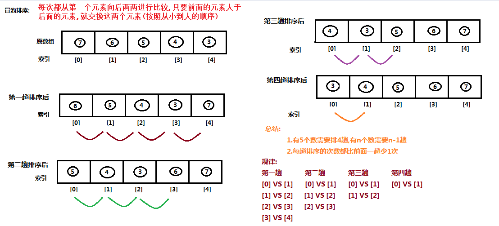
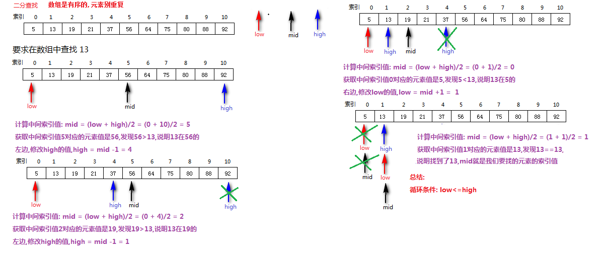

# day04 【Object类、常用API】

今日内容介绍

```java
Object类
日期类
日期格式化
日历类
System
Arrays
```

## 第一章 Object类

### 1.1 Object类介绍

```java
1.java.lang.Object类的介绍:	
	是整个类的体系结构中的最顶层父类,是所有类的最终父类,它里面定义的方法,其它类都有.
    类Object是类层次结构的根类。每个类都使用Object作为超类。所有对象（包括数组）都实现这个类的方法。   
2.常用方法:	
	(1)public String toString(): 返回调用方法的对象的字符串表示形式
		字符串形式： 理解位返回对象的地址值,类的全名称 + @ + 16进制的int数字
		内部源代码分析:
        public String toString() {
            return getClass().getName() + "@"
                + Integer.toHexString(hashCode());
        }
        getClass().getName(): 获取类的全名称
        Integer.toHexString(hashCode()): 把对象的哈希值转换成16进制的int数字        
	(2)public boolean equals(Object obj): 比较调用方法的对象和方法参数对象是否相等
		true: 说明相等
		false: 说明不相等
		默认比较对象的地址值,然而只要new对象的地址值就是不相同
		内部源代码分析:
        public boolean equals(Object obj) {
            return (this == obj);
        }
        this代表: 调用方法的对象
        obj代表: 调用方法时传递的参数对象
        ==: 在比较两个对象的内存地址值是否相同        
  	(3)重写toString方法
  		目的: 返回对象的内容,而不是地址值
  		快捷键: alt + insert --> toString --> 选择成员变量 --> ok
  	(4)重写equals方法:
		目的:比较对象的内容,而不是地址值
        快捷键: alt + insert --> equals && hashCode() --> 选择成员变量 --> ok 	
```

### 1.2 Object类的代码演示

```java
public class Demo01Object {
    public static void main(String[] args) {
        //创建Object类的对象
        Object obj1 = new Object();
        //调用toString方法
        String s1 = obj1.toString();
        System.out.println(s1);//内存地址值: java.lang.Object@1540e19d
        /*
            toString方法源码:
                obj1.getClass().getName(): 获取当前对象所属类的全名称        后面反射中讲解
                Integer.toHexString(obj1.hashCode()): 根据对象获取一个int数字并转换成16进制   后面讲
         */
        System.out.println(obj1.getClass().getName() + "@" + Integer.toHexString(obj1.hashCode()));
        //对象调用toString方法获取字符串,然后输出字符串
        System.out.println(obj1.toString());//内存地址值: java.lang.Object@1540e19d
        //println方法参数传递引用变量: println内部会使用引用变量调用toString方法
        System.out.println(obj1);//内存地址值: java.lang.Object@1540e19d
        System.out.println("--------------");

        //创建Object类的对象
        Object obj2 = new Object();
        /*
            ==的使用:
                1.基本类型: 比较具体的数据值是否相同
                2.引用类型: 比较的是内存地址值是否相同
            注意:
                只要使用new创建对象,内存地址和谁都不一样
         */
        System.out.println(obj1 == obj2);//false
        /*
            equals方法内部原理:
                默认使用==比较对象的内存地址值
            然而obj1和obj2都是new的,地址都不一样
         */
        System.out.println(obj1.equals(obj2));//false
    }
}
```


```java
public class Student extends Object {
    private String name;
    private int age;
    /*
        覆盖重写toString方法
        目的: 返回对象的内容,而不再返回地址值
     */
    @Override
    public String toString() {
        return "Student{" +
                "name='" + name + '\'' +
                ", age=" + age +
                '}';
    }
    /*
        覆盖重写equals方法
        目的: 比较对象的内容,而不再比较对象的地址值
        认为: 姓名相同 同时 年龄也相同,这两个对象就是相同的
     */
    @Override
    public boolean equals(Object o) {
        //this == o: 调用方法的对象和参数对象是同一个对象,直接返回true
        //如果自己和自己比,内容必然相同,不用比了直接返回true
        if (this == o) return true;
        /*
            o == null: 如果参数对象是null,直接返回false
            ||: 或者
            getClass() != o.getClass(): 反射讲,调用方法的对象和参数对象不是同一个类的对象,直接返回false
         */
        //if (o == null || getClass() != o.getClass()) return false;
        //和下面的写法是等价的
        if (o == null || !(o instanceof Student)) return false;
        //向下转型: 把参数对象,强转成Student对象
        Student student = (Student) o;
        /*
            age == student.age: 判断两个对象的年龄是否相同
            &&: 并且
            Objects.equals(name, student.name): 调用工具类Objects静态方法equals比较两个字符串是否相同
         */
        return age == student.age &&
                Objects.equals(name, student.name);
    }
	//空参/满参,set/get方法 自己生成    
}
```

```java
public class Demo01ToStringAndEquals {
    public static void main(String[] args) {
        Student stu1 = new Student("张三", 18);        
        /*
            Student类没有覆盖重写Object类的toString方法
            结果: itheima01_object.Student@1540e19d
            Student类覆盖重写Object类的toString方法
            结果: Student{name='张三', age=18}
         */
        System.out.println(stu1.toString());
        System.out.println(stu1);
        
        Student stu2 = new Student("李四", 38);
        Student stu3 = new Student("张三", 18);        
        /*
            Student类没有覆盖重写Object类的equals方法
            结果: false,false,false
            Student类覆盖重写Object类的equals方法
            结果: false,true,false
         */
        System.out.println(stu1.equals(stu2));
        System.out.println(stu1.equals(stu3));
        System.out.println(stu2.equals(stu3));
    }
}
```

### 1.3 转义字符【了解】

```java
/*
    转义字符 \
    1.去掉某些字符上的特殊含义

    2.给某些字符添加特殊含义
        \t: 制表符
        \r\n: windows换行
*/
//测试类
public class Demo03ZhuanYi {
    public static void main(String[] args) {
        //以字符串的方式输出 "
        System.out.println("\"");

        //以字符的方式输出 '
        System.out.println('\'');

        System.out.println("HellotWorld");
        System.out.println("Hello\tWorld");//tab
        System.out.println("Hello\r\nWorld");//换行
        System.out.println("\\");//\
        System.out.println("E:\\黑马JavaEE就业班382期\\day03(修饰符和内部类)\\01_视频");
    }
}
```


## 第二章 Date类【重点】

### 2.1 Date类的介绍和基本使用

```java
/*
    1.java.util.Date类介绍:类 Date 表示特定的瞬间，精确到毫秒。

    2.注意:
        (1)时间原点: 1970年1月1日 0时0分0秒   认为是0毫秒
        (2)时间标准: 采用格林威治时间标准
        (3)北京时间与标准时间相差8小时

    3.构造方法:
        (1)public Date(): 把当前时间毫秒值(运行程序的此时此刻)封装成Date对象
        (2)public Date(long date): 把构造方法参数指定的毫秒值封装成Date对象

    4.常用常用方法:
        (1)public long getTime(): 返回调用方法的Date对象对应的毫秒值
        (2)public void setTime(long time): 把方法参数指定的毫秒值设置给调用方法的Date对象
*/  
```

```java
public class Demo02Date {
    public static void main(String[] args) {

        Date d2 = new Date(0L);//把特定的瞬间0毫秒那个时刻,封装成Date对象
        System.out.println(d2);

        //创建当前时间对应的Date对象
        Date d1 = new Date();
        System.out.println(d1);//Wed Sep 23 10:08:08 CST 2020

        //获取当前时间Date对象对应的毫秒值
        long time = d1.getTime();

        System.out.println(time);//1600827409225

        //把当前时间向后推算5天
        time += 5*24*60*60*1000;

        //调用setTime方法,给Date对象设置成5天后的毫秒值
        d1.setTime(time);

        System.out.println(d1);
    }
}

```


## 第三章 DateFormat类【重点】

### 3.1 DateFormat类的介绍

```java
/*
    java.text.DateFormat类:
    1.作用:
        用来完成Date对象和String对象之间的相互转换的

    2.常用功能
        (1)格式化(就是把Date对象转换成String对象)
            public String format(Date date): 把方法参数Date对象转换成String对象并返回
                参数:
                    Date date: 日期对象
                返回值:
                    String: 返回的是String对象

        (2)解析(就是把String对象转换成Date对象)
            public Date parse(String source): 把方法参数String对象转换成Date对象并返回
                参数:
                    String source: String对象
                返回值:
                    Date: 返回的是日期对象
    3.使用
        java.text.DateFormat是一个抽象类,不能直接new对象
        常用子类:java.text.SimpleDateFormat类
            构造方法:
                public SimpleDateFormat(String pattern)
                参数:
                    String pattern: String类型的日期格式

                    显示格式                                需要设置的日期格式
             2020年09月23日 10点43分20秒123毫秒         yyyy年MM月dd日 HH点mm分ss秒SSS毫秒
             2020-09-23 10:43:20:123                  yyyy-MM-dd HH:mm:ss:SSS
*/		

	
    	
```


### 3.2 日期格式化为字符串【重点】

```java
/*
    把Date对象格式化成String对象的实现步骤
        1.创建String类型的日期格式对象patter,需要指定具体的格式
        2.创建日期格式化SimpleDateFormat类的对象sdf,构造方法参数传递日期格式对象patter
        3.创建当前毫秒值对应的日期Date对象date
        4.使用日期格式化SimpleDateFormat类的对象sdf调用format方法,传递日期对象date,
            获取指定格式的String对象
        5.打印String对象
*/
```

```java
public class Demo04DateFormat {
    public static void main(String[] args) {
        //1.创建String类型的日期格式对象patter,需要指定具体的格式
        String patter = "yyyy年MM月dd日 HH点mm分ss秒SSS毫秒";

        //2.创建日期格式化SimpleDateFormat类的对象sdf,构造方法参数传递日期格式对象patter
        SimpleDateFormat sdf = new SimpleDateFormat(patter);

        //3.创建当前毫秒值对应的日期Date对象date
        Date date = new Date();

        //4.使用日期格式化SimpleDateFormat类的对象sdf调用format方法,传递日期对象date,
        //获取指定格式的String对象
        String strDate = sdf.format(date);

        //5.打印String对象
        System.out.println(strDate);
    }
}

```


### 3.3 字符串转换成日期【重点】

```java
/*
    把String对象解析成Date对象的实现步骤
        1.创建String类型的日期格式对象patter,需要指定具体的格式
        2.创建日期格式化SimpleDateFormat类的对象sdf,构造方法参数传递日期格式对象patter
        3.创建String对象strDate,保存指定格式的日期时间
        4.使用日期格式化SimpleDateFormat类的对象sdf调用parse方法,传递String的日期对象strDate,
            获取Date对象
        5.打印Date对象
*/
```

```java
public class Demo05DateFormat {
    public static void main(String[] args) throws ParseException {
        //1.创建String类型的日期格式对象patter,需要指定具体的格式
        String patter = "yyyy年MM月dd日 HH点mm分ss秒SSS毫秒";

        //2.创建日期格式化SimpleDateFormat类的对象sdf,构造方法参数传递日期格式对象patter
        SimpleDateFormat sdf = new SimpleDateFormat(patter);

        //3.创建String对象strDate,保存指定格式的日期时间
        String strDate = "2020年09月23日 10点54分22秒442毫秒";
        //String strDate = "2020-09-23 10:54:22:442";//错误: 和上面的日期格式不匹配,报出解析异常

        //4.使用日期格式化SimpleDateFormat类的对象sdf调用parse方法,传递String的日期对象strDate,
        //获取Date对象
        Date date = sdf.parse(strDate);

        //5.打印Date对象
        System.out.println(date);
    }
}

```


## 第四章  Calendar日历类【重点】

### 4.1 Calendar类的介绍

```java
/*
    java.util.Calendar类: 日历类,内部提供了大量的与日期时间相关的信息,想要什么就那什么,非常方便
    java.util.Calendar类是一个抽象类,不能直接创建对象
        不常用子类: java.util.GregorianCalendar类 用起来太麻烦


    解决方案:
        在java.util.Calendar类的内部提供静态方法获取其子类对象
            public static Calendar getInstance(): 获取抽象类Calendar类的子类对象
            返回值类型:
                java.util.Calendar类: 是抽象类,说明方法内部必然会返回该抽象类的子类对象  
*/
public class Demo03Calendar {
    public static void main(String[] args) {
        //获取Calendar类的子类对象
        Calendar cal = Calendar.getInstance();
        System.out.println(cal);
    }
}

```


### 4.2 Calendar类的常用方法

```java
/*
    Calendar类的常用方法
        public int get(int field) ：返回给定日历字段的值。
            参数:
                int field: 代表的是要获取的是哪个字段
            返回值:
                int: 代表的是获取到的字段对应的值

        public void set(int field, int value) ：将给定的日历字段设置为给定值。
            参数:
                int field: 代表的是要给哪个字段设置值
                int value: 代表的是设置的值是什么

        public abstract void add(int field, int amount) ：
            根据日历的规则，为给定的日历字段添加或减去指定的时间量。
            给指定字段增加指定的值
            参数:
                int field: 代表的是要给哪个字段增加值
                int amount: 代表的是增加的值是多少
                    正数表示增加,负数表示减少

        public Date getTime() ：把调用方法的Calendar对象转换成Date对象并返回
        public void setTime(Date date): 把调用方法传递的参数Date对象设置给调用方法的Calendar对象

        Calendar类当中的常量
        Calendar.YEAR           代表年     1
        Calendar.MONTH          代表月     2
        Calendar.DAY_OF_MONTH   代表日     5
*/
```

```java
public class Demo01CalendarMethod {
    public static void main(String[] args) {
        System.out.println(Calendar.YEAR);//1
        System.out.println(Calendar.MONTH);//2
        System.out.println(Calendar.DAY_OF_MONTH);//5
        System.out.println("-------------");
        //获取Calendar类的对象
        Calendar cal = Calendar.getInstance();

        //调用方法打印年月日
        print(cal);

        //把2020年9月23日 通过set方法修改成 2028年5月20日
        //修改年
        cal.set(Calendar.YEAR,2028);
        //修改月
        cal.set(Calendar.MONTH,4);
        //修改日
        cal.set(Calendar.DAY_OF_MONTH,20);

        //调用方法打印年月日
        print(cal);

        //把2028年5月20日 通过add方法修改成 2020年9月23日
        //修改年
        cal.add(Calendar.YEAR,-8);
        //修改月
        cal.add(Calendar.MONTH,4);
        //修改日
        cal.add(Calendar.DAY_OF_MONTH,3);

        //调用方法打印年月日
        print(cal);

        //把Calendar对象cal转换成Date对象
        Date date = cal.getTime();
        System.out.println(date);
        //借助SimpleDateFormat完成对Date对象的格式化工作
    }

    //定义方法打印Calendar对象的信息
    public static void print(Calendar cal) {
        //获取年
        //int year = cal.get(1);
        int year = cal.get(Calendar.YEAR);
        //获取月
        //int month = cal.get(2);//1到12月 用0到11的数字表示
        int month = cal.get(Calendar.MONTH);//1到12月 用0到11的数字表示
        //获取日
        //int day = cal.get(5);
        int day = cal.get(Calendar.DAY_OF_MONTH);

        System.out.println(year+"年"+(month+1)+"月"+day+"日");
    }
}

```


### 4.3  

```java
/*
    1.需求:Calendar类的练习_获取任意一年的二月有多少天
          如果可以搞到任意年份的3月份的第1天,把天数减1,得到的就是二月份的最后一天

    2.实现步骤:
        (1)创建键盘录入Scanner类的对象
        (2)获取键盘录入的代表年份的int数字,保存到int变量year中
        (3)获取当前日期时间的Calendar对象cal
        (4)Calendar对象cal调用方法把年份设置成year
        (5)Calendar对象cal调用方法把月份设置成3月
        (6)Calendar对象cal调用方法把天数设置成1
        (7)Calendar对象cal调用方法把天数减1,之后就是2月份的最后一天
        (8)Calendar对象cal调用方法获取天数,保存到int变量days中,表示的就是二月份总共有多少天
        (9)打印int变量days的值
*/
```

```java
public class Demo02CalendarTest {
    public static void main(String[] args) {
        //(1)创建键盘录入Scanner类的对象
        Scanner sc = new Scanner(System.in);

        //(2)获取键盘录入的代表年份的int数字,保存到int变量year中
        System.out.println("请输入一个整数数字(代表年份):");
        int year = sc.nextInt();

        //(3)获取当前日期时间的Calendar对象cal
        Calendar cal = Calendar.getInstance();

        //(4)Calendar对象cal调用方法把年份设置成year
        //cal.set(Calendar.YEAR, year);

        //(5)Calendar对象cal调用方法把月份设置成3月
        //cal.set(Calendar.MONTH, 2);

        //(6)Calendar对象cal调用方法把天数设置成1
        //cal.set(Calendar.DAY_OF_MONTH, 1);

        cal.set(year,2,1);//同时设置年月日,不用指定具体的字段

        //(7)Calendar对象cal调用方法把天数减1,之后就是2月份的最后一天
        cal.add(Calendar.DAY_OF_MONTH, -1);

        //(8)Calendar对象cal调用方法获取天数,保存到int变量days中,表示的就是二月份总共有多少天
        int days = cal.get(Calendar.DAY_OF_MONTH);

        //(9)打印int变量days的值
        System.out.println(year + "年的二月份总共有: " + days + " 天");
    }
}

```


## 第五章  System类的使用【了解】

### 5.1 System类的介绍

```java
/*
    java.lang.System类: 用来完成相关系统操作的工具类
        工具类的特点:
            1.所有的成员都是static修饰的,直接用类名调用即可,不需要对象
            2.把构造方法private修饰
        常用方法:
            public static void exit(int status): 终止当前正在运行的 Java 虚拟机。
                参数:
                    int status: 0表示正常终止JVM,非0表示异常终止JVM
*/
```

```java
public class Demo02System {
    public static void main(String[] args) {
        for (int i = 100; i > 0; i--) {
            System.out.println(i);
            if (i == 50) {
                //break;//结束所在的for循环
                //return ;//结束所在的方法
                System.exit(0);//正常结束JVM
            }
        }

        System.out.println("main...end....");
    }
}

```


### 5.2 System类的练习_获取程序执行的时间

```java
/*
    System类的静态方法
        public static long currentTimeMillis(): 获取当前时间的毫秒值
        等价于: new Date().getTime()
    需求:在控制台输出1-10000，计算这段代码执行了多少毫秒!
    实现步骤:
        1.获取开始时间对应的毫秒值
        2.执行功能代码
        3.获取结束时间对应的毫秒值
        4.计算总耗时并输出
*/
```

```java
public class Demo03System {
    public static void main(String[] args) {
        //1.获取开始时间对应的毫秒值
        long start = System.currentTimeMillis();

        //2.执行功能代码
        for (int i = 1; i <= 10000; i++) {
            System.out.println(i);
        }

        //3.获取结束时间对应的毫秒值
        long end = System.currentTimeMillis();

        //4.计算总耗时并输出
        System.out.println("总耗时: " + (end - start) + " 毫秒");
    }
}
```


### 5.3 System类的练习_数组拷贝

```java
/*
    java.lang.System类: 用来完成相关系统操作的工具类
    常用方法:
    public static void arraycopy
        (Object src,int srcPos,Object dest,int destPos,int length):
        从指定源数组中复制一个数组，复制从指定的位置开始，到目标数组的指定位置结束。

        参数：
            src - 源数组。
            srcPos - 源数组中的起始位置。
            dest - 目标数组。
            destPos - 目标数据中的起始位置。
            length - 要复制的数组元素的数量。
    练习:
        复制前
            源数组srcArr:    {10,20,30,50,60,80,100}
            目标数组destArr:   {100,200,300,500,600,800,1000}

        复制后:
            源数组:    {10,20,30,50,60,80,100}
            目标数组:   {100,200,300,30,50,60,80}
*/
public class Demo04System {
    public static void main(String[] args) {
        int[] srcArr = {10,20,30,50,60,80,100};
        int[] destArr = {100,200,300,500,600,800,1000};
        System.out.println("复制前源数组: "+ Arrays.toString(srcArr));
        System.out.println("复制前目标数组: "+ Arrays.toString(destArr));

        //调用方法,根据题目需求实现数组元素的复制
        System.arraycopy(srcArr,2,destArr,3,4);

        System.out.println("复制后源数组: "+ Arrays.toString(srcArr));
        System.out.println("复制后目标数组: "+ Arrays.toString(destArr));
    }
}

```


### 5.4 System类的gc方法

```java
/*
	java.lang.System类: 用来完成相关系统操作的工具类
    常用方法:
        public static void gc(): 运行垃圾回收器。
        运行垃圾回收器，JVM将从堆内存中清理对象，
        清理对象的同时会调用对象的finalize()方法，建议自定义类覆盖重写finalize()方法
        JVM的垃圾回收器是通过另一个线程开启的
*/
public class Demo05System {
    public static void main(String[] args) {
        for (int i = 0; i < 1000; i++) {
            new Student();
        }
        System.gc();//建议运行垃圾回收器
        System.out.println("main...end...");
    }
}
public class Student {
    @Override
    protected void finalize() throws Throwable {
        System.out.println("对象被回收了...");
    }
}
```


## 第六章 冒泡排序

### 6.1 冒泡排序原理

```java
/*
    冒泡排序
    1.原理:    
        每次都是从第一个元素开始向后两两进行比较,
        只要后面的元素小于前面的元素,就交换这两个元素(从小到大)

    2.总结:
        1.有5个数需要排4趟,有n个数需要n-1趟
        2.每趟排序的次数都比前面一趟少1次

    3.规律:
            第一趟				第二趟			第三趟			第四趟
            [0] VS [1]		[0] VS [1]		[0] VS [1]	[0] VS [1]
            [1] VS [2]      [1] VS [2]      [1] VS [2]
            [2] VS [3]      [2] VS [3]
            [3] VS [4]
*/
```



### 6.2 冒泡排序代码实现

```java
public class Demo05BubbleSort {
    public static void main(String[] args) {
        //定义数组
        int[] arr = {7, 6, 5, 4, 3};
        System.out.println("未排序前: " + Arrays.toString(arr));

        /*
            以下for循环中数字4写死了,可以使用数组长度减1代替
         */
        //arr.length-1: 能否不写 减 1 呢? 可以的,只是多排了一趟而已
        for (int i = 0; i < arr.length - 1; i++) {//外层for循环: 控制排序的趟数
            for (int j = 0; j < arr.length -1 - i; j++) {//内层循环: 控制每趟排序的次数
                //arr.length - 1 - i: 能否不写减i呢? 可以,只是每趟排序的次数多了一次而已
                //arr.length - 1 - i: 能否不写减1呢? 必然不可以,因为会发生索引越界
                //j<arr.length && j + 1<arr.length ==> j<arr.length-1
                if (arr[j] > arr[j + 1]) {
                    //实现数组元素的交换
                    int temp = arr[j];
                    arr[j] = arr[j + 1];
                    arr[j + 1] = temp;
                }

            }
        }
        System.out.println("升序排序后: " + Arrays.toString(arr));
    }
}
```


## 第七章 数组的二分查找法

### 7.1 数组元素的普通查找法

```java
/*
    要求:
        在int数组中查找某个元素第一次出现的索引,如果没有该元素,返回-1
        10,20,30,50,80          
        定义方法在int数组中获取一个元素第一次出现的索引值,如果没有返回-1
            三要素:
                1.方法名称: getIndex
                2.参数列表:
                    int[] array: 要查找元素的int数组
                    int value: 要在数组中查找的元素
                3.返回值类型: int

    实现步骤:
        1.使用for循环遍历方法参数数组array
        1.1 如果当前元素值 等于 要查找的元素value
        1.2 直接返回当前元素的索引
        2.for循环结束,说明没有找找该元素,直接返回-1
*/
```

```java
public class Demo04GetIndex {
    public static void main(String[] args) {
        int[] array = {10,20,30,50,80};
        System.out.println(getIndex(array,30));
        System.out.println(getIndex(array,80));
        System.out.println(getIndex(array,100));
    }

    //定义方法在int数组中获取一个元素第一次出现的索引值,如果没有返回-1
    public static int getIndex(int[] array, int value) {
        //1.使用for循环遍历方法参数数组array
        for (int i = 0; i < array.length; i++) {
            //1.1 如果当前元素值 等于 要查找的元素value
            if (array[i] == value) {
                //1.2 直接返回当前元素的索引
                return i;
            }

        }
        //2.for循环结束,说明没有找找该元素,直接返回-1
        return -1;
    }
}

```

### 7.2 二分查找原理

```java
/*
    前提:
        1.数组必须要保证是有序的
        2.数组元素不能重复

    原理:
        取数组中间的元素和被查找的元素进行比较，如果被查找元素大于数组中间元素，
        就舍去数组元素左的一半，对另一半继续进行查找。
*/	
```



### 7.3 二分查找代码实现

```java
/*
    定义方法在int数组中获取一个元素第一次出现的索引值,如果没有返回-1
    三要素:
        1.方法名称: getIndex
        2.参数列表:
            int[] array: 要查找元素的int数组
            int value: 要在数组中查找的元素
        3.返回值类型: int
*/
    
public class Demo05BinarySearch {
    public static void main(String[] args) {
        int[] array = {5, 13, 19, 21, 37, 56, 64, 75, 80, 88, 92};

        System.out.println(getIndex(array,5));//0
        System.out.println(getIndex(array,56));//5
        System.out.println(getIndex(array,92));//10
        System.out.println(getIndex(array,100));//-1
    }

    //定义方法在int数组中获取一个元素第一次出现的索引值,如果没有返回-1
    public static int getIndex(int[] array, int value) {
        //定义int变量记录左边的最小索引
        int low = 0;

        //定义int变量记录右边的最大索引
        int high = array.length - 1;

        //定义int变量记录中间索引
        int mid = 0;
        //使用while循环进行二分查找
        while (low <= high) {
            //计算中索引值
            mid = (low + high)/2;
            //判断中间索引对应的元素值和要查找的元素值的大小关系
            if (array[mid] > value) {
                //说明要找的值在中间值的左边
                //修改high的值
                high = mid - 1;
            } else if (array[mid] < value) {
                //说明要找的值在中间值的右边
                //修改low的值
                low = mid + 1;
            } else {
                //说明找到了
                return mid;
            }
        }
        //代码执行到这里说明没找到
        //返回-1
        return -1;
    }
}

```


## **第八章**  Arrays工具类的使用

### 8.1 工具类Arrays的用法

```java
/*
    java.util.Arrays类: 此类是用来操作数组的工具类
    Collections: 操作集合的工具类
    Objects: 操作对象的工具类
    工具类的特点:
        1.所有的成员都是static修饰的,直接用类名调用即可,不需要对象
        2.把构造方法private修饰
    常用方法:
        public static void sort(int[] a) 对指定的int数组进行升序排列

        public static int binarySearch(int[] a,int key): 
            对数组进行二分查找法，找不到元素返回(-插入点)-1
            
    	public static String toString(int[] a) 将数组转成字符串
*/
public class Demo06Arrays {
    public static void main(String[] args) {
        //定义数组
        int[] array = {10,9,3,6,5,1,2};
        System.out.println("排序前: "+Arrays.toString(array));

        //调用方法按照从小到大的顺序排序
        MyArrays.sort(array);

        System.out.println("排序后: "+Arrays.toString(array));

        System.out.println("二分超找1: "+Arrays.binarySearch(array,1));//0
        System.out.println("二分超找6: "+Arrays.binarySearch(array,6));//4
        System.out.println("二分超找10: "+Arrays.binarySearch(array,10));//6
    }
}

```


### 8.2 自定义操作数组的工具类MyArrays

```java
/*
    自定义操作数组的工具类
    工具类的特点:
        1.所有的成员都是static修饰的,直接用类名调用即可,不需要对象
        2.把构造方法private修饰
 */
@SuppressWarnings("all")
public class MyArrays {
    //2.把构造方法private修饰
    private MyArrays(){}

    //对int数组按照从小到大的顺序排序的方法
    public static void sort(int[] array) {
        for (int i = 0; i < array.length - 1; i++) {
            for (int j = 0; j < array.length -1 - i; j++) {
                if (array[j] > array[j + 1]) {
                    int temp = array[j];
                    array[j] = array[j + 1];
                    array[j + 1] = temp;
                }
            }
        }
    }

    //定义方法在int数组中获取一个元素第一次出现的索引值,如果没有返回-1
    public static int binarySearch(int[] array, int value) {
        //定义int变量记录左边的最小索引
        int low = 0;
        //定义int变量记录右边的最大索引
        int high = array.length - 1;
        //定义int变量记录中间索引
        int mid = 0;
        //使用while循环进行二分查找
        while (low <= high) {
            //计算中索引值
            mid = (low + high)/2;
            //判断中间索引对应的元素值和要查找的元素值的大小关系
            if (array[mid] > value) {
                //说明要找的值在中间值的左边
                //修改high的值
                high = mid - 1;
            } else if (array[mid] < value) {
                //说明要找的值在中间值的右边
                //修改low的值
                low = mid + 1;
            } else {
                //说明找到了
                return mid;
            }
        }
        //代码执行到这里说明没找到
        //返回-1
        return -1;
    }

    //获取int数组的字符串表现形式
    //{10,20,30} --> [10, 20, 30]
    //{} --> []
    //{1, 2, 3} --> [1, 2, 3]
    //定义一个方法，把int数组中的数据按照指定格式拼接成一个字符串返回
    public static String myToString(int[] array) {
        //1.创建StringBuilder对象sb,初始化值"["
        StringBuilder sb = new StringBuilder("[");

        //2.使用for循环遍历数组
        for (int i = 0; i < array.length; i++) {
            //2.1 拼接元素到StringBuilder对象sb中
            sb.append(array[i]);
            //2.2 判断如果2.1中拼接的不是最后一个元素,向StringBuilder对象sb中拼接", "
            if (i != array.length - 1) {
                sb.append(", ");
            }

        }
        //3.for循环结束后,向StringBuilder对象sb中拼接"]"
        sb.append("]");

        //4.把StringBuilder对象转换成String对象
        String str = sb.toString();

        //5.返回转换后的String对象
        return str;
    }
}
//测试类
public class Demo05MyArrays {
    public static void main(String[] args) {
        //定义数组
        int[] array = {10,9,3,6,5,1,2};
        System.out.println("排序前: "+MyArrays.toString(array));
        //调用方法按照从小到大的顺序排序
        MyArrays.sort(array);
        System.out.println("排序后: "+MyArrays.toString(array));
        System.out.println("二分超找1: "+MyArrays.binarySearch(array,1));//0
        System.out.println("二分超找6: "+MyArrays.binarySearch(array,6));//4
        System.out.println("二分超找10: "+MyArrays.binarySearch(array,10));//6
    }
}
```

