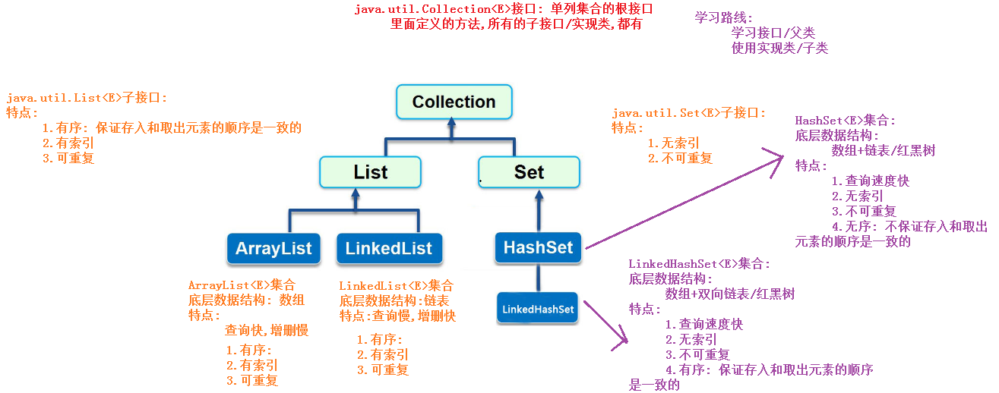
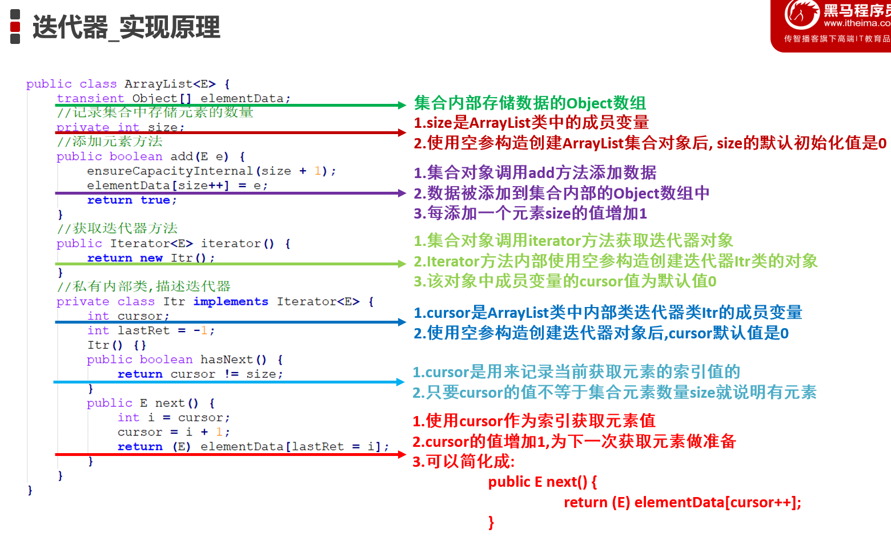
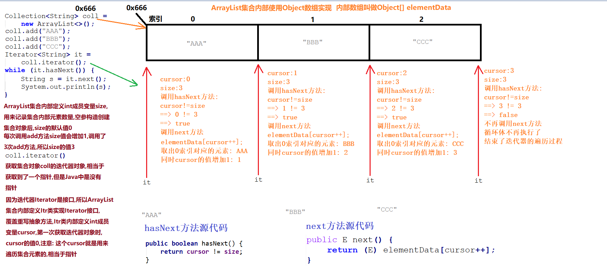
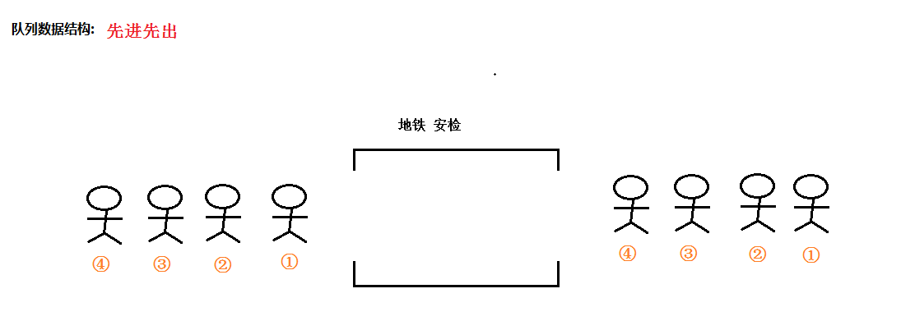
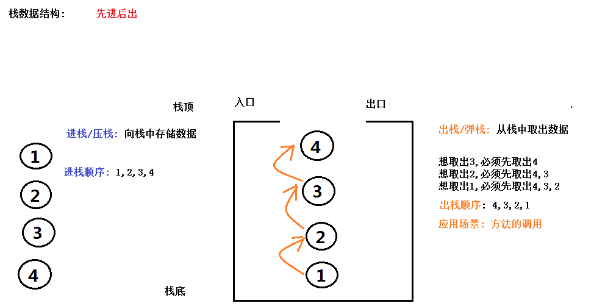
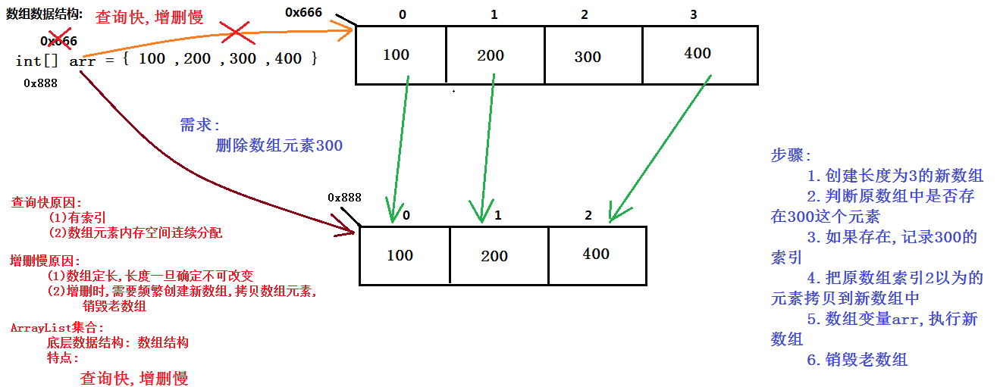
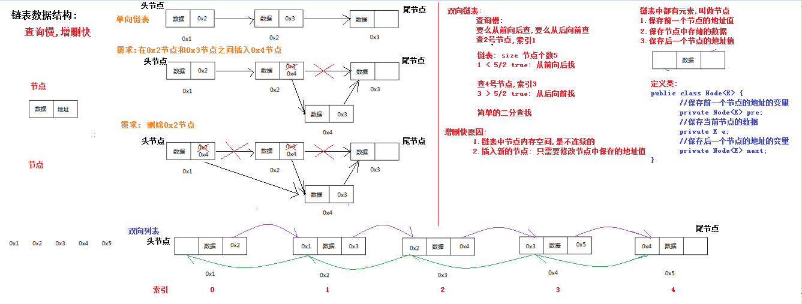

# <center>集合</center>
[toc]
## Collection(接口)集合
#### 1、概念  
   java.util.Collection<E>接口:单列集合的根接口(集合的父类)里面定义的方法,所有的子接口/实现类,都有
#### 2、collection集合体系
```
java.util.List<E>子接口:
        特点:
            1.有序: 保证存入和取出元素的顺序是一致的
            2.有索引
            3.可重复

    java.util.Set<E>子接口:
        特点:
            1.无索引
            2.不可重复

    学习路线:
        学习接口/父类
        使用实现类/子类
```

#### 3、Collection集合中常用方法
```
java.util.Collection<E>接口:
    常用方法:
        public boolean add(E e) ： 把给定的对象添加到当前集合中 。
        public boolean addAll(Collection con): 
			把方法参数集合对象con中的所有元素添加到调用方法的集合对象中
			
        public void clear() :清空集合中所有的元素。
        public boolean remove(E e) : 把给定的对象在当前集合中删除。
            有相同元素,只能删除一个

        public boolean contains(Object obj) : 判断当前集合中是否包含给定的对象。
        public boolean isEmpty() : 判断当前集合是否为空。
        public int size() : 返回集合中元素的个数。
        public Object[] toArray() : 把集合中的元素，存储到数组中。
```
## 迭代器
#### 1、概念  
      在程序开发中，经常需要遍历集合中的所有元素。针对这种需求，JDK专门提供了一个接口java.util.Iterator。
    想要遍历Collection集合，那么就要获取该集合迭代器完成迭代操作
       迭代器即Collection集合元素的通用获取方式。在取元素之前先要判断集合中有没有元素，如果有，就把这个元素取出来，继续在判断，
    如果还有就再取出出来。一直把集合中的所有元素全部取出。这种取出方式专业术语称为迭代。
#### 迭代器中主要方法
    1. public E next()：返回迭代的下一个元素
    2. public boolean hasnext()：如果仍有元素可以迭代，返回一个true
    3. public void remove()：从迭代器指向的collection中移除迭代器返回的最后一个元素(可选操作)
#### 迭代器实现原理


#### 迭代器中并发修改异常
```java
import java.util.ArrayList;
import java.util.Iterator;
/*
    并发修改异常
        原因: 使用迭代器遍历集合元素时,又通过集合对象本身调用集合的方法,修改了集合的长度
        解决方案:
            使用迭代器遍历集合元素时,不能通过集合对象本身调用集合的方法,修改集合的长度
            (1)使用Collection接口迭代器的方法修改长度: remove
            (2)使用List接口特有迭代器ListIterator中的方法修改长度: remove,add
 */
public class Demo04IteratorException {
    public static void main(String[] args) {
        ArrayList<String> list = new ArrayList<>();
        list.add("AAA");
        list.add("BBB");
        list.add("CCC");
        list.add("DDD");
        //删除元素BBB
        /*
            集合内部:
                成员变量int modCount: 记录对集合的实际修改次数
                使用集合对象每次调用add/remove方法,都会导致该变量的值增加1
                现在在获取之前调用了四次add方法,modCount的值是4
            iterator方法获取迭代器对象时:
                在迭代器内部有个成员变量int expectedModCount = modCount;
                获取迭代器对象时,预期修改次数expectedModCount的值就等于 实际修改次数modCount的值 就是 4
         */
        Iterator<String> it = list.iterator();
        while (it.hasNext()) {
            /*
                方法内部判断 如果 实际修改次数modCount != 预期修改次数 expectedModCount
                抛出并发修改异常ConcurrentModificationException
             */
            String s = it.next();
            if ("CCC".equals(s)) {
                //导致集合实际修改次数modCount的值增加1,变成5
                list.remove(s);//通过集合修改长度,有问题
                //list.set(1, "B");//只修改了内容,没有修改长度,没有问题
                /*
                    方法内部在删除元素后,会把实际修改次数modCount 重新赋值给 预期修改次数 expectedModCount
                    导致:
                        next方法内部 modCount == expectedModCount  结果是true,不会报异常
                 */
                //it.remove();//通过迭代器修改长度,没有问题
            }
        }
        System.out.println(list);
    }
}
```
#### 迭代器基本使用范围
    并不是所有的集合都有索引,所以以前使用for+get(索引)的方式遍历集合,就不通用了
        jdk提供了遍历但列集合的通用方式: 迭代器
    使用迭代器遍历集合对象
        1.多态的方式创建Collection集合对象coll
        2.Collection集合对象coll调用add方法添加数据
        3.Collection集合对象coll调用iterator方法,获取迭代器接口Iterator的实现类对象it
        4.迭代器接口Iterator的实现类对象it调用hasNext方法,判断是否具有下一个元素
        5.如果有: 迭代器接口Iterator的实现类对象it调用next方法,获取下一个元素并输出
## 数据结构
### 队列结构
    特点:
	先进先出（即存进去的元素，要在后它前面的元素依次取出后，才能取出该元素）

### 栈结构 
    特点:
	先进后出（即，存进去的元素，要在后它后面的元素依次取出后，才能取出该元素）
    相关概念:
    压栈：就是存元素。
    弹栈：就是取元素。

### 数组结构
    特点:
	查询快,增删慢

    查询快原因:
    1.有索引
    2.数组元素内存空间连续分配
    
    增删慢原因:
    1.数组定长,长度一旦确定不可以改变
    2.增删元素时,需要频繁创建新数组,拷贝数组元素,销毁老数组

### 链表结构
    特点:
	查询快,增删慢

    查询快原因:
    1.有索引
    2.数组元素内存空间连续分配
    
    增删慢原因:
    1.数组定长,长度一旦确定不可以改变
    2.增删元素时,需要频繁创建新数组,拷贝数组元素,销毁老数组

## List集合
```
java.util.Collection<E>接口: 单列集合的根接口
里面定义的方法,所有的子接口/实现类,都有
java.util.List<E>子接口:
特点:
1.有序: 保证存入和取出元素的顺序是一致的
2.有索引: 可以通过索引的方式获取元素
3.可重复: 可以存储相同的元素

List子接口,除了用于父接口的方法外,额外添加与索引相关的方法
public void add(int index,E element) 在列表的指定位置上插入元素。
public E get(int index) 返回列表中指定位置的元素。
public E set(int index,E element) 用指定元素替换列表中指定位置的元素，并返回替换前的元素。
public E remove(int index) 移除列表中指定位置的元素，并返回被移除之前的元素。

对于集合,最常用的操作:
增删改查: C(增: Create)R(查:Read)U(改: Update)D(删: Delete)
```
```java
public class Demo04List {
    public static void main(String[] args) {
        //多态创建List集合对象list
        List<String> list = new ArrayList<>();
        //add方法添加元素
        list.add("AAA");
        list.add("CCC");
        System.out.println(list);//[AAA, CCC]

        //在CCC的前面添加BBB
        list.add(1,"BBB");
        System.out.println(list);//[AAA, BBB, CCC]

        //根据索引删除CCC
        String whoRemoved = list.remove(2);
        System.out.println("谁被删除了呢? "+whoRemoved);//CCC
        System.out.println("删除索引2元素后集合内容: "+list);//[AAA, BBB]

        //把AAA修改成A
        String whoUpdate = list.set(0, "A");
        System.out.println("谁被修改了呢? "+whoUpdate);//AAA
        System.out.println("修改AAA成A后集合内容: "+list);//[A, BBB]

        //把BBB修改成B
        whoUpdate = list.set(1, "B");
        System.out.println("谁被修改了呢? "+whoUpdate);//BBB
        System.out.println("修改AAA成A后集合内容: "+list);//[A, B]

        //获取A和B
        System.out.println(list.get(0)+"..."+list.get(1));

        //能够使用迭代器遍历List集合呢?
    }
}
```
### ArrayList
```
java.util.Collection<E>接口: 
	单列集合的根接口里面定义的方法,所有的子接口/实现类,都有

java.util.List<E>子接口:
    特点:
        1.有序: 保证存入和取出元素的顺序是一致的
        2.有索引: 可以通过索引的方式获取元素
        3.可重复: 可以存储相同的内容

常用实现类ArrayList集合                -------------使用ArrayList集合--------------
    特点:
        1.底层数据结构:数组
        2.查询快: 元素有索引,元素内存空间连续分析
        3.增删慢:
            数组长度不可改变
            需要频繁创建新数组,拷贝元素,销毁老数组
        4.线程不同步,不安全,效率高

常用实现类Vector集合                -------------不使用Vector集合--------------
    特点:
        1.底层数据结构:数组
        2.查询快: 元素有索引,元素内存空间连续分析
        3.增删慢:
            数组长度不可改变
            需要频繁创建新数组,拷贝元素,销毁老数组
        4.线程同步,安全,效率低
```
### LinkedList
```
java.util.Collection<E>接口: 
	单列集合的根接口里面定义的方法,所有的子接口/实现类,都有

java.util.List<E>子接口:
    特点:
        1.有序: 保证存入和取出元素的顺序是一致的
        2.有索引: 可以通过索引的方式获取元素
        3.可重复: 可以存储相同的内容

常用实现类ArrayList集合                -------------使用ArrayList集合--------------
    特点:
        1.底层数据结构:数组
        2.查询快: 元素有索引,元素内存空间连续分析
        3.增删慢:
            数组长度不可改变
            需要频繁创建新数组,拷贝元素,销毁老数组
        4.线程不同步,不安全,效率高

常用实现类Vector集合                -------------不使用Vector集合--------------
    特点:
        1.底层数据结构:数组
        2.查询快: 元素有索引,元素内存空间连续分析
        3.增删慢:
            数组长度不可改变
            需要频繁创建新数组,拷贝元素,销毁老数组
        4.线程同步,安全,效率低
```
## 数组和集合的区别
1. 相同点
+ 都是容器,都可以存储多个数据 
+ 都可以存储引用类型的数据  

2. 区别
+ 数组长度不可变 
+ 集合长度可变  
+ 数组既可以存储基本类型,也可以存储引用类型  
+ 集合只能存储引用类型,如果要存储基本类型,需要存储对应的包装类型  
## ArrayList和LinkedList的区别
1. ArrayList接口：
    + 有序
    + 有索引
    + 可重复
2. LinkedList接口：
    + 有序
    + 有索引
    + 可重复
## List和set接口的区别
1. List接口：
+ 有序：保证存入和取出元素的顺序是一致的
+ 有索引
+ 可重复
2. Set接口：
  + 无索引
  + 不可重复  
## 迭代器并发修改异常的原理是什么?
```
使用集合对象每次调用add/remove方法,都会导致该变量的值增加1,集合中有一个modCount变量用来记录每次add/remove方法的调用次数
在迭代器内部有个成员变量int expectedModCount = modCount;获取迭代器对象时,预期修改次数expectedModCount的值就等于 实际修改次数modCount的值
所以在迭代器中使用集合方法(add/remove)方法的时候modCount变量会+1，导致实际修改次数modCount != 预期修改次数 expectedModCount
抛出并发修改异常ConcurrentModificationException，如果通过迭代器it.remove()方法修改长度,没有问题
```
## 增强for循环
```
/*
    数组定义格式:
        数据类型[] 数组名称 = new 数据类型[长度];
        int[] arr = new int[3];

    格式:
        for(数组存储元素的类型 变量名称 : 数组) {
            ...
        }

    注意:
        1.变量名称不是用来存储数组的索引值的,而是用来存储数组中的每个元素的
        2.增强for遍历数组底层使用的是普通for
        3.增强for遍历数组时,请不要对数组元素进行增删改的操作,否则出现问题,自己解决
        4.增强for遍历数组快捷键:
            数组名.for
*/ 
```
```java
public class Demo03NBForArray {
    public static void main(String[] args) {
        int[] arr = {10,20,30,50};

        //普通for遍历
        for (int i = 0; i < arr.length; i++) {
            System.out.println(arr[i]);
        }
        System.out.println("-----------------");

        //增强for
        //每次自动从数组中取出一个元素,存储到变量num中
        for(int num : arr){
            System.out.println(num);
        }
        System.out.println("-----------------");

        for (int num : arr) {
            System.out.println(num);
        }

    }
}

```
### 增强for循环遍历
```
集合定义格式:
    ArrayList<数据类型> 集合名称 = new ArrayList<数据类型>();
    ArrayList<String> list = new ArrayList<>();

格式:
    for(集合存储元素的类型 变量名称 : 集合) {
        ...
    }

注意:
    1.变量名称不是用来存储集合的索引值的,而是用来存储集合中的每个元素的
    2.增强for遍历集合底层使用的是迭代器
    3.增强for遍历集合时,请不要对集合元素进行增删改的操作,否则出现问题,自己解决
    4.增强for遍历集合快捷键:
        集合名.for
```
```java
public class Demo04NBForCollection {
    public static void main(String[] args) {
        Collection<String> coll = new ArrayList<>();

        coll.add("hello");
        coll.add("world");
        coll.add("java");

        //迭代器
        Iterator<String> it = coll.iterator();

        while(it.hasNext()) {
            System.out.println(it.next());
        }

        System.out.println("-----------");
        //增强for
        //每次自动从集合中取出一个元素,存储到变量s中
        for(String s : coll){
            System.out.println(s);
        }
        System.out.println("-----------");

        for (String s : coll) {
            System.out.println(s);
        }

    }
}
```     
## 可变参数
### 可变参数的使用
```
可变参数: 可以变化的参数
    在JDK1.5之后，如果我们定义一个方法需要接受多个参数，并且多个参数类型一致，我们可以对其简化.

格式:
    一定是在定义方法参数时,使用: 数据类型 ... 变量名称
    修饰符 返回值类型 方法名称(数据类型 ... 变量名称) {...}

使用:
    可变参数的本质就是数组,调用含有可变参数的方法时,
        可以传递参数列表,可以传递数组,还可以不传参数
```
```java
public class Demo02VarParams {
    public static void main(String[] args) {
        System.out.println(sum());
        System.out.println(sum(10,20));
        System.out.println(sum(10,20,30));
        System.out.println(sum(10,20,30,40));
        System.out.println("-------------------------");
        System.out.println(sum(new int[]{}));
        System.out.println(sum(new int[]{10}));
        System.out.println(sum(new int[]{10,20}));
        System.out.println(sum(new int[]{10,20}));
        System.out.println(sum(new int[]{10,20,30}));
        System.out.println(sum(new int[]{10,20,30,40}));
    }

    //定义方法,获取多个int数字之和: 使用可变参数的方式,定义方法
    //使用多变参数可以方便用户，不需要每次用户提出便要修改的效果
    public static int sum(int ... arr) {
        int sum = 0;
        for (int i = 0; i < arr.length; i++) {
            sum += arr[i];
        }
        return sum;
    }


    //定义方法,获取多个int数字之和
    //这样写每当用户提出一个需求那便要写一个，比较麻烦
    /*public static int sum(int[] arr) {
        int sum = 0;
        for (int i = 0; i < arr.length; i++) {
            sum += arr[i];
        }
        return sum;
    }*/

    /*//定义方法,获取2个int数字之和
    public static int sum(int a, int b) {
        return a + b;
    }

    //定义方法,获取3个int数字之和
    public static int sum(int a, int b,int c) {
        return a + b + c;
    }

    //定义方法,获取4个int数字之和
    public static int sum(int a, int b,int c,int d) {
        return a + b + c + d;
    }*/
}
```
### 可变参数的注意事项
```java
/*
    注意事项:
        1.可变参数的本质就是数组
        2.调用方法时,可以传递参数列表,可以传递数组,还可以不传参数
        3.方法参数列表中的可变参数,只能定义在参数列表最后
        4.方法参数列表中的可变参数只允许有一个
*/	
public class Demo03VarParams {
    public static void main(String[] args) {
        System.out.println(sum());
        System.out.println(sum(10,20));
        System.out.println(sum(new int[]{10,20,30,40}));
    }
    //错误: 方法参数列表中的可变参数,只能定义在参数列表最后
    /*public static void method(String ...strs,int a) {

    }*/
    public static void method(int a,String ...strs) {

    }
    //错误: 方法参数列表中的可变参数只允许有一个
    /*public static void show(String ... strs,int ... arr) {

    }*/

    //定义方法,获取多个int数字之和: 使用可变参数的方式,定义方法
    public static int sum(int ... arr) {
        int sum = 0;
        for (int i = 0; i < arr.length; i++) {
            sum += arr[i];
        }
        return sum;
    }
}
```
