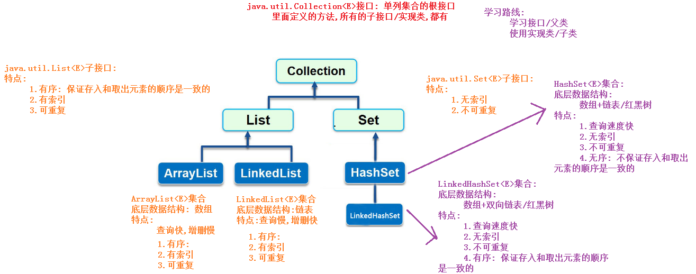
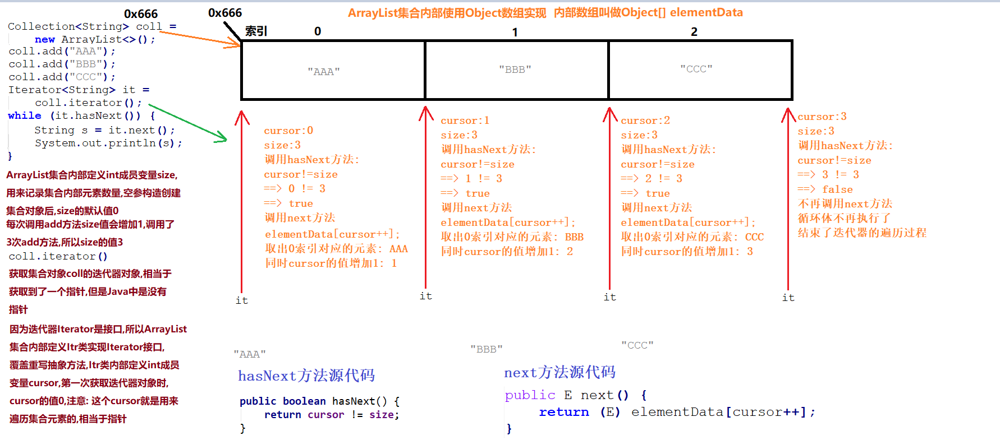
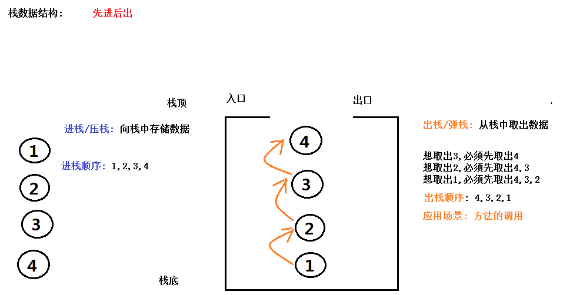
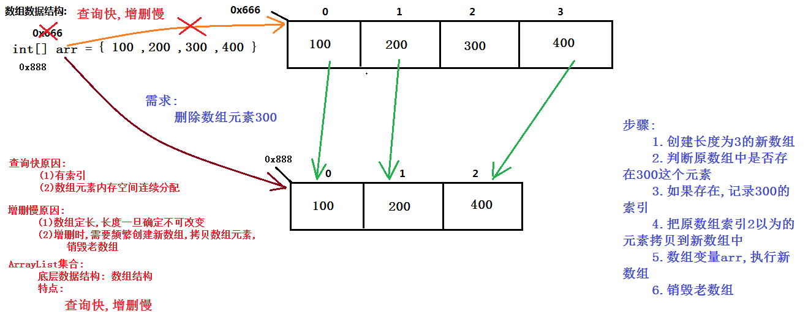
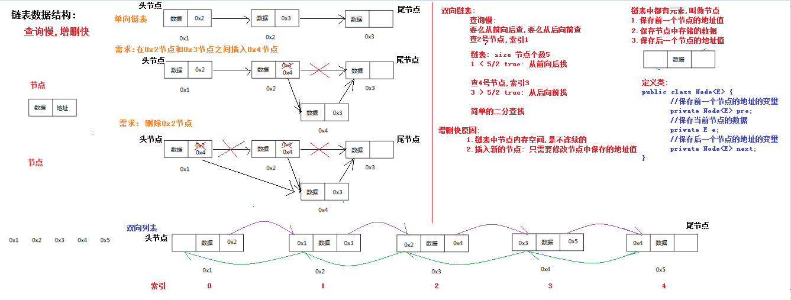
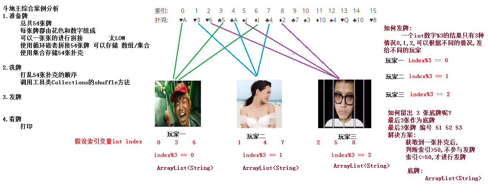

# day06 【集合】

今日内容介绍

```java
对象数组
Collection接口
迭代器
数据结构
List接口
斗地主案例
```

## 第一章 Collection集合【重点】

### 1.1 集合与数组的区别

```java
集合和数组的区别?
1.相同点
    (1)都是容器,都可以存储多个数据
    (2)都可以存储引用类型的数据

2.区别
    (1)数组长度不可变
    (2)集合长度可变
    (3)数组既可以存储基本类型,也可以存储引用类型
    (4)集合只能存储引用类型,如果要存储基本类型,需要存储对应的包装类型
```


### 1.2 Collection集合体系

```java
java.util.Collection<E>接口: 
	单列集合的根接口里面定义的方法,所有的子接口/实现类,都有

    java.util.List<E>子接口:
        特点:
            1.有序: 保证存入和取出元素的顺序是一致的
            2.有索引
            3.可重复

    java.util.Set<E>子接口:
        特点:
            1.无索引
            2.不可重复

    学习路线:
        学习接口/父类
        使用实现类/子类
```




### 1.3 Collection集合中的常用方法

```java
java.util.Collection<E>接口:
    常用方法:
        public boolean add(E e) ： 把给定的对象添加到当前集合中 。
        public boolean addAll(Collection con): 
			把方法参数集合对象con中的所有元素添加到调用方法的集合对象中
			
        public void clear() :清空集合中所有的元素。
        public boolean remove(E e) : 把给定的对象在当前集合中删除。
            有相同元素,只能删除一个

        public boolean contains(Object obj) : 判断当前集合中是否包含给定的对象。
        public boolean isEmpty() : 判断当前集合是否为空。
        public int size() : 返回集合中元素的个数。
        public Object[] toArray() : 把集合中的元素，存储到数组中。
```

```java
public class Demo01Collection {
    public static void main(String[] args) {
        //多态的方式创建Collection集合对象
        Collection<String> coll = new ArrayList<>();

        //add方法添加元素
        coll.add("Hello");
        coll.add("World");
        System.out.println(coll);//默认调用toString方法: [Hello, World]

        Collection<String> subColl = new ArrayList<>();
        subColl.add("Java");
        subColl.add("Python");
        //subColl.add("Python");

        //addAll方法: 把subColl集合中的所有元素添加到coll中
        coll.addAll(subColl);

        System.out.println(coll);//[Hello, World, Java, Python]

        //remove方法,删除"Python"
        coll.remove("Python");

        System.out.println("删除Python后集合内容: "+coll);//[Hello, World, Java]

        //判断是否包含Java
        System.out.println("集合中是否包含Java: "+coll.contains("Java"));//true
        //判断是否包含Python
        System.out.println("集合中是否包含Python: "+coll.contains("Python"));//false

        System.out.println("集合是否为空? "+coll.isEmpty());//false
        System.out.println("集合元素数量: "+coll.size());//3

        //遍历Collection集合对象coll
        for (int i = 0; i < coll.size(); i++) {
            //报错了: 把ArrayList集合对象已经当成了Collection接口使用
            //然而Collection接口中,并没有定义含有索引的方法
            //coll.get(i);
        }
        //toArray方法把Collection集合对象变成数组
        Object[] array = coll.toArray();
        //遍历数组
        for (int i = 0; i < array.length; i++) {
            System.out.println(array[i]);
        }
        System.out.println("-----------");

        //清空集合
        coll.clear();

        System.out.println("集合是否为空? "+coll.isEmpty());//true
        System.out.println("集合元素数量: "+coll.size());//0
    }
}
```


## 第二章 迭代器

### 2.1 迭代器的基本使用

```java
/*
    并不是所有的集合都有索引,所以以前使用for+get(索引)的方式遍历集合,就不通用了
        jdk提供了遍历但列集合的通用方式: 迭代器
    使用迭代器遍历集合对象
        1.多态的方式创建Collection集合对象coll
        2.Collection集合对象coll调用add方法添加数据
        3.Collection集合对象coll调用iterator方法,获取迭代器接口Iterator的实现类对象it
        4.迭代器接口Iterator的实现类对象it调用hasNext方法,判断是否具有下一个元素
        5.如果有: 迭代器接口Iterator的实现类对象it调用next方法,获取下一个元素并输出
 */
public class Demo04Iterator {
    public static void main(String[] args) {
        //1.多态的方式创建Collection集合对象coll
        Collection<String> coll = new ArrayList<>();

        //2.Collection集合对象coll调用add方法添加数据
        coll.add("Hello");
        coll.add("World");
        coll.add("Java");

        //3.Collection集合对象coll调用iterator方法,获取迭代器接口Iterator的实现类对象it
        Iterator<String> it = coll.iterator();

        //4.迭代器接口Iterator的实现类对象it调用hasNext方法,判断是否具有下一个元素
        while (it.hasNext()) {
            //5.如果有: 迭代器接口Iterator的实现类对象it调用next方法,获取下一个元素并输出
            String str = it.next();
            System.out.println("元素: "+str);
        }
   }
}
```


### 2.2 集合存储自定义类型并遍历

```java
//创建标准的学生Student类
public class Student {
    private String name;
    private int age;
    //覆盖重写toString方法
    @Override
    public String toString() {
        return "Student{" +
                "name='" + name + '\'' +
                ", age=" + age +
                '}';
    }
	//空参/满参,set和get
}

```

```java
/*
    集合存储自定义类型(学生Student类型)并遍历
    实现步骤:
        1.创建标准的学生Student类
        2.创建Collection集合对象coll,存储数据的类型是Student
        3.向Collection集合对象coll中添加多个Student对象
        4.获取迭代器Iterator接口的实现类对象it
        5.使用while循环通过迭代器it遍历集合
        5.1 通过迭代器it判断集合中是否具有下一个元素
        5.2 如果有,通过迭代器it获取下一个元素并输出
 */
public class Demo06Iterator {
    public static void main(String[] args) {
        //2.创建Collection集合对象coll,存储数据的类型是Student
        Collection<Student> coll = new ArrayList<>();

        //3.向Collection集合对象coll中添加多个Student对象
        coll.add(new Student("张三", 18));
        coll.add(new Student("李四", 38));
        coll.add(new Student("王五", 28));

        //4.获取迭代器Iterator接口的实现类对象it
        Iterator<Student> it = coll.iterator();

        //5.使用while循环通过迭代器it变量集合
        //5.1 通过迭代器it判断集合中是否具有下一个元素
        while (it.hasNext()) {
            //5.2 如果有,通过迭代器it获取下一个元素并输出
            Student stu = it.next();
            System.out.println(stu);//默认调用toString方法,如果不重写,将打印地址值
        }
    }
}

```

### 2.3 迭代器源代码分析



### 

### 2.4 迭代器的总结

```java
并不是所有的集合都有索引,所以以前使用for+get(索引)的方式遍历集合,就不通用了
        jdk提供了遍历但列集合的通用方式: 迭代器

迭代器是一个接口
java.util.Iterator<E>接口: 专门用来遍历单列集合的
抽象方法:
    public abstract boolean hasNext(): 判断是否具有下一个元素,有: true,没有: false
    public abstract E next(): 获取下一个元素
    public abstract void remove(): 删除当前元素

我们要想使用迭代器遍历单列集合,必须获取到迭代器接口Iterator的实现类对象才可以,
如何获取迭代器接口Iterator的实现类对象

java.util.Collection<E>接口,内部规定了单列集合获取迭代器的方式
内部定义了一个抽象方法: 用来获取迭代器对象的
    public abstract Iterator<E> iterator(): 返回此集合中的元素的迭代器。


Collection是接口,但是我们常用的是其子接口List和Set
对于子接口List而言:
    public interface List<E> extends Collection<E>: 子接口List必然集合父接口Collection

    而父接口中定义了获取迭代器的抽象方法,相当于子接口中也有一个获取迭代器的抽象方法
    public abstract Iterator<E> iterator(): 返回此集合中的元素的迭代器。

List毕竟是接口,要使用它的常用实现类ArrayList集合
    ArrayList集合既然是List接口的实现类,必然实现接口,覆盖重写抽象方法

    public class ArrayList<E> implements List<E> {
        //覆盖重写抽象方法(获取迭代器的抽象方法)
        //该方法的返回值是Iterator接口
        //内部必然返回Iterator接口的实现类对象: 单独定义实现类,内部类,匿名内部类
        public Iterator<E> iterator() {
            //返回实现类对象
            return new Itr();
        }

        //定义在ArrayList集合内部,专门为ArrayList集合服务
        private class Itr implements Iterator<E> {
            //覆盖重写3个抽象方法
            public boolean hasNext() {...}
            public E next() {...}
            public void remove() {...}
        }
    }

    //单独定义实现类
    //不好: 外部可以单独创建该实现了的对象
    public class Itr implements Iterator<E> {
        //覆盖重写3个抽象方法
        public boolean hasNext() {...}
        public E next() {...}
        public void remove() {...}
    }


迭代器的使用步骤:
    1.创建Collection集合对象
    2.向Collection集合对象中添加元素
    3.Collection集合对象调用iterator方法,获取迭代器对象
    4.获取迭代器对象调用hasNext方法判断是否具有下一个元素
    5.如果有下一个元素: 迭代器对象调用next方法,获取下一个元素并输出
    6.如果没有元素: 结束迭代过程
```

### 2.5 并发修改异常

```java
/*
    并发修改异常
        原因: 使用迭代器遍历集合元素时,又通过集合对象本身调用集合的方法,修改了集合的长度
        解决方案:
            使用迭代器遍历集合元素时,不能通过集合对象本身调用集合的方法,修改集合的长度
            (1)使用Collection接口迭代器的方法修改长度: remove
            (2)使用List接口特有迭代器ListIterator中的方法修改长度: remove,add

        面试题一:
            1.并发修改异常的原理是什么?
            2.为什么使用迭代器遍历Collection集合时,使用集合对象的remove方法删除倒数第二个元素,不报并发修改异常?

 */
public class Demo04IteratorException {
    public static void main(String[] args) {
        ArrayList<String> list = new ArrayList<>();
        list.add("AAA");
        list.add("BBB");
        list.add("CCC");
        list.add("DDD");
        //删除元素BBB
        Iterator<String> it = list.iterator();
        while (it.hasNext()) {
            String s = it.next();
            if ("BBB".equals(s)) {
                //list.remove(s);//通过集合修改长度,有问题
                it.remove();//通过迭代器修改长度,没有问题
            }
            /*if ("CCC".equals(s)) {
                list.remove(s);//为什么: 通过集合对象的remove方法删除CCC(集合的倒数第二个元素),就不报并发修改异常的呢?
            }*/
        }
        System.out.println(list);
    }
}
```


## 第三章 数据结构【重点】

### 3.1 栈结构特点

```java
特点:
	先进后出（即，存进去的元素，要在后它后面的元素依次取出后，才能取出该元素）
相关概念:
	压栈：就是存元素。
	弹栈：就是取元素。
```




### 3.2 队列结构特点【重点】

```java
特点:
	先进先出（即，存进去的元素，要在后它前面的元素依次取出后，才能取出该元素）
```


### 3.3 数组数据结构【重点】

```java
特点:
	查询快,增删慢

查询快原因:
	1.有索引
	2.数组元素内存空间连续分配

增删慢原因:	
	1.数组定长,长度一旦确定不可以改变
	2.增删元素时,需要频繁创建新数组,拷贝数组元素,销毁老数组
```




### 3.4 链表结构特点

```java
特点:
	查询慢,增删快
	
查询慢原因: 
	要么从后向前,要么从前向后查(当然源码内部做了优化,确定到底从哪个方向查效率高)
        
增删快原因:
	1.链表中节点的内存空间,是不连续的
	2.插入/删除新节点:只需要修改节点中保存的地址值
    
```



## 第四章 List集合【重点】

### 4.1 List集合特点

```java
java.util.Collection<E>接口: 单列集合的根接口
	    里面定义的方法,所有的子接口/实现类,都有
java.util.List<E>子接口:
    特点:
        1.有序: 保证存入和取出元素的顺序是一致的
        2.有索引: 可以通过索引的方式获取元素
        3.可重复: 可以存储相同的元素

List子接口,除了用于父接口的方法外,额外添加与索引相关的方法
    public void add(int index,E element) 在列表的指定位置上插入元素。
    public E get(int index) 返回列表中指定位置的元素。
    public E set(int index,E element) 用指定元素替换列表中指定位置的元素，并返回替换前的元素。
    public E remove(int index) 移除列表中指定位置的元素，并返回被移除之前的元素。

对于集合,最常用的操作:
    增删改查: C(增: Create)R(查:Read)U(改: Update)D(删: Delete)
```

```java
public class Demo04List {
    public static void main(String[] args) {
        //多态创建List集合对象list
        List<String> list = new ArrayList<>();
        //add方法添加元素
        list.add("AAA");
        list.add("CCC");
        System.out.println(list);//[AAA, CCC]

        //在CCC的前面添加BBB
        list.add(1,"BBB");
        System.out.println(list);//[AAA, BBB, CCC]

        //根据索引删除CCC
        String whoRemoved = list.remove(2);
        System.out.println("谁被删除了呢? "+whoRemoved);//CCC
        System.out.println("删除索引2元素后集合内容: "+list);//[AAA, BBB]

        //把AAA修改成A
        String whoUpdate = list.set(0, "A");
        System.out.println("谁被修改了呢? "+whoUpdate);//AAA
        System.out.println("修改AAA成A后集合内容: "+list);//[A, BBB]

        //把BBB修改成B
        whoUpdate = list.set(1, "B");
        System.out.println("谁被修改了呢? "+whoUpdate);//BBB
        System.out.println("修改AAA成A后集合内容: "+list);//[A, B]

        //获取A和B
        System.out.println(list.get(0)+"..."+list.get(1));

        //能够使用迭代器遍历List集合呢?
    }
}
```


### 4.2 ArrayList集合特点

```java
java.util.Collection<E>接口: 
	单列集合的根接口里面定义的方法,所有的子接口/实现类,都有

java.util.List<E>子接口:
    特点:
        1.有序: 保证存入和取出元素的顺序是一致的
        2.有索引: 可以通过索引的方式获取元素
        3.可重复: 可以存储相同的内容

常用实现类ArrayList集合                -------------使用ArrayList集合--------------
    特点:
        1.底层数据结构:数组
        2.查询快: 元素有索引,元素内存空间连续分析
        3.增删慢:
            数组长度不可改变
            需要频繁创建新数组,拷贝元素,销毁老数组
        4.线程不同步,不安全,效率高

常用实现类Vector集合                -------------不使用Vector集合--------------
    特点:
        1.底层数据结构:数组
        2.查询快: 元素有索引,元素内存空间连续分析
        3.增删慢:
            数组长度不可改变
            需要频繁创建新数组,拷贝元素,销毁老数组
        4.线程同步,安全,效率低
```


### 4.3 LinkedList集合特点

```java
java.util.Collection<E>接口: 
	单列集合的根接口里面定义的方法,所有的子接口/实现类,都有

java.util.List<E>子接口:
    特点:
        1.有序: 保证存入和取出元素的顺序是一致的
        2.有索引: 可以通过索引的方式获取元素
        3.可重复: 可以存储相同的内容

常用实现类LinkedList集合                -------------使用LinkedList集合--------------
    特点:
        1.底层数据结构:双向链表
        2.增删快: 元素分配不连续的,添加/删除元素,只需要找到位置,再修改对应节点保存地址的地方
        3.查询慢:
            要么从前向后查,要么从后向前查
        4.线程不同步,不安全,效率高
LinkedList集合操作链表头和尾的方法
    public void addFirst(E e) :将指定元素插入此列表的开头。
    public void addLast(E e) :将指定元素添加到此列表的结尾。
    public E getFirst() :返回此列表的第一个元素。
    public E getLast() :返回此列表的最后一个元素。
    public E removeFirst() :移除并返回此列表的第一个元素。
    public E removeLast() :移除并返回此列表的最后一个元素。
```


### 4.3 LinkedList集合操作链表头和尾的方法演示

```java
public class Demo06LinkedList {
    public static void main(String[] args) {
        //创建LinkedList集合对象
        LinkedList<String> linked = new LinkedList<>();
        //add方法添加元素
        linked.add("BBB");
        linked.add("CCC");
        System.out.println(linked);//[BBB, CCC]

        //在头上添加AAA
        linked.addFirst("AAA");

        //在尾上添加DDD
        linked.addLast("DDD");
        System.out.println(linked);//[AAA, BBB, CCC, DDD]

        //获取但不删除头节点
        String first = linked.getFirst();
        System.out.println("头节点: "+first);//AAA

        //获取但不删除尾节点节点
        String last = linked.getLast();
        System.out.println("尾节点: "+last);//DDD
        System.out.println("使用get获取头/尾节点后集合内容: "+linked);//[AAA, BBB, CCC, DDD]

        //获取并删除头节点
        first = linked.removeFirst();
        System.out.println("被删除的头节点: "+first);//AAA

        //获取并删除尾节点
        last = linked.removeLast();
        System.out.println("被删除的尾节点: "+last);//DDD
        System.out.println("使用remove获取并删除头/尾节点后集合内容: "+linked);//[BBB, CCC]

    }
}

```


```java
/*
    java.util.LinkedList集合中可以用来模拟栈结构特点的方法
        public void push(E e) :将元素推入此列表所表示的堆栈。
            底层原理: addFirst

        public E pop() :从此列表所表示的堆栈处弹出一个元素。
            底层原理: removeFirst

 */
public class Demo07LinkedList {
    public static void main(String[] args) {
        //创建LinkedList集合对象
        LinkedList<String> linked = new LinkedList<>();
        //push方法模拟向栈中压入数据
        linked.push("1");
        linked.push("2");
        linked.push("3");
        linked.push("4");
        System.out.println(linked);//[4,3,2,1]
        System.out.println(linked.pop());//4
        System.out.println(linked.pop());//3
        System.out.println(linked.pop());//2
        System.out.println(linked.pop());//1
        System.out.println(linked);//[]
    }
}

```


## 第五章 增强for循环

### 5.1 增强for循环介绍

```java
/*
    增强for循环: jdk1.5的新特性
    java.lang.Iterable 接口:
        实现此接口的所有集合都可以使用增强for
        java.util.Collection接口: 是Iterable 接口的子接口
        意味着:
            1.所有的Collection集合对象,都可以使用增强for进行遍历
            2.数组也可以使用增强for进行遍历

    格式:
        for(Collection集合对象/数组对象 存储元素的类型 变量名称 : Collection集合对象/数组对象){
            ...
        }
*/
```


### 5.2 增强for遍历数组

```java
/*
    数组定义格式:
        数据类型[] 数组名称 = new 数据类型[长度];
        int[] arr = new int[3];

    格式:
        for(数组存储元素的类型 变量名称 : 数组) {
            ...
        }

    注意:
        1.变量名称不是用来存储数组的索引值的,而是用来存储数组中的每个元素的
        2.增强for遍历数组底层使用的是普通for
        3.增强for遍历数组时,请不要对数组元素进行增删改的操作,否则出现问题,自己解决
        4.增强for遍历数组快捷键:
            数组名.for
*/            
public class Demo03NBForArray {
    public static void main(String[] args) {
        int[] arr = {10,20,30,50};

        //普通for遍历
        for (int i = 0; i < arr.length; i++) {
            System.out.println(arr[i]);
        }
        System.out.println("-----------------");

        //增强for
        //每次自动从数组中取出一个元素,存储到变量num中
        for(int num : arr){
            System.out.println(num);
        }
        System.out.println("-----------------");

        for (int num : arr) {
            System.out.println(num);
        }

    }
}

```


### 5.3 增强for遍历集合

```java
集合定义格式:
    ArrayList<数据类型> 集合名称 = new ArrayList<数据类型>();
    ArrayList<String> list = new ArrayList<>();

格式:
    for(集合存储元素的类型 变量名称 : 集合) {
        ...
    }

注意:
    1.变量名称不是用来存储集合的索引值的,而是用来存储集合中的每个元素的
    2.增强for遍历集合底层使用的是迭代器
    3.增强for遍历集合时,请不要对集合元素进行增删改的操作,否则出现问题,自己解决
    4.增强for遍历集合快捷键:
        集合名.for
            
public class Demo04NBForCollection {
    public static void main(String[] args) {
        Collection<String> coll = new ArrayList<>();

        coll.add("hello");
        coll.add("world");
        coll.add("java");

        //迭代器
        Iterator<String> it = coll.iterator();

        while(it.hasNext()) {
            System.out.println(it.next());
        }

        System.out.println("-----------");
        //增强for
        //每次自动从集合中取出一个元素,存储到变量s中
        for(String s : coll){
            System.out.println(s);
        }
        System.out.println("-----------");

        for (String s : coll) {
            System.out.println(s);
        }

    }
}

```


## 第六章 可变参数

### 6.1 可变参数的基本使用

```java
可变参数: 可以变化的参数
    在JDK1.5之后，如果我们定义一个方法需要接受多个参数，并且多个参数类型一致，我们可以对其简化.

格式:
    一定是在定义方法参数时,使用: 数据类型 ... 变量名称
    修饰符 返回值类型 方法名称(数据类型 ... 变量名称) {...}

使用:
    可变参数的本质就是数组,调用含有可变参数的方法时,
        可以传递参数列表,可以传递数组,还可以不传参数
public class Demo02VarParams {
    public static void main(String[] args) {
        System.out.println(sum());
        System.out.println(sum(10,20));
        System.out.println(sum(10,20,30));
        System.out.println(sum(10,20,30,40));
        System.out.println("-------------------------");
        System.out.println(sum(new int[]{}));
        System.out.println(sum(new int[]{10}));
        System.out.println(sum(new int[]{10,20}));
        System.out.println(sum(new int[]{10,20}));
        System.out.println(sum(new int[]{10,20,30}));
        System.out.println(sum(new int[]{10,20,30,40}));
    }

    //定义方法,获取多个int数字之和: 使用可变参数的方式,定义方法
    public static int sum(int ... arr) {
        int sum = 0;
        for (int i = 0; i < arr.length; i++) {
            sum += arr[i];
        }
        return sum;
    }


    //定义方法,获取多个int数字之和
    /*public static int sum(int[] arr) {
        int sum = 0;
        for (int i = 0; i < arr.length; i++) {
            sum += arr[i];
        }
        return sum;
    }*/

    /*//定义方法,获取2个int数字之和
    public static int sum(int a, int b) {
        return a + b;
    }

    //定义方法,获取3个int数字之和
    public static int sum(int a, int b,int c) {
        return a + b + c;
    }

    //定义方法,获取4个int数字之和
    public static int sum(int a, int b,int c,int d) {
        return a + b + c + d;
    }*/
}

```


### 6.2 可变参数的注意事项

```java
/*
    注意事项:
        1.可变参数的本质就是数组
        2.调用方法时,可以传递参数列表,可以传递数组,还可以不传参数
        3.方法参数列表中的可变参数,只能定义在参数列表最后
        4.方法参数列表中的可变参数只允许有一个
*/	
public class Demo03VarParams {
    public static void main(String[] args) {
        System.out.println(sum());
        System.out.println(sum(10,20));
        System.out.println(sum(new int[]{10,20,30,40}));
    }
    //错误: 方法参数列表中的可变参数,只能定义在参数列表最后
    /*public static void method(String ...strs,int a) {

    }*/
    public static void method(int a,String ...strs) {

    }
    //错误: 方法参数列表中的可变参数只允许有一个
    /*public static void show(String ... strs,int ... arr) {

    }*/

    //定义方法,获取多个int数字之和: 使用可变参数的方式,定义方法
    public static int sum(int ... arr) {
        int sum = 0;
        for (int i = 0; i < arr.length; i++) {
            sum += arr[i];
        }
        return sum;
    }
}

```


### 6.3 Collections的addAll方法的使用

```java
/*
    java.util.Collections工具类静态方法:
        public static <T> boolean addAll(Collection<T> coll, T... elements) :
            把调用方法时,可变参数列表中的实际数据elements,添加到集合对象coll中
            参数:
                Collection<T> coll: 接口,传递实现类ArrayList/HashSet/LinkedHashSet对象
                T... elements: 可变参数,可以传递数组/参数列表/不传参数
*/        
public class Demo04VarParams {
    public static void main(String[] args) {
        //创建List集合对象,存储花色
        List<String> colors = new ArrayList<>();

        //调用addAll方法: 可变参数,传递的是参数列表
        ////把"♥","♠","♣","♦" 添加到集合对象colors中
        Collections.addAll(colors,"♥","♠","♣","♦");        

        System.out.println(colors);

        //创建List集合对象,存储数字

        List<String> nums = new ArrayList<>();

        String[] arr = "3-4-5-6-7-8-9-10-J-Q-K-A-2".split("-");

        //调用addAll方法: 可变参数,传递的是数组
        Collections.addAll(nums,arr);//把数组arr中的元素 添加到集合对象nums中        
        System.out.println(nums);
    }
}
```


## 第七章  集合模拟斗地主案例

### 7.1 斗地主案例分析

```java
需求:
	按照斗地主的规则，完成洗牌发牌的动作。 
	
具体规则：
	使用54张牌打乱顺序,三个玩家参与游戏，三人交替摸牌，每人17张牌，最后三张留作底牌。
```



### 7.2 准备牌/洗牌/发牌/看牌

```java
/*
    集合模拟斗地主案例
    实现步骤:
        一.准备牌
            1.创建List集合对象pokers,存储数据类型String,代表牌盒,用来存储54张扑克
            2.创建List集合对象nums,存储数据类型String,用来存储数字
            3.向List集合对象nums中存储数字
            4.创建List集合对象colors,存储数据类型String,用来存储花色
            5.向List集合对象colors存储花色
            6.使用循环嵌套遍历存储数字的List集合对象pokers和存储花色的List集合对象colors
            6.1 拼接出一张扑克,保存到String遍历poker中
            6.2 把当前扑克poker添加到牌盒pokers中
            7.想牌盒pokers中添加小王和大王
            8.打印牌盒pokers中的内容

        二.洗牌(打乱牌盒pokers中的元素的顺序)
            java.util.Collections集合工具类中提供静态方法,完成打乱List集合元素顺序
            public static void shuffle(List<?> list): 打乱方法参数List集合对象中的元素的顺序

        三.发牌
            1.创建四个List集合对象,分别代表三个玩家和一个底牌
            2.遍历存储54张扑克的牌盒List集合对象pokers(此处只能使用for+get(索引)的方式遍历,因为迭代器看不到索引)
            2.1 获取到当前扑克,存储到String遍历poker中
            2.2 判断2.1中获取扑克的索引如果大于50,不参与发牌,把当前扑克存储到底牌中
            2.3 否则,说明2.1中获取扑克的索引小于或者等于50,进行发牌,根据索引%3的结果发给不同的玩家

        四: 看牌
            打印三个玩家和底牌对应的集合的内容

        思考1.:
            每个玩家是一个对象,有玩家名称,玩家手里拿到的多张牌(List集合中)
            定义玩家Player类,优化此代码

        思考2:
            在思考1的基础上,分别把准备牌,洗牌,发牌,看牌定义成四个方法
 */
public class PokerGame {
    public static void main(String[] args) {
        //一.准备牌
        //1.创建List集合对象pokers,存储数据类型String,代表牌盒,用来存储54张扑克
        List<String> pokers = new ArrayList<>();
        //2.创建List集合对象nums,存储数据类型String,用来存储数字
        List<String> nums = new ArrayList<>();
        //3.向List集合对象nums中存储数字
        for (int i = 2; i <= 10; i++) {
            nums.add(i+"");
        }
        //添加"J/Q/K/A"
        nums.add("J");
        nums.add("Q");
        nums.add("K");
        nums.add("A");
        //4.创建List集合对象colors,存储数据类型String,用来存储花色
        List<String> colors = new ArrayList<>();
        //5.向List集合对象colors存储花色
        colors.add("♥");
        colors.add("♠");
        colors.add("♦");
        colors.add("♣");
        //6.使用循环嵌套遍历存储数字的List集合对象pokers和存储花色的List集合对象colors
        //遍历存储数字的集合
        for (int i = 0; i < nums.size(); i++) {
            //获取当前数字
            String num = nums.get(i);
            //遍历存储花色的集合
            for (int j = 0; j < colors.size(); j++) {
                //获取花色
                String color = colors.get(j);
                //6.1 拼接出一张扑克,保存到String遍历poker中
                String poker = color + num;
                //6.2 把当前扑克poker添加到牌盒pokers中
                pokers.add(poker);
            }
        }
        //7.想牌盒pokers中添加小王和大王
        pokers.add("小王");
        pokers.add("大王");
        //8.打印牌盒pokers中的内容
        //System.out.println(pokers);
        //System.out.println(pokers.size());
        /*
            二.洗牌(打乱牌盒pokers中的元素的顺序)
            java.util.Collections集合工具类中提供静态方法,完成打乱List集合元素顺序
            public static void shuffle(List<?> list): 打乱方法参数List集合对象中的元素的顺序
         */
        Collections.shuffle(pokers);
        //打印洗牌后的牌盒内容
        //System.out.println(pokers);
        //System.out.println(pokers.size());
        //三.发牌
        //1.创建四个List集合对象,分别代表三个玩家和一个底牌
        List<String> p1 = new ArrayList<>();//玩家一
        List<String> p2 = new ArrayList<>();//玩家二
        List<String> p3 = new ArrayList<>();//玩家三
        List<String> bottom = new ArrayList<>();//底牌
        //2.遍历存储54张扑克的牌盒List集合对象pokers(此处只能使用for+get(索引)的方式遍历,因为迭代器看不到索引)
        for (int i = 0; i < pokers.size(); i++) {
            //2.1 获取到当前扑克,存储到String遍历poker中
            String poker = pokers.get(i);
            //2.2 判断2.1中获取扑克的索引如果大于50,不参与发牌
            if (i > 50) {
                //把当前扑克存储到底牌中
                bottom.add(poker);
            } else {
                //2.3 否则,说明2.1中获取扑克的索引小于或者等于50,进行发牌,根据索引%3的结果发给不同的玩家
                if (i % 3 == 0) {
                    //发给玩家一
                    p1.add(poker);
                } else if (i % 3 == 1) {
                    //发给玩家二
                    p2.add(poker);
                } else {
                    //发给玩家三
                    p3.add(poker);
                }
            }
        }
        //四: 看牌
        System.out.println("宝强: "+p1);
        System.out.println("马金莲: "+p2);
        System.out.println("门庆: "+p3);
        System.out.println("底牌: "+bottom);
    }
}
```


