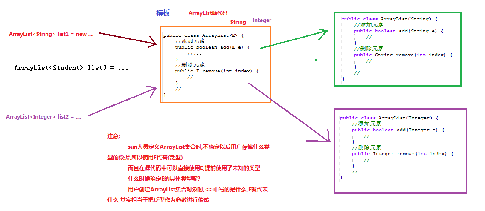
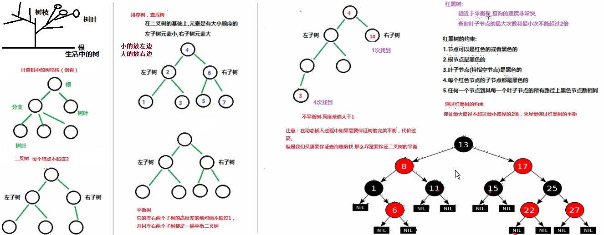
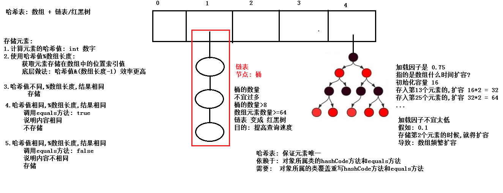
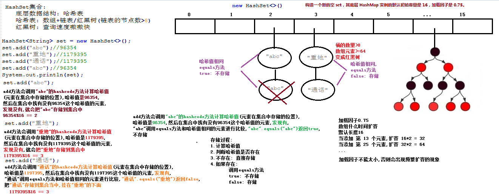

# day07 【集合】

今日内容介绍

```java
Collections工具类
增强for循环
泛型
红黑树
Set集合
```

## 第一章 Collections工具类【重点】

### 1.1 Collections工具类的使用

```java
java.util.Collections类: 操作集合的工具类
特点:
    1.构造方法private修饰
    2.所有成员static修饰

常用方法:
    public static void shuffle(List<?> list): 打乱List集合中元素的顺序
    public static <T> void sort(List<T> list): 将集合中元素按照默认规则排序。
        参数:
            List list: 接口,传递实现类ArrayList/LinkedList对象
		注意: 
			对于数字而言,默认排序规则,按照数字从小到大的顺序排列
			对于字符串而言,默认排序规则,按照第一个不相同的字母的ASCII码值从小到大的顺序排列
		
public class Demo01Collections {
    public static void main(String[] args) {
        List<Integer> list = new ArrayList<>();
        //add: 添加元素
        for (int i = 1;i<=15;i++) {
            list.add(i*100);
        }
        System.out.println("集合原内容: "+list);

        //shuffle方法: 打乱List集合中元素的顺序
        Collections.shuffle(list);
        System.out.println("打乱集合顺序后: "+list);

        //sort方法: 完成排序
        Collections.sort(list);
        
        System.out.println("排序后: "+list);
        
		System.out.println("---------------------------");
        List<String> list2 = new ArrayList<>();
        list2.add("e");
        list2.add("a");
        list2.add("cc");
        list2.add("cb");
        list2.add("bbb");
        list2.add("bab");
        list2.add("babbbbb");

        System.out.println("排序前: "+list2);

        Collections.sort(list2);

        System.out.println("排序后: "+list2);
    }
}
```


### 1.2 Collections排序自定义规则

```java
java.util.Collections类: 操作集合的工具类
特点:
    1.构造方法private修饰
    2.所有成员static修饰

常用方法:
    public static <T> void sort(List<T> list，Comparator<T> con) ：
    	将集合中元素按照方法参数指定规则con进行排序。
        参数:
            List<T> list: 接口,传递实现类ArrayList/LinkedList对象
            java.util.Comparator<T> con:
                接口,作用是用来指定排序规则的,必须传递该接口的实现类对象
                (可以单独定义接口实现类,可以直接传递匿名内部类对象)

            抽象方法:
                public abstract int compare(T o1, T o2):

                    第一个参数 - 第二个参数: 升序排列
                    第二个参数 - 第一个参数: 降序排列

                    注意:
                        T是引用类型,所以不能用o1和o2直接相减,必须获取到属性值进行相减
    思考:
        1.对于int数字,想按照从大到小的顺序排列?
            public int compare(Integer o1, Integer o2) {
                return o2 - o1;
            }

        2.对于字符串,想按照字符串的长度从大到小的顺序排列?
            public int compare(String o1, String o2) {
                return o2.length() - o1.length();
            }

```

```java
public class Demo02Collections {
    public static void main(String[] args) {
        List<Integer> list = new ArrayList<>();
        //add: 添加元素
        for (int i = 15;i>=1;i--) {
            list.add(i*100);
        }

        System.out.println("排序前: "+list);

        //1.对于int数字,想按照从大到小的顺序排列?
        //第一个参数是要排序的List集合对象
        //第二个参数是Comparator接口实现类对象,用于指定排序规则: 匿名内部类对象
        Collections.sort(list, new Comparator<Integer>() {
            @Override
            public int compare(Integer o1, Integer o2) {
                return o2 - o1;
            }
        });

        System.out.println("降序排序后: "+list);

        System.out.println("---------------------------");

        List<String> list2 = new ArrayList<>();

        list2.add("e");
        list2.add("aa");
        list2.add("ccc");
        list2.add("cbbb");
        list2.add("bbbdd");
        list2.add("babeee");
        list2.add("babbbbb");

        System.out.println("排序前: "+list2);
        //按照字符串的长度从大到小的顺序排列?
        //第一个参数是要排序的List集合对象
        //第二个参数是Comparator接口实现类对象,用于指定排序规则: 匿名内部类对象
        Collections.sort(list2, new Comparator<String>() {
            @Override
            public int compare(String o1, String o2) {
                return o2.length() - o1.length();//第二个参数-第一个参数: 降序
            }
        });

        System.out.println("按照长度降序排序后: "+list2);

    }
}
```


### 1.3 Collections排序自定义规则按照学生年龄排序

```java
public class Student {
    private String name;
    private int age;

    @Override
    public String toString() {
        return "Student{" +
                "name='" + name + '\'' +
                ", age=" + age +
                '}';
    }
	//生产空参/满参,set/get方法
}
//Comparator接口实现类指定排序规则(按照年龄升序)
public class CompAge implements Comparator<Student> {
    @Override
    public int compare(Student o1, Student o2) {
        //按照年龄从小到大的顺序
        return o1.getAge() - o2.getAge();
    }
}
//测试类
public class Demo03Collections {
    public static void main(String[] args) {
        List<Student> list = new ArrayList<>();

        list.add(new Student("zs",18));
        list.add(new Student("ls",38));
        list.add(new Student("ww",28));

        System.out.println("年龄升序排序前: "+list);

        //调用sort方法,按照年龄从小到大的顺序
        //第一个参数: List集合对象
        //第二个参数: Comparator接口的实现类对象
        //单独定义Comparator接口的实现类
        Collections.sort(list,new CompAge());

        System.out.println("年龄升序排序后: "+list);


        //调用sort方法,按照年龄从大到小的顺序
        //第一个参数: List集合对象
        //第二个参数: Comparator接口的匿名内部类对象
        Collections.sort(list, new Comparator<Student>() {
            @Override
            public int compare(Student o1, Student o2) {
                //按照年龄从大到小的顺序
                return o2.getAge() - o1.getAge();
            }

        });
        System.out.println("年龄降序排序后: "+list);
    }
}

```

## 第二章 增强for循环

### 2.1 增强for循环介绍

```java
/*
    增强for循环: jdk1.5的新特性
    java.lang.Iterable 接口:
        实现此接口的所有集合都可以使用增强for
        java.util.Collection接口: 是Iterable 接口的子接口
        意味着:
            1.所有的Collection集合对象,都可以使用增强for进行遍历
            2.数组也可以使用增强for进行遍历

    格式:
        for(Collection集合对象/数组对象 存储元素的类型 变量名称 : Collection集合对象/数组对象){
            ...
        }
*/
```


### 2.2 增强for遍历数组

```java
/*
    数组定义格式:
        数据类型[] 数组名称 = new 数据类型[长度];
        int[] arr = new int[3];

    格式:
        for(数组存储元素的类型 变量名称 : 数组) {
            ...
        }

    注意:
        1.变量名称不是用来存储数组的索引值的,而是用来存储数组中的每个元素的
        2.增强for遍历数组底层使用的是普通for
        3.增强for遍历数组时,请不要对数组元素进行增删改的操作,否则出现问题,自己解决
        4.增强for遍历数组快捷键:
            数组名.for
*/            
public class Demo03NBForArray {
    public static void main(String[] args) {
        int[] arr = {10,20,30,50};

        //普通for遍历
        for (int i = 0; i < arr.length; i++) {
            System.out.println(arr[i]);
        }
        System.out.println("-----------------");

        //增强for
        //每次自动从数组中取出一个元素,存储到变量num中
        for(int num : arr){
            System.out.println(num);
        }
        System.out.println("-----------------");

        for (int num : arr) {
            System.out.println(num);
        }

    }
}

```


### 2.3 增强for遍历集合

```java
集合定义格式:
    ArrayList<数据类型> 集合名称 = new ArrayList<数据类型>();
    ArrayList<String> list = new ArrayList<>();

格式:
    for(集合存储元素的类型 变量名称 : 集合) {
        ...
    }

注意:
    1.变量名称不是用来存储集合的索引值的,而是用来存储集合中的每个元素的
    2.增强for遍历集合底层使用的是迭代器
    3.增强for遍历集合时,请不要对集合元素进行增删改的操作,否则出现问题,自己解决
    4.增强for遍历集合快捷键:
        集合名.for
            
public class Demo04NBForCollection {
    public static void main(String[] args) {
        Collection<String> coll = new ArrayList<>();

        coll.add("hello");
        coll.add("world");
        coll.add("java");

        //迭代器
        Iterator<String> it = coll.iterator();

        while(it.hasNext()) {
            System.out.println(it.next());
        }

        System.out.println("-----------");
        //增强for
        //每次自动从集合中取出一个元素,存储到变量s中
        for(String s : coll){
            System.out.println(s);
        }
        System.out.println("-----------");

        for (String s : coll) {
            System.out.println(s);
        }

    }
}

```


## 第三章 泛型【重点】

### 3.1 泛型的好处

```java
/*
    泛型的好处:
        1.避免强制类型转换的麻烦
        2.将运行时异常,提前到了编译时期,降低了程序员的工作量
        3.一旦指定泛型,数据类型将被统一
        4.实现代码的模板化,把数据类型当做参数传递

    泛型可以定义在哪些地方?
        1.可以定义在类上
        2.可以定义在方法(静态方法/非静态方法)上
        3.可以定义在接口上
*/
```

```java
public class Demo03Generic {
    public static void main(String[] args) {
        //创建集合,指定存储数据的类型String
        ArrayList<String> list = new ArrayList<>();
        list.add("aa");
        list.add("bbb");
        list.add("cccc");
        //只能存储String,不能存储Student
        //2.将运行时异常,提前到了编译时期,降低了程序员的工作量
        //list.add(new Student("zs",18));

        //增强for进行遍历
        for (String s : list) {
            System.out.println(s+"的长度: "+s.length());//1.避免强制类型转换的麻烦
        }

        System.out.println("-------------");
        //创建集合,不指定存储数据的类型String
        //全部按照Object类型处理
        ArrayList list2 = new ArrayList();
        list2.add("aa");
        list2.add("bbb");
        list2.add("cccc");
        //可以存
        //但是取出来进行强制类型转换,报出类型转换异常
        //list2.add(new Student("zs",18));

        //增强for进行遍历
        for (Object obj : list2) {
            //把String提升为Object,不能调用String的特有方法
            //必须进行强制类型转换
            System.out.println(obj+"的长度: "+((String)obj).length());
        }
    }
}
```



### 3.2 泛型类的定义【重点】

```java
/*
    泛型: jdk1.5添加的新特性

    泛型类: 定义的类上有属于类自己的泛型 看MyClass03
        定义类时,该类中需要处理某种类型的数据,但是什么类型,不确定,所以定义成泛型
        泛型变量一般用大写字母表示:
            T(Type),E(Element),K(Key),V(Value)

    泛型类的定义格式:
        public class 类名<泛型变量> {
            ...
        }
        比如:
        public class 类名<T> {
            ...
        }

    泛型类上定义的泛型,什么时间确定具体的类型呢?
        创建该类的对象时,<>中写的是什么类型,泛型就代表什么类型
*/
```

```java
//定义泛型类
/*
    定义类时,该类中需要处理某种类型的数据,但是什么类型,不确定,所以定义成泛型

    注意:
        泛型类中可以把泛型当成某种具体的类型提前使用
 */
public class MyClass03<T> {
    //定义变量
    private T t;
    //空参构造方法
    public MyClass03() {
    }
    //满参构造方法
    public MyClass03(T t) {
        this.t = t;
    }

    //set和get方法
    public T getT() {
        return t;
    }

    public void setT(T t) {
        this.t = t;
    }
}
//测试泛型类
public class Demo04GenericClass {
    public static void main(String[] args) {
        //空参构造创建对象
        //确定泛型T的类型: String
        MyClass03<String> mc = new MyClass03<>();//右侧<>中可以不写东西,但是需要保留<>

        //set方法给成员变量赋值
        //只能传String
        mc.setT("hello");
        //创建对象时,确定泛型为String
        //只能传String
        //mc.setT(100);//错误

        //get方法获取成员变量的值
        String str = mc.getT();
        System.out.println(str);        
    }
}

```


### 3.3 非静态泛型方法

```java
泛型: jdk1.5添加的新特性

非静态泛型方法: 定义的方法上有属于方法自己的泛型 看MyClass04
    定义方法时,该方法中需要处理某种类型的数据,但是什么类型,不确定,所以定义成泛型
    泛型变量一般用大写字母表示:
        T(Type),E(Element),K(Key),V(Value)

泛型方法的定义格式:
    //<泛型变>: 定义泛型
    //参列表中: 使用泛型
    修饰符 <泛型变> 返回值类型 方法名称(泛型变量 变量名称) {
        ...
    }
    举例:
    修饰符 <T> 返回值类型 方法名称(T t) {
        ...
    }

方法上定义的泛型,什么时间确定具体的类型呢?
    调用方法时,根据方法参数的类型,确定方法上定义的泛型的具体类型
```

```java
//泛型方法的定义
/*
    定义方法时,该方法中需要处理某种类型的数据,但是什么类型,不确定,所以定义成泛型
    T: 属于类上定义的泛型,该类中所有非静态方法中都可以直接使用
 */
public class MyClass04<T> {
    //不叫泛型方法
    //叫使用类上泛型的方法,因为泛型T不属于方法本身
    public void method(T t) {
        System.out.println(t);
    }

    //叫泛型方法
    //泛型E只属于方法show自己
    public <E> void show(E e) {
        System.out.println(e);
    }
}
//测试类
public class Demo05GenericMethod {
    public static void main(String[] args) {
        //创建对象,类上的泛型T被确定为: String
        MyClass04<String> mc = new MyClass04<>();

        mc.method("hello");
        //使用类上的泛型,只能传递String
        //mc.method(200);

        //show方法上有自己的泛型
        //根据传递的参数,确定泛型的具体类型
        //使用更灵活
        mc.show("java");
        mc.show(100);
        mc.show(new Student("zs",18));        
    }
}
```

### 3.4 静态泛型方法

```java
泛型: jdk1.5添加的新特性
静态泛型方法: 看MyClass05
    静态方法不能使用类上的泛型,必须自己定义

静态泛型方法的定义格式:
    //<泛型变>: 定义泛型
    //参列表中: 使用泛型
    修饰符 static <泛型变> 返回值类型 方法名称(泛型变量 变量名称) {
        ...
    }
    举例:
    修饰符 static <T> 返回值类型 方法名称(T t) {
        ...
    }

静态方法上定义的泛型,什么时间确定具体的类型呢?
    调用方法时,根据方法参数的类型,确定方法上定义的泛型的具体类型
```

```java
/*
    泛型T: 属于类,创建该类的对象时确定
 */
public class MyClass05<T> {
    private MyClass05(){}
    /*
        静态方法: 不能使用类上定义的泛型
            静态方法直接有类名调用,此时没有对象,
            而类上的泛型,必须在创建对象时确定,
            既然没有对象,类上的泛型没有确定
     */
    /*public static void method(T t) {

    }*/

    public static <E> void fun(E e) {
        System.out.println(e);
    }
}
//测试类
public class Demo06GenericMethod {
    public static void main(String[] args) {
        MyClass05.fun("Hello");
        MyClass05.fun(200);
        MyClass05.fun(new Student("ls",28));
    }
}
```


### 3.5 泛型接口

```java
泛型: jdk1.5添加的新特性

泛型接口: 看MyClass05
    定义接口时,该接口中需要处理某种类型的数据,但是什么类型,不确定,所以定义成泛型
    泛型变量一般用大写字母表示:
        T(Type),E(Element),K(Key),V(Value)

定义接口的定义格式:
    public interface 接口名称<泛型变量> {
        ...
    }
    举例:
    public interface 接口名称<T> {
        ...
    }

接口上定义的泛型,什么时间确定具体的类型呢?
    1.实现类实现接口时,确定接口上泛型的具体类型的话,
        直接指定具体类型

    2.定义实现类时,也不确定接口上的泛型
        该实现类必须定义为泛型类
        而且实现类上的泛型和接口上的泛型要保持一致
        创建实现类对象时,确定具体的类型
```

```java
/*
    定义接口时,该接口中需要处理某种类型的数据,但是什么类型,不确定,所以定义成泛型
        接口中的所有非静态方法,都可以使用该泛型
 */
public interface MyInter<T> {
    //抽象方法
    public abstract void method(T t);
}
/*
    实现类实现接口时,确定接口上泛型的具体类型的话,
    直接指定具体类型
 */
public class MyInterImplA implements MyInter<String> {

    @Override
    public void method(String s) {
        System.out.println(s);
    }
}
/*
    定义实现类时,也不确定接口上的泛型
    该实现类必须定义为泛型类
 */
public class MyInterImplB<T> implements MyInter<T> {
    @Override
    public void method(T t) {
        System.out.println(t);
    }
}
//测试类
public class Demo04GenericInterface {
    public static void main(String[] args) {
        MyInterImplA mia = new MyInterImplA();
        
        mia.method("hello");

        MyInterImplB<Student> mib = new MyInterImplB<>();

        mib.method(new Student("ww",38));
        //泛型被确定为Student
        //mib.method(100);
    }
}
```


### 3.6 泛型通配符

```java
/*
	泛型通配符: ?
    	用来匹配泛型的,但是不能使用?定义泛型
*/
public class Demo05TongPeiFu {
    public static void main(String[] args) {
        List<String> list = new ArrayList<>();
        list.add("AAA");
        list.add("BBB");
        list.add("CCC");

        Set<Integer> list2 = new HashSet<>();
        list2.add(111);
        list2.add(222);
        list2.add(333);

        //调用方法
        print(list);
        print(list2);
        System.out.println("-------------");

        //调用方法

        print2(list);
        print2(list2);
    }
    /*
        定义一个方法,完成以上两个集合的遍历
        使用了泛型统配符
     */
    public static void print(Collection<?> coll) {
        for (Object s : coll) {
            System.out.println(s);
        }
    }

    /*
        定义泛型方法
     */
    public static <E> void print2(Collection<E> coll) {
        for (E e : coll) {
            System.out.println(e);
        }
    }
}

```

```java
/*

    泛型通配符: ?
        用来匹配泛型的,但是不能使用?定义泛型

    注意事项:
        1.泛型是不存在多态的,左侧<>中写的类型必须和右侧<>中的类型保持一致(省略右侧<>中的内容)
        2.使用泛型通配符,定义变量:
            List<?> list 可以接收哪些对象?
                只要是List接口实现类的任意泛型对象(创建对象时,只要在<>中写上一种引用类型就可以)都可以
        3.List<?> list: 理解为它是各种泛型List集合对象的父类
 */
public class Demo06TongPeiFuNotice {
    public static void main(String[] args) {
        List<Object> list1 = new ArrayList<>();
        List<Object> list2 = new ArrayList<Object>();
        //List<Object> list3 = new ArrayList<String>();
        //List<Object> list4 = new ArrayList<Integer>();
        //List<Object> list5 = new ArrayList<Student>();

        List<?> list;
        list = new ArrayList<>();//<> 里面是Object
        list = new ArrayList<Object>();//<> 里面是Object
        list = new ArrayList<String>();
        list = new ArrayList<Integer>();
        list = new ArrayList<Student>();
    }
}
```


### 3.7 泛型的上限

```java
/*
    父类: Person
    子类: Worker
    子类: Teacher
    子类: JavaTeacher

        一个父类的子类可以有任意多个,如何表示出一个父类的任意子类呢?
        ?: 任意一种引用类型
        ? extends Person: 表示Person类型或者Person类型的任意子类型
        ? extends E: 表示E类型或者E类型的任意子类型


    泛型的上限:
        ? extends Person: 表示Person类型或者Person类型的任意子类型
        ? extends E: 表示E类型或者E类型的任意子类型
*/
```

```java
//Person类
public class Person {
    private String name;
    private int age;

    @Override
    public String toString() {
        return "Person{" + "name='" + name + '\'' + ", age=" + age + '}';
    }
    //生成空参,满参构造,set和get方法
}
//Worker类
public class Worker extends Person {
    @Override
    public String toString() {
        return "Worker{" + "name='" + getName() + '\'' + ", age=" + getAge() + '}';
    }
    //根据父类生成空参,满参构造
}
//Teacher类
public class Teacher extends Worker {
    @Override
    public String toString() {
        return "Teacher{" + "name='" + getName() + '\'' + ", age=" + getAge() + '}';
    }
    //根据父类生成空参,满参构造
}
//JavaTeacher类
public class JavaTeacher extends Teacher {
    @Override
    public String toString() {
        return "JavaTeacher{" + "name='" + getName()+'\'' + ", age=" + getAge() + '}';
    }
    //根据父类生成空参,满参构造
}

//测试类
public class Demo01ShangXian {
    public static void main(String[] args) {
        ArrayList<Person> list1 = new ArrayList<>();
        list1.add(new Person("zs", 18));
        list1.add(new Person("ls", 28));
        list1.add(new Person("ww", 38));

        ArrayList<Worker> list2 = new ArrayList<>();
        list2.add(new Worker("zs01", 18));
        list2.add(new Worker("ls01", 28));
        list2.add(new Worker("ww01", 38));

        ArrayList<Teacher> list3 = new ArrayList<>();
        list3.add(new Teacher("zs02", 18));
        list3.add(new Teacher("ls02", 28));
        list3.add(new Teacher("ww02", 38));

        ArrayList<String> list4 = new ArrayList<>();
        list4.add("aaa");
        list4.add("bbb");

        ArrayList<Integer> list5 = new ArrayList<>();
        list5.add(100);
        list5.add(200);


        //调用方法
        print(list1);
        print(list2);
        print(list3);
        //print(list4);//错误,因为String不是Person的子类
        //print(list5);//错误,因为Integer不是Person的子类
    }

    /*
        定义一个方法,只能完成以上3个集合的遍历
        	ArrayList<Person>/ArrayList<Worker>/ArrayList<Teacher>
        
        不管是Worker类还是Teacher类,都是Person的子类
        ? extends Person: Person类型或者Person类型的任意子类型
     */
    public static void print(ArrayList<? extends Person> list) {
        for (Person p : list) {
            System.out.println(p);
        }
    }
}

```


### 3.8 泛型的下限

```java
/*
    //使用3.7中定义的Person/Worker/Teacher/JavaTeacher类
    子类: JavaTeacher
    父类: Teacher
    父类: Worker
    父类: Person

        一个子类的父类可以有任意多个,如何表示出一个子类的任意父类呢?
        ?: 任意一种引用类型
        ? super JavaTeacher: 表示JavaTeacher类型或者JavaTeacher类型的任意父类型
        ? super E: 表示E类型或者E类型的任意父类型


    泛型的下限:
        ? super JavaTeacher: 表示JavaTeacher类型或者JavaTeacher类型的任意父类型
        ? extends E: 表示E类型或者E类型的任意父类型
*/
```

```java
public class Demo02XiaXian {
    public static void main(String[] args) {
        ArrayList<Person> list1 = new ArrayList<>();
        list1.add(new Person("zs", 18));
        list1.add(new Person("ls", 28));
        list1.add(new Person("ww", 38));

        ArrayList<Worker> list2 = new ArrayList<>();
        list2.add(new Worker("zs01", 18));
        list2.add(new Worker("ls01", 28));
        list2.add(new Worker("ww01", 38));

        ArrayList<Teacher> list3 = new ArrayList<>();
        list3.add(new Teacher("zs02", 18));
        list3.add(new Teacher("ls02", 28));
        list3.add(new Teacher("ww02", 38));

        ArrayList<String> list4 = new ArrayList<>();
        list4.add("aaa");
        list4.add("bbb");

        ArrayList<Integer> list5 = new ArrayList<>();
        list5.add(100);
        list5.add(200);


        //调用方法
        print(list1);
        print(list2);
        print(list3);
        //print(list4);//错误,因为String不是Teacher的父类
        //print(list5);//错误,因为Integer不是Teacher的父类
    }

    /*
        定义一个方法,只能完成以上3个集合的遍历
        ArrayList<Person>/ArrayList<Worker>/ArrayList<Teacher>
        不管是Person类还是Worker类都是Teacher类的父类
        ? super Teacher: Teacher类型或者Teacher类型的任意父类型

     */
    public static void print(ArrayList<? super Teacher> list) {
        for (Object o : list) {
            System.out.println(o);
        }
    }
}
```


## 第四章 红黑树数据结构【了解】

### 


## 第五章   Set集合

### 5.1 Set集合的特点

```java
java.util.Collection<T>接口: 单列集合的根接口
    里面定义的方法,子接口/实现类 都有

常用子接口:
    java.util.List<T>接口:
    特点:
        1.有序: 保证存入和取出元素的顺序是一致的
        2.有索引
        3.可重复

    java.util.Set<T>接口:
    特点:
        1.无索引
        2.不可重复      研究如何保证元素唯一的

    注意:
        Set接口中的方法和Collection中的方法一样
        Collection中的方法,已经学习过了
```


### 5.2 Set集合的基本使用

```java
/*
    java.util.Set<T>接口常用实现类
    java.util.HashSet<T>集合
    特点:
        1.底层数据结构: 
            哈希表   数组 + 单向链表/红黑树(链表节点>8 并且 数组元素数量>=64,把链表变成红黑树)

        2.特点: 查询速度嗷嗷快,增删速度也不慢
        3.无序: 不保证存入和取出元素的顺序是一致的
        4.无索引
        5.不可重复  依赖于HashSet存储对象所属类的hashCode和equals方法
        6.线程不安全,不同步,但是效率高

    java.util.LinkedHashSet<T>集合
    特点:
        1.底层数据结构: 
            哈希表+链表   数组 + 双向链表/红黑树(链表节点>8 并且 数组元素数量>=64,链表变成红黑树)
        2.特点: 查询速度嗷嗷快,增删速度也不慢
        3.有序: 保证存入和取出元素的顺序是一致的
        4.无索引
        5.不可重复  依赖于HashSet存储对象所属类的hashCode和equals方法
*/
```

```java
public class Demo03Set {
    public static void main(String[] args) {
        //创建HashSet集合对象
        Set<Integer> set = new HashSet<>();

        //add: 添加元素
        set.add(100);
        set.add(100);
        set.add(10000);
        set.add(10000);
        set.add(200);
        set.add(200);
        set.add(200000);
        set.add(200000);
        set.add(300);
        set.add(300);
        set.add(3000000);
        set.add(3000000);

        System.out.println(set);//证明: 无序,不可重复(唯一)
        //set.get(0);//证明: 没有索引

        System.out.println("------------------");

        Set<String> set2 = new LinkedHashSet<>();

        //add: 添加元素
        set2.add("zz");
        set2.add("hhh");
        set2.add("bbbb");
        set2.add("aaaaa");
        set2.add("dddddd");
        set2.add("zz");
        set2.add("hhh");
        set2.add("bbbb");
        set2.add("aaaaa");
        set2.add("dddddd");
        System.out.println(set2);//证明: 有序,,不可重复(唯一)

        //set2.get(3);//证明: 没有索引
    }
}
```


### 5.3 hashCode方法

```java
java.lang.Object类,成员方法:
    public native int hashCode(): 返回该对象的哈希码值,就是一个int数字
    该方法是本地方法,根据系统资源计算一个int数字,叫做哈希值
    支持此方法是为了提高哈希表的性能。
注意:
    1.同一对象,多次调用hashCode方法,要保证获取到的哈希值是相同的
    2.Object类中的hashCode方法,根据系统资源计算一个哈希值(int数字),
		所以只要new创建对象,获取到的哈希值就是不同的
    3.如果自己定义了的类,没有覆盖重写Object类中的hashCode方法,根据系统资源计算一个哈希值(int数字),
        所以只要new创建对象,获取到的哈希值就是不同的
    4.根据对String的测试,发现String类覆盖重写了Object类中的hashCode方法,
		根据字符串内容按照一定算法(存在漏洞)获取哈希值
    假设:
        String根据每个字符的ASCII码值,简单相加获取哈希值

        "abc"   的 哈希值       97 + 98 + 99 = 294
        "cab"   的 哈希值       99 + 97 + 98 = 294
    总结:
        1.哈希值不同,能否说明内容一定不同?
            肯定的,必须的
        2.哈希值相同,能否说明内容一定相同?
            不能的
                继续调用equals方法
                    返回false: 内容不相同
                    返回true: 内容相同
改口:
    以前调用toString方法,说返回的是对象的地址值
    但本质是对象的哈希值
```

```java
public class Demo04HashCode {
    public static void main(String[] args) {
        Object obj1 = new Object();
        int h1 = obj1.hashCode();
        int h2 = obj1.hashCode();
        System.out.println(h1);//356573597
        System.out.println(h2);

        Object obj2 = new Object();
        int h3 = obj2.hashCode();
        System.out.println(h3);//1735600054

        System.out.println(obj1.toString());
        System.out.println(obj2.toString());
        System.out.println("------------------------");

        //字符数组
        char[] chs = {'a','b','c'};

        //把字符数组转换成字符串
        String s1 = new String(chs);
        String s2 = new String(chs);
        System.out.println(s1.hashCode());
        System.out.println(s2.hashCode());
        System.out.println("------------------------");

        System.out.println("重地".hashCode());//1179395
        System.out.println("通话".hashCode());//1179395
    }
}

```

### 5.4 String的哈希值算法

```java
String的哈希值算法
    String内部是字符数组
    String s = "abc";
    String内部的字符数组 char[] value = {'a','b','c'}
    String 的hashCode方法:

    public int hashCode() {
        int h = hash;//hash是String的int类型成员变量,默认值0
        if (h == 0 && value.length > 0) {
            char val[] = value;
            for (int i = 0; i < value.length; i++) {//遍历String内部的字符数组
                h = 31 * h + val[i];
            }
            hash = h;
        }
        return h;
    }

    h = 31 * 0 + 97 = 97

    h = 31 * 97 + 98 = 3105

    h = 31 * 3105 + 99 = 96354
public class Demo05StringHashCode {
    public static void main(String[] args) {
        String s = "abc";
        System.out.println(s.hashCode());//96354
    }
}

```


### 5.5 哈希表的结构



### 5.6 HashSet存储元素的原理

```java
/*
    HashSet集合存储元素的过程
        1.计算哈希值,使用哈希值%数组长度,计算在数组中存储的索引
        2.判断该索引下是否有元素
        3.没有元素: 直接存储
        4.如果有元素:
            调用equals方法
            true: 不存储
            false: 存储

    HashSet集合保证元素唯一: 依赖hashCode方法和equals方法
    要求:
        HashSet集合存储对象所属的类要覆盖重写hashCode方法和equals方法
 */
public class Demo06HashSet {
    public static void main(String[] args) {
        HashSet<String> set = new HashSet<>();
        set.add("abc");//96354
        set.add("重地");//1179395
        set.add("通话");//1179395
        set.add("abc");//96354
        System.out.println("abc".hashCode());
        System.out.println("重地".hashCode());
        System.out.println("通话".hashCode());

        System.out.println(96354%16);
        System.out.println(1179395%16);
    }
}

```





### 5.7 HashSet存储自定义对象

```java
//Student类的内容
public class Student {
    private String name;
    private int age;
	//重写hashCode和equals方法
    @Override
    public boolean equals(Object o) {
        if (this == o) return true;
        if (o == null || getClass() != o.getClass()) return false;
        Student student = (Student) o;
        boolean reulst = age == student.age &&
                Objects.equals(name, student.name);
        System.out.println(this.name+"...equals...."+student.name+"...结果: "+reulst);
        return reulst;
    }

    @Override
    public int hashCode() {
        int h = Objects.hash(name, age);
        System.out.println("计算出 "+this.name+" 的哈希值: "+h);
        return h;
    }
    //生产空参/满参,set/get方法,toString方法
}
/*
    HashSet集合存储自定义对象

    步骤:
        1.创建标准的Student类
        2.创建HashSet集合对象,泛型: Student
        3.向建HashSet集合对象存储多个Student对象
        4.遍历输出

    HashSet集合存储元素的过程
        1.计算哈希值,使用哈希值%数组长度,计算在数组中存储的索引
        2.判断该索引下是否有元素
        3.没有元素: 直接存储
        4.如果有元素:
            调用equals方法
            true: 不存储
            false: 存储

    HashSet集合保证元素唯一: 依赖hashCode方法和equals方法
    要求:
        HashSet集合存储对象所属的类要覆盖重写hashCode方法和equals方法

    特点:
        无序,无索引,不可重复
 */
public class Demo03HashSetStudent {
    public static void main(String[] args) {
        //2.创建HashSet集合对象,泛型: Student
        HashSet<Student> set = new HashSet<>();

        //3.向建HashSet集合对象存储多个Student对象
        set.add(new Student("zs",18));
        set.add(new Student("zs",18));
        set.add(new Student("ls",38));
        set.add(new Student("ls",38));
        set.add(new Student("ww",28));
        set.add(new Student("ww",28));
        //4.遍历输出
        System.out.println(set);
    }
}

```


### 5.8 LinkedHashSet集合的使用

```java
/*
    LinkedHashSet集合存储自定义对象

    步骤:
        1.创建标准的Student类
        2.创建LinkedHashSet集合对象,泛型: Student
        3.向建LinkedHashSet集合对象存储多个Student对象
        4.遍历输出

    LinkedHashSet集合存储元素的过程
        1.计算哈希值,使用哈希值%数组长度,计算在数组中存储的索引
        2.判断该索引下是否有元素
        3.没有元素: 直接存储
        4.如果有元素:
            调用equals方法
            true: 不存储
            false: 存储

    LinkedHashSet集合保证元素唯一: 依赖hashCode方法和equals方法
    要求:
        LinkedHashSet集合存储对象所属的类要覆盖重写hashCode方法和equals方法

    特点:
        有序,无索引,不可重复
 */
public class Demo04LinkedHashSetStudent {
    public static void main(String[] args) {
        //2.创建HashSet集合对象,泛型: Student
        LinkedHashSet<Student> set = new LinkedHashSet<>();

        //3.向建HashSet集合对象存储多个Student对象
        set.add(new Student("zs",18));
        set.add(new Student("zs",18));
        set.add(new Student("ls",38));
        set.add(new Student("ls",38));
        set.add(new Student("ww",28));
        set.add(new Student("ww",28));
        //4.遍历输出
        System.out.println(set);
    }
}

```

