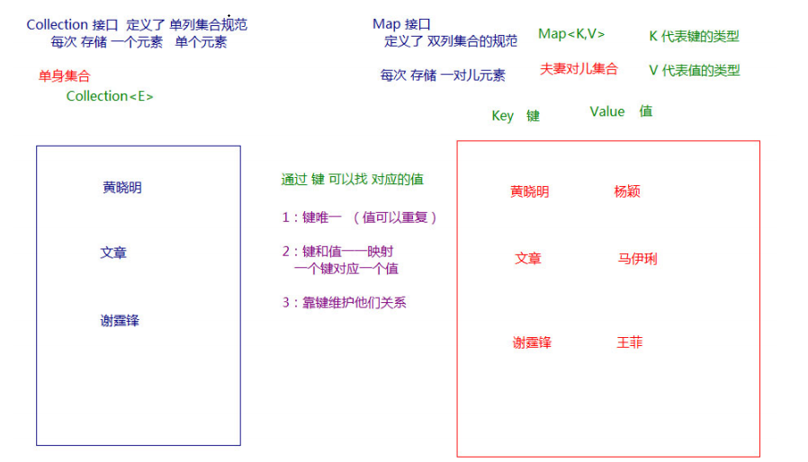
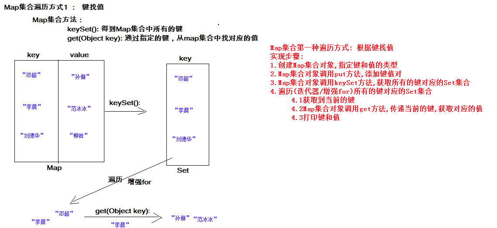
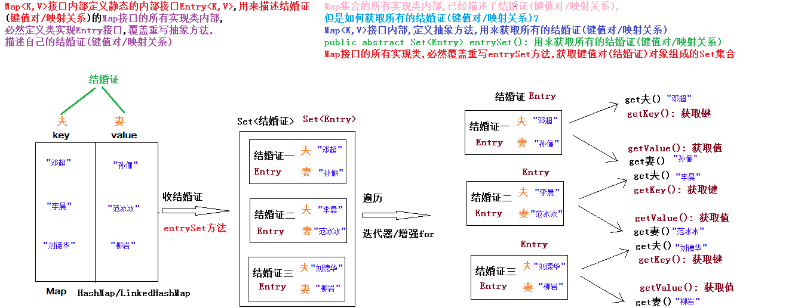
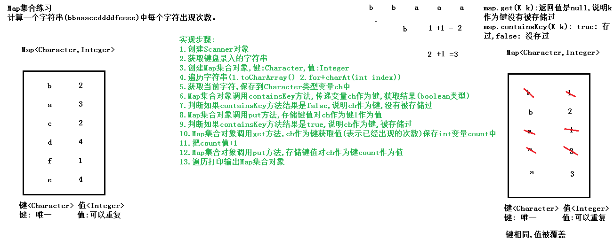
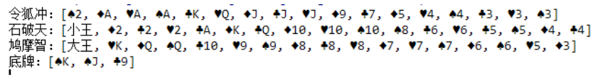
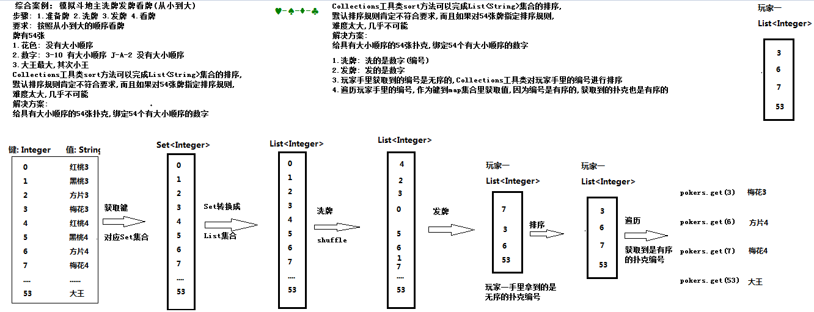
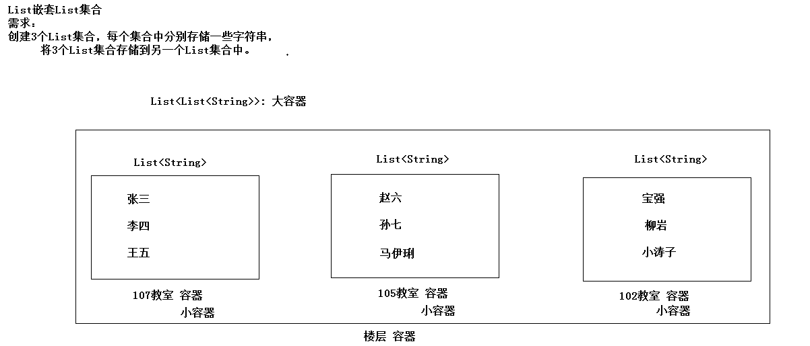
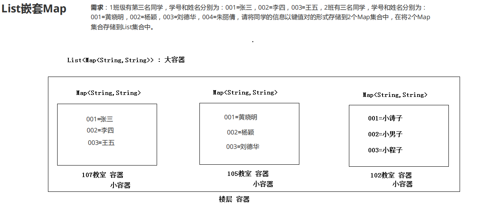
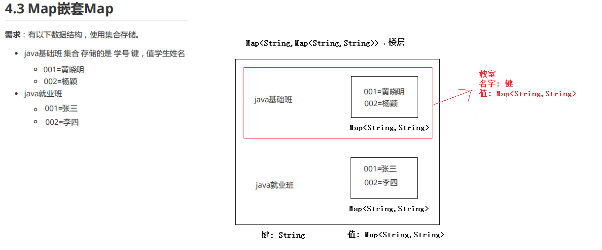

# day08 【集合】

今日内容介绍

```java
Map集合特点
Map集合的遍历方式
方法可变参数
斗地主案例排序
集合的嵌套
```

## 第一章 Map集合【重点】

### 1.1 Map集合的特点

```java
java.util.Map<K,V>接口:
	双列集合根接口,内部定义的方法,子接口/实现类都有
	K: 键的类型,唯一
	V: 值的类型,可以重复
	和java.util.Collection<T>接口: 单列集合的根接口,无关的

Map<K,V>接口的特点:
    1.键唯一,值可以重复
    2.一个键对应一个值,叫一一对应关系(映射关系/键值对关系)
    3.依靠键维护映射关系(可以通过键获取到值,但是不能通过值获取键)
```



### 1.2 Map集合实现类的特点

```java
Map接口常用实现类:
java.util.HashMap<K,V>集合特点          ----使用
    1.键具备哈希特性: 
		哈希表 数组 + 单向链表/红黑树(链表数量>8 同时 数组元素>=64,链表变成红黑树)
    2.查询速度非常快,增删速度也不慢
    3.键要唯一: 键所属的类覆盖重写hashCode和equals方法
    4.键无序: 不保证存入和取出的顺序是一致的
    5.键无索引: 不能通过索引的方式获取键
    6.允许存储null键和null值
    7.线程不同步,不安全,但是效率高

java.util.Hashtable<K,V>集合特点          ----不使用
    1.键具备哈希特性: 哈希表 数组 + 单向链表
    2.查询速度非常快,增删速度也不慢
    3.键要唯一: 键所属的类覆盖重写hashCode和equals方法
    4.键无序: 不保证存入和取出的顺序是一致的
    5.键无索引: 不能通过索引的方式获取键
    6.不允许存储null键和null值
    7.线程同步,安全,但是效率低

java.util.LinkedHashMap<K,V>集合特点          ----使用
    1.键具备哈希特性和链表特性: 
		哈希表 数组 + 双向链表/红黑树(链表数量>8 同时 数组元素>=64,链表变成红黑树)
    2.查询速度非常快,增删速度也不慢
    3.哈希特性保证键要唯一: 键所属的类覆盖重写hashCode和equals方法
    4.链表特性保证键有序: 保证存入和取出的顺序是一致的
    5.键无索引: 不能通过索引的方式获取键
    6.允许存储null键和null值
    7.线程不同步,不安全,但是效率高

```

### 1.3 Map集合的常用方法

```java
Map接口中的常用方法
	public V put(K key, V value) : 把指定的键与指定的值添加到Map集合中。
    	如果键key,是第一次存储,返回null
    	如果键key已经存在,返回是被替换掉的值
    	键相同,值被替换

	public V get(Object key) 根据指定的键，在Map集合中获取对应的值。
    	键不存在: 返回null
	public V remove(Object key) : 
		把指定的键 所对应的键值对元素 在Map集合中删除，返回被删除元素的值。
		
	public boolean containsKey(Object key) :判断该集合中是否有此键。
	public boolean containsValue(Object value) :判断该集合中是否有此值。
//测试代码
public class Demo02Map {
    public static void main(String[] args) {
        //多态创建Map集合对象
        Map<String,String> map = new HashMap<>();

        //public V put(K key, V value) : 把指定的键与指定的值添加到Map集合中。
        String value = map.put("文章","马伊琍");
        System.out.println(value);

        value = map.put("文章","姚笛");
        System.out.println(value);

        map.put("黄晓明","杨颖");

        map.put("谢霆锋","王菲");


        System.out.println(map);

        //获取值"姚笛"
        value = map.get("文章");
        System.out.println(value);

        //没有键
        value = map.get("宝强");
        System.out.println(value);

        //判断是否包含键"黄晓明"
        boolean result = map.containsKey("黄晓明");
        System.out.println("是否包含键黄晓明:"+result);//true

        //判断是否包含键"宝强"
        result = map.containsKey("宝强");
        System.out.println("是否包含键宝强:"+result);//false

        //判断是否包含值"王菲"
        System.out.println("是否包含值王菲: "+map.containsValue("王菲"));//true

        //判断是否包含值"马伊琍"
        System.out.println("是否包含值马伊琍: "+map.containsValue("马伊琍"));//false

        //删除键"文章"
        value = map.remove("文章");
        System.out.println(value);//姚笛
        System.out.println(map);

        System.out.println("键值对数量: "+map.size());//2

        System.out.println("是否为空: "+map.isEmpty());//false

        //清空
        map.clear();

        System.out.println("键值对数量: "+map.size());//0

        System.out.println("是否为空: "+map.isEmpty());//true

    }
}
```

### 1.4 Map集合的获取所有的键和值的功能

```java
Map接口中的常用方法
	public Set<K> keySet() : 获取Map集合中所有的键，存储到Set集合中。
	public Collection<V> values() :返回Map集合中的所有值到Collection集合。
	
public class Demo03Map {
    public static void main(String[] args) {
        //多态创建Map集合对象
        Map<String,Integer> map = new HashMap<>();

        //put: 添加键值对
        map.put("b",98);
        map.put("d",100);
        map.put("a",97);
        map.put("c",99);
        System.out.println(map);

        //keySet方法:获取所有的键对应的Set集合
        Set<String> set = map.keySet();

        //迭代器遍历
        Iterator<String> it = set.iterator();
        while (it.hasNext()) {
            System.out.println(it.next());
        }

        System.out.println("------------");

        //values方法: 获取所有的值对应的Collection集合
        Collection<Integer> coll = map.values();

        //增强for遍历
        for (Integer num : coll) {
            System.out.println(num);
        }
    }
}
```

### 1.5 Map集合的遍历_通过键找值



```java
/*
    Map集合第一种遍历方式: 根据键找值
        实现步骤:
        1.创建Map集合对象,指定键和值的类型
        2.Map集合对象调用put方法,添加键值对
        3.Map集合对象调用keySet方法,获取所有的键对应的Set集合
        4.遍历(迭代器/增强for)所有的键对应的Set集合
            4.1获取到当前的键
            4.2Map集合对象调用get方法,传递当前的键,获取对应的值
            4.3打印键和值
 */
public class Demo02_01MapEach {
    public static void main(String[] args) {        
        //1.创建Map集合对象,指定键和值的类型
        Map<String,String> map = new HashMap<>();
        //2.Map集合对象调用put方法,添加键值对
        map.put("邓超","孙俪");
        map.put("李晨","范冰冰");
        map.put("刘德华","柳岩");		
        //keySet方法+增强for
        //3.Map集合对象调用keySet方法,获取所有的键对应的Set集合
        Set<String> set = map.keySet();
        //4.遍历(增强for)所有的键对应的Set集合
        for (String key : set) {
            //4.1获取到当前的键: key
            //4.2Map集合对象调用get方法,传递当前的键,获取对应的值
            String value = map.get(key);
            //4.3打印键和值
            System.out.println(key+"----"+value);

        }
        System.out.println("-----------------");
        //最简单的增强for遍历
        //快捷键: map.keySet().for
        for (String key : map.keySet()) {
            System.out.println(key+"====="+map.get(key));
        }
        //method02();
    }
}

public class Demo02_02MapEach {
    public static void main(String[] args) {
        //1.创建Map集合对象,指定键和值的类型
        Map<String,String> map = new HashMap<>();
        //2.Map集合对象调用put方法,添加键值对
        map.put("邓超","孙俪");
        map.put("李晨","范冰冰");
        map.put("刘德华","柳岩");        
		//keySet方法+迭代器
        //3.Map集合对象调用keySet方法,获取所有的键对应的Set集合
        Set<String> set = map.keySet();
        //4.遍历(迭代器)所有的键对应的Set集合
        Iterator<String> it = set.iterator();
        while(it.hasNext()) {
            //4.1获取到当前的键
            String key = it.next();
            //4.2Map集合对象调用get方法,传递当前的键,获取对应的值
            String value = map.get(key);
            //4.3打印键和值
            System.out.println(key+"::::"+value);
        }
    }
}
```


### 1.6 Map集合的遍历_通过键值对的方式分析

```java
Map集合遍历方式二: 键值对方式
    原理分析:
    Map<K,V>接口内部定义静态的内部接口Entry<K,V>,用来描述结婚(键值对/映射关系)的
    Map接口的所有实现类内部,必然定义类实现Entry接口,覆盖重写抽象方法,
    描述自己的结婚证(键值对/映射关系)

    Map接口内部静态接口Entry<K,V>抽象方法:
        public abstract K getKey(): 获取键
        public abstract V getValue(): 获取值
        public abstract V setValue(V newValue): 修改值,返回的被修改的值

    Map集合的所有实现类内部,已经描述了结婚证(键值对/映射关系),
		但是如何获取所有的结婚证(键值对/映射关系)?
    Map<K,V>接口内部,定义抽象方法,用来获取所有的结婚证(键值对/映射关系)
    public abstract Set<Entry> entrySet(): 用来获取所有的结婚证(键值对/映射关系)
    Map接口的所有实现类,必然覆盖重写entrySet方法,获取键值对对象组成的Set集合

```




### 1.7 Map集合的遍历_通过键值对的代码实现

```java
/*
    Map集合遍历方式二: 键值对方式
    实现步骤:
        1.创建Map集合对象,指定键和值的类型
        2.Map集合对象调用put方法,添加键值对
        3.Map集合对象调用entrySet方法,获取所有的键值对对应的Set集合
        4.遍历(迭代器/增强for)所有的键值对对应的Set集合
            4.1获取到当前的键值对对象
            4.2当前的键值对对象调用getKey方法,获取键
            4.3当前的键值对对象调用getValue方法,获取值
            4.4打印键和值
 */
public class Demo04_01MapEach {
    public static void main(String[] args) {
        //1.创建Map集合对象,指定键和值的类型
        Map<String,String> map = new HashMap<>();
        //2.Map集合对象调用put方法,添加键值对
        map.put("邓超","孙俪");
        map.put("李晨","范冰冰");
        map.put("刘德华","柳岩");
        //entrySet方法 + 增强for
        //3.Map集合对象调用entrySet方法,获取所有的键值对对应的Set集合
        Set<Map.Entry<String,String>> set = map.entrySet();
        //4.遍历(增强for)所有的键值对对应的Set集合
        for (Map.Entry<String, String> entry : set) {
            //4.1获取到当前的键值对对象: entry
            //4.2当前的键值对对象调用getKey方法,获取键
            //4.3当前的键值对对象调用getValue方法,获取值
            //4.4打印键和值
            System.out.println(entry.getKey()+"::::"+entry.getValue());
        }
        System.out.println("--------------");
        //最简单的增强for
        //快捷键: map.entrySet().for
        for (Map.Entry<String, String> entry : map.entrySet()) {
            System.out.println(entry.getKey()+"::::"+entry.getValue());
        }
    }
}
public class Demo04_01MapEach {
    public static void main(String[] args) {
        //1.创建Map集合对象,指定键和值的类型
        Map<String,String> map = new HashMap<>();
        //2.Map集合对象调用put方法,添加键值对
        map.put("邓超","孙俪");
        map.put("李晨","范冰冰");
        map.put("刘德华","柳岩");
        //3.Map集合对象调用entrySet方法,获取所有的键值对对应的Set集合
        Set<Map.Entry<String, String>> set = map.entrySet();
        //4.遍历(迭代器)所有的键值对对应的Set集合
        Iterator<Map.Entry<String, String>> it = set.iterator();
        while(it.hasNext()) {
            //4.1获取到当前的键值对对象
            Map.Entry<String, String> entry = it.next();
            //4.2当前的键值对对象调用getKey方法,获取键
            String key = entry.getKey();
            //4.3当前的键值对对象调用getValue方法,获取值
            String value = entry.getValue();
            //4.4打印键和值
            System.out.println(key+"::::"+value);
        }
    }
}
```


### 1.8 HashMap存储自定义对象并遍历

```java
//JavaBean类又叫做pojo类
public class Student {
    private String name;
    private int age;
    //覆盖重写hashCode和equals方法
    //生成空参/满参,set/get/toString方法
}
/*
	HashMap存储自定义对象
        练习：每位学生（姓名，年龄）都有自己的家庭住址。那么，既然有对应关系，
        则将学生对象和家庭住址存储到map集合中。学生作为键, 家庭住址作为值。
        注意，学生姓名相同并且年龄相同视为同一名学生。
        
   	使用keySet完成遍历的实现步骤:
        1.创建标准的Studnet类
        2.创建HashMap集合对象,键: Student,值: String
        3.HashMap集合对象调用put方法,添加键值对
        4.HashMap集合对象调用keySet方法,获取所有的键对应的Set集合
        5.使用迭代器遍历所有的键对应的Set集合
            5.1获取当前的键
            5.2HashMap集合对象调用get方法,传递当前的键,获取对应的值
            5.3打印键和值
*/
public class Demo03HashMapTest {
    public static void main(String[] args) {
        //1.创建标准的Studnet类
        //2.创建HashMap集合对象,键: Student,值: String
        HashMap<Student,String> hm = new HashMap<>();

        //3.HashMap集合对象调用put方法,添加键值对
        hm.put(new Student("张三",38),"北京");
        hm.put(new Student("张三",38),"南京");
        hm.put(new Student("李四",18),"上海");
        hm.put(new Student("李四",18),"武汉");
        hm.put(new Student("王五",28),"广州");
        hm.put(new Student("王五",28),"深圳");

        //4.HashMap集合对象调用keySet方法,获取所有的键对应的Set集合
        Set<Student> set = hm.keySet();

        //5.使用迭代器遍历所有的键对应的Set集合
        Iterator<Student> it = set.iterator();
        while(it.hasNext()) {
            //5.1获取当前的键
            Student key = it.next();
            //5.2HashMap集合对象调用get方法,传递当前的键,获取对应的值
            String value = hm.get(key);
            //5.3打印键和值
            System.out.println(key+"::::"+value);
        }
    }
}

```

### 1.9 LinkedHashMap集合的使用

```java
/*
	LinkedHashMap存储自定义对象
        练习：每位学生（姓名，年龄）都有自己的家庭住址。那么，既然有对应关系，
        则将学生对象和家庭住址存储到map集合中。学生作为键, 家庭住址作为值。
        注意，学生姓名相同并且年龄相同视为同一名学生。
    使用entrySet完成遍历
    实现步骤:
        1.创建标准的Student类
        2.创建LinkedHashMap集合对象,键: Student,值: String
        3.LinkedHashMap集合对象调用put方法,添加键值对
        4.LinkedHashMap集合对象调用entrySet方法,获取所有的键值对对应的Set集合
        5.使用增强for遍历所有的键值对对应的Set集合
            5.1获取当前的键值对对象
            5.2键值对对象调用getKey方法,获取对应的键
            5.3键值对对象调用getValue方法,获取对应的值
            5.4打印键和值
*/
public class Demo04LinkedHashMapTest {
    public static void main(String[] args) {
        //1.创建标准的Studnet类
        //2.创建LinkedHashMap集合对象,键: Student,值: String
        LinkedHashMap<Student,String> hm = new LinkedHashMap<>();

        //3.LinkedHashMap集合对象调用put方法,添加键值对
        hm.put(new Student("张三",38),"北京");
        hm.put(new Student("张三",38),"南京");
        hm.put(new Student("李四",18),"上海");
        hm.put(new Student("李四",18),"武汉");
        hm.put(new Student("王五",28),"广州");
        hm.put(new Student("王五",28),"深圳");
        //4.LinkedHashMap集合对象调用entrySet方法,获取所有的键值对对应的Set集合
        Set<Map.Entry<Student, String>> set = hm.entrySet();
        //5.使用增强for遍历所有的键值对对应的Set集合
        for (Map.Entry<Student, String> entry : set) {
            //5.1获取当前的键值对对象: entry
            //5.2键值对对象调用getKey方法,获取对应的键
            //5.3键值对对象调用getValue方法,获取对应的值
            //5.4打印键和值
            System.out.println(entry.getKey()+"::::"+entry.getValue());
        }
    }
}

```


### 1.10 Properties集合介绍

```java
java.util.Properties集合: 代表属性集
	数据存储格式: 属性名=属性值 name=zhangsan age=18 可以存储文件中
	Properties是Hashtable的子类
   	Hashtable是Map集合的实现类
    所以: Properties也是Map集合的实现类,Map集合中定义的方法,它都有

面试题: Hashtable和HashMap的区别?
	1.HashMap可以存储null键和null值
	2.Hashtable不能存储null键和null值
	3.HashMap线程不同步,不安全,但是效率高
	4.Hashtable线程同步,安全,但是效率低

Properties的特点:
    1.Properties也是Map集合的实现类,Map集合中定义的方法,它都有
    2.Hashtable是Map接口的实现类,具有泛型K代表键的类型,V代表值的类型
        但是Properties继承Hashtable时,确定键的类型Object以及值的类型Object
        所以创建Properties集合对象时,不能再指定泛型
    3.Properties集合提供了参数和返回值都是String的方法,而String后期可以写在文件中
    4.Properties集合是唯一一个和IO流配合使用的双列集合

Properties集合的使用
	空参构造
    	public Properties(): 可以直接创建对象
```

### 1.11 Properties集合的基本使用

```java
Properties集合常用方法:
	public Object setProperty(String key,String value): 向集合中存储键值对。
    	等价于Map集合
    	public V put(K k,V v): 向集合中存储键值对。

	public String getProperty(String key): 获取集合中键对应的值，无此键返回null。
    	等价于Map集合
    	public V get(K k): 根据键获取值

	public Set<String> stringPropertyNames(): 集合中的所有键存储到Set集合。
    	等价于Map集合
    	public Set<K> keySet(): 集合中的所有键存储到Set集合。
```

```java
public class Demo04Properties {
    public static void main(String[] args) {
        //创建Properties集合对象
        Properties props = new Properties();
        System.out.println(props);
        //public Object setProperty(String key,String value): 向集合中存储键值对。
        props.setProperty("name","zhangsan");
        props.setProperty("age","18");
        props.setProperty("gender","nan");
        System.out.println(props);

        //public String getProperty(String key): 获取集合中键对应的值，无此键返回null。
        String name = props.getProperty("name");
        String age = props.getProperty("age");
        String gender = props.getProperty("gender");

        System.out.println(name+"::"+age+"::"+gender);

        System.out.println("-------------------");
        //public Set<String> stringPropertyNames(): 集合中的所有键存储到Set集合。
        Set<String> propertyNames = props.stringPropertyNames();

        //增强for遍历
        for (String propertyName : propertyNames) {
            //propertyName: 属性名
            //获取属性值
            String propertyValue = props.getProperty(propertyName);
            System.out.println(propertyName+"::::"+propertyValue);
        }

    }
}
```


### 1.12 Map练习统计字符个数的案例分析



### 1.13 统计字符个数的代码实现

```java
统计一个字符串中每个字符出现次数。
实现步骤:
    1.创建Scanner对象
    2.获取键盘录入的字符串
    3.创建Map集合对象,键:Character,值:Integer
    4.遍历字符串(1.toCharArray() 2.for+charAt(int index))
    5.获取当前字符,保存到Character类型变量ch中
    6.Map集合对象调用containsKey方法,传递变量ch作为键,获取结果(boolean类型)
    7.判断如果containsKey方法结果是false,说明ch作为键,没有被存储过
    8.Map集合对象调用put方法,存储键值对ch作为键1作为值
    9.判断如果containsKey方法结果是true,说明ch作为键,被存储过
    10.Map集合对象调用get方法,ch作为键获取值(表示已经出现的次数)保存int变量count中
    11.把count值+1
    12.Map集合对象调用put方法,存储键值对ch作为键count作为值
    13.遍历打印输出Map集合对象
    
public class Demo01MapCount {
    public static void main(String[] args) {
        //1.创建Scanner对象
        Scanner sc = new Scanner(System.in);
        //2.获取键盘录入的字符串
        System.out.println("请输入一个字符串: ");
        String str = sc.nextLine();
        //3.创建Map集合对象,键:Character,值:Integer
        Map<Character,Integer> map = new HashMap<>();
        //4.遍历字符串(for+charAt(int index))
        for(int i = 0;i<str.length();i++) {
            //5.获取当前字符,保存到Character类型变量ch中
            char ch = str.charAt(i);
            //6.Map集合对象调用containsKey方法,传递变量ch作为键,获取结果(boolean类型)
            boolean result = map.containsKey(ch);
            //7.判断如果containsKey方法结果是false,说明ch作为键,没有被存储过
            //if(result == false) {
            if(!result) {
                //8.Map集合对象调用put方法,存储键值对ch作为键1作为值
                map.put(ch,1);
            } else {
                //9.判断如果containsKey方法结果是true,说明ch作为键,被存储过
                //10.Map集合对象调用get方法,ch作为键获取值(表示已经出现的次数)保存int变量count中
                int count = map.get(ch);
                //11.把count值+1
                count++;
                //12.Map集合对象调用put方法,存储键值对ch作为键count作为值
                map.put(ch,count);
            }
        }
        //13.遍历打印输出Map集合对象
        System.out.println(map);
    }
}
```


## 第二章 可变参数

### 2.1 可变参数的基本使用

```java
可变参数: 可以变化的参数
    在JDK1.5之后，如果我们定义一个方法需要接受多个参数，并且多个参数类型一致，我们可以对其简化.

格式:
    一定是在定义方法参数时,使用: 数据类型 ... 变量名称
    修饰符 返回值类型 方法名称(数据类型 ... 变量名称) {...}

使用:
    可变参数的本质就是数组,调用含有可变参数的方法时,
        可以传递参数列表,可以传递数组,还可以不传参数
public class Demo02VarParams {
    public static void main(String[] args) {
        System.out.println(sum());
        System.out.println(sum(10,20));
        System.out.println(sum(10,20,30));
        System.out.println(sum(10,20,30,40));
        System.out.println("-------------------------");
        System.out.println(sum(new int[]{}));
        System.out.println(sum(new int[]{10}));
        System.out.println(sum(new int[]{10,20}));
        System.out.println(sum(new int[]{10,20}));
        System.out.println(sum(new int[]{10,20,30}));
        System.out.println(sum(new int[]{10,20,30,40}));
    }

    //定义方法,获取多个int数字之和: 使用可变参数的方式,定义方法
    public static int sum(int ... arr) {
        int sum = 0;
        for (int i = 0; i < arr.length; i++) {
            sum += arr[i];
        }
        return sum;
    }


    //定义方法,获取多个int数字之和
    /*public static int sum(int[] arr) {
        int sum = 0;
        for (int i = 0; i < arr.length; i++) {
            sum += arr[i];
        }
        return sum;
    }*/

    /*//定义方法,获取2个int数字之和
    public static int sum(int a, int b) {
        return a + b;
    }

    //定义方法,获取3个int数字之和
    public static int sum(int a, int b,int c) {
        return a + b + c;
    }

    //定义方法,获取4个int数字之和
    public static int sum(int a, int b,int c,int d) {
        return a + b + c + d;
    }*/
}

```


### 2.2 可变参数的注意事项

```java
/*
    注意事项:
        1.可变参数的本质就是数组
        2.调用方法时,可以传递参数列表,可以传递数组,还可以不传参数
        3.方法参数列表中的可变参数,只能定义在参数列表最后
        4.方法参数列表中的可变参数只允许有一个
*/	
public class Demo03VarParams {
    public static void main(String[] args) {
        System.out.println(sum());
        System.out.println(sum(10,20));
        System.out.println(sum(new int[]{10,20,30,40}));
    }
    //错误: 方法参数列表中的可变参数,只能定义在参数列表最后
    /*public static void method(String ...strs,int a) {

    }*/
    public static void method(int a,String ...strs) {

    }
    //错误: 方法参数列表中的可变参数只允许有一个
    /*public static void show(String ... strs,int ... arr) {

    }*/

    //定义方法,获取多个int数字之和: 使用可变参数的方式,定义方法
    public static int sum(int ... arr) {
        int sum = 0;
        for (int i = 0; i < arr.length; i++) {
            sum += arr[i];
        }
        return sum;
    }
}

```


### 2.3 Collections的addAll方法的使用

```java
/*
    java.util.Collections工具类静态方法:
        public static <T> boolean addAll(Collection<T> coll, T... elements) :
            把调用方法时,可变参数列表中的实际数据elements,添加到集合对象coll中
            参数:
                Collection<T> coll: 接口,传递实现类ArrayList/HashSet/LinkedHashSet对象
                T... elements: 可变参数,可以传递数组/参数列表/不传参数
*/        
public class Demo04VarParams {
    public static void main(String[] args) {
        //创建List集合对象,存储花色
        List<String> colors = new ArrayList<>();

        //调用addAll方法: 可变参数,传递的是参数列表
        ////把"♥","♠","♣","♦" 添加到集合对象colors中
        Collections.addAll(colors,"♥","♠","♣","♦");        

        System.out.println(colors);

        //创建List集合对象,存储数字

        List<String> nums = new ArrayList<>();

        String[] arr = "3-4-5-6-7-8-9-10-J-Q-K-A-2".split("-");

        //调用addAll方法: 可变参数,传递的是数组
        Collections.addAll(nums,arr);//把数组arr中的元素 添加到集合对象nums中        
        System.out.println(nums);
    }
}
```


## 第三章 斗地主案例排序

### 3.1 斗地主案例分析

```java
/*
    按照斗地主的规则，完成洗牌发牌的动作。
    具体规则：
        1.组装54张扑克牌将。
        2.54张牌顺序打乱。
        3. 三个玩家参与游戏，三人交替摸牌，每人17张牌，最后三张留作底牌。
        4. 查看三人各自手中的牌（按照牌的大小排序）、底牌。
    规则：
        手中扑克牌从大到小的摆放顺序：大王,小王,2,A,K,Q,J,10,9,8,7,6,5,4,3。
*/
```





### 3.2 斗地主案例准备牌

```java
斗地主综合案例(按照从小到大的顺序看牌)
实现步骤:
    一: 准备牌
        1.创建Map集合pokers,键(编号): Integer,值(内容):String,用来存储54张扑克
        2.创建List集合对象colors,用来存储花色
        3.向List集合对象colors中存储花色
        4.创建List集合对象nums,用来存储数字
        5.向List集合对象nums中存储数字
        6.循环嵌套存储花色的List集合对象colors和存储数字的List集合对象nums
            6.1拼接一张扑克,存储String变量poker中
            6.2把当前扑克poker存储到Map集合pokers中,并绑定编号
        7.存储小王和大王,并绑定编号
        8.打印Map集合对象pokers
```

```java
public class Demo03PokerGame {
    public static void main(String[] args) {
        //一: 准备牌
        //1.创建Map集合pokers,键(编号): Integer,值(内容):String,用来存储54张扑克
        Map<Integer,String> pokers = new HashMap<>();

        //2.创建List集合对象colors,用来存储花色
        List<String> colors = new ArrayList<>();

        //3.向List集合对象colors中存储花色
        Collections.addAll(colors,"♥","♠","♣","♦");//把"♥","♠","♣","♦" 添加到集合对象colors中

        //4.创建List集合对象nums,用来存储数字
        List<String> nums = new ArrayList<>();

        //5.向List集合对象nums中存储数字
        Collections.addAll(nums,"3-4-5-6-7-8-9-10-J-Q-K-A-2".split("-"));//把切割后数组中的元素 添加到集合对象nums中

        //定义int变量,对54张扑克进行编号
        int index = 0;

        //6.循环嵌套存储花色的List集合对象colors和存储数字的List集合对象nums
        for (String num : nums) {
            for (String color : colors) {
                //6.1拼接一张扑克,存储String变量poker中
                String poker = color + num;

                //6.2把当前扑克poker存储到Map集合pokers中,并绑定编号
                pokers.put(index++,poker);
            }
        }

        //7.存储小王和大王,并绑定编号
        pokers.put(index++,"小王");
        pokers.put(index,"大王");

        //8.打印Map集合对象pokers
        //System.out.println(pokers);
        //System.out.println(pokers.size());        
    }
}

```


### 3.3 斗地主案例洗牌

```java
二: 洗牌(洗的是编号)
	1.获取54张牌的编号对应的Set集合
	2.把存储54张牌的编号的Set集合转换成List集合
	3.Collections工具类调用shuffle方法,打乱List集合的顺序
	4.打印List集
```

```java
public class Demo03PokerGame {
    public static void main(String[] args) {
        //一.准备牌
        //上面已经写完....
        
        //二: 洗牌(洗的是编号)
        //1.获取54张牌的编号对应的Set集合
        Set<Integer> set = pokers.keySet();

        //2.把存储54张牌的编号的Set集合转换成List集合
        List<Integer> list = new ArrayList<>(set);

        //3.Collections工具类调用shuffle方法,打乱List集合的顺序
        Collections.shuffle(list);

        //4.打印List集合
        //System.out.println(list);
        //System.out.println(list.size());
    }
}

```

### 3.4 斗地主案例发牌

```java
三: 发牌(发的编号)
	1.创建四个List集合对象,泛型: Integer,代表三个玩家和一个底牌
	2.遍历存储存储54张牌的编号的List集合(根据索引进行发牌,所以只能用for+get(索引))
    	2.1获取到当前扑克的编号
    	2.1判断如果当前索引>50,留作底牌
    	2.2否则(当前索引<=50),如果当前索引%3==0,发给玩家一
    	2.3否则(当前索引<=50),如果当前索引%3==1,发给玩家二
    	2.4否则(当前索引<=50),如果当前索引%3==2,发给玩家三
	
public class Demo03PokerGame {
    public static void main(String[] args) {
        //一.准备牌
        //上面已经写完....
        
        //二: 洗牌(洗的是编号)
        //上面已经写完....
        
        //三: 发牌(发的编号)
        //1.创建四个List集合对象,泛型: Integer,代表三个玩家和一个底牌
        List<Integer> p1 = new ArrayList<>();//玩家一
        List<Integer> p2 = new ArrayList<>();//玩家二
        List<Integer> p3 = new ArrayList<>();//玩家三
        List<Integer> bottom = new ArrayList<>();//底牌

        //2.遍历存储存储54张牌的编号的List集合(根据索引进行发牌,所以只能用for+get(索引))
        for (int i = 0; i < list.size(); i++) {
            //2.1获取到当前扑克的编号
            Integer num = list.get(i);

            //2.1判断如果当前索引>50
            if(i>50) {
                //留作底牌
                bottom.add(num);
            } else if (i % 3 == 0) {
                //2.2否则(当前索引<=50),如果当前索引%3==0,发给玩家一
                p1.add(num);
            } else if (i % 3 == 1) {
                //2.3否则(当前索引<=50),如果当前索引%3==1,发给玩家二
                p2.add(num);
            } else {
                //2.4否则(当前索引<=50),如果当前索引%3==2,发给玩家三
                p3.add(num);
            }

        }
        //3.打印
        //System.out.println(p1.size());
        //System.out.println(p2.size());
        //System.out.println(p3.size());
        //System.out.println(bottom.size());
    }
}
```


### 3.5 斗地主案例看牌

```java
四: 看牌
	1.定义方法lookPokers
    	三要素:
        	(1)方法名称: lookPokers
        	(2)返回值类型: void
        	(3)参数列表:
            	String playerName: 玩家名字
            	List<Integer> list: 玩家手里的扑克编号
            	Map<Integer,String> pokers: 存储54张扑克的Map集合对象

    	实现步骤:
        	1.Collections工具类调用sort方法,对玩家手里的扑克编号进行排序
        	2.打印玩家名字
        	3.遍历存储编号的List集合对象
            	(1)获取当前编号
            	(2)存储54张扑克的Map集合对象调用get方法,传递当前编号作为键,获取对应的值(扑克)
            	(3)打印扑克

	2.调用方方法lookPokers完成看牌	
public class Demo03PokerGame {
    public static void main(String[] args) {
        //一.准备牌
        //上面已经写完....
        
        //二: 洗牌(洗的是编号)
        //上面已经写完....
        
        //三: 发牌(发的编号)
        //上面已经写完....
        
        //四: 看牌
        //调用方法lookPokers,完成看牌
        lookPokers("张三",p1,pokers);
        lookPokers("李四",p2,pokers);
        lookPokers("王五",p3,pokers);
        lookPokers("底牌",bottom,pokers);
    }

    /*
        1.定义方法lookPokers
            三要素:
                (1)方法名称: lookPokers
                (2)返回值类型: void
                (3)参数列表:
                    String playerName: 玩家名字
                    List<Integer> list: 玩家手里的扑克编号
                    Map<Integer,String> pokers: 存储54张扑克的Map集合对象

            实现步骤:
                1.Collections工具类调用sort方法,对玩家手里的扑克编号进行排序
                2.打印玩家名字
                3.遍历存储编号的List集合对象
                    (1)获取当前编号
                    (2)存储54张扑克的Map集合对象调用get方法,
                    	传递当前编号作为键,获取对应的值(扑克)
                    (3)打印扑克
     */
    public static void lookPokers(String playerName, List<Integer> list, Map<Integer, String> pokers) {
        //1.Collections工具类调用sort方法,对玩家手里的扑克编号进行排序
        //Collections.sort(list);
        Collections.sort(list, new Comparator<Integer>() {
            @Override
            public int compare(Integer o1, Integer o2) {
                return o2 - o1;
            }
        });

        //2.打印玩家名字
        System.out.print(playerName+": [ ");

        //3.遍历存储编号的List集合对象
        for (Integer num : list) {
            //(1)获取当前编号: num
            //(2)存储54张扑克的Map集合对象调用get方法,传递当前编号作为键,获取对应的值(扑克)
            String poker = pokers.get(num);

            //(3)打印扑克
            System.out.print(poker+" ");
        }

        System.out.println("]");
    }
}
```


## 第四章 集合练习（重要）

### 4.1 集合嵌套List嵌套List



```java
/*
    List嵌套List集合
    需求：创建3个List集合，每个集合中分别存储一些字符串，将3个List集合存储到另一个List集合中。

    实现步骤:
        1.创建List集合对象bigList,代表楼层(存储多间教室)(小容器),泛型: List<String>
        2.创建三个List集合对象,代表三个教室(小容器),泛型: String
        3.分别向三个小List集合对象中添加数据
        4.把三个小List集合存储到大的List集合对象中
        5.遍历(迭代器/增强for)大的List集合对象bigList
        6.获取到大List集合对象中的当前的小List集合对象smallList
        7.遍历(迭代器/增强for)小的List集合对象smallList
*/
public class Demo03ListList {
    public static void main(String[] args) {
        //1.创建List集合对象bigList,代表楼层(存储多间教室)(小容器),泛型: List<String>
        List<List<String>> bigList = new ArrayList<>();

        //2.创建三个List集合对象,代表三个教室(小容器),泛型: String
        List<String> smallList01 = new ArrayList<>();
        List<String> smallList02 = new ArrayList<>();
        List<String> smallList03 = new ArrayList<>();

        //3.分别向三个小List集合对象中添加数据
        Collections.addAll(smallList01,"张三","李四","王五");
        Collections.addAll(smallList02,"赵六","孙七","马伊琍");
        Collections.addAll(smallList03,"宝强","柳岩","小涛子");

        //4.把三个小List集合存储到大的List集合对象中
        bigList.add(smallList01);
        bigList.add(smallList02);
        bigList.add(smallList03);

        //Collections.addAll(bigList,smallList01,smallList02,smallList03);

        //5.遍历(迭代器)大的List集合对象bigList
        Iterator<List<String>> bigIt = bigList.iterator();//获取大集合的迭代器对象

        while(bigIt.hasNext()) {
            //6.获取到大List集合对象中的当前的小List集合对象smallList
            List<String> smallList = bigIt.next();
            //7.遍历(迭代器)小的List集合对象smallList
            Iterator<String> smallIt = smallList.iterator();//获取小集合的迭代器对象
            while (smallIt.hasNext()) {
                System.out.println(smallIt.next());
            }
            System.out.println("-----------------");
        }
    }
}
```


### 4.2 集合嵌套List嵌套Map



```java
List嵌套Map
        需求：
        	1班级有第三名同学，学号和姓名分别为：
        		001=张三，002=李四，003=王五
        	2班有三名同学，学号和姓名分别为：
        		001=黄晓明，002=杨颖，003=刘德华，004=朱丽倩
        请将同学的信息以键值对的形式存储到2个Map集合中，在将2个Map集合存储到List集合中。
        
    实现步骤:
        1.创建List集合list,代表楼层(多间教室,大容器),泛型: Map<String,String>
        2.创建三个Map集合对象,分别代表教室(小容器),泛型: String,String
        3.分别向三个Map集合对象中添加键值对
        4.把三个Map集合对象添加到List集合对象中(把三间教室,装入楼层中)
        5.遍历(迭代器/增强for)List集合对象
        6.获取到当前的Map集合对象
        7.遍历(迭代器/增强for)当前的Map集合对象(keySet/entrySet方法)
```

```java
public class Demo04ListMap {
    public static void main(String[] args) {
        //1.创建List集合list,代表楼层(多间教室,大容器),泛型: Map<String,String>
        List<Map<String,String>> list = new ArrayList<>();
        //2.创建三个Map集合对象,分别代表教室(小容器),泛型: String,String
        Map<String,String> map01 = new HashMap<>();
        Map<String,String> map02 = new HashMap<>();
        Map<String,String> map03 = new HashMap<>();
        //3.分别向三个Map集合对象中添加键值对
        map01.put("001","张三");
        map01.put("002","李四");
        map01.put("003","王五");
        map02.put("001","黄晓明");
        map02.put("002","杨颖");
        map02.put("003","刘德华");
        map03.put("001","小涛子");
        map03.put("002","小男子");
        map03.put("003","小程子");
        //4.把三个Map集合对象添加到List集合对象中(把三间教室,装入楼层中)
        list.add(map01);
        list.add(map02);
        list.add(map03);
        //Collections.addAll(list,map01,map02,map03);
        //5.遍历(迭代器)List集合对象
        Iterator<Map<String, String>> bigIt = list.iterator();
        while (bigIt.hasNext()) {
            //6.获取到当前的Map集合对象
            Map<String, String> map = bigIt.next();
            //7.遍历(迭代器)当前的Map集合对象(keySet方法)
            Set<String> set = map.keySet();
            Iterator<String> smallIt = set.iterator();
            while (smallIt.hasNext()) {
                String key = smallIt.next();//键
                //根据键获取值
                String value = map.get(key);
                System.out.println(key+"::::"+value);
            }
            System.out.println("----------------------");
        }
    }
}
```


### 4.3 集合嵌套Map嵌套Map



```java
/*
    Map嵌套Map
        需求：有以下数据结构，使用集合存储。
        java基础班 集合 存储的是 学号 键，值学生姓名
            001 张三
            002 李四
        java就业班
            001 王五
            002 赵柳

        实现步骤:
            1.创建大Map集合对象bigMap,代表楼层(大容器),
                泛型: 键 String(教室名字) 值 Map<String,String>(教室中的学生)

            2.创建两个小Map集合对象,代表教室(小容器),泛型: 键: String 值: String
            3.分别向两个小Map集合对象中存储键值对数据
            4.把两个小Map集合对象存储到大的Map集合对象中,指定键: String(教室名字)
            5.遍历(迭代器/增强for)大Map集合对象(keySet/entrySet方法)
            6.获取到当前的小Map集合对象
            7.遍历(迭代器/增强for)小Map集合对象(keySet/entrySet方法)
*/
```

```java
public class Demo05MapMap {
    public static void main(String[] args) {
        //1.创建大Map集合对象bigMap,代表楼层(大容器),泛型: 键 String(教室名字) 值 Map<String,String>(教室中的学生)
        Map<String,Map<String,String>> bigMap = new HashMap<>();

        //2.创建两个小Map集合对象,代表教室(小容器),泛型: 键: String 值: String
        Map<String,String> smallMap01 = new HashMap<>();
        Map<String,String> smallMap02 = new HashMap<>();

        //3.分别向两个小Map集合对象中存储键值对数据
        smallMap01.put("001","黄晓明");
        smallMap01.put("002","杨颖");
        smallMap02.put("001","张三");
        smallMap02.put("002","李四");

        //4.把两个小Map集合对象存储到大的Map集合对象中,指定键: String(教室名字)
        bigMap.put("JavaSE",smallMap01);
        bigMap.put("JavaEE",smallMap02);

        //System.out.println(bigMap);

        //5.遍历(迭代器)大Map集合对象(entrySet方法)
        //获取大Map集合对象的所有键值对组成的Set集合
        Set<Map.Entry<String,Map<String,String>>> bigSet = bigMap.entrySet();        
        Iterator<Map.Entry<String,Map<String,String>>> bigIt = bigSet.iterator();
        while(bigIt.hasNext()) {
            //获取到大Map集合中的一个Entry对象
            Map.Entry<String,Map<String,String>> bigEntry = bigIt.next();            
            String className = bigEntry.getKey();//获取键,班级名称
            System.out.println(className+" 班级有如下学生: ");
            //6.获取到当前的小Map集合对象
            Map<String,String> smallMap = bigEntry.getValue();
            //7.遍历(迭代器)小Map集合对象(entrySet方法)
            //获取到小Map集合中的一个Entry对象组成的Set集合
            Set<Map.Entry<String,String>> smallSet = smallMap.entrySet();            
            //获取到小Map集合中的一个Entry对象组成的Set集合的迭代器对象
            Iterator<Map.Entry<String, String>> smallIt = smallSet.iterator();
            while(smallIt.hasNext()) {
                //获取到小Map集合中的一个Entry对象
                Map.Entry<String, String> smallEntry = smallIt.next();
                String id = smallEntry.getKey();
                String name = smallEntry.getValue();
                System.out.println(id+"="+name);
            }
            System.out.println("-----------------------");
        }
    }
}
```

