# <center>多线程</center>
[toc]
## 多线程的概念
### 并行和并发
```
并行：在同一时刻，有多个指令在多个CPU上同时执行。
并发：在同一时刻，有多个指令在单个CPU是交替执行。
```
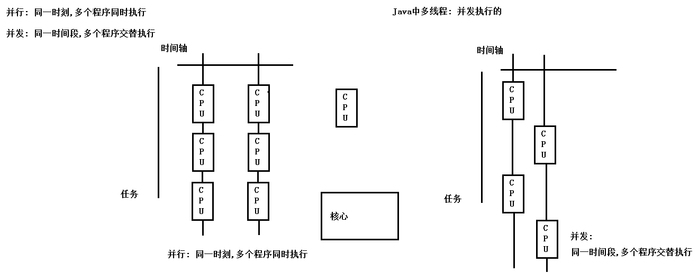
### 进程和线程
```
进程：
1、正在执行的一个程序/软件
2、每个进程：占用独立内存空间
3、独立性：进程是一个能独立运行的基本单位，同时也是系统分配资源和调度的独立单位
4、动态性：进程的实质是程序的一次执行过程，进程是动态产生，动态消亡的。。
5、并发性：任何进程都可以同其他进程一起并发执行
线程：
1、进程中的一个子程序，进程中一个执行路径/执行单元
2、每个线程也有独立的内存空间
3、一个程序执行了一条执行路径，称为单线程程序。
   一个程序执行了多条执行路径，称为多线程程序。
```
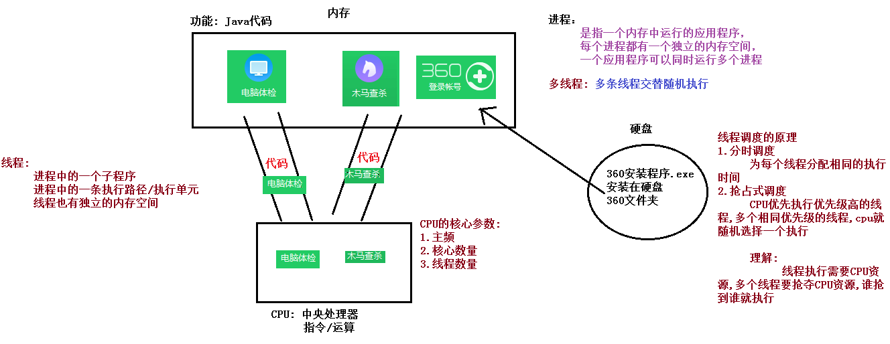
### 线程调度的原理
```
1、分时调度： 为每个线程分配相同的执行时间。
2、抢占式调度：CPU优先执行优先级别高的线程，多个相同优先级的线程，CPU就随机选择一个执行
```
### 主线程
    一个可执行程序中，至少有一个线程，用于执行main方法中的代码，称为主线程/main线程
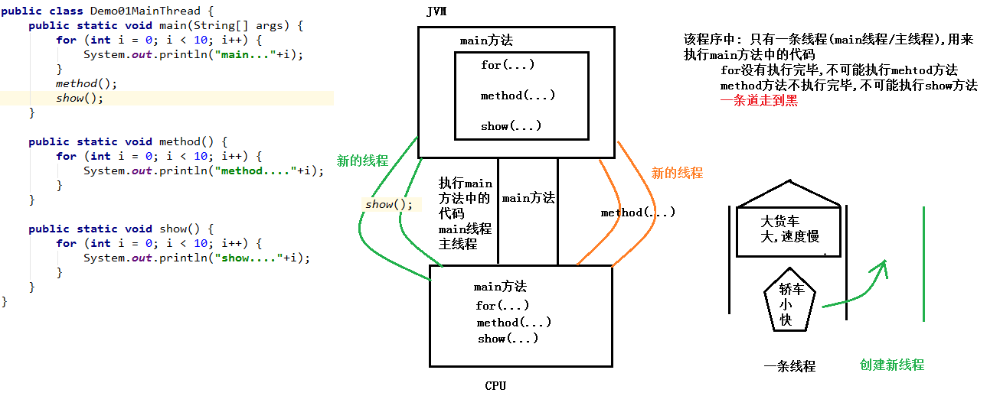
## 线程的创建-继承方式
### 创建线程的第一种方式(继承Tread类)
```
java.lang.Thread类: 代表线程类
	线程 是程序中的执行线程。Java 虚拟机允许应用程序并发地运行多个执行线程。

    创建线程的第一种方式: 继承Thread类
        1.定义类继承Thread类
        2.Thread类的子类覆盖重写run方法,作用是指定线程要执行的任务
        3.创建Thread类的子类对象
        4.Thread类的子类对象调用start方法,开启线程

    注意:
        1.开启线程必须调用start方法,不能直接调用run方法
            如果调用run方法,那么就是普通的方法调用,没有多线程的执行效果
            API中start方法说明: 使该线程开始执行；Java 虚拟机调用该线程的 run 方法。

        2.调用start方法,目的是以多线程的方式执行线程对象中的run方法
            当调用start方法时,start方法瞬间结束,
			但是线程对象中的run方法会继续执行(以多线程的方式执行)

        3.多线程程序运行结果具有随机性
```
```java
/*
    1.定义类继承Thread类
    2.Thread类的子类覆盖重写run方法,作用是指定线程要执行的任务
 */
public class SubThread01 extends Thread {
    @Override
    public void run() {
        for (int i = 1; i <= 100; i++) {
            System.out.println("SubThread01...."+i);
        }
    }
}
//测试类
public class Demo02Thread {
    public static void main(String[] args) {

        //3.创建Thread类的子类对象
        SubThread01 st01 = new SubThread01();

        //4.Thread类的子类对象调用start方法,开启线程
        //st01.run();//如果调用run方法,那么就是普通的方法调用,没有多线程的执行效果

        st01.start();

        for (int i = 1; i <= 100; i++) {
            System.out.println("main~~~~~~~~~~~~~"+i);
        }

       /* Thread t = new Thread();
        t.start();*/
    }
}
```
### 多线程程序运行过程
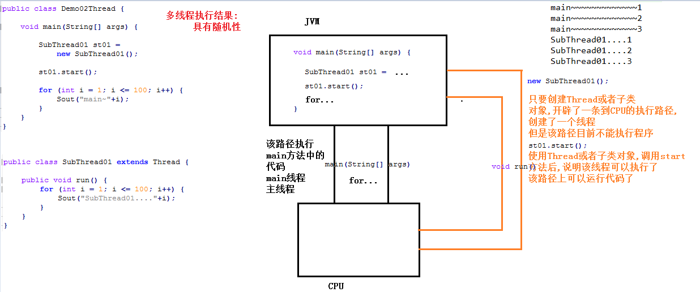
### 继承Thread类开启线程源码分析
```
思考:
	既然Thread是线程类,为什么非得创建Thread的子类对象,并开启线程呢?

	Thread t = new Thread();
	t.start();

	直接创建Thread对象并开启线程,代码肯定没有问题,但是没有运行结果
	原因: 
		Thread类中的run方法指定的线程任务,不是我们想要的(理解: 什么代码都不行),
    	所以要继承Thread,重写run方法,指定我们自己的线程任务

 继承Thread类开启线程源码分析
     Thread类中成员变量:
     private Runnable target;//接口类型,必然传递实现类对象

     目前使用Thread类的空参构造创建对象:
     public Thread() {
         //第二个参数: null
         init(null, null, "Thread-" + nextThreadNum(), 0);
     }

     init方法:第二个参数Runnable接口类型
     //调用init时,第二个参数传递的是null
     //方法调用完毕以后: target == null
     private void init(ThreadGroup g, Runnable target, String name,
                      long stackSize) {
         init(g, target, name, stackSize, null, true);
     }


     线程对象调用start方法(Thread类内部定义的),开启线程
     	start方法,内部调用start0方法
     	start0方法,是native修饰的本地方法
         	private native void start0()
    			该方法内部会调用系统资源,开启线程,调用Thread的run方法

    Thread类run方法源码
    public void run() {
		//因为空参构造创建Thread对象时,target是null target != null false
		if (target != null) {
			target.run();
		}
	}


总结:
	空参构造创建Thread对象,Thread类内部成员变量Runnable接口初始值null
	调用start方法开启线程,会调用run方法,内部判断Runnable是否为null,如果Runnable不是null,
	调用Runnable接口实现类对象的run方法

    如果创建的是Thread子类对象,覆盖重写了Thread类中的run方法
	Thread子类对象调用start方法开启线程,内部调用Thread子类覆盖重写后的run方法
```
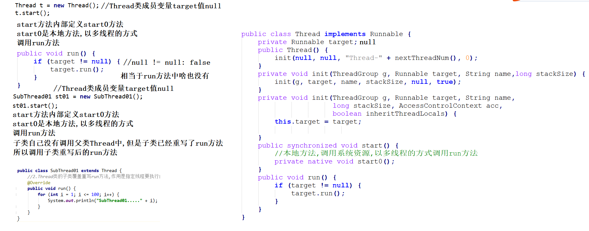
### 多线程的内存解释
```
1.线程对象调用start方法,start方法通知JVM为当前线程对象开辟新的方法执行栈空间,
	执行当前线程对象的run方法
2.每个线程的run方法执行栈空间属于线程私有
3.某一个线程运行中出现异常,不会影响其它线程的执行
```
```java
//Thread类的子类
public class SubThread02 extends Thread {
    @Override
    public void run() {

        for (int i = 1; i <= 100; i++) {
            //获取线程名称
            String threadName = super.getName();
            System.out.println(threadName+"....."+i);
            if(threadName.equals("Thread-0")&&(i==50)) {
                throw new RuntimeException("我要挂掉了,拜拜兄弟们..");
            }
        }
    }
}
//测试类
public class Demo02Thread {
    public static void main(String[] args) {
        //创建2个线程对象
        SubThread02 st01 = new SubThread02();
        SubThread02 st02 = new SubThread02();
        SubThread02 st03 = new SubThread02();

        //调用start方法开启线程
        st01.start();
        st02.start();
        st03.start();
        //throw new RuntimeException();
    }
}
```
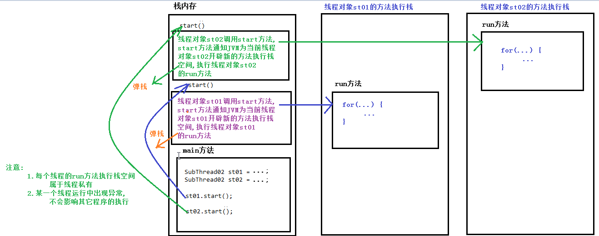
### 获取线程名称
```
获取线程名称:
	1.Thread类的成员方法
     	public String getName(): 返回该线程的名称。
     	public void setName(String name): 设置该线程的名称。
     	public Thread(String name): 通过构造方法指定线程名称

	2.如何获取main线程的名称呢?
    	Thread类的静态方法            更灵活,建议使用
    	public static Thread currentThread(): 返回对当前正在执行的线程对象。
    		此方法currentThread在哪个线程中执行,获取到的就是那个线程对象
```
```java
//Thread的子类
public class SubThread03 extends Thread {
    public SubThread03(String name) {
        super(name);
    }
    @Override
    public void run() {
        //获取线程名称
        //String threadName = super.getName();
        String threadName = Thread.currentThread().getName();
        for (int i = 0; i < 10; i++) {
            System.out.println(threadName+"..."+i);
        }
    }
}
//测试类
public class Demo03Thread {
    public static void main(String[] args) {
        SubThread03 t1 = new SubThread03("zs");
        SubThread03 t2 = new SubThread03("ls");
        SubThread03 t3 = new SubThread03("ww");

        t1.start();
        t2.start();
        t3.start();
        //因为currentThread方法是在main线程中执行
        //返回的main线程对象
        Thread mainThread = Thread.currentThread();
        System.out.println("--------------------------main线程名称: "+mainThread.getName());
    }
}
```
### Thread类sleep方法
```
Thread类的静态方法:
	public static void sleep(long millis): 在指定的毫秒数内让当前正在执行的线程休眠（暂停执行）
//测试类
public class Demo04Sleep {
    public static void main(String[] args) throws InterruptedException {
        //模拟发射火箭
        for (int i = 10; i >= 1; i--) {
            Thread.sleep(1000);
            System.out.println(i);
        }
        System.out.println("发射....");
    }
}
```
## 线程的创建-实现方式
### 线程创建的第二种方式
```
创建线程的方式二
实现步骤:
    1.定义实现类,实现Runnable接口
    2.实现类覆盖重写Runnable接口抽象方法run,用来指定线程要执行的任务
    3.创建Runnable接口的实现类对象
    4.创建Thread线程对象,构造方法传递Runnable接口的实现类对象
    5.Thread线程对象调用start方法,开启线程

创建Thread对象,传递的Runnable接口的实现类对象
	new Thread(task)

Thread类开启线程源码分析
    Thread类中成员变量:
    private Runnable target;//接口类型,必然传递实现类对象

    目前使用Thread类的有参构造创建对象:
    //target: task
    public Thread(Runnable target) {
        init(null, target, "Thread-" + nextThreadNum(), 0);
    }

  	init方法:第二个参数Runnable接口类型
  	//调用init时,第二个参数传递的是task
  	//方法调用完毕以后: target == task
  	private void init(ThreadGroup g, Runnable target, String name,
                      long stackSize) {
      	init(g, target, name, stackSize, null, true);
  	}


  	线程对象调用start方法(Thread类内部定义的),开启线程

  	start方法,内部调用start0方法
  	start0方法,是native修饰的本地方法
      	private native void start0()
 	该方法内部会调用系统资源,开启线程,调用Thread的run方法

	Thread类run方法源码
       public void run() {
       		//因为有参构造创建Thread对象时,target是task task != null true
            if (target != null) {
                target.run();//task.run();
            }
        }
总结:
   使用Runnable接口的方式创建并开启线程,
   最终start方法调用Thread类的run方法,run方法内部调用Runnable接口实现类对象的run方法
```
```java
//定义Runnalbe接口实现类
public class MyRunnable04 implements Runnable {
    @Override
    public void run() {
        for (int i = 1; i <= 100; i++) {
            System.out.println(Thread.currentThread().getName()+"....."+i);
        }
    }
}
//测试类
public class Demo05Thread {
    public static void main(String[] args) {
        //3.创建Runnable接口的实现类对象        
        MyRunnable04 task = new MyRunnable04();

        //4.创建Thread线程对象,构造方法传递Runnable接口的实现类对象       
        Thread t1 = new Thread(task);
        Thread t2 = new Thread(task);
        Thread t3 = new Thread(task);

        //5.Thread线程对象调用start方法,开启线程
        t1.start();
        t2.start();
        t3.start();
    }
}
```
### 第二种方式创建线程的好处
```
问题:
	既然可以继承Thread类,创建并开启线程,为什么还会有实现Runnable接口的方式呢?
        
实现Runnable接口的方式的好处?
    1.避免java类的单继承的局限性
    2.降低了线程对象和线程任务对象的耦合性
        耦合性: 事物与事物之间的关系
        高内聚,低耦合
    3.可以实现多个线程共享一个任务
```
### 匿名内部类方式创建线程
```
匿名内部类方式创建线程
    作用: 创建子类/实现类对象的快捷方式
    格式:
        new 抽象父类/接口(){
            覆盖重写所有的抽象方法
        }

	含义:
		1.该对象没有名字
		2.该对象所属的类没有名字
			(底层: JVM根据抽象类/接口,帮助我们创建一个子类/实现类,并生成构造方法)
```
```java
public class Demo05Thread {
    public static void main(String[] args) {
        //1.匿名内部类方式创建线程: 单独创建创建Runnable接口的实现类对象和线程对象
        //多态创建Runnable接口的实现类对象
        Runnable task1 = new Runnable() {
            @Override
            public void run() {
                System.out.println("线程任务A...");
            }
        };

        //创建线程对象,传递Runnable接口的实现类对象
        Thread t1 = new Thread(task1);

        //线程对象调用start方法开启线程
        t1.start();

        //2.匿名内部类方式创建线程: 单独创建Thread对象,传递Runnable接口的实现类对象

        Thread t2 = new Thread(new Runnable() {
            @Override
            public void run() {
                System.out.println("线程任务B...");
            }
        });

        t2.start();

        //3.匿名内部类方式创建线程: 直接创建Thread对象并开启线程,传递Runnable接口的实现类对象

        new Thread(new Runnable() {
            @Override
            public void run() {
                System.out.println("线程任务C...");
            }
        }).start();


    }
}
```
## 线程安全
### 卖票案例分析
```
多线程操作共享数据的安全问题
    练习: 3个线程共同销售100张电影票
    
分析:
        1.总共有3个卖票途径,相当于有3个线程
        2.这3个线程的任务是相同的,都是卖票
        3.这3个线程共同销售这100张票,这100张票是3个线程的共享数据

实现步骤:
    1.定义类实现Runnable接口
    2.Runnable接口的实现类,覆盖重写run方法,指定线程任务
        线程任务: 3个线程任务都是卖票
        卖票的步骤:
            (1)判断是否有票
            (2)有票: 打印输出一张票
            (3)票的数量减少1张
    3.创建Runnable接口的实现类的对象,线程任务对象
    4.创建3个线程对象,构造方法发传递线程任务对象
    5.这3个线程对象分别调用start方法,开启线程
```
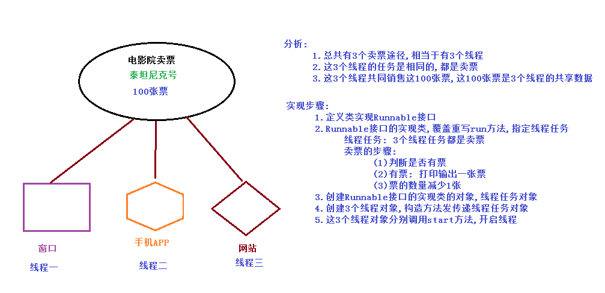
### 代码实现
```java
//创建Runnable接口的实现类,覆盖重写run方法
public class MySellTicketTask01 implements Runnable {
    //多个线程共享的数据
    private int num = 100;

    @Override
    public void run() {
        //int num = 100;//100张票被三个线程共享使用
        //死循环
        while(true) {
            //(1)判断是否有票
            if (num > 0) {
                //(2)有票: 打印输出一张票
                //模拟出票的时间
                try {Thread.sleep(10);}catch (Exception e){e.printStackTrace();}
                String threadName = Thread.currentThread().getName();
                System.out.println(threadName+"卖出第 "+num+" 张票...........");
                //(3)票的数量减少1张
                num--;
            }
        }
    }
}
//测试类
public class Demo01Tickets {
    public static void main(String[] args) {
        //3.创建Runnable接口的实现类的对象,线程任务对象
        MySellTicketTask01 task = new MySellTicketTask01();

        //4.创建3个线程对象,构造方法发传递线程任务对象
        Thread t1 = new Thread(task);
        Thread t2 = new Thread(task);
        Thread t3 = new Thread(task);

        //5.这3个线程对象分别调用start方法,开启线程
        t1.start();
        t2.start();
        t3.start();
    }
}
```
```
运行结果：
: 多线程操作共享数据,出现错误的数据
    错误数据一
    Thread-0卖出第 100 张票...........
    Thread-2卖出第 100 张票...........
    Thread-1卖出第 100 张票...........

    错误数据二
    Thread-0卖出第 1 张票...........
    Thread-2卖出第 0 张票...........
    Thread-1卖出第 -1 张票...........
    或者
     Thread-0卖出第 1 张票...........
    Thread-2卖出第 1 张票...........
    Thread-1卖出第 1 张票...........
```
### 错误原因
```
错误数据一:
	Thread-1 卖出第 100 张票....
	Thread-0 卖出第 100 张票....
	Thread-2 卖出第 100 张票....
	产生原因:
		3个线程在num==100时,分别获取到cpu资源,
		输出第100张票,但是还没有执行num--时(num--前),
		cpu资源被别的线程抢走了
		
错误数据二:
	Thread-0 卖出第 1 张票....
	Thread-2 卖出第 0 张票....
	Thread-1 卖出第 -1 张票....
	产生原因:
		3个线程在num==1时,分别进入if,在执行输出语句之前,
		cpu执行权被别的线程抢走了,导致3个线程分别在if内部,
		输出语句之前等着,分别再获取cpu资源后,向下执行,而且
		每个线程只要获取到cpu执行权,就把剩余2步操作执行完毕,
		一步是输出票,一步是票号--,然后重新执行if判断结果为false,线程结束

多线程操作共享数据,出现错误数据是不允许的,必须解决
原因:
	1.至少要有2个及以上的线程
	2.操作共享数据的语句至少要有2条及以上
	3.线程对象在执行操作共享数据的多条语句的过程中,
		被别的线程影响到了/打扰到了(cpu资源被别的线程抢走了)
		
解决方案:
	线程对象在执行操作共享数据的多条语句的过程中,
	不能被别的线程影响到/打扰到
	操作共享数据的多条语句,被一个线程执行时,要么全部都执行,
	要么全部都不执行
	
具体体现: 使用同步技术
	保证操作共享数据的多条语句,要么全部执行,要么全部都不执行
```
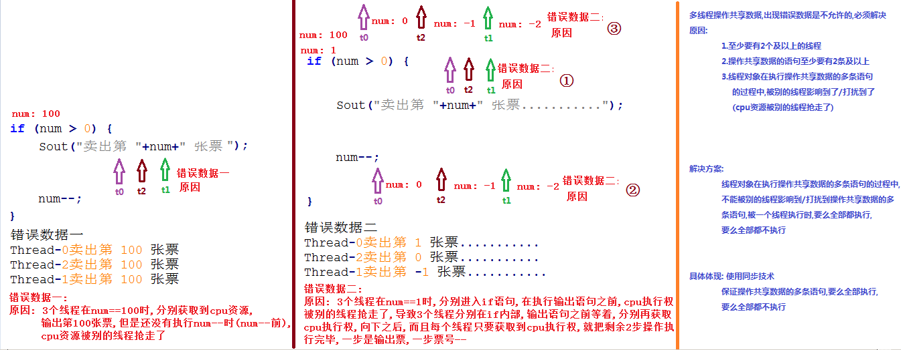
```
解释：
三个线程实现的是抢占式调度，所以当一线程进入if判断语句的时候可能就又第二线程进入占用CPU去执行，
导致第一个线程只能在里面呆着，除非他抢到了CPU使用权来执行它未完成操作。
```
### 解决方式：
#### 同步原理
```
使用同步解决多线程访问共享数据,出现错误数据
原理: 有锁的线程执行,没有锁的线程,必须等待

线程执行前提: 1.cpu资源 2.锁对象

假设一:
	假设t0线程获取cpu资源,执行线程任务
	遇到同步代码块,判断是否具有锁对象
	有: 获取锁对象	
	进入同步代码块,执行同步代码,假设t0在执行的过程
	中,没有其它线程抢夺cpu资源,t0线程执行完毕同步中
	的代码后,出同步,释放锁对象,继续和其它线程抢夺cpu资源
	
假设二:
	假设t0线程获取cpu资源,执行线程任务
	遇到同步代码块,判断是否具有锁对象
	有: 获取锁对象    
	进入同步代码块,执行同步代码,假设t0在执行的过程
	中,其它线程抢夺到cpu资源,t0线程不能继续执行,其它线程
	虽然拿到cpu资源,但是在执行同步代码时,发现没有锁,其它
	线程必须在同步外,等待	
	直到t0线程再次获取cpu资源,继续执行,出同步,释放锁,继续
	和其它线程,抢夺cpu资源

线程对象,执行同步代码块中的内容,要么全部执行,
要么全都不执行,不能够被其它线程干扰/影响
```
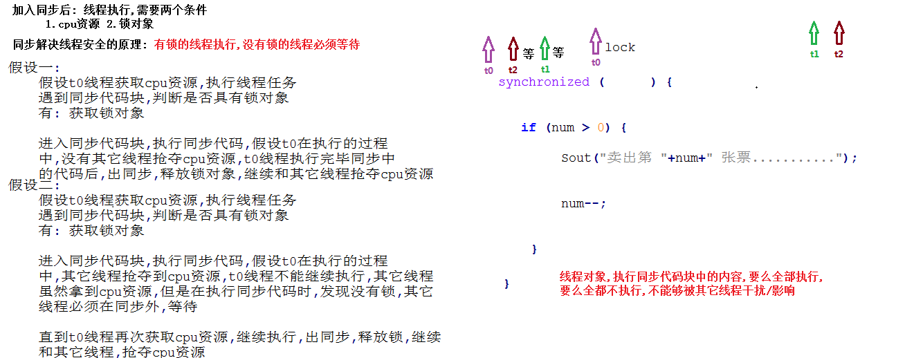
### 方式一：同步代码块
```
使用同步代码块解决线程安全问题
同步代码块
	1.格式:
    	synchronized(任意对象) {
        	...
    	}
	2.注意:
    	(1)所有操作共享数据的代码必须写在{}中
    	(2)任意对象: 锁对象/对象锁,专业术语对象监视器
    	(3)锁对象可以是任意对象,但是必须要保证唯一
```
```java
//创建Runnable接口的实现类
public class MySellTicketTask02 implements Runnable {
    //多个线程共享的数据
    private int num = 100;

    //锁对象可以是任意对象,但是必须要保证唯一
    //因为MySellTicketTask02的对象只有一个
    //成员lock只有一份,保证了唯一
    private Object lock = new Object();

    @Override
    public void run() {
        //int num = 100;//100张票被三个线程共享使用
        //死循环
        while(true) {

            //同步代码块
            //synchronized (new Object()) {//Object对象作为锁对象,会出现3个
            //synchronized (lock) {
            synchronized (this) {//this代表调用run方法的对象task,而task只有一个
                //(1)判断是否有票
                if (num > 0) {
                    //(2)有票: 打印输出一张票
                    //模拟出票的时间
                    try {Thread.sleep(100);}catch (Exception e){e.printStackTrace();}
                    String threadName = Thread.currentThread().getName();
                    System.out.println(threadName+"卖出第 "+num+" 张票...........");

                    //(3)票的数量减少1张
                    num--;
                }

            }
        }
    }
}
```
```java
//测试类
public class Demo02Tickets {
    public static void main(String[] args) {
        //3.创建Runnable接口的实现类的对象,线程任务对象
        MySellTicketTask02 task = new MySellTicketTask02();

        //4.创建3个线程对象,构造方法发传递线程任务对象
        Thread t1 = new Thread(task);
        Thread t2 = new Thread(task);
        Thread t3 = new Thread(task);

        //5.这3个线程对象分别调用start方法,开启线程
        t1.start();
        t2.start();
        t3.start();
    }
}
```
### 方式二：同步方法
```
同步方法
1.格式:
    修饰符 synchronized 返回值类型 方法名称(参数列表...){
        方法体代码
    }

    同步方法的定义格式比以前定义方法,就多了一个关键字synchronized
    同步方法的定义格式中,并没有体现出锁对象,同步方法中的锁对象是不可以自己指定的

2.注意:
    (1)所有操作共享数据的代码必须写在{}中
    (2)同步方法不能自己指定锁对象
    (3)非静态同步方法而言:
        锁对象,必须有: this

    静态同步方法内部锁对象: 静态方法所在类的Class对象
        MySellTicketTask03.class
```
```java
//创建Runnable接口的实现类
public class MySellTicketTask03 implements Runnable {
    //多个线程共享的数据
    private int num = 100;

    //锁对象可以是任意对象,但是必须要保证唯一
    //因为MySellTicketTask02的对象只有一个
    //成员lock只有一份,保证了唯一
    private Object lock = new Object();

    @Override
    public void run() {
        //int num = 100;//100张票被三个线程共享使用
        //死循环
        while(true) {
            //调用sellA方法
            //sellA();
            //调用sellB方法
            sellB();
        }
    }

    //定义同步方法sellB,不能指定锁对象
    //使用this作为锁对象
    public synchronized void sellB() {

        //(1)判断是否有票
        if (num > 0) {
            //(2)有票: 打印输出一张票
            //模拟出票的时间
            try {Thread.sleep(100);}catch (Exception e){e.printStackTrace();}
            String threadName = Thread.currentThread().getName();
            System.out.println(threadName+"卖出第 "+num+" 张票...........");

            //(3)票的数量减少1张
            num--;
        }
    }

    //定义普通方法sellA,内部使用同步代码块
    public void sellA() {
        //this代表调用sellA方法的对象,sellA方法是在run方法内部调用的,哪个对象调用run方法,该对象就是调用sellA方法的对象
        //task对象调用run方法,sellA方法也是由task对象
        synchronized (this) {
            //(1)判断是否有票
            if (num > 0) {
                //(2)有票: 打印输出一张票
                //模拟出票的时间
                try {Thread.sleep(10);}catch (Exception e){e.printStackTrace();}
                String threadName = Thread.currentThread().getName();
                System.out.println(threadName+"卖出第 "+num+" 张票...........");

                //(3)票的数量减少1张
                num--;
            }

        }
    }
}
```
```java
//测试类
public class Demo03Tickets {
    public static void main(String[] args) {
        //3.创建Runnable接口的实现类的对象,线程任务对象
        MySellTicketTask03 task = new MySellTicketTask03();


        //4.创建3个线程对象,构造方法发传递线程任务对象
        Thread t1 = new Thread(task);
        Thread t2 = new Thread(task);
        Thread t3 = new Thread(task);

        //5.这3个线程对象分别调用start方法,开启线程
        t1.start();
        t2.start();
        t3.start();
    }
}
```
## lock接口
```
jdk1.5提供了Lock接口
Lock接口在juc包(并发包: java.util.concurrent)里面
    java.util.concurrent.locks.Lock接口: 比同步方法/同步代码块使用更灵活
        抽象方法:
            public abstract void lock(): 获取锁。
            public void unlock(): 释放锁。  释放资源的动作必须要执行

    常用实现类:
        java.util.concurrent.locks.ReentrantLock类:

        空参构造方法: 直接创建对象
            pubic ReentrantLock():  是一个锁对象,在使用的时候,务必要保证锁对象的唯一性
```
```java
/*
    使用Lock锁对象替换同步代码块
 */
@SuppressWarnings("All")
public class MySellTicketTask05 implements Runnable {
    //多个线程共享的数据
    private int num = 100;

    //使用Lock锁对象替换同步代码块
    //保证锁对象的唯一性
    private Lock lock = new ReentrantLock();//多态

    @Override
    public void run() {
        //死循环
        while (true) {
            //获取锁: 上锁
            lock.lock();

            //(2)有票: 打印输出一张票
            //模拟出票的时间
            try {
                //(1)判断是否有票
                if (num > 0) {
                    Thread.sleep(10);
                    String threadName = Thread.currentThread().getName();
                    System.out.println(threadName+"卖出第 " + num + " 张票....");
                    //(3)票的数量减少1张
                    num--;
                }
            } catch (Exception e) {
                e.printStackTrace();
            } finally {
                //释放锁
                lock.unlock();
            }
        }
    }
}
//测试类
public class Demo05Lock {
    public static void main(String[] args) {
        //创建线程任务对象
        MySellTicketTask05 task = new MySellTicketTask05();
        //创建线程对象,传递线程任务对象,指定线程名称
        Thread t1 = new Thread(task, "窗口");
        Thread t2 = new Thread(task, "手机APP");
        Thread t3 = new Thread(task, "网站");
        //调用start方法开启线程
        t1.start();
        t2.start();
        t3.start();
    }
}
```


## 死锁
### 死锁线程介绍
```
死锁是指两个或两个以上的线程在执行过程中，由于竞争同步锁而产生的一种阻塞的现象，若无外力作用，
它们都将无法推进下去。此时称系统处于死锁状态或系统产生了死锁，这些永远在互相等待的线程称为死锁。
死锁概念:
	指两个或两个以上的线程在执行过程中，由于竞争同步锁而产生的一种阻塞的现象，
	若无外力作用，它们都将无法推进下去。
要求:
	用程序演示出死锁的效果,要求每次运行程序必须死锁
```

### 死锁线程分析
```
死锁: 多个线程持有自己的锁对象不释放,而想获取对方的锁
本案例分析:
	1.必须保证有2把钥匙(锁对象)
    2.必须要有同步: 同步中嵌套同步
```
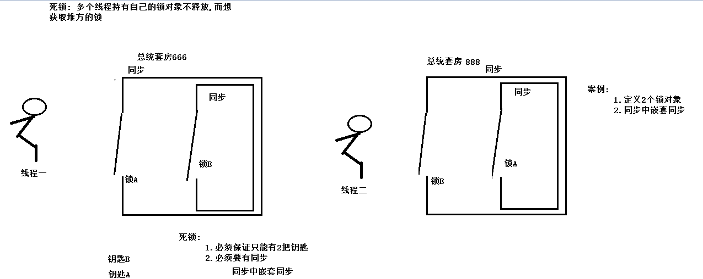
### 死锁案例锁对象的定义
```java
/*
    定义锁对象
    保证只能有2个
 */
public class MyLock {
    public static final MyLock LOCKA = new MyLock();
    public static final MyLock LOCKB = new MyLock();
    private MyLock(){}//外部无法创建对象
}
```
### 死锁实现案例代码实现
```java
/*
    定义线程任务类
 */
public class DeadLockTask implements Runnable{
    //定义布尔变量,目的: 不同的线程执行不同的同步代码块
    private boolean flag;
    //构造方法
    public DeadLockTask(boolean flag) {
        this.flag = flag;
    }
    @Override
    public void run() {
        while(true) {
            if(flag) {
                synchronized (MyLock.LOCKA) {                    System.out.println(Thread.currentThread().getName()+"if....lockA.....");
                    synchronized (MyLock.LOCKB) {                        System.out.println(Thread.currentThread().getName()+"if....lockB.....");
                    }
                }
            } else {
                /*try {
                    Thread.sleep(1000);
                } catch (InterruptedException e) {
                    e.printStackTrace();
                }*/
                synchronized (MyLock.LOCKB) {                    System.out.println(Thread.currentThread().getName()+"else....lockB.....");
                    synchronized (MyLock.LOCKA) {                        System.out.println(Thread.currentThread().getName()+"else....lockA.....");
                    }
                }
            }
        }
    }
}
//测试类
/*
    死锁案例演示
    死锁是指两个或两个以上的线程在执行过程中，由于竞争同步锁而产生的一种阻塞的现象，
        若无外力作用，它们都将无法推进下去。
 */
public class Demo04DeadLock {
    public static void main(String[] args) {
        //创建线程任务对象
        DeadLockTask taskA = new DeadLockTask(false);
        DeadLockTask taskB = new DeadLockTask(true);
        //创建线程对象,传递线程任务对象
        Thread threadA = new Thread(taskA);
        Thread threadB = new Thread(taskB);
        //开启线程
        threadA.start();
        threadB.start();
    }
}
```
## 线程的生命周期
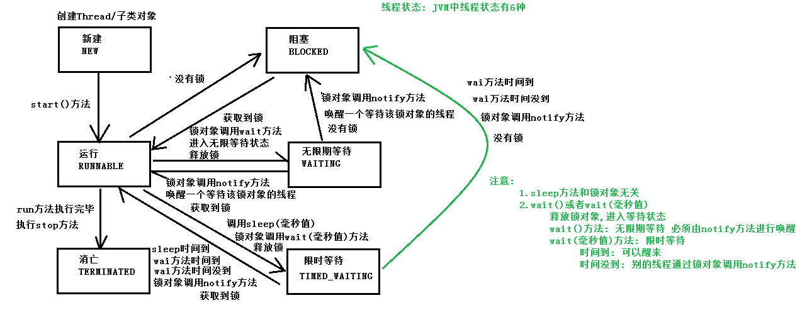
## 解决线程安全问题的方式
```
二种：
第一种：synchronized并发(同步)：
1、同步方法：不需要自己定义锁（类的对象或者this）
2、同步代码：需要自己定义锁（类的对象或者this6
第二种：lock接口
//使用Lock锁对象替换同步代码块
//保证锁对象的唯一性
private Lock lock = new ReentrantLock();//多态
）
```

## wait方法和sleep方法的区别?

```
    (1)sleep方法和同步无关,和锁对象无关,不会释放锁对象
	(2)sleep方法是Thread的静态方法,与线程无关,使用类名Thread调用
	(3)wait方法必须由对象调用,锁对象必须用在同步当中,所以wait方法必须使用在同步当中
	(4)wait方法会释放锁对象,进入无限/限时等待状态
		wait(): 无限等待
		wait(毫秒值): 限时等待
	(5)wait方法必须由对象调用,锁对象可以是任意对象,以为着任意对象都可以调用wait方法,
		所以意味着任意对象都应该具备wait方法,所以wait方法被定义在了Object类中
```

