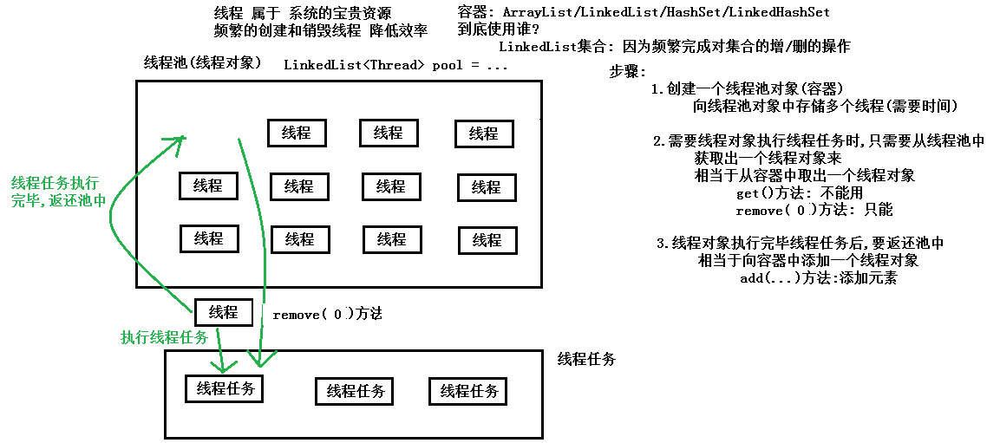
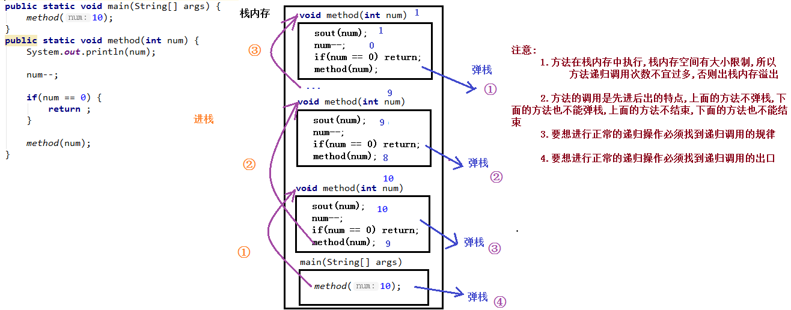
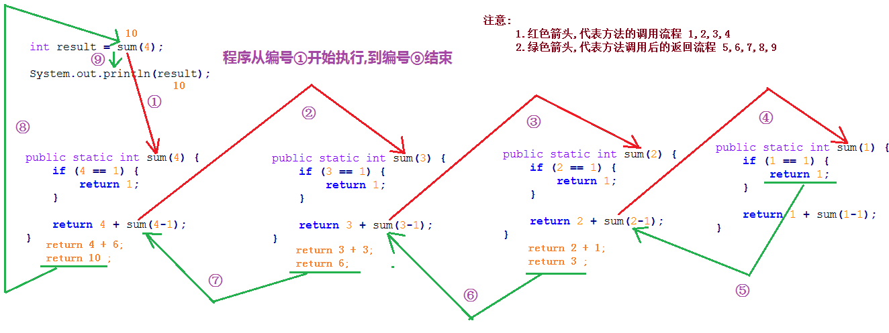
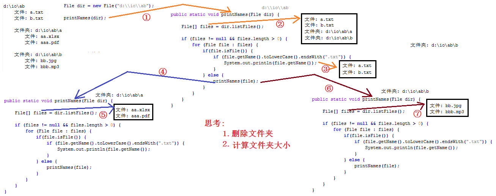

# <center>多线程</center>
[toc]
## 卖包子案例
### 案例概述
```
以前: 多个线程操作共享数据,线程任务是相同的
现在: 多个线程操作共享数据,线程任务不相同
	举例:
		包子铺线程: 任务 生产包子
		消费者线程: 任务 吃包子
		一个线程负责生产数据
		另一个线程负责消费数据
	生产者/消费者
要求:
	生产者(包子铺包一个包子),消费者(消费者吃一个包子)
    生产一个,消费一个,再生产一个,再消费一个
```

### 线程通信等待唤醒概念
```
生产者实现步骤:
	1.判断是否有包子	布尔标记
	2.有: 等待
	3.没有:
		(1)生产一个包子:num++
		(2)修改标记: true
        (3)唤醒消费者
消费者实现步骤:
	1.判断是否有包子	布尔标记
	2.没有: 等待
	3.有:
		(1)消费一个包子
		(2)修改标记: false
        (3)唤醒生产者
```


线程等待和唤醒的方法定义在`java.lang.Object`类中。

|方法声明|方法含义|
|:---:|:---:|
| public final void wait()      | 当前线程等待，释放掉当前线程对象所拥有的锁对象。             |
| public final void notify()    | 唤醒在此对象监视器上等待的单个线程。(唤醒等待该锁对象的一个线程) |
| public final void notifyAll() | 唤醒在此对象监视器上等待的所有线程。(唤醒等待该锁对象的所有个线程) |
### 案例实现(使用包子对象作为锁对象解决等待唤醒报异常的问题)
```java
/*
    定义生产消费案例共享资源包子类
 */
public class BaoZi01 {
    //用来给包子进行编号的,代表每次生产和消费的是不同的包子
    private int num;

    //用来表示当前包子是刚刚生产的,还是刚刚被消费的
    //true: 表示刚生产出来,可以被消费
    //false: 表示刚消费完毕,可以进行生产
    private boolean flag;

    //生产包子方法: 被生产线程任务调用
    public void shenChan() {
        try {
            Thread.sleep(50);
        } catch (InterruptedException e) {
            e.printStackTrace();
        }
        //编号增加1
        num++;
        String threadName = Thread.currentThread().getName();
        System.out.println(threadName + "生产第..." + num + "...个包子");
    }

    //消费包子方法: 被消费线程任务调用
    public void xiaoFei() {
        try {
            Thread.sleep(50);
        } catch (InterruptedException e) {
            e.printStackTrace();
        }
        String threadName = Thread.currentThread().getName();
        System.out.println(threadName + "消费第~~~~~" + num + "~~~~~个包子");
    }

    public boolean isFlag() {
        return flag;
    }

    public void setFlag(boolean flag) {
        this.flag = flag;
    }
}
```
```java
/*
    定义生产者线程任务类
 */
public class Producer03 implements Runnable{
    //定义共享资源包子BaoZi类的对象
    private BaoZi03 bz;
    //构造方法
    public Producer03(BaoZi03 bz) {
        this.bz = bz;
    }
    @Override
    public void run() {
        while (true) {
            //添加同步代码块
            synchronized (bz) {
                if(bz.getFlag() == true) {
                    //有包子,生产者线程等待
                    try{bz.wait();}catch (Exception e){}//bz是锁对象           
                }
                //没有包子
                //生产一个包子
                bz.shengChan();
                //修改标记
                bz.setFlag(true);
                //唤醒消费者
                bz.notify();//bz是锁对象
            }
        }
    }
}
```
```java
/*
    定义消费者线程任务类
 */
public class Consumer03 implements Runnable{
    //定义共享资源包子BaoZi类的对象
    private BaoZi03 bz;
    //构造方法
    public Consumer03(BaoZi03 bz) {
        this.bz = bz;
    }
    @Override
    public void run() {
        while (true) {
            //添加同步代码块
            synchronized (bz) {
                if(bz.getFlag() == false) {
                    try{bz.wait();}catch (Exception e){}//bz是锁对象
                }
                //有包子
                //消费一个包子
                bz.xiaoFei();
                //修改标记
                bz.setFlag(false);
                bz.notify();//bz是锁对象
                
            }
        }
    }
}
```
```java
/*
	运行以下测试代码:
        - 程序出现无效的监视器状态异常。
        - wait()或者notify()方法会抛出此异常。
        - 程序中，wait()或者notify()方法的调用者是this对象。
        - 而this对象在同步中并不是锁对象，只有作为锁的对象才能调用wait()或者notify()方法。
        - 而锁对象是生产者和消费者共享的包子铺对象。
    解决方案:
    	使用锁对象bz调用wait和notify方法
*/
public class Demo03PC {
    public static void main(String[] args) {
        //创建线程共享资源包子类的对象
        BaoZi03 bz = new BaoZi03();
        //5.创建生产者线程任务对象
        Producer03 pTask = new Producer03(bz);
        //5.创建消费者线程任务对象
        Consumer03 cTask = new Consumer03(bz);
        //6.创建生产者线程对象,构造方法传递生产者线程任务对象
        Thread pThread = new Thread(pTask, "生产者线程");
        //7.创建消费者线程对象,构造方法传递消费者线程任务对象
        Thread cThread = new Thread(cTask, "消费者线程");
        //8.生产者线程对象调用start方法,开启线程进行生产
        pThread.start();
        //9.消费者线程对象调用start方法,开启线程进行消费
        cThread.start();
    }
}
```
### 生产者和消费者案例代码优化
```java
/*
    定义多线程共享资源类包子类
 */
public class BaoZi04 {
    private int num;//给包子进行编号
    //添加布尔标记,true: 有包子,允许消费者消费包子,false: 没有包子,允许生产者生产包子
    private boolean flag;
    //被消费者线程调用,表示消费(打印输出)一个包子
    public synchronized void xiaoFei() {
        if (flag == false) {
            //没有包子,等待
            try {wait();}catch (Exception e){e.printStackTrace();}
        }
        String threadName = Thread.currentThread().getName();
        System.out.println(threadName+"消费第~~~~~~"+num+"~~~~~~个包子");
        //修改标记
        flag = false;
        //唤醒生产者线程
        notify();
    }

    //被生产者线程调用,表示生产一个包子
    public synchronized void shengChan() {
        if(flag == true) {
            //有包子,等待
            try {wait();}catch (Exception e){e.printStackTrace();}
        }
        //没有包子,生产一个包子
        num++;
        String threadName = Thread.currentThread().getName();
        System.out.println(threadName+"生产第..."+num+"...个包子");
        //修改标记
        flag = true;
        //唤醒消费者线程
        notify();
    }
    public boolean getFlag() {
        return flag;
    }
    public void setFlag(boolean flag) {
        this.flag = flag;
    }
}
```
```java
/*
    定义生产者线程任务类
 */
public class Producer04 implements Runnable{
    //定义共享资源包子BaoZi类的对象
    private BaoZi04 bz;
    //构造方法
    public Producer04(BaoZi04 bz) {
        this.bz = bz;
    }
    @Override
    public void run() {
        while (true)
            bz.shengChan();//生产一个包子
    }
}
```
```java
/*
    定义消费者线程任务类
 */
public class Consumer04 implements Runnable{
    //定义共享资源包子BaoZi类的对象
    private BaoZi04 bz;

    //构造方法
    public Consumer04(BaoZi04 bz) {
        this.bz = bz;
    }

    @Override
    public void run() {
        while (true)
            bz.xiaoFei();//消费一个包子

    }
}
```
```java
//测试类
/*
    单生产者(生产一个包子)和单消费者(消费一个包子)

    代码优化:
        把生产和消费包子的功能定义在BaoZi04类中,全部定义为同步方法
 */
public class Demo04PC {
    public static void main(String[] args) {
        //创建多线程共享数据资源baoZi类的对象
        BaoZi04 bz = new BaoZi04();
        //4.创建生产者线程任务对象
        Producer04 pTask = new Producer04(bz);
        //6.创建消费者线程任务对象
        Consumer04 cTask = new Consumer04(bz);
        //6.创建生产者线程对象,传递生产者线程任务对象
        Thread pThread = new Thread(pTask, "生产者线程");
        //7.创建消费者线程对象,传递消费者线程任务对象
        Thread cThread = new Thread(cTask, "消费者线程");
        //8.生产者线程对象和消费者线程对象分别调用start方法开启线程
        pThread.start();
        cThread.start();
    }
}
```
## 线程池Thread Pool
### 线程的原理
    线程属于系统的宝贵资源,频繁的创建和销毁线程,会降低效率 所以需要使用线程池

### JDK中内置的线程池
```
JDK中内置的线程池

    java.util.concurrent.Executor接口: 与线程池相关的接口,所有线程池必须实现这个接口
        抽象方法:
             public abstract void execute(Runnable command): 
				执行方法参数指定的Runnable接口类型的任务

    Executor接口规定的功能比较少,使用常用子接口:
        java.util.concurrent.ExecutorService接口: 规定了线程池的很多功能

    要使用ExecutorService接口中规定的方法,必然要获取到ExecutorService接口的实现类对象
    实现类:
        java.util.concurrent.ThreadPoolExecutor类:
        可以创建对象,发现构造方法参数太多,不方便

        解决方案:
            使用工具类java.util.concurrent.Executors调用静态方法创建线程池对象
            静态方法:
                public static ExecutorService newFixedThreadPool(int nThreads)
                    创建一个可重用固定线程数的线程池
                    返回值:
                        ExecutorService接口: 方法内部必然返回实现类对象
```
### JDK中内置的线程池介绍及submit方法演示
```
执行线程任务:
   ExecutorService接口中规定的方法
       public abstract Future<?> submit(Runnable task):
           执行方法参数指定的Runnable类型的线程任务
           返回值:
               java.util.concurrent.Future<V>接口: 方法内部必然返回该接口的实现类对象
               作用:
                   封装结果数据的,因为Runnable接口中的run方法没有返回值,
					Future实现类对象内部封装null
                   获取结果数据:
                       Future<V>接口定义方法:
                       public abstract V get(): 获取Future对象中封装的结果数据的

发现:
    执行submit方法后,程序并没有停止
    原因: 线程池中的线程对象,需要重复利用
    关闭线程池:
        public void shutDown():关闭线程池

```
```java
//创建Runnable接口实现类
public class MyRunnable03 implements Runnable {
    @Override
    public void run() {
        Random r = new Random();
        System.out.println(Math.abs(r.nextInt()));//返回一个整数(int范围)
    }
}
//测试类
public class Demo03ThreadPool {
    public static void main(String[] args) throws ExecutionException, InterruptedException {
        //1.创建线程池对象(有3个线程对象): 工具类Executors调用静态方法
        ExecutorService pool = Executors.newFixedThreadPool(3);

        //2.创建线程任务对象: Runnable接口的实现类对象
        MyRunnable03 task01 = new MyRunnable03();
        MyRunnable03 task02 = new MyRunnable03();
        MyRunnable03 task03 = new MyRunnable03();
        MyRunnable03 task04 = new MyRunnable03();
        MyRunnable03 task05 = new MyRunnable03();


        //3.使用线程池对象调用submit方法,传递Runnable类型的线程任务,获取结果Future对象
        /*
            Future接口对象内部封装线程任务方法返回的结果数据,
            但是Runnable的run方法没有返回值,Future接口对象内部封装的是null
            线程池对象pool调用submit方法时: submit方法内部会从线程池中取出一个线程,执行任务,执行完毕后,该线程会返还池中
            注意: 如何从线程池中取出线程,取出的是哪个线程,如何把线程返回池中,我们使用者不关心
         */
        Future<?> future = pool.submit(task01);
        System.out.println(future.get());//null

        future = pool.submit(task02);
        System.out.println(future.get());//null

        future = pool.submit(task03);
        System.out.println(future.get());//null

        future = pool.submit(task04);
        System.out.println(future.get());//null

        future = pool.submit(task05);
        System.out.println(future.get());//null

        //System.out.println(pool);

        //启动一次顺序关闭，执行以前提交的任务，但不接受新任务。
        pool.shutdown();
        //4.销毁线程池
        //试图停止所有正在执行的活动任务，暂停处理正在等待的任务，并返回等待执行的任务列表。
        pool.shutdownNow();
    }
}
```
### 获取线程执行的结果
```
执行线程任务:
ExecutorService接口中规定的方法
    public abstract <T> Future<T> submit(Callable<T> task) :
        执行方法参数指定的Callable类型的线程任务
        参数:
            java.util.concurrent.Callable<V>接口: 调用方法必然传递实现类对象
            抽象方法:
                public abstract V call() throws Exception: 指定线程任务的
                    特点:
                        1.有返回值
                        2.方法上有声明抛出异常,重写后的方法,如果有异常,
                        	可以throws,可以try-catch
                        3.Runnable接口中run方法: 没有返回值,没有声明抛出异常
                            重写后的方法,如果有异常,只能内部try-catch
        返回值:
            java.util.concurrent.Future<V>接口: 方法内部必然返回该接口的实现类对象
            作用:
                封装结果数据的,因为Callable接口中的call方法有返回值,
				Future实现类对象内部封装call方法的返回值
                获取结果数据:
                    Future<V>接口定义方法:
                    public abstract V get(): 获取Future对象中封装的结果数据的
```
```java
//创建Runnable接口的实现类
public class MyCallable04 implements Callable<Integer> {

    @Override
    public Integer call() throws Exception {
        Random r = new Random();
        return Math.abs(r.nextInt());//返回一个正的int范围内的数字
    }
}
```
```java
//测试类
public class Demo04ThreadPool {
    public static void main(String[] args) throws ExecutionException, InterruptedException {
       //1.创建线程池对象: 工具类Executors调用静态方法
        ExecutorService pool = Executors.newFixedThreadPool(3);

        //2.创建线程任务对象: Callable接口的实现类对象
        MyCallable04 task1 = new MyCallable04();
        MyCallable04 task2 = new MyCallable04();
        MyCallable04 task3 = new MyCallable04();
        MyCallable04 task4 = new MyCallable04();
        MyCallable04 task5 = new MyCallable04();

        //3.从线程池对象pool中获取一个线程对象(至于获取到的哪个线程对象,不用管)
        //执行submit方法指定的Callable接口类型的线程任务
        //任务执行完毕,线程对象会返还池中,怎么返还的,不用关心
        Future<Integer> result = pool.submit(task1);
        System.out.println(result.get());
        result = pool.submit(task2);
        System.out.println(result.get());
        result = pool.submit(task3);
        System.out.println(result.get());
        result = pool.submit(task4);
        System.out.println(result.get());
        result = pool.submit(task5);
        System.out.println(result.get());

    }
}
```
### 线程池的练习计算1-100的和
```java
/*
    线程池的练习计算1-100的和
    实现步骤:
        1.创建代表线程任务的Callable接口的实现类
        2.Callable接口的实现类覆盖重写抽象方法call,计算1到100的数字之和
        3.创建线程池对象,指定线程数量
        4.创建多个线程任务对象
        5.线程池对象调用submit方法执行线程任务对象获取结果Future对象
        6.打印结果Future对象中封装的具体结果
 */
public class Demo07ThreadPoolSum {
    public static void main(String[] args) throws ExecutionException, InterruptedException {
        //3.创建线程池对象,指定线程数量
        ExecutorService pool = Executors.newFixedThreadPool(3);
        //4.创建多个线程任务对象
        MySumTask task100 = new MySumTask(1, 100);//计算1-100数字之和的线程任务
        MySumTask task200 = new MySumTask(1, 200);//计算1-200数字之和的线程任务
        MySumTask task300 = new MySumTask(1, 300);//计算1-300数字之和的线程任务
        //5.线程池对象调用submit方法执行线程任务对象获取结果Future对象
        Future<Integer> f = pool.submit(task100);
        //6.打印结果Future对象中封装的具体结果
        System.out.println(f.get());

        f = pool.submit(task200);
        //6.打印结果Future对象中封装的具体结果
        System.out.println(f.get());

        f = pool.submit(task300);
        //6.打印结果Future对象中封装的具体结果
        System.out.println(f.get());
    }
}
/*
    计算1-100的数字之和的线程任务
 */
public class MySumTask implements Callable<Integer> {
    private int start;
    private int end;
    //满参构造方法:指定求和范围
    public MySumTask(int start, int end) {
        this.start = start;
        this.end = end;
    }

    @Override
    public Integer call() throws Exception {
        int sum = 0;
        //计算指定范围内的所有数字之后
        //要求start必须<=end,但是这里代码上就不做判断
        for (int i = start; i <= end; i++) {
            sum += i;
        }
        return sum;
    }
}
```
## 线程使用的四种方法
1. Thread类：唯一与线程有关的类
2. Runnable接口：重写run方法
3. 程池：ExecutorService接口
4. Callable<V>接口：重写call方法
### 线程Runnable接口和Callable<?>接口的区别：
```
1、泛型:
Callable<?>接口存在泛型而Runnable接口不存在
2、方法返回值
Runnable接口重写的run方法没有返回值，Callable<?>接口冲写的call方法存在返回值，返回值为泛型的返回值
3、抛出异常
Callable<?>接口实现异常 Exception，所以call方法可以throws,可以try-catch而且Runnable接口没有实现异常接口所以该run方法只能try-catch
```

## File类
### File类的静态成员
```
java.io.File类: 用来描述计算机中文件/文件夹/路径的
	文件和目录路径名的抽象表示形式。
	文件: 用file表示,用来存储数据的
	文件夹/目录: 用directory表示,用来存储文件的,管理文件的
	路径/地址: 用path表示,用来唯一确定文件/文件夹的具体存储位置
	windows系统中,文件/文件夹的路径中有\,但是在java中要表示\需要写\\
```
### File类的构造方法
```java
/*
    java.io.File类: 用来描述计算机中文件/文件夹/路径的
        文件和目录路径名的抽象表示形式。
        文件: 用file表示,用来存储数据的
        文件夹/目录: 用directory表示,用来存储文件的,管理文件的
        路径/地址: 用path表示,用来唯一确定文件/文件夹的具体存储位置
        windows系统中,文件/文件夹的路径中有\,但是在java中要表示\需要写\\

    File类中的静态成员:
        public static String pathSeparator: 多个路径之间的分隔符号
            与系统有关的路径分隔符，为了方便，它被表示为一个字符串。

        public static String separator: 一个路径中多个名称之间的分隔符号
            与系统有关的默认名称分隔符，为了方便，它被表示为一个字符串。
 */
public class Demo04File {
    public static void main(String[] args) {
        String path = "E:\\a\\b\\c\\123.txt";
        String path2 = "E:/a/b/c/123.txt";

        //windows系统中多个路径之间的分隔符
        String pathSeparator = File.pathSeparator;
        System.out.println(pathSeparator);
        //windows系统中一个路径的多个组成名称之间的分隔符
        String separator = File.separator;
        System.out.println(separator);

        //目的: 定义路径时,实现跨平台
        String path3 = "E:" + separator + "a" + separator + "b" + separator + "c" + separator + "123.txt";
        System.out.println(path3);
    }
}

```
### File类的获取方法
```
    File类的构造方法
        File(String pathname)
            参数:String类型的路径
                可以表示文件或者文件夹
                所表示的文件或文件夹可以存在,也可以不存在

        File(String parent, String child)
            参数:
                parent:String类型的父路径
                child:String类型的子路径
                可以表示文件或者文件夹,子路径可以是文件或者文件夹
                所表示的文件或文件夹可以存在也可以不存在

        File(File parent, String child)
            参数:
                parent:File类型的父路径
                child:String类型的子路径
```
```java
public class Demo05FileConstructor {
    public static void main(String[] args) {
        //创建File对象,代表存在的文件
        File f1 = new File("E:\\myprojects\\javaee398\\day10\\io\\ab\\a.txt");
        System.out.println(f1);

        //创建File对象,代表不存在的文件
        File f2 = new File("E:\\myprojects\\javaee398\\day10\\io\\ab\\aaa.txt");
        System.out.println(f2);


        //创建File对象,代表存在的文件夹
        File dir1 = new File("E:\\myprojects\\javaee398\\day10\\io\\ab");
        System.out.println(dir1);

        //创建File对象,代表不存在的文件夹
        File dir2 = new File("E:\\myprojects\\javaee398\\day10\\io\\abab");
        System.out.println(dir2);

        //创建File对象,代表存在的文件,构造方法传递String的父路径和String的子路径
        File f3 = new File("E:\\myprojects\\javaee398", "day10\\io\\ab\\a.txt");
        System.out.println(f3);

        //创建父路径对应的File对象
        File parent = new File("E:\\myprojects\\javaee398\\day10");

        //创建File对象,代表存在的文件,构造方法传递File类型的父路径和String的子路径
        File dir3 = new File(parent, "io\\abab");
        System.out.println(dir3);
    }
}

```
### 绝对路径和相对路径
```
    File类的获取方法
        public String getAbsolutePath() ：返回此File的绝对路径(从盘符开始的路径)名字符串。
        public String getPath() ：将此File转换为路径名字符串(构造方法路径)。
        public String getName() ：返回由此File表示的文件或目录的名称。
            路径名中最后一个分隔符后面的内容
        public long length() ：返回由此File表示的文件的长度。
            文件中的字节数
                文件为空: 返回0
                文件不存在: 返回0
            只能计算文件的字节数,不能计算文件夹的字节数的

        public File getParentFile():
            返回由此File表示的文件或目录的父目录，如果没有父目录
```
```java
public class Demo06FileGet {
    public static void main(String[] args) {
        //创建File对象,代表存在的文件
        //使用绝对路径的方式
        File f1 = new File("E:\\myprojects\\javaee398\\day10\\io\\ab\\a.txt");
        System.out.println("绝对路径: " + f1.getAbsolutePath());
        System.out.println("构造方法路径: " + f1.getPath());
        System.out.println("文件名称: " + f1.getName());
        System.out.println("父路径名称: " + f1.getParentFile());
        System.out.println("文件大小: " + f1.length());
        System.out.println("--------------");

        //创建File对象,代表存在的文件夹
        //使用相对路径的方式(从模块名开始写)
        File dir = new File("day10\\io\\ab");
        System.out.println("绝对路径: " + dir.getAbsolutePath());
        System.out.println("构造方法路径: " + dir.getPath());
        System.out.println("文件夹名称: " + dir.getName());
        System.out.println("父路径名称: " + dir.getParentFile());
        System.out.println("文件大小: " + dir.length());//注意: 不能获取文件夹的大小
    }
}

```
### File类的判断方法
```
  File类的判断方法
        public boolean exists() ：
            此File表示的文件或目录是否实际存在。
                存在: true
                不存在: false
        public boolean isDirectory() ：此File表示的是否为目录。
            不存在: false
            是目录: true
            不是目录: false

        public boolean isFile() ：此File表示的是否为文件。
            不存在: false
            是文件: true
            不是文件: false
```
```java
public class Demo08FilePanDuan {
    public static void main(String[] args) {
        //创建File对象,表示存在的文件
        File f1 = new File("day10\\io\\ab\\a.txt");
        System.out.println("File对象代表的文件/文件夹是否存在? " + f1.exists());
        System.out.println("File对象代笔的是文件吗? " + f1.isFile());
        System.out.println("File对象代笔的是文件夹吗? " + f1.isDirectory());
        System.out.println("-----------");

        //创建File对象,表示不存在的文件夹
        File dir = new File("day10\\io\\abab");
        System.out.println("File对象代表的文件/文件夹是否存在? " + dir.exists());
        System.out.println("File对象代笔的是文件吗? " + dir.isFile());
        System.out.println("File对象代笔的是文件夹吗? " + dir.isDirectory());
    }
}
```
### File类的创建和删除方法
```
 创建删除功能的方法
        public boolean createNewFile() ：当且仅当具有该名称的文件尚不存在时，创建一个新的空文件。
            文件已经存在: 不创建     返回 false
            文件不存在:
                创建成功: true
                创建失败: false

        public boolean mkdir() ：创建由此File表示的目录。make
            文件夹已经存在: 不创建     返回 false
            文件夹不存在:
                创建成功: true
                创建失败: false
            只能创建一级文件夹

        public boolean mkdirs() ：创建由此File表示的目录，包括任何必需但不存在的父目录。
            文件夹已经存在: 不创建     返回 false
            文件夹不存在:
                创建成功: true
                创建失败: false
            可以创建多级文件夹(包含一级)


        public boolean delete() ：删除由此File表示的文件或目录,java中删除动作不走回收站。
            可以删除文件:
                存在:
                    成功: true
                    失败: false
                不存在: false

            可以删除文件夹:
                不存在: false
                文件夹为空:
                    成功: true
                    失败: false
                文件夹不为空: false

        注意:
            以下在演示后面代码的过程中,避免前面代码的影响
```
```java
public class Demo09FileCreateDelete {
    public static void main(String[] args) throws IOException {
        //创建File对象,代表不存在的文件
        File f1 = new File("day10\\io\\ab\\ab.txt");
        System.out.println("f1代表的文件是否存在? " + f1.exists());
        System.out.println("f1代表的文件是否被创建成功? " + f1.createNewFile());
        System.out.println("f1代表的文件是否存在? " + f1.exists());

        System.out.println("--------------");

        //创建File对象,代表不存在的文件夹
        File f2 = new File("day10\\io\\abc");
        System.out.println("f2代表的文件夹是否存在? " + f2.exists());
        System.out.println("f2代表的文件夹是否被创建成功? " + f2.mkdir());
        System.out.println("f2代表的文件夹是否存在? " + f2.exists());

        System.out.println("--------------");
        //注意: mkdir只能创建一级目录
        File f3 = new File("day10\\io\\abc\\c\\d\\e\\f");
        System.out.println("f2代表的文件夹是否存在? " + f3.exists());
        System.out.println("f2代表的文件夹是否被创建成功? " + f3.mkdir());
        System.out.println("f2代表的文件夹是否存在? " + f3.exists());

        System.out.println("--------------");
        File f4 = new File("day10\\io\\abc\\cc\\dd\\ee\\ff");
        System.out.println("f2代表的文件夹是否存在? " + f4.exists());
        System.out.println("f2代表的文件夹是否被创建成功? " + f4.mkdirs());//mkdirs: 可以创建多级目录(包含一级)
        System.out.println("f2代表的文件夹是否存在? " + f4.exists());

        System.out.println("--------------");

        //创建File对象,代表存在的文件
        //先手动创建day10\io\ab\abc.txt
        File f5 = new File("day10\\io\\ab\\abc.txt");
        System.out.println("f5代表的文件是否存在? " + f5.exists());
        System.out.println("f5代表的文件是否被删除成功? " + f5.delete());
        System.out.println("f5代表的文件是否存在? " + f5.exists());

        System.out.println("--------------");
        //先手动创建day10\io\ab\c\d文件夹
        //先手动创建day10\io\ab\c\c.txt文件
        //先手动创建day10\io\ab\c\d\d.txt文件
        File f6 = new File("day10\\io\\ab\\c\\d");
        System.out.println("f6代表的文件是否存在? " + f6.exists());
        System.out.println("f6代表的文件/文件是否被删除成功? " + f6.delete());//注意: 必须是空文件夹才能被删除
        System.out.println("f6代表的文件是否存在? " + f6.exists());
    }
}
```
### File类的遍历方法
```
   目录的遍历
        public String[] list() ：获取当前目录下的所有的目录和文件的字符串的名字

        public File[] listFiles() ：获取当前目录下的所有的目录和文件的File对象

    注意:
        File对象是不存在的话或者是一个文件,listFiles返回null
        File对象是存在的空文件夹,listFiles返回[]  就是长度为0的数组
```
```java
public class Demo10FileEach {
    public static void main(String[] args) {
        //创建File对象,代表存在的目录
        //注意: 给定的路径代表的文件夹不存在,获取File对象数组是null
        //File dir = new File("day10\\io\\abab");
        //注意: 给定的路径代表的是空文件夹,获取File对象数组是{}  长度为0的数组
        //File dir = new File("day10\\io\\abcd");

        File dir = new File("day10\\io\\ab");

        //获取当前目录下的直系子目录和子文件组成的File对象数组
        File[] files = dir.listFiles();
        System.out.println(Arrays.toString(files));

        //健壮性的判断
        if (null != files && files.length > 0) {
            //增强for遍历
            for (File file : files) {
                String fileName = file.getName();
                if (file.isFile()) {
                    System.out.println("文件: " + fileName + "的大小: " + file.length());
                } else {
                    System.out.println("文件夹: " + fileName);
                }
            }
        }

    }
}
```
## 递归
### 递归介绍及注意事项
```
方法递归
	1.概念: 方法自己调用自己
	2.死递归: 永不休止的自己调用自己
    	public static void method(int num) {
        	System.out.println(num);
        	num--;
        	method(num);
    	}
	3.正常递归: 递归次数不宜过多,可以正常结束
    	public static void method(int num) {
        	System.out.println(num);
        	num--;
        	if(num == 0) {
            	return ;
        	}
        	method(num);
    	}

	4.注意:
    	(1)方法在栈内存中执行,栈内存空间有大小限制,所以
        	方法递归调用次数不宜过多,否则出栈内存溢出 

    	(2)方法的调用是先进后出的特点,上面的方法不弹栈,
        	下面的方法也不能弹栈,上面的方法不结束,下面的方法也不能结束
                
    	(3)要想进行正常的递归操作必须找到递归调用的规律

    	(4)要想进行正常的递归操作必须找递归调用的出口
```
```java
public class Demo07DiGui {
    public static void main(String[] args) {
        method(10);
    }

    private static void method(int num) {
        System.out.println(num);
        num--;
        if (num == 0) {
            return;//结束方法
        }
        method(num);//num>0才继续调用
    }
}
```

### 递归求和
```
  递归求1到n的和
        假设求1到100的和,并假设定义方法sum(100)
            sum(100) = 1 + 2 + 3 + 4 + ...+ 100
            sum(100) = 100 + 99 + 98 + 97 + ... + 1

        为了找出规律,假设求1到5的和
            sum(5) = 5 + 4 + 3 + 2 + 1
                = 5 + sum(4)
                 sum(4) = 4 + 3 + 2 + 1
                    = 4 + sum(3)
                    sum(3) = 3 + 2 + 1
                        = 3 + sum(2)
                        sum(2) = 2 + sum(1)
                        sum(1) = 1          出口
    注意:
        1.找规律
            sum(5) = 5 + sum(4) = 5 + sum(5-1)
            sum(n) = n + sum(n-1)

        2.找出口
            sum(1) = 1
            if(n == 1){ return 1; }
```
```java
public class Demo05DiGuiSum {
    public static void main(String[] args) {
        int result = sum(4);
        System.out.println(result);
    }

    //定义方法,求1到n的数字之和
    public static int sum(int n) {
        //出口
        if (n == 1) {
            return 1;
        }
        //规律
        return n + sum(n-1);
    }
}
```
### 递归求和图解分析

### 递归获取文件夹下所有文件
```
    遍历 day11_xw\io 目录下的所有文本文件(包含子文件夹)
    实现步骤:
        1.创建File对象,代表存在的文件目录
        2.定义方法printNames方法,作用递归打印文本文件的名字
        3.调用printNames方法,传递步骤1中的File对象
```
```java
//2.定义方法printNames方法,作用递归打印文本文件的名字
public class Demo03EachTxtFiles {
    public static void main(String[] args) {
        //1.创建File对象,代表存在的文件目录
        File dir = new File("day11_xw\\io");
        //3.调用printNames方法,传递步骤1中的File对象
        printNames(dir);
    }

    //2.定义方法printNames方法,作用递归打印文本文件的名字
    public static void printNames(File dir) {
        //(1)获取当前文件夹下的所有文件/子文件夹组成的File对象数组
        File[] files = dir.listFiles();
        //健壮性判断
        if (files != null && files.length > 0) {
            //(2)增强for遍历
            for (File file : files) {
                //(3)如果是文件
                if(file.isFile()) {
                    //是txt文件
                    if (file.xiaoFeiName().toLowerCase().endsWith(".txt")) {
                        System.out.println(file.xiaoFeiName());
                    }
                } else {
                    //(4)是文件夹,递归调用
                    printNames(file);
                }
            }
        }
    }
}
```
### 递归获取文件夹下所有文件图解分析

## 递归方法的案例
### 斐波那契数列
```
数列：1 1 2 3 5 8 13...
n为3的时候是是n-1和n-2的和
```
```java
public class Dome12Test {
    public static void main(String[] args) {
        System.out.println(num(4));
    }

    private static int  num(int a) {
        int num  = 0;
        if (a < 3){
            return 1;
        }

        return num(a-1)+num(a-2);
    }
}
```
### 计算100的阶乘
    因为计算100的阶乘的时候，该值大于int和long类型的取值范围，所以使用BigInterger类
```java
import java.math.BigInteger;

public class Test {
    public static void main(String[] args) {
        System.out.println(num(new BigInteger("50")));
    }
    private static BigInteger num(BigInteger n){
        //System.out.println(n);
        //if (n.intValue() == 1){
        if (n.equals(BigInteger.valueOf(1))){
            return BigInteger.valueOf(1);
        }
        return n.multiply(num(n.subtract(BigInteger.valueOf(1))));
    }
}
```
### 获取文件夹中所有指定文件类型的文件
    使用到的主要方法：getName()方法：获取路径最后的名字(可以是文件夹和文件名)
```java
import java.io.File;

public class Demo09PrintTxtFileName {
    public static void main(String[] args) {
        //1.创建File对象,代表存在的文件目录
        File dir = new File("day10\\io\\ab");
        //3.调用printNames方法,传递步骤1中的File对象
        printNames(dir);
    }

    //2.定义方法printNames方法,作用递归打印文本文件的名字
    public static void printNames(File dir) {
        //获取当前文件夹中的所有直接子文件夹和直接子文件组成的File对象数组
        File[] files = dir.listFiles();
        //健壮性的判断
        if (null != files && files.length > 0) {
            //增强for遍历
            for (File file : files) {
                if (file.isFile()) {
                    //是文件,获取文件名称
                    String fileName = file.getName();
                    //判断如果是文本文件,则输出文件的名字
                    if (fileName.toLowerCase().endsWith(".txt")) {
                        System.out.println(fileName);
                    }
                } else if(file.isDirectory()){
                    //是文件夹,递归调用当前方法,传递当前目录file
                    printNames(file);
                }
            }
        }
    }
}
```
### 删除文件及文件夹
    使用到的主要方法为：delete()方法：删除文件及文件夹
```java
import java.io.File;

/*
    删除文件夹(注意: 不要操作C盘的内容,因为java中删除操作,不走回收站)
    实现步骤:
        1.创建File对象,代表存在的文件目录
        2.定义方法deleteDirectory方法,作用递归删除文件夹
        3.调用deleteDirectory方法,传递步骤1中的File对象
 */
public class Demo10DeleteDirectory {
    public static void main(String[] args) {
        //1.创建File对象,代表存在的文件目录
        File dir = new File("day10\\hello");

        //3.调用deleteDirectory方法,传递步骤1中的File对象
        deleteDirectory(dir);
    }

    //2.定义方法deleteDirectory方法,作用递归删除文件夹
    public static void deleteDirectory(File dir) {
        //获取当前文件夹中的所有直接子文件夹和直接子文件组成的File对象数组
        File[] files = dir.listFiles();
        //健壮性的判断
        if (null != files && files.length > 0) {
            //增强for遍历
            for (File file : files) {
                //判断如果是文件
                if (file.isFile()) {
                    //删除当前文件
                    file.delete();
                } else {
                    //如果是文件夹,递归调用当前方法,传递当前目录file
                    deleteDirectory(file);
                }
            }
            //删除当前空文件夹
            dir.delete();
        }
    }
}
```
### 获取文件大小
    使用到的主要方法为：length()方法：获取文件大小
```java
public class Dome11UpdateDirectory {
    public static void main(String[] args) {
        //1、创建File对象，代表存在的文件目录
        File dir = new File("day10\\io\\ab");
        //3、调用updateDirectory方法，传递步骤1中的File对象
        updateDirectory(dir);
    }

    private static void updateDirectory(File dir) {
        //获取当前文件夹中的所有直接子文件夹和直接子文件组成的File对象数组
        File[] files = dir.listFiles();
        //健壮性判断
        if (null!=files && files.length>0){
            //增强for
            for (File file : files) {
                //判断如果是文件
                if (file.isFile()){
                    System.out.println(file.getName()+"的长度为："+file.length());
                }else{
                    updateDirectory(file);
                }
            }
        }
    }
}
```
## 线程案例
### 模拟简单银行存取
```
本案例模拟一个简单的银行系统,使用两个不同的线程向同一个账户存钱。
账户的初始余额是1000元，两个线程每次存储100元,分别各存储1000元，不允许出现错误数据。
程序运行结果如下图所示：要求轮流存
要求使用wait和notify方法实现
```
.jpg)
```
### 操作步骤

1、定义银行账户Account类
1.1、 定义int类型成员变量leftMoney，代表账户余额
1.2、 定义构造方法，给账户初始化
1.3、 定义deposit方法，给账户存钱
1.4、 定义getLeftMoney方法，查看账户余额
2、定义线程任务类Transfer,实现Runnable接口
2.1、定义Account类型成员变量account
2.2、定义标记
2.3、定义构造方法，给成员变量account赋值
2.4、覆盖重写run方法（使用同步方法或同步代码块保证数据安全,等待唤醒实现轮流存入），
方法内部使用for循环，执行10次存钱，并打印账户余额的操作
3、定义测试类Test01
3.1、创建账户类Account的对象,初始化余额为1000元
3.2、创建线程任务Transfer类的对象，传递账户类Account的对象
3.3、创建2个Thread类的对象，传递线程任务Transfer类的对象并指定线程名称
3.4、2个Thread类的对象分别调用start方法，开启线程
```
```java
//1、定义银行账户Account类
public class Account {
    //1.1、 定义int类型成员变量leftMoney，代表账户余额
    private int leftMoney;
    //1.2、 定义构造方法，给账户初始化
    public Account(int leftMoney) {
        this.leftMoney = leftMoney;
    }
    //1.3、 定义deposit方法，给账户存钱
    public void deposit(int money) {
        leftMoney += money;
    }
    //1.4、 定义getLeftMoney方法，查看账户余额
    public int getLeftMoney() {// 查询账户余额
        return leftMoney;
    }
}
```
```java
//2、定义线程任务类Transfer,实现Runnable接口
public class Transfer implements Runnable {
    //2.1、定义Account类型成员变量account
    private Account account;
    //2.2、定义标记
    private boolean flag = true;
    //2.3、定义构造方法，给成员变量account赋值
    public Transfer(Account account) {
        this.account = account;
    }
    //2.4、覆盖重写run方法（使用同步方法或同步代码块保证数据安全,等待唤醒实现轮流存入），    
    public void run() {
        //方法内部使用for循环，执行10次存钱，并打印账户余额的操作
        //定义int变量,保存每个线程存钱的次数
        int count = 0;
        while(true) {
            synchronized (this) {
                //超过10次结束循环,唤醒所有线程
                if(count>=10) {
                    this.notifyAll();
                    break;
                }
                //修改标记
                flag = !flag;
                // 向账户中存入100块钱
                account.deposit(100);
                System.out.println(Thread.currentThread().getName()+" 存入100元后,账户的余额是: "+account.getLeftMoney());
                //记录次数
                count++;
                //唤醒线程
                this.notifyAll();
                try {
                    //当前线程等待
                    this.wait();
                } catch (InterruptedException e) {
                    e.printStackTrace();
                }

            }
        }
    }
}
```
```java
//3、定义测试类Test01
public class Test01 {
    public static void main(String[] args) {
        //3.1、创建账户类Account的对象,初始化余额为1000元
        Account account = new Account(1000);
        //3.2、创建线程任务Transfer类的对象，传递账户类Account的对象
        Transfer transfer = new Transfer(account);
        //3.3、创建2个Thread类的对象，传递线程任务Transfer类的对象并指定线程名称
        Thread t1 = new Thread(transfer,"小王");
        Thread t2 = new Thread(transfer,"小李");
        //3.4、2个Thread类的对象分别调用start方法，开启线程
        t1.start();
        t2.start();        
    }
}
```