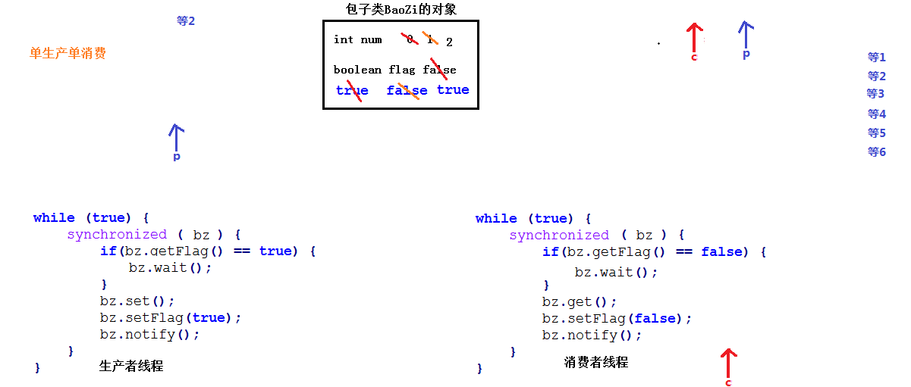
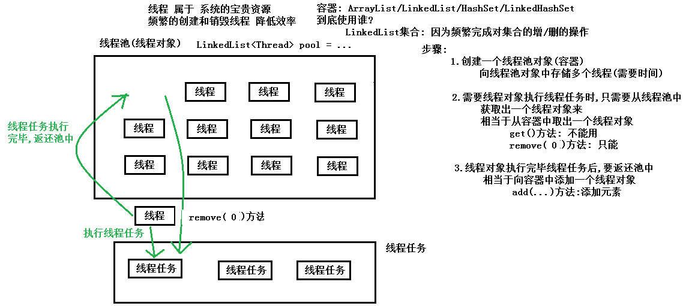
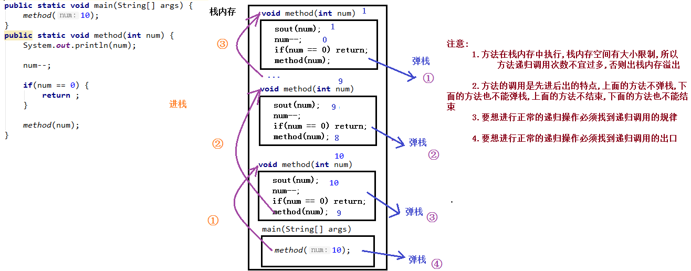

#  day10【多线程和File类】

今日内容介绍

```java
Lock接口
线程通信，等待与唤醒
线程池思想【重要】
JDK提供的线程池
Callable和Future接口
File类
递归【重要】
```

## 第一章 Lock接口

### 1.1 JDK5的特性Lock接口

```java
jdk1.5提供了Lock接口
Lock接口在juc包(并发包: java.util.concurrent)里面
    java.util.concurrent.locks.Lock接口: 比同步方法/同步代码块使用更灵活
        抽象方法:
            public abstract void lock(): 获取锁。
            public void unlock(): 释放锁。  释放资源的动作必须要执行

    常用实现类:
        java.util.concurrent.locks.ReentrantLock类:

        空参构造方法: 直接创建对象
            pubic ReentrantLock():  是一个锁对象,在使用的时候,务必要保证锁对象的唯一性
            
    Lock接口替换了同步代码块和同步方法
        使用格式:
            上锁: lock.lock();
            try {
                操作共享数据的代码;
            } catch(...){
                ...
            } finally {
                //释放锁的代码
                lock.unlock();
            }
```


### 1.2 Lock接口替换同步

```java
//创建Runnable接口实现类
public class MyTicketsTask01 implements Runnable {
    //共享资源
    private int num = 100;
    //锁对象要唯一
    private Lock lock = new ReentrantLock();
    @Override
    public void run() {
            //同步代码块
        while(true) {
            try {
                //获取锁对象
                lock.lock();
                if (num > 0) {
                    Thread.sleep(10);
                    String threadName = Thread.currentThread().getName();
                    System.out.println(threadName+"正在卖出第....."+num+".....张票");
                    num--;
                }
            } catch (Exception e) {
                e.printStackTrace();
            } finally {
                //释放锁对象的操作必须要被执行
                lock.unlock();
            }
        }
    }
}
//测试类
public class Demo01Tickets {
    public static void main(String[] args) {
        //创建线程任务对象
        MyTicketsTask02 task = new MyTicketsTask02();

        //创建线程对象
        Thread t1 = new Thread(task, "窗口");
        Thread t2 = new Thread(task, "手机APP");
        Thread t3 = new Thread(task, "网站");

        //开启线程
        t1.start();
        t2.start();
        t3.start();
    }
}
```


## 第二章 生产者与消费者【重点】

### 2.1 生产者消费者案例分析

```java
以前: 多个线程操作共享数据,线程任务是相同的
现在: 多个线程操作共享数据,线程任务不相同
	举例:
		包子铺线程: 任务 生产包子
		消费者线程: 任务 吃包子
		一个线程负责生产数据
		另一个线程负责消费数据
	生产者/消费者
要求:
	生产者(包子铺包一个包子),消费者(消费者吃一个包子)
    生产一个,消费一个,再生产一个,再消费一个
```


### 2.2 线程通信等待唤醒概念

```java
生产者实现步骤:
	1.判断是否有包子	布尔标记
	2.有: 等待
	3.没有:
		(1)生产一个包子:num++
		(2)修改标记: true
        (3)唤醒消费者
消费者实现步骤:
	1.判断是否有包子	布尔标记
	2.没有: 等待
	3.有:
		(1)消费一个包子
		(2)修改标记: false
        (3)唤醒生产者
```


线程等待和唤醒的方法定义在`java.lang.Object`类中。

| 方法声明                      | 方法含义                                                     |
| ----------------------------- | ------------------------------------------------------------ |
| public final void wait()      | 当前线程等待，释放掉当前线程对象所拥有的锁对象。             |
| public final void notify()    | 唤醒在此对象监视器上等待的单个线程。(唤醒等待该锁对象的一个线程) |
| public final void notifyAll() | 唤醒在此对象监视器上等待的所有线程。(唤醒等待该锁对象的所有个线程) |

### 2.3 案例实现(使用包子对象作为锁对象解决等待唤醒报异常的问题)

```java
/*
    定义多线程共享资源类包子类
 */
public class BaoZi03 {
    private int num;//给包子进行编号
    //添加布尔标记,true: 有包子,允许消费者消费包子,false: 没有包子,允许生产者生产包子
    private boolean flag;
    //被消费者线程调用,表示消费(打印输出)一个包子
    public void xiaoFei() {
        String threadName = Thread.currentThread().getName();
        System.out.println(threadName+"消费第~~~~~"+num+"~~~~~个包子");
    }
    //被生产者线程调用,表示生产一个包子
    public void shengChan() {
        num++;
        String threadName = Thread.currentThread().getName();
        System.out.println(threadName+"生产第..."+num+"...个包子");
    }
    public boolean getFlag() {
        return flag;
    }
    public void setFlag(boolean flag) {
        this.flag = flag;
    }
}

```

```java
/*
    定义生产者线程任务类
 */
public class Producer03 implements Runnable{
    //定义共享资源包子BaoZi类的对象
    private BaoZi03 bz;
    //构造方法
    public Producer03(BaoZi03 bz) {
        this.bz = bz;
    }
    @Override
    public void run() {
        while (true) {
            //添加同步代码块
            synchronized (bz) {
                if(bz.getFlag() == true) {
                    //有包子,生产者线程等待
                    try{bz.wait();}catch (Exception e){}//bz是锁对象           
                }
                //没有包子
                //生产一个包子
                bz.shengChan();
                //修改标记
                bz.setFlag(true);
                //唤醒消费者
                bz.notify();//bz是锁对象
            }
        }
    }
}

```


```java
/*
    定义消费者线程任务类
 */
public class Consumer03 implements Runnable{
    //定义共享资源包子BaoZi类的对象
    private BaoZi03 bz;
    //构造方法
    public Consumer03(BaoZi03 bz) {
        this.bz = bz;
    }
    @Override
    public void run() {
        while (true) {
            //添加同步代码块
            synchronized (bz) {
                if(bz.getFlag() == false) {
                    try{bz.wait();}catch (Exception e){}//bz是锁对象
                }
                //有包子
                //消费一个包子
                bz.xiaoFei();
                //修改标记
                bz.setFlag(false);
                bz.notify();//bz是锁对象
                
            }
        }
    }
}

```

```java
/*
	运行以下测试代码:
        - 程序出现无效的监视器状态异常。
        - wait()或者notify()方法会抛出此异常。
        - 程序中，wait()或者notify()方法的调用者是this对象。
        - 而this对象在同步中并不是锁对象，只有作为锁的对象才能调用wait()或者notify()方法。
        - 而锁对象是生产者和消费者共享的包子铺对象。
    解决方案:
    	使用锁对象bz调用wait和notify方法
*/
public class Demo03PC {
    public static void main(String[] args) {
        //创建线程共享资源包子类的对象
        BaoZi03 bz = new BaoZi03();
        //5.创建生产者线程任务对象
        Producer03 pTask = new Producer03(bz);
        //5.创建消费者线程任务对象
        Consumer03 cTask = new Consumer03(bz);
        //6.创建生产者线程对象,构造方法传递生产者线程任务对象
        Thread pThread = new Thread(pTask, "生产者线程");
        //7.创建消费者线程对象,构造方法传递消费者线程任务对象
        Thread cThread = new Thread(cTask, "消费者线程");
        //8.生产者线程对象调用start方法,开启线程进行生产
        pThread.start();
        //9.消费者线程对象调用start方法,开启线程进行消费
        cThread.start();
    }
}
```


### 2.5 生产者和消费者案例线程通信方法的图解分析




### 2.6 生产者和消费者案例代码优化

```java
/*
    定义多线程共享资源类包子类
 */
public class BaoZi04 {
    private int num;//给包子进行编号
    //添加布尔标记,true: 有包子,允许消费者消费包子,false: 没有包子,允许生产者生产包子
    private boolean flag;
    //被消费者线程调用,表示消费(打印输出)一个包子
    public synchronized void xiaoFei() {
        if (flag == false) {
            //没有包子,等待
            try {wait();}catch (Exception e){e.printStackTrace();}
        }
        String threadName = Thread.currentThread().getName();
        System.out.println(threadName+"消费第~~~~~~"+num+"~~~~~~个包子");
        //修改标记
        flag = false;
        //唤醒生产者线程
        notify();
    }

    //被生产者线程调用,表示生产一个包子
    public synchronized void shengChan() {
        if(flag == true) {
            //有包子,等待
            try {wait();}catch (Exception e){e.printStackTrace();}
        }
        //没有包子,生产一个包子
        num++;
        String threadName = Thread.currentThread().getName();
        System.out.println(threadName+"生产第..."+num+"...个包子");
        //修改标记
        flag = true;
        //唤醒消费者线程
        notify();
    }
    public boolean getFlag() {
        return flag;
    }
    public void setFlag(boolean flag) {
        this.flag = flag;
    }
}
/*
    定义生产者线程任务类
 */
public class Producer04 implements Runnable{
    //定义共享资源包子BaoZi类的对象
    private BaoZi04 bz;
    //构造方法
    public Producer04(BaoZi04 bz) {
        this.bz = bz;
    }
    @Override
    public void run() {
        while (true)
            bz.shengChan();//生产一个包子
    }
}
/*
    定义消费者线程任务类
 */
public class Consumer04 implements Runnable{
    //定义共享资源包子BaoZi类的对象
    private BaoZi04 bz;

    //构造方法
    public Consumer04(BaoZi04 bz) {
        this.bz = bz;
    }

    @Override
    public void run() {
        while (true)
            bz.xiaoFei();//消费一个包子

    }
}
//测试类
/*
    单生产者(生产一个包子)和单消费者(消费一个包子)

    代码优化:
        把生产和消费包子的功能定义在BaoZi04类中,全部定义为同步方法
 */
public class Demo04PC {
    public static void main(String[] args) {
        //创建多线程共享数据资源baoZi类的对象
        BaoZi04 bz = new BaoZi04();
        //4.创建生产者线程任务对象
        Producer04 pTask = new Producer04(bz);
        //6.创建消费者线程任务对象
        Consumer04 cTask = new Consumer04(bz);
        //6.创建生产者线程对象,传递生产者线程任务对象
        Thread pThread = new Thread(pTask, "生产者线程");
        //7.创建消费者线程对象,传递消费者线程任务对象
        Thread cThread = new Thread(cTask, "消费者线程");
        //8.生产者线程对象和消费者线程对象分别调用start方法开启线程
        pThread.start();
        cThread.start();
    }
}

```


## 第三章 线程池Thread Pool（重要）

### 3.1 线程池原理

```java
线程属于系统的宝贵资源,频繁的创建和销毁线程,会降低效率
所以需要使用线程池
```



### 3.2 JDK中内置的线程池

```java
JDK中内置的线程池

    java.util.concurrent.Executor接口: 与线程池相关的接口,所有线程池必须实现这个接口
        抽象方法:
             public abstract void execute(Runnable command): 
				执行方法参数指定的Runnable接口类型的任务

    Executor接口规定的功能比较少,使用常用子接口:
        java.util.concurrent.ExecutorService接口: 规定了线程池的很多功能

    要使用ExecutorService接口中规定的方法,必然要获取到ExecutorService接口的实现类对象
    实现类:
        java.util.concurrent.ThreadPoolExecutor类:
        可以创建对象,发现构造方法参数太多,不方便

        解决方案:
            使用工具类java.util.concurrent.Executors调用静态方法创建线程池对象
            静态方法:
                public static ExecutorService newFixedThreadPool(int nThreads)
                    创建一个可重用固定线程数的线程池
                    返回值:
                        ExecutorService接口: 方法内部必然返回实现类对象
```


### 3.3 JDK中内置的线程池介绍及submit方法演示

```java
执行线程任务:
   ExecutorService接口中规定的方法
       public abstract Future<?> submit(Runnable task):
           执行方法参数指定的Runnable类型的线程任务
           返回值:
               java.util.concurrent.Future<V>接口: 方法内部必然返回该接口的实现类对象
               作用:
                   封装结果数据的,因为Runnable接口中的run方法没有返回值,
					Future实现类对象内部封装null
                   获取结果数据:
                       Future<V>接口定义方法:
                       public abstract V get(): 获取Future对象中封装的结果数据的

发现:
    执行submit方法后,程序并没有停止
    原因: 线程池中的线程对象,需要重复利用
    关闭线程池:
        public void shutDown():关闭线程池

```

```java
//创建Runnable接口实现类
public class MyRunnable03 implements Runnable {
    @Override
    public void run() {
        Random r = new Random();
        System.out.println(Math.abs(r.nextInt()));//返回一个整数(int范围)
    }
}
//测试类
public class Demo03ThreadPool {
    public static void main(String[] args) throws ExecutionException, InterruptedException {
        //1.创建线程池对象(有3个线程对象): 工具类Executors调用静态方法
        ExecutorService pool = Executors.newFixedThreadPool(3);

        //2.创建线程任务对象: Runnable接口的实现类对象
        MyRunnable03 task01 = new MyRunnable03();
        MyRunnable03 task02 = new MyRunnable03();
        MyRunnable03 task03 = new MyRunnable03();
        MyRunnable03 task04 = new MyRunnable03();
        MyRunnable03 task05 = new MyRunnable03();

        //3.从线程池对象pool中获取一个线程对象(至于获取到的哪个线程对象,不用管)
        //执行submit方法指定的Runnable接口类型的线程任务
        Future<?> future = pool.submit(task01);
        System.out.println(future.get());//null

        future = pool.submit(task02);
        System.out.println(future.get());//null

        future = pool.submit(task03);
        System.out.println(future.get());//null

        future = pool.submit(task04);
        System.out.println(future.get());//null

        future = pool.submit(task05);
        System.out.println(future.get());//null

        //System.out.println(pool);

        //pool.shutdown();

    }
}
```

### 3.4 获取线程执行的结果

```java
执行线程任务:
ExecutorService接口中规定的方法
    public abstract <T> Future<T> submit(Callable<T> task) :
        执行方法参数指定的Callable类型的线程任务
        参数:
            java.util.concurrent.Callable<V>接口: 调用方法必然传递实现类对象
            抽象方法:
                public abstract V call() throws Exception: 指定线程任务的
                    特点:
                        1.有返回值
                        2.方法上有声明抛出异常,重写后的方法,如果有异常,
                        	可以throws,可以try-catch
                        3.Runnable接口中run方法: 没有返回值,没有声明抛出异常
                            重写后的方法,如果有异常,只能内部try-catch
        返回值:
            java.util.concurrent.Future<V>接口: 方法内部必然返回该接口的实现类对象
            作用:
                封装结果数据的,因为Callable接口中的call方法有返回值,
				Future实现类对象内部封装call方法的返回值
                获取结果数据:
                    Future<V>接口定义方法:
                    public abstract V get(): 获取Future对象中封装的结果数据的
```

```java
//创建Runnable接口的实现类
public class MyCallable04 implements Callable<Integer> {

    @Override
    public Integer call() throws Exception {
        Random r = new Random();
        return Math.abs(r.nextInt());//返回一个正的int范围内的数字
    }
}
//测试类
public class Demo04ThreadPool {
    public static void main(String[] args) throws ExecutionException, InterruptedException {
       //1.创建线程池对象: 工具类Executors调用静态方法
        ExecutorService pool = Executors.newFixedThreadPool(3);

        //2.创建线程任务对象: Callable接口的实现类对象
        MyCallable04 task1 = new MyCallable04();
        MyCallable04 task2 = new MyCallable04();
        MyCallable04 task3 = new MyCallable04();
        MyCallable04 task4 = new MyCallable04();
        MyCallable04 task5 = new MyCallable04();

        //3.从线程池对象pool中获取一个线程对象(至于获取到的哪个线程对象,不用管)
        //执行submit方法指定的Callable接口类型的线程任务
        //任务执行完毕,线程对象会返还池中,怎么返还的,不用关心
        Future<Integer> result = pool.submit(task1);
        System.out.println(result.get());
        result = pool.submit(task2);
        System.out.println(result.get());
        result = pool.submit(task3);
        System.out.println(result.get());
        result = pool.submit(task4);
        System.out.println(result.get());
        result = pool.submit(task5);
        System.out.println(result.get());

    }
}
```

### 3.5 线程池的练习计算1-100的和

```java
/*
    线程池的练习计算1-100的和
    实现步骤:
        1.创建代表线程任务的Callable接口的实现类
        2.Callable接口的实现类覆盖重写抽象方法call,计算1到100的数字之和
        3.创建线程池对象,指定线程数量
        4.创建多个线程任务对象
        5.线程池对象调用submit方法执行线程任务对象获取结果Future对象
        6.打印结果Future对象中封装的具体结果
 */
public class Demo07ThreadPoolSum {
    public static void main(String[] args) throws ExecutionException, InterruptedException {
        //3.创建线程池对象,指定线程数量
        ExecutorService pool = Executors.newFixedThreadPool(3);
        //4.创建多个线程任务对象
        MySumTask task100 = new MySumTask(1, 100);//计算1-100数字之和的线程任务
        MySumTask task200 = new MySumTask(1, 200);//计算1-200数字之和的线程任务
        MySumTask task300 = new MySumTask(1, 300);//计算1-300数字之和的线程任务
        //5.线程池对象调用submit方法执行线程任务对象获取结果Future对象
        Future<Integer> f = pool.submit(task100);
        //6.打印结果Future对象中封装的具体结果
        System.out.println(f.get());

        f = pool.submit(task200);
        //6.打印结果Future对象中封装的具体结果
        System.out.println(f.get());

        f = pool.submit(task300);
        //6.打印结果Future对象中封装的具体结果
        System.out.println(f.get());
    }
}
/*
    计算1-100的数字之和的线程任务
 */
public class MySumTask implements Callable<Integer> {
    private int start;
    private int end;
    //满参构造方法:指定求和范围
    public MySumTask(int start, int end) {
        this.start = start;
        this.end = end;
    }

    @Override
    public Integer call() throws Exception {
        int sum = 0;
        //计算指定范围内的所有数字之后
        //要求start必须<=end,但是这里代码上就不做判断
        for (int i = start; i <= end; i++) {
            sum += i;
        }
        return sum;
    }
}
```


## 第四章 File类

### 4.1 File类的概述

```java
java.io.File类: 用来描述计算机中文件/文件夹/路径的
	文件和目录路径名的抽象表示形式。
	文件: 用file表示,用来存储数据的
	文件夹/目录: 用directory表示,用来存储文件的,管理文件的
	路径/地址: 用path表示,用来唯一确定文件/文件夹的具体存储位置
	windows系统中,文件/文件夹的路径中有\,但是在java中要表示\需要写\\
```


### 4.2 File类的静态成员

```java
File类中的静态成员:
	public static String pathSeparator: 多个路径之间的分隔符号
    	与系统有关的路径分隔符，为了方便，它被表示为一个字符串。

	public static String separator: 一个路径中多个名称之间的分隔符号
  		与系统有关的默认名称分隔符，为了方便，它被表示为一个字符串。
  		
public class Demo01File {
    public static void main(String[] args) {
        String path = "E:\\io\\a\\b\\c\\abc.txt";
        System.out.println(path);
        System.out.println("-----------------");

        String pathSeparator = File.pathSeparator;
        System.out.println(pathSeparator);

        String separator = File.separator;
        System.out.println(separator);

        System.out.println("-----------------");

        String path2 = "E:"+separator+"io"+separator+"a"+separator+"b"+separator+"c"+separator+"abc.txt";
        System.out.println(path2);
    }
}
```

### 4.3 File类的构造方法

```java
File类的构造方法
	File(String pathname)
    	参数:String类型的路径
        	可以表示文件或者文件夹
        	所表示的文件或文件夹可以存在,也可以不存在

	File(String parent, String child)
    	参数:
        	parent:String类型的父路径
        	child:String类型的子路径
        	可以表示文件或者文件夹,子路径可以是文件或者文件夹
        	所表示的文件或文件夹可以存在也可以不存在
	File(File parent, String child)
    	参数:
        	parent:File类型的父路径
        	child:String类型的子路径

```

```java
public class Demo02FileConstructor {
    public static void main(String[] args) {
        //创建File对象,代表存在的文件
        File f1 = new File("D:\\projects\\javaee\\day10\\io\\ab\\a.txt");
        System.out.println(f1);

        //创建File对象,代表不存在的文件
        File f2 = new File("D:\\projects\\javaee\\day10\\io\\ab\\abc.txt");
        System.out.println(f2);

        //创建File对象,代表存在的文件夹
        File dir1 = new File("D:\\projects\\javaee\\day10\\io\\ab");
        System.out.println(dir1);

        //创建File对象,代表不存在的文件夹
        File dir2 = new File("D:\\projects\\javaee\\day10\\io\\abc");
        System.out.println(dir2);


        //创建File对象,代表存在的文件
        //把路径分成2部分(String),前面的叫做父路径,后面的叫做子路径
        File f3 = new File("D:\\projects\\javaee", "day10\\io\\ab\\a.txt");
        System.out.println(f3);

        //创建File对象,代表不存在的文件夹
        //把路径分成2部分(File,String),前面的叫做父路径,后面的叫做子路径

        File parent = new File("D:\\projects\\javaee");

        File dir3 = new File(parent, "day10\\io\\abc");
        System.out.println(dir3);
    }
}

```


### 4.4 File类的获取方法

```java
File类的获取方法
	public String getAbsolutePath() ：返回此File的绝对路径名字符串。
	public String getPath() ：将此File转换为路径名字符串(构造方法路径)。
	public String getName() ：返回由此File表示的文件或目录的名称。
    	路径名中最后一个分隔符后面的内容
	public long length() ：返回由此File表示的文件的长度。
    	文件中的字节数
        	文件为空: 返回0
        	文件不存在: 返回0
	public File getParentFile():
    	返回由此File表示的文件或目录的父目录，如果没有父目录	
```

```java
public class Demo03FileGet {
    public static void main(String[] args) {
        //创建File对象,代表存在的文件
        File f1 = new File("D:\\projects\\javaee\\day10\\io\\ab\\a.txt");
        System.out.println("绝对路径: "+f1.getAbsolutePath());
        System.out.println("构造方法路径: "+f1.getPath());
        System.out.println("文件名: "+f1.getName());
        System.out.println("文件长度: "+f1.length());
        System.out.println("父路径: "+f1.getParentFile());
        System.out.println("----------------");

        //创建File对象,代表存在的文件夹
        File dir1 = new File("D:\\projects\\javaee\\day10\\io\\ab");
        System.out.println("绝对路径: "+dir1.getAbsolutePath());
        System.out.println("构造方法路径: "+dir1.getPath());
        System.out.println("文件名: "+dir1.getName());
        System.out.println("文件长度: "+dir1.length());
        System.out.println("父路径: "+dir1.getParentFile());        
    }
}
```


### 4.5 绝对路径和相对路径

```java
绝对路径和相对路径
    绝对路径: 从盘符开始写的路径
    相对路径: 都有一个参照物,相对于谁,就以谁为参照物
        IDEA中文件路径都是以项目根路径作为参数物(省略不写)
        IDEA中相对路径写法: 从模块名称开始向后写

练习1:
   a.txt
     绝对路径: D:\projects\javaee\day10\io\ab\a.txt
     项目根路径: D:\projects\javaee
     相对路径: day10\io\ab\a.txt

 练习2:
   Demo01File.java
     绝对路径: D:\projects\javaee\day10\src\itheima01\Demo01File.java
     项目根路径: D:\projects\javaee
     相对路径: day10\src\itheima01\Demo01File.java
```

```java
public class Demo02Path {
    public static void main(String[] args) {
        File f1 = new File("D:\\projects\\javaee\\day10\\io\\ab\\a.txt");
        System.out.println(f1.getAbsolutePath());

        File f2 = new File("day10\\io\\ab\\a.txt");
        System.out.println(f2.getAbsolutePath());

        File f3 = new 		            File("D:\\projects\\javaee\\day10\\src\\itheima01\\Demo01File.java");
        System.out.println(f3.getAbsolutePath());

        File f4 = new File("day10\\src\\itheima01\\Demo01File.java");

        System.out.println(f4.getAbsolutePath());
    }
   
}
```


### 4.6 File类的判断方法

```java
File类的判断方法
	public boolean exists() ：
    	此File表示的文件或目录是否实际存在。
        	存在: true
        	不存在: false
	public boolean isDirectory() ：此File表示的是否为目录。
    	不存在: false
    	是目录: true
    	不是目录: false

	public boolean isFile() ：此File表示的是否为文件。
    	不存在: false
    	是文件: true
    	不是文件: false
```

```java
public class Demo03FilePanDuan {
    public static void main(String[] args) {
        //创建File对象,表示存在的文件
        File f1 = new File("day10\\io\\ab\\a.txt");
        System.out.println("是否存在? "+f1.exists());
        System.out.println("是否是文件? "+f1.isFile());
        System.out.println("是否是文件夹? "+f1.isDirectory());
        System.out.println("--------------------");

        //创建File对象,表示不存在的文件夹
        File dir2 = new File("day10\\io\\abc");
        System.out.println("是否存在? "+dir2.exists());
        System.out.println("是否是文件? "+dir2.isFile());
        System.out.println("是否是文件夹? "+dir2.isDirectory());
    }
}
```


### 4.7 File类的创建和删除方法

```java
创建删除功能的方法
	public boolean createNewFile() ：当且仅当具有该名称的文件尚不存在时，创建一个新的空文件。
    	文件已经存在: 不创建     返回 false
    	文件不存在:
        	创建成功: true
        	创建失败: false

	public boolean mkdir() ：创建由此File表示的目录。make
    	文件夹已经存在: 不创建     返回 false
    	文件夹不存在:
        	创建成功: true
        	创建失败: false
    	只能创建一级文件夹

	public boolean mkdirs() ：创建由此File表示的目录，包括任何必需但不存在的父目录。
    	文件夹已经存在: 不创建     返回 false
    	文件夹不存在:
        	创建成功: true
        	创建失败: false
    	可以创建多级文件夹(包含一级)


	public boolean delete() ：删除由此File表示的文件或目录,java中删除动作不走回收站。
    	可以删除文件:
        	存在:
            	成功: true
            	失败: false
        	不存在: false

    	可以删除文件夹:
        	不存在: false
        	文件夹为空:
             	成功: true
             	失败: false
        	文件夹不为空: false

	注意:
    	以下在演示后面代码的过程中,避免前面代码的影响
```

```java
public class Demo04FileCreateDelete {
    public static void main(String[] args) throws IOException {
        File f1 = new File("day10\\io\\a.txt");
        System.out.println("文件是否存在? "+f1.exists());
        System.out.println("文件是否创建成功? "+f1.createNewFile());
        System.out.println("文件是否存在? "+f1.exists());
        System.out.println("------------------------");

        //创建一级文件夹
        File dir1 = new File("day10\\io\\abc");
        System.out.println("文件夹是否存在? "+dir1.exists());
        System.out.println("文件夹是否创建成功? "+dir1.mkdir());
        System.out.println("文件夹是否存在? "+dir1.exists());

        System.out.println("------------------------");

        //创建多级文件夹(因为mkdir只能创建一级文件夹)
        File dir2 = new File("day10\\io\\abcd\\ab\\cd");
        System.out.println("文件夹是否存在? "+dir2.exists());
        System.out.println("文件夹是否创建成功? "+dir2.mkdir());
        System.out.println("文件夹是否存在? "+dir2.exists());
        System.out.println("------------------------");

        //创建多级文件夹(因为mkdirs可以创建多级文件夹)
        File dir3 = new File("day10\\io\\12\\1\\2");
        System.out.println("文件夹是否存在? "+dir3.exists());
        System.out.println("文件夹是否创建成功? "+dir3.mkdirs());
        System.out.println("文件夹是否存在? "+dir3.exists());
        System.out.println("------------------------");

        File f3 = new File("day10\\io\\a.txt");
        System.out.println("文件是否存在? "+f3.exists());
        System.out.println("文件是否删除成功?"+f3.delete());
        System.out.println("文件是否存在? "+f3.exists());
        System.out.println("------------------------");

        //删除文件夹: 必须是空文件夹(里面啥都没有)
        File dir4 = new File("day10\\io\\12");
        System.out.println("文件夹是否存在? "+dir4.exists());
        System.out.println("文件夹是否删除成功? "+dir4.delete());
        System.out.println("文件夹是否存在? "+dir4.exists());
    }
}

```


### 4.8 File类的遍历方法

```java
目录的遍历
    public String[] list() ：获取当前目录下的所有的目录和文件的字符串的名字

    public File[] listFiles() ：获取当前目录下的所有的目录和文件的File对象
    
```

```java
public class Demo03FileEach {
    public static void main(String[] args) {
        //创建File对象,代表存在的文件夹
        File dir = new File("day10\\io");
        File[] files = dir.listFiles();

        //增强for遍历
        for (File file : files) {
            if(file.isDirectory()) {
                //文件夹
                System.out.println("文件夹: "+file.getName());
            } else {
                //文件
                System.out.println("文件 : "+file.getName()+", 大小: "+file.length());
            }
        }
    }
}
```


## 第五章 方法递归【重点】

### 5.1 递归介绍及注意事项

```java
方法递归
	1.概念: 方法自己调用自己
	2.死递归: 永不休止的自己调用自己
    	public static void method(int num) {
        	System.out.println(num);
        	num--;
        	method(num);
    	}
	3.正常递归: 递归次数不宜过多,可以正常结束
    	public static void method(int num) {
        	System.out.println(num);
        	num--;
        	if(num == 0) {
            	return ;
        	}
        	method(num);
    	}

	4.注意:
    	(1)方法在栈内存中执行,栈内存空间有大小限制,所以
        	方法递归调用次数不宜过多,否则出栈内存溢出 

    	(2)方法的调用是先进后出的特点,上面的方法不弹栈,
        	下面的方法也不能弹栈,上面的方法不结束,下面的方法也不能结束
                
    	(3)要想进行正常的递归操作必须找到递归调用的规律

    	(4)要想进行正常的递归操作必须找递归调用的出口	
```

```java
public class Demo04DiGui {
    public static void main(String[] args) {
        method(10);
    }
    public static void method(int num) {
        System.out.println(num);
        num--;
        if(num == 0) {
            return ;
        }
        method(num);
    }
}
```




### 5.2 递归求和

```java
/*
    递归求1到n的和
        假设求1到100的和,并假设定义方法sum(100)
            sum(100) = 1 + 2 + 3 + 4 + ...+ 100
            sum(100) = 100 + 99 + 98 + 97 + ... + 1

        为了找出规律,假设求1到5的和
            sum(5) = 5 + 4 + 3 + 2 + 1
                = 5 + sum(4)
                 sum(4) = 4 + 3 + 2 + 1
                    = 4 + sum(3)
                    sum(3) = 3 + 2 + 1
                        = 3 + sum(2)
                        sum(2) = 2 + sum(1)
                        sum(1) = 1          出口
    注意:
        1.找规律
            sum(5) = 5 + sum(4) = 5 + sum(5-1)
            sum(n) = n + sum(n-1)

        2.找出口
            sum(1) = 1
            if(n == 1){ return 1; }
 */
public class Demo05DiGuiSum {
    public static void main(String[] args) {
        int result = sum(4);
        System.out.println(result);
    }

    //定义方法,求1到n的数字之和
    public static int sum(int n) {
        //出口
        if (n == 1) {
            return 1;
        }
        //规律
        return n + sum(n-1);
    }
}
```


### 5.3 递归求和图解分析


### 5.4 递归获取文件夹下所有文件

```java
/*
    遍历 day11_xw\io 目录下的所有文本文件(包含子文件夹)
    实现步骤:
        1.创建File对象,代表存在的文件目录
        2.定义方法printNames方法,作用递归打印文本文件的名字
        3.调用printNames方法,传递步骤1中的File对象
 */
public class Demo03EachTxtFiles {
    public static void main(String[] args) {
        //1.创建File对象,代表存在的文件目录
        File dir = new File("day11_xw\\io");
        //3.调用printNames方法,传递步骤1中的File对象
        printNames(dir);
    }

    //2.定义方法printNames方法,作用递归打印文本文件的名字
    public static void printNames(File dir) {
        //(1)获取当前文件夹下的所有文件/子文件夹组成的File对象数组
        File[] files = dir.listFiles();
        //健壮性判断
        if (files != null && files.length > 0) {
            //(2)增强for遍历
            for (File file : files) {
                //(3)如果是文件
                if(file.isFile()) {
                    //是txt文件
                    if (file.xiaoFeiName().toLowerCase().endsWith(".txt")) {
                        System.out.println(file.xiaoFeiName());
                    }
                } else {
                    //(4)是文件夹,递归调用
                    printNames(file);
                }
            }
        }
    }
}

```


### 5.5 递归获取文件夹下所有文件图解分析


