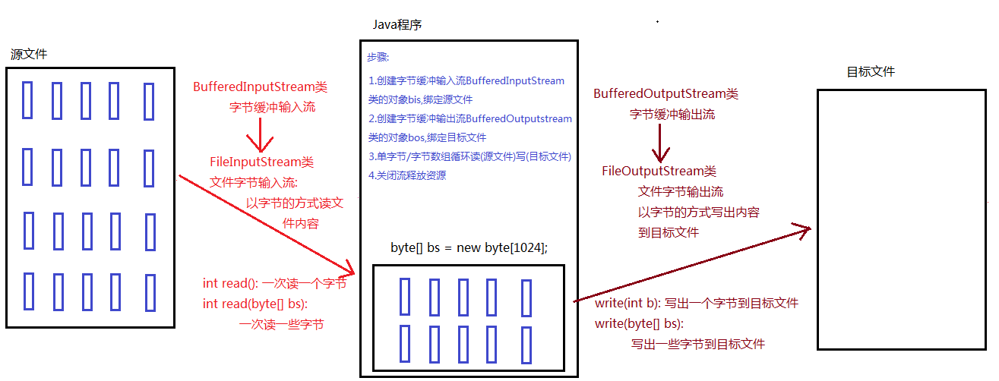
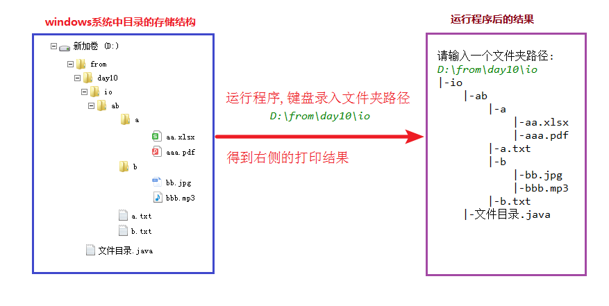

# <center>IO流</center>
[toc]
## IO流
### IO流的介绍
```
1.IO流的概念
    	I input 输入/读取,从硬盘到内存,读进来
    	O output 输出/写入,从内存到硬盘 写出去
    	Java的IO流的命名,都是以程序/内存为参照物

	2.为什么要学习IO流呢?1
    	以前数据存储变量/数组/集合,但是它们都在内存中,程序停止,内存中的数据消失
    	而IO流可以把数据写出到硬盘文件中,实现数据的持久化保存

	3.Java中IO流是单向的
    	读/输入: 输入流
    	写/输出: 输出流00000
```

### IO流的分类
```
IO流的分类
    1.按照流的方向:
        输入流:
            字节输入流: InputStream
            字符输入流: Reader

        输出流:
            字节输出流: OutputStream
            字符输出流: Writer

    2.按照流中的数据:
        字节流: 计算机中的一切都是字节
            是一个万能的流,可以处理计算机中的任意类型的文件
            字节输入流: InputStream
            字节输出流: OutputStream

        字符流: 只能用来处理纯文本文件
            纯文本文件: 用记事本打开可以看得懂的文件
            .java,.html,.xml,.css,.js,.dtd,.xsd 是纯文本文件
            .doc,.xls 不是纯文本文件
            字符输入流: Reader
            字符输出流: Writer
```
## 字节流
### OutputStream介绍
```
java.io.OutputStream类: 字节输出流顶层抽象父类,写出字节的 写出去
    常用方法:
        public void close(): 关闭流,释放资源
        public void write(int b): 写出一个字节
        public void write(byte[] bs): 写出一个字节数组
        public void write(byte[] bs,int startIndex,int len): 写出一个字节数组的一部分
            参数:
                byte[] bs: 字节数组
                int startIndex: 起始索引
                int len: 写出字节的个数

java.io.OutputStream类: 抽象父类,不能直接new对象
```
### 字节输出流写数据的方法
```
java.io.OutputStream类: 抽象父类,不能直接new对象
	常用子类:
    	java.io.FileOutputStream类: 
			文件字节输出流,以字节的方式,写出内容到文件中,----写出去 目标文件
			
    	构造方法:
        	public FileOutputStream(File path):
        	public FileOutputStream(String path):
            	参数:
                	File/String类型的文件路径

	使用步骤:
    	1.创建文件字节输出流FileOutputStream类的对象fos,绑定目标文件
    	2.文件字节输出流FileOutputStream类的对象fos调用write方法,写出字节到文件
    	3.字节输出流FileOutputStream类的对象fos调用close方法,关闭流释放资源

	String变成字节数组?
    	public byte[] getBytes(): 获取调用方法字符串对应的字节数组
```
```java
public class Demo03OputStream {
    public static void main(String[] args) throws IOException {
        //1.创建文件字节输出流FileOutputStream类的对象fos,绑定目标文件
        //FileOutputStream fos = new FileOutputStream(文件路径String类型需要双引号);
        FileOutputStream fos = new FileOutputStream("day11_xw\\fos1.txt");

        //2.文件字节输出流FileOutputStream类的对象fos调用write方法,写出字节到文件
        //写出单个字节: write(int b)
        fos.write(97);

        fos.write('A');

        //写出字节数组: write(byte[] bs)
        byte[] bs = {66,67,68,69,70,71};//B-G
        fos.write(bs);

        //写出一个字节数组的一部分: write(byte[] bs,int startIndex,int len)

        //把D,E,F 重新写一遍
        fos.write(bs,2,3);

        //写出一个字符串
        //String.getBytes();String内部方法将字符串内容转换成byte[]数组类型
        byte[] bs2 = "好想有个女朋友".getBytes();
        fos.write(bs2);

        fos.write("有个女同桌也行".getBytes());

        //3.字节输出流FileOutputStream类的对象fos调用close方法,关闭流释放资源
        fos.close();
    }
}
```
### 字节输出流追加续写
```
  字节输出流追加续写
    构造方法:
        public FileOutputStream(File path,boolean append):
        public FileOutputStream(String path,boolean append):
            参数:
                File/String类型的文件路径
                boolean append
                    true: 追加写入,继续写入
                    false: 覆盖/重写写入
                默认不写第二个参数,就是false,代表覆盖/重写写入

    使用步骤:
        1.创建文件字节输出流FileOutputStream类的对象fos,绑定目标文件
        2.文件字节输出流FileOutputStream类的对象fos调用write方法,写出字节到文件
        3.字节输出流FileOutputStream类的对象fos调用close方法,关闭流释放资源


    换行也是字符串:
        windows: \r\n
        linux/unix: \n
```
```java
public class Demo04Append {
    public static void main(String[] args) throws IOException {
        FileOutputStream fos = new FileOutputStream("day11_xw\\fos2.txt",true);
        fos.write("好好学习".getBytes());
        //写入换行
        fos.write("\r\n".getBytes());
        fos.write("天天向上".getBytes());
        fos.write("\r\n".getBytes());
        fos.close();
    }
}
```
### InputStream介绍
```
java.io.InputStream类: 字节输入流顶层抽象父类,以字节的方式读取内容 读进来
	常用方法:
    	public void close(): 关闭流,释放资源
    	public int read(): 读取一个字节,返回int数据
    	public int read(byte[] bs): 读取一个字节数组,返回int数据(表示读取到的字节的数量)
        	参数:
            	byte[] bs: 字节数组,作用是存储读取到的多个字节的内容
        	返回值:
            	int: 表示读取到的字节的数量

    	文件都有结束标志,read方法遇到结束标志,返回-1
    	如果read方法返回-1,说明文件读取结束了

java.io.InputStream类:抽象类,不能直接new对象
```
### InputStream一次读取一个字节
```
java.io.InputStream类:抽象类,不能直接new对象
    常用子类:
        java.io.FileInputStream类: 文件字节输入流,以字节的方式读取文件内容,读进来,源文件
        构造方法:
            public FileInputStream(File path):
            public FileInputStream(String path):
                参数:
                    File/String类型的文件路径

        使用步骤:
            1.创建文件字节输入流FileInputStream类的对象fis,绑定源文件
            2.文件字节输入流FileInputStream类的对象fis调用read方法,从源文件中读取出字节内容
            3.文件字节输入流FileInputStream类的对象fis调用close方法,关闭流释放资源
```
```java
public class Demo03InputStream {
    public static void main(String[] args) throws IOException {
        //1.创建文件字节输入流FileInputStream类的对象fis,绑定源文件
        FileInputStream fis = new FileInputStream("day11_xw\\fis1.txt");

        //2.文件字节输入流FileInputStream类的对象fis调用read方法,从源文件中读取出字节内容
        //定义int变量,保存每次读取到的一个字节的内容
        int b = 0;

        //从fis对象关联的文件中,读取一个字节,返回int数字,赋值给变量b
        //最后判断b的值是否等于-1
        while ((b = fis.read()) != -1) {
            System.out.println(b+"<------>"+(char)b);
        }

        //3.文件字节输入流FileInputStream类的对象fis调用close方法,关闭流释放资源
        fis.close();

    }
    //原始代码
    private static void method01() throws IOException {
        //1.创建文件字节输入流FileInputStream类的对象fis,绑定源文件
        FileInputStream fis = new FileInputStream("day11_xw\\fis1.txt");

        //2.文件字节输入流FileInputStream类的对象fis调用read方法,从源文件中读取出字节内容
        int b;
        b = fis.read();
        System.out.println(b+"<---->"+(char)b);

        b = fis.read();
        System.out.println(b+"<---->"+(char)b);

        b = fis.read();
        System.out.println(b+"<---->"+(char)b);

        b = fis.read();
        System.out.println(b+"<---->"+(char)b);

        b = fis.read();
        System.out.println(b+"<---->"+(char)b);

        //3.文件字节输入流FileInputStream类的对象fis调用close方法,关闭流释放资源
        fis.close();
    }
}
```
### 一次读取一个字节数组
```
byte[] 变成 String
        String的构造方法
            public String(byte[] bs): 把构造方法参数字节数组,转换成字符串
            public String(byte[] bs,int startIndex,int len):
                把构造方法参数字节数组从指定索引开始后面的len个字节,转换成字符串
```
```java
public class Demo04InputStream {
    public static void main(String[] args) throws IOException {
        //1.创建文件字节输入流FileInputStream类的对象fis,绑定源文件
        FileInputStream fis = new FileInputStream("day11_xw\\fis2.txt");

        //2.文件字节输入流FileInputStream类的对象fis调用read方法,从源文件中读取出字节内容
        //定义byte数组,用来保存每次读取到的多个字节的内容
        byte[] bs = new byte[2];

        //定义int变量,保存每次读取到的字节的个数
        int len = 0;

        //从fis对象关联的文件中,读取多个字节,存储到字节数组bs中,返回读取到的字节的个数,
        //赋值给int变量len,最后判断len的值是否等于-1
        while ((len = fis.read(bs)) != -1) {
            System.out.println(new String(bs,0,len));
        }
        //3.文件字节输入流FileInputStream类的对象fis调用close方法,关闭流释放资源
        fis.close();
    }
}
```
## 文件复制(重要)
### 文件复制原理
    使用字节流可以进行任何文件的复制，因为字节流操作的是组成文件的最小单元-字节。

### 文件复制代码实现
```
字节流复制文件
    实现步骤:
        1.创建文件字节输入流FileInputStream类的对象fis,绑定源文件
        2.创建文件字节输出流FileOutputStream类的对象fos,绑定目标文件
        3.循环读(源文件)写(目标文件)
        4.关闭流,释放资源
测试效率步骤：
        //1.记录开始时间 
        //2.执行功能代码
        //3.记录结束时间  
        //4.计算总耗时,并打印
```
```java
public class Demo04CopyFile {
    public static void main(String[] args) throws IOException {
        //测试效率
        //1.记录开始时间
        long start = System.currentTimeMillis();
        //2.执行功能代码
        copy02();
        //3.记录结束时间
        long end = System.currentTimeMillis();

        //4.计算总耗时,并打印
        System.out.println("总耗时: "+(end - start)+" 毫秒");

    }
    //字节数组循环复制
    private static void copy02() throws IOException {
        //1.创建文件字节输入流FileInputStream类的对象fis,绑定源文件
        FileInputStream fis = new FileInputStream("day11_xw\\io\\from\\jzc.flv");

        //2.创建文件字节输出流FileOutputStream类的对象fos,绑定目标文件
        FileOutputStream fos = new FileOutputStream("day11_xw\\io\\to\\jzc.flv");

        //3.字节数组循环读(源文件)写(目标文件)

        //定义byte数组,保存每次读取到的多个字节的内容
        byte[] bs = new byte[1024*8];

        //定义int变量,保存每次读取到的字节的个数
        int len = 0;
        //从fis对象关联的文件中读取多个字节,把读取到的多个字节的内容,存储到字节数组bs中
        //返回读取的字节的个数,赋值给int变量len
        //最后判断len的值是否等于-1
        while ((len = fis.read(bs)) != -1) {
            //把字节数组bs中的内容,从索引0开始后面的len个字节,写出到fos对象关联的文件中
            fos.write(bs,0,len);
        }

        //4.关闭流,释放资源
        fis.close();
        fos.close();
    }

    //单字节循环复制文件
    private static void copy01() throws IOException {
        //1.创建文件字节输入流FileInputStream类的对象fis,绑定源文件
        FileInputStream fis = new FileInputStream("day11_xw\\io\\from\\jzc.flv");

        //2.创建文件字节输出流FileOutputStream类的对象fos,绑定目标文件
        FileOutputStream fos = new FileOutputStream("day11_xw\\io\\to\\jzc.flv");

        //3.单字节循环读(源文件)写(目标文件)

        //定义int变量,保存每次读取到的单个字节的内容
        int b = 0;

        //从fis对象关联的文件中读取一个字节,返回int数字,赋值给变量b
        //最后判断b的值是否等于-1
        while ((b = fis.read()) != -1) {
            //把b中的内容写出到fos对象关联的文件中
            fos.write(b);
        }

        //4.关闭流,释放资源
        fis.close();
        fos.close();
    }
}
```
## IO流中的异常处理
```
   IO流代码中的异常处理
        1.throws: 声明抛出异常
        2.try-catch: 捕获处理异常
            try{
                有可能产生异常的代码
            } catch(异常类 对象名){
                异常处理的代码
            } finally{
                释放资源的代码
            }
    还可以使用JDK7优化后的 try-with-resource 语句，该语句确保了每个资源在语句结束时关闭。所谓的资源（resource）是指在程序完成后，必须关闭的对象。
    	try(流对象的定义){
    		有可能产生异常的代码
    	}catch(异常类 对象名) {
    		异常处理的代码
    	}
```
```java
public class Demo05IOException {
    public static void main(String[] args) {
        //提升变量的作用域,进行初始化
        //不初始化的话,在创建对象时,如果出异常,变量没有值,不能调用方法
        FileInputStream fis = null;
        FileOutputStream fos = null;
        try {
            fis = new FileInputStream("day11_xw\\io\\from\\jzc.flv");
            fos = new FileOutputStream("day11_xw\\io\\to\\jzc.flv");
            byte[] bs = new byte[1024*8];
            int len = 0;
            while ((len = fis.read(bs)) != -1) {
                fos.write(bs,0,len);
            }
        } catch (IOException e) {
            e.printStackTrace();
        } finally {
            //必须分开处理
            //如果try中new对象出了异常,变量的初始值都是null
            //调用方法,报出空指针异常
            if(fis != null) {
                try {
                    fis.close();
                } catch (IOException e) {
                    e.printStackTrace();
                }
            }
            if (fos != null) {
                try {
                    fos.close();
                } catch (IOException e) {
                    e.printStackTrace();
                }
            }
        }
    }
}
```
### 测试jdk7的新的异常处理方式,会自动关闭流对象
```java
public class MyFileInputStream implements AutoCloseable {

    //模拟读取文件的方法
    public void read() {
        System.out.println("读取到文件的内容: 该下课了,大家晚上好好吹牛逼!!!!");
    }

    @Override
    public void close() throws Exception {
        System.out.println("流对象被关闭了....");
    }
}
```
    测试类：
```java
//测试jdk7的新的异常处理方式,会自动关闭流对象
public class Demo08AutoClose {
    public static void main(String[] args) {
        try (MyFileInputStream mis = new MyFileInputStream();) {
            mis.read();
        } catch (Exception e) {
            e.printStackTrace();
        }
    }
}
```
## 缓冲流
### 字节输出缓冲流
```
java.io.BufferedOutputStream类: 字节缓冲输出流,以字节的方式写出内容到目的地,写出去
        作用: 内部定义了长度为8192的字节数组,用来提高效率
    BufferedOutputStream类是OutputStream类的子类,OutputStream类的方法,都能用:

        常用方法:
            public void close(): 关闭流,释放资源的
            public void write(int b): 写出一个字节的
            public void write(byte[] bs): 写出一个字节数组
            public void write(byte[] bs,int index,int len): 写出一个字节数组的一部分
                参数:
                    byte[] bs: 字节数组
                    int index: 起始索引
                    int len: 字节个数
    构造方法:
        public  BufferedOutputStream(OutputStream os):
            参数:
                OutputStream os: 字节输出流抽象父类,传递子类FileOutputStream对象

    使用步骤:
        1.创建OutputStream类的子类FileOutputStream的对象fos,绑定目标文件
        2.创建字节缓冲输出流BufferedOutputStream的对象bos,构造方法传递fos
        3.字节缓冲输出流BufferedOutputStream的对象bos调用write方法,写出字节
        4.字节缓冲输出流BufferedOutputStream的对象bos调用close方法,关闭流,释放资源

    注意:
        1.使用缓冲流,千万不要调用flush方法了
        2.不用自己关闭缓冲流所关联的其它流
```
```java
public class Demo03BufferedOutputStream {
    public static void main(String[] args) throws IOException {
        //1.创建OutputStream类的子类FileOutputStream的对象fos,绑定目标文件
        //OutputStream os = new FileOutputStream("day11\\files\\f3.txt");

        //2.创建字节缓冲输出流BufferedOutputStream的对象bos,构造方法传递fos
        //BufferedOutputStream bos = new BufferedOutputStream(os);
        BufferedOutputStream bos = new BufferedOutputStream(new FileOutputStream("day11\\files\\fi.txt"));
        //3.字节缓冲输出流BufferedOutputStream的对象bos调用write方法,写出字节
        //写出单个字节
        bos.write(97);
        bos.write('b');
        bos.write("\r\n".getBytes());
        //写出字节数组
        byte[] bytes = {99,100,101,102,103,104,105};
        bos.write(bytes);
        bos.write("\r\n".getBytes());
        //要求字节数组的一部分
        //要求把defgh重写写一遍
        bos.write(bytes,1,5);
        bos.write("\r\n".getBytes());
        bos.close();

    }
}

```
### 字节输入缓冲流
```
BufferedInputStream类   字节输入缓冲流,读取字节的       读进来
	作用： 内部定义了一个长度为8192的字节数组，可以提高效率

	常用方法:
		1.public void close(): 关闭流,释放资源
		2.public int read(): 读取一个字节
			遇到文件结束标志,返回-1,说明读取文件应该结束了

		3.public int read(byte[] bs):
			读取一些字节,把读取到的多个字节的内容,存储到方法参数字节数组bs中
			返回读取到的字节的数量

	构造方法：
		public BufferedInputStream(InputStream is):
			参数： InputStream is 字节输入流抽象类 传递子类FileInputStream对象

	使用步骤：
		1.创建InputStream类的子类FileInputStream对象fis，绑定源文件
		2.创建高效字节输入流BufferedInputStream对象bis,传递InputStream类的子类FileInputStream对象
		3.高效字节输入流BufferedInputStream对象bis调用read方法,读取字节
		4.关闭流

	注意:
		1.对于缓冲流,千万不要自己调用flush方法
		2.只需要关闭缓冲流,自动关闭缓冲流所关联的其它流对象
```
```java
public class Demo04BufferedInputStream {
    public static void main(String[] args) throws IOException {
        method02();
    }
    //字节缓冲输入流字节数组循环读取
    private static void method02() throws IOException {
        //1.创建InputStream类的子类FileInputStream对象fis，绑定源文件
        //InputStream is = new FileInputStream("day11\\files\\f3.txt");

        //2.创建字节缓冲输入流BufferedInputStream对象bis,传递InputStream类的子类FileInputStream对象
        //BufferedInputStream bis = new BufferedInputStream(is);
        BufferedInputStream bis = new BufferedInputStream(new FileInputStream("day11\\files\\f3.txt"));

        //3.高效字节输入流BufferedInputStream对象bis调用read方法,读取字节
        //定义长度为5的byte数组bs,用来保存每次读取到的多个字节的内容
        byte[] bs = new byte[5];

        //定义int变量len,用来保存每次读取到的字节的个数
        int len;

        //从bis关联的文件中读取多个字节存储数组bs中,返回读取到的字节的个数赋值给左侧变量len
        //最后判断len的值是否不等于-1
        while ((len = bis.read(bs)) != -1) {
            //把字节数组bs中所有0后面的len个字节的内容转换成 字符串并输出
            System.out.print(new String(bs,0,len));
        }

        //4.关闭流
        bis.close();
    }

    //字节缓冲输入流单字节循环读取
    private static void method01() throws IOException {
        //1.创建InputStream类的子类FileInputStream对象fis，绑定源文件
        //InputStream is = new FileInputStream("day11\\files\\f3.txt");

        //2.创建字节缓冲输入流BufferedInputStream对象bis,传递InputStream类的子类FileInputStream对象
        //BufferedInputStream bis = new BufferedInputStream(is);
        BufferedInputStream bis = new BufferedInputStream(new FileInputStream("day11\\files\\f3.txt"));

        //3.高效字节输入流BufferedInputStream对象bis调用read方法,读取字节
        //定义int变量b,保存每次读取到的单个字节的内容
        int b;
        //从bis关联的文件中读取一个字节,返回对应的int数字
        //赋值给左侧变量b,最后判断b的值是否不等于-1
        while ((b = bis.read()) != -1) {
            //把int变量b中的内容强制类型转换成char并输出
            System.out.print((char) b);
        }

        //4.关闭流
        bis.close();
    }
}
```
### 字节缓冲流复制文件原理分析

### 字节缓冲复制文件代码实现
```
    字节缓冲流复制文件

    源文件: day12_sw\\copyfrom\cxyjzc.flv
    目标文件: day12_sw\\copyto\cxyjzc.flv

    步骤:
        1.创建字节缓冲输入流BufferedInputStream类的对象bis,绑定源文件
        2.创建字节缓冲输出流BufferedOutputStream类的对象bos,绑定目标文件
        3.单字节/字节数组循环读(源文件)写(目标文件)
        4.关闭流释放资源

    字节缓冲流复制文件效率对比:
        1.单字节循环复制: 311 毫秒
        2.字节数组循环复制: 23 毫秒
```
```java
public class Demo04BufferedCopyFile {
    public static void main(String[] args) throws IOException {
        //源文件: copyfrom\cxyjzc.flv
        File srcFile = new File("day12_sw\\copyfrom\\cxyjzc.flv");
        File destFile = new File("day12_sw\\copyto\\cxyjzc.flv");

        //记录开始时间
        long start = System.currentTimeMillis();
        //调用方法
        copy02(srcFile,destFile);
        //记录结束时间
        long end = System.currentTimeMillis();
        //打印总耗时
        System.out.println("总耗时: "+(end-start)+" 毫秒");
    }


    //定义方法,单字节循环复制文件
    public static void copy02(File srcFile,File destFile) throws IOException {
        //1.创建字节缓冲输入流BufferedInputStream类的对象bis,绑定源文件
        BufferedInputStream bis = 
            new BufferedInputStream(new FileInputStream(srcFile));

        //2.创建字节缓冲输出流BufferedOutputStream类的对象bos,绑定目标文件
        BufferedOutputStream bos = 
            new BufferedOutputStream(new FileOutputStream(destFile));

        //3.字节数组循环读(源文件)写(目标文件)

        //定义int变量,保存每次读取到的多个字节的个数
        int len = 0;
        //定义字节数组,保存每次读取到的多个字节的内容
        byte[] bs = new byte[1024];

        //从bis关联的文件中,读取一些字节,保存到字节数组bs中,返回读取到的字节的个数,赋值给变量len
        //最后判断len的值是否等于-1
        while ((len = bis.read(bs)) != -1) {
            //把字节数组bs中从索引0开始后面的len个字节,写出到bos关联的文件中
            bos.write(bs,0,len);
        }

        //4.关闭流释放资源
        bis.close();
        bos.close();
    }

    //定义方法,单字节循环复制文件
    public static void copy01(File srcFile,File destFile) throws IOException {
        //1.创建字节缓冲输入流BufferedInputStream类的对象bis,绑定源文件
        BufferedInputStream bis = 
            new BufferedInputStream(new FileInputStream(srcFile));

        //2.创建字节缓冲输出流BufferedOutputStream类的对象bos,绑定目标文件
        BufferedOutputStream bos = 
            new BufferedOutputStream(new FileOutputStream(destFile));

        //3.单字节循环读(源文件)写(目标文件)

        //定义int变量,保存每次读取到的单个字节的内容
        int b = 0;
        //从bis关联的文件中,读取一个字节,返回该字节对应的int数字,赋值给变量b
        //最后判断b的值是否等于-1
        while ((b = bis.read()) != -1) {
            //把b中的内容写出到bos关联的文件中
            bos.write(b);
        }

        //4.关闭流释放资源
        bis.close();
        bos.close();
    }
}
```
## Properties集合
### Properties集合回顾
```
java.util.Properties集合是Hashtable的子类,双列集合
        主要使用的是与String相关的方法

    常用方法:
        public  Object setProperty(String k,String v): 保存一个键值对(属性名=属性值)
        public  String getProperty(String key): 根据属性名获取属性值
        public Set<String> stringPropertyNames(): 获取所有属性值对应的Set集合


    java.lang.System类: 与系统相关的工具类
    静态方法:
        public static Properties getProperties(): 获取系统相关的属性名及属性值
```
```java
public class Demo01Properties {
    public static void main(String[] args) {
        //System类调用静态方法,获取Properties对象
        Properties props = System.getProperties();
        //增强for遍历
        for (String propertyName : props.stringPropertyNames()) {
            String propertyValue = props.getProperty(propertyName);
            System.out.println(propertyName+"::"+propertyValue);
        }
    }
    //Properties集合的基本使用
    private static void method01() {
        Properties props = new Properties();
        //添加键值对
        props.setProperty("name","zhangsan");
        props.setProperty("age","28");
        props.setProperty("gender","nan");

        //遍历
        Set<String> propertyNames = props.stringPropertyNames();
        for (String propertyName : propertyNames) {
            String propertyValue = props.getProperty(propertyName);
            System.out.println(propertyName+"::"+propertyValue);
        }
    }
}
```
### Properties集合的load方法
```
Properties集合    
    与IO流相关的成员方法(必须由Properties对象调用)
        load方法内部,指挥InputStream/Reader的子类对象,读取文件,load方法内部把获取到的文件内容,
        进行处理,处理成键值对的形式,存储到Properties集合对象中,至于如何处理的,我们不关心

        public void load(InputStream inStream)： 从字节输入流中读取键值对。
            参数:
                 InputStream inStream: 抽象父类,传递子类FileInputStream对象

        public void load(Reader reader)： 从字符输入流中读取键值对。
            参数:
                 Reader reader: 抽象父类,传递子类FileReader对象

     使用步骤:
        1.load方法加载的文件,要求扩展名(配置信息).properties,一般存储到src根目录下,
            数据存储格式: 属性名=属性值,注释: 用#
        2.创建Properties集合对象
        3.创建InputStream/Reader的子类对象,绑定源文件
        4.Properties集合对象调用load方法传递InputStream/Reader的子类对象,
        	把文件内容以键值对的方式加载到Properties集合对象中
        5.遍历集合
```
```java
public class Demo02Properties {
    public static void main(String[] args) throws IOException {
        //2.创建Properties集合对象
        Properties props = new Properties();

        //3.创建InputStream/Reader的子类对象,绑定源文件
        InputStream is = new FileInputStream("day13_sw\\src\\config.properties");

        //4.Properties集合对象调用load方法传递InputStream/Reader的子类对象,
        //把文件内容以键值对的方式加载到Properties集合对象中
        props.load(is);

        //5.遍历集合
        Set<String> propertyNames = props.stringPropertyNames();

        for (String propertyName : propertyNames) {
            String propertyValue = props.getProperty(propertyName);
            System.out.println(propertyName+"::::"+propertyValue);
        }
    }
}
```
### Properties集合的store方法
```
Properties集合与IO流相关的成员方法(必须由Properties对象调用)
        store方法内部,指挥OutputStream/Writer的子类对象,把Properties集合内容键值对内容,
        以键值对的方式写入到目标文件中,至于如何处理的,我们不关心

        - public void store(OutputStream outStream,String comments)：
        	把Properties集合对象的键值对保存到文件中
            参数:
                 OutputStream outStream: 抽象父类,传递子类FileOutputStream对象
                 String comments: 给properties文件的说明信息 可以直接写为null

        - public void store(Writer writer,String comments)：
        	把Properties集合对象的键值对保存到文件中
            参数:
                 Writer writer: 抽象父类,传递子类FileWriter对象
                 String comments: 给properties文件的说明信息 可以直接写为null
```
```java
public class Demo03Properties {
    public static void main(String[] args) throws IOException {
        //2.创建Properties集合对象
        Properties props = new Properties();

        //3.创建InputStream/Reader的子类对象,绑定源文件
        InputStream is = new FileInputStream("day13_sw\\src\\config.properties");

        //4.Properties集合对象调用load方法传递InputStream/Reader的子类对象,
        //把文件内容以键值对的方式加载到Properties集合对象中
        props.load(is);

        //5.遍历集合
        Set<String> propertyNames = props.stringPropertyNames();

        for (String propertyName : propertyNames) {
            String propertyValue = props.getProperty(propertyName);
            if("age".equals(propertyName)) {//age属性的值增加10岁
                props.setProperty(propertyName,Integer.parseInt(propertyValue)+10+"");
            }
        }
        OutputStream os = new FileOutputStream("day13_sw\\src\\config.properties");
        //把Properties集合对象中的内容存储到文件中
        props.store(os,null);
    }
}
```
## 使用IO流完成复制
### 文件的复制
```
字节流复制文件
    实现步骤:
    1、创建字节输入流FileInputStream类对象fis，绑定源文件
    2、创建字节输入流FileOutputStream类对象fos，绑定源文件
    3、循环读(源文件)写(目标文件)
    4、关闭流，释放资源
```
```java
import java.io.FileInputStream;
import java.io.FileOutputStream;
import java.io.IOException;

public class Dome04CopyFile {
    public static void main(String[] args) throws IOException {
        //1.记录开始时间
        long start = System.currentTimeMillis();
        //2.执行功能代码
        //copy01();
        copy02();
        //3.记录结束时间
        long end = System.currentTimeMillis();
        //4.计算总耗时,并打印
        System.out.println("总耗时："+(end-start)+"毫秒");
    }

    /**
     * 字节数组循环读写文件
     * @throws IOException
     */
    private static void copy02() throws IOException {
        //1、创建字节输入流FileInputStream类对象fis，绑定源文件
        FileInputStream fis = new FileInputStream("day11\\copy\\from\\jzc.flv");
        //2、创建字节输入流FileOutputStream类对象fos，绑定源文件
        FileOutputStream fos = new FileOutputStream("day11\\copy\\to\\jzc.flv");
        //3、循环读(源文件)写(目标文件)
        byte[] bytes = new byte[1024];
        int len;
        while ((len = fis.read(bytes))!=-1){
            fos.write(bytes,0,len);
        }
        //4、关闭流，释放资源
        fis.close();
        fos.close();
    }

    /**
     * 单字节循环读写文件
     * @throws IOException
     */
    private static void copy01() throws IOException {
        //1、创建字节输入流FileInputStream类对象fis，绑定源文件
        FileInputStream fis = new FileInputStream("day11\\copy\\from\\jzc.flv");
        //2、创建字节输入流FileOutputStream类对象fos，绑定源文件
        FileOutputStream fos = new FileOutputStream("day11\\copy\\to\\jzc.flv");
        //3、循环读(源文件)写(目标文件)
        int b;
        while ((b = fis.read())!=-1){
            fos.write(b);
        }
        //4、关闭流，释放资源
        fis.close();
        fos.close();
    }
}
```
### 使用字节缓冲流完成文件的复制
```
1.创建字节缓冲输入流BufferedInputStream类的对象bis,绑定源文件
2.创建字节缓冲输出流BufferedOutputStream类的对象bos,绑定目标文件
3.单字节/字节数组循环读(源文件)写(目标文件)
4.关闭流释放资源
```
```java
import java.io.*;
public class Dome04CopyButter {
    public static void main(String[] args) throws IOException {
        //1.记录开始时间
        long start = System.currentTimeMillis();
        //2.执行功能代码
        //copy01();
        copy02();
        //3.记录结束时间
        long end = System.currentTimeMillis();
        //4.计算总耗时,并打印
        System.out.println("总耗时："+(end-start)+"毫秒");
    }

    private static void copy02() throws IOException {
        //1.创建字节缓冲输入流BufferedInputStream类的对象bis,绑定源文件
        BufferedInputStream bis = new BufferedInputStream(new FileInputStream("day11\\copy\\from\\jzc.flv"));
        //2.创建字节缓冲输出流BufferedOutputStream类的对象bos,绑定目标文件
        BufferedOutputStream bos = new BufferedOutputStream(new FileOutputStream("day11\\copy\\to\\jzc.flv"));
        //3.字节数组循环读(源文件)写(目标文件)
        byte[] bs = new byte[1024];
        int len;
        while ((len = bis.read(bs))!=-1){
            bos.write(bs,0,len);
        }
        bis.close();
        bos.close();
    }

    private static void copy01() throws IOException {
        //1.创建字节缓冲输入流BufferedInputStream类的对象bis,绑定源文件
        BufferedInputStream bis = new BufferedInputStream(new FileInputStream("day11\\copy\\from\\jzc.flv"));
        //2.创建字节缓冲输出流BufferedOutputStream类的对象bos,绑定目标文件
        BufferedOutputStream bos = new BufferedOutputStream(new FileOutputStream("day11\\copy\\to\\jzc.flv"));
        //3.单字节循环读(源文件)写(目标文件)
        int b;
        while ((b = bis.read())!=-1){
            bos.write(b);
        }
        //4.关闭流释放资源
        bis.close();
        bos.close();
    }
}
```
### 文件夹的复制
```
定义方法复制文件夹
    要求:
        把idea中的hello文件夹复制到文件夹toto中
        源文件夹: hello
        目标文件夹: toto
    步骤：
        //创建源文件
        //创建目标文件
        //调用方法完成文件夹的复制
        方法内：
        //获取源文件夹的名字
        //创建新的目标文件夹对应的File对象
        //如果新的目标文件夹不存在的话，需要创建新的目标文件夹
        //获取源文件夹中的所有直接子文件和直接文件夹对应的File对象数组
        //健壮性判断
        //增强for遍历
            //如果当前File对象file是代表的文件
            //调用方法把文件复制到指定的文件夹下
            //如果当前File对象file是代表的文件夹
            //递归调用
        
```
```java
import java.io.File;
import java.io.FileInputStream;
import java.io.FileOutputStream;
import java.io.IOException;

public class Dome04DirToDir {
    public static void main(String[] args) throws IOException {
        //创建源文件
        File srcDir = new File("day11\\hello");
        //创建目标文件
        File desDir = new File("day11\\toto");

        //调用方法完成文件夹的复制
        copyDirectoryToDirectory(srcDir, desDir);
    }

    /**
     * 把源文件夹(包含内部的所有内容) 复制到新的 目标文件夹下
     * @param srcDir  源文件夹
     * @param desDir  目标文件夹
     * @throws IOException
     */

    private static void copyDirectoryToDirectory(File srcDir, File desDir) throws IOException {
        //获取源文件夹的名字
        String srcDirName = srcDir.getName();
        //创建新的目标文件夹对应的File对象
        File newDesrDir = new File(desDir, srcDirName);
        //如果新的目标文件夹不存在的话，需要创建新的目标文件夹
        if (!newDesrDir.exists()){
            newDesrDir.mkdir();
        }
        //获取源文件夹中的所有直接子文件和直接文件夹对应的File对象数组
        File[] files = srcDir.listFiles();
        //健壮性判断
        for (File file : files) {
            //增强for遍历
            if (file.isFile()){
                //如果当前File对象file是代表的文件
                //调用方法把文件复制到指定的文件夹下
                copy02(file,newDesrDir);
            }else{
                //如果当前File对象file是代表的文件夹
                //递归调用
                copyDirectoryToDirectory(file,newDesrDir);
            }
        }
    }

    /**
     * 把指定的文件，复制到指定的文件夹中
     * @param srcFile 被复制的文件对应的File对象
     * @param destDir 复制后产生的目标文件的存储目录
     * @throws IOException
     */
    private static void copy02(File srcFile,File destDir) throws IOException {
        //1、创建字节输入流FileInputStream类对象fis，绑定源文件
        FileInputStream fis = new FileInputStream(srcFile);
        //获取文件 的名字
        String name = srcFile.getName();
        //创建复制新的目标文件路径
        File desFile = new File(destDir, name);
        //2、创建字节输入流FileOutputStream类对象fos，绑定源文件
        FileOutputStream fos = new FileOutputStream(desFile);
        //3、循环读(源文件)写(目标文件)
        byte[] bytes = new byte[1024];
        int len;
        while ((len = fis.read(bytes))!=-1){
            fos.write(bytes,0,len);
        }
        //4、关闭流，释放资源
        fis.close();
        fos.close();
    }
}
```
### 文件及文件夹的剪切
```java
import java.io.File;
import java.io.FileInputStream;
import java.io.FileOutputStream;
import java.io.IOException;

public class Test06 {
    public static void main(String[] args) throws IOException {
        File srcDir = new File("day11\\ab");
        File desDir = new File("day11\\abc");
        copyDir2Dir(srcDir,desDir);
    }
    private static void copyDir2Dir(File srcDir, File desDir) throws IOException {
        //获取文件夹
        String srcDirName = srcDir.getName();
        //创建新的文件夹路径
        File newDesDir = new File(desDir, srcDirName);
        //判断新的文件夹路径是否存在，不存在的话就创建一个
        if (!newDesDir.exists()){
            newDesDir.mkdir();
        }
        File[] files = srcDir.listFiles();
        if (null != files && files.length>0){
            //增强for
            for (File fs : files) {
                //判断,如果当前File对象是文件,调用copyFile2Dir方法,完成文件复制
                if (fs.isFile()){
                    copyFile2Dir(fs,newDesDir);
                    fs.delete();
                    //判断,如果当前File对象是文件夹,递归调用copyDir2Dir方法,完成文件夹复制
                }else if (fs.isDirectory()){
                    copyDir2Dir(fs,newDesDir);
                }
            }
            srcDir.delete();
        }
    }
    //将文件复制到指定文件夹中
    private static void copyFile2Dir(File srcFir, File desDir) throws IOException {
        //1.2、定义byte数组,保存每次读取到的字节的内容
        FileInputStream fis = new FileInputStream(srcFir);
        //1.4、根据目标文件夹和源文件,创建目标文件
        String name = srcFir.getName();
        File newFile = new File(desDir, name);
        //1.5、创建文件字节输出流FileOutputStream类的对象,绑定目标文件
        FileOutputStream fos = new FileOutputStream(newFile);
        //1.3、定义int变量,保存每次读取到的字节数量
        byte[] bs = new byte[1024];
        int len;
        //1.6、循环读(源文件)写(目标文件)
        while ((len = fis.read(bs))!= -1 ){
            fos.write(bs,0,len);
        }
        //1.7、关闭流释放资源
        fis.close();
        fos.close();
    }
}
```
### 按文件格式输出

    windows资源管理器中会展示目录中的内容结构,但是java并没有提供展示目录结构的操作,
    本案例完成按照指定格式打印文件夹的目录结构(包含子文件夹和文件),效果如下图:

```
操作步骤
1、定义打印文件/文件夹名称的方法printFileName	
    	1.1、for循环打印num个制表符tab(java中用"\t"表示),不带换行
    	1.2、打印File对象名称,前面拼接|-,需要换行
2、定义打印文件夹方法printDir	
        2.1、 调用printFileName方法打印文件夹名称
        2.2、 获取源文件夹中的所有的文件和文件夹对应的File对象数组
        2.3、 判断,如果File对象数组是null或者没有内容,结束方法
        2.4、 遍历File对象数组
        2.5、 判断,如果当前File对象是文件,调用printFileName方法,打印文件名称
        2.6 、判断,如果当前File对象是文件夹,递归调用printDir方法
3、创建被遍历文件夹的File对象
4、调用printDir方法,传递源文件夹和0,完成文件夹目录结构的打印
```
```java
import java.io.File;

public class Test02 {
    public static void main(String[] args) {
        //创建源文件
        File srcDir = new File("day11\\ab");
        printDir(srcDir,0);
    }

    private static void printFileName(File srcDir, int num) {
        //1.1、for循环打印num个制表符tab(java中用"\t"表示),不带换行
        for (int i = 0; i < num; i++) {
            System.out.print("\t");
        }
        //1.2、打印File对象名称,前面拼接|-,需要换行
        System.out.println("|-"+srcDir.getName());
    }

    private static void printDir(File srcDir,int num) {
        //2.1、 调用printFileName方法打印文件夹名称
        printFileName(srcDir,num);
        num++;
        //2.2、 获取源文件夹中的所有的文件和文件夹对应的File对象数组
        File[] files = srcDir.listFiles();
        //2.3、 判断,如果File对象数组是null或者没有内容,结束方法
        if(null == files || files.length==0){
            return;
        }
        //2.4、 遍历File对象数组
        for (File file : files) {
            //2.5、 判断,如果当前File对象是文件,调用printFileName方法,打印文件名称
            if (file.isFile()){
                printFileName(file,num);
            }
            //2.6 、判断,如果当前File对象是文件夹,递归调用printDir方法
            if (file.isDirectory()){
                printDir(file,num);
            }
        }
    }
}
```
## 
