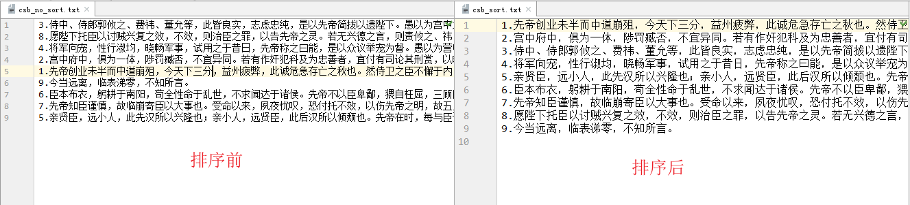
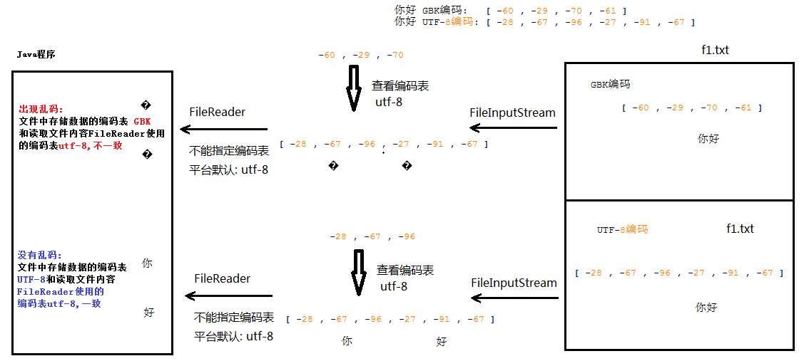
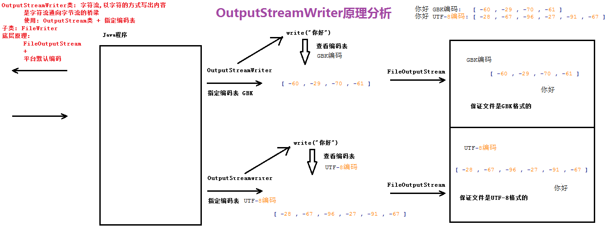
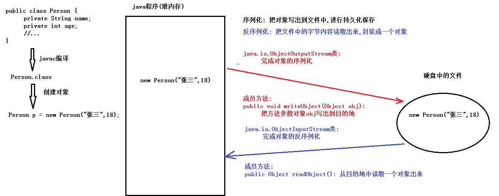

# <center>IO流</center>
[toc]
## 编码表和字符集
### 编码表的介绍
```
1.编码表:
    存储字符和字节对应关系的一张表格
    ASCII编码表: 'A' --> 65 'a' --> 97 '0' --> 48
    编码: 把字符存储到计算机中  字符 --> 字节
    解码: 从计算机中读取出字符  字节 --> 字符

2.常用编码表
    中文windows操作系统,默认编码表: GBK
    GBK编码: 一个汉字占2个字节
    IDEA默认编码表: UTF-8
    UTF-8编码: 一个汉字占3个字节
```
### 字符串的编码和解码方法
```
String的编码和解码?
    问题1:    编码
        如何获取字符串(String)指定编码表对应的字节数组(byte[])呢?
            public byte[] getBytes(): 
				按照默认编码表(IDEA默认编码表: UTF-8),获取调用方法的字符串对应的字节数组
            
            public byte[] getBytes(String charsetName): 
				按照方法参数指定编码表,获取调用方法的字符串对应的字节数组

    问题2:    解码
        如何把字节数组(byte[])按照指定编码表,转换成对应的字符串(String)呢?
        	public String(byte[] bs): 
				按照默认编码表(IDEA默认编码表: UTF-8),把构造方法参数指定的字节数组转换成字符串
        	public String(byte[] bs,String charsetName): 
				按照构造方法参数指定的编码表,把构造方法参数指定的字节数组转换成字符串

	你好 UTF-8编码: [-28, -67, -96, -27, -91, -67]
	你好 GBK编码: [-60, -29, -70, -61]
```
```java
import java.io.UnsupportedEncodingException;
import java.util.Arrays;

public class Demo01Coding {
    public static void main(String[] args) throws UnsupportedEncodingException {
        String s = "你好";
        //获取UTF-8编码
        byte[] bs = s.getBytes();
        System.out.println("你好 UTF-8编码: "+ Arrays.toString(bs));//你好 UTF-8编码: [-28, -67, -96, -27, -91, -67]
        //获取UTF-8编码
        bs = s.getBytes("UTF-8");
        System.out.println("你好 UTF-8编码: "+ Arrays.toString(bs));//你好 UTF-8编码: [-28, -67, -96, -27, -91, -67]

        //获取GBK编码
        byte[] bs2 = s.getBytes("GBK");
        System.out.println("你好 GBK编码: "+ Arrays.toString(bs2));//你好 GBK编码: [-60, -29, -70, -61]

        //按照平台默认编码表(UTF-8)解码
        String s2 = new String(bs);
        System.out.println(s2);//你好

        //按照构造方法参数指定的编码表(GBK)解码
        String s3 = new String(bs2, "GBK");//你好
        System.out.println(s3);
        //编码和解码的规则不统一: 乱码
        String s4 = new String(bs, "GBK");//乱码
        System.out.println(s4);
    }
}
```
### 字节流读取中文问题
```
/*
    字节流读取中文问题
        无法保证每次读取到的是一个/多个汉字对应的完整的字节的内容

    解决方案:使用字符流
        按照字符为单位进行读取,一个读取一个/多个字符
        保证每次读取到的是一个/多个完整的字符

    你好 UTF-8编码: [-28, -67, -96,-27, -91, -67]
 */
```
```java
public class Demo02Problems {
    public static void main(String[] args) throws IOException {        
        FileInputStream fis = new FileInputStream("day12_sw\\f1.txt");
        int len = 0;
        byte[] bs = new byte[3];
        while((len = fis.read(bs))!=-1) {
            System.out.println(new String(bs,0,len));
        }
        fis.close();
    }
}
```

## 字符流
### Reader介绍
```
java.io.Reader类: 字符输入流的顶层抽象父类,以字符的方式读取内容,读进来
	常用方法:
    	public void close(): 关闭流,释放资源
    	public int read(): 读取一个字符,返回对应的int数字(字符对应的int数字)
    	public int read(char[] chs): 读取一些字符,返回对应的int数字(字符的个数)
        	参数:
            	char[] chs: 用来存储读取到的多个字符的内容
        	返回值类型:
            	int: 读取到的字符的个数

		文件都有结束标志,read方法读取时,遇到文件结束标志,返回-1
		如果read方法返回-1,说明文件读取结束了

java.io.Reader类: 抽象类
	常用子类:
    	java.io.FileReader类: 文件字符输入流,以字符的方式读取文件内容,读进来,源文件
    	构造方法:
        	FileReader(File path)
        	FileReader(String path)
            	参数:
                	File/String 类型的文件路径

    	使用步骤:
        	1.创建文件字符输入流FileReader类的对象fr,绑定源文件
        	2.文件字符输入流FileReader类的对象fr调用read方法,以字符的方式读取文件内容
        	3.文件字符输入流FileReader类的对象fr调用close方法,关闭流,释放资源
	补充:
    	String的构造方法
    	public String(char[] chs): 把构造方法参数,按照平台默认编码表,转换成字符串
    	public String(char[] chs, int index, int count):
                把构造方法参数字符数组chs中索引index后的count个字符,按照平台默认编码表,转换成字符串
```
### 使用Reader读取单个字符
```
	使用步骤:
    	1.创建文件字符输入流FileReader类的对象fr,绑定源文件
    	2.文件字符输入流FileReader类的对象fr调用read方法,以字符的方式读取文件内容
    	3.文件字符输入流FileReader类的对象fr调用close方法,关闭流,释放资源
```
```java
public class Demo02Reader {
    public static void main(String[] args) throws IOException {
        //1.创建文件字符输入流FileReader类的对象fr,绑定源文件
        FileReader fr = new FileReader("day12_sw\\f1.txt");

        //2.文件字符输入流FileReader类的对象fr调用read方法,以字符的方式读取文件内容

        //定义int变量,保存每次读取到的一个字符的内容
        int ch = 0;
        //从fr关联的文件中读取一个字符,返回对应的int数字,存储到ch中
        //最后判断ch的值是否等于-1
        while((ch = fr.read())!=-1) {
            System.out.println((char)ch);
        }
        //3.文件字符输入流FileReader类的对象fr调用close方法,关闭流,释放资源
        fr.close();
    }    
}
```
### 使用Reader读取字符数组
```
	使用步骤:
    	1.创建文件字符输入流FileReader类的对象fr,绑定源文件
    	2.文件字符输入流FileReader类的对象fr调用read方法,以字符的方式读取文件内容
    	3.文件字符输入流FileReader类的对象fr调用close方法,关闭流,释放资源
```
```java
public class Demo02Reader {
    public static void main(String[] args) throws IOException {
        //1.创建文件字符输入流FileReader类的对象fr,绑定源文件
        FileReader fr = new FileReader("day12_sw\\f1.txt");

        //2.文件字符输入流FileReader类的对象fr调用read方法,以字符的方式读取文件内容

        //定义int变量,保存每次读取到的字符的个数
        int len = 0;

        //定义字符数组,保存每次读取到的多个字符的内容
        char[] chs = new char[2];

        //从fr关联的文件中读取一些字符,存储到字符数组chs中,
        //返回读取到的字符的数量存储到len中
        //最后判断len的值是否等于-1
        while ((len = fr.read(chs)) != -1) {
            System.out.println(new String(chs,0,len));
        }

        //3.文件字符输入流FileReader类的对象fr调用close方法,关闭流,释放资源
        fr.close();
    }
}
```
### Writer介绍
```
java.io.Writer类: 字符输出流顶层抽象父类,以字符的方式写出内容,写出去
    常用方法:
        public void close(): 关闭流,释放资源
        public void write(int ch): 写出一个字符
        public void write(char[] chs): 写出一个字符数组
        public void write(char[] chs,int startIndex,int len): 写出一个字符数组的一部分
            参数:
                char[] chs: 字符数组
                int startIndex: 起始索引
                int len: 写出字节的数量
        public void write(String str): 写出一个字符串
        public void write(String str,int startIndex,int len): 写出一个字符串的一部分
            参数:
                String str: 字符串
                int startIndex: 起始索引
                int len: 写出字节的数量

java.io.Writer类: 抽象类
    常用子类:
        java.io.FileWriter类: 文件字符输出流,以字符的方式写出内容到文件中,写出去,目标文件
        构造方法:
            FileWriter(File path)
            FileWriter(String path)
                参数:
                        File/String 类型的文件路径

        使用步骤:
            1.创建文件字符输出流FileWriter类的对象fw,绑定目标文件
            2.文件字符输出流FileWriter类的对象fw调用write方法,以字符的方式写出内容到文件
            3.文件字符输出流FileWriter类的对象fw调用close方法,关闭流,释放资源

```
### 使用Writer写数据的5个方法
```java
public class Demo02Writer {
    public static void main(String[] args) throws IOException {
        //1.创建文件字符输出流FileWriter类的对象fw,绑定目标文件
        FileWriter fw = new FileWriter("day12_sw\\fw.txt");

        //2.文件字符输出流FileWriter类的对象fw调用write方法,以字符的方式写出内容到文件
        //写出一个字符
        fw.write(65);//文件中显示A
        fw.write('a');//文件中显示a
        fw.write("好");//文件中显示好

        //写出一个字符数组
        char[] chs = {'好','好','学','习','天','天','向','上'};
        fw.write(chs);

        //写出一个字符数组的一部分: 学习天天 重新写一遍
        fw.write(chs,2,4);

        //写出一个字符串
        String s = "今天工作不努力,明天努力找工作";
        fw.write(s);

        //写出一个字符数组的一部分:  工作不努力,明天努力 重新写一遍
        fw.write(s,2,10);
        //3.文件字符输出流FileWriter类的对象fw调用close方法,关闭流,释放资源
        fw.close();
    }
}
```
### 续写与换行
```
    续写
        java.io.FileWriter类: 文件字符输出流,以字符的方式写出内容到文件中,写出去,目标文件
        构造方法:
            FileWriter(File path,boolean append)
            FileWriter(String path,boolean append)
                参数:
                        File/String 类型的文件路径
                        boolean append:
                            true: 续写/追加写
                            false: 重新写,覆盖写,不写此参数默认就是false

    换行: 也是一个字符串
        windows: \r\n
        linux/unix: \n
```
```java
public class Demo03AppendNewLine {
    public static void main(String[] args) throws IOException {
        FileWriter fw = new FileWriter("day12_sw\\fw2.txt",true);
        fw.write("好想有个好工作");
        //写出换行符
        fw.write("\r\n");
        fw.write("之后就想有个男朋友");
        //写出换行符
        fw.write("\r\n");
        fw.write("最后想有个小摩托");
        //写出换行符
        fw.write("\r\n");
        fw.close();
    }
}

```
### flush和close的区别
```
flush和close的区别
        1.字节流内部没有缓冲区,只要调用write方法,就是写出到目的地,所以不关流,也不会丢失数据

        2.字符流内部有缓冲区,调用write方法,先写到缓冲区,如果缓冲区数据存满了,会自动刷新到目的地,
            如果没有执行关闭流的动作,导致缓冲区可能还有数据,程序停止,数据丢失

        3.flush方法,把缓冲区中的数据,刷新到目的地,执行flush以后,可以继续调用write方法写出数据
        4.close方法内部,会先执行一次flush操作
        5.close方法之后,不能继续调用write方法写出数据

        记住一句话: io流对象,使用完毕,务必关闭流对象
```
```java
public class Demo04FlushVSClose {
    public static void main(String[] args) throws IOException {
        /*
        //1.字节流内部没有缓冲区,只要调用write方法,就是写出到目的地,所以不关流,也不会丢失数据
        FileOutputStream fos = new FileOutputStream("day12_sw\\fos.txt");
        fos.write("你好".getBytes());
        */
        FileWriter fw = new FileWriter("day12_sw\\fw3.txt");
        for (int i = 0; i < 2; i++) {
            fw.write("你好");
            //刷新
            //fw.flush();
            fw.write("大家好");
        }
        int a = 1;
        //死循环
        while(a == 1) {

        }
        //关闭流,释放资源
        fw.close();
        //fw.write("大家好");//错误了,流已经被关闭
    }
}
```
## 缓冲流
### 字符输出缓冲流使用
```
BufferedWriter类   字符输出缓冲流 写出字符的       写出去
	作用： 内部定义了一个长度为8192的字符数组，可以提高效率

	常用方法：
		public void close(): 关闭流释放资源
		public void write(int ch): 写出一个字符
		public void write(char[] chs): 写出一个字符数组
		public void write(char[] chs,int index,int len): 写出一个字符数组的一部分
			参数:
				char[] chs: 字符数组
				int index: 起始索引
				int len: 写出字符的个数

		public void write(String str): 写出一个字符串

		public void write(String str,int index,int len): 写出一个字符串的一部分
			参数:
				String str: 字符串
				int index: 起始索引
				int len: 写出字符的个数

	构造方法：
		public BufferedWriter(Writer w):
			参数： Writer w 字符输出流抽象类 传递子类FileWriter对象

	使用步骤：
		1.创建Writer类的子类FileWriter对象fw，绑定目标文件
		2.创建高效字符输出流BufferedWriter对象bw,传递Writer类的子类FileWriter对象
		3.高效字符输出流BufferedWriter对象bw调用write方法,写出字符
		4.关闭流

	注意:
		1.对于缓冲流,千万不要自己调用flush方法
		2.只需要关闭缓冲流,自动关闭缓冲流所关联的其它流对象
		3.特有方法:
			public void newLine() : 写入一个自适应平台的换行符
```
```java
public class Demo01BufferedWriter {
    public static void main(String[] args) throws IOException {
        //1.创建Writer类的子类FileWriter对象fw，绑定目标文件
        FileWriter fw = new FileWriter("day12_xw\\bw.txt");

        //2.创建高效字符输出流BufferedWriter对象bw,传递Writer类的子类FileWriter对象
        BufferedWriter bw = new BufferedWriter(fw);

        //3.高效字符输出流BufferedWriter对象bw调用write方法,写出字符
        bw.write("犯错,就得被惩罚~~");

        //写入使用操作系统的换行符
        bw.newLine();

        bw.write("犯错,不讲理由~~");

        //4.关闭流
        bw.close();
    }
}
```
### 字符输入缓冲流使用
```
主要用于该类的特有方法，一次读一行，返回一个字符串
```
```
BufferedReader类   高效字符输入缓冲流       读取字符的       读进来
	作用： 内部定义了一个长度为8192的字符数组，可以提高效率

	常用方法：
		1.public void close(): 关闭流,释放资源
		2.public int read(): 读取一个字符
			遇到文件结束标志,返回-1,说明读取文件应该结束了

		3.public int read(char[] chs):
			读取一些字符,把读取到的一些字符存入到方法参数字符数组chs中
			返回的是读取的字符的数量
			遇到文件结束标志,返回-1,说明读取文件应该结束了

	构造方法：
		public BufferedReader(Reader r):
			参数： Reader r 字符输入流抽象类 传递子类FileReader对象

	使用步骤：
		1.创建Reader类的子类FileReader对象fr，绑定源文件
		2.创建高效字符输入流BufferedReader对象br,传递Reader类的子类FileReader对象
		3.高效字符输入流BufferedReader对象br调用readLine方法,读取一行字符
		4.关闭流

	注意:
		1.对于缓冲流,千万不要自己调用flush方法
		2.只需要关闭缓冲流,自动关闭缓冲流所关联的其它流对象
	    3.特有方法:
			public String readLine() : 读取一行文本
				遇到文件结束标志: 返回null
				读取到一行文本中,不包含换行符
```
```java
public class Demo02BufferedReader {
    public static void main(String[] args) throws IOException {
        //1.创建Reader类的子类FileReader对象fr，绑定源文件
        FileReader fr = new FileReader("day12_xw\\bw.txt");

        //2.创建高效字符输入流BufferedReader对象br,传递Reader类的子类FileReader对象
        BufferedReader br = new BufferedReader(fr);

        //3.高效字符输入流BufferedReader对象br调用readLine方法,读取一行字符

        //定义String变量,用来接收每次读取到的一行字符串的内容
        String line = null;
        while((line = br.readLine())!=null){
            System.out.print(line);
        }
        //4.关闭流
        br.close();

    }
}
```
### 文本排序练习
#### 练习题
    文件名为：day12\files\f4_csb_no_sort.txt
```
3.侍中、侍郎郭攸之、费祎、董允等，此皆良实，志虑忠纯，是以先帝简拔以遗陛下。愚以为宫中之事，事无大小，悉以咨之，然后施行，必得裨补阙漏，有所广益。
8.愿陛下托臣以讨贼兴复之效，不效，则治臣之罪，以告先帝之灵。若无兴德之言，则责攸之、祎、允等之慢，以彰其咎；陛下亦宜自谋，以咨诹善道，察纳雅言，深追先帝遗诏，臣不胜受恩感激。
4.将军向宠，性行淑均，晓畅军事，试用之于昔日，先帝称之曰能，是以众议举宠为督。愚以为营中之事，悉以咨之，必能使行阵和睦，优劣得所。
2.宫中府中，俱为一体，陟罚臧否，不宜异同。若有作奸犯科及为忠善者，宜付有司论其刑赏，以昭陛下平明之理，不宜偏私，使内外异法也。
11.先帝创业未半而中道崩殂，今天下三分，益州疲弊，此诚危急存亡之秋也。然侍卫之臣不懈于内，忠志之士忘身于外者，盖追先帝之殊遇，欲报之于陛下也。诚宜开张圣听，以光先帝遗德，恢弘志士之气，不宜妄自菲薄，引喻失义，以塞忠谏之路也。
9.今当远离，临表涕零，不知所言。
6.臣本布衣，躬耕于南阳，苟全性命于乱世，不求闻达于诸侯。先帝不以臣卑鄙，猥自枉屈，三顾臣于草庐之中，咨臣以当世之事，由是感激，遂许先帝以驱驰。后值倾覆，受任于败军之际，奉命于危难之间，尔来二十有一年矣。
7.先帝知臣谨慎，故临崩寄臣以大事也。受命以来，夙夜忧叹，恐付托不效，以伤先帝之明，故五月渡泸，深入不毛。今南方已定，兵甲已足，当奖率三军，北定中原，庶竭驽钝，攘除奸凶，兴复汉室，还于旧都。此臣所以报先帝而忠陛下之职分也。至于斟酌损益，进尽忠言，则攸之、祎、允之任也。
5.亲贤臣，远小人，此先汉所以兴隆也；亲小人，远贤臣，此后汉所以倾颓也。先帝在时，每与臣论此事，未尝不叹息痛恨于桓、灵也。侍中、尚书、长史、参军，此悉贞良死节之臣，愿陛下亲之信之，则汉室之隆，可计日而待也。
```
#### 使用list集合完成10以内的排序
```java
import java.io.*;
import java.util.ArrayList;
import java.util.Collections;
import java.util.Comparator;
import java.util.List;

/*
    练习: 把文本文件中的内容,以行为单位,按照每行前面的数字,从小到大排序
    步骤:
        1.创建List集合对象list,存储数据类型String,作用存储文件的每行字符串
        2.创建字符缓冲输入流BufferedReader类的对象br,绑定源文件
        3.循环按行读取源文件
        4.把读取到的每行字符串存储List集合对象list中
        5.关闭字符缓冲输入流BufferedReader类的对象br
        6.使用Collections工具类调用sort方法对List集合对象list中的字符串升序排序
        (采用字符串默认规则: 第一个不相同的字符的ASCII码值从小到大排序)
        7.创建字符缓冲输出流BufferedWriter类的对象bw,绑定目标文件
        8.遍历List集合对象list
        9.把当前字符串写出到目标文件
        10写出适应操作系统的换行符
        11.关闭BufferedWriter类的对象bw
 */
public class Demo04BufferedSortTxt {
    public static void main(String[] args) throws IOException {
        //1.创建List集合对象list,存储数据类型String,作用存储文件的每行字符串
        List<String> list = new ArrayList<>();
        //2.创建字符缓冲输入流BufferedReader类的对象br,绑定源文件
        BufferedReader br = new BufferedReader(new FileReader("day12\\f5_csb_no_sort.txt"));
        //3.循环按行读取源文件
        String line;
        while ((line = br.readLine()) != null) {
            //4.把读取到的每行字符串存储List集合对象list中
            list.add(line);
        }
        //5.关闭字符缓冲输入流BufferedReader类的对象br
        br.close();
        //6.使用Collections工具类调用sort方法对List集合对象list中的字符串升序排序
        //Collections.sort(list);
        Collections.sort(list, new Comparator<String>() {
            @Override
            public int compare(String o1, String o2) {
                //实现多位数字排序
                return Integer.parseInt(o1.substring(0,o1.indexOf("."))) - Integer.parseInt(o2.substring(0,o2.indexOf(".")));
            }
        });
        //(采用字符串默认规则: 第一个不相同的字符的ASCII码值从小到大排序)
        //7.创建字符缓冲输出流BufferedWriter类的对象bw,绑定目标文件
        BufferedWriter bw = new BufferedWriter(new FileWriter("day12\\f6_csb_sort.txt"));
        //8.遍历List集合对象list
        for (String str : list) {
            //9.把当前字符串写出到目标文件
            bw.write(str);
            //10写出适应操作系统的换行符
            bw.newLine();
        }
        //11.关闭BufferedWriter类的对象bw
        bw.close();
    }
}
```
### 使用Map集合对文件内容进行任意顺序排序
```java
import java.io.*;
import java.util.ArrayList;
import java.util.Collections;
import java.util.Comparator;
import java.util.List;

/*
    练习: 把文本文件中的内容,以行为单位,按照每行前面的数字,从小到大排序
    步骤:
        1.创建List集合对象list,存储数据类型String,作用存储文件的每行字符串
        2.创建字符缓冲输入流BufferedReader类的对象br,绑定源文件
        3.循环按行读取源文件
        4.把读取到的每行字符串存储List集合对象list中
        5.关闭字符缓冲输入流BufferedReader类的对象br
        6.使用Collections工具类调用sort方法对List集合对象list中的字符串升序排序
        (采用字符串默认规则: 第一个不相同的字符的ASCII码值从小到大排序)
        7.创建字符缓冲输出流BufferedWriter类的对象bw,绑定目标文件
        8.遍历List集合对象list
        9.把当前字符串写出到目标文件
        10写出适应操作系统的换行符
        11.关闭BufferedWriter类的对象bw
 */
public class Demo04BufferedSortTxt {
    public static void main(String[] args) throws IOException {
        //1.创建List集合对象list,存储数据类型String,作用存储文件的每行字符串
        List<String> list = new ArrayList<>();
        //2.创建字符缓冲输入流BufferedReader类的对象br,绑定源文件
        BufferedReader br = new BufferedReader(new FileReader("day12\\f5_csb_no_sort.txt"));
        //3.循环按行读取源文件
        String line;
        while ((line = br.readLine()) != null) {
            //4.把读取到的每行字符串存储List集合对象list中
            list.add(line);
        }
        //5.关闭字符缓冲输入流BufferedReader类的对象br
        br.close();
        //6.使用Collections工具类调用sort方法对List集合对象list中的字符串升序排序
        //Collections.sort(list);
        Collections.sort(list, new Comparator<String>() {
            @Override
            public int compare(String o1, String o2) {
                //实现多位数字排序
                return Integer.parseInt(o1.substring(0,o1.indexOf("."))) - Integer.parseInt(o2.substring(0,o2.indexOf(".")));
            }
        });
        //(采用字符串默认规则: 第一个不相同的字符的ASCII码值从小到大排序)
        //7.创建字符缓冲输出流BufferedWriter类的对象bw,绑定目标文件
        BufferedWriter bw = new BufferedWriter(new FileWriter("day12\\f6_csb_sort.txt"));
        //8.遍历List集合对象list
        for (String str : list) {
            //9.把当前字符串写出到目标文件
            bw.write(str);
            //10写出适应操作系统的换行符
            bw.newLine();
        }
        //11.关闭BufferedWriter类的对象bw
        bw.close();
    }
}
```
#### 使用Map集合对文件内容任意顺序进行排序
```java
import java.io.*;
import java.util.*;

/*
    练习: 把文本文件中的内容,以行为单位,按照每行前面的数字,从小到大排序
    步骤:
        1.创建Map集合对象map,键Integer,值String,作用存储文件的每行字符串
        2.创建字符缓冲输入流BufferedReader类的对象br,绑定源文件
        3.循环按行读取源文件
        4.把读取到的每行字符串存储Map集合对象map
        5.关闭字符缓冲输入流BufferedReader类的对象br
        6.将Map集合的所有的键转换成List集合
        7.对List集合进行默认规则排序
        8.创建字符缓冲输出流BufferedWriter类的对象bw,绑定目标文件
        9.遍历List集合对象list
        10.把数字和字符串重新拼接(中间加点)后写出到目标文件
        11.写出适应操作系统的换行符
        12.关闭BufferedWriter类的对象bw
 */
public class Demo05BufferedSortTxt {
    public static void main(String[] args) throws IOException {
        //1.创建Map集合对象map,键Integer,值String,作用存储文件的每行字符串
        Map<Integer, String> map = new HashMap<>();
        //2.创建字符缓冲输入流BufferedReader类的对象br,绑定源文件
        BufferedReader br = new BufferedReader(new FileReader("day12\\f5_csb_no_sort.txt"));
        //3.循环按行读取源文件
        String line;
        while ((line = br.readLine()) != null) {
            //4.把读取到的每行字符串存储Map集合对象map
            //split(String regex)方法：根据给定正则表达式的匹配拆分此字符串。
            String[] array = line.split("\\.");
            map.put(Integer.parseInt(array[0]), array[1]);
        }
        //5.关闭字符缓冲输入流BufferedReader类的对象br
        br.close();
        //6.将Map集合的所有的键转换成List集合
        List<Integer> list = new ArrayList<>(map.keySet());

        //7.对List集合进行默认规则排序
        Collections.sort(list);
        //(采用字符串默认规则: 第一个不相同的字符的ASCII码值从小到大排序)
        //8.创建字符缓冲输出流BufferedWriter类的对象bw,绑定目标文件
        BufferedWriter bw = new BufferedWriter(new FileWriter("day12\\f6_csb_sort.txt"));
        //9.遍历List集合对象list
        for (Integer num : list) {
            //10.把数字和字符串重新拼接(中间加点)后写出到目标文件
            bw.write(num + "." + map.get(num));
            //11.写出适应操作系统的换行符
            bw.newLine();
        }
        //12.关闭BufferedWriter类的对象bw
        bw.close();
    }
}
```
```java
//方法二
import java.io.*;
import java.util.*;

/*
    练习: 把文本文件中的内容,以行为单位,按照每行前面的数字,从小到大排序
    步骤:
        1.创建List集合对象list,泛型String,保存文件中的每行字符串
        2.创建字符缓冲输入流BufferedReader类的对象br,绑定源文件
        3.循环按行读取源文件
        4.把读取到的每行字符串存储到List集合对象list中
        5.关闭字符缓冲输入流BufferedReader类的对象br
        6.使用Collections工具类调用静态方法sort对List集合数据排序(字符串按照第一个不相等的字符的ASCII码值升序排序)
        7.创建字符缓冲输出流BufferedWriter类的对象bw,绑定目标文件
        8.遍历List集合对象list
        9.把当前字符串写出到目的地
        10.写出换行符
        11.关闭字符缓冲输出流BufferedWriter类的对象bw
 */
public class Demo02BufferedSortTxt {
    public static void main(String[] args) throws IOException {
        //1.创建Map集合对象map,泛型String,保存文件中的每行字符串
        Map<Integer,String> map  = new HashMap<>();
        //2.创建字符缓冲输入流BufferedReader类的对象br,绑定源文件
        BufferedReader br = new BufferedReader(new FileReader("day12\\files\\f4_csb_no_sort.txt"));
        //3.循环按行读取源文件
        String line;
        while ((line = br.readLine()) != null) {
            //将键值进行分开赋值
            int key = Integer.parseInt(line.substring(0, line.indexOf(".")));
            String value = line.substring(line.indexOf("."));
            map.put(key,value);
        }
        //5.关闭字符缓冲输入流BufferedReader类的对象br
        br.close();
        //6.使用Collections工具类调用静态方法sort对List集合数据排序(字符串按照第一个不相等的字符的ASCII码值升序排序)
        Set<Map.Entry<Integer, String>> set = map.entrySet();
        List<Map.Entry<Integer, String>> list  = new ArrayList<>(set);
        Collections.sort(list, new Comparator<Map.Entry<Integer, String>>() {
            @Override
            public int compare(Map.Entry<Integer, String> o1, Map.Entry<Integer, String> o2) {
                return o1.getKey()- o2.getKey();
            }
        });
        //7.创建字符缓冲输出流BufferedWriter类的对象bw,绑定目标文件
        BufferedWriter bw = new BufferedWriter(new FileWriter("day12\\files\\f5_csb_sorted.txt"));
        //8.遍历List集合对象list
        //System.out.println(list);
        for (Map.Entry<Integer, String> str : list) {
            //9.把当前字符串写出到目的地
            //System.out.println(str.getKey());
            bw.write(str.getKey()+""+str.getValue());
            //10.写出换行符
            bw.newLine();
        }
        //11.关闭字符缓冲输出流BufferedWriter类的对象bw
        bw.close();
    }
}
```

## 转换流
### 字符流乱码问题
```java
/*
    字符流乱码问题
    原因:
        文件中存储数据的编码表 和 读取文件时流对象使用的编码表不统一
    f1.txt文件 gbk编码格式,内容: 你好
    你好 GBK编码: [-60, -29, -70, -61]
    你好 UTF-8编码: [-28, -67, -96, -27, -91, -67]
 */
public class Demo02Problems {
    public static void main(String[] args) throws IOException {
        //采用平台默认编码:UTF-8
        FileReader fr = new FileReader("day12_xw\\f1.txt");
        int ch = 0;
        while ((ch = fr.read()) != -1) {
            System.out.println((char)ch);
        }
        fr.close();
    }
}
```


    乱码原因分析：



### InputStreamReader读数据原理

### InputStreamReader读数据
```java
import java.io.FileInputStream;
import java.io.IOException;
import java.io.InputStreamReader;

/*
    java.io.InputStreamReader类: 是一个字符流,以字符的方式读取内容
	    是字节流通向字符流的桥梁
	    使用: 字节输入流FileInputStream + 指定编码表
        java.io.FileReader底层原理:
            是InputStreamReader类的子类: 字节输入流FileInputStream+默认编码表(IDEA: UTF-8)

    java.io.InputStreamReader类 是 Reader的子类,Reader中的方法,它都有
    构造方法:
        InputStreamReader(InputStream in, String charsetName)
            参数:
                InputStream in: 字节输入流抽象父类,传递子类FileInputStream类的对象
                String charsetName: 编码表,常用GBK和UTF-8
    使用步骤:
        1.创建InputStream类的子类FileInputStream类的对象fis
        2.创建InputStreamReader类的对象isr,传递fis并指定编码表
        3.InputStreamReader类的对象isr调用read方法,读取文件内容
        4.InputStreamReader类的对象isr调用close方法,关闭流释放资源
 */
public class Demo03InputStreamReader {
    public static void main(String[] args) throws IOException {
        //1.创建InputStream类的子类FileInputStream类的对象fis
        //InputStream is = new FileInputStream("day12\\files\\f7_gbk.txt");
        //2.创建InputStreamReader类的对象isr,传递fis并指定编码表
        //InputStreamReader isr = new InputStreamReader(is,"GBK");
        InputStreamReader isr = new InputStreamReader(new FileInputStream("day12\\files\\f7_gbk.txt"),"GBK");
        //3.InputStreamReader类的对象isr调用read方法,读取文件内容
        char[] chs = new char[3];
        //定义int变量,保存每次读取到的字符的个数
        int len;

        //从isr关联的文件中读取多个字符存储数组chs中,返回读取到的字符的个数赋值给len,
        //最后判断len的值是否不等于-1
        while ((len = isr.read(chs)) != -1) {
            //把字符数组chs中索引0后面的len个字符转换成字符串
            System.out.print(new String(chs,0,len));
        }
        //4.InputStreamReader类的对象isr调用close方法,关闭流释放资源
        isr.close();
    }
}
```
### OutputStreamWriter写数据原理

### OutputStreamWriter写数据
```java
import java.io.FileOutputStream;
import java.io.IOException;
import java.io.OutputStreamWriter;

/*
    java.io.OutputStreamWriter类: 是一个字符流,以字符的方式写出内容
	    是字符流通向字节流的桥梁
	    使用: OutputStream类 + 指定编码表
    子类: java.io.FileWriter类 是 OutputStreamWriter类的子类
        底层原理: FileOutputStream+平台默认编码

    java.io.OutputStreamWriter类 是 Writer类的子类,Writer的方法,它都有

    构造方法:
        OutputStreamWriter(OutputStream out, String charsetName)
            参数:
                OutputStream out: 字节输出流抽象父类,传递子类FileOutputStream类的对象
                String charsetName: 编码表,常用GBK和UTF-8

    使用步骤:
        1.创建OutputStream类的子类FileOutputStream类的对象fos
        2.创建OutputStreamWriter类的对象osr,传递fos并指定编码表
        3.创建OutputStreamWriter类的对象osr调用write方法,写出字符到文件
        4.创建OutputStreamWriter类的对象osr调用close方法,关闭流释放资源

 */
public class Demo04OutputStreamWriter {
    public static void main(String[] args) throws IOException {
        //1.创建OutputStream类的子类FileOutputStream类的对象fos
        //OutputStream os = new FileOutputStream("day12\\files\\f8_gbk.txt");
        //2.创建OutputStreamWriter类的对象osr,传递fos并指定编码表
        //OutputStreamWriter osw = new OutputStreamWriter(os,"GBK");
        OutputStreamWriter osw = new OutputStreamWriter(new FileOutputStream("day12\\files\\f8_gbk.txt"),"GBK");
        //3.创建OutputStreamWriter类的对象osr调用write方法,写出字符到文件
        osw.write("今天工作不努力,明天努力找工作!!!");
        //4.创建OutputStreamWriter类的对象osr调用close方法,关闭流释放资源
        osw.close();
        writeUTF8();

    }

    private static void writeUTF8() throws IOException {
        //1.创建OutputStream类的子类FileOutputStream类的对象fos
        //OutputStream os = new FileOutputStream("day12\\files\\f8_gbk.txt");
        //2.创建OutputStreamWriter类的对象osr,传递fos并指定编码表
        //OutputStreamWriter osw = new OutputStreamWriter(os,"GBK");
        OutputStreamWriter osw = new OutputStreamWriter(new FileOutputStream("day12\\files\\f9_uft8.txt"), "UTF-8");
        //3.创建OutputStreamWriter类的对象osr调用write方法,写出字符到文件
        osw.write("今天工作不努力,明天努力找工作!!!");
        //4.创建OutputStreamWriter类的对象osr调用close方法,关闭流释放资源
        osw.close();
    }
}
```
### 编码转换练习
    将GBK编码的文本文件，转换为UTF-8编码的文本文件
#### 使用字符流实现
```java
/*
    将GBK编码的文本文件，转换为UTF-8编码的文本文件
    步骤:
        1.创建InputStreamReader类的对象,绑定源文件,指定编码表GBK
        2.创建OutputStreamWriter类的对象,绑定目标文件,指定编码表UTF-8
        3.单字符/字符数组循环读(源文件)写(目标文件)
        4.关闭流
    思考:
        能否使用字符缓冲输入输出流,实现此案例呢?
        InputStream --> BufferedReader
        OutputStream --> BufferedWriter
 */
public class Demo05FromGBK2UTF8 {
    public static void main(String[] args) throws Exception {
        //1.创建InputStreamReader类的对象,绑定源文件,指定编码表GBK
        InputStreamReader isr = 
            new InputStreamReader(new FileInputStream("day12_xw\\csb_gbk.txt"), "GBK");
        //2.创建OutputStreamWriter类的对象,绑定目标文件,指定编码表UTF-8
        OutputStreamWriter osw = new OutputStreamWriter(new FileOutputStream("day12_xw\\csb_utf8.txt"), "UTF-8");
        //3.字符数组循环读(源文件)写(目标文件)
        int len = 0;
        char[] chs = new char[1024];
        while ((len = isr.read(chs)) != -1) {
            osw.write(chs,0,len);
        }
        //4.关闭流
        isr.close();
        osw.close();
    }
}
```
#### 使用字符缓冲流按行读写实现
```java
import java.io.*;

/*
    将GBK编码的文本文件，转换为UTF-8编码的文本文件
    步骤:
        1.创建转换流InputStreamReader类的对象isr,绑定源文件,指定编码表为GBK
        2.创建转换流OutputStreamWriter类的对象osw,绑定目标文件,指定编码表UTF-8
        3.单字符/字符数组循环读(源文件)写(目标文件)
        4.关闭流,释放资源

    思考:
        如果按行读写,如何实现?
 */
public class Demo06FromGBK2UTF8 {
    public static void main(String[] args) throws IOException {
        //1.创建转换流InputStreamReader类的对象isr,绑定源文件,指定编码表为GBK
        //InputStreamReader isr = new InputStreamReader(new FileInputStream("day12\\files\\f7_gbk.txt"), "GBK");
        BufferedReader br = new BufferedReader(new InputStreamReader(new FileInputStream("day12\\files\\f7_gbk.txt"),"GBK"));
        //2.创建转换流OutputStreamWriter类的对象osw,绑定目标文件,指定编码表UTF-8
        //OutputStreamWriter osw = new OutputStreamWriter(new FileOutputStream("day12\\files\\f10_utf8.txt"), "UTF-8");
        BufferedWriter bw = new BufferedWriter(new OutputStreamWriter(new FileOutputStream("day12\\files\\f10_utf8.txt"),"UTF-8"));
        //3.字符数组循环读(源文件)写(目标文件)
        String line;
        while ((line = br.readLine())!=null){
            bw.write(line);
            bw.newLine();
        }
        //4.关闭流,释放资源
        br.close();
        bw.close();
    }
}
```
## 序列化
### 序列化和反序列化介绍
```
1.序列化: 把对象写出到文件中,进行持久化保存
2.反序列化: 把文件中的字节内容读取出来,封装成一个对象
```

### 序列化演示
```
1.序列化: 把对象写出到文件中,进行持久化保存
	java.io.ObjectOutputStream类:完成对象的序列化
	成员方法:
    	public void writeObject(Object obj):把方法参数对象obj写出到目的地
	构造方法:
    	public ObjectOutputStream(OutputStream os):
        	参数:
            	OutputStream os: 字节输出流抽象父类,传递子类FileOutputStream对象

	使用步骤:(先定义类,并创建对象)
    	1.创建OutputStream类的子类FileOutputStream对象fos,绑定目标文件
    	2.创建ObjectOutputStream类对象,传递fos
    	3.ObjectOutputStream类对象调用writeObject方法,把对象写出到目标文件
    	4.ObjectOutputStream类对象调用close方法
```
### 静态和瞬态都不能序列化
```
2.反序列化: 把文件中的字节内容读取出来,封装成一个对象
    java.io.ObjectInputStream类:完成对象的反序列化
    成员方法:
        public Object readObject(): 从目的地中读取一个对象出来

    构造方法:
        public ObjectInputStream(InputStream is):
            参数:
                InputStream is: 字节输入流抽象父类,传递子类FileInputStream对象

    使用步骤:(先定义类,并创建对象)
        1.创建InputStream类的子类FileInputStream对象fis,绑定源文件
        2.创建ObjectInputStream类对象,传递fis
        3.创建ObjectInputStream类对象调用readObject方法,从文件读取字节封装成对象并返回
        4.创建ObjectInputStream类对象调用close方法
```
###  静态和瞬态都不能序列化代码实现
```
//对5.3中的Person类的成员进行如下修改,然运行5.3中的测试代码看效果
/*
	静态和瞬态都不能序列化
        static关键字修饰的内容: 不能被序列化
        transient关键字修饰的内容: 不能被序列化
*/
public class Person implements Serializable {    
    private String name;
    //private int age;//注意把下面的两行注释分别打开,演示效果
    //private static int age;//static关键字修饰的内容: 不能被序列化
    //transient int age;//transient关键字修饰的内容: 不能被序列化
    
    //toString方法,空参/满参构造,set/get方法
}
```
### 代码实现
    person类：
```java
import java.io.Serializable;
/*
    类要进行序列化/反序列化
        必须实现: java.io.Serializable接口 (序列化接口)
        该接口中没有定义任何东西: 标记型接口

    静态和瞬态都不能序列化
        static关键字修饰的内容: 不能被序列化
        transient关键字修饰的内容: 不能被序列化

 */
public class Person implements Serializable {
    private String name;
    private int age;
    //private static int age;//被static修饰后,该字段在序列化时将被忽略
    //private transient int age;//被transient修饰后,该字段在序列化时将被忽略


    @Override
    public String toString() {
        return "Person{" +
                "name='" + name + '\'' +
                ", age=" + age +
                '}';
    }

    public Person() {
    }

    public Person(String name, int age) {
        this.name = name;
        this.age = age;
    }

    public String getName() {
        return name;
    }

    public void setName(String name) {
        this.name = name;
    }

    public int getAge() {
        return age;
    }

    public void setAge(int age) {
        this.age = age;
    }
}
```
    测试类：
```java
import java.io.*;

/*
    1.序列化: 把对象写出到文件中,进行持久化保存
        java.io.ObjectOutputStream类:完成对象的序列化
        成员方法:
            public void writeObject(Object obj):把方法参数对象obj写出到目的地
        构造方法:
            public ObjectOutputStream(OutputStream os):
                参数:
                    OutputStream os: 字节输出流抽象父类,传递子类FileOutputStream对象

        使用步骤:(先定义类,并创建对象)
            1.创建OutputStream类的子类FileOutputStream对象fos,绑定目标文件
            2.创建ObjectOutputStream类对象,传递fos
            3.ObjectOutputStream类对象调用writeObject方法,把对象写出到目标文件
            4.ObjectOutputStream类对象调用close方法

    2.反序列化: 把文件中的字节内容读取出来,封装成一个对象
        java.io.ObjectInputStream类:完成对象的反序列化
        成员方法:
            public Object readObject(): 从目的地中读取一个对象出来

        构造方法:
            public ObjectInputStream(InputStream is):
                参数:
                    InputStream is: 字节输入流抽象父类,传递子类FileInputStream对象

        使用步骤:(先定义类,并创建对象)
            1.创建InputStream类的子类FileInputStream对象fis,绑定源文件
            2.创建ObjectInputStream类对象,传递fis
            3.创建ObjectInputStream类对象调用readObject方法,从文件读取字节封装成对象并返回
            4.创建ObjectInputStream类对象调用close方法
 */
public class Demo04WriteReadObject {
    public static void main(String[] args) throws Exception {
        //writeObject();
        readObject();
    }

    private static void readObject() throws IOException, ClassNotFoundException {
        //1.创建InputStream类的子类FileInputStream对象fis,绑定源文件
        //InputStream fis = new FileInputStream("day12\\files\\f11.txt");
        //2.创建ObjectInputStream类对象,传递fis
        //ObjectInputStream ois = new ObjectInputStream(fis);
        ObjectInputStream ois = new ObjectInputStream(new FileInputStream("day12\\files\\f11.txt"));
        //3.创建ObjectInputStream类对象调用readObject方法,从文件读取字节封装成对象并返回
        Object o = ois.readObject();
        System.out.println(o);
        //4.创建ObjectInputStream类对象调用close方法
        ois.close();
    }

    private static void writeObject() throws Exception {
        //1.创建OutputStream类的子类FileOutputStream对象fos,绑定目标文件
        //OutputStream fos = new FileOutputStream("day12\\files\\f11.txt");
        //2.创建ObjectOutputStream类对象,传递fos
        //ObjectOutputStream oos = new ObjectOutputStream(fos);
        ObjectOutputStream oos = new ObjectOutputStream(new FileOutputStream("day12\\files\\f11.txt"));
        //3.ObjectOutputStream类对象调用writeObject方法,把对象写出到目标文件
        Person p = new Person("张三", 18);
        oos.writeObject(p);
        //4.ObjectOutputStream类对象调用close方法
        oos.close();
    }
}
```
### 序列号冲突异常
```java
/*	
	序列号冲突异常
        当类实现序列化接口后,编译时会根据类的成员计算一个long数字(序列号),会被保存到.class文件中
        当进行序列化,把对象写出到文件,同时会把该序列号写出到保存对象的文件中
        在读取对象之前(没有重新写),修改了类的成员,会重新计算一个序列号,保存在.class文件中
        导致: 存储对象的文件中的序列号和.class文件中的序列号不一致,报出异常

    解决方案:
        给类定义一个永恒不变的序列号,查看API文档
        ANY-ACCESS-MODIFIER static final long serialVersionUID = 42L;
        ANY-ACCESS-MODIFIER: 任意修饰符 比如 private,public

    可以抄袭:
        String类中有定义:
            private static final long serialVersionUID = -6849794470754667718L;
*/
//对5.3中的Person类的成员进行如下修改,然运行5.3中的测试代码看效果
public class Person implements Serializable {
    //给类定义一个永恒不变的序列号,查看API文档
    private static final long serialVersionUID = 42336677L;
    private String name;
    //private int age;
    public int age;
    
    //toString方法,空参/满参构造,set/get方法
}
```
    当运行完上面writeObject()的方法，修改person类中的私有private修饰为public(或者为其他时)会报错，
    所以当加入一个永恒不变的序列号的时候，便会修改该异常

## 打印流
```java
/*
    后面web课程会使用
    方法:
        public PrintWriter getWriter(): 获取打印流

    java.io.PrintWriter类: 是Writer的子类,Writer的方法,它都有

    构造方法:
        public PrintWriter(OutputStream os):
        public PrintWriter(Writer w):
        public PrintWriter(File path):
        public PrintWriter(String path):

    使用特有方法:
        public void println(Xxx yyy): 原样输出带换行
        public void print(Xxx yyy): 原样输出不带换行

    特点:
        1.带自动刷新
        2.方法不会抛出异常

 */
public class Demo04PrintWriter {
    public static void main(String[] args) throws FileNotFoundException {
        PrintWriter pw = new PrintWriter("day12_xw\\pw.txt");

        pw.println(97);
        pw.println(true);
        pw.println('A');

        pw.write(65);//文件中显示 A

        pw.close();

    }
}
```
## Commons IO
```java
/*
    之前自己使用IO,调用read,write,提高效率定义数组,或者用缓冲流  非常麻烦

    第三方jar包
        第一方: java官方(Oracle)
        第二方: 我们自己
        第三方: jar包的提供者

    Commons IO 是 apache 公司的产品 软件基金会 开源 免费

    Commons-IO: 简化IO流的操作的
    Commons-DBUtils: 简化JDBC操作的
    tomcat: web服务器
    hadoop: 大数据

    导入jar包: 必须要会

    两个工具类:
        IOUtils
            public static void copy(InputStream is,OutputStream os): 复制文件的
            public static void closeQuietly(...): 关闭资源,内部帮助我们处理异常

        FileUtils
            public static void copyDirectoryToDirectory(File srcDir,File destDir): 拷贝文件夹
            public static void writeStringToFile(File file,String str): 写字符串到文本文件中。
            public static String readFileToString(File file): 读取文本文件，返回字符串。
 */
public class Demo05CommonsIO {
    public static void main(String[] args) throws IOException {
        IOUtils.copy(
                		new FileInputStream("day12_xw\\copyfrom\\cxyjzc.flv"),
                		new FileOutputStream("day12_xw\\copyto\\cxyjzc.flv")
        		    );

        FileUtils.copyDirectoryToDirectory(
                								new File("day12_xw\\io"),
                								new File("day12_xw\\io2")
        								  );

        FileUtils.writeStringToFile(
                						new File("day12_xw\\commons.txt"),
                						"原来IO流的使用如此之简单"
        						   );

        String str = FileUtils.readFileToString(new File("day12_xw\\commons.txt"));
        System.out.println(str);        
    }
}
```