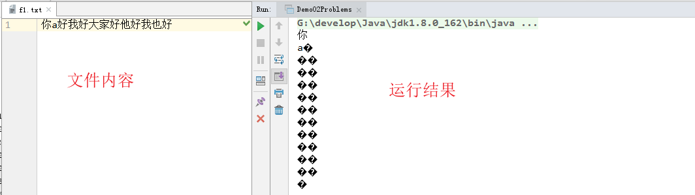
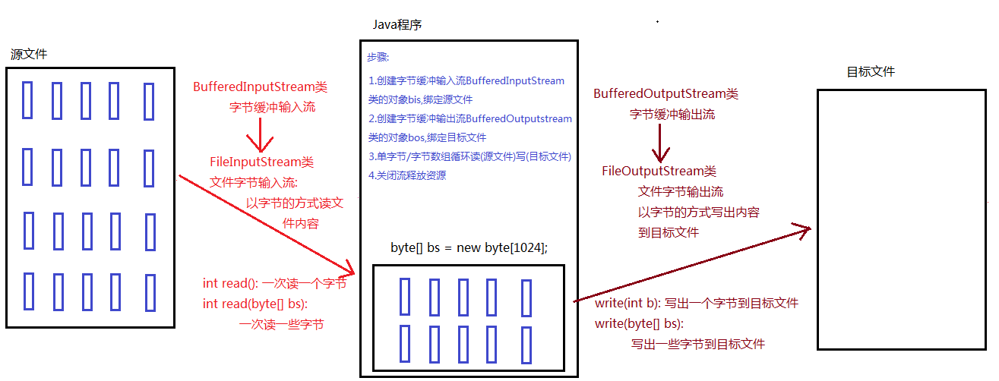
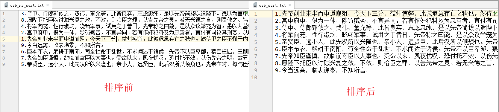
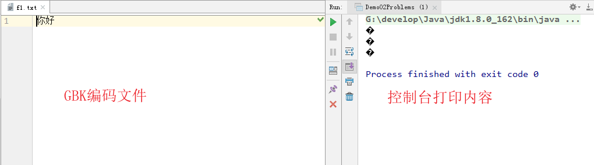
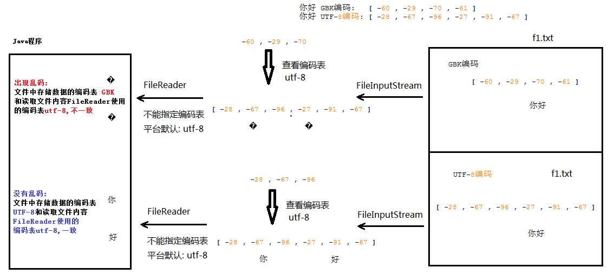
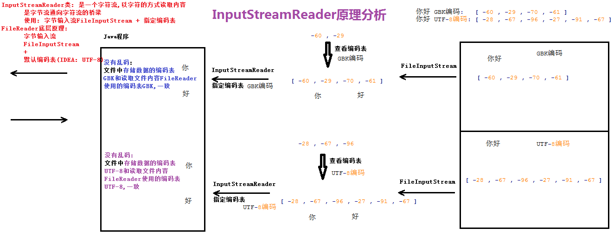
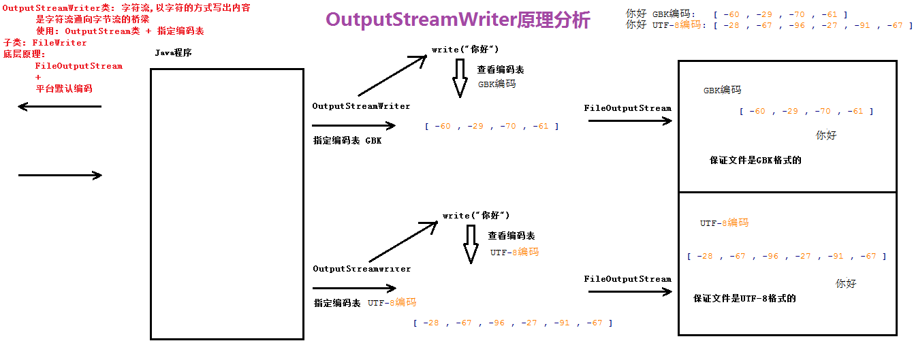
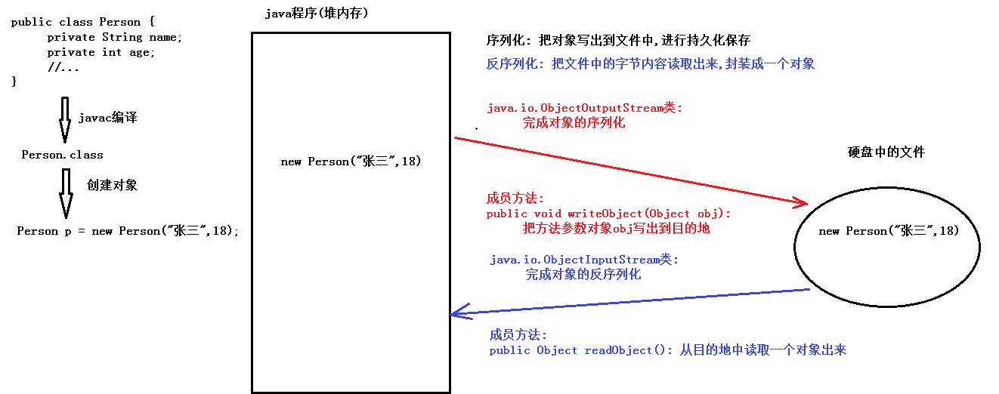
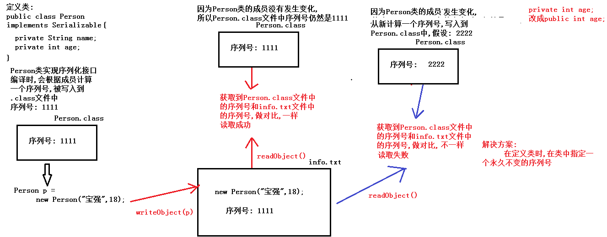

#  day12【IO流】

**今日内容介绍**

```java
字符流
缓冲流
转换流
对象序列化
打印流
commons-io
```

**学习目标**

```java
学习目标: 能够使用FileWirter写数据到文件
学习目标: 能够说出FileWriter中关闭和刷新方法的区别
学习目标: 能够使用FileWriter写数据实现换行和追加写
学习目标: 能够使用FileReader读数据
学习目标: 能够说出常用的编码表
学习目标: 能够使用OutputStreamWriter写数据到文件
学习目标: 能够使用InputStreamReader读取数据
学习目标: 能够使用BufferedWriter写换行
学习目标: 能够使用BufferedReader读取文本行
学习目标: 能够说出打印流的特点
```


## 第一章 编码表和字符集

### 1.1 编码表的介绍

```java
1.编码表:
    存储字符和字节对应关系的一张表格
    ASCII编码表: 'A' --> 65 'a' --> 97 '0' --> 48
    编码: 把字符存储到计算机中  字符 --> 字节
    解码: 从计算机中读取出字符  字节 --> 字符

2.常用编码表
    中文windows操作系统,默认编码表: GBK
    GBK编码: 一个汉字占2个字节
    IDEA默认编码表: UTF-8
    UTF-8编码: 一个汉字占3个字节
```


### 1.2 字符串的编码和解码方法

```java
String的编码和解码?
    问题1:    编码
        如何获取字符串(String)指定编码表对应的字节数组(byte[])呢?
            public byte[] getBytes(): 
				按照默认编码表(IDEA默认编码表: UTF-8),获取调用方法的字符串对应的字节数组
            
            public byte[] getBytes(String charsetName): 
				按照方法参数指定编码表,获取调用方法的字符串对应的字节数组

    问题2:    解码
        如何把字节数组(byte[])按照指定编码表,转换成对应的字符串(String)呢?
        	public String(byte[] bs): 
				按照默认编码表(IDEA默认编码表: UTF-8),把构造方法参数指定的字节数组转换成字符串
        	public String(byte[] bs,String charsetName): 
				按照构造方法参数指定的编码表,把构造方法参数指定的字节数组转换成字符串

	你好 UTF-8编码: [-28, -67, -96, -27, -91, -67]
	你好 GBK编码: [-60, -29, -70, -61]

```

```java
public class Demo01Coding {
    public static void main(String[] args) throws UnsupportedEncodingException {
        String s = "你好";
        //获取UTF-8编码
        byte[] bs = s.getBytes();
        System.out.println("你好 UTF-8编码: "+ Arrays.toString(bs));
        //获取UTF-8编码
        bs = s.getBytes("UTF-8");
        System.out.println("你好 UTF-8编码: "+ Arrays.toString(bs));

        //获取GBK编码
        byte[] bs2 = s.getBytes("GBK");
        System.out.println("你好 GBK编码: "+ Arrays.toString(bs2));

        //按照平台默认编码表(UTF-8)解码
        String s2 = new String(bs);
        System.out.println(s2);

        //按照构造方法参数指定的编码表(GBK)解码
        String s3 = new String(bs2, "GBK");
        System.out.println(s3);
        //编码和解码的规则不统一: 乱码
        String s4 = new String(bs, "GBK");
        System.out.println(s4);
    }
}
```


### 1.3 字节流读取中文问题

```java
/*
    字节流读取中文问题
        无法保证每次读取到的是一个/多个汉字对应的完整的字节的内容

    解决方案:使用字符流
        按照字符为单位进行读取,一个读取一个/多个字符
        保证每次读取到的是一个/多个完整的字符

    你好 UTF-8编码: [-28, -67, -96,-27, -91, -67]
 */
public class Demo02Problems {
    public static void main(String[] args) throws IOException {        
        FileInputStream fis = new FileInputStream("day12_sw\\f1.txt");
        int len = 0;
        byte[] bs = new byte[3];
        while((len = fis.read(bs))!=-1) {
            System.out.println(new String(bs,0,len));
        }
        fis.close();
    }
}
```




## 第二章 字符流

### 2.1 Reader介绍

```java
java.io.Reader类: 字符输入流的顶层抽象父类,以字符的方式读取内容,读进来
	常用方法:
    	public void close(): 关闭流,释放资源
    	public int read(): 读取一个字符,返回对应的int数字(字符对应的int数字)
    	public int read(char[] chs): 读取一些字符,返回对应的int数字(字符的个数)
        	参数:
            	char[] chs: 用来存储读取到的多个字符的内容
        	返回值类型:
            	int: 读取到的字符的个数

		文件都有结束标志,read方法读取时,遇到文件结束标志,返回-1
		如果read方法返回-1,说明文件读取结束了

java.io.Reader类: 抽象类
	常用子类:
    	java.io.FileReader类: 文件字符输入流,以字符的方式读取文件内容,读进来,源文件
    	构造方法:
        	FileReader(File path)
        	FileReader(String path)
            	参数:
                	File/String 类型的文件路径

    	使用步骤:
        	1.创建文件字符输入流FileReader类的对象fr,绑定源文件
        	2.文件字符输入流FileReader类的对象fr调用read方法,以字符的方式读取文件内容
        	3.文件字符输入流FileReader类的对象fr调用close方法,关闭流,释放资源
	补充:
    	String的构造方法
    	public String(char[] chs): 把构造方法参数,按照平台默认编码表,转换成字符串
```

### 2.2 使用Reader读取单个字符

```java
/*
	使用步骤:
    	1.创建文件字符输入流FileReader类的对象fr,绑定源文件
    	2.文件字符输入流FileReader类的对象fr调用read方法,以字符的方式读取文件内容
    	3.文件字符输入流FileReader类的对象fr调用close方法,关闭流,释放资源
*/
public class Demo02Reader {
    public static void main(String[] args) throws IOException {
        //1.创建文件字符输入流FileReader类的对象fr,绑定源文件
        FileReader fr = new FileReader("day12_sw\\f1.txt");

        //2.文件字符输入流FileReader类的对象fr调用read方法,以字符的方式读取文件内容

        //定义int变量,保存每次读取到的一个字符的内容
        int ch = 0;
        //从fr关联的文件中读取一个字符,返回对应的int数字,存储到ch中
        //最后判断ch的值是否等于-1
        while((ch = fr.read())!=-1) {
            System.out.println((char)ch);
        }
        //3.文件字符输入流FileReader类的对象fr调用close方法,关闭流,释放资源
        fr.close();
    }    
}
```

### 2.3 使用Reader读取字符数组

```java
/*
	使用步骤:
    	1.创建文件字符输入流FileReader类的对象fr,绑定源文件
    	2.文件字符输入流FileReader类的对象fr调用read方法,以字符的方式读取文件内容
    	3.文件字符输入流FileReader类的对象fr调用close方法,关闭流,释放资源
*/
public class Demo02Reader {
    public static void main(String[] args) throws IOException {
        //1.创建文件字符输入流FileReader类的对象fr,绑定源文件
        FileReader fr = new FileReader("day12_sw\\f1.txt");

        //2.文件字符输入流FileReader类的对象fr调用read方法,以字符的方式读取文件内容

        //定义int变量,保存每次读取到的字符的个数
        int len = 0;

        //定义字符数组,保存每次读取到的多个字符的内容
        char[] chs = new char[2];

        //从fr关联的文件中读取一些字符,存储到字符数组chs中,
        //返回读取到的字符的数量存储到len中
        //最后判断len的值是否等于-1
        while ((len = fr.read(chs)) != -1) {
            System.out.println(new String(chs,0,len));
        }

        //3.文件字符输入流FileReader类的对象fr调用close方法,关闭流,释放资源
        fr.close();
    }
}

```


### 2.4 Writer介绍

```java
学习目标: 能够使用FileWirter写数据到文件

java.io.Writer类: 字符输出流顶层抽象父类,以字符的方式写出内容,写出去
    常用方法:
        public void close(): 关闭流,释放资源
        public void write(int ch): 写出一个字符
        public void write(char[] chs): 写出一个字符数组
        public void write(char[] chs,int startIndex,int len): 写出一个字符数组的一部分
            参数:
                char[] chs: 字符数组
                int startIndex: 起始索引
                int len: 写出字节的数量
        public void write(String str): 写出一个字符串
        public void write(String str,int startIndex,int len): 写出一个字符串的一部分
            参数:
                String str: 字符串
                int startIndex: 起始索引
                int len: 写出字节的数量

java.io.Writer类: 抽象类
    常用子类:
        java.io.FileWriter类: 文件字符输出流,以字符的方式写出内容到文件中,写出去,目标文件
        构造方法:
            FileWriter(File path)
            FileWriter(String path)
                参数:
                        File/String 类型的文件路径

        使用步骤:
            1.创建文件字符输出流FileWriter类的对象fw,绑定目标文件
            2.文件字符输出流FileWriter类的对象fw调用write方法,以字符的方式写出内容到文件
            3.文件字符输出流FileWriter类的对象fw调用close方法,关闭流,释放资源

```

### 2.5 使用Writer写数据的5个方法

```java
public class Demo02Writer {
    public static void main(String[] args) throws IOException {
        //1.创建文件字符输出流FileWriter类的对象fw,绑定目标文件
        FileWriter fw = new FileWriter("day12_sw\\fw.txt");

        //2.文件字符输出流FileWriter类的对象fw调用write方法,以字符的方式写出内容到文件
        //写出一个字符
        fw.write(65);//文件中显示A
        fw.write('a');//文件中显示a
        fw.write("好");//文件中显示好

        //写出一个字符数组
        char[] chs = {'好','好','学','习','天','天','向','上'};
        fw.write(chs);

        //写出一个字符数组的一部分: 学习天天 重新写一遍
        fw.write(chs,2,4);

        //写出一个字符串
        String s = "今天工作不努力,明天努力找工作";
        fw.write(s);

        //写出一个字符数组的一部分:  工作不努力,明天努力 重新写一遍
        fw.write(s,2,10);
        //3.文件字符输出流FileWriter类的对象fw调用close方法,关闭流,释放资源
        fw.close();
    }
}
```

### 2.6 续写与换行

```java
/*
    续写
        java.io.FileWriter类: 文件字符输出流,以字符的方式写出内容到文件中,写出去,目标文件
        构造方法:
            FileWriter(File path,boolean append)
            FileWriter(String path,boolean append)
                参数:
                        File/String 类型的文件路径
                        boolean append:
                            true: 续写/追加写
                            false: 重新写,覆盖写,不写此参数默认就是false

    换行: 也是一个字符串
        windows: \r\n
        linux/unix: \n

 */
public class Demo03AppendNewLine {
    public static void main(String[] args) throws IOException {
        FileWriter fw = new FileWriter("day12_sw\\fw2.txt",true);
        fw.write("好想有个好工作");
        //写出换行符
        fw.write("\r\n");
        fw.write("之后就想有个男朋友");
        //写出换行符
        fw.write("\r\n");
        fw.write("最后想有个小摩托");
        //写出换行符
        fw.write("\r\n");
        fw.close();
    }
}

```


### 2.7 flush和close的区别

```java
/*
	flush和close的区别
        1.字节流内部没有缓冲区,只要调用write方法,就是写出到目的地,所以不关流,也不会丢失数据

        2.字符流内部有缓冲区,调用write方法,先写到缓冲区,如果缓冲区数据存满了,会自动刷新到目的地,
            如果没有执行关闭流的动作,导致缓冲区可能还有数据,程序停止,数据丢失

        3.flush方法,把缓冲区中的数据,刷新到目的地,执行flush以后,可以继续调用write方法写出数据
        4.close方法内部,会先执行一次flush操作
        5.close方法之后,不能继续调用write方法写出数据

        记住一句话: io流对象,使用完毕,务必关闭流对象
*/
public class Demo04FlushVSClose {
    public static void main(String[] args) throws IOException {
        /*
        //1.字节流内部没有缓冲区,只要调用write方法,就是写出到目的地,所以不关流,也不会丢失数据
        FileOutputStream fos = new FileOutputStream("day12_sw\\fos.txt");
        fos.write("你好".getBytes());
        */
        FileWriter fw = new FileWriter("day12_sw\\fw3.txt");
        for (int i = 0; i < 2; i++) {
            fw.write("你好");
            //刷新
            //fw.flush();
            fw.write("大家好");
        }
        int a = 1;
        //死循环
        while(a == 1) {

        }
        //关闭流,释放资源
        fw.close();
        //fw.write("大家好");//错误了,流已经被关闭
    }
}
```


## 第三章 缓冲流

### 3.1 字节输出缓冲流

```java
/*
    java.io.BufferedOutputStream类: 字节缓冲输出流,以字节的方式写出内容到目的地,写出去
        作用: 内部定义了长度为8192的字节数组,用来提高效率
    BufferedOutputStream类是OutputStream类的子类,OutputStream类的方法,都能用:

        常用方法:
            public void close(): 关闭流,释放资源的
            public void write(int b): 写出一个字节的
            public void write(byte[] bs): 写出一个字节数组
            public void write(byte[] bs,int index,int len): 写出一个字节数组的一部分
                参数:
                    byte[] bs: 字节数组
                    int index: 起始索引
                    int len: 字节个数
    构造方法:
        public  BufferedOutputStream(OutputStream os):
            参数:
                OutputStream os: 字节输出流抽象父类,传递子类FileOutputStream对象

    使用步骤:
        1.创建OutputStream类的子类FileOutputStream的对象fos,绑定目标文件
        2.创建字节缓冲输出流BufferedOutputStream的对象bos,构造方法传递fos
        3.字节缓冲输出流BufferedOutputStream的对象bos调用write方法,写出字节
        4.字节缓冲输出流BufferedOutputStream的对象bos调用close方法,关闭流,释放资源

    注意:
        1.使用缓冲流,千万不要调用flush方法了
        2.不用自己关闭缓冲流所关联的其它流
 */
```

### 3.2 字节输入缓冲流

```java
/*
    BufferedInputStream类   字节输入缓冲流,读取字节的       读进来
	作用： 内部定义了一个长度为8192的字节数组，可以提高效率

	常用方法:
		1.public void close(): 关闭流,释放资源
		2.public int read(): 读取一个字节
			遇到文件结束标志,返回-1,说明读取文件应该结束了

		3.public int read(byte[] bs):
			读取一些字节,把读取到的多个字节的内容,存储到方法参数字节数组bs中
			返回读取到的字节的数量

	构造方法：
		public BufferedInputStream(InputStream is):
			参数： InputStream is 字节输入流抽象类 传递子类FileInputStream对象

	使用步骤：
		1.创建InputStream类的子类FileInputStream对象fis，绑定源文件
		2.创建高效字节输入流BufferedInputStream对象bis,传递InputStream类的子类FileInputStream对象
		3.高效字节输入流BufferedInputStream对象bis调用read方法,读取字节
		4.关闭流

	注意:
		1.对于缓冲流,千万不要自己调用flush方法
		2.只需要关闭缓冲流,自动关闭缓冲流所关联的其它流对象
 */

```


### 3.3 字节缓冲流复制文件原理分析



### 3.4 字节缓冲流复制文件代码实现

```java
/*
    字节缓冲流复制文件

    源文件: day12_sw\\copyfrom\cxyjzc.flv
    目标文件: day12_sw\\copyto\cxyjzc.flv

    步骤:
        1.创建字节缓冲输入流BufferedInputStream类的对象bis,绑定源文件
        2.创建字节缓冲输出流BufferedOutputStream类的对象bos,绑定目标文件
        3.单字节/字节数组循环读(源文件)写(目标文件)
        4.关闭流释放资源

    字节缓冲流复制文件效率对比:
        1.单字节循环复制: 311 毫秒
        2.字节数组循环复制: 23 毫秒
 */
public class Demo04BufferedCopyFile {
    public static void main(String[] args) throws IOException {
        //源文件: copyfrom\cxyjzc.flv
        File srcFile = new File("day12_sw\\copyfrom\\cxyjzc.flv");
        File destFile = new File("day12_sw\\copyto\\cxyjzc.flv");

        //记录开始时间
        long start = System.currentTimeMillis();
        //调用方法
        copy02(srcFile,destFile);
        //记录结束时间
        long end = System.currentTimeMillis();
        //打印总耗时
        System.out.println("总耗时: "+(end-start)+" 毫秒");
    }


    //定义方法,单字节循环复制文件
    public static void copy02(File srcFile,File destFile) throws IOException {
        //1.创建字节缓冲输入流BufferedInputStream类的对象bis,绑定源文件
        BufferedInputStream bis = 
            new BufferedInputStream(new FileInputStream(srcFile));

        //2.创建字节缓冲输出流BufferedOutputStream类的对象bos,绑定目标文件
        BufferedOutputStream bos = 
            new BufferedOutputStream(new FileOutputStream(destFile));

        //3.字节数组循环读(源文件)写(目标文件)

        //定义int变量,保存每次读取到的多个字节的个数
        int len = 0;
        //定义字节数组,保存每次读取到的多个字节的内容
        byte[] bs = new byte[1024];

        //从bis关联的文件中,读取一些字节,保存到字节数组bs中,返回读取到的字节的个数,赋值给变量len
        //最后判断len的值是否等于-1
        while ((len = bis.read(bs)) != -1) {
            //把字节数组bs中从索引0开始后面的len个字节,写出到bos关联的文件中
            bos.write(bs,0,len);
        }

        //4.关闭流释放资源
        bis.close();
        bos.close();
    }

    //定义方法,单字节循环复制文件
    public static void copy01(File srcFile,File destFile) throws IOException {
        //1.创建字节缓冲输入流BufferedInputStream类的对象bis,绑定源文件
        BufferedInputStream bis = 
            new BufferedInputStream(new FileInputStream(srcFile));

        //2.创建字节缓冲输出流BufferedOutputStream类的对象bos,绑定目标文件
        BufferedOutputStream bos = 
            new BufferedOutputStream(new FileOutputStream(destFile));

        //3.单字节循环读(源文件)写(目标文件)

        //定义int变量,保存每次读取到的单个字节的内容
        int b = 0;
        //从bis关联的文件中,读取一个字节,返回该字节对应的int数字,赋值给变量b
        //最后判断b的值是否等于-1
        while ((b = bis.read()) != -1) {
            //把b中的内容写出到bos关联的文件中
            bos.write(b);
        }

        //4.关闭流释放资源
        bis.close();
        bos.close();
    }
}
```

### 3.5 字符输出缓冲流使用

```java
/*
    BufferedWriter类   字符输出缓冲流 写出字符的       写出去
	作用： 内部定义了一个长度为8192的字符数组，可以提高效率

	常用方法：
		public void close(): 关闭流释放资源
		public void write(int ch): 写出一个字符
		public void write(char[] chs): 写出一个字符数组
		public void write(char[] chs,int index,int len): 写出一个字符数组的一部分
			参数:
				char[] chs: 字符数组
				int index: 起始索引
				int len: 写出字符的个数

		public void write(String str): 写出一个字符串

		public void write(String str,int index,int len): 写出一个字符串的一部分
			参数:
				String str: 字符串
				int index: 起始索引
				int len: 写出字符的个数

	构造方法：
		public BufferedWriter(Writer w):
			参数： Writer w 字符输出流抽象类 传递子类FileWriter对象

	使用步骤：
		1.创建Writer类的子类FileWriter对象fw，绑定目标文件
		2.创建高效字符输出流BufferedWriter对象bw,传递Writer类的子类FileWriter对象
		3.高效字符输出流BufferedWriter对象bw调用write方法,写出字符
		4.关闭流

	注意:
		1.对于缓冲流,千万不要自己调用flush方法
		2.只需要关闭缓冲流,自动关闭缓冲流所关联的其它流对象
		3.特有方法:
			public void newLine() : 写入一个自适应平台的换行符
 */
public class Demo01BufferedWriter {
    public static void main(String[] args) throws IOException {
        //1.创建Writer类的子类FileWriter对象fw，绑定目标文件
        FileWriter fw = new FileWriter("day12_xw\\bw.txt");

        //2.创建高效字符输出流BufferedWriter对象bw,传递Writer类的子类FileWriter对象
        BufferedWriter bw = new BufferedWriter(fw);

        //3.高效字符输出流BufferedWriter对象bw调用write方法,写出字符
        bw.write("犯错,就得被惩罚~~");

        //写入使用操作系统的换行符
        bw.newLine();

        bw.write("犯错,不讲理由~~");

        //4.关闭流
        bw.close();
    }
}

```

### 3.6 字符输入缓冲流使用

```java

/*
    BufferedReader类   高效字符输入缓冲流       读取字符的       读进来
	作用： 内部定义了一个长度为8192的字符数组，可以提高效率

	常用方法：
		1.public void close(): 关闭流,释放资源
		2.public int read(): 读取一个字符
			遇到文件结束标志,返回-1,说明读取文件应该结束了

		3.public int read(char[] chs):
			读取一些字符,把读取到的一些字符存入到方法参数字符数组chs中
			返回的是读取的字符的数量
			遇到文件结束标志,返回-1,说明读取文件应该结束了

	构造方法：
		public BufferedReader(Reader r):
			参数： Reader r 字符输入流抽象类 传递子类FileReader对象

	使用步骤：
		1.创建Reader类的子类FileReader对象fr，绑定源文件
		2.创建高效字符输入流BufferedReader对象br,传递Reader类的子类FileReader对象
		3.高效字符输入流BufferedReader对象br调用readLine方法,读取一行字符
		4.关闭流

	注意:
		1.对于缓冲流,千万不要自己调用flush方法
		2.只需要关闭缓冲流,自动关闭缓冲流所关联的其它流对象
		3.特有方法:
			public String readLine() : 读取一行文本
				遇到文件结束标志: 返回null
				读取到一行文本中,不包含换行符
 */
public class Demo02BufferedReader {
    public static void main(String[] args) throws IOException {
        //1.创建Reader类的子类FileReader对象fr，绑定源文件
        FileReader fr = new FileReader("day12_xw\\bw.txt");

        //2.创建高效字符输入流BufferedReader对象br,传递Reader类的子类FileReader对象
        BufferedReader br = new BufferedReader(fr);

        //3.高效字符输入流BufferedReader对象br调用readLine方法,读取一行字符

        //定义String变量,用来接收每次读取到的一行字符串的内容
        String line = null;
        while((line = br.readLine())!=null){
            System.out.print(line);
        }
        //4.关闭流
        br.close();

    }
}

```

### 3.7 文本排序练习

```java
/*
    练习: 把文本文件中的内容,以行为单位,按照每行前面的数字,从小到大排序
    步骤:
        1.创建List集合对象,泛型: String
        2.创建BufferedReader类的对象br,绑定源文件
        3.按行循环读取源文件
        4.把读取到的每行存储到List集合对象中
        5.调用Collections工具类中sort方法,对List集合对象排序(String排序规则: 按照第一个不相同的字母的ASCII码值,从小到大排序)
        6.创建BufferedWriter类的对象bw,绑定目标文件
        7.遍历List集合对象
        8.把获取到的当前行,写出到目标文件
        9.写入换行符
        10.关闭资源
 */
public class Demo03TxtSort {
    public static void main(String[] args) throws IOException {
        //1.创建List集合对象,泛型: String
        List<String> list = new ArrayList<>();

        //2.创建BufferedReader类的对象br,绑定源文件
        BufferedReader br = 
            new BufferedReader(new FileReader("day12_xw\\csb_no_sort.txt"));

        //3.按行循环读取源文件
        String line = null;
        while ((line = br.readLine()) != null) {
            //4.把读取到的每行存储到List集合对象中
            list.add(line);
        }
        //5.调用Collections工具类中sort方法,对List集合对象排序
        //(String排序规则: 按照第一个不相同的字母的ASCII码值,从小到大排序)
        //Collections.sort(list);
        Collections.sort(list, new Comparator<String>() {
            @Override
            public int compare(String o1, String o2) {
                return o1.charAt(0)-o2.charAt(0);
            }
        });

        //6.创建BufferedWriter类的对象bw,绑定目标文件
        BufferedWriter bw = 
            new BufferedWriter(new FileWriter("day12_xw\\csb_sort.txt"));

        //7.遍历List集合对象
        for (String s : list) {
            //8.把获取到的当前行,写出到目标文件
            bw.write(s);
            //9.写入换行符
            bw.newLine();

        }
        //10.关闭资源
        br.close();
        bw.close();
    }
}
```




## 第四章 转换流

### 4.1 字符流乱码问题

```java
/*
    字符流乱码问题
    原因:
        文件中存储数据的编码表 和 读取文件时流对象使用的编码表不统一
    f1.txt文件 gbk编码格式,内容: 你好
    你好 GBK编码: [-60, -29, -70, -61]
    你好 UTF-8编码: [-28, -67, -96, -27, -91, -67]
 */
public class Demo02Problems {
    public static void main(String[] args) throws IOException {
        //采用平台默认编码:UTF-8
        FileReader fr = new FileReader("day12_xw\\f1.txt");
        int ch = 0;
        while ((ch = fr.read()) != -1) {
            System.out.println((char)ch);
        }
        fr.close();
    }
}
```



**乱码原因分析**

### 4.2 InputStreamReader读数据原理




### 4.3 InputStreamReader读数据

```java
/*
    java.io.InputStreamReader类: 是一个字符流,以字符的方式读取内容
	    是字节流通向字符流的桥梁
	    使用: 字节输入流FileInputStream + 指定编码表
        java.io.FileReader底层原理:
            是InputStreamReader类的子类: 字节输入流FileInputStream+默认编码表(IDEA: UTF-8)

    java.io.InputStreamReader类 是 Reader的子类,Reader中的方法,它都有
    构造方法:
        InputStreamReader(InputStream in, String charsetName)
            参数:
                InputStream in: 字节输入流抽象父类,传递子类FileInputStream类的对象
                String charsetName: 编码表,常用GBK和UTF-8
    使用步骤:
        1.创建InputStream类的子类FileInputStream类的对象fis
        2.创建InputStreamReader类的对象isr,传递fis并指定编码表
        3.InputStreamReader类的对象isr调用read方法,读取文件内容
        4.InputStreamReader类的对象isr调用close方法,关闭流释放资源
 */
public class Demo03InputStreamReader {
    public static void main(String[] args) throws Exception {
        readUTF8();
    }
    //读取UTF8文件
    private static void readUTF8() throws IOException {
        //1.创建InputStream类的子类FileInputStream类的对象fis
        //2.创建InputStreamReader类的对象isr,传递fis并指定编码表
        InputStreamReader isr = new InputStreamReader(new FileInputStream("day12_xw\\utf8_1.txt"), "UTF-8");
        //3.InputStreamReader类的对象isr调用read方法,读取文件内容
        int len = 0;
        char[] chs = new char[2];
        while ((len = isr.read(chs)) != -1) {
            System.out.println(new String(chs,0,len));
        }
        //4.InputStreamReader类的对象isr调用close方法,关闭流释放资源
        isr.close();
    }

    //读取GBK文件
    private static void readGBK() throws IOException {
        //1.创建InputStream类的子类FileInputStream类的对象fis
        //FileInputStream fis = new FileInputStream("day12_xw\\gbk1.txt");
        //2.创建InputStreamReader类的对象isr,传递fis并指定编码表
        //InputStreamReader isr = new InputStreamReader(fis, "GBK");
        InputStreamReader isr = new InputStreamReader(new FileInputStream("day12_xw\\gbk1.txt"),"GBK");
        //3.InputStreamReader类的对象isr调用read方法,读取文件内容
        int ch = 0;
        while ((ch = isr.read()) != -1) {
            System.out.println((char)ch);
        }
        //4.InputStreamReader类的对象isr调用close方法,关闭流释放资源
        isr.close();
    }
}
```

### 4.4 OutputStreamWriter写数据原理



### 4.5 OutputStreamWriter写数据

```java
/*
    java.io.OutputStreamWriter类: 是一个字符流,以字符的方式写出内容
	    是字符流通向字节流的桥梁
	    使用: OutputStream类 + 指定编码表
    子类: java.io.FileWriter类 是 OutputStreamWriter类的子类
        底层原理: FileOutputStream+平台默认编码

    java.io.OutputStreamWriter类 是 Writer类的子类,Writer的方法,它都有

    构造方法:
        OutputStreamWriter(OutputStream out, String charsetName)
            参数:
                OutputStream out: 字节输出流抽象父类,传递子类FileOutputStream类的对象
                String charsetName: 编码表,常用GBK和UTF-8

    使用步骤:
        1.创建OutputStream类的子类FileOutputStream类的对象fos
        2.创建OutputStreamWriter类的对象osr,传递fos并指定编码表
        3.创建OutputStreamWriter类的对象osr调用write方法,写出字符到文件
        4.创建OutputStreamWriter类的对象osr调用close方法,关闭流释放资源

 */
public class Demo04OutputStreamWriter {
    public static void main(String[] args) throws IOException {
        writeUTF8();
        return;
    }
    //写出UTF-8内容到文件
    private static void writeUTF8() throws IOException {
        //1.创建OutputStream类的子类FileOutputStream类的对象fos
        //2.创建OutputStreamWriter类的对象osr,传递fos并指定编码表
        OutputStreamWriter osw = new OutputStreamWriter(new FileOutputStream("day12_xw\\utf8_2.txt"),"UTF-8");
        //3.创建OutputStreamWriter类的对象osr调用write方法,写出字符到文件
        osw.write("好好学习天天向上");
        //4.创建OutputStreamWriter类的对象osr调用close方法,关闭流释放资源
        osw.close();
    }

    //写出GBK内容到文件
    private static void writeGBK() throws IOException {
        //1.创建OutputStream类的子类FileOutputStream类的对象fos
        //FileOutputStream fos = new FileOutputStream("day12_xw\\gbk2.txt");
        //2.创建OutputStreamWriter类的对象osr,传递fos并指定编码表
        //OutputStreamWriter osw = new OutputStreamWriter(fos, "GBK");
        OutputStreamWriter osw = new OutputStreamWriter(new FileOutputStream("day12_xw\\gbk2.txt"), "GBK");
        //3.创建OutputStreamWriter类的对象osr调用write方法,写出字符到文件
        osw.write("好好学习天天向上");
        //4.创建OutputStreamWriter类的对象osr调用close方法,关闭流释放资源
        osw.close();
    }
}

```

### 4.6 编码转换练习

```java
/*
    将GBK编码的文本文件，转换为UTF-8编码的文本文件
    步骤:
        1.创建InputStreamReader类的对象,绑定源文件,指定编码表GBK
        2.创建OutputStreamWriter类的对象,绑定目标文件,指定编码表UTF-8
        3.单字符/字符数组循环读(源文件)写(目标文件)
        4.关闭流
    思考:
        能否使用字符缓冲输入输出流,实现此案例呢?
        InputStream --> BufferedReader
        OutputStream --> BufferedWriter
 */
public class Demo05FromGBK2UTF8 {
    public static void main(String[] args) throws Exception {
        //1.创建InputStreamReader类的对象,绑定源文件,指定编码表GBK
        InputStreamReader isr = 
            new InputStreamReader(new FileInputStream("day12_xw\\csb_gbk.txt"), "GBK");
        //2.创建OutputStreamWriter类的对象,绑定目标文件,指定编码表UTF-8
        OutputStreamWriter osw = new OutputStreamWriter(new FileOutputStream("day12_xw\\csb_utf8.txt"), "UTF-8");
        //3.字符数组循环读(源文件)写(目标文件)
        int len = 0;
        char[] chs = new char[1024];
        while ((len = isr.read(chs)) != -1) {
            osw.write(chs,0,len);
        }
        //4.关闭流
        isr.close();
        osw.close();
    }
}
```

### 4.7 编码转换练习扩展

```java
public class Demo06FromGBK2UTF8 {
    public static void main(String[] args) throws Exception {
        //1.创建InputStreamReader类的对象,绑定源文件,指定编码表GBK
        InputStreamReader isr = new InputStreamReader(new FileInputStream("day12_xw\\csb_gbk.txt"), "GBK");
        //把 InputStreamReader --> BufferedReader
        BufferedReader br = new BufferedReader(isr);
        //2.创建OutputStreamWriter类的对象,绑定目标文件,指定编码表UTF-8
        OutputStreamWriter osw = new OutputStreamWriter(new FileOutputStream("day12_xw\\csb_utf8.txt"), "UTF-8");
        //把 OutputStreamWriter --> BufferedWriter
        BufferedWriter bw = new BufferedWriter(osw);
        //3.循环按行读(源文件)写(目标文件)
        String line = null;
        while ((line = br.readLine()) != null) {
            bw.write(line);
            //写出换行
            bw.newLine();
        }
        //4.关闭流
        br.close();
        bw.close();
    }
}
```

## 第五章 序列化

### 5.1 序列化和反序列化介绍

```java
1.序列化: 把对象写出到文件中,进行持久化保存
2.反序列化: 把文件中的字节内容读取出来,封装成一个对象
```





### 5.2 序列化演示

```java
1.序列化: 把对象写出到文件中,进行持久化保存
	java.io.ObjectOutputStream类:完成对象的序列化
	成员方法:
    	public void writeObject(Object obj):把方法参数对象obj写出到目的地
	构造方法:
    	public ObjectOutputStream(OutputStream os):
        	参数:
            	OutputStream os: 字节输出流抽象父类,传递子类FileOutputStream对象

	使用步骤:(先定义类,并创建对象)
    	1.创建OutputStream类的子类FileOutputStream对象fos,绑定目标文件
    	2.创建ObjectOutputStream类对象,传递fos
    	3.ObjectOutputStream类对象调用writeObject方法,把对象写出到目标文件
    	4.ObjectOutputStream类对象调用close方法
 
```


### 5.3 反序列化流演示

```java
           
2.反序列化: 把文件中的字节内容读取出来,封装成一个对象
    java.io.ObjectInputStream类:完成对象的反序列化
    成员方法:
        public Object readObject(): 从目的地中读取一个对象出来

    构造方法:
        public ObjectInputStream(InputStream is):
            参数:
                InputStream is: 字节输入流抽象父类,传递子类FileInputStream对象

    使用步骤:(先定义类,并创建对象)
        1.创建InputStream类的子类FileInputStream对象fis,绑定源文件
        2.创建ObjectInputStream类对象,传递fis
        3.创建ObjectInputStream类对象调用readObject方法,从文件读取字节封装成对象并返回
        4.创建ObjectInputStream类对象调用close方法
```

```java
/*
    类要进行序列化/反序列化
    必须实现: java.io.Serializable接口 (序列化接口)
    该接口中没有定义任何东西: 标记型接口
 */
public class Person implements Serializable {    
    private String name;
    private int age;
    //toString方法,空参/满参构造,set/get方法
}

public class Demo03WriterReadObject {
    public static void main(String[] args) throws Exception {

        //调用方法,写出对象到文件
        //writeObject();
        //调用方法,从文件中读取一个对象出来
        readObject();
    }
    //从文件读取一个对象出来
    private static void readObject() throws IOException, ClassNotFoundException {
        //1.创建InputStream类的子类FileInputStream对象fis,绑定源文件
        FileInputStream fis = new FileInputStream("day12_xw\\info.txt");

        //2.创建ObjectInputStream类对象,传递fis
        ObjectInputStream ois = new ObjectInputStream(fis);

        //3.创建ObjectInputStream类对象调用readObject方法,从文件读取字节封装成对象并返回
        Person p = (Person)ois.readObject();

        System.out.println(p);

        //4.创建ObjectInputStream类对象调用close方法
        ois.close();
    }

    //把对象写出到文件
    private static void writeObject() throws IOException {
        //先定义类,并创建对象
        Person p = new Person("张三", 18);
        //1.创建OutputStream类的子类FileOutputStream对象fos,绑定目标文件
        FileOutputStream fos = new FileOutputStream("day12_xw\\info.txt");

        //2.创建ObjectOutputStream类对象,传递fos
        ObjectOutputStream oos = new ObjectOutputStream(fos);

        //3.ObjectOutputStream类对象调用writeObject方法,把对象写出到目标文件
        oos.writeObject(p);

        //4.ObjectOutputStream类对象调用close方法
        oos.close();
    }
}

```


### 5.4 静态和瞬态都不能序列化

```java
//对5.3中的Person类的成员进行如下修改,然运行5.3中的测试代码看效果
/*
	静态和瞬态都不能序列化
        static关键字修饰的内容: 不能被序列化
        transient关键字修饰的内容: 不能被序列化
*/
public class Person implements Serializable {    
    private String name;
    //private int age;//注意把下面的两行注释分别打开,演示效果
    //private static int age;//static关键字修饰的内容: 不能被序列化
    //transient int age;//transient关键字修饰的内容: 不能被序列化
    
    //toString方法,空参/满参构造,set/get方法
}
```

### 5.5 序列号冲突异常

```java
/*	
	序列号冲突异常
        当类实现序列化接口后,编译时会根据类的成员计算一个long数字(序列号),会被保存到.class文件中
        当进行序列化,把对象写出到文件,同时会把该序列号写出到保存对象的文件中
        在读取对象之前(没有重新写),修改了类的成员,会重新计算一个序列号,保存在.class文件中
        导致: 存储对象的文件中的序列号和.class文件中的序列号不一致,报出异常

    解决方案:
        给类定义一个永恒不变的序列号,查看API文档
        ANY-ACCESS-MODIFIER static final long serialVersionUID = 42L;
        ANY-ACCESS-MODIFIER: 任意修饰符 比如 private,public

    可以抄袭:
        String类中有定义:
            private static final long serialVersionUID = -6849794470754667718L;
*/
//对5.3中的Person类的成员进行如下修改,然运行5.3中的测试代码看效果
public class Person implements Serializable {
    //给类定义一个永恒不变的序列号,查看API文档
    private static final long serialVersionUID = 42336677L;
    private String name;
    //private int age;
    public int age;
    
    //toString方法,空参/满参构造,set/get方法
}
```



## 第六章 打印流

### 学习目标: 能够说出打印流的特点

```java
/*
    后面web课程会使用
    方法:
        public PrintWriter getWriter(): 获取打印流

    java.io.PrintWriter类: 是Writer的子类,Writer的方法,它都有

    构造方法:
        public PrintWriter(OutputStream os):
        public PrintWriter(Writer w):
        public PrintWriter(File path):
        public PrintWriter(String path):

    使用特有方法:
        public void println(Xxx yyy): 原样输出带换行
        public void print(Xxx yyy): 原样输出不带换行

    特点:
        1.带自动刷新
        2.方法不会抛出异常

 */
public class Demo04PrintWriter {
    public static void main(String[] args) throws FileNotFoundException {
        PrintWriter pw = new PrintWriter("day12_xw\\pw.txt");

        pw.println(97);
        pw.println(true);
        pw.println('A');

        pw.write(65);//文件中显示 A

        pw.close();

    }
}

```

## 第七章 Commons IO

```java
/*
    之前自己使用IO,调用read,write,提高效率定义数组,或者用缓冲流  非常麻烦

    第三方jar包
        第一方: java官方(Oracle)
        第二方: 我们自己
        第三方: jar包的提供者

    Commons IO 是 apache 公司的产品 软件基金会 开源 免费

    Commons-IO: 简化IO流的操作的
    Commons-DBUtils: 简化JDBC操作的
    tomcat: web服务器
    hadoop: 大数据

    导入jar包: 必须要会

    两个工具类:
        IOUtils
            public static void copy(InputStream is,OutputStream os): 复制文件的
            public static void closeQuietly(...): 关闭资源,内部帮助我们处理异常

        FileUtils
            public static void copyDirectoryToDirectory(File srcDir,File destDir): 拷贝文件夹
            public static void writeStringToFile(File file,String str): 写字符串到文本文件中。
            public static String readFileToString(File file): 读取文本文件，返回字符串。
 */
public class Demo05CommonsIO {
    public static void main(String[] args) throws IOException {
        IOUtils.copy(
                		new FileInputStream("day12_xw\\copyfrom\\cxyjzc.flv"),
                		new FileOutputStream("day12_xw\\copyto\\cxyjzc.flv")
        		    );

        FileUtils.copyDirectoryToDirectory(
                								new File("day12_xw\\io"),
                								new File("day12_xw\\io2")
        								  );

        FileUtils.writeStringToFile(
                						new File("day12_xw\\commons.txt"),
                						"原来IO流的使用如此之简单"
        						   );

        String str = FileUtils.readFileToString(new File("day12_xw\\commons.txt"));
        System.out.println(str);        
    }
}
```

