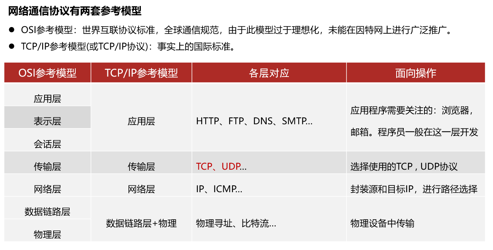
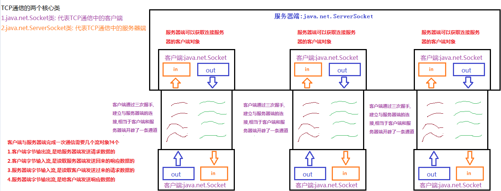
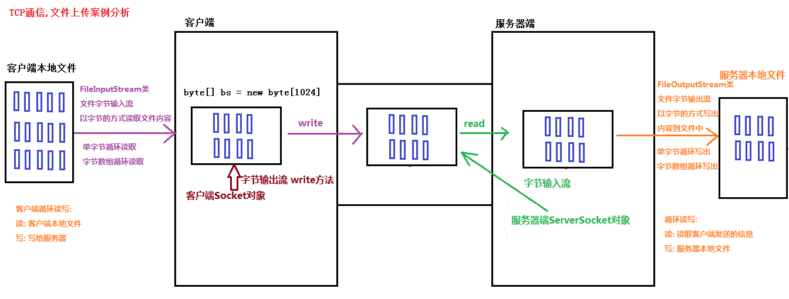

# <centet>网络编程</center>
## 网络编程
### BS和CS结构
```
1.C/S结构：
	全称为Client/Server结构，是指客户端和服务器结构。常见程序有ＱＱ、迅雷等软件。
	
2.B/S结构：
	全称为Browser/Server结构，是指浏览器和服务器结构。常见浏览器有谷歌、火狐等
```
### 网络模型

### 网络通信三要素
```
网络通信三要素
        1.通信协议: 网络中多台计算机之间传输数据必须遵守的规则
            TCP协议: 面向连接的,需要进行3次握手,所以消耗系统资源稍大,效率较低
                因为面向连接的,保证数据的安全,不会丢失数据
            UDP协议: 面向无连接的,不需要进行3次握手,所以消耗系统资源稍小,效率较高
                因为面向无连接的,不保证数据的安全,可能会丢失数据,每个数据包的大小限制在64k以内
        2.IP地址: 给网络中的每台计算机进行一个唯一的数字编号
            IPV4:
                用32位二进制表示,8位一个字节,分成4个字节,每个字节取值范围0-255,可以表示大约42亿个
            IPV6:
                用128位二进制表示,16位一组,分成8组,号称可以为全世界的每一粒沙子编上一个网址
            常用的命令:
                ping 网址/ip地址:   测试网络是否连接
                ipconfig: 查看ip配置信息
                ipconfig -all: 查看物理网卡地址
                127.0.0.1/localhost: 本地主机地址
        3.端口号:
            给计算机中的每个软件,进行唯一的数字编号
            取值范围: 0-65535
            0-1023: 系统保留使用
            >1023: 自己使用
          	浏览器地址书写格式: 通信协议://ip地址:端口号/....
```
##  TCP通信协议
### TCP通信原理
```
TCP通信:
	客户端: java.next.Socket类
	服务器端: java.net.ServerSocket类
	
客户端与服务器端进行一次通信需要几个流对象?
    1.客户端字节输出流: 用来给服务器端发送请求数据的
    2.客户端字节输入流: 用来读取服务器端发送回来的响应数据的
    3.服务器端字节输入流: 用来读取客户端发送过来的请求数据的
    4.服务器端字节输出流: 用来给客户端发送响应数据的
```

### TCP客户端传输程序
```
TCP协议客户端
        java.net.Socket类: 表示TCP的客户端
        常用方法:
            public OutputStream getOutputStream(): 
            	获取客户端的字节输出流对象,用来给服务器端发送请求信息
                返回值类型:
                     java.io.OutputStream类: 抽象类,方法内部必然返回实现类对象

            public InputStream getInputStream():  
            	获取客户端的字节输入流对象,用读取服务器端发送回来的响应信息
                返回值类型:
                    java.io.InputStream类: 抽象类,方法内部必然返回实现类对象
      	构造方法:
            public Socket(String host, int port)
                参数:
                    String host: 客户端要连接的服务器端的ip地址
                    int port: 客户端要连接的服务器端的端口号
                注意:
                    只要创建客户端Socket对象,就会完成与服务器端的三次握手,建立与服务器端的连接
       	使用步骤:
            1.创建客户端Socket对象,指定要连接的服务器的ip地址和端口号
            2.客户端Socket对象调用getOutputStream方法,获取客户端的字节输出流对象
            3.客户端的字节输出流对象调用write方法给服务器写出字节数据(请求)
            4.客户端Socket对象调用getInputStream方法,获取客户端的输入流对象
            5.客户端的字节输入流对象调用read方法,读取服务器端发送回来的字节数据(响应)
            6.关闭资源
```
```java
public class Demo02Client {
    public static void main(String[] args) throws IOException {
        //1.创建客户端Socket对象,指定要连接的服务器的ip地址和端口号
        Socket client = new Socket("127.0.0.1",6666);        
        //2.客户端Socket对象调用getOutputStream方法,获取客户端的字节输出流对象
        OutputStream netOs = client.getOutputStream();
        //3.客户端的字节输出流对象调用write方法给服务器写出字节数据(请求)
        netOs.write("老师在吗?我今天迟到了?.....".getBytes());
        //4.客户端Socket对象调用getInputStream方法,获取客户端的输入流对象
        InputStream netIs = client.getInputStream();
        //5.客户端的字节输入流对象调用read方法,读取服务器端发送回来的字节数据(响应)
        byte[] bs = new byte[1024];
        int len = 0;
        len = netIs.read(bs);
        System.out.println("客户端收到服务器端的响应信息: "+new String(bs,0,len));
        //6.关闭资源
        netIs.close();
        netOs.close();
        client.close();
    }
}
```
### TCP服务端传输程序
```
TCP协议服务端
        java.net.ServerSocket类: TCP通信的服务器端
        常用方法:
            public Socket accept(): 服务器端获取到连接服务器的客户端的Socket对象
                返回值类型:
                    java.net.Socket类: TCP通信的客户端
                    常用方法:
                        public OutputStream getOutputStream(): 
                        	获取服务器端的字节输出流对象,用来给客户端发送响应信息
                        public InputStream getInputStream():  
                        	获取服务器端的字节输入流对象,用读取客户端发送过来的请求信息
        构造方法:
            public ServerSocket(int port)
                参数:
                    int port: 端口号,必须和客户端访问的端口号保持一致
                注意:
                    服务器端不用指定ip地址,在哪台机器上运行,就是用该机器的ip地址
        使用步骤:
            1.创建服务器端ServerSocket对象,指定端口号(必须和客户端访问的端口号保持一致)
            2.服务器端ServerSocket对象调用accept方法,获取到连接服务器的客户端的Socket对象
            3.客户端Socket对象调用getInputStream方法,获取服务器端的字节输入流对象
            4.服务器端的字节输入流对象调用read方法,读取客户端发送过来的字节数据(请求)
            5.客户端Socket对象调用getOutputStream方法,获取服务器端的字节输出流对象
            6.获取服务器端的字节输出流对象调用write方法给客户端写出字节数据(响应)
            7.关闭资源
```
```java
public class Demo03Server {
    public static void main(String[] args) throws IOException {
        //1.创建服务器端ServerSocket对象,指定端口号(必须和客户端访问的端口号保持一致)
        ServerSocket server = new ServerSocket(6666);
        //2.服务器端ServerSocket对象调用accept方法,获取到连接服务器的客户端的Socket对象
        Socket client = server.accept();
        //3.客户端Socket对象调用getInputStream方法,获取服务器端的字节输入流对象
        InputStream netIs = client.getInputStream();
        //4.服务器端的字节输入流对象调用read方法,读取客户端发送过来的字节数据(请求)
        int len = 0;
        byte[] bs = new byte[1024];
        len = netIs.read(bs);
        System.out.println("服务器端接收到客户端的请求信息: "+new String(bs,0,len));
        //5.客户端Socket对象调用getOutputStream方法,获取服务器端的字节输出流对象
        OutputStream netOs = client.getOutputStream();
        //6.获取服务器端的字节输出流对象调用write方法给客户端写出字节数据(响应)
        netOs.write("迟到真不应该,按照之前的承诺,那你来选择: 1.唱歌 2.跳舞...".getBytes());
        //7.关闭资源
        netOs.close();
        netIs.close();
        client.close();
        server.close();
    }
}
```

## 文件上传
### 文件上传原理

### 客户端文件上传
```
文件上传客户端
    实现步骤:
        1.创建客户端Socket对象,指定要连接的服务器的ip地址和端口号
        2.创建文件字节输入流FileInputStream类的对象,绑定客户端源文件
        3.客户端Socket对象调用getOutputStream方法,获取客户端字节输出流对象(给服务器发送请求数据的)
        4.循环读(客户端本地文件)写(服务器端)
        5.客户端Socket对象调用getInputStream方法,获取客户端字节输入流对象(读取服务器发送回来的响应数据的)
        6.客户端字节输入流对象调用read方法,读取服务器发送回来的响应数据
        7.关闭资源

    客户端文件: day12\upload\from\jzc.flv
    服务器端文件: day12\upload\to\jzc.flv

    问题1: 修改客户端代码
        客户端没有读取到服务器端的"文件上传成功" 响应信息

        解决方案:
            客户端发送数据给服务器结束后,
            通知服务器数据发送完毕
            导致服务器端的read方法的结果是-1
            客户端数据发送完毕后,调用方法:
                shutDownOutputStream():
                销毁客户端的字节输出流,相当于给服务器发送-1

    问题2:修改服务器端代码
        同名的文件在服务器端被覆盖

        解决方案:
            在服务器端保存文件时,随机生成不重复的文件名
```
```java
public class Demo02UpLoadClient {
    public static void main(String[] args) throws IOException {
        //1.创建客户端Socket对象,指定要连接的服务器的ip地址和端口号
        Socket client = new Socket("127.0.0.1",7777);
        //2.创建文件字节输入流FileInputStream类的对象,绑定客户端源文件
        InputStream fis = new FileInputStream("day12\\upload\\from\\jzc.flv");
        //3.客户端Socket对象调用getOutputStream方法,
        //获取客户端字节输出流对象(给服务器发送请求数据的)
        OutputStream netOs = client.getOutputStream();
        //4.循环读(客户端本地文件)写(服务器端)
        int len = 0;
        byte[] bs = new byte[1024];
        while ((len = fis.read(bs)) != -1) {
            netOs.write(bs,0,len);
        }
        //客户端数据发送完毕,通知服务器,目的: 让服务器的read方法,返回-1
        client.shutdownOutput();
        //5.客户端Socket对象调用getInputStream方法,
        //获取客户端字节输入流对象(读取服务器发送回来的响应数据的)
        InputStream netIs = client.getInputStream();
        //6.客户端字节输入流对象调用read方法,读取服务器发送回来的响应数据
        len = netIs.read(bs);
        System.out.println("客户端收到服务器端的响应信息: "+new String(bs,0,len));
        //7.关闭资源
        netIs.close();
        netOs.close();
        fis.close();
        client.close();
    }
}
```
### 服务端文件上传
```java
import java.io.FileInputStream;
import java.io.IOException;
import java.io.InputStream;
import java.io.OutputStream;
import java.net.Socket;

/*
    文件上传客户端
    实现步骤:
        1.创建客户端Socket对象,指定要连接的服务器的ip地址和端口号
        2.创建文件字节输入流FileInputStream类的对象,绑定客户端源文件
        3.客户端Socket对象调用getOutputStream方法,获取客户端字节输出流对象(给服务器发送请求数据的)
        4.循环读(客户端本地文件)写(服务器端)
        5.客户端Socket对象调用getInputStream方法,获取客户端字节输入流对象(读取服务器发送回来的响应数据的)
        6.客户端字节输入流对象调用read方法,读取服务器发送回来的响应数据
        7.关闭资源
 */
public class Demo02UploadClient {
    public static void main(String[] args) throws IOException {
        //1.创建客户端Socket对象,指定要连接的服务器的ip地址和端口号
        Socket client = new Socket("127.0.0.1", 8888);
        //2.创建文件字节输入流FileInputStream类的对象,绑定客户端源文件
        FileInputStream fis = new FileInputStream("day14\\upload\\from\\jzc.flv");
        //3.客户端Socket对象调用getOutputStream方法,获取客户端字节输出流对象(给服务器发送请求数据的)
        OutputStream netOs = client.getOutputStream();
        //4.循环读(客户端本地文件)写(服务器端)
        byte[] bs = new byte[1024];
        int len;
        while ((len = fis.read(bs)) != -1) {
            netOs.write(bs, 0, len);
        }
        //通知服务器端,客户端的文件数据已经发送完毕了
        //导致服务器的while循环中的read方法返回-1,服务器程序就会继续向下执行
        client.shutdownOutput();

        //5.客户端Socket对象调用getInputStream方法,获取客户端字节输入流对象(读取服务器发送回来的响应数据的)
        InputStream netIs = client.getInputStream();
        //6.客户端字节输入流对象调用read方法,读取服务器发送回来的响应数据
        len = netIs.read(bs);
        System.out.println("客户端收到服务器发送来的文件上传结果: " + new String(bs, 0, len));
        //7.关闭资源
        netIs.close();
        netOs.close();
        fis.close();
        client.close();
    }
}
```
```
文件上传服务器端
    实现步骤:
        1.创建服务器端ServerSocket对象,指定端口号
        2.服务器端ServerSocket对象调用accept方法,获取连接服务器的客户端Socket对象
        3.连接服务器的客户端Socket对象调用getInputStream方法,获取服务器端的字节输入流对象(读取客户端发送的请求数据的)
        4.创建文件字节输出流FileOutputStream对象,绑定服务器端的目标文件
        5.循环读(客户端)写(服务器端的本地文件)
        6.连接服务器的客户端Socket对象调用getOutputStream方法,获取服务器端的字节输出流对象(给客户端发送的响应数据的)
        7.服务器端的字节输出流对象调用write方法,给客户端发送的响应数据的
        8.关闭资源
    问题:
        服务器端: 只支持上传一次
        修改为: 多客户端上传(单线程版本)
```
```java
public class Demo04UpLoadServer {
    public static void main(String[] args) throws IOException {
        //1.创建服务器端ServerSocket对象,指定端口号
        ServerSocket server = new ServerSocket(7777);
        //死循环
        while(true) {
            //2.服务器端ServerSocket对象调用accept方法,获取连接服务器的客户端Socket对象
            Socket client = server.accept();
            //3.连接服务器的客户端Socket对象调用getInputStream方法,
            //获取服务器端的字节输入流对象(读取客户端发送的请求数据的)
            InputStream netIs = client.getInputStream();
            //UUID.randomUUID().toString();//产生一个永不重复的字符串
            //产生尽可能不重复的文件名
            String fileName = 
                System.currentTimeMillis()+""+new Random().nextInt()+ ".flv";
            //4.创建文件字节输出流FileOutputStream对象,绑定服务器端的目标文件
            OutputStream fos = 
                new FileOutputStream(new File("day12\\upload\\to",fileName));
            //5.循环读(客户端)写(服务器端的本地文件)
            int len = 0;
            byte[] bs = new byte[1024];
            while ((len = netIs.read(bs)) != -1) {
                fos.write(bs,0,len);
            }
            //6.连接服务器的客户端Socket对象调用getOutputStream方法,
            //获取服务器端的字节输出流对象(给客户端发送的响应数据的)
            OutputStream netOs = client.getOutputStream();
            //7.服务器端的字节输出流对象调用write方法,给客户端发送的响应数据的
            netOs.write("文件上传成功!!!!!!!!".getBytes());
            //8.关闭资源
            netOs.close();
            netIs.close();
            fos.close();
            client.close();
            //server.close();//不能关闭服务器
        }
    }
}
```
### 多线程实现文件上传
```
文件上传服务器端
    实现步骤:
        1.创建服务器端ServerSocket对象,指定端口号
        2.服务器端ServerSocket对象调用accept方法,获取连接服务器的客户端Socket对象
        3.连接服务器的客户端Socket对象调用getInputStream方法,获取服务器端的字节输入流对象(读取客户端发送的请求数据的)
        4.创建文件字节输出流FileOutputStream对象,绑定服务器端的目标文件
        5.循环读(客户端)写(服务器端的本地文件)
        6.连接服务器的客户端Socket对象调用getOutputStream方法,获取服务器端的字节输出流对象(给客户端发送的响应数据的)
        7.服务器端的字节输出流对象调用write方法,给客户端发送的响应数据的
        8.关闭资源
    问题:
        服务器端: 只支持上传一次
        修改为: 多客户端上传(多线程版本)        
    解决方案: 服务器端改为多线程版本,来一个客户端开启一个线程
```
### 线程池实现文件上传
```java
/*
    定义Runnable接口的实现类
    需要使用构造方法,传递客户端Socket对象
 */
public class MyUploadFileTask implements Runnable {
    private Socket client;
    public MyUploadFileTask(Socket client) {
        this.client = client;
    }

    @Override
    public void run() {
        try {
            //3.连接服务器的客户端Socket对象调用getInputStream方法,
            //获取服务器端的字节输入流对象(读取客户端发送的请求数据的)
            InputStream netIs = client.getInputStream();
            //UUID.randomUUID().toString();//产生一个永不重复的字符串
            //产生尽可能不重复的文件名
            String fileName = System.currentTimeMillis()
                +new Random().nextInt()+ ".flv";
            //4.创建文件字节输出流FileOutputStream对象,绑定服务器端的目标文件
            OutputStream fos = 
                new FileOutputStream(new File("day12\\upload\\to",fileName));
            //5.循环读(客户端)写(服务器端的本地文件)
            int len = 0;
            byte[] bs = new byte[1024];
            while ((len = netIs.read(bs)) != -1) {
                fos.write(bs,0,len);
            }
            //6.连接服务器的客户端Socket对象调用getOutputStream方法,
            //获取服务器端的字节输出流对象(给客户端发送的响应数据的)
            OutputStream netOs = client.getOutputStream();
            //7.服务器端的字节输出流对象调用write方法,给客户端发送的响应数据的
            netOs.write("文件上传成功!!!!!!!!".getBytes());
            //8.关闭资源: 严格来讲,应该写在finally中
            netOs.close();
            netIs.close();
            fos.close();
            client.close();
        } catch (IOException e) {
            e.printStackTrace();
        }
    }
}
```
```java
/*
    服务器改为多线程版本:使用线程池完成
 */
public class Demo06UpLoadServer {
    public static void main(String[] args) throws IOException {
        //创建线程池对象
        ExecutorService es = Executors.newFixedThreadPool(80);
        //1.创建服务器端ServerSocket对象,指定端口号
        ServerSocket server = new ServerSocket(7777);
        //死循环
        while(true) {
            //2.服务器端ServerSocket对象调用accept方法,获取连接服务器的客户端Socket对象
            Socket client = server.accept();
            //从线程池中获取一个线程对象,执行文件上传任务
            es.submit(new MyUploadFileTask(client));
        }
    }
}
```
### 上传名字相同时文件情况
```java
package com.ithei.p2_upload;

import java.io.*;
import java.net.Socket;

/*
    文件上传客户端
    实现步骤:
        1.创建客户端Socket对象,指定要连接的服务器的ip地址和端口号
        2.创建文件字节输入流FileInputStream类的对象,绑定客户端源文件
        3.客户端Socket对象调用getOutputStream方法,获取客户端字节输出流对象(给服务器发送请求数据的)
        4.循环读(客户端本地文件)写(服务器端)
        5.客户端Socket对象调用getInputStream方法,获取客户端字节输入流对象(读取服务器发送回来的响应数据的)
        6.客户端字节输入流对象调用read方法,读取服务器发送回来的响应数据
        7.关闭资源
 */
public class Demo02UploadClient {
    public static void main(String[] args) throws IOException {
        //1.创建客户端Socket对象,指定要连接的服务器的ip地址和端口号
        Socket client = new Socket("127.0.0.1", 8888);
        //2.创建文件字节输入流FileInputStream类的对象,绑定客户端源文件
        File file = new File("day13\\upload\\from\\jzc.flv");
        FileInputStream fis = new FileInputStream(file);
        //3.客户端Socket对象调用getOutputStream方法,获取客户端字节输出流对象(给服务器发送请求数据的)
        OutputStream netOs = client.getOutputStream();

        //将该文件名先传输到服务端
        netOs.write(file.getName().getBytes());


        //4.循环读(客户端本地文件)写(服务器端)
        byte[] bs = new byte[1024];
        int len;
        try {
            Thread.sleep(1000);
        } catch (InterruptedException e) {
            e.printStackTrace();
        }
        while ((len = fis.read(bs)) != -1) {
            netOs.write(bs, 0, len);
        }
        //通知服务器端,客户端的文件数据已经发送完毕了
        //导致服务器的while循环中的read方法返回-1,服务器程序就会继续向下执行
        client.shutdownOutput();

        //5.客户端Socket对象调用getInputStream方法,获取客户端字节输入流对象(读取服务器发送回来的响应数据的)
        InputStream netIs = client.getInputStream();
        //6.客户端字节输入流对象调用read方法,读取服务器发送回来的响应数据
        len = netIs.read(bs);
        System.out.println("客户端收到服务器发送来的文件上传结果: " + new String(bs, 0, len));
        //7.关闭资源
        netIs.close();
        netOs.close();
        fis.close();
        client.close();
    }
}

```
```java
package com.ithei.p2_upload;

import java.io.*;
import java.net.ServerSocket;
import java.net.Socket;

/*
    文件上传服务器端
    实现步骤:
        1.创建服务器端ServerSocket对象,指定端口号
        2.服务器端ServerSocket对象调用accept方法,获取连接服务器的客户端Socket对象
        3.连接服务器的客户端Socket对象调用getInputStream方法,获取服务器端的字节输入流对象(读取客户端发送的请求数据的)
        4.创建文件字节输出流FileOutputStream对象,绑定服务器端的目标文件
        5.循环读(客户端)写(服务器端的本地文件)
        6.连接服务器的客户端Socket对象调用getOutputStream方法,获取服务器端的字节输出流对象(给客户端发送的响应数据的)
        7.服务器端的字节输出流对象调用write方法,给客户端发送的响应数据的
        8.关闭资源
 */
public class Demo04UploadServer {
    public static void main(String[] args) throws IOException {
        //1.创建服务器端ServerSocket对象,指定端口号
        ServerSocket server = new ServerSocket(8888);
        //2.服务器端ServerSocket对象调用accept方法,获取连接服务器的客户端Socket对象
        Socket client = server.accept();
        //3.连接服务器的客户端Socket对象调用getInputStream方法,获取服务器端的字节输入流对象(读取客户端发送的请求数据的)
        InputStream netIs = client.getInputStream();

        //获取客户端传入的文件名
        byte[] bs = new byte[1024];
        int len = netIs.read(bs);
        String fileName = new String(bs, 0, len);
        File file1 = getFile(0, fileName);
        //4.创建文件字节输出流FileOutputStream对象,绑定服务器端的目标文件
        FileOutputStream fos = new FileOutputStream(file1);
        //5.循环读(客户端)写(服务器端的本地文件)

        while ((len = netIs.read(bs)) != -1) {
            fos.write(bs, 0, len);
        }
        //6.连接服务器的客户端Socket对象调用getOutputStream方法,获取服务器端的字节输出流对象(给客户端发送的响应数据的)
        OutputStream netOs = client.getOutputStream();
        //7.服务器端的字节输出流对象调用write方法,给客户端发送的响应数据的
        netOs.write("文件上传成功!!!!".getBytes());
        //8.关闭资源
        netIs.close();
        netOs.close();
        fos.close();
        client.close();
        server.close();
    }

    private static File getFile(int num, String fileName) {
        //创建父文件目录
        File file = new File("day13\\upload\\to");
        //创建复制文件目的地
        File file1 = new File(file, fileName);
        //获取文件名中 . 前面的名字
        String name = fileName.substring(0, fileName.indexOf("."));
        //使用循环判断该文件是否存在
        while (file1.exists()) {
                num++;
                //获取新的文件名
                fileName = name+"("+ num +")"+ fileName.substring(fileName.indexOf("."));
                file1 = new File(file, fileName);
        }
        return file1;
    }
}

```