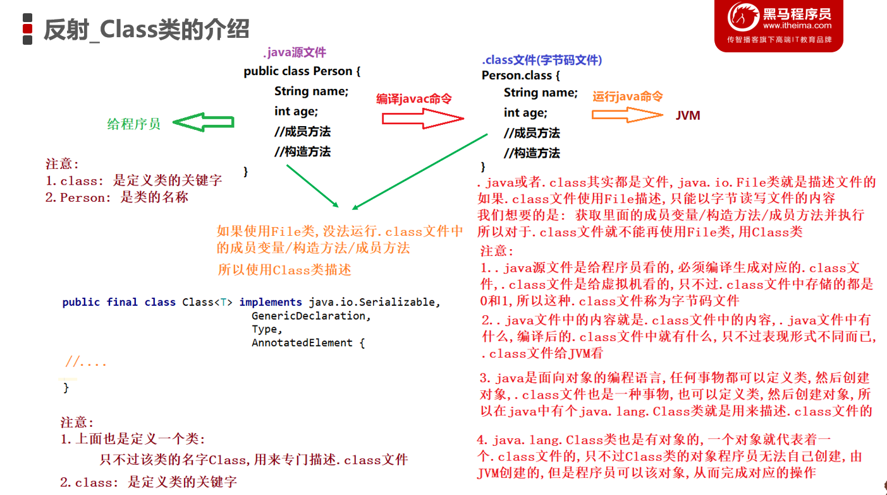
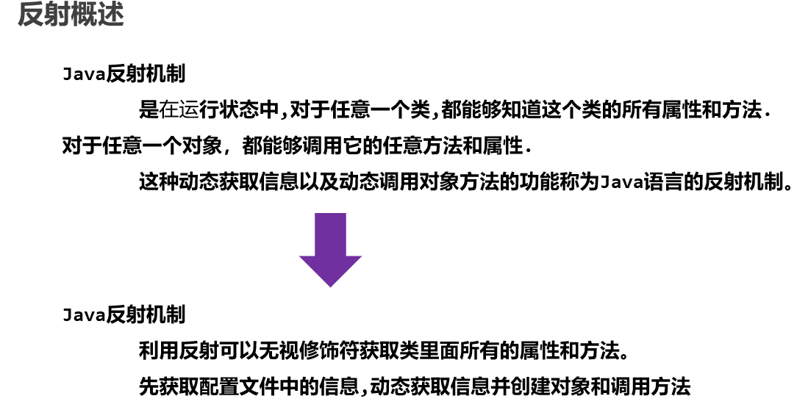
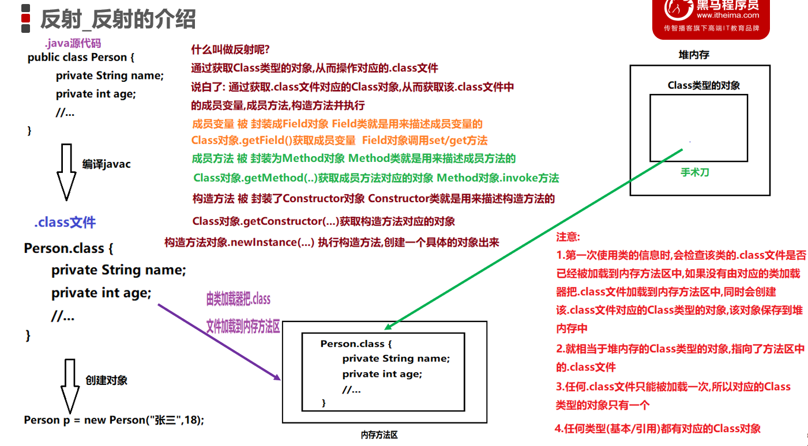
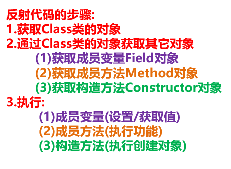
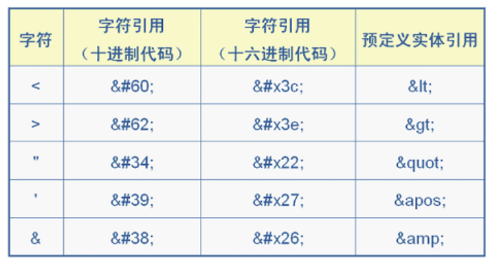

# <center>枚举和反射</center>
[toc]
## Junit单元测试
### 导入Jar包
```
步骤:
	1.模块名称上右键/new/directory/输入名称lib确定	
	2.把junit的jar包复制到文件夹lib中
	3.文件夹lib上右键/Add as Library/在对话框中输入以下内容后/ok
		Name: 输入lib
		Level:输入Module Library
		Add to module: 输入当前模块名
```
### 单元测试基本使用
```java
/*
    哪个方法想使用单元测试,就在方法上,添加注解: @Test
    注意:
        该方法的返回值类型,必须写为void
        该方法必须没有参数列表
        不能是静态方法

     运行:
        方法上右键运行,运行的是含有@Test注解的方法
        类上右键运行,运行的是类当中含有@Test注解的所有方法
        绿条: 正常运行
        红条: 出现问题,异常了
 */
public class Demo01Junit {

    @Test
    public void method() {
        System.out.println("method...");
    }
    @Test
    public void show() {
        System.out.println("show...");
        //System.out.println(1/0);
    }
}

```
### 单元测试常用方法
```java
/*
    常用注解
        - @Test，用于修饰需要执行的测试方法
        - @Before，修饰的方法会在测试方法之前被自动执行
        - @After，修饰的方法会在测试方法执行之后自动被执行
 */
public class Demo02Junit {
    @Test
    public void method() {
        System.out.println("method...");
    }

    @Test
    public void show() {
        System.out.println("show...");
        //System.out.println(1/0);
    }

    public void fun() {
        System.out.println("fun...");
    }

    @Before
    public void myBefore() {
        System.out.println("myBefore...");
    }
    @After
    public void myAfter() {
        System.out.println("myAfter...");
    }
}
```
## 类加载器
### 类的加载时机
```java
//父类
public class Person {
    public static int NUM = 100;
    static {
        System.out.println("Person 静态代码块执行了...");
    }
    public static void method() {
        System.out.println(NUM);
    }
}
```
```java
//子类
public class Student extends Person {
    static {
        System.out.println("Student...代码块执行了....");
    }
}
```
```java
/*
    类(类的.class文件)的加载时机
        1. 创建类的实例。
        2. 类的静态变量，或者为静态变量赋值。
        3. 类的静态方法。
        4. 使用反射方式来强制创建某个类或接口对应的java.lang.Class对象。
        5. 初始化某个类的子类。
        6. 直接使用java.exe命令来运行某个主类。

*/
//测试类
public class Demo02LoadClass {
    public static void main(String[] args) throws ClassNotFoundException {
        //1. 创建类的实例。
        //Person p = new Person();
        //2. 类的静态变量，或者为静态变量赋值。
        //System.out.println(Person.NUM);

        //3. 类的静态方法。
        //Person.method();

        //4. 使用反射方式来强制创建某个类或接口对应的java.lang.Class对象。
        //Class<?> clazz = Class.forName("itheima02.Person");


        //5. 初始化某个类的子类。
        Student stu = new Student();


    }
}

```
### 类的加载器
```
类加载器:
        1.作用:
            负责把.class文件加载到内存的方法区中.
            将class文件（硬盘）加载到内存生成Class对象。
        2.组成:
            (1)BootstrapClassLoader 根类加载器
                也被称为引导类加载器，负责Java核心类的加载
                引导类加载器BootstrapClassLoader：
                    用C++编写的，是JVM自带的类加载器，
                    负责Java平台核心库，用来加载核心类库。该加载器无法直接获取
                比如System,String等。

            (2)ExtClassLoader 扩展类加载器
                负责JRE的扩展目录中jar包的加载
                在JDK中JRE的lib目录下ext目录

            (3)AppClassLoader 系统类加载器/应用类加载器
                Java语言编写的类加载器，负责加载我们定义的类和第三方jar包中的类。

        3.获取类加载器
            java.lang.Class类
            成员方法:
                 public ClassLoader getClassLoader(): 返回该类的类加载器。

            java.lang.ClassLoader类
            成员方法:
                 public ClassLoader getParent(): 返回委托的父类加载器。

         4.类加载器加载机制:
            双亲委派机制: 谁用谁加载
            比如:
                public Person {
                    String s = name;
                    DNSNameService
                    ...
                }

                java Person
                Person类是由AppClassLoader加载
                Person类内部使用String,原则上来讲,应该由AppClassLoader加载
                但是,先找父加载器ExtClassLoader,不负责
                ExtClassLoader找父加载器BootstrapClassLoader,负责

                Person类内部使用DNSNameService,原则上来讲,应该由AppClassLoader加载
                但是,先找父加载器ExtClassLoader,负责
                不管怎样? .class文件只能被加载一次
    注意:
        BootstrapClassLoader 根类/引导类/核心类加载器 String,System
        ExtClassLoader 扩展类加载器 DNSNameService
        AppClassLoader 系统类加载器/应用类加载器
        它们之间不存在继承关系,最终的父类 java.lang.ClassLoader
```
```java
public class Demo03ClassLoader {
    @Test
    public void boot(){
        //String 由BootstrapClassLoader加载,C++实现,不让我们获取
        ClassLoader c = String.class.getClassLoader();
        System.out.println(c);//null
    }

    @Test
    public void ext() {
        //由扩展类加载器加载
        ClassLoader c = DNSNameService.class.getClassLoader();
        System.out.println(c);//sun.misc.Launcher$ExtClassLoader@452b3a41
    }

    @Test
    public void app(){
        //由App类加载器加载
        ClassLoader c = Demo03ClassLoader.class.getClassLoader();
        System.out.println(c);//sun.misc.Launcher$AppClassLoader@18b4aac2
    }

    @Test
    public void app2() {
        //由App类加载器加载
        ClassLoader c = Demo03ClassLoader.class.getClassLoader();
        System.out.println(c);//sun.misc.Launcher$AppClassLoader@18b4aac2
        ClassLoader p = c.getParent();
        System.out.println(p);//sun.misc.Launcher$ExtClassLoader@452b3a41

        ClassLoader pp = p.getParent();
        System.out.println(pp);//null
    }

}
```
## 反射
### Class类的介绍
```
注意:
1.java文件编译生成.class文件,java文件中的内容就是.class文件中的内容,
	只不过.class文件是给JVM看的(称为字节码文件)
2.java是面向对象的编程语言,任何事物都可以定义类,并创建对象,
	.class文件也是一种事物,也可以定义类,创建对象
3.jdk中有个类java.lang.Class,是专门用来描述.class文件的
4.该Class类也是有对象的,但是程序员无法自己创建,由jvm帮助创建,程序员可以获取到该Class类型的对象,
	从而完成相关的操作
```

### 反射的介绍

```
注意:
1.当第一次使用类的信息时,该类的.class文件,会被加载到内存中的方法区中
2.jvm同时为加载到内存方法区的.class文件,创建一个Class类型的对象,该对象被保存在堆内存中
相当于堆内存中的Class类型的对象,指向了方法区的.class文件
3.一个类的.class文件,只能被加载一次,所以对应的Class类型的对象,只有一个
4.任意类型(基本类型/引用类型)都有对应的Class类型的对象
什么叫做反射呢?
    通过获取Class类型的对象,从而操作对应的.class文件
    说白了: 通过Class类型的对象获取.class文件中的成员变量/成员方法/构造方法并执行
```


### javabean类的介绍
```java
/*
    Javabean类/Pojo类(一般放到domain/pojo包)的介绍
        1.所有成员变量必须private修饰
        2.必须提供对应的get和set方法
        3.必须提供空参构造(满参构造是可选的)
 */
public class User {
    private String name;
    private int age;

    @Override
    public String toString() {
        return "User{" +
                "name='" + name + '\'' +
                ", age=" + age +
                '}';
    }

    //私有成员方法
    private char[] my2CharArray(String s) {
        return s.toCharArray();
    }

    public int getSum(int a, int b) {
        return a + b;
    }

    //空参构造
    public User() {
    }

    //满参构造
    public User(String name, int age) {
        this.name = name;
        this.age = age;
    }

    //私有有参构造
    private User(int age) {
        this.age = age;
    }

    //私有有参构造
    private User(String name) {
        this.name = name;
    }

    //get和set方法
    public String getName() {
        return name;
    }

    public void setName(String name) {
        this.name = name;
    }

    public int getAge() {
        return age;
    }

    public void setAge(int age) {
        this.age = age;
    }
}
```
### 获取字节码文件对象三种方式
```
获取Class对象的方式
        方式一:
        java.lang.Object类,成员方法:
            public Class getClass(): 获取Class类型的对象

        方式二:
            任意类型(基本/引用),隐藏的class属性,获取该类对应的Class对象

        方式三:
            java.lang.Class类,静态方法:
            public static Class<?> forName(String className)
                返回与带有给定字符串名的类或接口相关联的 Class 对象。
                参数:
                   String className: 类/接口 的全名称(包名+类/接口名)

       建议使用方式三:
            参数是String,可以写在配置文件中

        Class类的成员方法:
            public String getSimpleName(): 获得简单类名，只是类名，没有包
            public String getName(): 获取完整类名，包含包名+类名
```
```java
public class Demo04GetClass {
    public static void main(String[] args) throws ClassNotFoundException {
        User user = new User();
        //public Class getClass(): 获取Class类型的对象
        Class c1 = user.getClass();
        System.out.println(c1);

        Class<User> c2 = User.class;
        //任意类型,隐藏的class属性
        System.out.println(c2);

        //forName(String className)
        //返回与带有给定字符串名的类或接口相关联的 Class 对象。
        Class c3 = Class.forName("domain.User");
        System.out.println(c3);
        //==: 比较地址值
        System.out.println(c1 == c2);//true
        System.out.println(c1 == c3);//true
        System.out.println(c2 == c3);//true

        Class<Integer> c4 = int.class;
        System.out.println(c4);//int

        //只获取类名,不包含包名
        String simpleName = c1.getSimpleName();
        System.out.println(simpleName);//User

        //获取,包名+类名
        String name = c1.getName();
        System.out.println(name);//domain.User
    }
}
```
### 反射获取构造方法
```
 反射获取空参构造方法并运行
    步骤:
        1.获取Class类型的对象(推荐使用: Class.forName)
        2.Class对象调用getConstructor方法,获取空参构造方法对象
        3.执行空参构造方法对象,从而创建一个具体的对象
            java.lang.reflect.Constructor<T>类,成员方法:
                public Object newInstance(Object... params):
                    根据方法参数传递的具体数据,调用指定的构造方法,从而创建一个具体的对象
                    参数:
                        Object... params: 可变参数
                            传递数组,参数列表,不传参都可以
                    作用:
                        创建对象时,成员变量需要具体的数据
        举例(空参构造):
            不使用反射
                User user = new User();

            使用反射:
                获取到了空参构造方法对象
                Constructor con = ...;//空参构造方法被封装到了Constructor对象con中
                //newInstance方法内部会把Constructor对象con中封装的空参构造执行一次,
                //从而创建一个具体的对象出来
                Object obj = con.newInstance();

        举例(满参构造):------此处很重要,帮助大家理解------
            不使用反射
                User user = new User("zhangsan",18);

            使用反射:
                获取到了满参构造方法对象
                Constructor con = ...;//满参构造方法被封装到了Constructor对象con中
                //newInstance方法内部会把Constructor对象con中封装的满参构造执行一次,
                //并且newInstance方法会把自己接收到的参数,交给Constructor对象con中封装的满参构造
                //从而创建一个带数据的具体的对象出来
                Object obj = con.newInstance("zhangsan",18);

        反射获取私有构造方法并运行       暴力反射
            步骤:
                1.获取Class类型的对象(推荐使用: Class.forName)
                2.Class对象调用getDeclaredConstructor方法,获取指定参数私有构造方法对象
                3.指定参数私有构造方法对象调用setAccessible方法,取消 Java 语言访问检查
                4.指定参数私有构造方法对象调用newInstance方法,创建一个具体的对象
                5.打印对象
            注意:
                java.lang.reflect.AccessibleObject类,成员方法:
                public void setAccessible(boolean flag):
                    将此对象的 accessible 标志设置为指示的布尔值。
                    参数:
                        boolean flag
                        true: 取消 Java 语言访问检查        private 失效
                        false: 实施 Java 语言访问检查       private 有效

                AccessibleObject类,子类:
                    Constructor,Field,Method类,都可以调用setAccessible方法
                    从而进行暴力反射

        反射创建对象的快捷方式
            步骤:
                1.获取Class类型的对象(推荐: Class.forName(...))
                2.Class对象调用newInstance方法,创建一个具体的对象
                    java.lang.Class类,成员方法:
                    public T newInstance()
                        创建此 Class 对象所表示的类的一个新实例。
                        底层原理:
                            (1)获取空参构造方法对象
                            (2)空参构造方法对象调用newInstance方法

                3.打印对象
```
```java
public class Demo05GetConstructor {
    public static void main(String[] args) throws ClassNotFoundException, NoSuchMethodException {
        //获取class类型的对象(推荐使用：class.forName)
        Class<?> clazz = Class.forName("com.itheima.pojo.User");

        //获取public修饰的所有构造方法对象
        Constructor<?>[] cs = clazz.getConstructors();
        for (Constructor<?> c : cs) {
            System.out.println(c);
        }
        System.out.println("=======================");

        //获取所有构造方法对象(包含private修饰的)
        Constructor<?>[] cs2 = clazz.getDeclaredConstructors();
        for (Constructor<?> c : cs2) {
            System.out.println(c);
        }
        System.out.println("=======================");

        //获取public修饰的空参构造方法对象
        Constructor<?> cs3 = clazz.getConstructor();
        System.out.println(cs3);
        System.out.println("=======================");

        //获取public修饰的第一个参数是String类型,第二个参数是int类型的构造方法对象
        Constructor<?> cs4 = clazz.getConstructor(String.class, int.class);
        System.out.println(cs4);
        System.out.println("=======================");

        //获取private修饰的参数是int类型的构造方法对象
        //错误：int类型的构造方法对象是private(私有)修饰的，getConstructor方法只能获取public(公共)修饰的
        //解决方法：使用getDeclaredConstructor这个方法
        //Constructor<?> cs5 = clazz.getConstructor(int.class);
        Constructor<?> cs5 = clazz.getDeclaredConstructor(int.class);
        System.out.println(cs5);

    }
}
```
### 反射获取空参满参构造方法并运行
```
反射获取空参构造方法并运行
    步骤:
        1.获取Class类型的对象(推荐使用: Class.forName)
        2.Class对象调用getConstructor方法,获取空参构造方法对象
        3.执行空参构造方法对象,从而创建一个具体的对象
            java.lang.reflect.Constructor<T>类,成员方法:
                public Object newInstance(Object... params):
                    根据方法参数传递的具体数据,调用指定的构造方法,从而创建一个具体的对象
                    参数:
                        Object... params: 可变参数
                            传递数组,参数列表,不传参都可以
                    作用:
                        创建对象时,成员变量需要具体的数据
        举例(空参构造):
            不使用反射
                User user = new User();

            使用反射:
                获取到了空参构造方法对象
                Constructor con = ...;//空参构造方法被封装到了Constructor对象con中
                //newInstance方法内部会把Constructor对象con中封装的空参构造执行一次,
                //从而创建一个具体的对象出来
                Object obj = con.newInstance();

        举例(满参构造):------此处很重要,帮助大家理解------
            不使用反射
                User user = new User("zhangsan",18);

            使用反射:
                获取到了满参构造方法对象
                Constructor con = ...;//满参构造方法被封装到了Constructor对象con中
                //newInstance方法内部会把Constructor对象con中封装的满参构造执行一次,
                //并且newInstance方法会把自己接收到的参数,交给Constructor对象con中封装的满参构造
                //从而创建一个带数据的具体的对象出来
                Object obj = con.newInstance("zhangsan",18);
```
```java
public class Demo06NewInstance {
    public static void main(String[] args) throws Exception {
        //反射获取public修饰空参构造方法并运行
        //获取class类型的对象(推荐使用：class.forName)
        Class<?> clazz = Class.forName("com.itheima.pojo.User");
        //2.Class对象调用getConstructor方法,获取空参构造方法对象
        Constructor<?> con = clazz.getConstructor();
        //3.执行空参构造方法对象,从而创建一个具体的对象
        User user = (User) con.newInstance();
        System.out.println(user);
        System.out.println("================");

        //反射获取public修饰满参构造方法并运行
        //2.Class对象调用getConstructor方法,获取满参(第一个参数String,第二个参数int)构造方法对象
        Constructor<?> con2 = clazz.getConstructor(String.class, int.class);
        //3.执行满参构造方法对象,从而创建一个具体的对象
        User user2 = (User) con2.newInstance("张三", 18);
        System.out.println(user2);
        System.out.println("================");

        //反射获取private修饰有参构造方法并运行
        //2.Class对象调用getDeclaredConstructor方法,获取有参(参数int)构造方法对象
        Constructor<?> con3 = clazz.getDeclaredConstructor(int.class);
        /*
        当没有这句话时会发生IllegalAccessException(非法访问)异常
        解决思路：查看这个Constructor API中是否有解决方法，没有则找父类
        解决方法：使用setAccessible()方法
        */
        //3.取消Java语言的访问检查(因为目前的构造方法是private修饰,外部无法直接访问)
        /* //获取当前的accessible 标志的值
        boolean as = con3.isAccessible();
        System.out.println(as);//false */
        con3.setAccessible(true);

        //4.执行有参构造方法对象,从而创建一个具体的对象
        User user3 = (User) con3.newInstance(28);
        System.out.println(user3);
        System.out.println("==================");

        //快捷方式创建对象(调用空参构造)
        //Class类的成员方法newInstance()可以创建对象,
        //内部先获取空参构造方法Constructor对象,然后再执行空参构造方法Constructor对象内部的空参构造创建一个对象出来
        User user4 = (User) clazz.newInstance();
        System.out.println(user4);

        //获取成员变量的方法
        Field name1 = clazz.getDeclaredField("name");
        name1.setAccessible(true);
        Object o = name1.get(user2);
        System.out.println("1、"+ o);
    }
}
```
### 反射获取成员方法
```
    反射获取成员方法
    步骤:
        1.获取Class类型的对象(推荐使用: Class.forName)
        2.java.lang.Class类,成员方法: 作用获取成员方法对象的
            public  Method[] getMethods()
                获取所有的public修饰的成员方法，包括父类中。
                每个成员方法被封装成为一个Method对象,存储到数组中,并返回
             public Method getMethod(String methodName, Class... params)
	            根据方法名和参数类型获得一个方法对象，只能是获取public修饰的
	            参数:
	                String methodName: 方法的名字
                    Class... params: 方法参数类型对应的Class对象
                        可变参数: 传递数组,参数列表,不传参
            Method getDeclaredMethod(String name, Class... params)
                根据方法名和参数类型获得一个方法对象，可以获取private修饰的
        3.练习:
        	获取任意修饰符的所有成员方法
            获取public修饰符的所有成员方法
            获取public修饰的名称为toString的没有参数的方法
            获取public修饰的名称为setName的参数为String类型的方法
            获取public修饰的名称为getSum的参数为两个int类型的方法
            获取public修饰的名称为my2CharArray的参数为String类型的方法
```
```java
public class Demo05GetMethod {
    public static void main(String[] args) throws Exception{
        //1.获取Class类型的对象(推荐使用: Class.forName)
        Class<?> clazz = Class.forName("com.itheima.pojo.User");
        //获取任意修饰符的所有成员方法
        Method[] ms = clazz.getDeclaredMethods();
        for (Method m : ms) {
            System.out.println(m);
        }
        System.out.println("=============================");
        //获取public修饰符的所有成员方法
        Method[] ms2 = clazz.getMethods();
        for (Method m : ms2) {
            System.out.println(m);
        }
        System.out.println("=========================");
        //获取public修饰的名称为toString的没有参数的方法
        Method m1 = clazz.getMethod("toString");
        System.out.println(m1);
        System.out.println("====================");
    }
}
```
### 反射调用get_set方法
```
    反射调用get_set方法
    步骤:
        1.获取Class类型的对象(推荐使用: Class.forName)
        2.Class类型的对象调用newInstance方法,创建具体的对象
        3.Class类型的对象调用getMethod方法,获取get和set方法对应的Method对象
        4.get和set方法对应的Method对象调用invoke方法,执行对应的功能
            java.lang.reflect.Method类,成员方法:
            public Object invoke(Object obj, Object... args)
                对带有指定参数的指定对象调用由此 Method 对象表示的底层方法。
                参数:
                    Object obj: 成员方法的调用必须由对象支持
                    Object... args: 执行成员方法时,需要的具体的参数

                返回值类型:
                    java.lang.Object类型: 成员方法执行后的返回值类型(被提升为Object类型)
                    如果方法的返回值类型是void: 返回null
        不使用反射:

            User user = new User();

            user.setName("张三");

        使用反射:
            已经获取到了setName方法对应的Method对象
            已经把setName方法封装到Method对象setNameMethod中
            Method setNameMethod = clazz.getMethod(...);
            User user = new User();//通过反射创建也可以
            //invoke方法内部使用invoke方法接收到的参数User对象user
            //调用它内部封装的成员方法setName,同时调用该成员方法setName的时候传递参数"张三"
            setNameMethod.invoke(user,"张三");*/
```
```java
public class Demo06Invoke {
    public static void main(String[] args) throws Exception{
        //1.获取Class类型的对象(推荐使用: Class.forName)
        Class<?> clazz = Class.forName("com.itheima.pojo.User");
        //2.获取public修饰的set方法对应的Method对象
        Method setNameMethod = clazz.getMethod("setName", String.class);
        Method setAgeMethod = clazz.getMethod("setAge", int.class);
        System.out.println(setNameMethod);
        System.out.println(setAgeMethod);
        System.out.println("======================");
        //3.快捷方式创建User类的对象
        User user  = (User) clazz.newInstance();
        System.out.println(user); //User{name='null', age=0}
        //4.执行set方法,完成对象成员变量的赋值
        Object value = setNameMethod.invoke(user, "张三");
        System.out.println(user);//User{name='张三', age=0}
        System.out.println(value);//null
        value = setAgeMethod.invoke(user, 18);
        System.out.println(value);//null

        //5.获取public修饰的get方法对应的Method对象
        Method getNameMethod = clazz.getMethod("getName");
        Method getAgeMethod = clazz.getMethod("getAge");
        System.out.println(getNameMethod);
        System.out.println(getAgeMethod);

        //6.执行get方法,获取对象成员变量的值
        Object name = getNameMethod.invoke(user);
        Object age = getAgeMethod.invoke(user);
        System.out.println(name);//张三
        System.out.println(age);//18

        System.out.println(user);//User{name='张三', age=18}

    }
}
```
### 反射获取私有方法并运行
```
 反射获取私有方法并运行
    步骤:
        1.获取Class类型的对象(推荐使用: Class.forName)
        2.Class类型的对象调用newInstance方法,创建具体的对象
        3.Class类型的对象调用getDeclaredMethod方法,获取private修饰的方法对应的Method对象
        4.private修饰的方法对应的Method对象调用setAccessible方法,取消 Java 语言访问检查
        5.private修饰的方法对应的Method对象调用调用invoke方法,执行对应的功能
    注意:
        java.lang.reflect.AccessibleObject类,成员方法:
        public void setAccessible(boolean flag):
            将此对象的 accessible 标志设置为指示的布尔值。
            参数:
                boolean flag
                true: 取消 Java 语言访问检查        private 失效
                false: 实施 Java 语言访问检查       private 有效
        AccessibleObject类,子类:
            Constructor,Field,Method类,都可以调用setAccessible方法
            从而进行暴力反射
```
```java
public class Demo07Invoke {
    public static void main(String[] args) throws  Exception{
        //1.获取Class类型的对象(推荐使用: Class.forName)
        Class<?> clazz = Class.forName("com.itheima.pojo.User");
        //2.Class类型的对象调用newInstance方法,创建具体的对象
        User user  = (User) clazz.newInstance();
        //3.Class类型的对象调用getDeclaredMethod方法,获取private修饰的方法对应的Method对象
        Method my2CharArrayMethod = clazz.getDeclaredMethod("my2CharArray", String.class);
        //4.取消Java语言的访问检查
        my2CharArrayMethod.setAccessible(true);
        //5.private修饰的方法对应的Method对象调用调用invoke方法,执行对应的功能
        char[] chs = (char[]) my2CharArrayMethod.invoke(user, "Hello");
        for (char ch : chs) {
            System.out.println(ch);
        }
    }
}
```
### 反射案例分析
```
反射案例
        需求：
            写一个"框架"，不能改变该类的任何代码的前提下，可以帮我们创建任意类的对象，并且执行其中任意方法
        步骤:
            1.定义配置文件config.properties,以属性名=属性值
                className=itheima02.Dog
                methodName=eat
                注意:
                    配置文件config.properties必须写在src根路径下
            2.需要把配置文件信息,加载到Properties集合对象中
            3.获取类的全名称和方法名称
            4.获取类的Class类型的对象
            5.根据Class类型的对象获取要执行的方法对应的Method对象
            6.Class类型的对象创建一个具体的对象出来
            7.Method对象调用invoke方法,执行具体的功能
```

### 反射案例代码实现
```java
public class Demo06ReflectTest {
    public static void main(String[] args) throws Exception {
        //2.需要把配置文件信息,加载到Properties集合对象中
        //创建Properties集合对象
        Properties props = new Properties();
        //创建字节输入流对象，绑定源文件
        FileInputStream is = new FileInputStream("day14\\src\\config.properties");
        props.load(is);
        System.out.println(props);
        //3.获取类的全名称和方法名称
        String className = props.getProperty("className");//类的全名称
        System.out.println(className);
        String methodName = props.getProperty("methodName");//方法名
        //4.获取类的Class类型的对象
        Class<?> clazz = Class.forName(className);
        //5.根据Class类型的对象获取要执行的方法对应的Method对象
        Method method = clazz.getMethod(methodName);
        //6.Class类型的对象创建一个具体的对象出来
        Object obj = clazz.newInstance();
        //7.Method对象调用invoke方法,执行具体的功能
        method.invoke(obj);
    }
}
```
### 反射案例代码实现优化
    方案一(常用):
```
反射案例优化
        java.lang.Class类,成员方法:
            public ClassLoader getClassLoader(): 返回该类的类加载器。
            java.lang.ClassLoader类,成员方法:
                public InputStream getResourceAsStream(String name): 返回读取指定资源的输入流。
                    指定资源: 类路径(该方法直接到类路径下扫描配置文件)
                    如果配置文件写在src根下:
                        String name: 只需要写文件名.扩展名 config.properties

                    如果配置文件写在src/itheima02下:
                        String name: itheima02/config.properties
```
```java
public class Demo07ReflectTest {
    public static void main(String[] args) throws Exception {
        //2.需要把配置文件信息,加载到Properties集合对象中
        //创建Properties集合对象
        Properties props = new Properties();
        //获取类的加载器
        ClassLoader classLoader = Demo07ReflectTest.class.getClassLoader();
        //通过类加载器获取配置文件对应的字节输入流对象
        //getResourceAsStream(String name)返回读取指定资源的输入流
        InputStream is = classLoader.getResourceAsStream("config.properties");
        props.load(is);
        System.out.println(props);
        //3.获取类的全名称和方法名称
        String className = props.getProperty("className");//类的全名称
        System.out.println(className);
        String methodName = props.getProperty("methodName");//方法名
        //4.获取类的Class类型的对象
        Class<?> clazz = Class.forName(className);
        //5.根据Class类型的对象获取要执行的方法对应的Method对象
        Method method = clazz.getMethod(methodName);
        //6.Class类型的对象创建一个具体的对象出来
        Object obj = clazz.newInstance();
        //7.Method对象调用invoke方法,执行具体的功能
        method.invoke(obj);
    }
}
```
    方案二
```
java.util.ResourceBundle类: 获取资源的类
        注意: 该类是抽象类,不能直接创建对象,可以创建子类对象
        发现:
            该类中提供了静态方法,用于获取该抽象类的子类对象
            public static final ResourceBundle getBundle(String baseName):
            	获取抽象类ResourceBundle的子类对象
            参数:
                String baseName: 如果配置文件写在src根下,此处只需要写文件名(不需要写扩展名)

        ResourceBundle类的成员方法:
            public final String getString(String key):
            	根据String类型的属性名,获取String类型属性值(根据键找值)
```
```java
public class Demo08ReflectTest {
    public static void main(String[] args) throws Exception {
        //获取ResourceBundle类的对象rb,绑定配置文件
        ResourceBundle rb = ResourceBundle.getBundle("config");
        //3.获取类的全名称和方法名称
        String className = rb.getString("className");//类的全名称
        System.out.println(className);
        String methodName =  rb.getString("methodName");//方法名
        //4.获取类的Class类型的对象
        Class<?> clazz = Class.forName(className);
        //5.根据Class类型的对象获取要执行的方法对应的Method对象
        Method method = clazz.getMethod(methodName);
        //6.Class类型的对象创建一个具体的对象出来
        Object obj = clazz.newInstance();
        //7.Method对象调用invoke方法,执行具体的功能
        method.invoke(obj);
    }
}
```
## 注解
### 注解的介绍
```
1.概念:
	注解（Annotation）: 也叫元数据。一种代码级别的说明。
	它是JDK1.5及以后版本引入的一个特性，与类、接口、枚举是在同一个层次。
	它可以声明在包、类、字段、方法、局部变量、方法参数等的前面，用来对这些元素进行说明，注释。
	
2.作用分类:
	(1)编写文档：通过代码里标识的注解生成文档【例如，生成文档doc文档】
	(2)代码分析：通过代码里标识的注解对代码进行分析【例如，注解的反射】
	(3)编译检查：通过代码里标识的注解让编译器能够实现基本的编译检查【例如，Override】

3.常见注解
	(1)@author：用来标识作者名
	(2)@version：用于标识对象的版本号，适用范围：文件、类、方法。
	(3)@Override：
		用来修饰方法声明，告诉编译器该方法是重写父类中的方法，如果父类不存在该方法，则编译失败。
    (4)@FunctionalInterface: 检测是否是函数式接口的
```
### 自定义注解
```
自定义注解
        格式:
            public @interface 注解名 {
                属性集
            }

        1.空注解: 没有任何属性 	看MyAnno01
        2.有属性集的注解:       看MyAnno02
            属性的定义格式一:
                数据类型 属性名(); 没有默认值的属性
            属性的定义格式二:
                 数据类型 属性名() default 默认值; 有默认值的属性

        3.注解属性可以选择的数据类型:
            8种基本类型,String类型,枚举类型,注解类型,Class类型
            以及以上任意类型对应的一维数组
```
```java
//空注解
public @interface MyAnno01 {
}
//定义有属性集的注解
public @interface MyAnno02 {
    String name();//String 类型的属性 name,没有默认值
    int age() default 18;//int 类型的属性 age,默认值 18
    String[] hobbies();//String 类型的数组 hobbies
    MyAnno01 myAnno01();//注解类型
}
```
### 自定义注解基本使用
```
自定义注解的使用
        空注解使用格式: 直接使用
            @注解名称            
        有属性集注解使用格式:
            @注解名称(属性名1=属性值1,属性名2=属性值2,属性名3={元素1,元素2...})
        注意事项:
            1.空注解可以直接使用
            2.一个注解只能在一个位置上使用一次,一个位置上可以使用多个不同的注解
            3.如果注解有属性,那么必须给属性赋值才能使用  
            	键值对的方式赋值 属性名=属性值 多个属性,隔开
              	如果属性是数组类型 并且只有一个属性值 那么{}可以省略 如果多个属性值 {}不能省略
            4.如果属性没有默认值 必须赋值 如果有默认值 可以不赋值
```
```java
@MyAnno01
//@MyAnno01 //同一位置不能使用第二次
@MyAnno02(name="张三",age=28,hobbies={"看球","撸代码"},myAnno01=@MyAnno01)
public class Demo04UseAnnotation {
    @MyAnno01
    @MyAnno02(name="李四",hobbies = "看球",myAnno01 = @MyAnno01)
    public static void main(String[] args) {

    }
}
```
### 自定义注解使用的注意事项
```
 注意事项
        ----重点----  MyAnno03,MyAnno04,MyAnno05
        - 当注解中只有一个属性且名称是value，
            在使用注解时给value属性赋值可以直接给属性值，
            无论value是单值元素还是数组类型。

        - 如果属性有默认值，则使用注解的时候，这个属性可以不用赋值。
        - 如果属性没有默认值，那么在使用注解时一定要给属性赋值。
```
```java
@MyAnno03("张三")
@MyAnno04 //有默认值的属性,不管属性名是什么,都可以省略
@MyAnno05({"打乒乓球","撸代码"})
public class Demo05AnnotationNotice {
    @MyAnno04("李四")
    public static void main(String[] args) {

    }
}
public @interface MyAnno03 {
    String value();
}
public @interface MyAnno04 {
    String value() default "李四";
}
public @interface MyAnno05 {
    String[] value();
}
```
### 元注解@Target介绍
```
元注解:
        1.作用:
            用来限制自定义注解的生命周期(只存在于源代码中,存在于class文件中,存在于运行时期的内存中)
            用来限制自定义注解的使用范围(只能写在类上,只能写方法上,既能写在类上又能写在方法上等等)

        2.限制自定义注解的使用范围(在什么位置可以使用)
            元注解(限制自定义注解的注解)之@Target,源代码:
            public @interface Target {
                ElementType[] value();
            }

            java.lang.annotation.ElementType 枚举 可以理解为类,里面都是静态内容,直接用类名/枚举名调用

             TYPE： 用在类,接口上
             FIELD：用在成员变量上
             METHOD： 用在方法上
             PARAMETER：用在参数上
             CONSTRUCTOR：用在构造方法上
             LOCAL_VARIABLE：用在局部变量上
```
```java
@MyAnno06
public class Demo05YuanAnnotation {
    //@MyAnno06 //错误了,该注解只能写在类/方法上
    private String name;
    @MyAnno06
    public static void main(String[] args) {

    }
}
/*
    限制注解的使用范围: 指定写在类上/方法上
    使用元注解: Target
 */
@Target({ElementType.TYPE,ElementType.METHOD})
public @interface MyAnno06 {
}
```
### 元注解@Retention介绍
```
元注解:
        1.作用:
            用来限制自定义注解的生命周期(只存在于源代码中,存在于class文件中,存在于运行时期的内存中)
            用来限制自定义注解的使用范围(只能写在类上,只能写方法上,既能写在类上又能写在方法上等等)

        2.限制自定义注解的生命周期(存在到什么时候,源代码中,生成的.class文件中,还是运行.class文件的时)
            元注解(限制自定义注解的注解)之@Retention
            public @interface Retention {
                RetentionPolicy value();
            }

            该注解是单属性的,属性名value,使用时,可以不写属性名

            java.lang.annotation.RetentionPolicy 
            	枚举 可以理解为类,里面都是静态内容,直接用类名/枚举名调用
                SOURCE：
                	注解只存在于Java源代码中，编译生成的字节码文件中就不存在了。
                CLASS：
                	注解存在于Java源代码、编译以后的字节码文件中，运行的时候内存中没有，默认值。
                RUNTIME：
                	注解存在于Java源代码中、编译以后的字节码文件中、运行时内存中，
                		程序可以通过反射获取该注解。

```
```java
@MyAnno07
//@MyAnno08//只能用在方法上/成员变量上
public class Demo06YuanAnnotation {
    //@MyAnno07 //错误了,该注解只能写在类/方法上
    @MyAnno08
    private String name;
    @MyAnno07
    @MyAnno08
    public static void main(String[] args) {

    }
}
/*
    定义注解:
        只能用在方法上/类上
        保留在class文件中,运行时期内存中没有
 */
@Target({ElementType.TYPE,ElementType.METHOD})
@Retention(RetentionPolicy.CLASS)
public @interface MyAnno07 {
}

/*
    定义注解:
        只能用在方法上/成员变量上
        保留在源文件中,class文件中没有
 */
@Target({ElementType.METHOD,ElementType.FIELD})
@Retention(RetentionPolicy.SOURCE)
public @interface MyAnno08 {

}
```
### 注解解析获取类上的注解
```
注解解析
        注解本质上就是一个接口，该接口默认继承Annotation接口
        java.lang.annotation.Annotation接口：
        	所有注解类型的公共接口，类似所有类的父类是Object。
            前面用过的元注解 @Target @Retention 就是该接口的实现类对象
            
    需求说明

        1. 定义注解Books，要求如下：
           - 包含属性：String value()   书名
           - 包含属性：double price()  价格，默认值为 100
           - 包含属性：String[] authors() 多位作者
           - 限制注解使用的位置：类和成员方法上
           - 指定注解的有效范围：RUNTIME

        2. 定义BookStore类，在类和成员方法上使用Book注解

        3. 定义Demo06AnnotationTest测试类获取Book注解上的数据


    获取类上定义的注解
        java.lang.Class类,成员方法
            public <A extends Annotation> A getAnnotation(Class<A> annotationClass)
                如果该元素的指定注解类型的注解存在于此对象(Class对象)上，则返回这个注解，否则返回 null
                获得当前对象上指定的注解对象。

            public boolean isAnnotationPresent(Class annotationClass):
                判断当前对象(Class对象)是否有指定的注解，有则返回true，否则返回false。


    步骤:
        1.获取类的Class类型的对象
        2.Class类型的对象调用方法,判断是否具有Books注解
        3.如果有,Class类型的对象调用方法获取Books注解对象
        4.打印Books注解对象的属性值
```
```java
/*
    定义注解Books，要求如下：
       - 包含属性：String value()   书名
       - 包含属性：double price()  价格，默认值为 100
       - 包含属性：String[] authors() 多位作者
       - 限制注解使用的位置：类和成员方法上
       - 指定注解的有效范围：RUNTIME
 */
//限制注解使用的位置：类和成员方法上
@Target({ElementType.TYPE,ElementType.METHOD})
//指定注解的有效范围：RUNTIME
@Retention(RetentionPolicy.RUNTIME)
public @interface Books {
    String value();//书名
    double price() default 100;//价格，默认值为 100
    String[] authors();//多位作者
}
```
```java
@Books(value = "面向对象",price = 180,authors = {"响哥","刚哥"})
public class BookStore {
    @Books(value = "jdk8新特性",authors = "响哥")
    public void show() {

    }
}
```
```java
//获取类上注解信息的测试类
public class Demo06AnnotationTest {
    @Test
    public void getParseClassAnnotation() throws Exception {
        //1.获取类的Class类型的对象
        Class<?> clazz = Class.forName("itheima06.BookStore");

        //2.Class类型的对象调用方法,判断是否具有Books注解
        if(clazz.isAnnotationPresent(Books.class)) {
            //3.如果有,Class类型的对象调用方法获取Books注解对象
            Books booksAnno = clazz.getAnnotation(Books.class);

            //4.打印Books注解对象的属性值
            String bookName = booksAnno.value();
            double price = booksAnno.price();
            String[] authors = booksAnno.authors();
            System.out.println(bookName+"::"+price+"::"+ Arrays.toString(authors));
        }
    }
}

```
### 注解解析获取到方法上的注解
```
注解解析
        注解本质上就是一个接口，该接口默认继承Annotation接口
        java.lang.annotation.Anontation接口：所有注解类型的公共接口，类似所有类的父类是Object。
            前面用过的元注解 @Target @Rentention 就是该接口的实现类对象


    需求说明

        1. 定义注解Books，要求如下：
           - 包含属性：String value()   书名
           - 包含属性：double price()  价格，默认值为 100
           - 包含属性：String[] authors() 多位作者
           - 限制注解使用的位置：类和成员方法上
           - 指定注解的有效范围：RUNTIME

        2. 定义BookStore类，在类和成员方法上使用Book注解

        3. 定义Demo06AnnotationTest测试类获取Book注解上的数据


    获取类上定义的注解
        java.lang.reflect.Method类,成员方法
            public <A extends Annotation> A getAnnotation(Class<A> annotationClass)
                如果该元素的指定注解类型的注解存在于此对象(Class对象)上，则返回这个注解，否则返回 null
                获得当前对象上指定的注解对象。

            public boolean isAnnotationPresent(Class annotationClass):
                判断当前对象(Class对象)是否有指定的注解，有则返回true，否则返回false。


    步骤:
        1.获取类的Class类型的对象
        2.Class类型的对象调用方法,获取方法对象
        2.方法对象调用方法,判断是否具有Books注解
        3.如果有,方法对象调用方法获取Books注解对象
        4.打印Books注解对象的属性值


        总结:
            java.lang.reflect.AnnotatedElement接口: 规定操作注解的方法
                public abstract boolean isAnnotationPresent(Class clazz):
                    判断是否含有指定参数类型的注解,有返回true,没有返回false
                public abstract <T extends Annotation> T getAnnotation(Class clazz):
                    获取指定参数类型的注解对象,没有获取到的,返回null
                    参数:
                        Class clazz: 注解的Class对象
            常用实现类:
                Class,Method,Constructor,Field  类 都实现了以上方法
                
            总结:
                1.获取类上的注解: 使用Class对象直接获取
                2.获取方法上的注解: 使用Method对象直接获取
                3.获取构造方法上的注解: 使用Constructor对象直接获取
                4.获取成员变量上的注解: 使用Field对象直接获取
                
                注意:
                    Method对象/Constructor对象/Field对象 都被必须由Class对象获取
```
```java
public class Demo07AnnotationTest {
    @Test
    public void parseMethodAnnotation() throws Exception {
        //1.获取类的Class类型的对象
        Class<?> clazz = Class.forName("itheima06.BookStore");

        //2.Class类型的对象调用方法,获取方法对象
        Method showMethod = clazz.getMethod("show");

        //2.方法对象调用方法,判断是否具有Books注解
        if(showMethod.isAnnotationPresent(Books.class)) {
            //3.如果有,方法对象调用方法获取Books注解对象
            Books booksAnno = showMethod.getAnnotation(Books.class);

            //4.打印Books注解对象的属性值
            String bookName = booksAnno.value();
            double price = booksAnno.price();
            String[] authors = booksAnno.authors();
            System.out.println(bookName+"::"+price+"::"+ Arrays.toString(authors));

        }
    }
}
```
### 注解综合案例模拟单元测试@Mytest注解
```
案例分析
        1. 模拟Junit测试的注解@Test，
            首先需要编写自定义注解@MyTest，
            并添加元注解，保证自定义注解只能修饰方法，且在运行时可以获得。

        2. 然后编写目标类（测试类），
            然后给目标方法（测试方法）使用 @MyTest注解，编写三个方法，其中两个加上@MyTest注解。

        3. 最后编写调用类，使用main方法调用目标类，模拟Junit的运行，只要有@MyTest注释的方法都会运行。

        步骤:
            1.获取Class类型的对象
            2.Class类型的对象获取所有的方法对象,方法对象数组
            3.遍历方法对象数组
            4.判断,当前方法对象上是否具有MyTest注解
            5.如有具有MyTest注解,通过反射执行该方法
```
```java
import java.lang.annotation.ElementType;
import java.lang.annotation.Retention;
import java.lang.annotation.RetentionPolicy;
import java.lang.annotation.Target;

/*
    首先需要编写自定义注解@MyTest，
    并添加元注解，保证自定义注解只能修饰方法，且在运行时可以获得。
 */
//保证自定义注解只能修饰方法
@Target(ElementType.METHOD)
@Retention(RetentionPolicy.RUNTIME)
public @interface MyTest {
}
```
```java
import java.lang.reflect.Method;

/*
    案例分析
        1. 模拟Junit测试的注解@Test，
            首先需要编写自定义注解@MyTest，
            并添加元注解，保证自定义注解只能修饰方法，且在运行时可以获得。

        2. 然后编写目标类（测试类），
            然后给目标方法（测试方法）使用 @MyTest注解，编写三个方法，其中两个加上@MyTest注解。

        3. 最后编写调用类，使用main方法调用目标类，模拟Junit的运行，只要有@MyTest注释的方法都会运行。

        步骤:
            1.获取Class类型的对象
            2.Class类型的对象获取所有的方法对象,方法对象数组
            3.遍历方法对象数组
            4.判断,当前方法对象上是否具有MyTest注解
            5.如有具有MyTest注解,通过反射执行该方法
 */
public class Demo11JunitTest {
    @MyTest
    public void method() {
        System.out.println("method...");
    }

    @MyTest
    public void show() {
        System.out.println("show...");
    }

    @MyTest
    public void fun() {
        //int a = 1/0;
        System.out.println("fun...");
    }

    public static void main(String[] args) throws Exception {
        //获取class类型的对象
        Class<Demo11JunitTest> clazz = Demo11JunitTest.class;
        //2、快捷方式创建对象
        Object obj = clazz.newInstance();
        //3、获取所有的public修饰的成员方法对象数组
        Method[] methods = clazz.getMethods();
        //4、遍历成员方法对象数据
        for (Method m : methods) {
            //判断当前方法上是否含有MyTest注解
            if (m.isAnnotationPresent(MyTest.class)){
                //6、当前方法上有MyTest注解，执行当前方法
                m.invoke(obj);
            }
        }

    }
}
```
## xml解析
### xml概述
```
什么是XML?
    1.XML：可扩展标记语言（EXtensible Markup Language）
    2.XML 它是一种标记语言，很类似 HTML，HTML文件也是XML文档，标签都是自定义的。 如：<user>
    3.W3C在1998年2月发布1.0版本，2004年2月又发布1.1版本，单因为1.1版本不能向下兼容1.0版本，
    	所以1.1没有人用。同时，在2004年2月W3C又发布了1.0版本的第三版。我们要介绍的还是1.0版本。
    	
XML与HTML的主要差异?
    1.xml标签都是自定义的，html标签是预定义。
    2.xml的语法严格，html语法松散。
    3.xml是存储数据的，html是展示数据。    	
```
### xml的组成
#### 文档声明
```
文档声明
    1.XML文档声明格式：<?xml version="1.0" encoding="UTF-8"?>
    2.格式说明:
		(1)文档声明必须为<?xml开头，以?>结束；
		(2)文档声明必须从文档的0行0列位置开始；
	3.文档声明只有2个属性：
        (1)versioin：指定XML文档版本。必须属性，因为我们不会选择1.1，只会选择1.0；
		(2)encoding：指定当前文档的编码。可选属性，默认值是utf-8；
```
#### 标签
```
元素(标签) element
    1.举例: <bean></bean>
    2.普通元素的结构开始标签、元素体、结束标签组成。例如：<hello>大家好</hello>
	2.元素体：元素体可以是元素，也可以是文本，例如：<b><a>你好</a></b>
	3.空元素：空元素只有开始标签，而没有结束标签，但元素必须自己闭合，例如：<c/>
	4.元素命名：
        (1)区分大小写
		(2)不能使用空格，不能使用冒号:
		(3)不建议以XML、xml、Xml开头
    5.格式化良好的XML文档，必须只有一个根元素
```
    xml文件标签案例：
```xml
<?xml version="1.0" encoding="UTF-8" ?>
<!--
    xml的注释
    xml文档声明:
        <?xml version="1.0" encoding="UTF-8" ?>: 必须写在第一行第一列
            version="1.0": 版本号
            encoding="UTF-8": 编码表
-->
<!--
    xml的组成: 标签
        标签: 元素 Element
        语法: <标签名> </标签名>    开始结束标签
        语法: <标签名/>  自闭和标签

    注意:
        1.标签名: 符合命名规范  尽量不要写 xml,Xml,xmL
        2.xml文件中: 必须写一个根标签,其它标签都写在根标签内部
        3.标签内部:
            (1)子标签
            (2)文本
        4.标签命名:
            (1) 区分大小写
            (2) 不能使用空格，不能使用冒号:
            (3) 不建议以XML、xml、Xml开头
-->
<a>
    文本
    <b>子标签文本</b>
    <c/>
    <d></d>
    <name></name>
</a>
```
### 属性
```
属性 attribute
    1.举例: <bean id="" className="">
    2.属性是元素的一部分，它必须出现在元素的开始标签中
	3. 属性的定义格式：属性名=属性值，其中属性值必须使用单引或双引
	4.一个元素可以有0~N个属性，但一个元素中不能出现同名属性
	5.属性名不能使用空格、冒号等特殊字符，且必须以字母开头
```
    xml文件标签属性练习
```xml
<?xml version="1.0" encoding="UTF-8" ?>
<!--
    xml的组成: 属性 Attribute
       1.属性属于标签的一部分
       2.属性只能写在开始标签中
       3.格式:
            属性名="属性值"
            属性值,可以使用""或者'' 建议使用""

        4.属性可以写多个,之间用空格隔开,没有顺序上的要求
        5.同一个标签中,属性名不能重复
        6.属性名不能使用空格、冒号等特殊字符，且必须以字母开头
-->
<person name="张三" id="p001" age="18">
</person >
```
### 注释
```
XML的注释，以“<!--”开始，以“-->”结束。注释内容会被XML解析器忽略！
```
### 转义字符
```
因为很多符号已经被XML文档结构所使用，所以在元素体或属性值中想使用这些符号就必须使用转义字符。
例如：“<”、“>”、“’”、“””、“&”。
```

## xml约束
### 介绍
    在XML技术里，可以编写一个文档来约束一个XML文档的书写规范，这称之为XML约束。
    常见的xml约束：DTD、Schema
### DTD约束
    DTD（Document Type Definition），文档类型定义，用来约束XML文档。规定XML文档中元素的名称，子元素的名称及顺序，元素的属性等。
    开发中，我们很少自己编写DTD约束文档，通常情况我们都是通过框架提供的DTD约束文档，编写对应的XML文档。常见框架使用DTD约束有：SpringMVC、MyBatis等。
