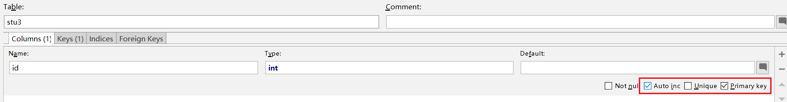
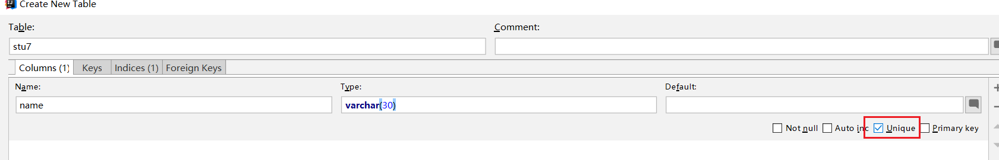
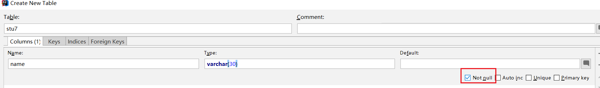
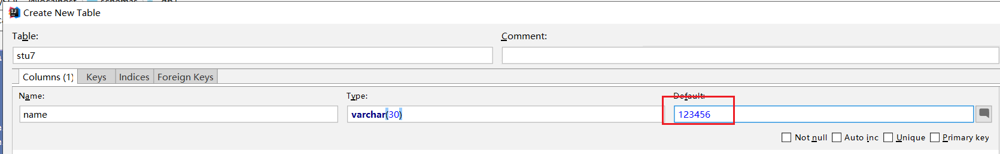

# MySQL语句实现增删改查数据 
[toc]
## 常见数据类型

| 大分类| 类型|描述|
| :---: | :---: | :---: |
| 数字类型 | int| 整型 |
| | float | 单精度浮点数类型 |
| | double | 双精度浮点数类型 |
| 字符类型 | varchar| 可变长度字符串类型，它的长度可以由我们自己指定，默认长度365, 最大值是65535，使用效率低,节省磁盘存储空间 |
| | char | 固定长度字符串类型，如果没有指定长度，默认长度是255，查询效率高, 浪费磁盘存储空间 |
| 日期类型 | date | 日期，格式：yyyy-MM-dd |
| | datetime | 日期时间，格式：yyyy-MM-dd HH:mm:ss，占用8字节的存储空间|
## 插入数据

> 需求：在student表中添加如下数据
>
> id   name   birthday
>
> 1    工藤   1990-01-01
>
> 5    小兰   1990-01-01
>
> 6    小五郎

### 基本方式
~~~sql
-- 语法
	insert into 表名(字段1,字段2,.....字段n) values(值1,值2,.....值n)

-- 实例
	insert into student(id,name,birthday) values(1,'工藤','1990-01-01');
	insert into student(id,name,birthday) values(5,'小兰','1990-01-01');
	insert into student(id,name) values(6,'小五郎');
	insert into student(id,name,birthday) values(6,'小五郎',null);

-- 注意    
	1. 插入数据的时候，列名和值要一一对应(包括数量 顺序 类型)    
	2. 插入数据的时候，数值之外的类型需要使用引号引起来，推荐使用单引号    
	3. 所有列的值都可以传入字符串类型的值，MySQL底层有隐式转换机制    
	4. 当一列中不需要传入值的时候，可以使用null代替值
~~~

### 批量插入

~~~sql
-- 语法
	insert into 表名(字段1,字段2,.....字段n) values(值1,值2,.....值n),(值1,值2,.....值n),(值1,值2,.....值n);

-- 实例
	insert into student(id,name,birthday) values(1,'工藤','1990-01-01'),(5,'小兰','1990-01-01'),(6,'小五郎',null);
~~~

### 省略列名

~~~sql
-- 语法
	insert into 表名 values(值1,值2,.....值n)

-- 实例 
	insert into student values(1,'工藤','1990-01-01');
	insert into student values(6,'小五郎'); -- Column count doesn't match value count at row 1  在保存数据的时候, 值和列数量上不匹配

-- 注意	
	1. 值的数量一定要保证跟列的数量一致，如果值中没有对应的列，使用null补齐
~~~

## 修改数据

> 需求：修改工藤的name为柯南,birthday为2000-01-01

~~~sql
-- 语法
	update 表名 set 字段1=值1,字段2=值2 [where 条件字段=值]

-- 实例
	update student set name='柯南',birthday='2000-01-01' where name = '工藤';
	update student set name='工藤' where id = 1;

-- 注意	
	1. 修改语句中如果不加条件，则将所有数据都会被修改！
	2. set中没有处理字段是不会被修改的
~~~

## 删除数据

> 需求：删除name为柯南的记录

~~~sql
-- 语法
	delete from 表名 [where 条件字段=值]

-- 实例
	delete from student where name = '柯南';

-- 注意
	1. 删除语句中如果不加条件，则将所有数据都会被删除！	
~~~

## 查询数据
### 简单查询
~~~sql
-- 案例驱动，准备数据
-- 创建表
create table student1(
	id int, -- 学生编号
	name varchar(20), -- 学生姓名
	chinese double, -- 语文成绩
	english double, -- 英语成绩
	math double -- 数学成绩
);
-- 插入记录
insert into student1(id,name,chinese,english,math) values(1,'tom',89,78,90);
insert into student1(id,name,chinese,english,math) values(2,'jack',67,98,56);
insert into student1(id,name,chinese,english,math) values(3,'jerry',87,78,77);
insert into student1(id,name,chinese,english,math) values(4,'lucy',88,NULL,90);
insert into student1(id,name,chinese,english,math) values(5,'james',82,84,77);
insert into student1(id,name,chinese,english,math) values(6,'jack',55,85,45);
insert into student1(id,name,chinese,english,math) values(7,'tom',89,65,30);
~~~

### 查询所有列

> 需求：查询表中所有学生的信息

~~~sql
-- 语法 
	select * from 表名

-- 实例
	select * from student1;
~~~

### 查询部分列

> 需求：查询表中所有学生的姓名和对应的语文成绩

~~~sql
-- 语法 
	select 列1名,列1名,...列2名 from 表名

-- 实例
	select name,chinese from student1;
~~~

### 去重

> 需求：查询表中学生姓名（同名的就显示一次）

~~~sql
-- 语法 
	select distinct 列名 from student1;

-- 实例
	select distinct name from student1;
~~~

### 四则运算

> 需求：在所有学生数学分数上加10分特长分

~~~sql
-- 语法 
	select 列(四则) from student1;
		可以在查询结果上进行 加减乘除 
-- 实例
	select name,math,math+10 from student1;
~~~

### 空值处理

> 需求：统计每个学生的总分

~~~sql
-- 语法 
	1. null跟其它值进行四则运算,得到结果都是null
	2. ifnull(列,默认值)  当指定的列的值为null的时候,使用后面的默认值进行替换

-- 实例
	select name,chinese+math+english from student1;
	select name,chinese+math+ifnull(english,0) from student1;
~~~
## 条件查询

> where条件的作用就是用于条表中筛选数据
```sql
-- 语法
    select * from 表名 where 条件
-- 实例
    select * from student1 where id = 2;  
```
## 小结
~~~sql
-- 增加
insert into 表名 values(值1,值2...)

-- 修改
update 表名 set 列1=值1,列2=值2 where 条件

-- 删除
delete from 表名 where 条件

-- 查询 (*代表全部内容)
select */[指定内容] from 表名

-- 条件查询
select */[指定内容] from 表名 where 条件
~~~
## 运算符的运用
~~~sql
-- 准备数据
-- 创建表
CREATE TABLE student2(
id int, -- 编号
name varchar(20), -- 姓名
age int, -- 年龄
sex varchar(5), -- 性别
address varchar(100), -- 地址
math int, -- 数学成绩
english int -- 英语成绩
);
-- 插入记录
INSERT INTO student2(id,NAME,age,sex,address,math,english) VALUES
(1,'马云',55,'男','杭州',66,78),
(2,'马化腾',45,'女','深圳',98,87),
(3,'马景涛',55,'男','香港',56,77),
(4,'柳岩',20,'女','湖南',76,65),
(5,'柳青',20,'男','湖南',86,NULL),
(6,'刘德华',57,'男','香港',99,99),
(7,'马德',22,'女','香港',99,99),
(8,'德玛西亚',18,'男','南京',56,65);
~~~

### 关系运算符

~~~sql
-- 语法： 
	select * from 表名 where 条件(  = >= <= != > <  )

-- 实例：

-- 查询age等于20岁的学生

-- 查询age不等于20岁的学生

-- 查询math分数大于80分的学生

-- 查询english分数小于或等于80分的学生

~~~

~~~sql
-- 实例：

-- 查询age等于20岁的学生
select * from student2 where age = 20;

-- 查询age不等于20岁的学生
select * from student2 where age != 20;

-- 查询math分数大于80分的学生
select * from student2 where math > 80;

-- 查询english分数小于或等于80分的学生
select * from student2 where english <= 80;
~~~


### 逻辑运算符

~~~sql
-- 语法： 
	and 并且
	or  或者
    
-- 实例：

-- 查询age等于20岁的学生并且math分数大于80分的学生

-- 查询age等于20岁的学生或者math分数大于80分的学生

-- 查询id是1或3或5的学生

-- 查询english成绩大于等于77，且小于等于87的学生

~~~

~~~sql
-- 实例

-- 查询age并等于20岁的学生且math分数大于80分的学生
select * from student2 where age = 20 and math > 80;

-- 查询age等于20岁的学生或者math分数大于80分的学生
select * from student2 where age = 20 or math > 80;

-- 查询id是1或3或5的学生
select * from student2 where id = 1 or id = 3 or id = 5;

-- 查询english成绩大于等于77，且小于等于87的学生
select * from student2 where english >=77 and english <=87;
~~~

##  关键字

### as关键字(别名)

> 需求：使用别名表示学生总分

~~~sql
-- 语法 
	select 列 [as] 别名 from 表名

-- 实例
	select name,chinese+math+ifnull(english,0) as total from student1;
	select name,chinese+math+ifnull(english,0) total from student1;
~~~


###  in 和 between and 关键字（范围关键字)

~~~sql
-- 语法： 
	字段 in (值1,值2,....值n)   表示字段=集合中的任何一个都可以
	字段 not in (值1,值2,....值n)   表示字段不在集合中才可以
	
	字段 between 开始值 and  结束值   查询的字段的值要在 [开始 , 结束]
	字段 not between 开始值 and  结束值   查询的字段的不值要在 [开始 , 结束]
	
-- 实例：

-- 查询id是1或3或5的学生

-- 查询id不是1或3或5的学生

-- 再次查询english成绩大于等于77，且小于等于87的学生

~~~

~~~sql
-- 查询id是1或3或5的学生
select * from student2 where id in (1,3,5);

-- 查询id不是1或3或5的学生
select * from student2 where id not in (1,3,5);

-- 查询english成绩大于等于77，且小于等于87的学生
select * from student2 where english between 77 and 87;
~~~

### is关键字(等于)

~~~sql
-- 语法：  
	is null 为空
	is not null 不为null
	
	注意: null是不能跟字段进行关系运算符匹配( 不能 =null    !=null)

-- 实例：

-- 查询英语成绩为null的学生

-- 查询英语成绩不为null的学生

~~~

~~~sql
-- 查询英语成绩为null的学生
select * from student2 where english is null;

-- 查询英语成绩不为null的学生
select * from student2 where english is not null;
~~~

### 模糊匹配

~~~sql
-- 语法：
	字段 like ''
	% 匹配0个或者多个字符
	_ 匹配1个字符

-- 实例：

-- 查询姓马的学生

-- 查询姓名中包含'德'字的学生

-- 查询姓马，且姓名有三个字的学生

~~~

~~~sql
-- 查询姓马的学生
select * from student2 where name like '马%';

-- 查询姓名中包含'德'字的学生
select * from student2 where name like '%德%';

-- 查询姓马，且姓名有三个字的学生
select * from student2 where name like '马__';
~~~

## 聚合函数
`````sql
-- 准备数据
-- 创建表
CREATE TABLE student2(
id int, -- 编号
name varchar(20), -- 姓名
age int, -- 年龄
sex varchar(5), -- 性别
address varchar(100), -- 地址
math int, -- 数学成绩
english int -- 英语成绩
);
-- 插入记录
INSERT INTO student2(id,NAME,age,sex,address,math,english) VALUES
(1,'马云',55,'男','杭州',66,78),
(2,'马化腾',45,'女','深圳',98,87),
(3,'马景涛',55,'男','香港',56,77),
(4,'柳岩',20,'女','湖南',76,65),
(5,'柳青',20,'男','湖南',86,NULL),
(6,'刘德华',57,'男','香港',99,99),
(7,'马德',22,'女','香港',99,99),
(8,'德玛西亚',18,'男','南京',56,65);
`````

~~~sql
-- 功能：
	对一列数据进行计算，返回一个结果，忽略null值
	对一列数据,Mysql可以统计出: 个数count  总和sum  平均数avg  最大值max  最小值min
-- 语法： 
	select 聚合函数(字段) from 表名
~~~

### 个数(count)
~~~sql
select * from student2;

-- 实例：

-- 查询学生总数
select count(0) from student2; -- 统计个数时候,特殊写法
select count(*) from student2; -- 统计个数时候,特殊写法
select count(id) from student2;
select count(english) from student2; -- 聚合函数,或略null值的记录
~~~

### 总和(sum)
```sql
-- 查询数学成绩总分
select sum(math) from student2;
```
### 平均数(avg)
```sql
-- 查询数学成绩平均分
select avg(math) from student2;
```
### 最大值(max)
```sql
-- 查询数学成绩最高分
select max(math) from student2;
```
### 最小值(min)
~~~sql
-- 查询数学成绩最低分
select min(math) from student2;
~~~

## 高级查询

### 排序

~~~sql
-- 语法： 
	order by 字段1 [asc|desc] , 字段2 [asc|desc]
	注意: null字段在排序时,是按照最小值处理
-- 实例：

-- 查询所有数据,使用年龄降序排序

-- 查询所有数据,在年龄降序排序的基础上，如果年龄相同再以数学成绩降序排序

-- 排序有null值的列

~~~

~~~sql
-- 查询所有数据,使用年龄降序排序
select * from student2 order by age desc;

-- 查询所有数据,在年龄降序排序的基础上，如果年龄相同再以数学成绩降序排序
select * from student2 order by age desc,math desc;

-- 排序有null值的列
select * from student2 order by english desc;
~~~

### 分组

~~~sql
-- 语法：
	select 分组列名,聚合函数() from 表名 group by 组
	分组,一般都是和聚合函数联合使用
	
-- 实例：

-- 查询所有学生, 按性别分组, 统计每组的人数

-- 查询年龄大于25岁的人, 按性别分组, 统计每组的人数

~~~

### 过滤

~~~sql
-- 语法：  
	group by 分组  having 过滤条件
	
	1. 过滤,一般都是和分组联合使用
	2. 分组之前的条件过滤使用where  分组之后的条件过滤使用having
-- 实例：

-- 查询年龄大于25岁的人,按性别分组,统计每组的人数,并只显示性别人数大于2的数据

~~~

~~~sql
-- 查询年龄大于25岁的人,按性别分组,统计每组的人数,并只显示性别人数大于2的数据
select sex,count(0) from student2 where age > 25 group by sex having count(0) > 2;
~~~

### 结果截取

~~~sql
-- 语法：
	 limit 数据记录的索引,截取多少条

-- 实例：

-- 查询学生表中数据，从第三条开始显示，显示4条

-- 查询学生表中数据，显示前4条

~~~

~~~sql
-- 查询学生表中数据，从第三条开始显示，显示4条
select * from student2 limit 2,4;

-- 查询学生表中数据，显示前4条
select * from student2 limit 0,4;
select * from student2 limit 4; -- 如果从0开始截取,开始索引可以省略
~~~

~~~sql
-- 实例：

-- 查询所有学生, 按性别分组, 统计每组的人数
select sex,count(1) from student2 group by sex;

-- 查询年龄大于25岁的人, 按性别分组, 统计每组的人数
select sex,count(0) from student2 where age > 25 group by sex;
~~~


## 小结：高级查询的顺序

~~~sql
1. 排序: order by 列 desc
2. 截取: limit 开始,几个
3. 集合函数: count(列)
4. 分组: group by 列
5. 过滤: having 过滤条件
6. 普通条件: where 

select 集合函数() from 表 [where 条件]  [group by 分组]  [having 过滤] [order by 排序] [limit 截取]
~~~


## 数据库约束

> 约束用于对表中的数据进行进一步的限制，一般作用在表中的字段上，用于保证数据的正确性。
>
> 约束种类有：主键约束、唯一约束、非空约束、默认值、外键约束。

### 主键约束

~~~sql
-- 作用：唯一的代表一条记录 
-- 特点：唯一、非空，并且一条记录只能有一个主键字段
-- 要求: 尽量使用不具有实际意义的字段作为主键(id,  sid)
-- 语法:
--  1) 创建注解约束(了解)
		create table 表名(
			列名 列类型 primary key,
         )
--  2) 配合自增器一起设置(重点)
--       自增器用于主键列的自增长，每次都会在数据库原有值的基础上进行+1操作
		create table 表名(
			列名 列类型 primary key auto_increment,  -- 主键 + 自增器
		)
~~~

~~~sql
-- 建表
create table stu1(
	id int primary key,
	name varchar(20),
	birthday date
)

insert into stu1(id, name, birthday) value (null,'张三','1990-01-01');-- Column 'id' cannot be null

insert into stu1(id, name, birthday) value (1,'张三','1990-01-01');
insert into stu1(id, name, birthday) value (1,'李四','1990-01-01'); -- Duplicate entry '1' for key 'PRIMARY'
~~~

~~~sql
-- 建表
create table stu2(
                     id int primary key auto_increment,
                     name varchar(20),
                     birthday date
);

insert into stu2(id, name, birthday) value (null,'张三','1990-01-01'); -- 底层有自增器
insert into stu2(name, birthday) value ('李四','1990-01-01');
~~~



### 唯一约束

~~~sql
-- 作用：限制某一列的数据是唯一的,不能重复
-- 特点：被唯一约束管理的列 值不能重复, 但是允许为NULL
-- 语法:
    create table 表名(
        列名 列类型 unique
    )
~~~

~~~sql
create table stu4(
                     id int primary key auto_increment,
                     name varchar(30) unique -- 限制此列为唯一列,里面的值可以为null,但不能重复
);

insert into stu4(name) values('张三');
insert into stu4(name) values('张三'); -- Duplicate entry '张三' for key 'name'
insert into stu4(name) values(null);
insert into stu4(name) values(null); -- 允许多行都为null,就是当有值的时候,值不能重复
~~~



### 非空约束

~~~sql
-- 作用：限制某一列数据的值不能为空
-- 语法:
    create table 表名(
        列名 列类型 not null
    )
~~~

~~~sql
create table stu5(
                     id int primary key auto_increment,
                     name varchar(30) not null
);

insert into stu5(name) values('张三');
insert into stu5(name) values(null); -- Column 'name' cannot be null
~~~



### 默认值

~~~sql
-- 作用：当不向某一列传入值的时候,使用默认值
-- 语法:
    create table 表名(
        列名 列类型 default '默认值'
    )
~~~

~~~sql
create table stu6(
                     id int primary key auto_increment,
                     name varchar(30),
                     password varchar(32) default '123456'
);
insert into stu6(name,password) values('张三','123');
insert into stu6(name,password) values('张三',null); -- 只要我们传值了,就用我们的,哪怕传的是null
insert into stu6(name) values('李四'); --  只有不传值的情况下,才使用默认值
~~~



