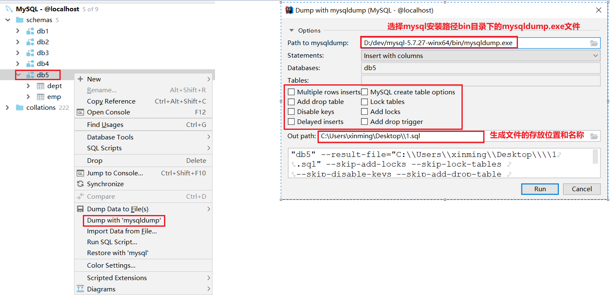

# MySQL单表操作
[toc]
## 数据库介绍(理解)
### 什么是数据库
    数据存储的仓库，其本质也是一个文件系统
    数据库会按照特定的格式对数据进行存储，用户可以对数据库中的数据进行增加，修改，删除及查询操作。

### 深入认识数据库
#### 数据库管理系统层次
    数据库管理系统 (DataBase Management System，DBMS) 指一种操作和管理数据库的大型软件。

#### 常见的数据库管理系统
~~~
* MySQL： 开源免费的数据库，小型的数据库。已经被Oracle(甲骨文)公司收购了，MySQL6.x版本（商业、社区）也开始收费。
* Oracle：收费的大型数据库，Oracle公司的产品。

* DB2：   IBM公司的数据库产品，收费的。
* SQLServer：MicroSoft公司收费的中型的数据库。C#、.net等语言常使用。
~~~

### SQL介绍

~~~markdown
1. 什么是SQL
	SQL全称Structured Query Language，翻译为：结构化查询语言
	是我们用来操作数据库的一种语言，通过sql语句来操作各种数据库，可以实现数据库、数据表、数据记录的增删改查
	注意我们一般把增删改查称为CRUD：create 创建、retrieve 检索、update 修改、delete 删除

2. SQL方言
	SQL是一套标准，所有的数据库厂商都实现了此标准。但是各自厂商在此标准上增加了特有的语句，这部分内容我们称为方言。
	比如在sql中表示单行注释可以使用两种方式:  -- sql通用注释     # mysql专有注释

3. SQL分类
	DDL(Data Definition Language) 数据定义语言：用来定义数据库，数据表
	
	DML(Data Manipulation Language) 数据操作语言：用来对数据库中表的数据进行增删改
	DQL(Data Query Language) 数据查询语言：用来对数据库中表的数据进行查询
	
	
	DCL(Data Control Language) 数据控制语言：用来定义数据库的访问权限和安全级别以及创建用户
	TCL(Transaction Control Language) 事务控制语言：用于控制数据库的事务操作

4. SQL的书写标准
	SQL可以单行书写，也可以多行书写, 它以；结束一条SQL语句
	在windows环境中SQL语句是不区分大小写的
	在SQL中可以使用注释，一般有两种：
   		单行注释  -- 注释体
   		多行注释  /* 注释体 */
~~~

## 使用cmd命令行对数据库操作
### 数据库操作
>连接数据库

~~~sql
-- mysql [-h 服务器地址  -P 端口号] -u用户名 -p密码
mysql -uroot -p
~~~

==错误1: ERROR 2003 (HY000): Can't connect to MySQL server on 'localhost' (10061)  表示数据库服务停止了==

==错误2: ERROR 1045 (28000): Access denied for user 'root'@'localhost' (using password: YES)  表示你的用户名和密码不对==

#### 创建数据库

> 需求：创建一个名为db1的数据库

~~~sql
-- 语法
create schema  [IF NOT EXISTS] 数据库名;

-- 实例
create schema db1;
create schema if not exists db1;
~~~

#### 查询数据库

> 需求：查看所有数据数据库

~~~sql
-- 语法
show schemas;
~~~

#### 删除数据库

> 需求：删除名为db1的数据库

~~~sql
-- 语法
drop schema [IF EXISTS] 数据库名;

-- 实例
drop schema db1;
drop schema if exists db1;
~~~

#### 使用数据库

> 需求：查看正在使用的数据库

~~~sql
-- 语法
select schema();
~~~

> 需求：切换正在使用的数据库为db1(db1必须存在)

~~~sql
-- 语法
use 数据库名;

-- 实例
use db1; -- 一定要保证这个schema是存在的
~~~

### 常见数据类型

| 大分类| 类型|描述|
| :---: | :---: | :---: |
| 数字类型 | int| 整型 |
| | float | 单精度浮点数类型 |
| | double | 双精度浮点数类型 |
| 字符类型 | varchar| 可变长度字符串类型，它的长度可以由我们自己指定，默认长度365, 最大值是65535，使用效率低,节省磁盘存储空间 |
| | char | 固定长度字符串类型，如果没有指定长度，默认长度是255，查询效率高, 浪费磁盘存储空间 |
| 日期类型 | date | 日期，格式：yyyy-MM-dd |
| | datetime | 日期时间，格式：yyyy-MM-dd HH:mm:ss，占用8字节的存储空间|

### 数据表操作

#### 创建数据表

> 需求：在db1中创建一张名为student的数据表，表中字段有  id  name  birthday 

~~~sql
-- 语法
create table 表名(
                           字段名1  字段类型1(字段长度),  -- 不是;号    
            字段名2  字段类型2(字段长度),
            ....
            字段名n  字段类型n(字段长度)  -- 最后一列后面是没有,的
        );

-- 实例
create table student(
                                id int(11),
            name varchar(20),
            birthday date
    );
~~~

#### 查询数据表

##### 查询所有表

> 需求：查看当前库中的所有数据表

~~~sql
-- 语法
show tables;
~~~

##### 查看表结构

> 需求：查看student表的表结构

~~~sql
-- 语法
desc 数据表名;

-- 实例
desc student;
~~~

#### 修改数据表

##### 添加一列

> 需求：修改student表中添加一列description

~~~sql
-- 语法
alter table 表名 add 字段名 列类型

-- 实例
alter table student add description varchar(200);
~~~

##### 修改列名和类型

> 需求：修改student表description列名为intro

~~~sql
-- 语法
alter table 表名 change 旧列名 新列名 列类型

-- 实例
alter table student change description intro varchar(300);
~~~

##### 修改表名

> 需求：修改student表的名称为stu

~~~sql
-- 语法
rename table 旧表名 to 新表名;

-- 实例
rename table student to stu;
~~~

#### 删除数据表

> 需求：删除stu表

~~~sql
-- 语法
drop table 表名;

-- 实例
drop table stu;
~~~
##### 删除指定列

> 需求：删除student表的intro列

~~~sql
-- 语法
alter table 表名 drop 列名;

-- 实例
alter table student drop intro;
~~~

## 工具对数据库的操作
### 连接数据库
#### 打开连接窗口

>1. 点击idea左下角的图标,在弹出框中选择Database
>
>2. 在idea右边侧边栏中选中Database
>3. 点击+号,然后选择Data Source中的MySQL

 

#### 选择驱动版本

>选择驱动版本,注意版本号选择5.1.47  Class选择com.mysql.jdbc.Driver

 

#### 建立连接

 

### 操作数据库

#### 查看数据库

> 查看所有的数据库，相当于 show databases;

  

#### 创建数据库

> 创建数据库，相当于create schema 数据库名;

 

#### 删除数据库

> 删除数据库，相当于 drop schema 数据库名;

 

#### 切换数据库

> 切换数据库，相当于use 数据库名

  

### 操作数据表

#### 创建数据表

> 创建数据表，相当于 create table ...

  

#### 查看数据

> 查看数据表结构，相当于 desc 数据表名

  

#### 修改表

> 修改表，相当于alter table ...      
>

  

#### 删除表

>删除表，相当于drop table ...      

 

## 数据库备份(会用)

### 导出

### 导入

## 数据常见错误
~~~markdown
1. 错误1: ERROR 2003 (HY000): Can't connect to MySQL server on 'localhost' (10061)  表示数据库服务停止了==
2. 错误2: ERROR 1045 (28000): Access denied for user 'root'@'localhost' (using password: YES)  表示你的用户名和密码不对==
3. Column count doesn't match value count at row 1  在保存数据的时候, 值和列数量上不匹配
4. Duplicate entry '1' for key 'PRIMARY'            主键重复(冲突)
5. Duplicate entry '小兰' for key 'NAME'            唯一列值重复
~~~

