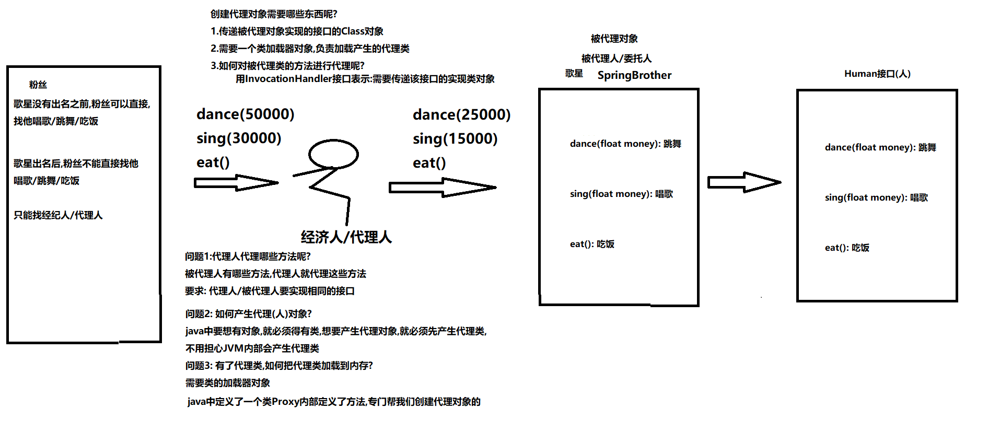

# <center>设计模式</center>

[toc]
## 单例模式
### 设计模式概念
```
设计模式（Design pattern），是一套被反复使用、经过分类编目的、代码设计经验的总结，使用设计模式是为了可重用代码、保证代码可靠性、程序的重用性。

1995 年，GoF（Gang of Four，四人组）合作出版了《设计模式：可复用面向对象软件的基础》一书，共收录了 23 种设计模式。

总体来说设计模式分为三大类：
1、创建型模式，共五种：工厂方法模式、抽象工厂模式、单例模式、建造者模式、原型模式。-->创建对象

2、结构型模式，共七种：[适配器模式]、装饰器模式、代理模式、外观模式、桥接模式、组合模式、享元模式。-->对功能进行增强

3、行为型模式，共十一种：策略模式、模板方法模式、[观察者模式]、迭代子模式、责任链模式、命令模式、备忘录模式、状态模式、访问者模式、[中介者模式]、解释器模式。
```
```
单列模式
    目的：保证一个类只能new一个对象出来,给外界使用
```
### 饿汉式
```
饿汉式:迫不及待的想使用对象
       为了达到目的:类一加载到内存,先加载静态成员,我们只需要new对象的时候将其变成static的就可以了
```
```java
public class Singleton01 {

    /*
       为了不让外界随便new,我们将构造私有化
     */
    private Singleton01(){

    }

    /*
       构造已经被私有了,外界也new不了,但是我们得需要一个对象呀
       怎么办?在自己内部new就可以了
     */
    private static Singleton01 singleton = new Singleton01();

    /*
       提供方法,专门讲自己内部new出来的对象,提供给别人
     */

    public static Singleton01 getInstance(){
        return singleton;
    }

}
```
```java
public class Test01 {
    public static void main(String[] args) {
        for (int i = 0; i < 20; i++) {
            Singleton01 instance = Singleton01.getInstance();
            System.out.println(instance);
        }
    }
}
```
### 懒汉式
```
懒汉式:先不要new对象,什么时候使用,什么时候再new,但是还得保证只能是一个对象

问题:线程安全问题
      一条线程进了if,第二条线程也可能进if,这样由于两个线程都进了if,那么在执行就会出现new两次对象的情况
     
解决:
     上锁
```
```java
public class Singleton02 {
    private Singleton02(){

    }

    private static Singleton02 singleton = null;

    //提供一个方法,返回new出来的对象
    public synchronized static Singleton02 getInstance(){

        if (singleton==null){
            singleton = new Singleton();
        }
        return singleton;
    }
}
```
```
public class Test02 {
    public static void main(String[] args) {
            for (int i = 0; i < 20; i++) {
                Singleton02 instance = Singleton02.getInstance();
                System.out.println(instance);
            }
        }
}
```
### 总结
```
单例模式可以保证系统中一个类只有一个对象产生
实现单例模式的步骤:
   1.将构造私有化,使其不能再类的外部通过new关键字创建对象
   2.在该类内部产生一个唯一的对象,并且将其封装为private static 类型的成员变量
   3.定义一个静态方法返回这个唯一的对象
```
## 工厂模式
### 什么是工厂模式
```
1.之前我们创建类对象时, 都是使用new对象的形式创建,在很多业务场景下也提供了不直接new的方式 。
2.工厂模式（Factory Pattern）是Java中最常用的设计模式之一,这种类型的设计模式属于创建型模式,它提供了一种获取对象的方式。
```
### 工厂模式的作用
```
工厂的方法可以封装对象的创建细节，比如：为该对象进行加工和数据注入。
可以实现类与类之间的解耦操作（核心思想）。
```
### 案例
```java
//抽象父类
public abstract class Car {
    private String brand;
    private String color;
    private int price;
    //跑
    public abstract void run();

    //自己生成空参/满参/get/set/toString方法
}
```
```java
//奥迪车
public class AudiCar extends Car {
    @Override
    public void run() {
        System.out.println(getBrand() + "::" + getColor() + "::" + getPrice() + "....奥迪车...正在冒着狼烟的跑....");
    }
}
```
```java
//宝马车
public class BmwCar extends Car {
    @Override
    public void run() {
        System.out.println(getBrand() + "::" + getColor() + "::" + getPrice() + "....宝马车...正在疯狂的跑....");
    }
}
```
```java
/**
     目标：工厂模式。
     什么是工厂设计模式？
     工厂模式（Factory Pattern）是 Java 中最常用的设计模式之一。
     这种类型的设计模式属于创建型模式，它提供了一种创建对象的方式。
     之前我们创建类对象时, 都是使用new 对象的形式创建, 除new 对象方式以外,工厂模式也可以创建对象。
     工厂设计模式的作用：
     1.对象通过工厂的方法创建返回，工厂的方法可以为该对象进行加工和数据注入。
     2.可以实现类与类之间的解耦操作（核心思想，重点）
     小结：
     工厂模式的思想是提供一个工厂方法返回对象！
 */
public class DemoFactory {
    public static void main(String[] args) {
        //多态的方式创建对象
        /*Car car = new BmwCar();
        car.setBrand("BMW750Li");
        car.setColor("宝强绿");
        car.setPrice(999999);
        car.run();

        Car car2 = new AudiCar();
        car2.setBrand("奥迪A8L");
        car2.setColor("骚红");
        car2.setPrice(888888);
        car2.run();*/
        //通过工厂创建Car类的对象
        Car car = CarFactory.createCar("bmw");
        car.run();

        Car car2 = CarFactory.createCar("audi");
        car2.run();

    }
}
```
## 动态代理
### 概念
```
代理就是被代理者没有能力或者不愿意去完成某件事情，需要找个人代替自己去完成这件事，动态代理就是用来对业务功能（方法）进行代理的。
```
```
动态代理，提供了一个代理的对象，有了代理对象后，当访问某个方法时，会被代理对象拦截（拦截后可以对方法进行前增强、后增强【代理对象不会破坏原有方法的代码】）
```
### 好处
```
非常的灵活，支持任意接口类型的实现类对象做代理，也可以直接为接本身做代理。
可以为被代理对象的所有方法做代理。
可以在不改变方法源码的情况下，实现对方法功能的增强。
不仅简化了编程工作、提高了软件系统的可扩展性，同时也提高了开发效率。
```
### 动态代理的特点
```
1.动态的创建.class文件
2.动态的加载.class文件到内存中（创建Class对象）
3.Proxy类是java中定义好的专门创建代理对象的类,该类需要一个"类加载器"
4.对程序员来讲，不需要书写代理类
```
### 动态代理的代码实现格式
```
代理对象 = Proxy.newProxyInstance(类加载器 , 父接口 , 处理器)
```
```
类加载器： 动态的加载.class文件
父接口 ： 代理类和被代理类需要拥有共同的父接口    
处理器： 代理对象拦截了方法后，对方法进行前增强、后增强，是由处理器来书写逻辑  
```
```java
代理对象  = Proxy.newProxyInstance(
             类.class.getClassLoader(), //类加载器
             被代理类.class.getInterfaces(), //父接口             
             new InvocationHandler(){
                 public Object invoke( Object 代理对象,Method 被拦截的方法对象 ，Object[] 方法中的实参){
                     //业务逻辑
                 }
             }
           )
```
### 代码实现

接口
```java
//接口: 人
public interface Human {
    //跳舞
    void dance(float money);
    //唱歌
    void sing(float money);
    //吃
    void eat();
}
```
实现类
```java
//歌星
public class SpringBrother implements Human {
    @Override
    public void dance(float money) {
        System.out.println("拿到" + money + "钱,开跳....");
    }
    @Override
    public void sing(float money) {
        System.out.println("拿到" + money + "钱,开唱....");
    }
    @Override
    public void eat() {
        System.out.println("吃地沟油盖饭...");
    }
}
```
测试类
```java
/*
    动态代理
        要求: 代理对象和被代理对象要实现相同的接口
        java.lang.reflect.Proxy类: 专门创建代理对象的类,在反射包中
        静态方法:
            public static Object newProxyInstance(ClassLoader loader,
                                      Class<?>[] interfaces,
                                      InvocationHandler h):
            作用: 创建代理对象

 */
public class Demo {
    public static void main(String[] args) {
        //多态的方式创建对象: 被代理对象,委托人
        Human human = new SpringBrother();
        /*
            参数一:
                ClassLoader loader: 类加载器,内部会首先创建代理类,需要加载代理类到内存
         */
        ClassLoader classLoader = human.getClass().getClassLoader();
        /*
            参数二:
                Class<?>[] interfaces: 被代理对象实现的接口,Class对象数组
                java.lang.Class类:
                    成员方法:
                        Class<?>[] getInterfaces(): 获取所有接口的Class对象数组
         */
        Class<?>[] interfaces = human.getClass().getInterfaces();
        /*
            参数三:
                InvocationHandler h: 接口,用来指定对被代理对象的方法如何进行代理的
                必须传递接口实现类对象
                    1.单独定义实现类   2.匿名内部类
         */
        InvocationHandler invocationHandler = new InvocationHandler() {
            /*
                参数一:
                    Object proxy: 产生的代理对象,一般此处没用
                参数二:
                    Method method: 反射获取的方法对象,调用的代理对象的具体的方法
                参数三:
                    Object[] args: 调用的代理对象的具体的方法时,传递的参数列表
                注意1:
                    使用代理对象调用任何方法,都会先执行invoke方法,
                    相当于具有拦截的功能,执行被代理对象的功能前可以执行其它功能,
                    在执行被代理对象的功能后可以执行其它功能
                注意2:
                	调用代理对象的任何方法都会执行invoke方法进行拦截
                invoke方法的返回值:
                    Object类型: 被代理对象的方法的返回值
             */
            @Override
            public Object invoke(Object proxy, Method method, Object[] args) throws Throwable {
                //获取要执行的代理对象的方法名
                String methodName = method.getName();
                if ("dance".equals(methodName)) {
                    //System.out.println("粉丝是找我的人跳舞.......");
                    //获取参数
                    float money = (float) args[0];
                    //超过40000,让它跳
                    if (money > 40000) {
                        return method.invoke(human,money/2);//歌星手里只能拿一半
                    } else {
                        return null;
                    }
                } else if ("sing".equals(methodName)) {
                    //System.out.println("粉丝是找我的人唱歌.......");
                    //获取参数
                    float money = (float) args[0];
                    if (money > 20000) {
                        return method.invoke(human,money/3);//歌星手里只能拿三分之一
                    } else {
                        return null;
                    }
                } else {
                    //System.out.println("我只管唱歌和跳舞,其它哥不管");
                    return method.invoke(human,args);
                }
            }
        };
        //使用Proxy类调用静态方法,获取代理对象
        Human humanProxy = (Human) Proxy.newProxyInstance(classLoader, interfaces, invocationHandler);

        //使用代理对象调用方法
        humanProxy.dance(50000);
        humanProxy.sing(30000);
        humanProxy.eat();
    }
}
```
## 动态代理练习
### 使用集合工具类获取不可变List集合
```java
import java.util.ArrayList;
import java.util.Collections;
import java.util.List;
/*
    java.util.Collections类: 操作集合工具类
    静态方法:
        public static <T> List<T> unmodifiableList(List<? extends T> list):
        作用: 根据方法参数List集合对象,获取新的List集合对象,新List集合对象的内容不可改变,只要改变就会报异常
 */
public class Demo04List {
    public static void main(String[] args) {
        List<String> list = new ArrayList<>();
        Collections.addAll(list,"Java","C++","Android","Python");
        System.out.println(list);
        //获取不可改变的List集合对象
        List<String> list2 = Collections.unmodifiableList(list);
        System.out.println(list2);
        System.out.println(list2.size());
        System.out.println(list2.get(0));
        System.out.println("--------------");
        //执行以下方法均会报出异常
        //UnsupportedOperationException: 不支持的操作异常
        //list2.remove(0);
        //list2.add("Hello");
        //list2.set(0, "java");
    }
}
```
### 使用动态代理模拟以上集合不可变功能
```java
/*
    java.util.Collections类: 操作集合工具类
    静态方法:
        public static <T> List<T> unmodifiableList(List<? extends T> list):
        作用: 根据方法参数List集合对象,获取新的List集合对象,新List集合对象的内容不可改变,只要改变就会报异常
 */
public class Demo05List {
    public static void main(String[] args) {
        List<String> list = new ArrayList<>();
        Collections.addAll(list,"Java","C++","Android","Python");
        System.out.println(list);
        //获取不可改变的List集合对象
        List<String> list2 = proxyList(list);
        System.out.println(list2);
        System.out.println(list2.size());
        System.out.println(list2.get(0));
        System.out.println("--------------");
        //执行以下方法均会报出异常
        //UnsupportedOperationException: 不支持的操作异常
        //list2.remove(0);
        //list2.add("Hello");
        //list2.set(0, "java");
    }
    //定义方法,获取内容不可以被改变的List集合对象
    public static List<String> proxyList(List<String> list) {
        /*
            参数一:
                ClassLoader loader: 类加载器,内部会首先创建代理类,需要加载代理类到内存
         */
        ClassLoader classLoader = list.getClass().getClassLoader();
        /*
            参数二:
                Class<?>[] interfaces: 被代理对象实现的接口,Class对象数组
                java.lang.Class类:
                    成员方法:
                        Class<?>[] getInterfaces(): 获取所有接口的Class对象数组
         */
        Class<?>[] interfaces = list.getClass().getInterfaces();
        /*
            参数三:
                InvocationHandler h: 接口,用来指定对被代理对象的方法如何进行代理的
                必须传递接口实现类对象
                    1.单独定义实现类   2.匿名内部类
         */
        InvocationHandler invocationHandler = new InvocationHandler() {
            @Override
            public Object invoke(Object proxy, Method method, Object[] args) throws Throwable {
                //获取方法名称
                String methodName = method.getName();
                
                if ("add".equals(methodName)) {
                    //添加方法直接报异常
                    throw new UnsupportedOperationException("不支持添加操作");
                } else if ("set".equals(methodName)) {
                    //修改方法直接报异常
                    throw new UnsupportedOperationException("不支持修改操作");
                }else if ("remove".equals(methodName)) {
                    //删除方法直接报异常
                    throw new UnsupportedOperationException("不支持删除操作");
                } else {
                    //其它方法不管
                    return method.invoke(list,args);
                }
            }
        };
        List<String> newList = (List<String>) Proxy.newProxyInstance(classLoader, interfaces, invocationHandler);
        return newList;
    }
}
```
## 动态代理练习
### 需求
    使用动态代理统计系统的每个方法执行的时间
### 接口
```java
/**
   模拟用户业务功能
 */
public interface UserService {
    //登录
    String login(String loginName , String passWord) ;
    //查询所有用户
    void selectUsers();
    //删除用户
    boolean deleteUsers();
    //修改用户
    void updateUsers();
}
```
### 接口实现类
```java
public class UserServiceImpl implements UserService{
    @Override
    public String login(String loginName, String passWord)  {
        try {
            Thread.sleep(1000);
        } catch (Exception e) {
            e.printStackTrace();
        }
        if("admin".equals(loginName) && "1234".equals(passWord)) {
            return "登录成功";
        }
        return "登录名和密码可能有毛病";

    }

    @Override
    public void selectUsers() {
        System.out.println("查询了100个用户数据！");
        try {
            Thread.sleep(2000);
        } catch (Exception e) {
            e.printStackTrace();
        }
    }

    @Override
    public boolean deleteUsers() {
        try {
            System.out.println("删除100个用户数据！");
            Thread.sleep(500);
            return true;
        } catch (Exception e) {
            e.printStackTrace();
            return false;
        }
    }

    @Override
    public void updateUsers() {
        try {
            System.out.println("修改100个用户数据！");
            Thread.sleep(2500);
        } catch (Exception e) {
            e.printStackTrace();
        }
    }
}
```
### 创建代理对象的工具类
```java
import java.lang.reflect.InvocationHandler;
import java.lang.reflect.Method;
import java.lang.reflect.Proxy;

//定义创建代理对象的工具类
public class ProxyUtil {
    //构造方法私有
    private ProxyUtil() {
    }
    //定义静态方法产生代理对象
    public static UserService getProxy(UserService userService){
        //获取被代理对象的class对象
        Class<? extends UserService> clazz = userService.getClass();
        //获取被代理对象的类加载器
        ClassLoader classLoader = clazz.getClassLoader();
        //获取被代理对象实现的所有接口对应的Class对象数组
        Class<?>[] interfaces = clazz.getInterfaces();
        //创建InvocationHandler接口的匿名内部类对象,指定的具体的代理的方式(如何进行代理)
        InvocationHandler h = new InvocationHandler() {
            @Override
            public Object invoke(Object proxy, Method method, Object[] args) throws Throwable {
                //获取方法名称
                String methodName = method.getName();
                //记录开始时间
                long start = System.nanoTime();
                //执行被代理对象的具体的方法
                Object invoke = method.invoke(userService, args);
                long end = System.nanoTime();
                System.out.println(methodName+"方法总耗时："+(end-start)+"纳秒");
                return invoke;
            }
        };
        UserService userServiceProxy = (UserService) Proxy.newProxyInstance(classLoader, interfaces, h);
        return userServiceProxy;
    }
    public static <T> T getProxy2(T t){
        //获取被代理对象的class对象
        Class clazz = t.getClass();
        //获取被代理对象的类加载器
        ClassLoader classLoader = clazz.getClassLoader();
        //获取被代理对象实现的所有接口对应的Class对象数组
        Class<?>[] interfaces = clazz.getInterfaces();
        //创建InvocationHandler接口的匿名内部类对象,指定的具体的代理的方式(如何进行代理)
        InvocationHandler h = new InvocationHandler() {
            @Override
            public Object invoke(Object proxy, Method method, Object[] args) throws Throwable {
                //获取方法名称
                String methodName = method.getName();
                //记录开始时间
                long start = System.nanoTime();
                //执行被代理对象的具体的方法
                Object invoke = method.invoke(t, args);
                long end = System.nanoTime();
                System.out.println(methodName+"方法总耗时："+(end-start)+"纳秒");
                return invoke;
            }
        };
        /*T proxy = (T) Proxy.newProxyInstance(classLoader, interfaces, h);
        return proxy;*/
        return (T) Proxy.newProxyInstance(classLoader, interfaces, h);
    }
}
```
### 测试类
```java
//动态代理练习,统计方法的耗时
public class Demo04Proxy {
    public static void main(String[] args) {
        //创建被代理对象
        UserService userService = new UserServiceImpl();
        //调用被代理对象的方法
       /* System.out.println(userService.login("admin", "1234"));
        userService.selectUsers();
        System.out.println("是否删除成功: " + userService.deleteUsers());
        userService.updateUsers();*/
        System.out.println("-----------------");

        //使用工具类创建代理对象
        UserService userServiceProxy = ProxyUtil.getProxy2(userService);
        //调用代理对象的方法
        System.out.println(userServiceProxy.login("admin", "1234"));
        userServiceProxy.selectUsers();
        System.out.println("是否删除成功: " + userServiceProxy.deleteUsers());
        userServiceProxy.updateUsers();
        userServiceProxy.addUser();
    }
}
```