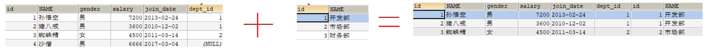
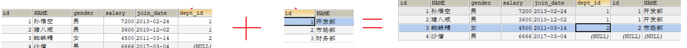

# 回顾

~~~markdown
1. 数据记录操作
	创建: insert into student values()
	修改: update student set name='张三',age=18 where id = 1
	删除: delete from student where id = 1
	普通查询: select * from 表
		去重: distinct
		空值: ifnull(列,默认值)
		别名: as
	条件查询 select * from 表 where 
		关系: > < = >= <= != 
		逻辑: and  or
		范围: in    between 开始值 and  结束值
		null: is null        is not  null
		模糊: like  %   _
	高级查询
		排序: order by     asc|desc
		截取: limit 开始索引,查询条数
		聚合: max  min avg count  sum
		分组: group by
		过滤: having
2. 数据库约束(限制)
	主键: primary key 唯一  非空  一张表只有一个主键列
	唯一: unique      唯一  允许为null
	非空: not null    不为空
	默认值: default   如果sql语句不传入,就使用默认值
~~~

# 多表关系（理解）

## 概述

>>1. 常见的表间关系有哪几种?
>>2. 怎样去判断两个表之间到底是哪种关系?

>现实生活中，实体与实体之间肯定是有关系的，那么我们在设计表的时候，就应该体现出表与表之间的这种关系。
>
>我们把这种数据库称为关系型数据库（RDBMS），在数据库设计上，表关系分为三种：一对多、多对多、一对一。

~~~markdown
* 一对多
	场景：班级和学生  部门和员工
	说明：一个班级对应多个学生，一个学生只能对应一个班级

* 多对多
	场景：学生和课程  学生和老师
	说明：一个学生对应多个课程，一个课程对应多个学生 

* 一对一
	场景：丈夫和妻子 人和身份证号
	说明：一个丈夫只有一个妻子，一个妻子也只有一个丈夫
~~~

 

> >练习一下: 假设一个人可以有多张银行卡,而每张银行卡只能属于一个用户,那么人和银行卡之间是什么关系?
> >
> >A. 一对一                B  一对多                C  对对多

## 一对多

> >使用什么方式可以在两个表之间建立一对多的关系    外键

> 例子: 班级和学生

### 关系图示

 

### 关系建立

~~~sql
-- 一对多
create schema db3;
use db3;

-- 班级
create table class(
    id int primary key,
    name varchar(30)
);

-- 学生
create table student(
    id int primary key,
    name varchar(30),
    class_id int
);

-- 插入数据
insert into class values (1,'JAVAEE166'),(2,'JAVAEE167');
insert into student values (1,'张三',1),(2,'李四',2),(3,'王五',2);
~~~

## 外键约束

> >1. 外键约束的作用是什么?
> >
> >2. 当外键约束存在的时候,我们在增删表中数据的时候,要注意什么?

> 作用：限定两张表有关系的数据，保证数据的正确性、有效性和完整性。

~~~sql
-- 添加外键约束
	1 创建表的时候添加
        create table 表名(
            列名  列类型,
            [constraint 约束名: 外键列_fk]  foreign key (列名)  references  主表(主键)
        )
	2 创建表之后单独添加
		alter table 表名 add [constraint 约束名]  foreign key (列名)  references  主表(主键)
-- 删除外键约束
	alter table 表名 drop foreign key 约束名

-- 外键约束的特点
	1 对于主表来说，不能删除被从表引用的数据；对于从表来说，不能添加主表中不存在的数据
	2 添加数据的时候，要先添加主表数据；删除数据的时候，要先删除从表数据
~~~

~~~sql
-- 一对多
create schema db3;
use db3;

-- 班级
create table class(
    id int primary key,
    name varchar(30)
);

-- 学生
create table student(
    id int primary key,
    name varchar(30),
    class_id int
);

-- 插入数据
insert into class values (1,'JAVAEE166'),(2,'JAVAEE167');
insert into student values (1,'张三',1),(2,'李四',2),(3,'王五',2);

-- 建立外键约束
alter table student add constraint class_id_fk foreign key(class_id) references class(id);

-- 删除外键约束
alter table student drop foreign key class_id_fk;
~~~

 

## 多对多

>>使用什么方式可以在两个表之间建立多对多的关系   中间表

> 例子: 学生和课程

### 关系图示

 

### 关系建立

~~~sql
-- 多对多
create schema db4;
use db4;

-- 学生
create table student(
    id int primary key,
    name varchar(30)
);

-- 课程
create table course(
    id int primary key,
    name varchar(30)
);

-- 建立中间表
create  table student_course(
    student_id int,
    course_id int,
    constraint student_id_fk foreign key (student_id) references student(id), -- 外键约束
    constraint course_id_fk foreign key (course_id) references course(id) -- 外键约束
);
~~~

## 一对一

> >使用什么方式可以在两表之间建立一对一的关系     外键+唯一约束

> 例子: 丈夫和妻子

### 关系图示

 

### 关系建立

~~~sql
-- 创建并使用数据库
create schema db5;
use db5;

-- 创建丈夫表
create table husband(
    id int primary key,
    name varchar(50)
);

-- 创建妻子表
create table wife(
    id int primary key,
    name varchar(50),
    husband_id int unique, -- 唯一约束
    constraint husband_id_fk foreign key(husband_id) references husband(id)-- 设置外键约束
)
~~~

# 多表查询（重点）

> 在企业开发中，我们一个业务需要的数据往往是来自多张表的，所以这时候就需要多表联合查询。
>
> 所谓的多表联合查询就是使用一条SQL语句将多张表的数据一起查询展示出来。

~~~sql
-- 创建部门表（主表）
CREATE TABLE dept (
  id INT PRIMARY KEY AUTO_INCREMENT,
  NAME VARCHAR(20)
);
INSERT INTO dept (NAME) VALUES ('开发部'),('市场部'),('财务部');

-- 创建员工表（从表）
CREATE TABLE emp (
  id INT PRIMARY KEY AUTO_INCREMENT,
  NAME VARCHAR(10),
  gender CHAR(1),  -- 性别（sex）
  salary DOUBLE,   -- 工资
  join_date DATE,  -- 入职日期
  dept_id INT -- 外键字段
);
INSERT INTO emp(NAME,gender,salary,join_date,dept_id) VALUES('孙悟空','男',7200,'2013-02-24',1);
INSERT INTO emp(NAME,gender,salary,join_date,dept_id) VALUES('猪八戒','男',3600,'2010-12-02',1);
INSERT INTO emp(NAME,gender,salary,join_date,dept_id) VALUES('蜘蛛精','女',6666,'2011-03-14',2);
INSERT INTO emp(NAME,gender,salary,join_date,dept_id) VALUES('沙僧','男',4500,'2017-03-04',null);
~~~

## 连接查询

>>1. 连接查询有哪些种类? 区别点在哪?
>>2. 内连接的语法是什么?       select * from 左表 inner join 右表 on 连接条件
>>3. 左外连接的语法是什么?     select * from 左表 left outer join 右表 on 连接条件

### 交叉连接（了解）

> 笛卡尔积
>
> 查询员工表和部门表中所有信息

 

~~~sql
-- 解释
	使用左表中的每一条数据分别去连接右表中的每一条数据, 将所有的连接结果都展示出来
	
-- 语法
 	select * from  左表,右表
 
-- 案例
	select * from emp,dept
~~~

### 内连接（掌握）

> 查询员工表和部门表中的信息, 仅显示两表中全部符合的数据

~~~sql
-- 解释 
	使用左表中的每一条数据分别去连接右表中的每一条数据, 仅仅显示出匹配成功的那部分
	
-- 语法
	隐式内连接: select * from 左表,右表 where 连接条件
	显示内连接: select * from 左表 [inner] join 右表 on 连接条件

-- 案例
    -- 隐式内连接
    select * from emp,dept where emp.dept_id = dept.id;

    -- 显示内连接
    select * from emp inner join dept on emp.dept_id = dept.id;
    select * from emp e inner join dept d on e.dept_id = d.id; -- 最终
~~~

### 左外连接（掌握）

>查询所有员工和对应的部门信息, 显示所有的员工信息, 如果此员工的部门不存在,使用null补齐

~~~sql
-- 解释
	首先要显示出左表的全部, 然后使用连接条件匹配右表,能匹配中的就显示,匹配不中的显示为null

-- 语法
	select * from 左表 left [outer] join 右表 on 连接条件

-- 案例
	select * from emp e left outer join dept d on e.dept_id = d.id;
~~~

### 右外连接（了解）

>查询所有员工和对应的部门信息, 不存在部门的使用null补齐

~~~sql
-- 解释
	首先要显示出右表的全部, 然后使用连接条件匹配左表,能匹配中的就显示,匹配不中的显示为null
	
-- 语法
	select * from 左表 right outer join 右表 on 连接条件
~~~

### 小结

~~~sql
-- 内连接：
	select * from 左表 [inner] join 右表 on 连接条件
	
-- 左外连接：
	select * from 左表 left [outer] join 右表 on 连接条件
~~~

## 子查询

> >1. 什么时候要使用子查询? 
> >
> >2. 子查询有哪些样式?  使用规律是怎样的?

>查询工资最高的员工是谁？

~~~sql
-- 解释:
	一个查询使用了另一个查询的结果

-- 案例:
    -- 1. 查询出最高薪资
    select max(salary) from emp; -- 7200

    -- 2. 哪些人能够拿到这个薪资
    select * from emp where salary = 7200;

    -- 合并
    select * from emp where salary = (select max(salary) from emp);
~~~

> 练习

~~~sql
-- 1: 查询工资小于平均工资的员工有哪些？(子查询结果为一个值)
-- 1 查询平均工资
select avg(salary) from emp; -- 6391.5
-- 2 查询谁的工资小于上面的数
select * from emp where salary < 6391.5;
-- 3. 合并
select * from emp where salary < (select avg(salary) from emp);

-- 2: 查询工资大于5000的员工，所在部门的名字 (子查询结果为多个值)
-- 1 查询工资大于5000的员工的部门id
select distinct dept_id from emp where salary > 5000; -- 1 2
-- 2 查询这些部门id的名称
select name from dept where id in (1,2);
-- 合并
select name from dept where id in (select distinct dept_id from emp where salary > 5000);

-- 3: 查询出2011年以后入职的员工信息，包括部门信息 (子查询结果为一张表)

-- 查询出2011年以后入职的员工信息
select * from emp where join_date >= '2011-01-01';

-- 使用上面的结果连接部门表,获取部门信息
select * from
    (select * from emp where join_date >= '2011-01-01')
as t1 left outer join dept d on t1.dept_id = d.id
~~~

> 小结

~~~markdown
* 子查询根据查询结果不同，作用不同
	单个值，使用 = > <  等进行条件判断 :    SELECT 字段列表 FROM 表 WHERE 字段名 = (子查询);
	多个值，使用 in 关键字进行条件判断 :    SELECT 字段列表 FROM 表 WHERE 字段名 in (子查询);
	一张表，将此结果声明为一张表来使用:     SELECT * FROM (子查询) AS 表 JOIN 表 ON 条件;
~~~

# 多表练习（重点）

> 我们在企业开发时，根据不同的业务需求往往需要通过2张及以上的表中去查询需要的数据。其实不管是几张表的查询，都是有规律可循的。

~~~sql
-- 部门表
CREATE TABLE dept (
  id INT PRIMARY KEY auto_increment, -- 部门id
  dname VARCHAR(50), -- 部门名称
  loc VARCHAR(50) -- 部门位置
);
-- 添加4个部门
INSERT INTO dept(id,dname,loc) VALUES 
(10,'教研部','北京'),
(20,'学工部','上海'),
(30,'销售部','广州'),
(40,'财务部','深圳');

-- 职务表
CREATE TABLE job (
  id INT PRIMARY KEY,
  jname VARCHAR(20), -- 职务名称
  description VARCHAR(50) -- 职务描述
);
-- 添加4个职务
INSERT INTO job (id, jname, description) VALUES
(1, '董事长', '管理整个公司，接单'),
(2, '经理', '管理部门员工'),
(3, '销售员', '向客人推销产品'),
(4, '文员', '使用办公软件');

-- 员工表
CREATE TABLE emp (
  id INT PRIMARY KEY, -- 员工id
  ename VARCHAR(50), -- 员工姓名
  job_id INT, -- 职务id  外键
  mgr INT , -- 上级领导
  joindate DATE, -- 入职日期
  salary DECIMAL(7,2), -- 工资 99999.99
  bonus DECIMAL(7,2), -- 奖金 99999.99
  dept_id INT, -- 所在部门编号  外键
  CONSTRAINT emp_jobid_ref_job_id_fk FOREIGN KEY (job_id) REFERENCES job (id),
  CONSTRAINT emp_deptid_ref_dept_id_fk FOREIGN KEY (dept_id) REFERENCES dept (id)
);
-- 添加员工
INSERT INTO emp(id,ename,job_id,mgr,joindate,salary,bonus,dept_id) VALUES 
(1001,'孙悟空',4,1004,'2000-12-17','8000.00',NULL,20),
(1002,'卢俊义',3,1006,'2001-02-20','16000.00','3000.00',30),
(1003,'林冲',3,1006,'2001-02-22','12500.00','5000.00',30),
(1004,'唐僧',2,1009,'2001-04-02','29750.00',NULL,20),
(1005,'李逵',4,1006,'2001-09-28','12500.00','14000.00',30),
(1006,'宋江',2,1009,'2001-05-01','28500.00',NULL,30),
(1007,'刘备',2,1009,'2001-09-01','24500.00',NULL,10),
(1008,'猪八戒',4,1004,'2007-04-19','30000.00',NULL,20),
(1009,'罗贯中',1,NULL,'2001-11-17','50000.00',NULL,10),
(1010,'吴用',3,1006,'2001-09-08','15000.00','0.00',30),
(1011,'沙僧',4,1004,'2007-05-23','11000.00',NULL,20),
(1012,'李逵',4,1006,'2001-12-03','9500.00',NULL,30),
(1013,'小白龙',4,1004,'2001-12-03','30000.00',NULL,20),
(1014,'关羽',4,1007,'2002-01-23','13000.00',NULL,10);

-- 工资等级表
CREATE TABLE salarygrade (
  grade INT PRIMARY KEY,  -- 等级
  losalary INT, -- 最低工资
  hisalary INT -- 最高工资
);
-- 添加5个工资等级
INSERT INTO salarygrade(grade,losalary,hisalary) VALUES 
(1,7000,12000),
(2,12010,14000),
(3,14010,20000),
(4,20010,30000),
(5,30010,99990);
~~~

## 表关系分析

 

## 练习题1

> >多表查询的SQL书写规律是什么?

~~~~sql
-- 1 查询所有员工信息。显示员工姓名，工资，职务名称

-- 2 查询所有员工信息。显示员工姓名，工资，职务名称，部门名称

-- 3 查询所有员工信息。显示员工姓名，工资，职务名称，部门名称，工资等级

-- 4 查询经理的信息。  显示员工姓名，工资，职务名称，部门名称，工资等级

~~~~

~~~sql
-- 1 查询所有员工信息。显示员工姓名，工资，职务名称
-- 1. 确定使用的表, 确定表间连接字段
select * from emp e left outer join job j on e.job_id = j.id;
-- 2. 确定最后显示的字段
select e.ename,e.salary,j.jname from emp e left outer join job j on e.job_id = j.id;

-- 2 查询所有员工信息。显示员工姓名，工资，职务名称，部门名称
-- 1. 确定使用的表, 确定表间连接字段
select * from emp e
    left outer join job j on e.job_id = j.id
    left outer join dept d on e.dept_id = d.id;
-- 2. 确定最后显示的字段
select e.ename,e.salary,j.jname,d.dname  from emp e
  left outer join job j on e.job_id = j.id
  left outer join dept d on e.dept_id = d.id;

-- 3 查询所有员工信息。显示员工姓名，工资，职务名称，部门名称，工资等级
-- 1. 确定使用的表, 确定表间连接字段
select * from emp e
    left outer join job j on e.job_id = j.id
    left outer join dept d on e.dept_id = d.id
    left outer join salarygrade s on e.salary between s.losalary and s.hisalary;
-- 2. 确定最后显示的字段
select e.ename,e.salary,j.jname,d.dname,s.grade from emp e
  left outer join job j on e.job_id = j.id
  left outer join dept d on e.dept_id = d.id
  left outer join salarygrade s on e.salary between s.losalary and s.hisalary;

-- 4 查询经理的信息。  显示员工姓名，工资，职务名称，部门名称，工资等级
-- 1. 确定使用的表, 确定表间连接字段
-- 2. 确定最后显示的字段
-- 3. 确定业务条件
select e.ename,e.salary,j.jname,d.dname,s.grade from emp e
     left outer join job j on e.job_id = j.id
     left outer join dept d on e.dept_id = d.id
     left outer join salarygrade s on e.salary between s.losalary and s.hisalary
where j.jname = '经理';
~~~

## 练习题2

> >自查询的使用场景是什么? 

~~~sql
-- 返回每个员工的名称及其上级领导的名称
select e.ename,ld.ename from emp e left outer join emp ld on e.mgr=ld.id
~~~

 

# 事务（理解）

> >1. 事务的作用是什么?
> >2. 事务操作的三个方法是什么?
> >3. 事务基于什么实现的?

## 转账案例

~~~sql
-- 创建账户表,并且添加两条测试数据
CREATE TABLE account (
	id INT PRIMARY KEY AUTO_INCREMENT,
	NAME VARCHAR(32),
	money DOUBLE 
);
INSERT INTO account (NAME, money) VALUES ('AA', 1000), ('BB', 1000);
~~~

> 需求: 实现这样一个业务, 从AA向BB账户转10元钱

~~~sql
-- 需求: 实现这样一个业务, 从AA向BB账户转10元钱

-- 将AA账户减去10元
update account set money=money-10 where name = 'AA';

-- 将BB账户加上10元
update account set money=money+10 where name = 'BB';

-- 我们希望上面的两个语句是一个不能再分割的整体, 要么一起成功,要么一起失败
~~~

## 事务解释

> 一个业务操作包含多个子操作，如果这个业务操作被事务管理了，那么这些子操作要么同时成功，要么同时失败。
>
> 在MySQL数据库中，默认情况下，一条DML语句就是一个独立的事务。

 ~~~sql
-- 事务的三个api
-- 开启事务 begin;
-- 提交事务 commit;
-- 回滚事务 rollback;

begin; --开启事务
update account set money=money-10 where name = 'AA';
update account set money=money+10 where name = 'BB';
commit; -- 提交事务
rollback; -- 回滚事务

try{
	开始事务

	//转账 2语句

	提交事务
}catch(Ex){
    回滚事务
}
 ~~~

 

## 事务特性

>事务特性

~~~markdown
* 原子性：atomicity     一个事务操作是不可分割的整体，一个事务中的操作一定是要么全部成功，要么全部失败的。

* 一致性：consistency   一个事务执行前后，数据库的状态是一致的。A 100   B 100                A 90   B 110

* 隔离性：isolation     当多个事务同时执行的时候，互相是不会产生影响的。

* 持久性：durability    当事务执行完毕之后，其对数据库产生的影响一定会持久的保存在磁盘上。
~~~

> 事务隔离性带来的问题

~~~markdown
* 脏读：一个事务读取到了另外一个事务没有提交的数据

* 不可重复读：一个事务读取到了另外一个事务修改的数据（修改）

* 幻读（虚读）：一个事务读取到了另外一个事务新增的数据（新增）
~~~

>事务隔离级别

MySQL提供了事务隔离级别来解决这些问题。在MySQL中共支持四种隔离级别，分别是：

| 级别 | 名字     | 隔离级别         | 脏读 | 不可重复读 | 幻读 | 数据库默认隔离级别 |
| ---- | -------- | ---------------- | ---- | ---------- | ---- | ------------------ |
| 1    | 读未提交 | read uncommitted | 是   | 是         | 是   |                    |
| 2    | 读已提交 | read committed   | 否   | 是         | 是   | Oracle             |
| 3    | 可重复读 | repeatable read  | 否   | 否         | 是   | MySQL              |
| 4    | 串行化   | serializable     | 否   | 否         | 否   |                    |

 

>==内容总结==
>
>​	表间关系: 一对多    多对多     一对一
>
>​	多表查询:
>
>​		内连接
>
>​		左外连接
>
>​		子查询
>
>
>
>==今日任务==
>
>1. 手画三种表间关系的图
>2. 多表查询和练习至少敲两遍(第二遍不要看笔记提示)
>3. 理解事务的作用，掌握事务相关的3道的面试题
