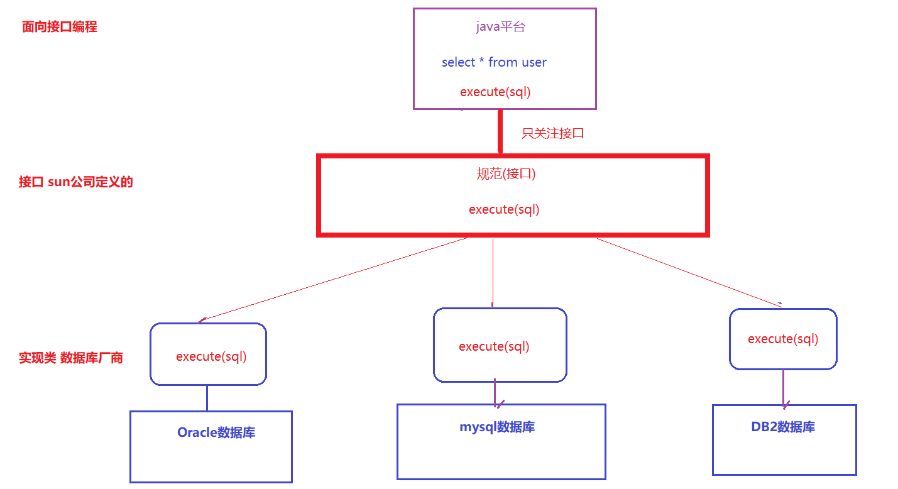

# JDBC简介

> >1. JDBC的本质是什么?
> >2. 为什么要出现JDBC规范,没有它会有什么问题?

> **思考**

我们学过的操作数据库的工具有哪些?  ==dos  idea  向数据库发送sql语句,对于查询,会将结果集返回来==

 

> **简介**

JDBC, 全称Java DataBase Connectivity (  Java数据库连接 ), 是Java语言操作数据库的一种技术。

是官方（sun公司）定义的一套操作所有关系型数据库的规则( 接口 )，而具体的实现类由各个数据库厂商来实现。

java开发人员只需要面向JDBC接口编程就可以, 而不需要理会实现类中的方法。

> >练习一下: 关于JDBC的描述正确的是？
> >
> >A.  SUN公司提供的连接数据库的接口
> >
> >B.  SUN公司提供的连接数据库的实现类
> >
> >C.  MySQL公司提供的连接数据库的接口
> >
> >D.  MySQL公司提供的连接数据库的实现类

# JDBC入门

## 入门案例

> 需求: 使用java代码从数据库的user表中的查询`username='柯南' 并且 password='admin' `的用户 
>
> ~~~sql
> select * from user where username='柯南' and password='admin'
> ~~~

> >JDBC的使用步骤是怎样的?

### 准备数据

 

### 建工程,导jar包

 

### 开发步骤图示

 

### 编写代码

 

> >练习一下: 请补齐JDBC访问数据库的基本步骤中缺少的两步
> >
> >1. 加载驱动
> >
> >2. ________________________
> >
> >3. 编写sql语句
> >
> >4. 创建数据库的操作对象
> >
> >5. _____________________
> >
> >6. 处理操作结果
> >
> >7. 释放资源

## API介绍

> >知道DriverManager、Connection、Statement、ResultSet的主要作用

### DriverManager: 驱动管理对象

~~~markdown
1. 注册驱动
		方式一：DriverManager.registerDriver(new Driver());  【了解， 它会有驱动重复注册的问题】
		方式二：Class.forName("com.mysql.jdbc.Driver");【推荐】
2. 获取连接
		Connection connection = DriverManager.getConnection(url, user, password);
		url = "jdbc:mysql://localhost:3306/jdbc"    固定格式，代表的其实就是数据库的连接地址 
		服务器地址默认值为localhost  端口号默认值为3306    简写形式:  jdbc:mysql:///jdbc1	
~~~

### Connection: 数据库连接对象

~~~~markdown
1. 获取执行sql的对象
		Statement statement = connection.createStatement();
		PreparedStatement preparedStatement = connection.prepareStatement(sql);
		
2. 事务管理
        connection.setAutoCommit(false);  开启
        connection.commit();  提交
        connection.rollback();  回滚
~~~~

### Statement: 执行sql的对象

~~~markdown
1. executeUpdate[重点]
		int i = statement.executeUpdate(sql);
		此方法用于执行增删改(DML)语句, 其返回结果是一个数字,代表sql对数据库的影响行数
       
2. executeQuery[重点]
		 ResultSet resultSet = statement.executeQuery(sql);
		 此方法用于执行查询(DQL)语句, 其返回值是一个对象(数据的集合)
~~~

### ResultSet: 结果集对象

~~~markdown
1. next
	指针下移 返回当前行是否有结果存在
	
2. getT(列名称)
	根据列名称返回当前列信息

3. 常见用法
        ResultSet rs = statement.executeQuery(sql);
        while (rs.next()) {
            int id = rs.getInt("id");
            String username = rs.getString("username");
        }
~~~

 

> >练习一下: 下面哪个对象用于执行sql语句
> >
> >A. DriverManager      B.  Connection        C.Statement         D. ResultSet

# 用户登录

>实现一个用户登录的案例

> >1. 知道用户登录案例的基本步骤是什么
> >2. 了解什么是SQL注入问题

## 思路分析

 

## 代码编写

 

## SQL注入

> 用户输入的信息和SQL语句进行字符串拼接。用户输入的内容作为了SQL语句语法的一部分，改变了原有 SQL真正的意义，以上问题称为SQL注入。

 

# 预编译对象

>为了防止SQL的注入问题，JDBC引入了PreparedStatement来替代Statement

> >1. SQL注入问题的解决方案是什么?它的底层原理是什么?
> >2. PreparedStatement的使用格式是怎样的?

## 介绍

~~~java
public interface PreparedStatement extends Statement{}

// PreparedStatement 表示预编译的SQL语句的对象。
// 这个对象的做法是首先编写一个带有占位符(?) 的SQL语句, 发往数据库编译, 然后再将参数传入, 让数据库帮我们查询

// 用法如下:
String sql = "update employees set salary = ? where id = ?";
PreparedStatement pstmt = connection.prepareStatement(sql);     -- m1(a,b)

pstmt.setDouble(1, 11538);//参数1: 占位符位置,从1开始计数   参数2: 赋的值
pstmt.setInt(2, 592);

pstmt.executeUpdate();//这个位置不能再传   -- m1(11538,592)

update employees set salary = 1 where id = 2
update employees set salary = 3 where id = 4
update employees set salary = 5 where id = 6
~~~

## 改进登录案例

 

~~~sql
SHOW VARIABLES LIKE '%general_log%'
SET GLOBAL general_log=ON;
SET GLOBAL general_log=OFF;
~~~

## 运行原理

~~~markdown
1. PrepareStatement prepareStatement = connection.preparedStatement(sql);
	通过上面的一句大家会发现在创建prepareStatement的时候，传入了一个参数，这个参数就是带有占位符的sql
	此时数据库就已经就收到了这条sql语句，并且会对它进行编译，而prepareStatement对象会引用着编译的结果
	就类似于java中已经写好的一个方法，预留了几个参数

2. preparedStatement.setString(1, username)
	这句话就相当于给上面的方法中的参数赋值的过程
		
3. preparedStatement.executeQuery()
	这句话是真正执行上面的方法的过程
~~~

> >练习一下: 下面方法可以创建出能够预编译执行sql对象的是
> >
> >A.  connection.createPreparedStatement(sql)
> >
> >B.  connection.preparedStatement(sql)
> >
> >C.  connection.createPreparedStatement()
> >
> >D.  connection.preparedStatement()

## 实现CRUD

~~~java
//增加用户  username:小兰  password:admin  balance:100
//修改用户小兰的账户余额为1000
//删除用户小兰
//查询所有
~~~

~~~java
package com.itheima.c_crud;

import org.junit.Test;

import java.sql.*;

public class Crud {

    //增加用户  username:小兰  password:admin  balance:100
    @Test
    public void testSave() throws SQLException, ClassNotFoundException {
        //1. 注册驱动
        Class.forName("com.mysql.jdbc.Driver");
        //2. 获取连接
        Connection connection = DriverManager.getConnection("jdbc:mysql:///db1", "root", "root");
        //3. 编写sql
        String sql = "insert into user values(null,?,?,?)";
        //4. 创建PreparedStatement,进行赋值
        PreparedStatement pstm = connection.prepareStatement(sql);
        pstm.setString(1, "小兰");
        pstm.setString(2, "admin");
        pstm.setFloat(3, 100);
        //5. 运行
        int i = pstm.executeUpdate();
        //6.结果
        if (i>0){
            System.out.println("成功");
        }else{
            System.out.println("失败");
        }
        //7. 释放资源
        pstm.close();
        connection.close();
    }

    //修改用户小兰的账户余额为1000
    @Test
    public void testUpdate() throws SQLException, ClassNotFoundException {
        //1. 注册驱动
        Class.forName("com.mysql.jdbc.Driver");
        //2. 获取连接
        Connection connection = DriverManager.getConnection("jdbc:mysql:///db1", "root", "root");
        //3. 编写sql
        String sql = "update user set balance = ? where username = ?";
        //4. 创建PreparedStatement,进行赋值
        PreparedStatement pstm = connection.prepareStatement(sql);
        pstm.setFloat(1, 1000);
        pstm.setString(2, "小兰");
        //5. 运行
        int i = pstm.executeUpdate();
        //6.结果
        if (i>0){
            System.out.println("成功");
        }else{
            System.out.println("失败");
        }
        //7. 释放资源
        pstm.close();
        connection.close();
    }

    //删除用户小兰
    @Test
    public void testDelete() throws SQLException, ClassNotFoundException {
        //1. 注册驱动
        Class.forName("com.mysql.jdbc.Driver");
        //2. 获取连接
        Connection connection = DriverManager.getConnection("jdbc:mysql:///db1", "root", "root");
        //3. 编写sql
        String sql = "delete from user where username = ?";
        //4. 创建PreparedStatement,进行赋值
        PreparedStatement pstm = connection.prepareStatement(sql);
        pstm.setString(1, "小兰");
        //5. 运行
        int i = pstm.executeUpdate();
        //6.结果
        if (i>0){
            System.out.println("成功");
        }else{
            System.out.println("失败");
        }
        //7. 释放资源
        pstm.close();
        connection.close();
    }

    //查询所有
    @Test
    public void testFindAll() throws SQLException, ClassNotFoundException {
        //1. 注册驱动
        Class.forName("com.mysql.jdbc.Driver");
        //2. 获取连接
        Connection connection = DriverManager.getConnection("jdbc:mysql:///db1", "root", "root");
        //3. 编写sql
        String sql = "select * from user";
        //4. 创建PreparedStatement,进行赋值
        PreparedStatement pstm = connection.prepareStatement(sql);
        //5. 运行
        ResultSet resultSet = pstm.executeQuery();
        //6.结果
        while (resultSet.next()) {
            User user = new User();
            user.setId(resultSet.getInt("id"));
            user.setUsername(resultSet.getString("username"));
            user.setPassword(resultSet.getString("password"));
            user.setBalance(resultSet.getFloat("balance"));
            System.out.println(user);
        }
        //7. 释放资源
        pstm.close();
        connection.close();
    }
}
~~~

# 事务处理

>事务一般可以理解为一组操作，这组操作中的所有语句都必须执行成功，否则所有的更改都应当被撤消。
>
>也就是说，一个事务中的一系列的操作要么全部成功，要么一个都不做。

> >在java中处理事务问题的代码应该怎么写?

## 事务方法

~~~markdown
* MySQL中事务的相关方法
	开启事务 begin
	提交事务 commit
	回滚事务 rollback
	
* JDBC中事务的相关方法
	开启事务 connection.setAutoCommit(false)
	提交事务 connection.commit()
	回滚事务 connection.rollback()
~~~

## 转账案例

> 从1号用户向2号用户转1元钱

~~~java
package com.itheima.d_transfer;

import java.sql.Connection;
import java.sql.DriverManager;
import java.sql.PreparedStatement;
import java.sql.SQLException;

//转账
public class Transfer {

    //从1号用户向2号用户转1元钱
    public static void main(String[] args) throws ClassNotFoundException, SQLException {
        //1. 注册驱动
        Class.forName("com.mysql.jdbc.Driver");
        //2. 建立连接
        Connection connection = DriverManager.getConnection("jdbc:mysql:///db1", "root", "root");
        PreparedStatement pstm1 = null;
        PreparedStatement pstm2 = null;
        try {
            //开启事务
            connection.setAutoCommit(false);

            //3. 编写sql
            String sql1 = "update user set balance = balance - 1 where id = 1";
            String sql2 = "update user set balance = balance + 1 where id = 2";
            //4. 创建传输sql的对象
            pstm1 = connection.prepareStatement(sql1);
            pstm2 = connection.prepareStatement(sql2);
            //5. 发送sql
            pstm1.executeUpdate();
            //模拟异常
            //int i = 1 / 0;
            pstm2.executeUpdate();

            //提交事务
            connection.commit();
        }catch (Exception e){
            e.printStackTrace();
            //回滚事务
            connection.rollback();
        }finally {
            //6. 释放资源
            pstm1.close();
            pstm2.close();
            connection.close();
        }
    }
}
~~~

## 事务模板

~~~java
try {
    connection.setAutoCommit(false);//开启事务
    // 业务执行
    connection.commit();//提交事务
}catch (Exception e){
    connection.rollback();//回滚事务
}finally {
    connection.close();//关闭事务
}
~~~

# 数据库连接池

>>1. 连接池是用来干什么用的? 
>>2. 可以用来实现连接池的产品有哪些?
>>3. 对于数据库连接池,我们需要掌握的方法有几个?作用分别是什么?

## 概述

~~~markdown
* 需求
	我们现在的程序每次需要操作数据库的时候，都会创建一个Connection对象， 而这个对象的创建是非常费时的。
	我们希望有这样一种设计：
		先准备一个容器，初始化一批Connection对象放在里面，
		一旦程序需要Connection对象了，直接从容器中取出来使用；程序用完了之后, 再将Connection对象归还到容器中。

* 连接池
	连接池其实就是这样一个容器，它会在程序初始化完毕之后, 创建一批Connection对象，维护在自身的容器中。
	这样的设计既可以节约资源，减轻服务器压力，也可以提高连接复用性。
~~~

## 连接池产品

~~~markdown
* Java为数据库连接池提供了公共的接口：DataSource，各个连接池厂商去实现这套接口提供jar包。
* 而这些jar包就可以认为是一款款的数据库连接池产品，业界比较出名的有下面几款：
        DBCP:  Apache提供的数据库连接池技术。
        C3P0:  数据库连接池技术，目前使用它的开源项目有Hibernate、Spring等。
        
        HikariCP:  日本人开发的连接池技术，性能之王, 速度最快的，目前使用它的开源项目有SpringBoot2.0等。
        Druid(德鲁伊):  阿里巴巴提供的数据库连接池技术，是目前最好的数据库连接池。

* 虽然有这么多的数据库连接池产品，但是按照面向接口编程的思想，我们程序员无须关注产品是如何实现的，只需要关注他们实现的接口中定义的功能即可:
		Connection  getConnection()  
		void     connection.close()
~~~

## Druid使用

### 添加依赖

 

### 使用

~~~java
package com.itheima.e_druid;

import com.alibaba.druid.pool.DruidDataSource;
import org.junit.Test;

import java.sql.Connection;
import java.sql.PreparedStatement;
import java.sql.ResultSet;
import java.sql.SQLException;

public class Druid {

    //保存用户
    @Test
    public void test1() throws SQLException {
        //1. 创建连接池
        DruidDataSource dataSource = new DruidDataSource();
        //设置数据库连接四要素
        dataSource.setDriverClassName("com.mysql.jdbc.Driver");
        dataSource.setUrl("jdbc:mysql:///db1");
        dataSource.setUsername("root");
        dataSource.setPassword("root");

        //2. 从连接池中获取连接
        Connection connection = dataSource.getConnection();

        PreparedStatement pstm = connection.prepareStatement("insert into user values(null,?,?,?)");
        pstm.setString(1, "小兰");
        pstm.setString(2, "admin");
        pstm.setFloat(3, 100);
        pstm.executeUpdate();

        pstm.close();
        connection.close();//归还连接
    }

    //查询所有
    @Test
    public void test2() throws SQLException {
        //1. 创建连接池
        DruidDataSource dataSource = new DruidDataSource();
        //设置数据库连接四要素
        dataSource.setDriverClassName("com.mysql.jdbc.Driver");
        dataSource.setUrl("jdbc:mysql:///db1");
        dataSource.setUsername("root");
        dataSource.setPassword("root");

        //2. 从连接池中获取连接
        Connection connection = dataSource.getConnection();

        PreparedStatement pstm = connection.prepareStatement("select * from user");
        ResultSet resultSet = pstm.executeQuery();
        while (resultSet.next()) {
            System.out.println(resultSet.getString("username"));
        }

        resultSet.close();
        pstm.close();
        connection.close();
    }
}

~~~

## 封装工具类

### 基本工具类

~~~java
package com.itheima.util;

import com.alibaba.druid.pool.DruidDataSource;

import java.sql.Connection;
import java.sql.PreparedStatement;
import java.sql.ResultSet;
import java.sql.SQLException;

public class DruidUtil {

    public static Connection getConnection() {
        try {
            //创建连接池
            DruidDataSource dataSource = new DruidDataSource();
            //设置数据库连接四要素
            dataSource.setDriverClassName("com.mysql.jdbc.Driver");
            dataSource.setUrl("jdbc:mysql:///db1");
            dataSource.setUsername("root");
            dataSource.setPassword("root");
            //从连接池中获取连接
            return dataSource.getConnection();
        } catch (Exception e) {
            e.printStackTrace();
            throw new RuntimeException(e);
        }
    }

    public static void close(ResultSet resultSet, PreparedStatement pstm, Connection connection) {
        if (resultSet != null) {
            try {
                resultSet.close();
            } catch (SQLException e) {
                e.printStackTrace();
            }
        }
        if (pstm != null) {
            try {
                pstm.close();
            } catch (SQLException e) {
                e.printStackTrace();
            }
        }
        if (connection != null) {
            try {
                connection.close();
            } catch (SQLException e) {
                e.printStackTrace();
            }
        }
    }

    public static void close(PreparedStatement pstm, Connection connection) {
        close(null, pstm, connection);
    }
}
~~~

### 提取配置文件

 

~~~properties
# 加前缀的目的是为了防止你自定义的键跟操作系统的键冲突
jdbc.driver=com.mysql.jdbc.Driver
jdbc.url=jdbc:mysql:///db1
jdbc.username=root
jdbc.password=root
~~~

~~~java
package com.itheima.util;

import com.alibaba.druid.pool.DruidDataSource;

import java.sql.Connection;
import java.sql.PreparedStatement;
import java.sql.ResultSet;
import java.sql.SQLException;
import java.util.ResourceBundle;

public class DruidUtil {
    private static DruidDataSource dataSource = null;

    //保证代码只运行一次
    static {
        //读取properties文件
        //细节:1. 主要不要后缀  2. 文件位置在src下
        ResourceBundle rb = ResourceBundle.getBundle("jdbc");

        //创建连接池
        dataSource = new DruidDataSource();
        //设置数据库连接四要素
        dataSource.setDriverClassName(rb.getString("jdbc.driver"));
        dataSource.setUrl(rb.getString("jdbc.url"));
        dataSource.setUsername(rb.getString("jdbc.username"));
        dataSource.setPassword(rb.getString("jdbc.password"));
    }

    public static Connection getConnection() {
        try {
            //从连接池中获取连接
            return dataSource.getConnection();
        } catch (Exception e) {
            e.printStackTrace();
            throw new RuntimeException(e);
        }
    }

    public static void close(ResultSet resultSet, PreparedStatement pstm, Connection connection) {
        if (resultSet != null) {
            try {
                resultSet.close();
            } catch (SQLException e) {
                e.printStackTrace();
            }
        }
        if (pstm != null) {
            try {
                pstm.close();
            } catch (SQLException e) {
                e.printStackTrace();
            }
        }
        if (connection != null) {
            try {
                connection.close();
            } catch (SQLException e) {
                e.printStackTrace();
            }
        }
    }

    public static void close(PreparedStatement pstm, Connection connection) {
        close(null, pstm, connection);
    }
}
~~~

### 测试工具类

~~~java
package com.itheima.e_druid;

import com.itheima.util.DruidUtil;
import org.junit.Test;

import java.sql.Connection;
import java.sql.PreparedStatement;
import java.sql.ResultSet;
import java.sql.SQLException;

public class Druid {

    //保存用户
    @Test
    public void test1() throws SQLException {
        Connection connection = DruidUtil.getConnection();

        PreparedStatement pstm = connection.prepareStatement("insert into user values(null,?,?,?)");
        pstm.setString(1, "小兰");
        pstm.setString(2, "admin");
        pstm.setFloat(3, 100);
        pstm.executeUpdate();

        DruidUtil.close(pstm, connection);
    }

    //查询所有
    @Test
    public void test2() throws SQLException {
        Connection connection = DruidUtil.getConnection();

        PreparedStatement pstm = connection.prepareStatement("select * from user");
        ResultSet resultSet = pstm.executeQuery();
        while (resultSet.next()) {
            System.out.println(resultSet.getString("username"));
        }

        DruidUtil.close(resultSet, pstm, connection);
    }
}

~~~

>==今日任务==
>
>1. 完成入门案例, 了解api
>2. 完成用户登录案例, 了解SQL注入
>3. 使用预编译对象完成crud
>4. 记住事务处理的模板
>5. 自定义工具类