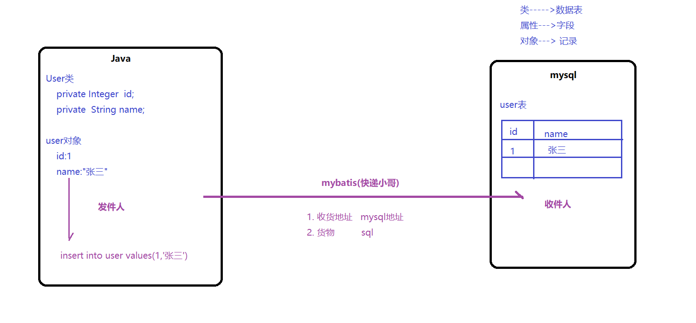
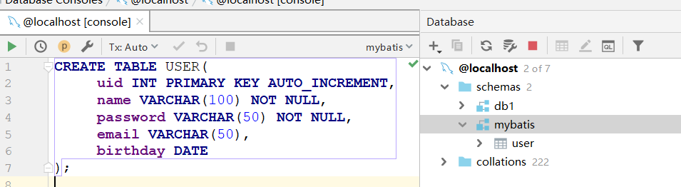
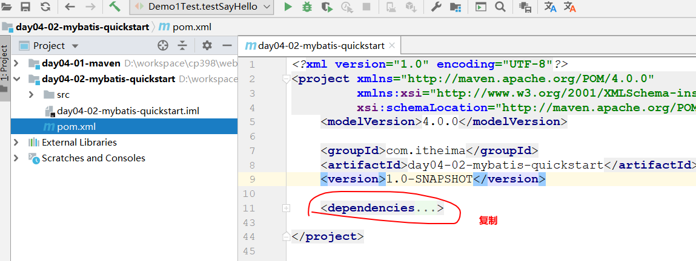
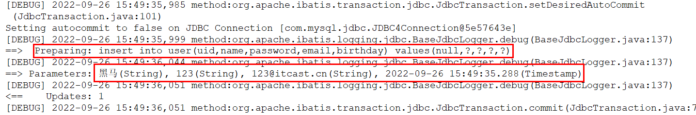
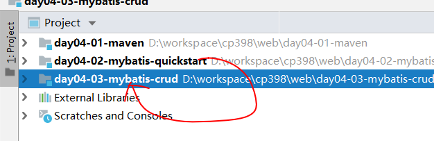
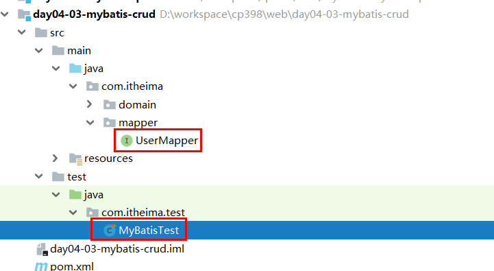
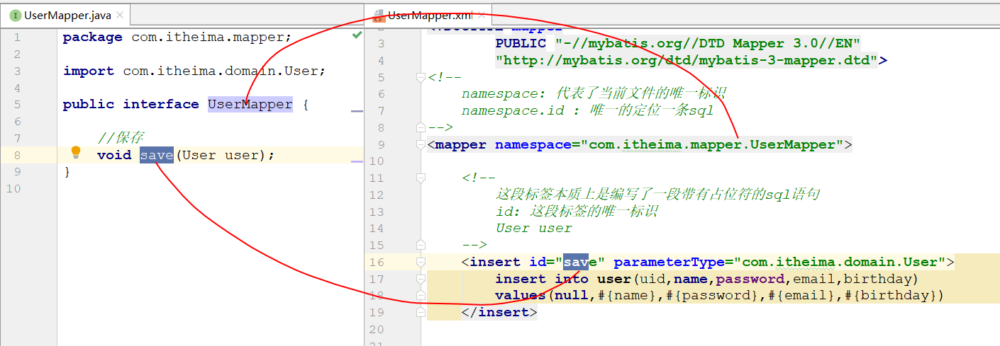
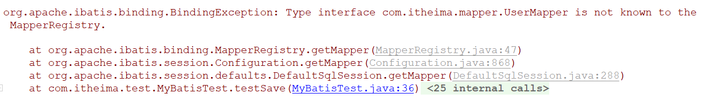
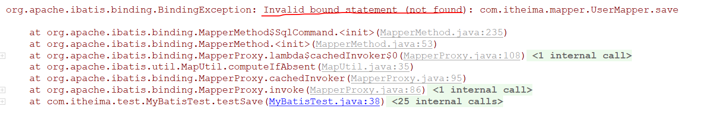

# Mybatis(insert，update，delete)
[toc]
## 简介

### 框架

> 框架可以理解为半成品软件，框架做好以后，程序员只需要在它基础上继续进行后面的开发
>
> 框架中一般都是所有程序员都需要开发的重复代码，框架将这些做好之后，程序员就可以把精力专注在核心业务上


### Mybatis

>MyBatis是一款优秀的持久层框架，它底层封装的是JDBC。
>
>使用Mybatis之后，程序员就不再需要像JDBC那样去写复杂代码来设置参数、处理结果集等。
>
>而是采用简单的==XML配置 + 接口方法==的形式实现对数据库的增删改查操作，使得让==程序员只关注sql本身==。


## 入门案例

>使用mybatis技术将一个user对象保存到数据库的user表中



### 准备数据环境



### 创建模块,添加依赖



~~~xml
    <dependencies>
        <!--mysql-->
        <dependency>
            <groupId>mysql</groupId>
            <artifactId>mysql-connector-java</artifactId>
            <version>5.1.47</version>
        </dependency>
        <!--mybatis-->
        <dependency>
            <groupId>org.mybatis</groupId>
            <artifactId>mybatis</artifactId>
            <version>3.5.9</version>
        </dependency>
        <!--lombok-->
        <dependency>
            <groupId>org.projectlombok</groupId>
            <artifactId>lombok</artifactId>
            <version>1.18.22</version>
        </dependency>
        <!--log4j-->
        <dependency>
            <groupId>log4j</groupId>
            <artifactId>log4j</artifactId>
            <version>1.2.17</version>
        </dependency>
        <!--junit-->
        <dependency>
            <groupId>junit</groupId>
            <artifactId>junit</artifactId>
            <version>4.13.2</version>
        </dependency>
    </dependencies>
~~~

### 创建User类

> domain   pojo   entity都可以为实体类的包名

```java
import lombok.Data;

import java.util.Date;

@Data
public class User {
    private Integer uid;
    private String name;
    private String password;
    private String email;
    private Date birthday;
}
```

### 创建映射文件(sql)
> 映射文件：UserMapper.xml
```xml
<?xml version="1.0" encoding="UTF-8" ?>
<!DOCTYPE mapper
        PUBLIC "-//mybatis.org//DTD Mapper 3.0//EN"
        "https://mybatis.org/dtd/mybatis-3-mapper.dtd">
<!--
    namespace: 代表了当前文件的唯一标识
    namespace.id : 唯一的定位一条sql
-->
<mapper namespace="UserMapper">

    <!--
           这段标签本质上是编写了一段带有占位符的sql语句
           id: 这段标签的唯一标识
           User user
       -->
    <insert id="insert" parameterType="com.itheima.domain.User">
        insert into user values(null,#{name},#{password},#{email},#{birthday})
    </insert>
</mapper>
```

### 创建主配置文件(数据库信息)
```xml
<?xml version="1.0" encoding="UTF-8" ?>
<!DOCTYPE configuration
        PUBLIC "-//mybatis.org//DTD Config 3.0//EN"
        "https://mybatis.org/dtd/mybatis-3-config.dtd">
<configuration>
    <environments default="development">
        <environment id="development">
            <transactionManager type="JDBC"/>
            <dataSource type="POOLED">
                <property name="driver" value="com.mysql.jdbc.Driver"/>
                <property name="url" value="jdbc:mysql://localhost:3306/db1?useUnicode=true&amp;characterEncoding=utf8"/>
                <property name="username" value="root"/>
                <property name="password" value="123"/>
            </dataSource>
        </environment>
    </environments>
    <mappers>
        <mapper resource="UserMapper.xml"/>
    </mappers>
</configuration>
```
### 日志配置文件(log4j.properties)
```properties
### 设置###
log4j.rootLogger = debug,stdout

### 输出信息到控制抬 ###
log4j.appender.stdout = org.apache.log4j.ConsoleAppender
log4j.appender.stdout.Target = System.out
log4j.appender.stdout.layout = org.apache.log4j.PatternLayout
log4j.appender.stdout.layout.ConversionPattern = [%-5p] %d{yyyy-MM-dd HH:mm:ss,SSS} method:%l%n%m%n
```
### 测试(了解)

~~~java
package com.itheima.test;

import com.itheima.domain.User;
import org.apache.ibatis.io.Resources;
import org.apache.ibatis.session.SqlSession;
import org.apache.ibatis.session.SqlSessionFactory;
import org.apache.ibatis.session.SqlSessionFactoryBuilder;
import org.junit.Test;

import java.io.IOException;
import java.io.InputStream;
import java.util.Date;

public class MyBatisTest {

    @Test
    public void testSave() throws IOException {
        //0. 准备一个User对象
        User user = new User();
        user.setName("黑马");
        user.setPassword("123");
        user.setBirthday(new Date());
        user.setEmail("123@itcast.cn");

        //1. 读取配置文件,读成数据流
        InputStream inputStream = Resources.getResourceAsStream("SqlMapConfig.xml");

        //2. 创建SqlSessionFactory
        SqlSessionFactory sqlSessionFactory = new SqlSessionFactoryBuilder().build(inputStream);

        //3. 获取SqlSession(用来执行sql语句)
        SqlSession sqlSession = sqlSessionFactory.openSession();

        //4. 执行sql
        //参数一: 办成品sql的标识
        //参数二: 半成品sql中占位符位置需要的值
        //上面两者加在一起就是一个完整的sql
        sqlSession.insert("UserMapper.save",user);

        //5. 提交事务(mybatis默认情况下,不会自动提交事务)
        sqlSession.commit();

        //6. 释放资源
        sqlSession.close();

    }
}
~~~



## api介绍

~~~markdown
* Resources
        InputStream inputStream = Resources.getResourceAsStream("SqlMapConfig.xml");
        将配置文件读取成一个输入流
	
* SqlSessionFactoryBuilder
        SqlSessionFactory sqlSessionFactory = new SqlSessionFactoryBuilder().build(inputStream);
        用于创建SqlSessionFactory
		
* SqlSessionFactory
        此对象项目创建,它就创建;项目停止,它就销毁
        SqlSession sqlSession = sqlSessionFactory.openSession();
        用于获取SqlSession

* SqlSession
        次对象用的时候就创建,用完就销毁
        UserDao userDao = sqlSession.getMapper(UserDao.class);
        用于获取代理对象
~~~


# 创建持久层（重点）

>前面将操作数据库的代码写到了测试类中，这显然是不合理的，我们需要将其写到一个具体的类的方法中，以供其它类来调用

## 传统方式(了解)

>此方式比较简单，直接创建一个接口和一个实现类，然后将测试类中的代码转移过来即可

### 创建Mapper接口
```java
import com.itheima.domain.User;

public interface UserMapper {
    void insert(User user);
}
```
### 创建Mapper实现类
```java
import com.itheima.domain.User;
import org.apache.ibatis.io.Resources;
import org.apache.ibatis.session.SqlSession;
import org.apache.ibatis.session.SqlSessionFactory;
import org.apache.ibatis.session.SqlSessionFactoryBuilder;

import java.io.InputStream;

public class UserMapperImpl implements UserMapper{
    @Override
    public void insert(User user) {
        try {
            //1、读取配置文件，读成数据流
            InputStream inputStream = Resources.getResourceAsStream("SqlMapConfig.xml");
            //2、创建SqlSessionFactory
            SqlSessionFactory sqlSessionFactory = new SqlSessionFactoryBuilder().build(inputStream);
            //3、获取SqlSession(用来执行SQL语句)
            SqlSession sqlSession = sqlSessionFactory.openSession();
            //4、执行SQL
            //参数一: 办成品sql的标识
            //参数二: 半成品sql中占位符位置需要的值
            //上面两者加在一起就是一个完整的sql
            sqlSession.insert("UserMapper.insert",user);
            //5、提交事务(mybatis默认下，不会自动提交事务)
            sqlSession.commit();
            //6、释放资源
            sqlSession.close();
        }catch (Exception e){
            e.printStackTrace();
        }
    }
}

```
### 测试
```java
import com.itheima.domain.User;
import com.itheima.mapper.UserMapper;
import com.itheima.mapper.UserMapperImpl;
import org.junit.Test;

import java.util.Date;

public class UserMapperTest {
    @Test
    public void testInsert(){
        User user = new User();
        user.setName("张三");
        user.setPassword("123");
        user.setBirthday(new Date());
        user.setEmail("123@qq.com");

        //1、得到UserMapper对象
        UserMapper userMapper = new UserMapperImpl();
        userMapper.insert(user);
    }
}

```


## 接口代理方式(重点)

>==只要告诉Mybatis，Mapper接口和接口中每个方法对应的sql标识，Mybatis就可以自动生成接口的对应对象==

### 复制工程



### 删除Mapper实现类



### 约定

>映射文件中namespace的值，要跟接口全限定名保持一致  
>映射文件中statementId的值，要跟接口中方法名保持一致



### 测试
```java
import com.itheima.domain.User;
import com.itheima.mapper.UserMapper;
import org.apache.ibatis.io.Resources;
import org.apache.ibatis.session.SqlSession;
import org.apache.ibatis.session.SqlSessionFactory;
import org.apache.ibatis.session.SqlSessionFactoryBuilder;
import org.junit.Test;

import java.io.InputStream;
import java.util.Date;

public class MyBatisTest {
    @Test
    public void testInsert() throws Exception {
        //0. 准备一个User对象
        User user = new User();
        user.setName("李四");
        user.setPassword("123");
        user.setBirthday(new Date());
        user.setEmail("123@itcast.cn");
        //1、读取配置文件，读成数据流
        InputStream inputStream = Resources.getResourceAsStream("SqlMapConfig.xml");
        //2、创建SqlSessionFactory
        SqlSessionFactory sqlSessionFactory = new SqlSessionFactoryBuilder().build(inputStream);
        //3、获取SqlSession(用来执行SQL语句)
        SqlSession sqlSession = sqlSessionFactory.openSession();
        //约定大于编程
        //4. 通过sqlSession对象获取UserMapper的对象
        UserMapper mapper = sqlSession.getMapper(UserMapper.class); //UserMapper.save
        mapper.insert(user);
        //5、提交事务(mybatis默认下，不会自动提交事务)
        sqlSession.commit();
        //6、释放资源
        sqlSession.close();
    }
}
```
### mybatis常见的错误
> ==UserMapper接口的对象创建不出来==



>==方法和id对不上==




# 增删改操作（重点）

>Mybatis使用三步骤:
>
>1. 在接口中添加方法声明
>2. 在映射文件中添加sql语句
>3. 在测试类中添加测试方法
## 增加
> 以上操作为增加操作
## 修改

### 接口
> 在接口中添加修改的抽象方法

```java
void update(User user);
```

### 映射
> 在UserMapper.xml映射文件中添加一下内容
```xml
 <update id="update" parameterType="com.itheima.domain.User">
        update user set name=#{name},password=#{password},email=#{email},birthday=#{birthday} where uid = #{uid}
    </update>
```

### 测试
> 在MyBatisTest测试文件中添加
```java
 @Test
    public void testUpdate() throws Exception{
        //0. 准备一个User对象
        User user = new User();
        user.setName("张三");
        user.setPassword("123");
        user.setBirthday(new Date());
        user.setEmail("123@itcast.cn");
        user.setUid(8);
        //1、读取配置文件，读成数据流
        InputStream inputStream = Resources.getResourceAsStream("SqlMapConfig.xml");
        //2、创建SqlSessionFactory
        SqlSessionFactory sqlSessionFactory = new SqlSessionFactoryBuilder().build(inputStream);
        //3、获取SqlSession(用来执行SQL语句)
        SqlSession sqlSession = sqlSessionFactory.openSession();
        //约定大于编程
        //4. 通过sqlSession对象获取UserMapper的对象
        UserMapper mapper = sqlSession.getMapper(UserMapper.class);
        
        mapper.update(user);
        
        //5、提交事务(mybatis默认下，不会自动提交事务)
        sqlSession.commit();
        //6、释放资源
        sqlSession.close();
    }
```


## 删除

### 接口

> 在接口中添加删除的抽象方法

```java
void delete(Integer id);
```

### 映射
> 在UserMapper.xml映射文件中添加一下内容

```xml
<delete id="delete" parameterType="java.lang.Integer">
        delete from user where uid = #{id}
</delete>
```
### 测试
> 在MyBatisTest测试文件中添加

```java
@Test
    public void testDate() throws Exception{
        //0. 准备一个User对象
        //1、读取配置文件，读成数据流
        InputStream inputStream = Resources.getResourceAsStream("SqlMapConfig.xml");
        //2、创建SqlSessionFactory
        SqlSessionFactory sqlSessionFactory = new SqlSessionFactoryBuilder().build(inputStream);
        //3、获取SqlSession(用来执行SQL语句)
        SqlSession sqlSession = sqlSessionFactory.openSession();
        //约定大于编程
        //4. 通过sqlSession对象获取UserMapper的对象
        UserMapper mapper = sqlSession.getMapper(UserMapper.class); //UserMapper.save
        mapper.delete(8);
        //5、提交事务(mybatis默认下，不会自动提交事务)
        sqlSession.commit();
        //6、释放资源
        sqlSession.close();
    }
```
