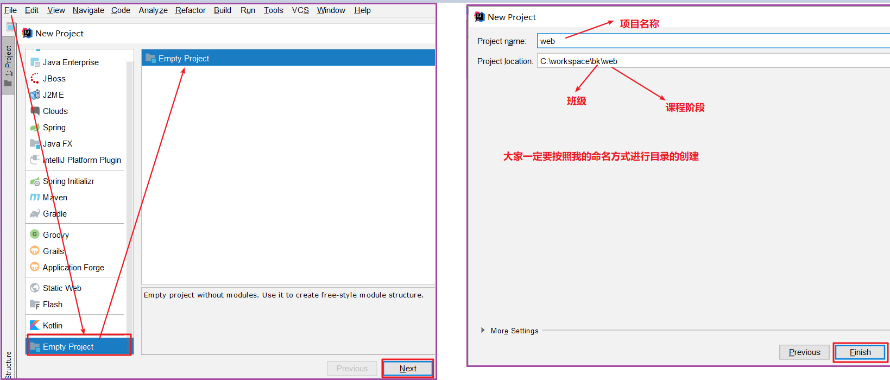

# maven
[toc]
## 安装
### 下载

>官网地址：https://maven.apache.org，目前资料中已经提供好了下载包，推荐大家使用我提供的

### 安装

>将压缩包解压到一个==没有中文，没有空格==的目录

### 目录

>bin：maven的命令所在目录
>
>conf：配置文件所在目录

### 配置

>我们需要行配置maven的本地仓库位置和远程仓库镜像

**① 配置本地仓库的目录位置**

**② 配置阿里云镜像**

> 默认情况下,当本地没有需要的依赖的时候,maven会从apache的中央仓库下载,速度非常慢,在这里配置成阿里云的仓库地址

~~~xml
  <mirrors>
    <!--阿里镜像-->
    <mirror>
      <id>alimaven</id>
      <name>aliyun maven</name>
      <url>http://maven.aliyun.com/nexus/content/groups/public/</url>
      <mirrorOf>central</mirrorOf>       
    </mirror>
  </mirrors>
~~~

### 复制本地仓库

### 配置环境变量

>注意：添加的位置一定是按照自己软件的安装位置写，不要照抄， 而且要到bin一级目录

### 测试

>启动cmd， 在电脑的任意位置使用`mvn -version`进行测试

## 标准结构

>使用maven构建的项目，必须按照maven规定的结构来存放我们的代码

~~~markdown
* pom.xml------------------------------------------------------------这是maven要使用的当前项目的配置文件
* target ------------------------------------------------------------这是存储项目构建过程中产生的文件的(这个文件如果不存在会自动创建)
* src    ------------------------------------------------------------这是项目的资源文件
   |--main -------------------------------------------------------- 这是当前项目的正式文件
   		|-- java-----------------------------------------------存放的是正式的java文件       
   		|-- resources------------------------------------------存放的是正式的配置文件
   |--test -------------------------------------------------------- 这是当前项目的测试文件
		|-- java-----------------------------------------------存放的是测试的java文件       
		|-- resources------------------------------------------存放的是测试的配置文件(这个目录一般是没有的)
~~~

## 常见命令

> maven可以基于命令快速完成项目构建，下面来看一些常见的命令

> >掌握每个命令的作用是什么,尤其是clean package install三个命令后面常用

### clean

> 清理命令，执行clean会删除target目录, 即清理掉上一次项目构建产生的文件

### compile

> 编译命令，作用是将 src/main/java 下的文件(正式的java文件)编译为class文件输出到target目录下

### test

> 测试命令，作用是执行 src/test/java 下的测试类，并编译为class文件输出到target目录下

### package

> 打包命令，打的是所有的正式代码(src/main)  对于java工程执行package打成jar包  
> 可以将工具类以及可以重复使用的代码等打包成jar包以供自己使用

### install

> 安装命令，将打好包安装到本地maven仓库  
> 使用该命令可以将前面的自己的jar包导入

### deploy

> 部署命令，将打好的包部署到私服中

# 搭建工程（重点）
## 配置环境

> ==千万注意:下面的操作必须要先切换到idea的主界面,然后再进行==  
> 退出代码界面是： File---> close project

### 设置maven

> Settings-->Build--->Build Tools-->maven 设置maven的三个相关位置

> IDEA 2019版本

> IDEA 2021.1.3版本

### 设置字符集

> Settings--->Editor-->File Encodings-->设置字符集全部为UTF-8

## 创建工程

### 创建空工程

> 创建这个工程的目的是为了方便代码的管理，我们以后每天的代码都会在这个工程中新建模块来开发

### 统一JDK

> File-->Project Structure-->Project-->将JDK设置为1.8

### 创建maven工程

>在web工程下新一个今天的模块，注意要选择maven模块

### 编写项目标识

### 编写项目名字

> IDEA 2019版本界面

> IDEA 2021.1.3版本界面

## 工程使用

### 编写主类

### 导入依赖

### 编写测试类

## 依赖范围

~~~markdown
* maven运行程序员精确控制一个依赖在哪个过程中生效，它支持的依赖范围主要有下面几种:
	compile： 依赖在编译、测试、运行时都有效，这也是默认配置
	test：    依赖在测试时有效，编译和运行时不需要
	provided：依赖在编译、测试时有，运行时不需要
	runtime： 依赖在测试、运行时有效，编译时不需要
~~~

 

> 使用方式

