# maven（理解）

## 介绍

> >使用maven构建的项目,如何向项目中引入jar包?

> Maven是一个项目管理工具，它的作用就是管理项目，主要体现在两个方面：`依赖管理`和`项目构建`。

### 依赖管理

>依赖管理主要指的是项目怎样引入依赖包，maven会将所有需要的依赖包放在本地仓库中，然后每个项目通过配置文件引入自己所需要的那部分

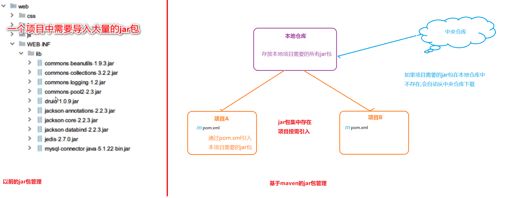 

>jar包在maven本地仓库中是按照什么结构存放的？

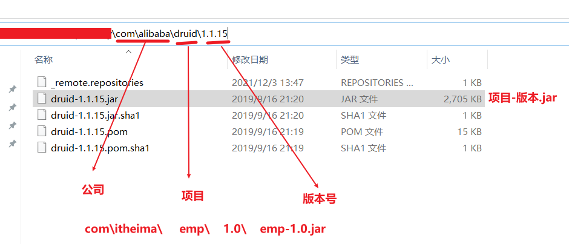 

>我们的项目应该怎么获取对应的jar包 

 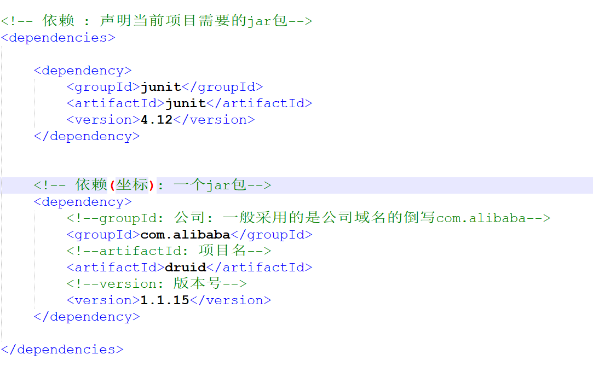 

> 本地仓库没有jar包从哪里下载 

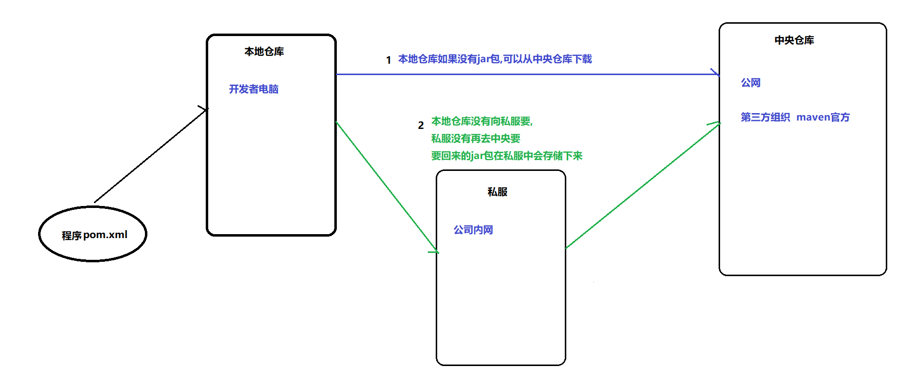 

### 项目构建

> 项目构建：一个项目开发完毕之后的（清理  编译  测试 打包  安装 部署）过程可以使用maven的命令轻松完成
>

> >练习一下:使用maven构建项目,下面哪个仓库是必须要有的?
> >
> >A.  本地仓库                 B. 私服                    C.中央仓库

## 安装

> >无需记忆步骤,但是需要根据笔记将maven安装好,并且知道每个步骤的作用是什么

### 下载

>官网地址：https://maven.apache.org，目前资料中已经提供好了下载包，推荐大家使用我提供的

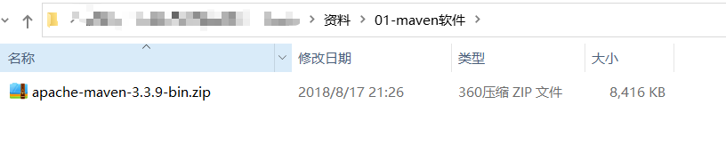  

### 安装

>将压缩包解压到一个==没有中文，没有空格==的目录

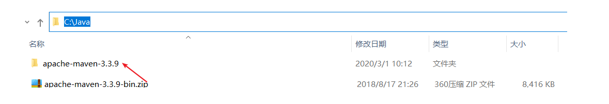 

### 目录

>bin：maven的命令所在目录
>
>conf：配置文件所在目录

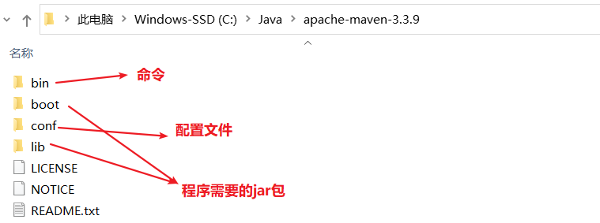   

### 配置

>我们需要行配置maven的本地仓库位置和远程仓库镜像

**① 配置本地仓库的目录位置**

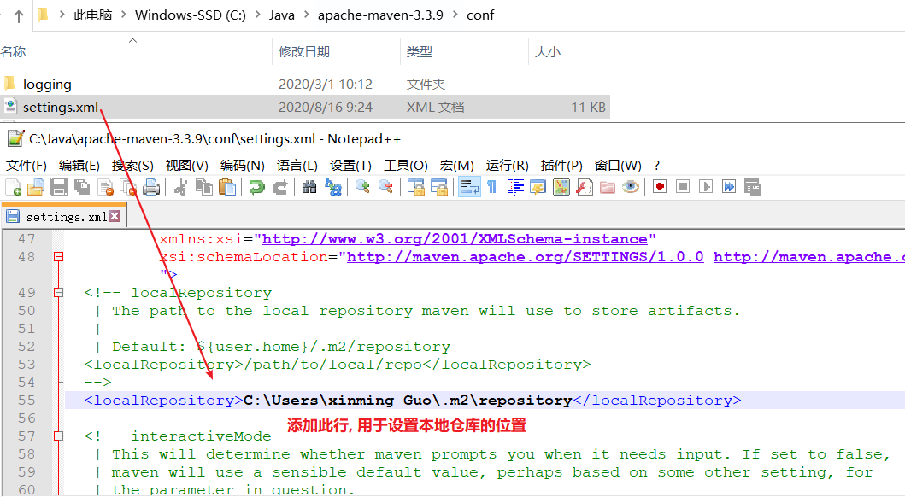  

**② 配置阿里云镜像**

> 默认情况下,当本地没有需要的依赖的时候,maven会从apache的中央仓库下载,速度非常慢,在这里配置成阿里云的仓库地址

~~~xml
  <mirrors>
    <!--阿里镜像-->
    <mirror>
      <id>alimaven</id>
      <name>aliyun maven</name>
      <url>http://maven.aliyun.com/nexus/content/groups/public/</url>
      <mirrorOf>central</mirrorOf>       
    </mirror>
  </mirrors>
~~~

 

### 复制本地仓库

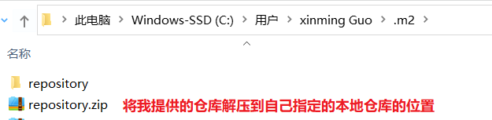  

### 配置环境变量

>注意：添加的位置一定是按照自己软件的安装位置写，不要照抄我的， 而且要到bin一级目录

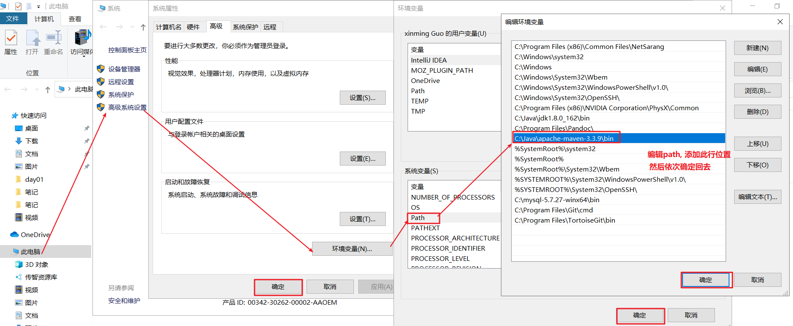 

### 测试

>启动cmd， 在电脑的任意位置使用`mvn -version`进行测试

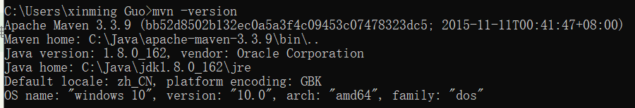 

## 标准结构

>使用maven构建的项目，必须按照maven规定的结构来存放我们的代码

~~~markdown
* pom.xml------------------------------------------------------------这是maven要使用的当前项目的配置文件
* target ------------------------------------------------------------这是存储项目构建过程中产生的文件的(这个文件如果不存在会自动创建)
* src    ------------------------------------------------------------这是项目的资源文件
   |--main -------------------------------------------------------- 这是当前项目的正式文件
   		|-- java-----------------------------------------------存放的是正式的java文件       
   		|-- resources------------------------------------------存放的是正式的配置文件
   |--test -------------------------------------------------------- 这是当前项目的测试文件
		|-- java-----------------------------------------------存放的是测试的java文件       
		|-- resources------------------------------------------存放的是测试的配置文件(这个目录一般是没有的)
~~~

## 常见命令

> maven可以基于命令快速完成项目构建，下面来看一些常见的命令

> >掌握每个命令的作用是什么,尤其是clean package install三个命令后面常用

### clean

> 清理命令，执行clean会删除target目录, 即清理掉上一次项目构建产生的文件

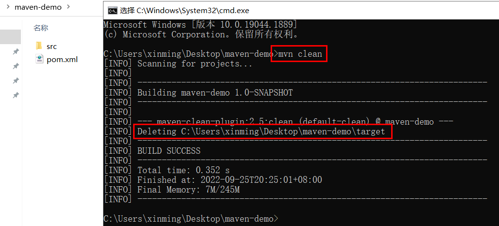 

### compile

> 编译命令，作用是将 src/main/java 下的文件(正式的java文件)编译为class文件输出到target目录下

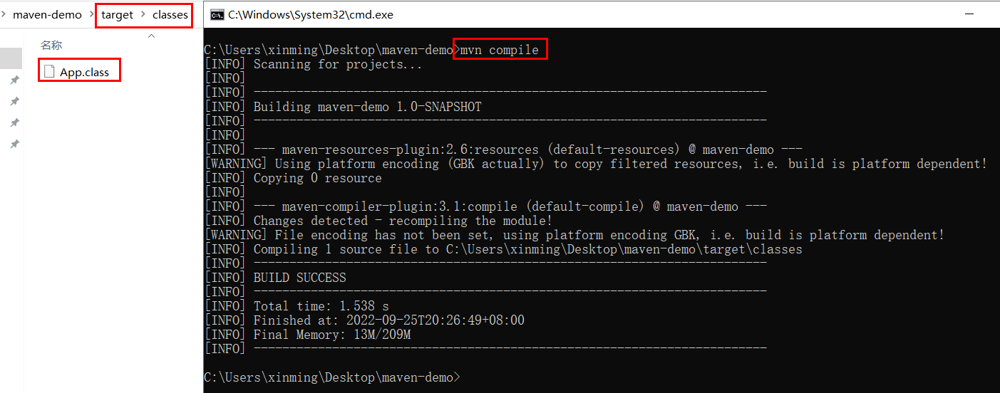 

### test

> 测试命令，作用是执行 src/test/java 下的测试类，并编译为class文件输出到target目录下

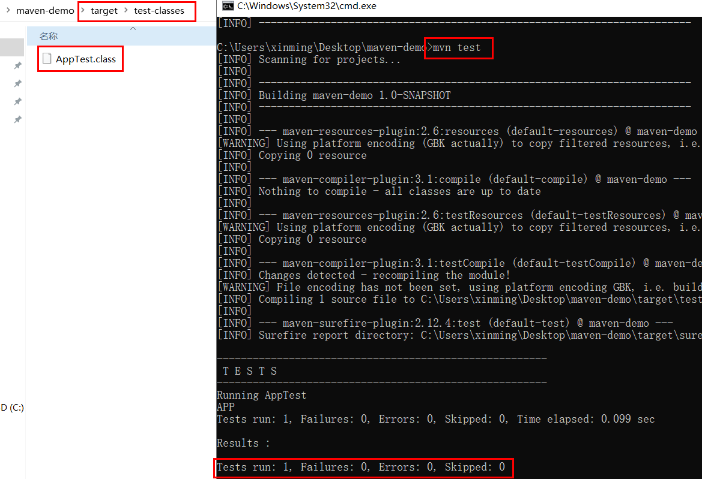 

### package

> 打包命令，打的是所有的正式代码(src/main)  对于java工程执行package打成jar包

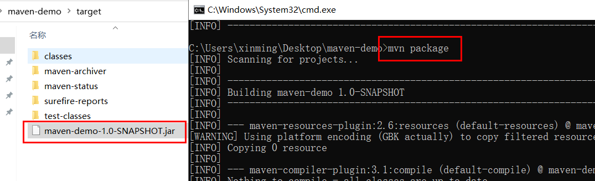  

### install

> 安装命令，将打好包安装到本地maven仓库

 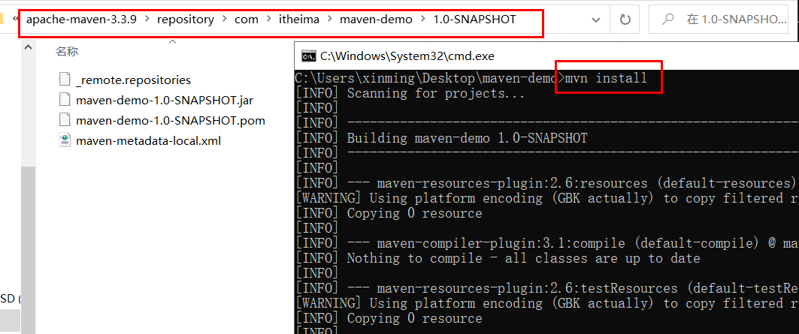 

### deploy

> 部署命令，将打好的包部署到私服中

> >练习一下: 下面哪个命令可以实现把一个项目打成jar包,并放进本地仓库
> >
> >A. package                     B. install                      C.deploy

# 搭建工程（重点）

>> 本章节介绍如何在idea中配置使用maven软件,内容不难,但是大家很容易搞错,所以强制要求大家第一次看着视频做

## 配置环境

> ==千万注意:下面的操作必须要先切换到idea的主界面,然后再进行==

### 设置maven

>Settings-->Build--->Build Tools-->maven 设置maven的三个相关位置

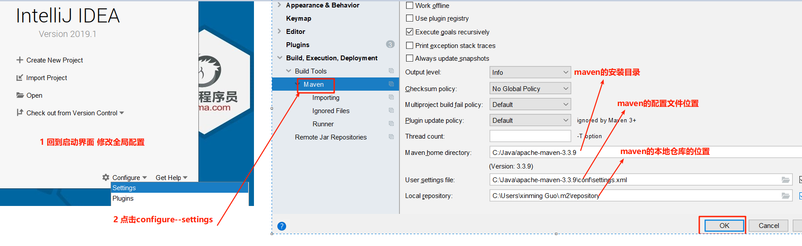  

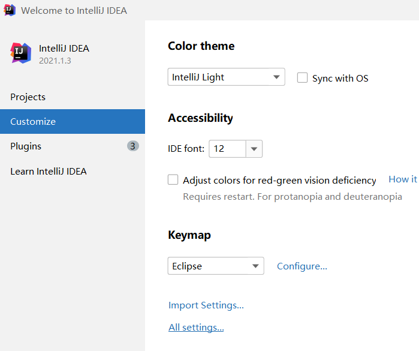 

### 设置字符集

> Settings--->Editor-->File Encodings-->设置字符集全部为UTF-8

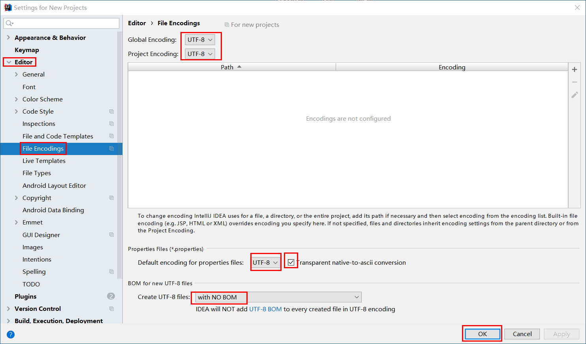

## 创建工程

### 创建空工程

> 创建这个工程的目的是为了方便代码的管理，我们以后每天的代码都会在这个工程中新建模块来开发

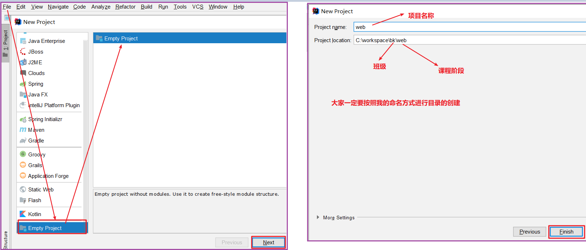

### 统一JDK

> File-->Project Structure-->Project-->将JDK设置为1.8

 

### 创建maven工程

 >在web工程下新一个今天的模块，注意要选择maven模块

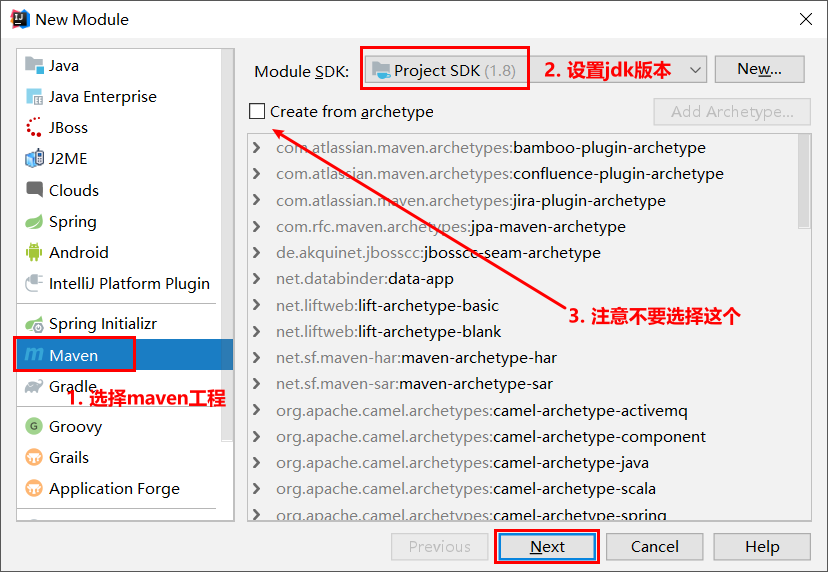 

### 编写项目标识

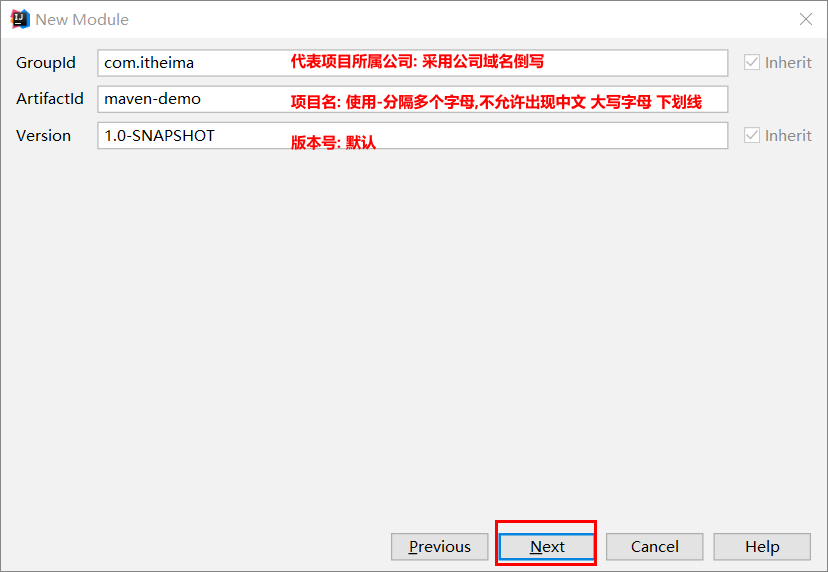 

### 编写项目名字 

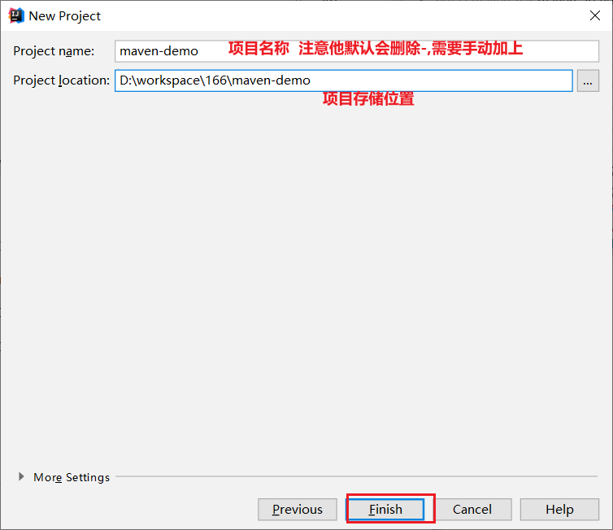 

 

## 工程使用

### 编写主类

 

### 导入依赖

 

### 编写测试类

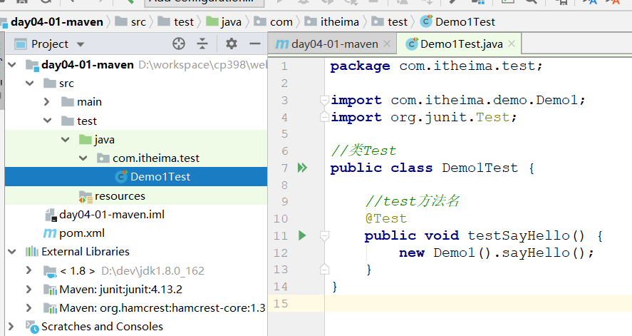 

## 依赖范围

~~~markdown
* maven运行程序员精确控制一个依赖在哪个过程中生效，它支持的依赖范围主要有下面几种:
	compile： 依赖在编译、测试、运行时都有效，这也是默认配置
	test：    依赖在测试时有效，编译和运行时不需要
	provided：依赖在编译、测试时有，运行时不需要
	runtime： 依赖在测试、运行时有效，编译时不需要
~~~

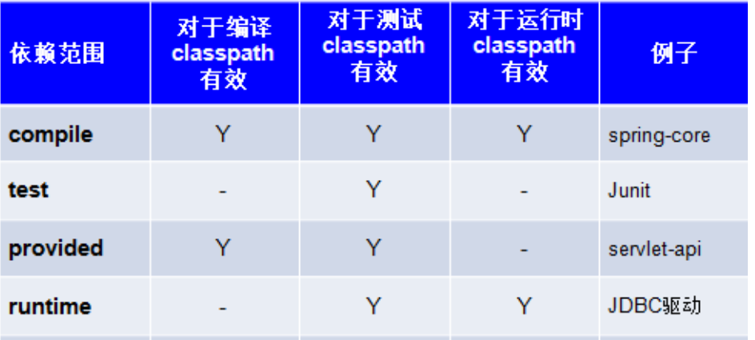  

# Mybatis入门（理解）

## 简介

> >1. 框架是什么? 学习框架的关注点在哪里?
> >2. mybatis框架是来干什么的?

### 框架

> 框架可以理解为半成品软件，框架做好以后，程序员只需要在它基础上继续进行后面的开发 
>
> 框架中一般都是所有程序员都需要开发的重复代码，框架将这些做好之后，程序员就可以把精力专注在核心业务上
>
> ==学习框架, 关注点:  怎么去用这个框架==

### Mybatis

>MyBatis是一款优秀的持久层框架，它底层封装的是JDBC。
>
>使用Mybatis之后，程序员就不再需要像JDBC那样去写复杂代码来设置参数、处理结果集等。
>
>而是采用简单的==XML配置 + 接口方法==的形式实现对数据库的增删改查操作，使得让==程序员只关注sql本身==。

## 入门案例

>使用mybatis技术将一个user对象保存到数据库的user表中

> >1. 体会mybatis的作用?
> >2. 找出案例中最核心的步骤? 看看他们的本质作用是什么?

 

### 准备数据环境 

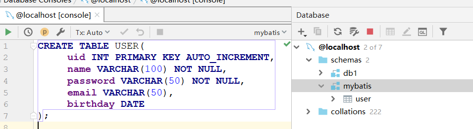 

### 创建模块,添加依赖 

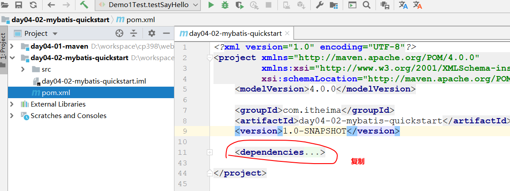 

~~~xml
    <dependencies>
        <!--mysql-->
        <dependency>
            <groupId>mysql</groupId>
            <artifactId>mysql-connector-java</artifactId>
            <version>5.1.47</version>
        </dependency>
        <!--mybatis-->
        <dependency>
            <groupId>org.mybatis</groupId>
            <artifactId>mybatis</artifactId>
            <version>3.5.9</version>
        </dependency>
        <!--lombok-->
        <dependency>
            <groupId>org.projectlombok</groupId>
            <artifactId>lombok</artifactId>
            <version>1.18.22</version>
        </dependency>
        <!--log4j-->
        <dependency>
            <groupId>log4j</groupId>
            <artifactId>log4j</artifactId>
            <version>1.2.17</version>
        </dependency>
        <!--junit-->
        <dependency>
            <groupId>junit</groupId>
            <artifactId>junit</artifactId>
            <version>4.13.2</version>
        </dependency>
    </dependencies>
~~~

### 创建User类 

>domain   pojo   entity

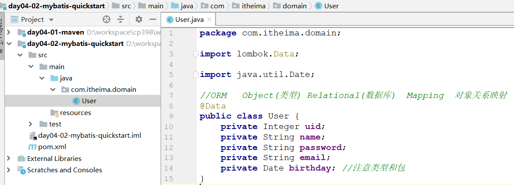 

### 创建映射文件(sql)

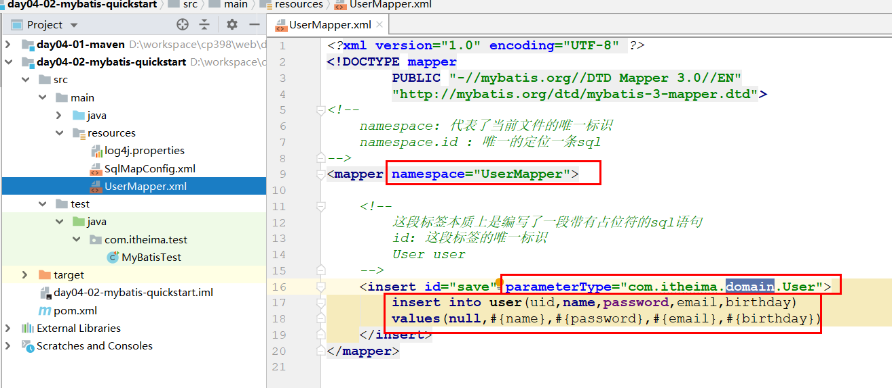  

### 创建主配置文件(数据库信息)

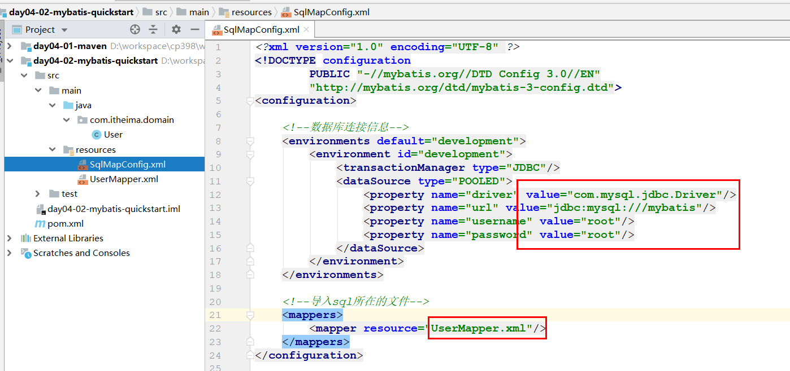 

### 日志配置文件 

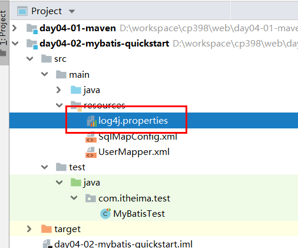 

### 测试(了解)

~~~java
package com.itheima.test;

import com.itheima.domain.User;
import org.apache.ibatis.io.Resources;
import org.apache.ibatis.session.SqlSession;
import org.apache.ibatis.session.SqlSessionFactory;
import org.apache.ibatis.session.SqlSessionFactoryBuilder;
import org.junit.Test;

import java.io.IOException;
import java.io.InputStream;
import java.util.Date;

public class MyBatisTest {

    @Test
    public void testSave() throws IOException {
        //0. 准备一个User对象
        User user = new User();
        user.setName("黑马");
        user.setPassword("123");
        user.setBirthday(new Date());
        user.setEmail("123@itcast.cn");

        //1. 读取配置文件,读成数据流
        InputStream inputStream = Resources.getResourceAsStream("SqlMapConfig.xml");

        //2. 创建SqlSessionFactory
        SqlSessionFactory sqlSessionFactory = new SqlSessionFactoryBuilder().build(inputStream);

        //3. 获取SqlSession(用来执行sql语句)
        SqlSession sqlSession = sqlSessionFactory.openSession();

        //4. 执行sql
        //参数一: 办成品sql的标识
        //参数二: 半成品sql中占位符位置需要的值
        //上面两者加在一起就是一个完整的sql
        sqlSession.insert("UserMapper.save",user);

        //5. 提交事务(mybatis默认情况下,不会自动提交事务)
        sqlSession.commit();

        //6. 释放资源
        sqlSession.close();

    }
}
~~~

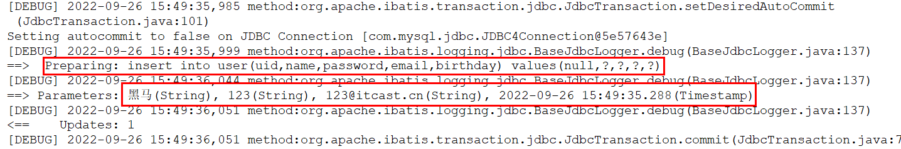 

## api介绍

> 下面四个api了解一下即可

~~~markdown
* Resources
        InputStream inputStream = Resources.getResourceAsStream("SqlMapConfig.xml");
        将配置文件读取成一个输入流
	
* SqlSessionFactoryBuilder
        SqlSessionFactory sqlSessionFactory = new SqlSessionFactoryBuilder().build(inputStream);
        用于创建SqlSessionFactory
		
* SqlSessionFactory
        此对象项目创建,它就创建;项目停止,它就销毁
        SqlSession sqlSession = sqlSessionFactory.openSession();
        用于获取SqlSession

* SqlSession
        次对象用的时候就创建,用完就销毁
        UserDao userDao = sqlSession.getMapper(UserDao.class);
        用于获取代理对象
~~~

# 创建持久层（重点）

>前面将操作数据库的代码写到了测试类中，这显然是不合理的，我们需要将其写到一个具体的类的方法中，以供其它类来调用

## 传统方式(了解)

>此方式比较简单，直接创建一个接口和一个实现类，然后将测试类中的代码转移过来即可

### 创建Mapper接口

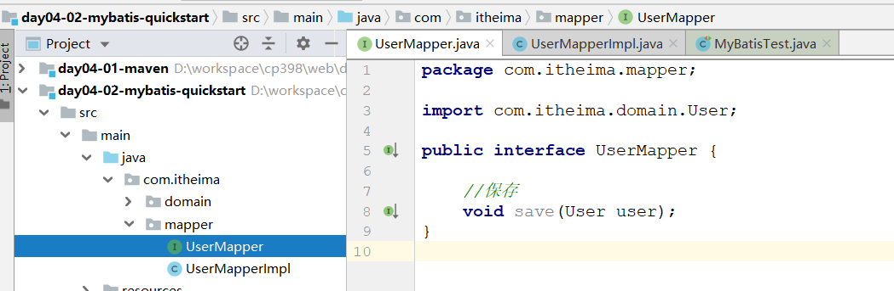 

### 创建Mapper实现类

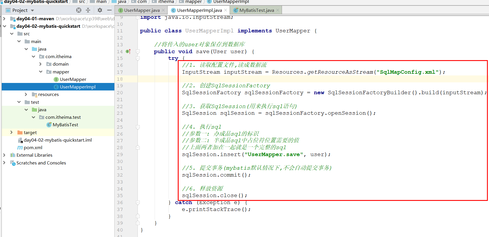 

### 测试

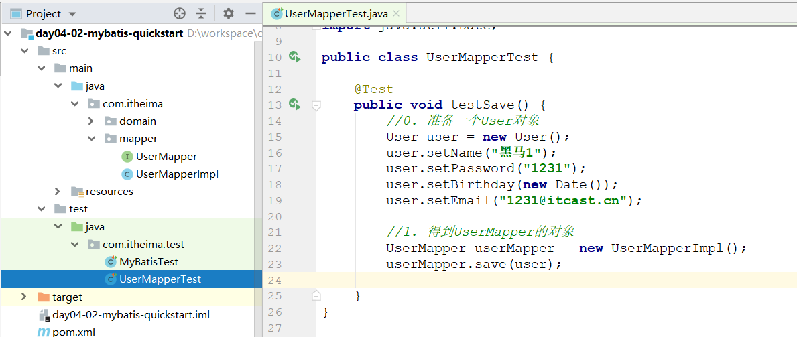 

## 接口代理方式(重点)

>==只要告诉Mybatis，Mapper接口和接口中每个方法对应的sql标识，Mybatis就可以自动生成接口的对应对象==

### 复制工程

> 第一次一定要看着视频做

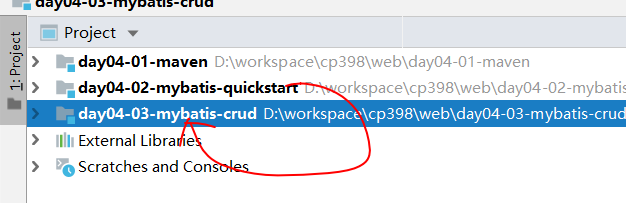 

### 删除Mapper实现类

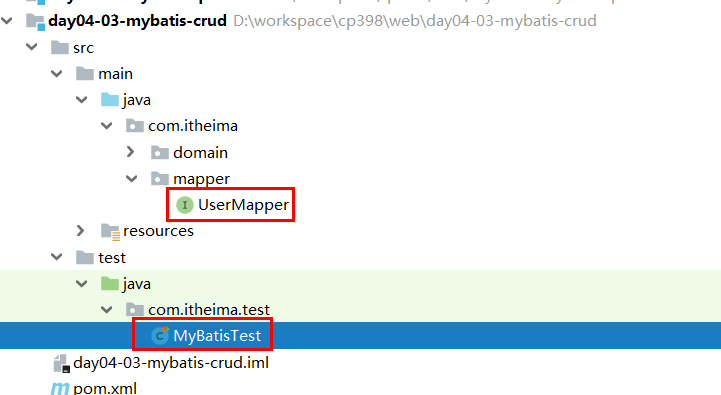 

### 约定

>映射文件中namespace的值，要跟接口全限定名保持一致
>
>映射文件中statementId的值，要跟接口中方法名保持一致

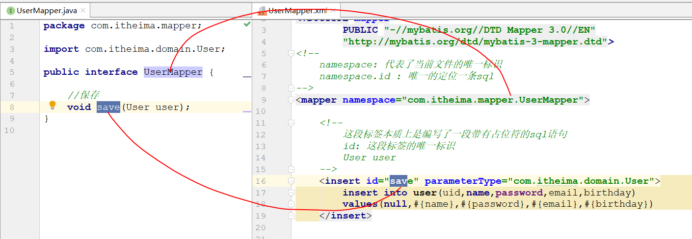 

### 测试

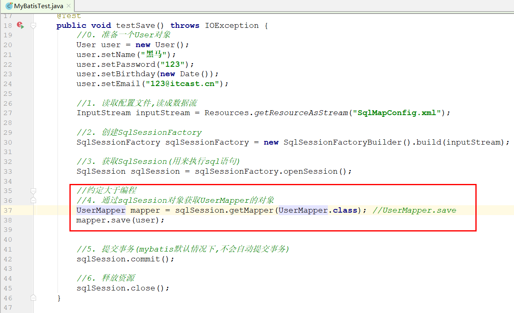  

> ==UserMapper接口的对象创建不出来==

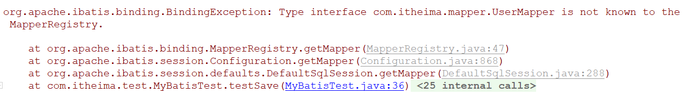 

>==方法和id对不上==

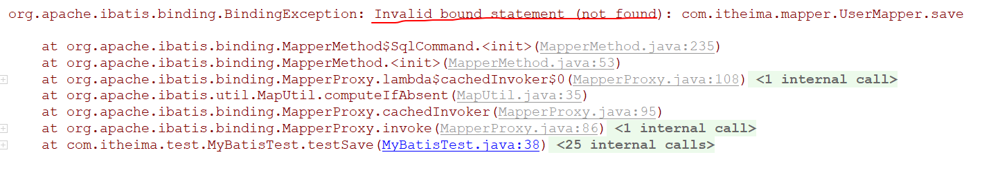 

# 增删改操作（重点）

>Mybatis使用三步骤:
>
>1. 在接口中添加方法声明
>2. 在映射文件中添加sql语句
>3. 在测试类中添加测试方法

## 增加

### 接口

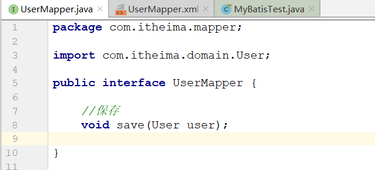 

### 映射

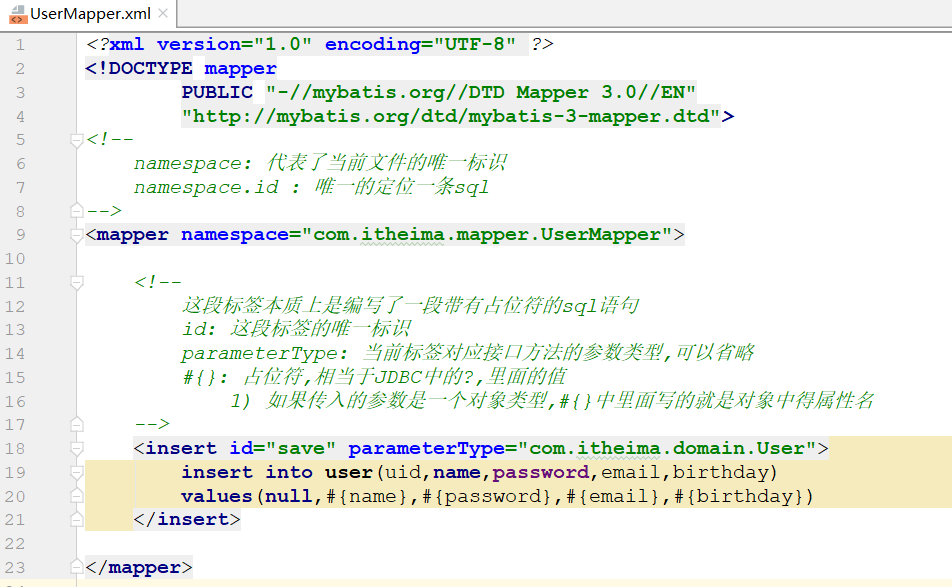 

### 测试

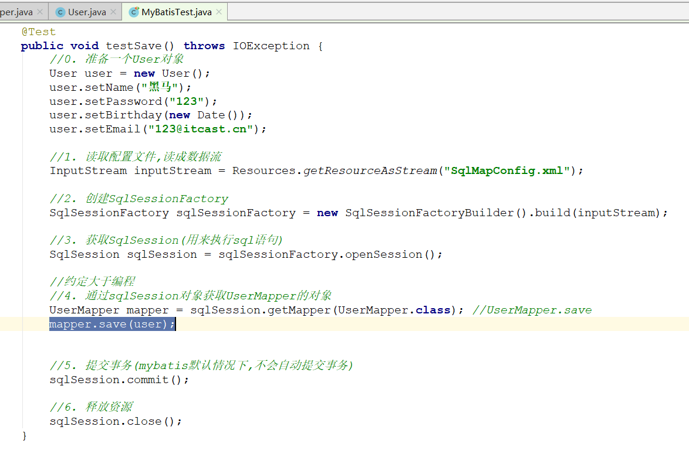 

## 修改

### 接口

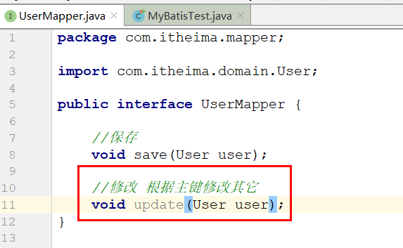 

### 映射

 

### 测试

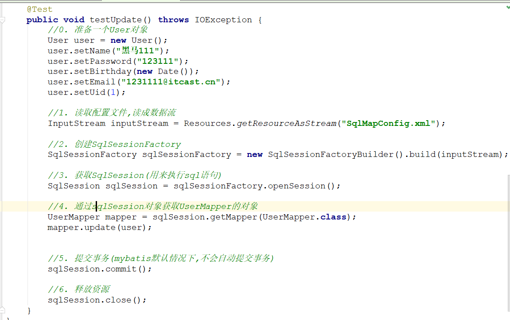 

## 删除

### 接口

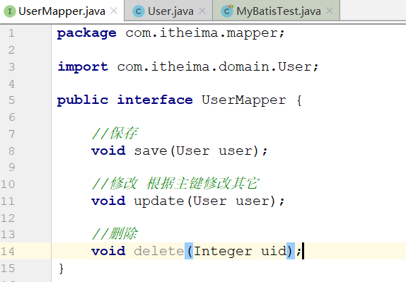 

### 映射

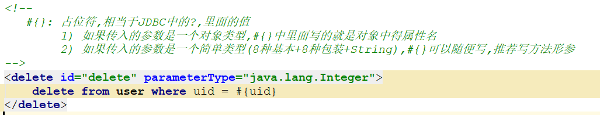 

### 测试

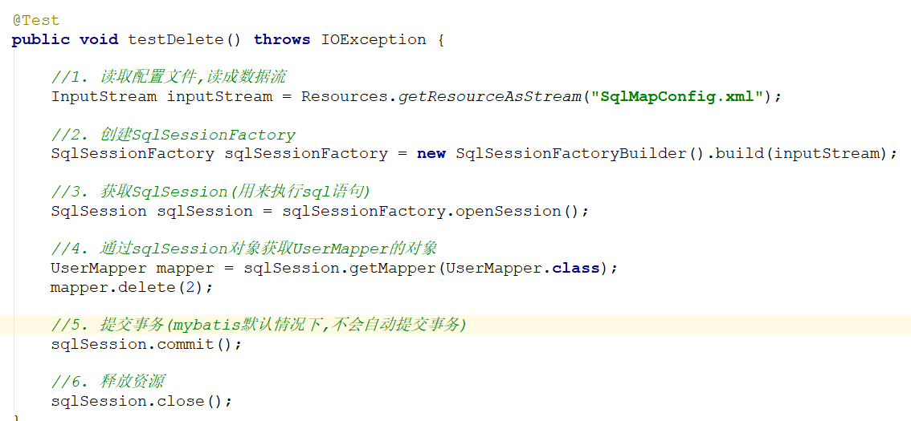 

>==今日任务==
>
>1. 完成mybatis的入门案例
>2. 完成mybatis传统方式实现持久层
>3. 使用mybatis的接口代理方式实现增删改操作(2遍)