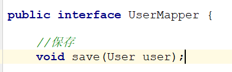
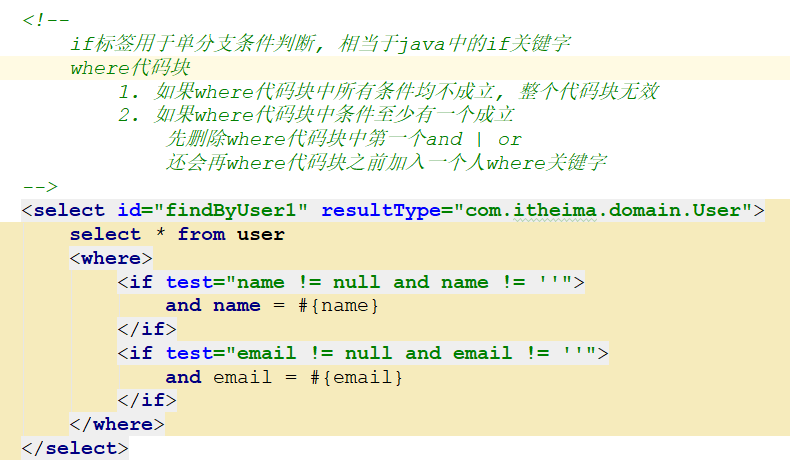
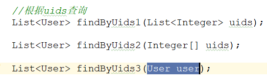

# 工具类

> 目前我们的测试类中依旧有大量的重复代码，我们来抽取成一个工具类

>MybatisUtil

 

>MyBatisTest

 ~~~java
package com.itheima.test;

import com.itheima.domain.User;
import com.itheima.mapper.UserMapper;
import com.itheima.util.MyBatisUtil;
import org.apache.ibatis.io.Resources;
import org.apache.ibatis.session.SqlSession;
import org.apache.ibatis.session.SqlSessionFactory;
import org.apache.ibatis.session.SqlSessionFactoryBuilder;
import org.junit.After;
import org.junit.Before;
import org.junit.Test;

import java.io.IOException;
import java.io.InputStream;
import java.util.Date;

public class MyBatisTest {
    
    private SqlSession sqlSession = null;
    
    @Before//标注的方法会在Test方法之前运行
    public void before(){
        sqlSession = MyBatisUtil.getSqlSession();
    }
    
    @After//标注的方法会在Test方法之后运行
    public void after(){
        MyBatisUtil.commitAndClose(sqlSession);
    }

    @Test
    public void testSave() throws IOException {
        User user = new User();
        user.setName("黑马");
        user.setPassword("123");
        user.setBirthday(new Date());
        user.setEmail("123@itcast.cn");

        UserMapper mapper = sqlSession.getMapper(UserMapper.class); //UserMapper.save
        mapper.save(user);
    }

    @Test
    public void testUpdate() throws IOException {
        User user = new User();
        user.setName("黑马111");
        user.setPassword("123111");
        user.setBirthday(new Date());
        user.setEmail("1231111@itcast.cn");
        user.setUid(1);

        UserMapper mapper = sqlSession.getMapper(UserMapper.class);
        mapper.update(user);
    }

    @Test
    public void testDelete() throws IOException {
        UserMapper mapper = sqlSession.getMapper(UserMapper.class);
        mapper.delete(2);
    }
}

 ~~~

# 查询（重点）

## resultType

> 当数据库返回的结果集中的字段和实体类中的属性名一一对应时，resultType可以自动将结果封装到实体中 

### 接口

 

### 映射

 

### 测试

 

## resultMap

> 当数据库返回的结果集中的字段和实体类中的属性名存在不对应情况时，可以使用resultMap自定义映射关系 

### 接口

 

### 映射 

 

### 测试

 

> ==面试题: resultType 和 resultMap场景区分==

## 单条件查询

### 接口

 

### 映射

 

### 测试 

 

## 多条件查询

### 接口

 

### 映射

 

### 测试

 

## 模糊查询

### 接口

 

### 映射

 

### 测试

 

> ==面试题: #和$的区别==
>
> #表示占位符，相当于JDBC中的?，底层工作的是PreparedStetement对象，SQL只编译一次，而且没有SQL注入问题
> 
> $表示字符串拼接，底层工作的是Statement对象，每次SQL都会重新编译，而且存在SQL注入问题

## 返回主键

> 向数据库保存一个用户后, 然后在控制台记录下此用户的主键值(uid)

### 接口

 

### 映射

 

### 测试 

 

# 动态SQL（重点）

~~~markdown
* 先来看一个需求:
	find(User user) 根据user对象[ name, password, email ]进行查询，将user对象中不为空的属性作为查询条件

* 那么这时候就可能产生多个sql:
	1) 如果用户名和密码不为空
		select * from user where name= #{name} and password = #{password}
	2) 如果用户名和邮箱不为空
		select * from user where name= #{name} and email = #{email}
	3) 如果用户名和密码和邮箱不为空
		select * from user where name= #{name} and password = #{password} and email = #{email} 
~~~

~~~markdown
* 像上面这样，需要根据不同的条件来执行不同的sql语句的情况，就需要用到动态sql。
* 在Mybatis中，动态SQL是通过下面几个标签来实现的：
	if,choose    用于条件判断
	where，set   用于格式控制
	foreach      用于循环遍历	
~~~

## 复制工程

> ==看着视频删除==

 

## if

>~~~markdown
>* 查询findByUser1(User user)  根据user对象(name  email)中不为空的属性进行查询
>	如果name不为空      拼接上name
>	如果email不为空     拼接上email
>	如果两个都不为空     都拼上
>	如果都为空          查询所有	
>~~~
>
>~~~java
>select * from user where
>
>if(name != null){
>   name = #{name}
>}
>if(email != null){
>   email =#{email}
>}
>~~~

### 接口

 

### 映射

 

### 测试

 

### 总结

~~~markdown
* if标签用于单分支条件判断, 相当于java中的if关键字
* where关键字作用:
	1) 当where代码块中的条件都不成立的时候, where代码块不生效
	2) 当where代码块中的条件至少有一个成立的时候
		在代码块之前加入一个where关键字
		当代码块以and|or开头的时候,它会帮你去掉第一个and|or
~~~

## choose

>~~~markdown
>* 查询findByUser2(User user)  根据user对象(name  email)中第一个不为空的属性进行查询
>	如果name不为空               仅仅按照name查询
>	如果name为空email不为空      仅仅按照email查询
>	如果都为空                   查询不到任何信息
>~~~
>
>~~~java
>select * from user where
>
>if(name != null){
>   	name = #{name}
>}else if(email != null){
>   	email = #{email}
>}else{
>  	查询不到任何信息   1=2
>}
>~~~

### 接口

 

### 映射

 

### 测试

 

### 总结

~~~markdown
* choose 用于包含多个条件
* when 用于编写某个条件
* otherwise所有的when都判断失败时，进入此分支
~~~

## set

> 根据uid进行更新一个user对象中不为空的属性

### 接口

 

### 映射

 

### 测试

 

### 总结

~~~markdown
* update标签的作用:  
	1) 在代码块之前加入一个set关键字  
	2) 删除掉代码块中的最后一个,
~~~

## foreach

> 根据uids( 多个uid )查询 一个对象的集合

### 接口

 

### 映射

 

### 测试

 

### 总结

~~~markdown
* foreach 循环遍历
	collection="collection" 指定要遍历的集合或者数组
	item="item"  指定临时变量
	separator=","  指定分隔符
	open="("  指定开始字符
	close=")" 指定结束字符

* collection 会根据传入参数的类型不同而采用不同的值
	集合---collection   
	数组---array   
	实体---实体的属性
~~~

## sql片段

> sql片段的作用是将代码中重复的部分，提取出来达到复用的目的

### 使用 

 

### 总结

~~~markdown
* 定义SQL片段:  <sql id="selectUser"></sql> 
* 引用SQL片段:  <include refid="selectUser"></include> 
~~~

# 配置文件（了解）

>~~~markdown
>* sqlMapConfig.xml 此文件中的标签有严格的顺序要求, 可以省略一部分, 但是不能乱序
>* 主要选项
>	properties: 引入外部的properties文件
>	typeAlias: 给映射文件中实体类起别名
>	environments: 用于配置数据库连接信息和事务管理器
>	mappers: 用于引入映射文件
>~~~

~~~xml
<?xml version="1.0" encoding="UTF-8" ?>
<!DOCTYPE configuration
        PUBLIC "-//mybatis.org//DTD Config 3.0//EN"
        "http://mybatis.org/dtd/mybatis-3-config.dtd">
<configuration>

    <!--读取一个外部的properties文件-->
    <properties resource="db.properties"></properties>

    <typeAliases>
        <!--方式1: type: 原类型  alias 别名-->
        <!--<typeAlias type="com.itheima.domain.User" alias="user"/>-->
        <!--方式2: 指定一个包名, 默认情况下包中所有类都会自动产生一个别名,规则就是类名首字母小写-->
        <!--<package name="com.itheima.domain"/>-->
    </typeAliases>

    <!--数据库连接信息  default: 默认哪个库生效-->
    <environments default="development">
        <!--一个数据库连接 -->
        <environment id="development">
            <transactionManager type="JDBC"/>
            <dataSource type="POOLED">
                <property name="driver" value="${jdbc.driver}"/>
                <property name="url" value="${jdbc.url}"/>
                <property name="username" value="${jdbc.username}"/>
                <property name="password" value="${jdbc.password}"/>
            </dataSource>
        </environment>

        <environment id="test">
            <transactionManager type="JDBC"/>
            <dataSource type="POOLED">
                <property name="driver" value="${jdbc.driver}"/>
                <property name="url" value="${jdbc.url}"/>
                <property name="username" value="${jdbc.username}"/>
                <property name="password" value="${jdbc.password}"/>
            </dataSource>
        </environment>
    </environments>

    <!--导入sql所在的文件-->
    <mappers>
        <!--方式1: 直接指定sql文件的位置-->
        <!--<mapper resource="UserMapper.xml"/>-->
        <!--方式2: 指定接口文件全路径(映射文件和接口文件编译之后必须位于同一个目录下,并且名字一样)-->
        <!--<mapper class="com.itheima.mapper.UserMapper"/>-->
        <!--方式3: 最终方案(映射文件和接口文件编译之后必须位于同一个目录下,并且名字一样)-->
        <package name="com.itheima.mapper"/>
    </mappers>
</configuration>
~~~

 

# 注解（重点）

> 使用注解书写SQL其实是对使用XML书写SQL的一种替代方式，其功能基本一致。

## 导入工程

 

## 增删改查

>增加
>
>查询所有
>
>主键查询
>
>删除

### 接口

 

### 测试

 

## 结果映射

 

## 动态SQL

 

 