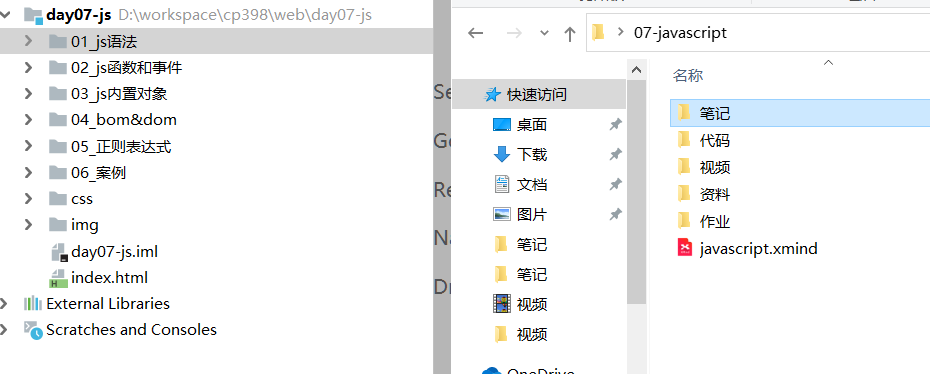
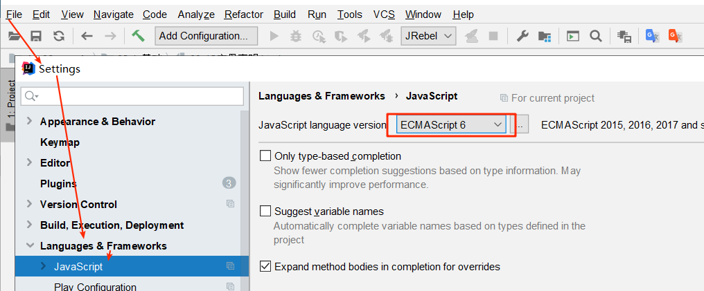
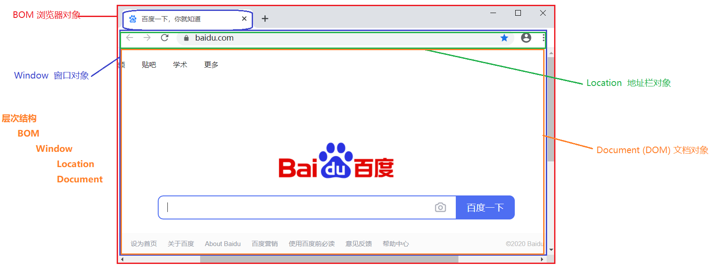

# JS基础（重点）

## 组成部分

>JavaScript是用来实现页面交互的一门编程语言，主要包含下面三部分内容

| **组成部分**    | **作用**                                                     |
| --------------- | ------------------------------------------------------------ |
| **ECMA Script** | 构成了JS核心的语法基础                                       |
| **BOM**         | Browser Object Model 浏览器对象模型，用来操作浏览器上的对象  |
| **DOM**         | Document Object Model 文档对象模型，用来操作网页中的元素（标签） |

 


## 基础语法

### HTML引入JS

> ~~~html
>HTML引入JS有两种种方式:
> 	1. 内部脚本 <script type="text/javascript"> js代码 </script>
> 	2. 外部脚本 <script type="text/javascript" src="外部js文件"></script>
> 		注意: 引入外部脚本时,标签不能自闭合,标签之间也不能编写js代码
>~~~

```html
<!DOCTYPE html>
<html lang="zh-CN">
<head>
    <meta charset="UTF-8">
    <title>HTML引入JS</title>
</head>
<body>
<!--
    内部方式 : 直接在HTML页面中使用<script>嵌入js脚本
    外部方式 : 首先单独定义一个js文件, 再通过script将文件引入到HTML页面中
        细节1: script这个标签必须是双标签
        细节2: script这个标签中间是不能再书写js代码,书写了也无用
-->
<script>
    alert("我是Js内部方式弹的窗");
</script>

<script src="../js/my.js"></script>
</body>
</html>
```

### 输出语句

> ~~~markdown
> JS三种输出方式:
> 	1. 浏览器弹框输出字符   alert('哈哈')
> 	2. 输出html内容到页面   document.write('呵呵')
> 	3. 输出到浏览器控制台   console.log('嘻嘻')
> ~~~

```html
<!DOCTYPE html>
<html lang="zh-CN">
<head>
    <meta charset="UTF-8">
    <title>JS三种输出方式</title>
</head>
<body>
<!--
JS三种输出方式
	1. 浏览器弹框输出字符
	2. 输出html内容到页面
	3. 输出到浏览器控制台
 -->
<script>
    //1. 浏览器弹框输出字符
    alert("浏览器弹框输出字符");

    //2. 输出html内容到页面
    document.write("输出html内容到页面");

    //3. 输出到浏览器控制台
    console.log("输出到浏览器控制台");
</script>

</body>
</html>

```

### 变量声明

> 在JS中声明变量主要用到的关键字是`let`， 声明常量用到的关键字是`const`，而且声明时不用理会数据的类型
>
> ~~~js
> let a = "xxx";
> let a = true;
> let a = 5;
> const PI=3.14;//常量声明之后不能再变动值
> ~~~
>
> 下面变量和常量的声明都是基于JS6版本讲解的, 所以必须先将idea中JS的版本调整为6

 

```html
<!DOCTYPE html>
<html lang="zh-CN">
<head>
    <meta charset="UTF-8">
    <title>JS变量声明</title>

</head>
<body>


<script>
    //let 变量名 = "值"
    //const 常量名 = "值"

    // String str = "用心做教育";
    let str = "用心做教育";
    console.log(str);
    str=false;
    console.log(str);

    // int i = 1314;
    let i = 1314;
    console.log(i);

    // double d = 521.1314;
    let d = 521.1314;
    console.log(d);

    // final Integer PI = 3.14;
    const PI = 3.14;
    //PI=3.15; 常量的值不能再改变
    console.log(PI);

    // boolean b = true;
    let b = true;
    console.log(b);
</script>
</body>
</html>
```


### 数据类型

> js与java一样，也是有数据类型的概念的，主要的数据类型有如下这些
>
> ~~~markdown
> * string：字符串类型（单引号  双引号）
> * number：数值类型（整型 浮点型）
> * boolean：布尔型
> * undefined：未定义的
> * object： 对象和null
> ~~~

```html
<!DOCTYPE html>
<html lang="zh-CN">
<head>
    <meta charset="UTF-8">
    <title>JS数据类型</title>
</head>
<body>

<!--
    * string：字符串类型（单引号  双引号）
    * number：数值类型（整型 浮点型）
    * boolean：布尔型
    * undefined：未定义的
    * object： 对象和null

    typeof(变量)   返回当前变量的类型
-->
<script>
    let str1 = "hello";
    let str2 = 'hello';
    console.log(typeof (str1));//string
    console.log(typeof (str2));//string

    let num1 = 1;
    let num2 = 1.0;
    console.log(typeof (num1));//number
    console.log(typeof (num2));//number

    let b1 = true;
    let b2 = false;
    console.log(typeof (b1));//boolean
    console.log(typeof (b2));//boolean

    let obj1 = null;
    let obj2 = new Date();
    console.log(typeof (obj1));//object
    console.log(typeof (obj2));//object

    let u1;
    console.log(typeof (u1)); //undefined
    console.log(typeof (u2)); //undefined

</script>
</body>
</html>
```

### 运算符

> js与java的运算符一样，什么算数运算符、赋值运算符、逻辑运算符等等，不需要死记硬背，写程序会用就行
>
> ~~~markdown
> 1. 算数运算符
> 		+ - * / % ++ --
> 2. 赋值运算符
> 		= += -= *= /=
> 3. 比较运算符
> 		> < ==(===) !=(!==)
> 4. 逻辑运算符
> 		&& ||  !
> 5. 三元（目）运算符
> 		条件表达式？为真: 为假
> ~~~

```html
<!DOCTYPE html>
<html lang="zh-CN">
<head>
    <meta charset="UTF-8">
    <title>JS运算符</title>

</head>
<body>

<!--
    1. 算数运算符
            + - * / % ++ --
    2. 赋值运算符
            = += -= *= /=
    3. 比较运算符
            > < ==(===) !=(!==)
    4. 逻辑运算符
            && ||  !
    5. 三元（目）运算符
            条件表达式？为真: 为假

-->

<script>
    let a = 10;
    let b = "10";
    let c = 3;

    // 算数运算符
    console.log(a + b);//1. +号两边一旦至少有一边是字符串类型的时候,+表示的拼接
    console.log(a / 10);//2. 当字符串参与四则运算的时候,会自动转换成数值类型,+例外
    console.log(a / c);//3. 除法运算是按照人类理解概念处理


    // 比较运算符
    console.log(a == b); //== 仅仅比较两边的值
    console.log(a === b); //=== 同时去比较两边的值和类型
</script>
</body>
</html>
```

### 条件判断

> 在JS中条件判断主要有两种: if和switch，其使用方式和Java基本一致，唯一的`区别在于条件表达式的书写上`
>
> ~~~markdown
> 1. if判断
> 	    if (条件表达式) {
>             代码块;
>          } else if(条件表达式) {
>             代码块;
>          } else {
>             代码块;
>          }
> 		
> 2. switch判断	
> 		switch(条件表达式){
>             case 满足条件1 :
>             	代码块 break;
>             case 满足条件2 :
>             	代码块 break;
>             default:
>             	默认代码块;
> 		}
> ~~~

```html
<!DOCTYPE html>
<html lang="zh-CN">
<head>
    <meta charset="UTF-8">
    <title>条件判断</title>
</head>
<body>
<script>
    //在js中, 表示真假的表达式有很多种
    //布尔类型: true 真     false 假
    //字符串类型: 空串为假    非空串为真
    //数值类型: 0是假    非0是真
    //对象类型: null是假  其它对象为真
 	//undefined: 假
    let flag;
    if (flag) {
        console.log("这是真的");
    } else {
        console.log("这是假的");
    }

    //switch
    let num = 2;
    switch (num) {
        case 1:
            console.log("num=1");
            break;
        case 2:
            console.log("num=2");
            break;
        case 3:
            console.log("num=3");
            break;
        default:
            console.log("num=未知");
    }

</script>


</body>
</html>
```

### 循环语句

>在JS中, 用于实现循环的语法主要是`for`和`while`
>
>~~~markdown
>1. 普通for循环
>	for(let i= 0; i<10; i++){
> 		需要执行的代码;
>	}
>2. 增强for循环
>	for(let obj of array){
>         需要执行的代码;
>	}
>3. while循环
>	while (条件表达式) {
> 		需要执行的代码;
>	}
>4. do..while循环
>	do{
>        需要执行的代码;
>	}while(条件表达式);
>5. break和continue
>	break: 跳出整个循环
> 	continue：跳出本次循环
>~~~

```html
<!DOCTYPE html>
<html lang="zh-CN">
<head>
    <meta charset="UTF-8">
    <title>循环语句</title>

    <!--
        1. 普通for循环
        for(let i= 0; i<10; i++){
            需要执行的代码;
        }
        2. 增强for循环
        for(let obj of array){
            需要执行的代码;
        }
    -->
</head>
<body>
<script>
    for (let i = 0; i < 10; i++) {
        console.log(i);
    }

    let students = ["张三","李四","王五"];//声明数值
    for (let student of students){
        console.log(student);
    }

</script>
</body>
</html>
```


## 函数

> 功能：js函数用于执行特定功能的代码块，为了方便理解也可以称为js方法(其作用就类似于Java中的方法)
>
> 在JS中函数分为两种，分别是`普通函数`和`匿名函数`
>
> ~~~js
> 普通函数	
> 	function 方法名（参数列表）{
> 		方法实现
> 	}
> 匿名函数
> 	function （参数列表）{
> 		方法实现
> 	}
> ~~~
>

### 普通函数

>```markdown
>语法:
>         function 函数名(形参1, 形参2){
>             方法实现
>         }
> 
>调用:
>	函数名(实参1,实参2)
>
> 特点:
>     1. js的函数形参不需要类型声明,也不需要返回值声明
>     2. js方法体中如果有返回值就使用return返回,如果没有就无需return
>     3. js函数没有重载的概念,如果出现同名的方法,后面的会覆盖前面的
>     4. js也支持可变参数的写法
>```

```html
<!DOCTYPE html>
<html lang="zh-CN">
<head>
    <meta charset="UTF-8">
    <title>普通函数</title>
    <!--定义一个函数实现两个数相加-->
</head>
<body>

<script>
    //NaN: not a number

    //定义函数
    // function add(a, b) {
    //     console.log("进入了两参函数");
    //     return a + b;
    // }
    //
    // function add(a, b, c) {
    //     console.log("进入了三参函数");
    //     return a + b + c;
    // }

    function add(...args) {
        let sum = 0;
        for (let arg of args) {
            sum += arg;
        }
        return sum;
    }

    //调用函数
    let result = add(5, 7, 9);
    console.log(result);
</script>


</body>
</html>
```

### 匿名函数

> 先记住语法格式，一会讲到js的事件，它就有用了！！！！

```html
<!DOCTYPE html>
<html lang="zh-CN">
<head>
    <meta charset="UTF-8">
    <title>匿名函数</title>
<script>
    /*
    
        function () {
            
        }
    
    */
</script>
</head>
<body>

</body>
</html>
```


## 事件

> 功能：JS可以监听用户的行为，得到一个事件，并调用函数来完成用户交互功能。
>

### 常用事件

> 这些足够我们后面的学习使用了，大家慢慢消化....

```markdown
1. 点击事件：
        1. onclick：单击事件 (*)
        2. ondblclick：双击事件
        
2. 焦点事件
        1. onblur：失去焦点(*)
        2. onfocus: 获得焦点(*)

3. 加载事件：
        1. onload：页面加载完成后立即发生

4. 鼠标事件：
        1. onmousedown	鼠标按钮被按下
        2. onmouseup	鼠标按键被松开
        3. onmousemove	鼠标被移动(**)
        4. onmouseover	鼠标移到某元素之上
        5. onmouseout	鼠标从某元素移开(**)
        
5. 键盘事件：
		1. onkeydown	某个键盘按键被按下
		2. onkeyup		某个键盘按键被松开
		3. onkeypress	某个键盘按键被按下（不会监听功能键）

6. 改变事件
        1. onchange	域的内容被改变(*)

7. 表单事件：
        1. onsubmit	提交按钮被点击(*)
```

### 事件绑定

>通过事件，可以将HTML上的元素跟函数绑定在一起来完成一些具体的功能。绑定方式有两种：`普通函数绑定`和`匿名函数绑定`。

```html
<!DOCTYPE html>
<html lang="zh-CN">
<head>
    <meta charset="UTF-8">
    <title>事件绑定</title>

</head>
<body>
<input type="button" value="普通函数" onclick="a1()"> <br>
<input type="button" value="匿名函数" id="nm"> <br>


<script>
    //普通函数绑定: 直接在HTML标签上添加事件的属性,指定调用的方法
    function a1() {
        alert("普通函数按钮被点击了")
    }

    //匿名函数绑定: 通过js代码找到html的标签,给它添加事件属性,然后绑定方法
    document.getElementById("nm").onclick = function () {
        alert("匿名函数按钮被点击了")
    };


    //写法: 注意的是方法不能加()
    // document.getElementById("nm").onclick = a2;
    //
    // function a2() {
    //     alert("匿名函数按钮被点击了")
    // }


</script>
</body>
</html>
```

### 页面交互

> 给页面表单控件绑定对应事件，实现交互功能

```html
<!DOCTYPE html>
<html lang="zh-CN">
<head>
    <meta charset="UTF-8">
    <title>案例：页面交互</title>
    <script>
        //5. onload 页面加载完成
        window.onload = function () {
            //1. onfocus 获取焦点
            document.getElementById("username").onfocus = function () {
                document.getElementById("username").value = "一点就有";
            };

            //2. onblur  失去焦点
            document.getElementById("username").onblur = function () {
                this.value = "";
                //document.getElementById("username").value = "";
            };

            //3. onchange 表单控件的值改变时
            document.getElementById("edu").onchange = function () {
                alert(this.value);
            };

            //4. onclick 鼠标单击  (点击按钮的时候  学历改成本科)
            document.getElementById("btn").onclick = function () {
                document.getElementById("edu").value = "1";
            }
        };
    </script>
</head>
<body>
<!--
常用事件:
    1. onfocus 获取焦点
    2. onblur 失去焦点
    3. onchange 表单控件的值改变时
    4. onclick 鼠标单击
    5. onload 页面加载完成
-->
姓名 <input type="text" id="username"><br/>
学历
<select name="edu" id="edu">
    <option value="0">请选择</option>
    <option value="1">本科</option>
    <option value="2">大专</option>
</select>
<br/>
<button id="btn">按钮</button>

</body>
</html>
```


##  内置对象(了解)

### String对象

> ~~~markdown
> 1. 构造方式：
> 	双引号，单引号
> 	
> 2. 常见方法：
> 	substring(startIndex,endIndex) 提取字符串中两个指定的索引号之间的字符
> 	split(delimiter) 把字符串分割为子字符串数组
> 	toLowerCase()/toUpperCase()  把字符串转换为小/大写
> 	trim() 移除字符串首尾空白
> ~~~

```html
<!DOCTYPE html>
<html lang="zh-CN">
<head>
    <meta charset="UTF-8">
    <title>字符串</title>

</head>
<body>
<!--
    1. 构造字符串对象:
        let str1 = "xxx";
        let str1 = 'xxx';

    2. 字符串常用方法:
        substring(startIndex,endIndex) 提取字符串中两个指定的索引号之间的字符,截取字符和slice相似
        split(delimiter) 把字符串分割为子字符串数组
        toLowerCase()/toUpperCase()  把字符串转换为小/大写
        trim() 移除字符串首尾空白
-->
<script>
    // ------------ 1. 构造字符串对象可以使用  双引号,单引号
    let str1 = "Helloeoop";
    let str2 = '  wor  ld   ';

    // ------------ 2. 字符串常用方法
    console.log(str1.substring(0, 3));
    console.log(str1.split("e"));
    console.log(str1.toUpperCase());
    console.log(str1.toLowerCase());
    console.log(str2.trim());
</script>
</body>
</html>
```

### Array对象

>~~~markdown
>1. 创建数组:
>	let arr = [1,2,3];
>	注意:JS数组不区分数据类型,而且其长度可以随意改变,因此JS数组类似于Java中的集合
>
>2. 数组常用方法:
>	合并:concat() 合并数组
>	添加:push() 尾部添加  /  unshift() 头部添加
>	删除:pop() 尾部删除  /  shift() 头部删除
>	转字符串:join(分隔符)与split()相反
>~~~

~~~html
<!DOCTYPE html>
<html lang="zh-CN">
<head>
    <meta charset="UTF-8">
    <title>数组</title>

</head>
<body>
<!--
1. 创建数组的方式:
	let arr = [1,2,3];
    注意:JS数组不区分数据类型,而且其长度可以随意改变,因此JS数组类似于Java中的集合  List<Object>

2. 数组常用方法:
    合并:concat() 合并数组
    添加:push() 尾部添加  /  unshift() 头部添加
    删除:pop() 尾部删除  /  shift() 头部删除
    转字符串:join(分隔符) 与字符串的split()相反
-->
<script>
    let arr1 = [true, 1, "2"];
    let arr2 = ["哈哈", new Date()];

    console.log(arr1.concat(arr2));

    arr1.push(3.0);
    console.log(arr1);

    arr1.pop();
    console.log(arr1);

    console.log(arr1.join("**"));
</script>

</body>
</html>
~~~

### Math 对象

> ~~~markdown
> 1. Math对象的方法:
> 	round()  四舍五入
> 	floor()  向下取整 
> 	ceil()   向上取整 
> 	random() 产生随机数 ：返回 [0,1) 之间的随机数。
> ~~~
>

```html
<!DOCTYPE html>
<html lang="zh-CN">
<head>
    <meta charset="UTF-8">
    <title>数学</title>

</head>
<body>
<!--
Math对象
    1. 四舍五入 round()
    2. 向下取整 floor()
    3. 向上取整 ceil()
    4. 产生随机数 random() ：返回 [0,1) 之间的随机数。 [0,1) 左闭右开区间,包含0不包含1
-->
<script >
    let n = 1234.567;
    //1. 四舍五入取整
    console.log(Math.round(n));

    //2. 向下取整
    console.log(Math.floor(n));

    //3. 向上取整
    console.log(Math.ceil(n));

    //4. 产生随机数
    console.log(Math.random());
</script>
</body>
</html>
```


# BOM（重点）

> BOM（Browser Object Model ）浏览器对象模型，其作用是把浏览器抽象成为一个对象模型，然后可以使用js模拟浏览器的一些功能。

 

## Window弹框

>Window对象可以实现两种弹框：警告窗(alert)、确认窗(confirm) 

```html
<!DOCTYPE html>
<html lang="zh-CN">
<head>
    <meta charset="UTF-8">
    <title>js两个弹框</title>
</head>
<body>
<!--
    JS两种弹框
        alert("警告窗")
-->
<script>
    //警告窗
    //window.alert("警告窗");

    //确认窗(confirm) 返回值是boolean    确定true   取消false
    let res = window.confirm("您确定要删除这条数据吗?");
    console.log(res);
</script>

</body>
</html>
```

## Window定时器

>Window对象可以实现两种定时器：setInterval（周期性任务）、setTimeout（一次性任务）

```html
<!DOCTYPE html>
<html lang="zh-CN">
<head>
    <meta charset="UTF-8">
    <title>js两个定时器</title>
</head>
<body>
<!--
JS两个定时器
    setInterval(做事,间隔多少ms执行): 周期性任务,间隔一定频率重复执行,返回任务标识
        clearInterval(任务标识)
    setTimeout(做事,多少ms之后执行):  一次性任务, 在指定的时间后仅仅执行一次,返回任务标识
        clearTimeout(任务标识)
-->

<button id="btn1">取消打印时间</button>
<button id="btn2">取消打印自然数</button>

<script>
    // 1. 定时5秒之后在控制台打印当前时间
    let job1= setTimeout(function () {
        console.log(new Date());
    }, 5000);

    // 2. 点击按钮取消打印时间
    document.getElementById("btn1").onclick = function () {
        clearTimeout(job1);
    };
    

    // 3. 每隔2秒在控制台打印递增自然数
    let i = 0;
    let job2 = setInterval(function () {
        console.log(i++);
    }, 2000);

    // 4. 点击按钮取消打印自然数
    document.getElementById("btn2").onclick = function () {
        clearInterval(job2);
    };
</script>
</body>
</html>
```

## Location地址栏

> Location对象指的是浏览器的地址栏，它的主要作用是地址的获取、刷新和跳转

```html
<!DOCTYPE html>
<html lang="zh-CN">
<head>
    <meta charset="UTF-8">
    <title>location对象</title>
</head>
<body>
<!--
    location地址对象
        location.reload() 刷新当前页面
        location.href  获取地址栏中URL
        location.href = "新地址"  跳转地址
-->
<button onclick="refresh()">刷新当前页面</button>
<br>
<button onclick="addr()">获取当前浏览器地址</button>
<br>
<button onclick="jump()"> 跳转页面(重点)</button>
<br>

<script>
    //1. 刷新
    function refresh() {
        location.reload();
    }

    //2. 获取地址栏中URL
    function addr() {
        console.log(location.href);
    }

    //3. 跳转地址
    function jump() {
        location.href = "https://www.baidu.com"
    }

</script>
</body>
</html>
```


# DOM（重点）

> DOM（Document Object Model）文档对象模型，其作用是把HTML页面内容抽象成为一个Document对象，然后可以使用js动态修改页面内容。 

 

## 获取DOM元素

>~~~markdown
>获取元素对象
>    document.getElementById(id属性值)
>    document.getElementsByTagName(标签名)
>    document.getElementsByClassName(class属性值)
>    document.getElementsByName(name属性值)
>~~~

```html
<!DOCTYPE html>
<html lang="zh-CN">
<head>
    <meta charset="UTF-8">
    <title>获取dom元素</title>
</head>
<body>
<form action="#" method="get">
    姓名 <input type="text" name="username" id="username" value="德玛西亚"/> <br/>
    性别
    <input type="radio" name="gender" value="male" class="radio">男&emsp;
    <input type="radio" name="gender" value="female" class="radio"/>女<br/>
    爱好
    <input type="checkbox" name="hobby" value="smoke">抽烟
    <input type="checkbox" name="hobby" value="drink">喝酒
    <input type="checkbox" name="hobby" value="perm">烫头<br/>
    学历
    <select name="edu">
        <option value="0">请选择</option>
        <option value="1">入门</option>
        <option value="2">精通</option>
        <option value="3">放弃</option>
    </select>
</form>

<script>
    // document.getElementById(id属性值)
    // document.getElementsByTagName(标签名)
    // document.getElementsByClassName(class属性值)
    // document.getElementsByName(name属性值)

    // 1.获取id="username"的标签对象
    // let element1 = document.getElementById("username");
    // console.log(element1);
    // console.log(element1.value);
    // console.log(element1.type);

    // 2.获取class="radio"的标签对象数组
    // let elements2 = document.getElementsByClassName("radio");
    // console.log(elements2);
    // for(let element of elements2){
    //     console.log(element);
    // }

    // 3.获取所有的option标签对象数组
    // let elements3 = document.getElementsByTagName("option");
    // for (let element of elements3){
    //     console.log(element);
    // }

    // 4.获取name="hobby"的input标签对象数组
    let elements4 = document.getElementsByName("hobby");
    for (let element of elements4){
        console.log(element);
    }
</script>
</body>
</html>
```

## 操作DOM内容

> ~~~markdown
> 获取元素的内容: js对象.innerHTML
> 修改元素的内容: js对象.innerHTML='xxx'
> ~~~

```html
<!DOCTYPE html>
<html lang="zh-CN">
<head>
    <meta charset="UTF-8">
    <title>操作dom内容</title>
    <style>
        #myDiv{
            border: 1px solid red;
        }
    </style>
</head>
<body>
<div id="myDiv">程序猿最讨厌的四件事：<br>自己写注释、自己写文档…… </div>

<script>
    // 获取元素的内容: js对象.innerHTML
    // 修改元素的内容: js对象.innerHTML='xxx'

    let myDiv = document.getElementById('myDiv');
    //1. 在控制台打印div中的内容
    console.log(myDiv.innerHTML);

    //2. 在上面div中的内容中添加---> <br>别人不写注释、别人不写文档……
    //myDiv.innerHTML = myDiv.innerHTML + "<br>别人不写注释、别人不写文档……";
    myDiv.innerHTML += "<br>别人不写注释、别人不写文档……";

</script>
</body>
</html>
```

## 操作DOM属性

>~~~markdown
>获取元素的属性: js对象.属性名 
>设置元素的属性: js对象.属性名='xxx' 
>~~~

```html
<!DOCTYPE html>
<html lang="zh-CN">
<head>
    <meta charset="UTF-8">
    <title>操作dom属性</title>
</head>
<body>
<form action="#" method="get">
    姓名 <input type="text" name="username" id="username" value="德玛西亚"/> <br/>
</form>

<script>
    // 获取元素的属性: js对象.属性名
    // 设置元素的属性: js对象.属性名='xxx'
    let myInput = document.getElementById("username");

    // 1.获取文本框value属性的值
    console.log(myInput.value);

    // 2.修改文本框value属性的值
    myInput.value = "嘻嘻哈哈";
    myInput.type = "password";
</script>
</body>
</html>
```

## 操作DOM样式

> ~~~markdown
> 给标签的style属性设置一个css样式:  js对象.style.样式名='样式值'
> 给标签的style属性设置多个css样式:  js对象.style.cssText='css样式'	
> ~~~

```html
<!DOCTYPE html>
<html lang="zh-CN">
<head>
    <meta charset="UTF-8">
    <title>操作dom样式</title>

<!--    <style>-->
<!--        #p2{-->
<!--            background-color: red;-->
<!--            color: green;-->
<!--        }-->
<!--    </style>-->
</head>
<body>


<p id="p1">1. 设置一个css样式, 设置p1的背景色为红色</p>
<p id="p2">2. 设置多个css样式, 设置p2的背景色为红色,并且字体为绿色</p>

<script>
    // 给标签的style属性设置一个css样式:  js对象.style.样式名='样式值'
    // 给标签的style属性设置多个css样式:  js对象.style.cssText='css样式'

    let p1 = document.getElementById("p1");//获取段落标签
    let p2 = document.getElementById("p2");//获取段落标签

    // 1. 设置一个css样式, 设置p1的背景色为红色
    p1.style.backgroundColor = "red";

    // 2. 设置多个css样式, 设置p2的背景色为红色,并且字体为绿色
    // p2.style.backgroundColor = "red";
    // p2.style.color = "green";
    p2.style.cssText="background-color: red;color: green;";
</script>
</body>
</html>
```


# 正则表达式（了解）

> 作用：根据定义好的规则，过滤文本内容；这里我们用于校验表单

~~~markdown
* 正则语法:
	let rege = /正则表达式/;          创建正则规则
	rege.test(字符串)                 判断指定字符串是否符合正则规则

* 常见符号：
    ^ 表示匹配字符串的开始位置
    $ 表示匹配字符串的结束位置
    * 表示匹配 零次到多次  
    + 表示匹配 一次到多次 (至少有一次)
    ? 表示匹配零次或一次
    . 表示匹配单个字符
    | 表示为或者,两项中取一项
    ( ) 小括号表示匹配括号中全部字符
    [ ] 中括号表示匹配括号中一个字符 范围描述 如[0-9 a-z A-Z]
    { } 大括号用于限定匹配次数 如 {n}表示匹配n个字符 {n,}表示至少匹配n个字符 {n,m}表示至少n,最多m
    \ 转义字符 如上基本符号匹配都需要转义字符 如 \* 表示匹配*号
    \w 表示英文字母和数字 \W 非字母和数字
    \d 表示数字 \D 非数字
~~~

```html
<!DOCTYPE html>
<html lang="zh-CN">
<head>
    <meta charset="UTF-8">
    <title>正则表达式</title>
</head>
<body>
<!--
    1. 创建正则规则
        let rege = /正则表达式/;
    2. 验证方法
        rege.test(字符串):   符合正则规则就返回true，否则false
-->
<script>
    //编写一个验证手机号的正则: 11位, 第一位:1 第二位:3456789 后面9位:数字
    //1. 定义正则规则
    let reg = /^1[3-9]\d{9}$/;

    //2. 拿着这个规则去匹配字符
    console.log(reg.test("13999999999"));
    console.log(reg.test("12999999999"));
</script>

</body>
</html>
```


# 案例：表单校验

~~~html
<script>
    let username = document.getElementById("username");
    let telephone = document.getElementById("telephone");
    let password = document.getElementById("password");
    let smsCode = document.getElementById("smsCode");

    let userInfo = document.getElementById("userInfo");
    let telInfo = document.getElementById("telInfo");
    let pwdInfo = document.getElementById("pwdInfo");
    let codeInfo = document.getElementById("codeInfo");

    //1. 检验用户名
    username.onblur = function () {
        //1-1 定义正则
        let rege = /^[a-zA-Z0-9_-]{4,16}$/;

        //1-2 获取用户的输入内容,并进行校验
        let flag = rege.test(username.value);

        //1-3 控制是否提示错误信息
        if (flag) {
            userInfo.style.display = "none";
        } else {
            userInfo.style.display = "inline";
        }
    };

    //2. 检验手机号
    telephone.onblur = function () {
        //1-1 定义正则
        let rege = /^1[3456789]\d{9}$/;

        //1-2 获取用户的输入内容,并进行校验
        let flag = rege.test(telephone.value);

        //1-3 控制是否提示错误信息
        if (flag) {
            telInfo.style.display = "none";
        } else {
            telInfo.style.display = "inline";
        }
    }
</script>
~~~


~~~html
<script>
    let username = document.getElementById("username");
    let telephone = document.getElementById("telephone");
    let password = document.getElementById("password");
    let smsCode = document.getElementById("smsCode");

    let userInfo = document.getElementById("userInfo");
    let telInfo = document.getElementById("telInfo");
    let pwdInfo = document.getElementById("pwdInfo");
    let codeInfo = document.getElementById("codeInfo");

    //1. 检验用户名
    username.onblur = usernameCheck;
    function usernameCheck() {
        //1-1 定义正则
        let rege = /^[a-zA-Z0-9_-]{4,16}$/;

        //1-2 获取用户的输入内容,并进行校验
        let flag = rege.test(username.value);

        //1-3 控制是否提示错误信息
        if (flag) {
            userInfo.style.display = "none";
        } else {
            userInfo.style.display = "inline";
        }

        return flag;
    };

    //2. 检验手机号
    telephone.onblur = telephoneCheck;
    function telephoneCheck() {
        //1-1 定义正则
        let rege = /^1[3456789]\d{9}$/;

        //1-2 获取用户的输入内容,并进行校验
        let flag = rege.test(telephone.value);

        //1-3 控制是否提示错误信息
        if (flag) {
            telInfo.style.display = "none";
        } else {
            telInfo.style.display = "inline";
        }
        return flag;
    };


    //5. 表单的提交
    document.getElementById("myForm").onsubmit = function () {
        return usernameCheck() && telephoneCheck();
    }
</script>
~~~


>1. JS基础, 函数和事件2遍
>2. BOM和DOM
>3. 校验案例
>4. 扩展: 先看视频答案,再做

