# 前端技术

> >1. 前端技术三剑客指的是什么?他们的作用分别是什么?
> >2. 前端技术主要是由什么软件负责解析的?

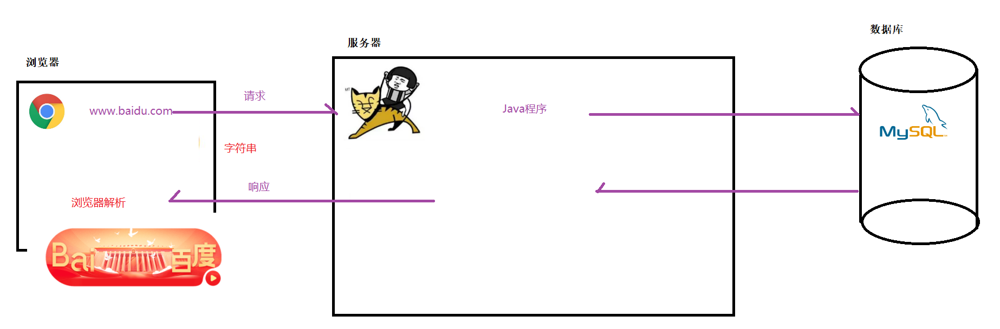

> ~~~markdown
> * 前端技术主要包含三个：
> 	HTML： 主要用于输出页面元素
> 	CSS：主要用于精细控制页面结构
> 	JS：主要用于实现页面动态效果
> ~~~

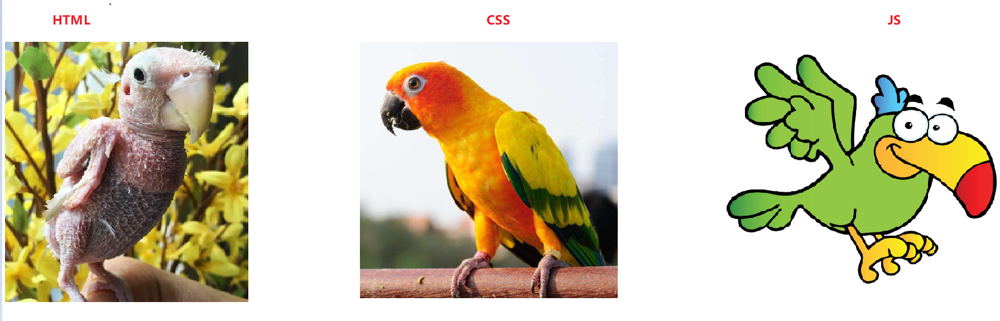

> >练习一下: 下面技术可以实现页面动态效果的是
> >
> >A. HTML                             B. CSS                             C. JS


# HTML入门

> >一个HTML页面的核心结构标签有哪些?

> HTML  (Hyper Text Markup Language)，指的是`超文本标记语言`，是一种用来描述网页的语言。
>
> - 超文本：比普通文本功能强大。它可以引入音频、视频、图片、文字、超链接等等……
> - 标记语言：使用一批特殊的标签来表达某些特殊意义，进而组装出网页的语言

## 创建模块

> 创建静态web模块: File-->New-->Module-->Static Web-->Static Web-->填写模块名称
>
> 创建静态web模块: File-->New-->Module-->Web-->Web-->填写模块名称(2021版本)

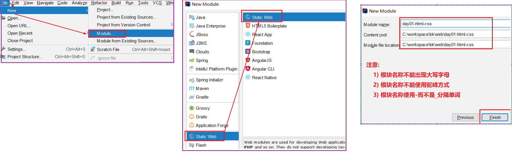  

## 目录结构

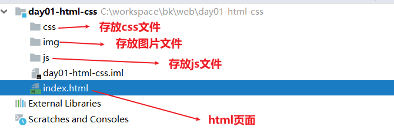  

## 编写代码

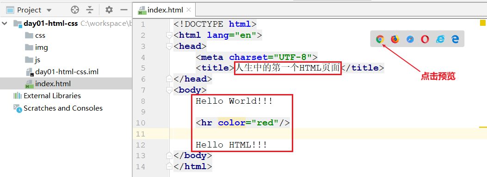 

## HTML规范

> 1. `<!DOCTYPE html>` 用于声明这是一个HTML的文档，要求必须在页面的第一行
>
> 2. HTML页面主要由HTML标签和HTML文本两部分组成
>
>    HTML标签：由HTML定义好的一类固定文字，比如`<html>`
>
>    HTML文本：除了标签之外的其它文字
>
> 3. HTML标签分为两大类:双标签和单标签
>
>    双标签：通常是成对出现的，比如`<html></html>`
>
>    单标签：单个出现，比如`<hr>`
>
> 4. 绝大多数的标签都具有属性，属性用来具体控制标签的某些特性。例如:`<hr color="red">`
>
> 5. HTML标签是不区分大小写的

~~~html
<!--
    1. <!DOCTYPE html> 用于声明当前是一个HTML5的文档, 放在文件第一行
    2. 一个Html中基本架构
        <html>
            <head>
                主要的作用是告诉浏览器应当如何解析这个页面
            </head>
            <body>
                主要是浏览器要解析的内容
            </body>
        </html>
    3. 一个HTML页面主要由HTML标签   和  HTML文本 组成
    4. HTML标签分为单标签和双标签
        单标签: 只有开始标签,没有结束标签    <hr color="red">
        双标签: 有开始标签,也有结束标签    <body></body>
    5. 在标签上支持特定属性, 属性是用于控制标签的细节的
    6. HTML标签是不区分大小写的,推荐小写
-->
<!DOCTYPE html>
<html lang="en">
    <head>
        <meta charset="UTF-8">
        <title>人生第一个HTML页面</title>
    </head>
    <body>

        Hello World

        <hr color="red">

        Hello 398

    </body>
</html>
~~~

> >练习一下: 一个网页中的主要内容要写在下面哪个标签的内部?
> >
> >A. html                 B.  head                    C. title                       D. body


# 基础标签

> 学习标签是有技巧的，重点记住每个**标签的语义**，简单的理解：就是这个标签是用来干嘛的。
>
> 根据标签的语义，在合适的地方给一个最为合理的标签，可以让页面结构更加清晰。 

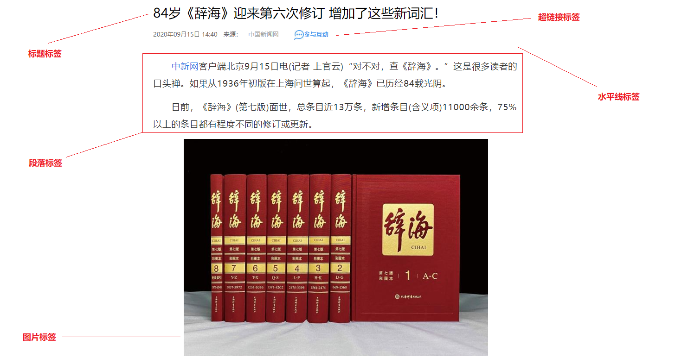 

> >请找出标题、水平线、段落、换行、文字效果、超链接、图像、视频、列表分别对应的标签
> >
> >~~~html
> >h1-h6
> >hr
> >p   br   &nsbsp;  &emsp;
> >b   i    u
> >a   
> >img  
> >audio
> >video
> >ul   ol
> >span  div
> >~~~

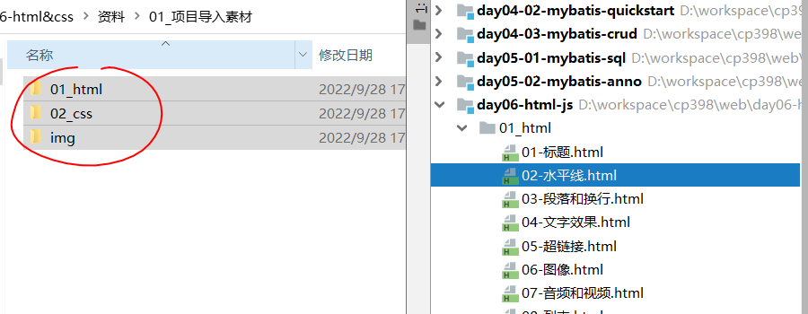 

## 标题

>作用：用于将普通文字变成标题
>
>语法：`<hn>普通文字</hn>`  
>
>​		n表示范围：1~6      特点：数值越大，字体越小
>
>属性：
>		align：对齐方式      取值：left（默认值，左对齐） 、 center（居中） 、 right（右对齐）

~~~html
<!DOCTYPE html>
<html lang="zh">
<head>
    <meta charset="UTF-8">
    <title>标题</title>
</head>
<body>
<!--
    作用: 展示普通文本为标题
    特点: 字体加粗, 自成一行
    语法: h1---h6 (数组变大,文字变小)
        align: 控制标题水平位置 center  left  right
-->

<h1 align="center">标题1</h1>
<h2>标题2</h2>
<h3>标题3</h3>
<h4>标题4</h4>
<h5>标题5</h5>
<h6>标题6</h6>

</body>
</html>
~~~


## 水平线

> 作用：在页面上生成一条横线
>
> 语法：`<hr/>`
>
> 属性：
>
> ​		color：颜色， 用于设置颜色线条颜色，通过英文字母或者RGB表示
>
> ​    	width：宽度， 用于设置线条的长度，可以是用绝对像素或者百分百设置

~~~html
<!DOCTYPE html>
<html lang="zh">
<head>
    <meta charset="UTF-8">
    <title>水平线</title>
</head>
<body>
<!--
    作用: 渲染一条水平线
    语法: <hr>  单标签
    属性:
        color: 颜色
            英文单词: red  blue  green  pink  purple yellow black white
            RGB:
        width: 宽度
            绝对: px
            相当: 百分比
-->

<hr color="red">
<hr color="#25689c">

<hr color="blue" width="200px" align="left">
<hr color="blue" width="50%" align="left">

</body>
</html>
~~~


## 段落和换行

> 作用：用于文字的分段和换行
>
> 语法：
>
> ​		换行： `<br/>`
>
> ​        分段： `<p>一段内容，使用这个标签的效果是一段文字的上下会留出空白</p> `

~~~html
<!DOCTYPE html>
<html lang="zh">
<head>
    <meta charset="UTF-8">
    <title>段落和换行</title>
</head>
<body>
<!--
    换行: <br>   单标签

    段落: <p> 段落 </p>

    空格: &emsp;(中文)   &nbsp;(英文)
-->

<p>
    &nbsp;&nbsp;&nbsp;&nbsp;&nbsp;&nbsp;传智专修学院是一所为互联网、人工智能、工业4.0培养高精尖科技人才的应用型大学。<br>学校经江苏省宿迁市教育局批准，由江苏传智播客教育科技股份有限公司投资创办。
</p>
<p>
    &emsp;&emsp;当今世界已进入人工智能、机器人时代，人工智能、机器人已成为未来30年、甚至50年科技革命最重要的发展方向。世界各国越来越重视，我国政府也高度关注人工智能的发展，无论是党的十八大、十九大，还是2017、2018、2019的政府工作报告，均提出要重点发展人工智能、机器人，并提升到国家战略层面。
</p>
<p>
    &emsp;&emsp;技术发展首要是人才，而我国这方面人才非常紧缺。根据国家相关部门测算，目前我国人工智能人才的缺口就已经超过了500万，国内的供求比例仅为1:10，供需比例严重失衡。并且随着社会信息革命的进一步深入，相应人才的缺口会越来越大。但在这些新技术面前，目前我国关于这方面人才的规模化培养，无论是高校还是科研机构，均没有成熟的培养体系和方案，都还处于摸索阶段。
</p>
</body>
</html>
~~~


## 文字效果

>`<b>文字</b>`：加粗标签
>
>`<i>文字</i>`： 斜体标签
>
>`<u>文字</u>`：下划线标签，在文字的下方有一条横线

~~~html
<!DOCTYPE html>
<html lang="zh">
<head>
    <meta charset="UTF-8">
    <title>文字效果</title>
</head>
<body>
<!--
    <b>文字</b>：加粗标签

    <i>文字</i>： 斜体标签

    <u>文字</u>：下划线标签，在文字的下方有一条横线
-->
<p>
    <b>你看,这行文字加粗了:乾坤未定,你我皆是黑马</b>
</p>
<p>
    你看,这行文字倾斜了:<i>乾坤未定,你我皆是黑马</i>
</p>
<p>
    你看,这行文字有个下划线呢:<u>乾坤未定,你我皆是黑马</u>
</p>

</body>
</html>
~~~


## 超链接

> 作用：用于给文字添加超链接效果，点击文字是跳转一个目标页面
>
> 语法：`<a>文字</a>`
>
> 属性：
>
> ​		href：用于指定超链接的跳转地址，支持绝对路径和相对路径两种写法
>
> ​		target：用于指定页面打开方式(_self 使用当前页签打开,  _blank 使用新页签打开)

~~~html
<!DOCTYPE html>
<html lang="zh">
<head>
    <meta charset="UTF-8">
    <title>超链接</title>
</head>
<body>
<!--
    作用：用于给文字添加超链接效果，点击文字是跳转一个目标页面
    语法：<a>文字</a>
    属性:
        href: 指定一个页面的地址
            绝对地址: https://www.baidu.com/
            相对地址: ./ 当前文件所在目录  ../ 当前文件上层目录
        target: 目标页面的开启位置
            _self 在当前页签打开目标页面(默认)
            _blank 在新页签打开打开目标页面

-->

<a href="https://www.baidu.com/">百度一下,你就知道</a><br>

<a href="./01-标题.html">标题</a><br>
<a href="../02_css/05-公司简介案例.html">公司简介案例.html</a><br>


<a href="https://www.baidu.com/" target="_self">百度一下,你就知道</a><br>
<a href="https://www.baidu.com/" target="_blank">百度一下,你就知道</a><br>

</body>
</html>
~~~


## 图像

> 作用：用于在HTML页面中引入一个图片
>
> 语法：``
>
> 属性:
>  	    src：用于指定图片资源的路径，支持绝对路径和相对路径两种写法
>
> ​    	alt：用于在指定咋图片丢失时要显示的文字提示
>
> ​		width：用于设置图片宽度（浏览器会根据设置的宽度按照比例自动调整高度）

~~~html
<!DOCTYPE html>
<html lang="zh">
<head>
    <meta charset="UTF-8">
    <title>图像</title>
</head>
<body>
<!--
    作用：用于在HTML页面中引入一个图片
    语法：   单标签
    属性:
        src: 图片的地址,支持绝对和相对路径写法
        alt：用于在指定咋图片丢失时要显示的文字提示
        width：用于设置图片宽度（浏览器会根据设置的宽度按照比例自动调整高度）

-->


<br>


</body>
</html>
~~~


## 音频和视频

>audio：定义音频。支持的音频格式：MP3、WAV、OGG 
>
>* src：规定音频的 URL
>
>* controls：显示播放控件
>
>video：定义视频。支持的音频格式：MP4, WebM、OGG
>
>* src：规定视频的 URL
>* controls：显示播放控件

~~~html
<!DOCTYPE html>
<html lang="zh">
<head>
    <meta charset="UTF-8">
    <title>音频和视频</title>
</head>
<body>
<!--
    audio：定义音频。支持的音频格式：MP3、WAV、OGG
    video：定义视频。支持的音频格式：MP4, WebM、OGG
        src：规定音频的 URL
        controls：显示播放控件
-->

<audio src="../img/jq.mp3" controls></audio>
<video src="../img/ds.mp4" controls width="500px"></video>

</body>
</html>
~~~


## 列表

>作用：用于文字排版
>
>语法：
>
>~~~html
>有序列表 
><ol>   
>        <li>文字</li>   
>        <li>文字</li>
></ol>
>无序列表
><ul>  	
>        <li>文字</li>    
>        <li>文字</li>
></ul>
>~~~

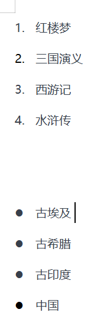 

~~~html
<!DOCTYPE html>
<html lang="zh">
<head>
    <meta charset="UTF-8">
    <title>列表</title>
</head>
<body>
<!--
    有序列表
    <ol>
       <li>文字</li>
       <li>文字</li>
    </ol>
    无序列表
    <ul>
       <li>文字</li>
       <li>文字</li>
    </ul>
-->

<ul>
    <li>红楼梦</li>
    <li>三国演义</li>
    <li>水浒传</li>
    <li>西游记</li>
</ul>

<ol>
    <li>红楼梦</li>
    <li>三国演义</li>
    <li>水浒传</li>
    <li>西游记</li>
</ol>
</body>
</html>
~~~


## div和span

> 作用：这两个标签没有语义，只是一个存储内容的容器（盒子），通常与css技术结合使用，完成页面的布局和美化
>
> 语法：
>
> ​		`<div>块级元素,独自占用一行</div>`
>
> ​		`<span>行内元素,内容有多大，就占用多少</span>`

~~~html
<!DOCTYPE html>
<html lang="zh">
<head>
    <meta charset="UTF-8">
    <title>div和span标签</title>
</head>
<body>
<!--
    <div> 和 <span> 是没有语义的，它们就是一个盒子，用来装内容的
        div: 块级元素,特点是自占一行,宽度就是行宽度
        span: 行内元素,特点是只占span中内容的宽度

-->

<div>这是在div中的文字</div>
<div>这是在div中的文字</div>
<div>这是在div中的文字</div>

<hr>

<span>这是在span中的文字少时诵诗书所所所所所所所所所所所所所</span>
<span>这是在span中的文字</span>
<span>这是在span中的文字</span>


</body>
</html>
~~~


>> 练习一下:
>
>~~~html
>1. 在HTML中，以下为换行标签的是（ ）
>
>	A、<line/>         B、<p/>        C、<br/>            D、<hr/>
>
>2. 在img标签的属性中，哪个是负责显示当图片无法显示的时候的提示文字的？
>	
>	A、src         B、href        C、target            D、alt
>
>3. 下列超链接点击后可以打开新页签跳转到http://www.sina.com.cn网站
>
>	A、<a href="http://www.sina.com.cn" target="_blank">新浪网</a>
>
>	B、<a herf="http://www.sina.com.cn" target="_blank">新浪网</a>
>
>	C、<a href="http://www.sina.com.cn" target="_self">新浪网</a>
>
>	D、<a herf="http://www.sina.com.cn" target="_self">新浪网</a>
>
>4. 用于播放视频文件的正确元素是
>
>	A、<movie>   B、<media>   C、<video>     D、<audio> 
>~~~


# 表格标签

## 基础表格

> >在表格中行、列、边框、内边距、外边距分别指的是什么？对应的标签分别又是什么？

### 表格认识

>表格可以让数据更有条理性的展示

 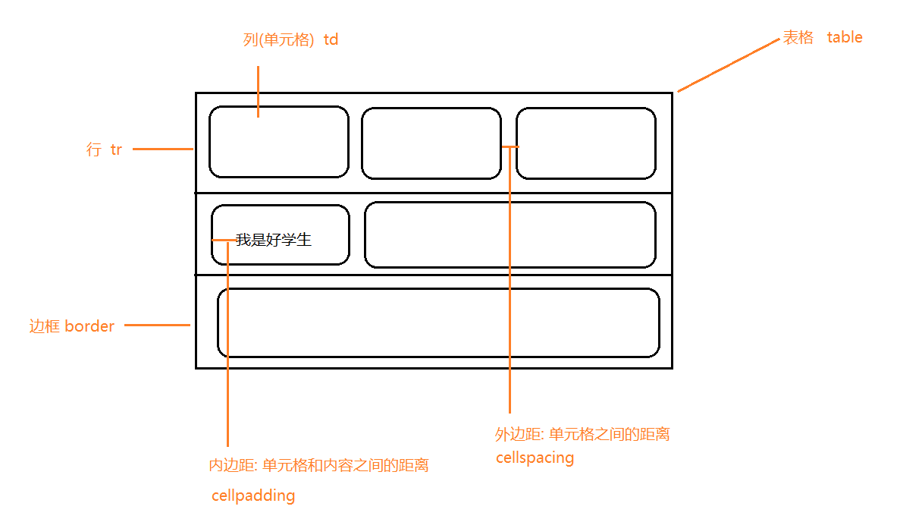 

### 表格实现

>~~~markdown
>table 表格	
>	width: 设置宽度	
>	height: 设置高度	
>	border: 设置边框	
>	align: 水平位置
>	cellspacing: 外边距	
>	cellpadding: 内边距
>tr	
>	bgcolor  设置一行的背景色
>td	
>	bgcolor  设置一个单元格的背景色	
>	align    设置单元格内文字的水平位置	
>	height   设置单元格高度
>~~~

~~~~html
<!DOCTYPE html>
<html lang="zh">
<head>
    <meta charset="UTF-8">
    <title>表格</title>
</head>
<body>
<!--
    实现一个 3*3 的单元格
-->
<table border="1px" width="300px" align="center"
       cellpadding="0px" cellspacing="0px" height="600px" bgcolor="red">
    <tr height="100px" bgcolor="green">
        <td bgcolor="purple" align="center">1</td>
        <td>2</td>
        <td>3</td>
    </tr>
    <tr>
        <td>4</td>
        <td>5</td>
        <td>6</td>
    </tr>
    <tr>
        <td>7</td>
        <td>8</td>
        <td>9</td>
    </tr>
</table>

</body>
</html>
~~~~

## 合并单元格

>合并单元格就是将多个单元格合并到一起

> >合并单元格的步骤是什么?

### 合并思路

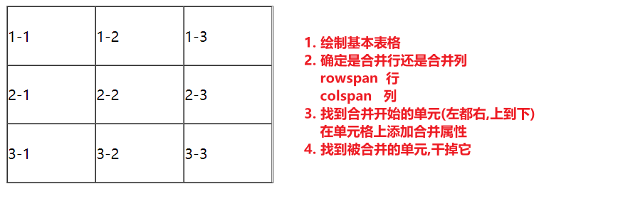 

### 合并实现

~~~markdown
<!DOCTYPE html>
<html lang="zh">
<head>
    <meta charset="UTF-8">
    <title>表格合并</title>
</head>
<body>
<!--
    合并需求:
        1. 合并1-2和1-3为一个
        2. 合并2-1和3-1为一个
-->

<table width="300px" height="200px" align="center" border="1" cellpadding="0" cellspacing="0" >
    <tr>
        <td>1-1</td>
        <td colspan="2" align="center">1-2</td>

    </tr>
    <tr>
        <td rowspan="2">2-1</td>
        <td>2-2</td>
        <td>2-3</td>
    </tr>
    <tr>

        <td>3-2</td>
        <td>3-3</td>
    </tr>
</table>
</body>
</html>

~~~

## 案例：注册页面

### 页面分析

 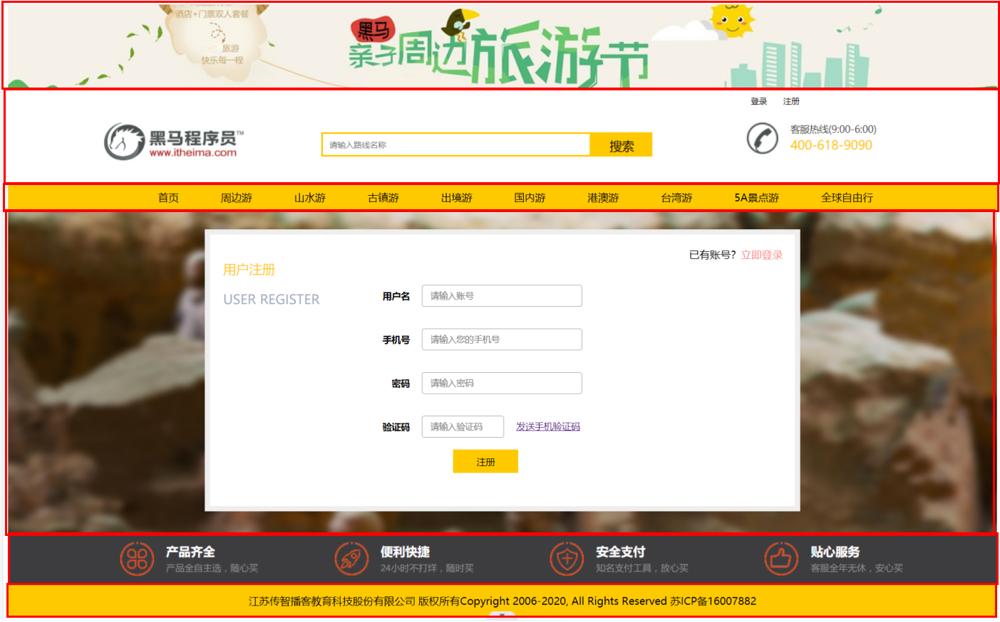 

### 代码实现

~~~html
<!DOCTYPE html>
<html lang="zh">
<head>
    <meta charset="UTF-8">
    <title>注册页面</title>
</head>
<body>
<!--


-->
<table>
    <tr>
        <td>
            
        </td>
    </tr>
    <tr>
        <td>
            
        </td>
    </tr>
    <tr>
        <td bgcolor="orange" height="40px" align="center">
            首页&emsp;&emsp;&emsp;
            周边游&emsp;&emsp;&emsp;
            山水游&emsp;&emsp;&emsp;
            古镇游&emsp;&emsp;&emsp;
            出境游&emsp;&emsp;&emsp;
            国内游&emsp;&emsp;&emsp;
            港澳游&emsp;&emsp;&emsp;
            台湾游&emsp;&emsp;&emsp;
            5A景点游&emsp;&emsp;&emsp;
            全球自由行&emsp;&emsp;&emsp;
        </td>
    </tr>
    <tr>
        <td height="300px">

        </td>
    </tr>
    <tr>
        <td>
            
        </td>
    </tr>
    <tr>
        <td  bgcolor="orange" height="40px" align="center">
            传智播客教育科技股份有限公司  版权所有Copyright 2006-2022, All Rights Reserved   苏ICP备16007882号-1
        </td>
    </tr>

</table>
</body>
</html>
~~~


# 表单标签（重点）

## 表单简介

> >1. 表单的作用是什么?
> >2. 它是如何向服务器提交数据的?

> HTML表单：用于采集用户数据，并发送给后端服务器
>
> 应用场景：用户注册、用户登录、个人信息修改...

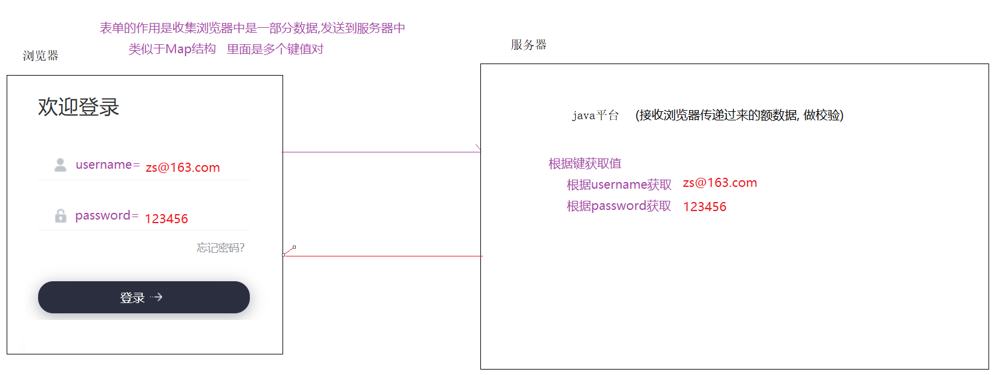 


## 表单控件

> ~~~markdown
> form: 表示一个表单，里面会包含多个表单项，它的作用是收集表单项中的所有数据信息，发送到后台服务器	
>    	action：表单的提交地址，暂时使用###代替（###：表示当前页面）
>    	method：表单的提交方式，有二种：get（默认值）  |  post
>    		get：请求参数在地址栏拼接，不安全，对参数总长度有限制
>    		post：参数不在地址栏拼接，相对安全，对参数总长度没有限制
>    	表单项类型，支持文本框、下拉框、文本域
>    	i）文本框            
>    		1）text：普通文本框
>    		2）password：密码框
>    		3）date：日期选择框
>    		4）radio：单选框
>    		5）checkbox：复选框
>    		6）file：文件上传
>    		7）submit：提交按钮
>    		8）reset：重置按钮
>    		9）button：普通按钮，通常与js结合使用
>    		10) hidden: 隐藏
>    	ii）下拉框
>         	select  定义下拉框
>         	option  定义下拉框中的具体内容
>    	iii）文本域
>     		textarea
> ~~~

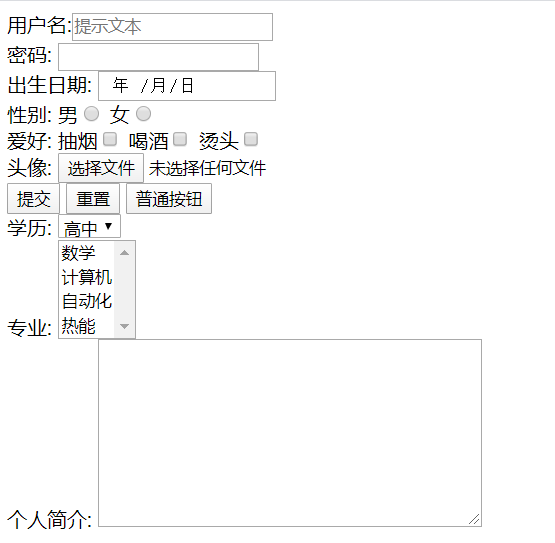 

```html
<!DOCTYPE html>
<html lang="zh">
<head>
    <meta charset="UTF-8">
    <title>表单</title>
</head>
<body>
<!--
    form: 表单标签,千万注意,不要跟from混淆了
        action: 表单的提交地址, 由于现在我们还没有学习后端服务器技术, 所以临时提交给自己,写法为###
        method: 请求方式,支持GET(默认) 和 POST
        		get：请求参数在地址栏拼接，不安全，对参数总长度有限制
		        post：参数不在地址栏拼接，相对安全，对参数总长度没有限制

    表单项: 分为三大类(文本框  下拉框  文本域)
        文本框: 使用type区分不同的小类型 <input>
            1) text: 普通文本框
                name: 键
                value: 设置值, 大部分情况下,是需要用户手动填写
                placeholder: 文本框提示
            2) password: 密码框 特点是,输入的内容会被显示为.
            3) date: 日期框
            4) radio: 单选框 一组单选框name的值必须一致; value值需要提前给定; 可以使用checked设置默认选中
            5) checkbox: 复选框 一组复选框name的值必须一致; value值需要提前给定; 可以使用checked设置默认选中
            6) file: 文件框
            7) submit: 提交按钮 作用是当点击的时候,将当前表单中的所有内容提交出去; value用于声明按钮内容
            8) reset: 重置按钮 作用就是将表单重置为初始状态
            9) button: 目前无用,需要跟js中的事件配合
            10) hidden: 隐藏域, 仅仅不在页面上显示, 会向后台提交
        下拉框
            select 下拉框
                name
                multiple 多选
            option
                value
                selected  默认值
        文本域
            textarea
        http://localhost:63343/web/day06-html-js/01_html/12-%E8%A1%A8%E5%8D%95.html?username=%E6%9F%AF%E5%8D%97&pwd=123&birthday=2022-09-29&sex=man&hobby=drink&hobby=hot&picture=%E4%B8%8A%E5%8D%88.torrent###
-->
<form action="###" method="POST">
    <input type="hidden" name="key" value="toutoude">
    用户名: <input type="text" name="username" value="" placeholder="请输入用户名"><br>
    密码:<input type="password" name="pwd"><br>
    出生日期: <input type="date" name="birthday"><br>
    性别: 男 <input type="radio" name="sex" value="man" checked>
        女 <input type="radio" name="sex" value="women"><br>
    爱好: 抽烟 <input type="checkbox" name="hobby" value="smoke">
        喝酒 <input type="checkbox" name="hobby" value="drink" checked>
        烫头 <input type="checkbox" name="hobby" value="hot" checked><br>
    头像: <input type="file" name="picture"><br>
    <input type="submit" value="注册">
    <input type="reset" value="重新填写">
    <input type="button" value="普通按钮"><br>
    学历: <select name="xueli">
            <option value="0">小学</option>
            <option value="1">初中</option>
            <option value="2">高中</option>
         </select>
    专业: <select name="zhuanye" multiple>
            <option value="0" selected>数学</option>
            <option value="1" selected>计算机</option>
            <option value="2">自动化</option>
         </select><br>
    个人简介: <textarea name="desc" cols="30" rows="10"></textarea>
</form>

</body>
</html>
```

> > 练习一下:   https://ks.wjx.top/vj/YzFrxyz.aspx

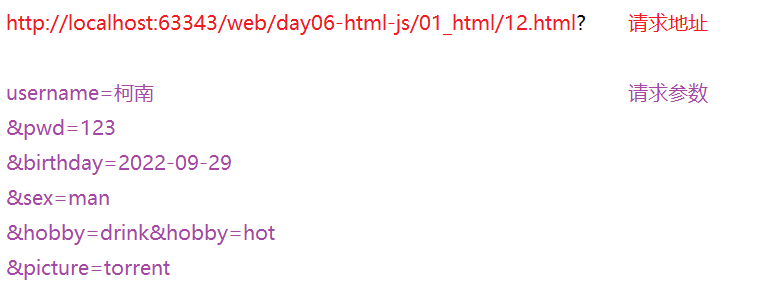 


## 案例：注册页面

> 需求：使用常用标签和表单制作黑马旅游网注册页面

```html
<!DOCTYPE html>
<html lang="zh">
<head>
    <meta charset="UTF-8">
    <title>注册页面</title>
</head>
<body>
<!--


-->
<table>
    <tr>
        <td>
            
        </td>
    </tr>
    <tr>
        <td>
            
        </td>
    </tr>
    <tr>
        <td bgcolor="orange" height="40px" align="center">
            首页&emsp;&emsp;&emsp;
            周边游&emsp;&emsp;&emsp;
            山水游&emsp;&emsp;&emsp;
            古镇游&emsp;&emsp;&emsp;
            出境游&emsp;&emsp;&emsp;
            国内游&emsp;&emsp;&emsp;
            港澳游&emsp;&emsp;&emsp;
            台湾游&emsp;&emsp;&emsp;
            5A景点游&emsp;&emsp;&emsp;
            全球自由行&emsp;&emsp;&emsp;
        </td>
    </tr>
    <tr>
        <td height="300px">
            <form action="###" method="get">
                <table align="center" height="270px">
                    <tr>
                        <td><b>用户名</b></td>

                        <td><input type="text" name="username" placeholder="请输入账号"></td>
                    </tr>
                    <tr>
                        <td><b>手机号</b></td>
                        <td><input type="text" name="telephone" placeholder="请输入您的手机号"></td>
                    </tr>
                    <tr>
                        <td><b>密码</b></td>
                        <td><input type="password" name="password" placeholder="请输入密码"></td>
                    </tr>
                    <tr>
                        <td><b>验证码</b></td>
                        <td>
                            <input type="text" name="code" placeholder="请输入验证码" style="width: 50px">
                            <a href="">发送手机验证码</a>
                        </td>
                    </tr>
                    <tr>
                        <td colspan="2" align="center">
                            <input type="submit" value="注册">
                        </td>
                    </tr>
                </table>
            </form>
        </td>
    </tr>
    <tr>
        <td>
            
        </td>
    </tr>
    <tr>
        <td bgcolor="orange" height="40px" align="center">
            传智播客教育科技股份有限公司 版权所有Copyright 2006-2022, All Rights Reserved 苏ICP备16007882号-1
        </td>
    </tr>

</table>
</body>
</html>

```


# CSS（了解）

> CSS (Cascading Style Sheets)  翻译为指层叠样式表 ，用于HTML页面的美化
>
> 层叠样式是指对同一个HTML标签添加多种不同的样式（字号、字体、颜色等等），所有样式会叠加在一起展示出效果

## 入门案例

### 快速入门

```html
<!DOCTYPE html>
<html lang="zh-CN">
<head>
    <meta charset="UTF-8">
    <title>css急速体验</title>

</head>
<body>
<!--
    将下面的文字实现效果: 字号30px 加粗 红色
-->
<font style="font-size: 30px;font-weight: bold;color: red">生而颠覆</font><br>
<font style="font-size: 30px;font-weight: bold;color: red">就为你美</font><br>
</body>
</html>
```

### HTML引入CSS

> HTML引入CSS的三种方式：
>
> 1. 行内样式：定义在标签的属性中， 作用于当前标签
> 2. 内部样式：定义在页面的head部分， 作用于当前页面中的所有（部分）标签
> 3. 外部样式：定义在页面外部，通过link标签引入到页面中，作用于所有引入此样式文件的页面标签
>
>
> ```markdown
> CSS样式使用优先级: 行内样式 > 内部和外部样式(内部和外部样式，后面覆盖前面)
> ```

```html
<!DOCTYPE html>
<html lang="zh-CN">
<head>
    <meta charset="UTF-8">
    <title>HTML引入CSS</title>

    <!--定义样式-->
    <style>
       h1{
           color: green;
       }
    </style>

    <!--引入外部的css文件-->
    <link rel="stylesheet" href="../css/my.css">
</head>
<body>
<!--
    行内样式: 直接在HTML标签上, 通过一个style的属性来设置css样式, 作用域为当前标签
    内部样式: 现在html的head部分通过style标签设置css样式, 作用域为当前文件
    外部样式: 需要提前一个单独的css文件, 然后在里面定义样式, 最后在html中引入文件

    优先级: 行内样式 > (内部样式 外部样式  后面覆盖前面)
-->
<h1 style="color: red">行内样式</h1>
<h1>内部样式</h1>
<h1>外部样式</h1>
</body>
</html>

```

~~~css
h1{
    color: blue;
}
~~~

### CSS语法

> ~~~css
> 选择器{	
>         样式名:样式值;	
>         样式名:样式值;
> }
> ~~~

```html
<!DOCTYPE html>
<html lang="zh-CN">
<head>
    <meta charset="UTF-8">
    <title>CSS语法</title>

    <!--1. 定位元素(选择器)   2. 美化元素(样式)-->
    <style>
        span{
            color: red;
            font-weight: bold;
            font-size: 30px;
        }
    </style>

</head>
<body>
<!--

-->
<span>我用双手成就你的梦想</span>

</body>
</html>

```

## 选择器

> 选择器作用：找出页面一组特定的标签
>
> 1. 标签选择器       使用标签名称选中一类标签        语法：标签名{css样式}
> 2. 类选择器          使用class属性选中一类标签        语法：.class{css样式}
> 3. id选择器          使用id属性选中一个标签            语法：#id{css样式}

```html
<!DOCTYPE html>
<html lang="zh-CN">
<head>
    <meta charset="UTF-8">
    <title>CSS选择器</title>

    <style>
        /*1. 标签选择器 直接使用标签名*/
        span{
            font-size: 20px ;
        }
        /*2. class选择器 选出的是所有属性中含有class=值的标签     .female => class=female*/
        .female{
            color: red;
        }
        .hero{
            font-weight: bold;
        }
        /*3. id选择器 选出的是所有的属性中含有id=值的标签  #boss => id = boss*/
        #boss{
            font-size: 50px;
            color: purple;
        }
    </style>

</head>
<body>

<!--
    需求:
        1. 让页面上的所有字体变成20px
        2. 所有女性变红, 所有英雄加粗
        3. 灭霸变成50px,紫色
-->
<span class="female">古力娜扎</span>
<span class="female">迪丽热巴</span>
<span class="female hero">黑寡妇</span>

<span class="male hero">钢铁侠</span>
<span class="male hero">超人</span>


<span id="boss" class="male">灭霸</span>


</body>
</html>
```

## 样式

> 本课程主要接收文本的一些样式：设置`文字的颜色，大小，字体，风格，加粗`以及`行高，缩进，有无下划线`等
>
> ~~~css
> font-size: 20px; /* 设置字号 */
> font-family: '楷体'; /* 设置字体 */
> font-weight: bold; /* 设置文字加粗（ normal:正常[默认],  bold:粗体,   数值 ) */
> font-style: italic; /* 设置文字倾斜（ normal:正常[默认],  italic:倾斜  ） */
> color：red; /* 设置字体颜色 */
> line-height: 40px; /* 设置行高 */
> text-indent: 40px; /* 设置段落的首行缩进 */
> text-align: center /* 设置元素水平位置 */
> text-decoration: none; /* 设置下划线( none:无,  underline:下划线,  overline:上划线,  line-through:横穿线 ) */
> ~~~

```html
<!DOCTYPE html>
<html lang="zh-CN">
<head>
    <meta charset="UTF-8">
    <title>CSS样式</title>
    <style>
        /*
        文本属性:设置文本的颜色,行高,缩进,文本的修饰(有无下划线)等
        字体属性:设置文字的大小,字体,风格(倾斜),是否加粗
        需求：
            1.p段落文字绿色
            2.p段落文字大小20px
            3.p段落行高40px
            4.p段落字体加粗
            5.p段落字体楷体
			6.p段落字体倾斜
            7.p段落首行缩进40px
			8.p段落中的文字水平居中
			9.a标题背景颜色为粉色
			10.隐藏a标题部分
        */
        p{
            color: green; /*p段落文字绿色*/
            font-size: 20px;/*p段落文字大小20px*/
            line-height: 40px;/*p段落行高40px*/
            font-weight: bold;/*p段落字体加粗  bold粗  正常normal*/
            font-family: '楷体';/*p段落字体楷体*/
            font-style: italic;/*p段落字体倾斜 italic倾斜  正常normal*/
            text-indent: 40px;/*p段落首行缩进40px*/
            text-align: center;/*p段落中的文字水平居中*/
        }

        a{
            background-color: pink;
            display: block;/*none 隐藏  block 块  inline 行内*/
        }

    </style>

</head>
<body>
<div>

	<a> 学习的误区：</a><br/>
    <p>
        眼睛：看了一遍记住了<br/>
        耳朵：听了一遍明白了<br/>
        脑子：想了一遍搞懂了<br/>
        手：你们会个屁！^_^ <br>
    </p>

    <div style="display: inline">1</div>
    <div style="display: inline">2</div>
</div>
</body>
</html>
```

## 案例：公司简介

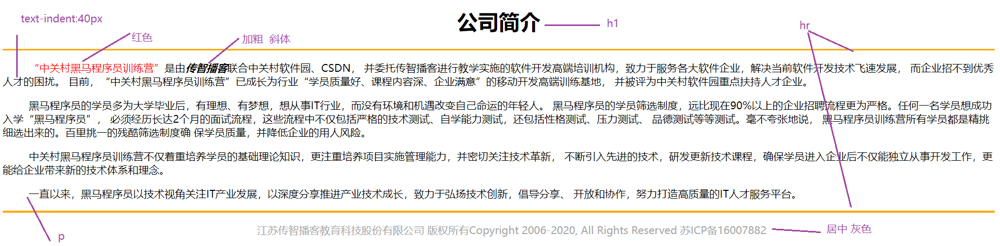 

```html
<!DOCTYPE html>
<html lang="zh-CN">
<head>
    <meta charset="UTF-8">
    <title>案例：公司简介</title>

    <style>
        p{
            text-indent: 35px;
        }

        .zgc{
            color: red;
        }

        #czbk{
            font-weight: bold;
            font-style: italic;
        }
        div{
            text-align: center;
            color: grey;
        }
    </style>

</head>
<body>

<h1 align="center">公司简介</h1>

<hr color="orange">

<p>
    <span class="zgc">“中关村黑马程序员训练营”</span>是由<span id="czbk">传智播客</span>联合中关村软件园、CSDN， 并委托传智播客进行教学实施的软件开发高端培训机构，致力于服务各大软件企业，解决当前软件开发技术飞速发展， 而企业招不到优秀人才的困扰。
    目前，“中关村黑马程序员训练营”已成长为行业“学员质量好、课程内容深、企业满意”的移动开发高端训练基地， 并被评为中关村软件园重点扶持人才企业。
</p>
<p>
    黑马程序员的学员多为大学毕业后，有理想、有梦想，想从事IT行业，而没有环境和机遇改变自己命运的年轻人。 黑马程序员的学员筛选制度，远比现在90%以上的企业招聘流程更为严格。任何一名学员想成功入学“黑马程序员”，
    必须经历长达2个月的面试流程，这些流程中不仅包括严格的技术测试、自学能力测试，还包括性格测试、压力测试、 品德测试等等测试。毫不夸张地说，
    黑马程序员训练营所有学员都是精挑细选出来的。百里挑一的残酷筛选制度确 保学员质量，并降低企业的用人风险。
</p>
<p>
    中关村黑马程序员训练营不仅着重培养学员的基础理论知识，更注重培养项目实施管理能力，并密切关注技术革新， 不断引入先进的技术，研发更新技术课程，确保学员进入企业后不仅能独立从事开发工作，更能给企业带来新的技术体系和理念。
</p>
<p>
    一直以来，黑马程序员以技术视角关注IT产业发展，以深度分享推进产业技术成长，致力于弘扬技术创新，倡导分享、 开放和协作，努力打造高质量的IT人才服务平台。
</p>
<hr color="orange">
<div>
    江苏传智播客教育科技股份有限公司 版权所有Copyright 2006-2020, All Rights Reserved 苏ICP备16007882
</div>

</body>
</html>
```


>**去掉空白： Ctrl + Shift + J**
>
>**格式化代码： Ctrl + Alt + L**

>==今日任务==
>
>1. 基础标签
>2. 表格标签
>3. 表单标签(2遍)
>4. css(了解)    background-color   display