# Servlet
## 简介
```
Servlet: Server Applet，翻译为运行在服务端的Java小程序，是sun公司提供一套规范( 接口 )，用来定义我们的代码怎么写才能被tomcat识别。
本质：接口，一个类想要被tomcat正确识别，那么这个类就必须直接或间接的实现Servlet接口。
任务：接收请求，处理请求，返回响应。
```
## 入门案例
### 创建模块
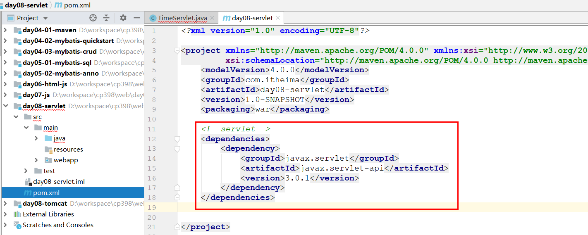
```xml
<!--servlet-->
<dependencies>
    <dependency>
        <groupId>javax.servlet</groupId>
        <artifactId>javax.servlet-api</artifactId>
        <version>3.0.1</version>
    </dependency>
</dependencies>
```
### 编写Servlet
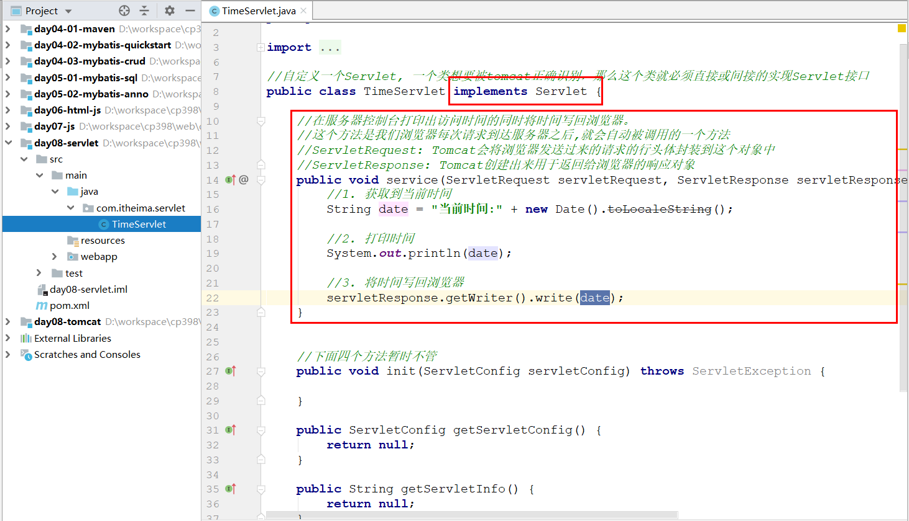
### 配置Servlet
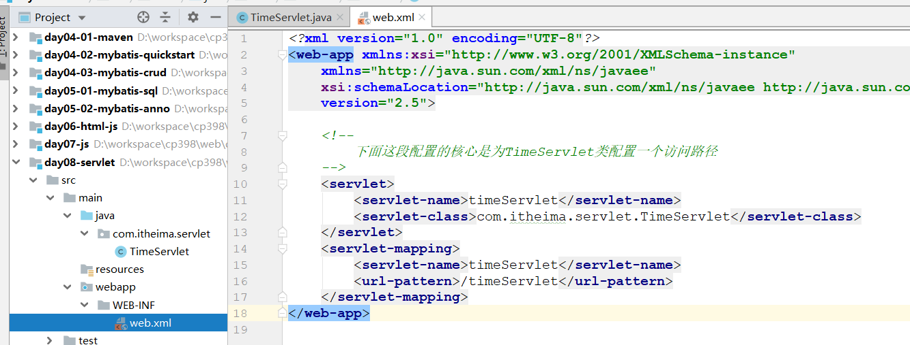
### 部署测试
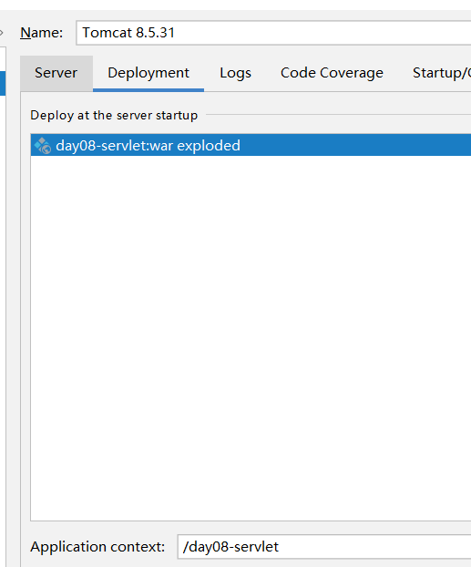
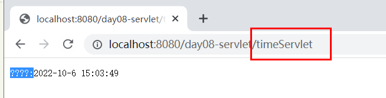
## 执行流程
```
* 访问流程：
 1. 当Tomcat接收到客户端浏览器的请求后，会解析出Servlet的资源路径
 2. 查找web.xml文件，是否有对应的 <url-pattern></url-pattern> 标签体内容
 3. 如果有，则在找到对应的 <servlet-class></servlet-class> 全限定名
 4. tomcat根据类的全限定名，将字节码文件加载进内存，并且创建其对象
 5. 调用service()方法 
```
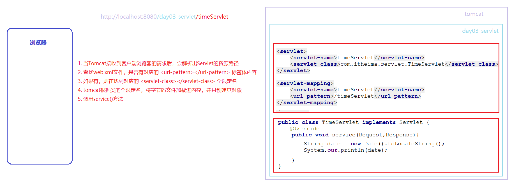
## API
    三个重点方法
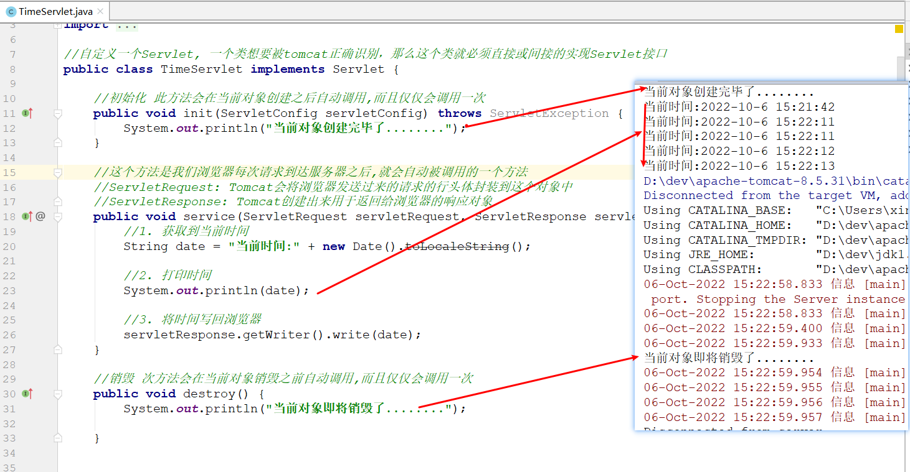

    设置测试
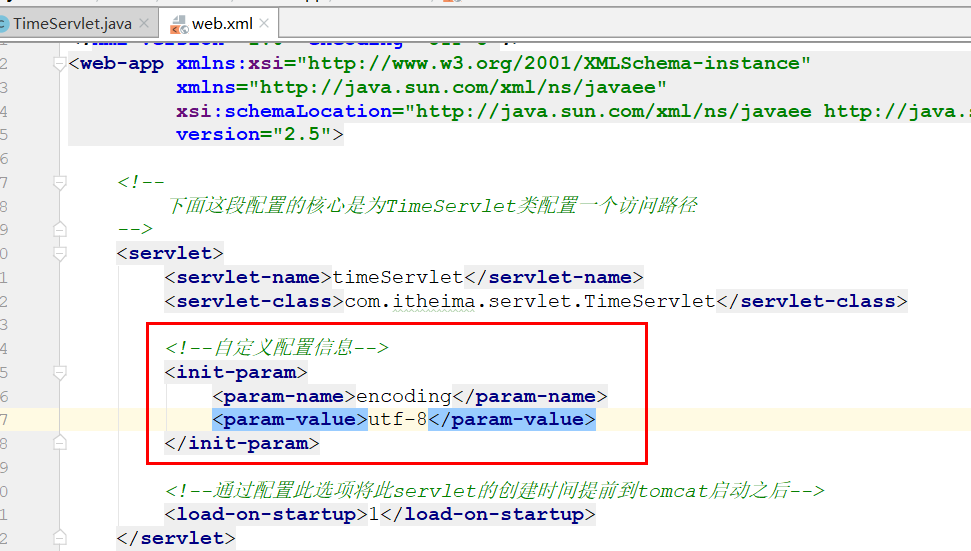

    获取配置参数
```java
package com.itheima.servlet;

import javax.servlet.*;
import java.io.IOException;
import java.util.Date;

//自定义一个Servlet, 一个类想要被tomcat正确识别，那么这个类就必须直接或间接的实现Servlet接口
public class TimeServlet implements Servlet {

    private ServletConfig servletConfig = null;

    //初始化 此方法会在当前对象创建之后自动调用,而且仅仅会调用一次

    //tomcat会将读取的配置内容封装到ServletConfig对象中,并且将这个对象作为参数,传入init方法
    public void init(ServletConfig servletConfig) throws ServletException {
        System.out.println("当前对象创建完毕了........");
        this.servletConfig = servletConfig;
    }

    //这个方法是我们浏览器每次请求到达服务器之后,就会自动被调用的一个方法
    //ServletRequest: Tomcat会将浏览器发送过来的请求的行头体封装到这个对象中
    //ServletResponse: Tomcat创建出来用于返回给浏览器的响应对象
    public void service(ServletRequest servletRequest, ServletResponse servletResponse) throws ServletException, IOException {
        //1. 获取到当前时间
        String date = "当前时间:" + new Date().toLocaleString();

        //2. 打印时间
        System.out.println(date);

        //3. 将时间写回浏览器
        //响应头的作用是告诉浏览器,当前返回内容的格式和编码
        servletResponse.setContentType("text/html;charset=" + this.servletConfig.getInitParameter("encoding"));
        servletResponse.getWriter().write(date);
    }

    //销毁 次方法会在当前对象销毁之前自动调用,而且仅仅会调用一次
    public void destroy() {
        System.out.println("当前对象即将销毁了........");

    }

    //返回当前servlet中配置信息
    public ServletConfig getServletConfig() {
        return this.servletConfig;
    }

    //返回当前servlet的介绍
    public String getServletInfo() {
        return "这是一个返回当前服务器时间的servlet";
    }
}
```
## 生命周期
```
* 生命周期: 指的是一个Servlet从创建--->提供服务--->销毁的这个过程。  
	1. 创建(只一次):        默认情况下，servlet第一次被访问的时候创建，创建之后立即执行init()方法进行初始化  
	2. 提供服务(可以多次):   servlet每次被访问都会执行service()方法对外提供服务  
	3. 销毁(只一次):        当服务器要正常关闭时，会销毁servlet，在servlet销毁之前会调用destory()方法

* 创建时机	
	1. 默认情况下，servlet会在第一次被访问的时候创建	
	2. 但是也只是通过配置的形式来将创建时机提前到Tomcat启动的时候		
	<load-on-startup> 数字 </load-on-startup> 用来修改servlet的创建时机			
		负  数：Servlet在第一次被访问时创建			
		非负数：Servlet在tomcat启动的时候创建，范围: 0-10，值越小优先级越高
```
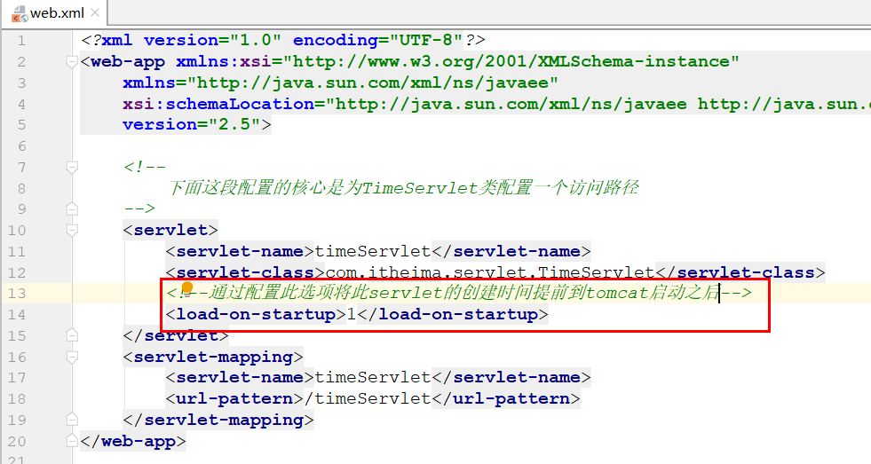
## 体系结构
```
* Servlet接口                   这是Servlet的根接口，所有的Servlet都必须直接或间接的实现它   
* |---GenericServlet抽象类      这是一个抽象类，它实现了Servlet接口中的大部分方法，只剩下了一个service方法等待我们实现
* |------HttpServlet抽象类      这是一个专门用来处理http请求的类，在这个类中可以轻松的对不同的请求类型进行处理
```
     GenericServlet使用
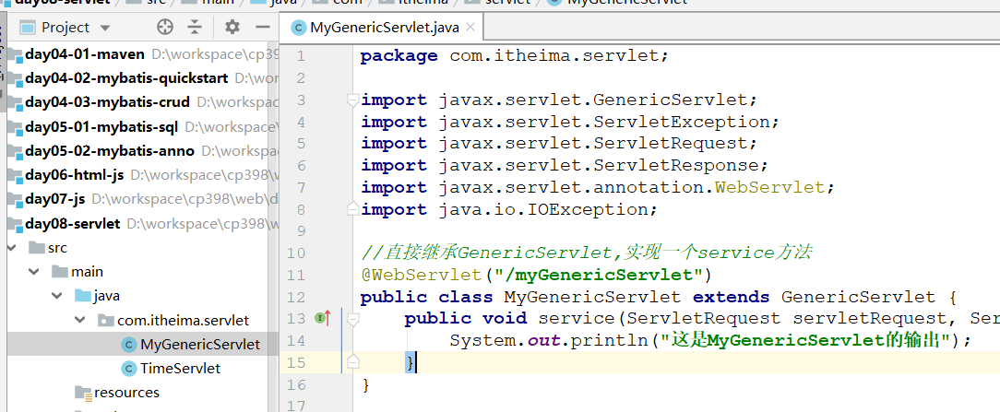

     HttpServlet使用(掌握)
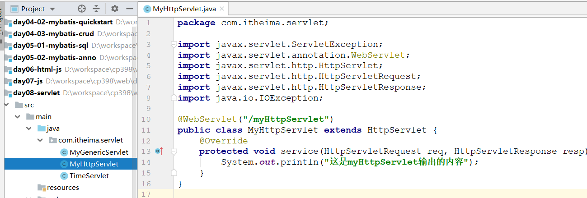
## 注解书写
```
* @WebServlet
    name：指定servlet名称，等价于web.xml中的servlet-name，如果省略，则为Servlet的完整类名
    urlPatterns：配置请求路径映射，等价于web.xml中的urlPatterns
    loadOnStartup：指定Servlet的加载顺序，等价于web.xml中的load-on-startup
```
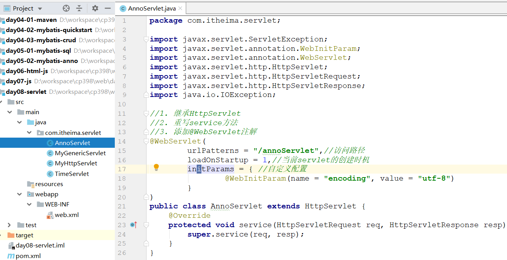
## 常见报错
```
1. The servlets named [annoServlet] and [annoServlet2] are both mapped to the url-pattern [/annoServlet] which is not permitted	
	两个servlet的路径重复
2. Invalid url-pattern [annoServlet] in servlet mapping  
	servlet路径不是/开头的
```
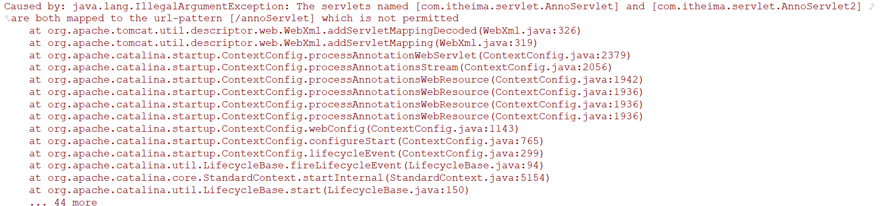
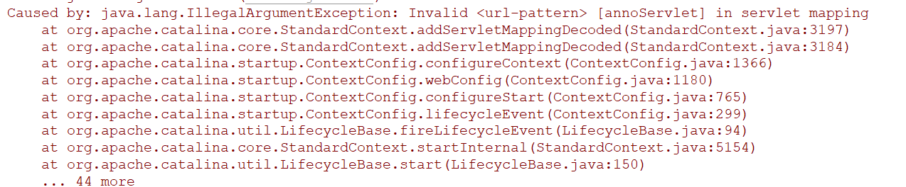
# 两套结构
## 开发结构
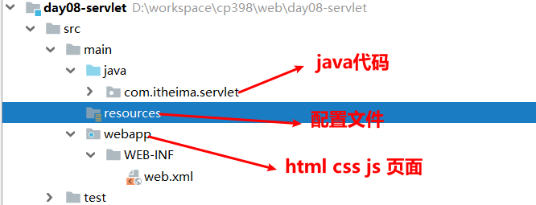
## 部署结构
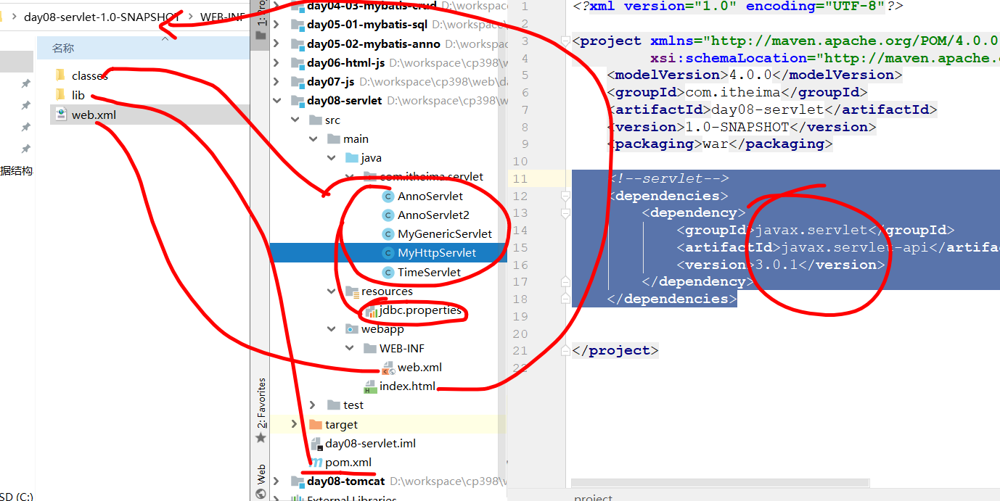
## 如果要自定义servlet，你有几种方式
1. 直接实现servlet接口，必须重写4个方法(  
   init()：初始化 此方法会在当前对象创建之后自动调用,而且仅仅会调用一次
   service()：这个方法是我们浏览器每次请求到达服务器之后,就会自动被调用的一个方法  
   destro()：销毁 该方法会在当前对象销毁之前自动调用,而且仅仅会调用一次  
   getServletInfo()： 返回当前servlet的介绍  
   )
2. 实现GenericServlet接口，必须重写service()方法
3. 实现HttpServlet接口，重写service()方法，改方法中的参数是要有HttpServletRequest
## 从service返回页面乱码问题解决方式
###  1、web.xml书写
    在web.xml文件中书写一下内容
```xml
<servlet>
		<servlet-name>timeServlet</servlet-name>
		<servlet-class>com.itmhw.servlet.TimeServlet</servlet-class>

		<init-param>
			<param-name>encoding</param-name>
			<param-value>utf-8</param-value>
		</init-param>

		<load-on-startup>1</load-on-startup>
	</servlet>
	<servlet-mapping>
		<servlet-name>timeServlet</servlet-name>
		<url-pattern>/timeServlet</url-pattern>
	</servlet-mapping>
```
    其中主要是一下内容来编写格式，如以后需要更改只需要更改这里
```xml
<init-param>
    <param-name>encoding</param-name>
    <param-value>utf-8</param-value>
</init-param>
```
      servlet中的格式
```java
package com.itmhw.servlet;

import javax.servlet.*;
import java.io.IOException;
import java.util.Date;

public class TimeServlet implements Servlet {
    private ServletConfig servletConfig = null;
    @Override
    public void init(ServletConfig servletConfig) throws ServletException {
        System.out.println("当前对象创建完毕了.....");
        this.servletConfig = servletConfig;
    }

    @Override
    public ServletConfig getServletConfig() {
        return null;
    }

    @Override
    public void service(ServletRequest servletRequest, ServletResponse servletResponse) throws ServletException, IOException {
        //获取当前时间
        String date = "当前时间" + new Date().toLocaleString();
        //打印时间
        System.out.println("date = " + date);
        //返回的编码的格式
        servletResponse.setContentType("text/html;charset="+this.servletConfig.getInitParameter("encoding"));
        //将时间写回浏览器
        servletResponse.getWriter().write(date);
    }

    @Override
    public String getServletInfo() {
        return null;
    }

    @Override
    public void destroy() {

    }
}
```
###  2、注解书写
```java
package com.itmhw.servlet;

import javax.servlet.annotation.WebInitParam;
import javax.servlet.annotation.WebServlet;
import javax.servlet.http.HttpServlet;
import javax.servlet.http.HttpServletRequest;
import javax.servlet.http.HttpServletResponse;
import java.io.IOException;
import java.util.Date;

@WebServlet( urlPatterns= "/annoServlet",
loadOnStartup = 1,
initParams = {
        @WebInitParam(name="encoding",value = "utf-8")
})
public class AnnoServlet extends HttpServlet {
    @Override
    protected void service(HttpServletRequest req, HttpServletResponse resp) throws IOException {
        //获取当前时间
        String date = "当前时间" + new Date().toLocaleString();
        //打印时间
        System.out.println("date = " + date);
        resp.setContentType("text/html;charset="+getInitParameter("encoding"));
        //将时间写回浏览器
        resp.getWriter().write(date);
    }
}

```