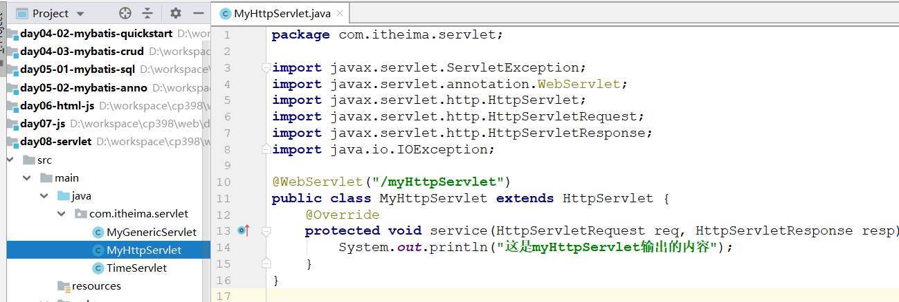

# Web常识（理解）

>Java  Web: 将我们开发Java(包含前端html css js)程序，放在网络上，供别人使用

## 软件架构

> >1. 了解BS和CS架构的区别点是什么?
> >2. 我们课程中主要学习的是BS还是CS架构? 

> 网络中有很多计算机，它们之间信息交流称为交互。在互联网交互的过程的有两个非常典型的交互方式：C/S 交互模型和 B/S 交互模型。

~~~markdown
1. C/S架构
	C/S架构指的是Client/Server(客户端/服务端)架构，采用客户端和服务端进行交互。
	在用户本地有一个客户端程序，在远程有一个服务器端程序，如：QQ、LOL、绝地求生。
	
2. B/S架构
	B/S架构指的是Browser/Server(浏览器/服务器)架构，采用浏览器和服务端进行交互。
	本地只需要一个浏览器，用户通过输入的地址（URL），可以访问不同服务器端的程序，如：天猫、京东、知乎

3. 对比
	相同点：都是基于请求---响应交互模型，请求和响应成对出现
	不同点：
		CS架构需要用户在自己的操作系统安装客户端软件；而BS架构，只需要用户在操作系统中安装浏览器即可
		CS具有更好的，更流畅的用户体验；而BS架构的开发更方便，更实用。 
~~~

> >练习一下:下面程序属于BS架构的是?
> >
> >A. 微信            B.QQ          C. IDEA          D. 百度网页           

## web资源

> >1. 访问一个BS程序,必须要知道的要素有几个?
> >2. 在一台服务器上是否可以运行两个相同的BS程序?

~~~markdown
* web资源：通过网络访问到的资源，也就是存放在网络中的计算机上并且可以让外部访问的数据文件。
	
* 网络通讯: 网络中的计算机进行信息交换的过程，必须遵循要通信的计算机的三个要素：
	IP：电子设备（计算机）在互联网唯一标识
	端口：软件在计算机中对外提供服务的窗口
	传输协议：计算机双方通信的标准
~~~

  

> >练习一下: 下面哪个条件不是访问一个BS程序必须要知道的要素?
> >
> >A. 服务器地址      B. 程序端口号     C.程序名称         D. 协议


# Tomcat（会用）

> Tomcat是一个由Apache基金组织开发的免费开源Web服务器。

## 软件安装

>资料中已经提供好绿色解压版，直接解压即安装，要求安装目录==没有中文，没有空格==
>
>==webapps 开发项目==
>
>==conf 配置文件==

 

## 启动和停止

### 启动

> Tomcat启动：安装目录/bin/startup.bat 双击文件即可
>
> 浏览器访问： http://localhost:8080   （localhost指的是本机地址，8080是tomcat的默认访问端口号） 

  

### 启动问题

> ~~~markdown
> * 现象：黑窗口一闪而过
> * 原因：Tomcat是java编写，启动时依赖JAVA_HOME环境变量
> * 解决：正确配置JAVA_HOME环境变量和PATH路径
> ~~~

  

  

>电脑环境变量中含有两个以 Catalina-*    需要删掉

 


>~~~markdown
>* 报错: 启动过程中，持续一段时间，然后窗口退出，查看tomcat的日志，提示下面内容：Address already in use: JVM_Bind  
>* 原因: tomcat端口被占用
>* 解决：
>	方式一：暴力杀掉占用端口的进程
>		1）使用cmd启动dos窗口，使用命令【 netstat -ano | findstr 端口号 】找到占用的端口号的对应进程
>		2）使用【 taskkill /pid 进程号 】杀死进程 
>	方式二：修改当前Tomcat的端口号
>		修改Tomcat安装目录/conf/server.xml文件中的三个端口号8005  8080  8009]  
>		注意: 修改的端口号在1025~65535之间 (65535为最大端口号, 0~1024:系统预留的端口号)
>~~~

 

  

### 停止

>~~~markdown
>* 方式1: 安装目录/bin/shutdown.bat双击文件即可
>* 方式2: 直接关闭tomcat的运行窗口
>~~~

##  项目部署 

> >1. 我们开发的项目应该放在tomcat的哪个目录下?
> >2. war包是干什么用的?

> 项目部署指的是如何将我们自己开发好的项目部署到tomcat中，然后对外提供访问。
>
> 创建一个本地项目，然后复制到tomcat的webapps目录下

  

 


# 项目开发（掌握）

>本小节我们学习如何利用idea开发一个Java项目，并把它部署到tomcat中运行

## 配置模板

>我们需要在Idea中配置一个Tomcat的模板，这样以后使用tomcat就不用每次都重新配置了，==这个步骤只需要做一次==

  

## 创建模块

>注意：今天创建的是maven的web工程

###  安装插件

 

### 创建web工程

>创建maven的普通工程, 使用JBLJavaToWeb转换为web工程

 

### 编写代码

>在项目中创建HTML页面

  

## 部署项目

>将编写的项目部署到Tomcat服务器

 

## 启动测试

>在idea中启动tomcat,测试项目

   

>==经典报错：端口被占用，关闭dos的tomcat获取重启电脑==

 

>==WEB-INF目录下的资源不允许使用浏览器直接访问==

 


# HTTP协议（理解）

> >协议的作用是什么? HTTP协议的作用是什么?

## 介绍

~~~markdown
* HTTP (Hyper Text Transfer Protocol) 超文本传输协议，是互联网上应用最为广泛的一种网络协议。	
	作用：
		规范浏览器和服务器之间通信时传输数据的格式
	特点：		
		1) 基于TCP的高级协议，端口号默认80		
		2) 基于请求/响应模型：一次请求对应一个响应		
		3) 无状态：每次请求之间都是相互独立的，也就是说HTTP协议本身无法记录上一次访问的数据	
~~~

  

## 浏览器查看

### 准备页面

>修改项目的index.html，内容如下:

~~~html
<!DOCTYPE html>
<html lang="en">
<head>
    <meta charset="UTF-8">
    <title>Tomcat</title></head>
<body>
<form action="#" method="get"> 
    姓名:<input type="text" name="username"><br> 
    密码:<input type="text" name="password"><br>
    <input type="submit" value="提交"></form>
</body>
</html>
~~~

### 请求访问

>以Chrome浏览器为例，使用F12打开开发者模式，选择NetWork选项卡，然后通过网络访问上面的index.html页面

  

## HTTP请求

> >HTTP请求包含哪三部分?每部分的作用是什么?

### 查看HTTP请求

> HTTP的请求是由行、头、体构成的。


### 请求行

~~~markdown
* POST    /day03-tomcat/index.html     HTTP/1.1
	请求行由三部分组成：请求方式  请求路径  请求协议/版本。
	请求方式有很多, 我们需要关注两种: get 和 post	
        get		
            1）请求参数在地址栏显示，不太安全
            2）请求参数大小有限制
            3）没有请求体
        post		
            1）请求参数没有在地址栏显示，而是在请求体显示，相对安全
            2）请求参数大小没有限制
            3）有请求体
~~~

### 请求头

~~~markdown
* Connection: keep-alive
	请求头格式是键值对  键:值	
	User-Agent： 浏览器告诉服务器端，客户端操作系统和浏览器版本信息，借助它可以处理浏览器的兼容性问题
~~~

### 请求体

~~~markdown
* username=heima
	格式 参数名=参数值&参数名=参数值	
	注意 get方式没有请求体，post方式有请求体
~~~


## HTTP响应

> >HTTP响应包含哪三部分?每部分的作用是什么?

### 查看HTTP响应

> HTTP的响应也是由行、头、体构成的。

 

### 响应行

~~~markdown
* HTTP/1.1  200
	响应行由两部分组成： 协议/版本  响应码
	常见状态码：由服务器告诉浏览器，本次请求响应状态码说明	
        200：操作成功
        404：请求路径没有对应资源
~~~

### 响应头

~~~markdown
* Last-Modified: Wed, 22 May 2019 06:50:39 GMT
	常见响应头	
		Content-Type：服务器告诉浏览器，响应体的数据类型和编码方式		
			Content-Type: text/html;charset=utf-8
		Location：通常与状态码302一起使用，完成重定向操作
			Location:http://www.itcast.cn
~~~

### 响应体

~~~markdown
 * 浏览器内核解析展示到页面的内容
~~~


# Servlet（重点）

## 简介

>Servlet: Server Applet，翻译为运行在服务端的Java小程序，是sun公司提供一套规范( 接口 )，用来定义我们的代码怎么写才能被tomcat识别。
>
>本质：接口，一个类想要被tomcat正确识别，那么这个类就必须直接或间接的实现Servlet接口。
>
>任务：接收请求，处理请求，返回响应。

 

## 入门案例

> >使用Servlet的两个核心步骤分别是什么? 每个步骤的作用又是什么?

>需求：使用一个Servlet完成一个功能，接收浏览器请求，在服务器控制台打印出访问时间的同时将时间写回浏览器。

### 创建模块 

  

~~~xml
    <!--servlet-->
    <dependencies>
        <dependency>
            <groupId>javax.servlet</groupId>
            <artifactId>javax.servlet-api</artifactId>
            <version>3.0.1</version>
        </dependency>
    </dependencies>
~~~

### 编写servlet

 

### 配置servlet

 

### 部署测试

 

 

## 执行流程

>~~~markdown
>* 访问流程：
>  1. 当Tomcat接收到客户端浏览器的请求后，会解析出Servlet的资源路径
>  2. 查找web.xml文件，是否有对应的 <url-pattern></url-pattern> 标签体内容
>  3. 如果有，则在找到对应的 <servlet-class></servlet-class> 全限定名
>  4. tomcat根据类的全限定名，将字节码文件加载进内存，并且创建其对象
>  5. 调用service()方法 
>~~~

 

## 细节介绍

### API

>```markdown
>* 重点	
>	init(ServletConfig config)：会在serlvet对象创建之后马上执行，只执行一次	
>	service(ServletRequest req, ServletResponse res)：会被调用多次，每次处理请求都会调用该方法	
>	destroy()：会在servlet被销毁之前执行，只执行一次
>	
>* 了解	
>	getServletInfo(): 获取serlvet的信息	
>	getServletConfig()：获取servlet配置信息
>```

**① 三个重点方法**

 

**② 设置测试**

 

**③ 获取配置参数**

~~~java
package com.itheima.servlet;

import javax.servlet.*;
import java.io.IOException;
import java.util.Date;

//自定义一个Servlet, 一个类想要被tomcat正确识别，那么这个类就必须直接或间接的实现Servlet接口
public class TimeServlet implements Servlet {

    private ServletConfig servletConfig = null;

    //初始化 此方法会在当前对象创建之后自动调用,而且仅仅会调用一次

    //tomcat会将读取的配置内容封装到ServletConfig对象中,并且将这个对象作为参数,传入init方法
    public void init(ServletConfig servletConfig) throws ServletException {
        System.out.println("当前对象创建完毕了........");
        this.servletConfig = servletConfig;
    }

    //这个方法是我们浏览器每次请求到达服务器之后,就会自动被调用的一个方法
    //ServletRequest: Tomcat会将浏览器发送过来的请求的行头体封装到这个对象中
    //ServletResponse: Tomcat创建出来用于返回给浏览器的响应对象
    public void service(ServletRequest servletRequest, ServletResponse servletResponse) throws ServletException, IOException {
        //1. 获取到当前时间
        String date = "当前时间:" + new Date().toLocaleString();

        //2. 打印时间
        System.out.println(date);

        //3. 将时间写回浏览器
        //响应头的作用是告诉浏览器,当前返回内容的格式和编码
        servletResponse.setContentType("text/html;charset=" + this.servletConfig.getInitParameter("encoding"));
        servletResponse.getWriter().write(date);
    }

    //销毁 次方法会在当前对象销毁之前自动调用,而且仅仅会调用一次
    public void destroy() {
        System.out.println("当前对象即将销毁了........");

    }

    //返回当前servlet中配置信息
    public ServletConfig getServletConfig() {
        return this.servletConfig;
    }

    //返回当前servlet的介绍
    public String getServletInfo() {
        return "这是一个返回当前服务器时间的servlet";
    }
}
~~~

### 生命周期

>~~~markdown
>* 生命周期: 指的是一个Servlet从创建--->提供服务--->销毁的这个过程。  
>	1. 创建(只一次):        默认情况下，servlet第一次被访问的时候创建，创建之后立即执行init()方法进行初始化  
>	2. 提供服务(可以多次):   servlet每次被访问都会执行service()方法对外提供服务  
>	3. 销毁(只一次):        当服务器要正常关闭时，会销毁servlet，在servlet销毁之前会调用destory()方法
>	
>* 创建时机	
>	1. 默认情况下，servlet会在第一次被访问的时候创建	
>	2. 但是也只是通过配置的形式来将创建时机提前到Tomcat启动的时候		
>	<load-on-startup> 数字 </load-on-startup> 用来修改servlet的创建时机			
>		负  数：Servlet在第一次被访问时创建			
>		非负数：Servlet在tomcat启动的时候创建，范围: 0-10，值越小优先级越高
>~~~

 

### 路径匹配(扩展)

>==此节内容才看扩展视频==

>~~~text
>1. servlet支持以下几种路径匹配模式:       
>	完全匹配(/a/helloServlet.do):  可以匹配到一个完整的路径，必须以`/`开始       
>	目录匹配(/a/*):  可以匹配到一个目录下的所有路径，必须以`/`开始，必须以`*`结束
>	后缀匹配(*.do):  可以匹配到以指定后缀结尾的路径，不能以`/`开始，必须以`.xxx`结束
>	默认匹配(/):     代表这是一个默认的servlet，当一个请求无法被任何一个servlet匹配上时，进入到此servlet
>2. 注意：上面四个配置优先级依次降低，一旦匹配中其中一个，就不会再去匹配其它的了
>~~~

### 体系结构(了解)

>~~~markdown
>* Servlet接口                   这是Servlet的根接口，所有的Servlet都必须直接或间接的实现它   
>* |---GenericServlet抽象类      这是一个抽象类，它实现了Servlet接口中的大部分方法，只剩下了一个service方法等待我们实现
>* |------HttpServlet抽象类      这是一个专门用来处理http请求的类，在这个类中可以轻松的对不同的请求类型进行处理
>~~~

**① GenericServlet使用** 

 

**② HttpServlet使用(掌握)**

  

## 注解版

> ~~~markdown
> * @WebServlet
>     name：指定servlet名称，等价于web.xml中的servlet-name，如果省略，则为Servlet的完整类名
>     urlPatterns：配置请求路径映射，等价于web.xml中的urlPatterns
>     loadOnStartup：指定Servlet的加载顺序，等价于web.xml中的load-on-startup
> ~~~
>

 

>==常见报错==
>
>~~~markdown
>1. The servlets named [annoServlet] and [annoServlet2] are both mapped to the url-pattern [/annoServlet] which is not permitted	
>	两个servlet的路径重复
>2. Invalid url-pattern [annoServlet] in servlet mapping  
>	servlet路径不是/开头的
>~~~

 

 


# 两套结构


> 任务安排:
>
> 1. 了解BS模型和web资源的访问方式
> 2. 在IDEA中创建项目,并部署到tomcat
> 3. 知道HTTP协议的作用以及行头体的作用
> 4. 创建一个servlet并成功访问


>上午8:50         下午2:20       面试时间

