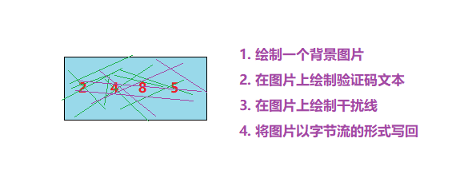

# request获取请求
## 概述
```markdown
1. 概述
	Request对象代表客户端的请求，用户通过浏览器访问服务器时，HTTP请求中所有的信息都封装在这个对象中。
	Request对象是由Tomcat创建，开发者可以直接使用这个对象提供的方法获取客户端的请求信息(行  头  体)。

2. 体系结构
    ServletRequest 接口
            |
    HttpServletRequest 接口
            |
    org.apache.catalina.connector.RequestFacade 实现类（由tomcat提供的）
```
## 重要方法：
    request.请求方法
### 请求行
```markdown
 1. String getMethod()       获取请求方式
 2. String getRequestURL()   获取请求完整路径(URL)
 3. String getRequestURI()   获取请求资源部分(URI)
 4. String getContextPath()  获取项目虚拟目录  [记住]
 5. String getServletPath()  获取项目资源路径
```
### 请求头
```markdown
String getHeader(String name)    以String的形式返回指定请求头的值
```
### 请求参数
1. 前端参数传值方式：get和post
```markdown
区别：
1. method="get" 网址栏中显示传值数据，不安全(数值可见)
2. method="post" 网址栏中不显示传值数据，安全(数值不可见)
```
2. 后端获取值的方式：
```markdown
1. String getParameter(String name)           根据参数名获得参数值(单个)
2. String[] getParameterValues(String name)   根据参数名获得参数值(数组)
3. Map<String, String []>  getParameterMap()  获得所有的参数，封装到Map集合
```
3. 如何将获取的map集合写入实体类中
```markdown
需要使用BeanUtils包
* BeanUtils是apache提供的一个工具包
* 它提供了一个方法:populate，使用这个方法可以请求的将Map转成一个实体对象  BeanUtils.populate(Object obj,Map map);
* 需要注意的是，map中的key要和实体类中的属性保持一致
```
```java
        //接收方式2: 直接将所有请求中的参数封装到一个Map集合中
        //Map<String, String []>  getParameterMap()  获得所有的参数，封装到Map集合
        Map<String, String[]> map = req.getParameterMap();

        //将上面map中的值放到User对象中
        User user = new User();
        try {
            BeanUtils.populate(user, map);
        } catch (Exception e) {
            e.printStackTrace();
        }
        System.out.println(user);
```
# response返回响应
## 返回响应
```markdown
* 响应行
	响应行格式例子：
		HTTP/1.1  200
		HTTP/1.1  302
	设置响应行: 	
		void setStatus(int sc)

* 响应头
	响应头格式例子：
		Location:http://www.baidu.com
		Content-Type:text/html;charset=utf-8
	设置响应头：
		void setHeader(String name, String value)

* 响应体
	通过response获取输出流
		字符流：PrintWriter getWriter() 
		字节流：ServletOutputStream getOutputStream() 
	注意：在同一个servlet中，不能同时使用字节流和字符流
* 使用字符流输出内容到浏览器
  PrintWriter writer = response.getWriter();
  writer.write("字符串");
  或者：response.getWriter().write("字符串");
```
# request和response中文乱码
```markdown
接收值request乱码：
    * get请求： tomcat8及以上的版本已经解决 （UTF-8）
    * post请求：需要手动解决
      乱码原因：浏览器编码(UTF-8)  ------ 服务器解码(ISO-8859-1)
      解决方案：修改服务器的解码方式为UTF-8即可
      代码: request.setCharacterEncoding("UTF-8");
传值response乱码：
    * 统一设置服务器和浏览器编码格式
        resp.setHeader("content-type","text/html;charset=utf-8")   了解
        resp.setContentType("text/html;charset=utf-8")             推荐
```
# 请求转发和重定向
```markdown
1. 请求转发：一次请求在服务器内部资源之间跳转方式  
   重定向：  服务器通知浏览器去访问另一地址，即让浏览器再发一下请求
2. 请求转发的特点：
        1. 地址栏不发生改变
        2. 只能转发到服务器内部资源
        3. 转发是一次请求
   重定向的特点：
        1. 地址栏发生改变
        2. 重定向到服务器外部资源
        3. 重定向是两次请求
        4. 不能使用request域共享数据
3. 请求转发的实现:
   req.getRequestDispatcher("/bServlet").forward(req, resp);  //请求转发(转发地址：/bServlet)
   重定向的实现：
    1. 方式一:
       response.setStatus(302);
       response.setHeader("Location", 目标资源位置);
    2. 方式二:
       response.sendRedirect(目标资源位置)
```
# 验证码
## 验证码步骤分析

## 生成验证码
### 配置文件(加入hutool依赖)
```xml
<dependency>
    <groupId>cn.hutool</groupId>
    <artifactId>hutool-all</artifactId>
    <version>5.8.3</version>
</dependency>
```
### java生成验证码
```java
package com.itheima.servlet;

import cn.hutool.captcha.LineCaptcha;

import javax.servlet.ServletException;
import javax.servlet.annotation.WebServlet;
import javax.servlet.http.HttpServlet;
import javax.servlet.http.HttpServletRequest;
import javax.servlet.http.HttpServletResponse;
import java.io.IOException;

@WebServlet("/codeServlet")
public class CodeServlet extends HttpServlet {
    @Override
    protected void service(HttpServletRequest req, HttpServletResponse resp) throws ServletException, IOException {
        //1. 生成一张验证码图片对象
        LineCaptcha lineCaptcha = new LineCaptcha(300, 100);
        System.out.println("验证码的数字:" + lineCaptcha.getCode());

        //2. 将图片以字节流的形式返回到浏览器
        lineCaptcha.write(resp.getOutputStream());
    }
}
```
### html显示验证码
```html
<!DOCTYPE html>
<html lang="en">
<head>
    <meta charset="UTF-8">
    <title>Title</title>
</head>
<body>


</body>
</html>
```

