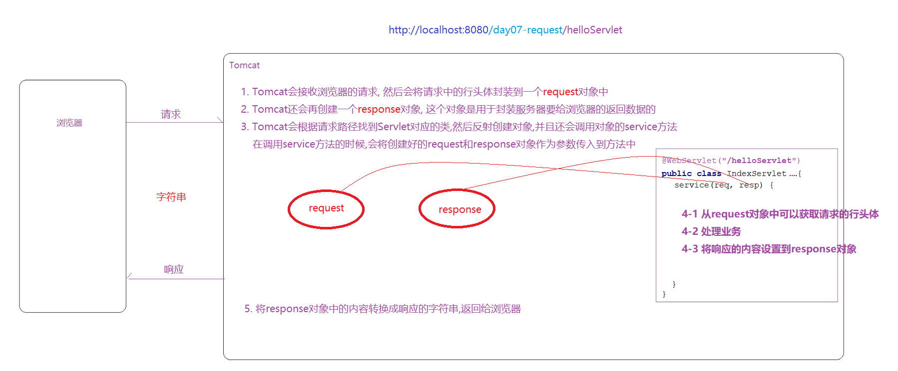

# 回顾

~~~markdown
1. Tomcat
	软件

2. HTTP协议
	浏览器--------通讯标准----------服务器(Tomcat)

3. Servlet使用步骤
	开发一个类  继承HttpServlet
	配置
		xml
			<servlet>
				<servlet-name>helloServlet</servlet-name>
				<servlet-class>com.itheima.servlet.HelloServlet</servlet-class>				
			</servlet>
			<servlet-mapping>
				<servlet-name>helloServlet</servlet-name>
				<url-pattern>/helloServlet</url-pattern>
			</servlet-mapping>
		注解
            @WebServlet("/xxxServlet")
            Class HelloServlet(){}

3. Servlet的配置细节
	loadon-statup
	init-param


4. Servlet的API和生命周期
	init     servlet对象创建  1次
	service  每次servlet被访问的时候调用  多次
	destory  servlet对象销毁  1次	
~~~

  


# Request和Response

>>1. Request和Response对象是哪来的? 作用是什么?
>>2. 我们后序开发的项目是如何跟tomcat协作的?

> ~~~markdown
> 1. HTTP协议的作用: 
> 	浏览器---服务器通讯格式
> 
> 2. Tomcat处理请求和响应的大体流程(见图)
> 
> 3. 我们研究请求和响应的重点应该放在哪里
> 
> ~~~

 

## Request对象

~~~markdown
1. 概述
	Request对象代表客户端的请求，用户通过浏览器访问服务器时，HTTP请求中所有的信息都封装在这个对象中。
	Request对象是由Tomcat创建，开发者可以直接使用这个对象提供的方法获取客户端的请求信息(行  头  体)。

2. 体系结构
    ServletRequest 接口
            |
    HttpServletRequest 接口
            |
    org.apache.catalina.connector.RequestFacade 实现类（由tomcat提供的）
~~~

## Response对象

~~~markdown
1. 概述
	Response对象封装了发往客户端的 响应数据、响应头，响应状态码等信息。
	Response对象是由Tomcat服务器创建，开发者可以直接使用这个对象设置响应信息(行  头  体)。

2. 体系结构
	ServletResponse 接口
		|	
	HttpServletResponse 接口
		|	
	org.apache.catalina.connector.ResponseFacade 实现类（由tomcat提供的）
~~~


# Request获取请求

 

~~~xml
    <dependencies>
        <dependency>
            <groupId>javax.servlet</groupId>
            <artifactId>javax.servlet-api</artifactId>
            <version>3.0.1</version>
        </dependency>

        <dependency>
            <groupId>org.projectlombok</groupId>
            <artifactId>lombok</artifactId>
            <version>1.18.22</version>
        </dependency>
    </dependencies>
~~~

## 请求行(了解)

>>项目虚拟路径指的是什么? 怎么获取?

>~~~markdown
>* 请求行例子:  
>	GET /day04-request/requestLine?name=zs  HTTP/1.1
>
>* 重要方法:
>  1. String getMethod()       获取请求方式
>  2. String getRequestURL()   获取请求完整路径(URL)
>  3. String getRequestURI()   获取请求资源部分(URI)
>  4. String getContextPath()  获取项目虚拟目录  [记住]
>  5. String getServletPath()  获取项目资源路径
>~~~

~~~java
package com.itheima.servlet;

import javax.servlet.ServletException;
import javax.servlet.annotation.WebServlet;
import javax.servlet.http.HttpServlet;
import javax.servlet.http.HttpServletRequest;
import javax.servlet.http.HttpServletResponse;
import java.io.IOException;

//GET /day09-request/requestLineServlet?name=zs  HTTP/1.1
@WebServlet("/requestLineServlet")
public class RequestLineServlet extends HttpServlet {
    @Override
    protected void service(HttpServletRequest req, HttpServletResponse resp) throws ServletException, IOException {
        //1. String getMethod()       获取请求方式
        System.out.println("请求方式:" + req.getMethod());//GET

        //2. String getRequestURL()   获取请求完整路径(URL)
        System.out.println("请求URL:" + req.getRequestURL());// http://localhost:8080/day09-request/requestLineServlet

        //3. String getRequestURI()   获取请求资源部分(URI)
        System.out.println("请求URI:" + req.getRequestURI());// /day09-request/requestLineServlet

        //4. String getContextPath()  获取项目虚拟目录  [记住]
        System.out.println("虚拟路径:" + req.getContextPath());// /day09-request

        //5. String getServletPath()  获取项目资源路径
        System.out.println("资源路径:" + req.getServletPath());// /requestLineServlet
    }
}
~~~


## 请求头(了解)

>>如何获取一个指定的请求头的值

>~~~markdown
>* 请求头例子:  
>	User-Agent: Mozilla/5.0 (Windows NT 10.0; Win64; x64) AppleWebKit/537.36 (KHTML, like Gecko) Chrome/78.0.3904.108 Safari/537.36
>
>* 重要方法:
>	String getHeader(String name)    以String的形式返回指定请求头的值
>~~~

>使用一个案例说明请求头的使用: 判断发送请求的浏览器的类型
>
>~~~markdown
>* 谷歌 Mozilla/5.0 (Windows NT 10.0; Win64; x64) AppleWebKit/537.36 (KHTML, like Gecko) Chrome/79.0.3945.117 Safari/537.36
>* 火狐 Mozilla/5.0 (Windows NT 10.0; Win64; x64; rv:80.0) Gecko/20100101 Firefox/80.0
>~~~

 ~~~java
package com.itheima.servlet;

import javax.servlet.ServletException;
import javax.servlet.annotation.WebServlet;
import javax.servlet.http.HttpServlet;
import javax.servlet.http.HttpServletRequest;
import javax.servlet.http.HttpServletResponse;
import java.io.IOException;

@WebServlet("/requestHeaderServlet")
public class RequestHeaderServlet extends HttpServlet {
    @Override
    protected void service(HttpServletRequest req, HttpServletResponse resp) throws ServletException, IOException {
        //1. 获取指定的请求头的值
        String userAgent = req.getHeader("User-Agent");
        System.out.println("userAgent=" + userAgent);

        //2. 判断
        if (userAgent.contains("Chrome")) {
            System.out.println("谷歌浏览器内核");
        } else if (userAgent.contains("Firefox")) {
            System.out.println("火狐浏览器内核");
        } else {
            System.out.println("未知");
        }
    }
}
 ~~~


## 请求参数(重点)

>>接收请求参数的api有几个? 分别适用于什么场景?

>这里的请求参数指的是通过`请求行传递的参数(get)`和通过`请求体传递的参数(post)`

### 接收请求参数

>~~~markdown
>* 请求参数的位置:
>	get请求:       URL上
>	post请求:      请求体中
>
>* 请求参数例子:
>	name=张三&age=18&hobby=抽烟&hobby=喝酒&hobby=烫头
>
>* 重要方法:
>	1. String getParameter(String name)           根据参数名获得参数值(单个)
>	2. String[] getParameterValues(String name)   根据参数名获得参数值(数组)
>	3. Map<String, String []>  getParameterMap()  获得所有的参数，封装到Map集合
>~~~

 

###  将请求参数封装成实体

>~~~markdown
>* BeanUtils是apache提供的一个工具包
>* 它提供了一个方法:populate，使用这个方法可以请求的将Map转成一个实体对象  BeanUtils.populate(Object obj,Map map);
>* 需要注意的是，map中的key要和实体类中的属性保持一致
>~~~

**① 准备实体类**

 

**② 添加依赖**

~~~xml
        <dependency>
            <groupId>commons-beanutils</groupId>
            <artifactId>commons-beanutils</artifactId>
            <version>1.9.4</version>
        </dependency>
~~~

**③ 接收参数**

 


### 请求参数中文乱码处理

>~~~markdown
>* 在请求参数传递过程中，会出现中文乱码的问题
>* get请求： tomcat8及以上的版本已经解决 （UTF-8）
>* post请求：需要手动解决 
>	乱码原因：浏览器编码(UTF-8)  ------ 服务器解码(ISO-8859-1)
>	解决方案：修改服务器的解码方式为UTF-8即可
>	代码: request.setCharacterEncoding("UTF-8");
>~~~

  


## 请求转发(重点)

### 什么是请求转发

> 请求转发:  一次请求在服务器内部资源之间跳转方式

   

### 请求转发的实现

>~~~java
>req.getRequestDispatcher("/bServlet").forward(req, resp);  //请求转发
>~~~

 **AServlet**

~~~java
package com.itheima.servlet;

import javax.servlet.ServletException;
import javax.servlet.annotation.WebServlet;
import javax.servlet.http.HttpServlet;
import javax.servlet.http.HttpServletRequest;
import javax.servlet.http.HttpServletResponse;
import java.io.IOException;

@WebServlet("/aServlet")
public class AServlet extends HttpServlet {

    @Override
    protected void service(HttpServletRequest req, HttpServletResponse resp) throws ServletException, IOException {
        System.out.println("请求到达了AServlet");

        //req.getRequestDispatcher("/下一步资源路径").forward(req, resp);  //请求转发
        req.getRequestDispatcher("/bServlet").forward(req, resp);
    }
}

~~~

**BServlet**

~~~java
package com.itheima.servlet;

import javax.servlet.ServletException;
import javax.servlet.annotation.WebServlet;
import javax.servlet.http.HttpServlet;
import javax.servlet.http.HttpServletRequest;
import javax.servlet.http.HttpServletResponse;
import java.io.IOException;

@WebServlet("/bServlet")
public class BServlet extends HttpServlet {

    @Override
    protected void service(HttpServletRequest req, HttpServletResponse resp) throws ServletException, IOException {
        System.out.println("请求到达了BServlet");

        req.getRequestDispatcher("/cServlet").forward(req, resp);
    }
}
~~~

**CServlet**

~~~java
package com.itheima.servlet;

import javax.servlet.ServletException;
import javax.servlet.annotation.WebServlet;
import javax.servlet.http.HttpServlet;
import javax.servlet.http.HttpServletRequest;
import javax.servlet.http.HttpServletResponse;
import java.io.IOException;

@WebServlet("/cServlet")
public class CServlet extends HttpServlet {

    @Override
    protected void service(HttpServletRequest req, HttpServletResponse resp) throws ServletException, IOException {
        System.out.println("请求到达了CServlet");

        resp.getWriter().write("ok");
    }
}
~~~

### 请求转发的特点 

~~~markdown
1. 地址栏不发生改变
2. 只能转发到服务器内部资源
3. 转发是一次请求
~~~


## 共享数据(重点)

### request域对象的使用

>~~~markdown
>* Request是一个域对象，可以存储数据，一般用于在一次请求之间进行数据共享
>* 常见方法：
>	void   setAttribute(String name, Object value)	   向request域放入数据 
>	Object getAttribute(String name)                   根据name从向request域获取数据
>	void   removeAttribute(String name)                根据name从request域删除数据 
>~~~

  

 

 

### request对象生命周期

>~~~markdown
>1. 何时创建：Tomcat接收到一个请求，在调用service方法之前创建request对象
>2. 何时销毁：当一个请求离开服务器(响应回到浏览器)的时候，Tomcat就会销毁这个对象
>3. 作用范围：一次请求中
>~~~
>


# Response返回响应

> >使用response对象如何返回响应行、响应头、响应体？

## 返回响应(了解)

~~~markdown
* 响应行
	响应行格式例子：
		HTTP/1.1  200
		HTTP/1.1  302
	设置响应行: 	
		void setStatus(int sc)

* 响应头
	响应头格式例子：
		Location:http://www.baidu.com
		Content-Type:text/html;charset=utf-8
	设置响应头：
		void setHeader(String name, String value)

* 响应体
	通过response获取输出流
		字符流：PrintWriter getWriter() 
		字节流：ServletOutputStream getOutputStream() 
	注意：在同一个servlet中，不能同时使用字节流和字符流
~~~


## 响应重定向(重点)

### 什么是响应重定向

>响应重定向: 服务器通知浏览器去访问另一个地址，即让浏览器再发一次请求

  

### 响应重定向的实现

>~~~markdown
>1. 方式一:
>	response.setStatus(302);
>	response.setHeader("Location", 目标资源位置);
>	
>2. 方式二:
>	response.sendRedirect(目标资源位置)
>~~~

 

### 响应重定向的特点

~~~markdown
1. 地址栏发生改变
2. 重定向到服务器外部资源
3. 重定向是两次请求
4. 不能使用request域共享数据
~~~


## 向浏览器输出字符

>~~~markdown
>* 使用字符流输出内容到浏览器
>	PrintWriter writer = response.getWriter();
>	writer.write("字符串");
>* 统一设置服务器和浏览器编码格式
>	resp.setHeader("content-type","text/html;charset=utf-8")   了解
>	resp.setContentType("text/html;charset=utf-8")             推荐	
>~~~

 


## 向浏览器输出字节

> 我们通过向浏览器输出验证码图片的功能演示字节流的返回
>
> 即: 在服务器端生成验证码图片,返回到浏览器; 浏览器点击验证码可以切换

### 验证码步骤分析

 

### 生成验证码 

**① 加入hutool依赖**

```xml
<dependency>
    <groupId>cn.hutool</groupId>
    <artifactId>hutool-all</artifactId>
    <version>5.8.3</version>
</dependency>
```

**② java生成验证码**

~~~java
package com.itheima.servlet;

import cn.hutool.captcha.LineCaptcha;

import javax.servlet.ServletException;
import javax.servlet.annotation.WebServlet;
import javax.servlet.http.HttpServlet;
import javax.servlet.http.HttpServletRequest;
import javax.servlet.http.HttpServletResponse;
import java.io.IOException;

@WebServlet("/codeServlet")
public class CodeServlet extends HttpServlet {
    @Override
    protected void service(HttpServletRequest req, HttpServletResponse resp) throws ServletException, IOException {
        //1. 生成一张验证码图片对象
        LineCaptcha lineCaptcha = new LineCaptcha(300, 100);
        System.out.println("验证码的数字:" + lineCaptcha.getCode());

        //2. 将图片以字节流的形式返回到浏览器
        lineCaptcha.write(resp.getOutputStream());
    }
}
~~~

**③ html显示验证码**

~~~html
<!DOCTYPE html>
<html lang="en">
<head>
    <meta charset="UTF-8">
    <title>Title</title>
</head>
<body>


</body>
</html>
~~~


# 登录案例

>编写一个页面login.html，用于发送登录请求
>
>编写一个LoginServlet，用于接收请求参数，并处理登录逻辑，返回登录结果

## 思路分析

> ==做这个功能之前,需要自己把下面这个图写一遍==

 

## 环境准备

### 创建模块,导入依赖

 

~~~xml
    <dependencies>
        <!--servlet-->
        <dependency>
            <groupId>javax.servlet</groupId>
            <artifactId>javax.servlet-api</artifactId>
            <version>3.0.1</version>
        </dependency>
        <!--lombok-->
        <dependency>
            <groupId>org.projectlombok</groupId>
            <artifactId>lombok</artifactId>
            <version>1.18.22</version>
        </dependency>
        <!--mysql-->
        <dependency>
            <groupId>mysql</groupId>
            <artifactId>mysql-connector-java</artifactId>
            <version>5.1.47</version>
        </dependency>
        <!--mybatis-->
        <dependency>
            <groupId>org.mybatis</groupId>
            <artifactId>mybatis</artifactId>
            <version>3.5.9</version>
        </dependency>
        <!--日志-->
        <dependency>
            <groupId>log4j</groupId>
            <artifactId>log4j</artifactId>
            <version>1.2.17</version>
        </dependency>
    </dependencies>
~~~

### 创建实体类

 

### 创建Mybatis工具类

 

### 加入配置文件

 

## 代码编写

### 修改默认首页

 

### login.html

 

### LoginServlet

 

### UserMapper

 

### IndexServlet

 


# 重点总结

~~~markdown
* request:
    1. 接收请求行
        虚拟路径 request.getContextpath()
    2. 接收请求头
        request.getHeader(key)
    3. 接收请求参数
        getParameter("name")
        getParameterValues("name")
        getParameterMap()------>Map<String,String[]>------>BeanUtils.populate(obj,map)=====>obj
     4. 转发
     	request.getRequestDispatcher("流转路径{不需要写虚拟路径}").forward(req,resp);
     5. 域对象:
     	set  get  remove
     	生效范围: 一次请求

* response
	1. 重定向
		resp.sendRedirct(req.getContextPath()+"/资源路径")
	2. 设置编码
    	resp.setContentType("text/html;charset=utf-8");
    	
* 转发 和 重定向的区别(面试必问)

1. 实现
	转发（request对象的方法）		
		request.getRequestDispatcher("/BServlet").forward(request,response);
	重定向（response对象的方法）		
		response.sendRedirect("/day07-response/BServlet");		
2. 区别
	转发
		地址栏： 没有改变
		浏览器： 发了一次请求
		服务器： 只有一对请求和响应对象
		发生的位置： 服务器内部
	重定向
		地址栏： 发生了改变
		浏览器： 发了两次请求
		服务器： 有两对请求和响应对象
		发生的位置： 服务器外部
~~~


> 任务安排:
>
> 1. 手写第六章 发送群里
> 2. 了解的内容,练习一遍,有个印象即可,不用记
> 3. 重点的内容,要求大家记住
> 4. 登录案例, 无论你是写几遍, 最后能够默写出来
> 5. 下一次的面试题目为13-18题

