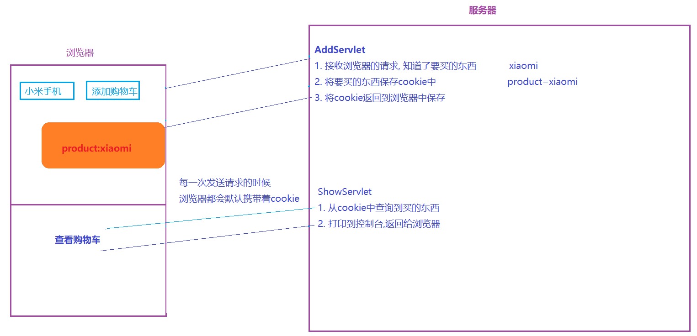
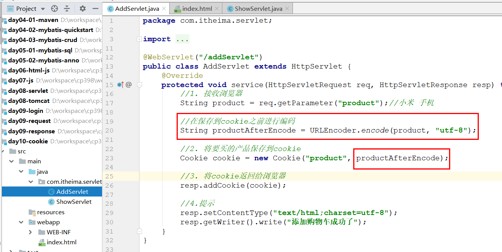
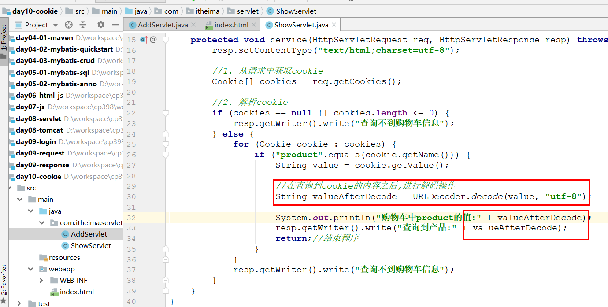
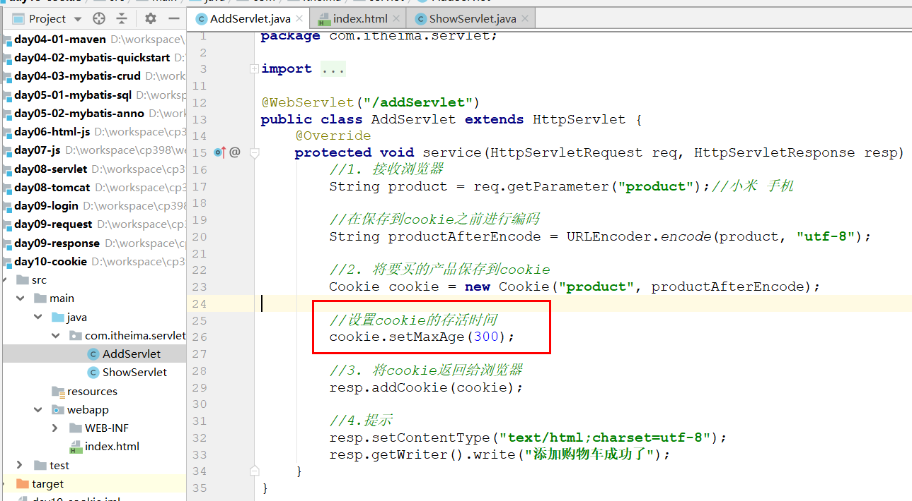
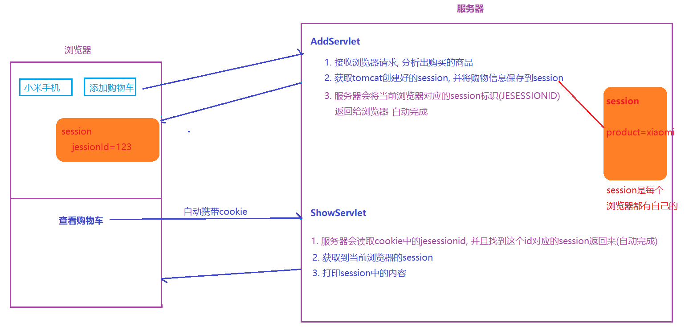
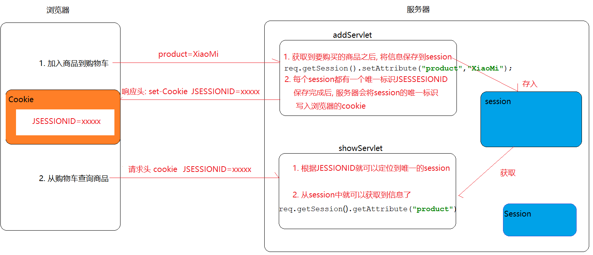
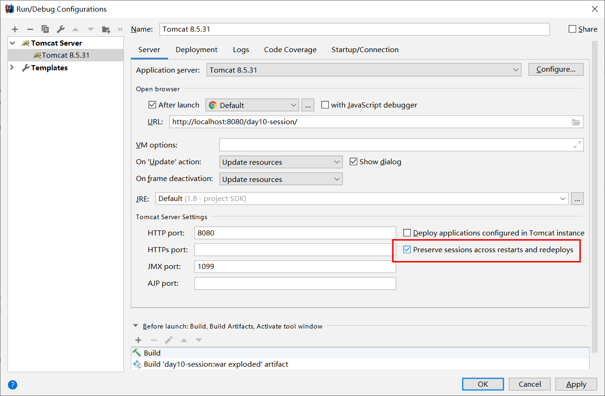

# request域
## 使用方法：一次请求中的数据存储
```markdown
* Request是一个域对象，可以存储数据，一般用于在一次请求之间进行数据共享
* 常见方法：
	void   setAttribute(String name, Object value)	   向request域放入数据 
	Object getAttribute(String name)                   根据name从向request域获取数据
	void   removeAttribute(String name)                根据name从request域删除数据 
```
## 生命周期
```markdown
1. 何时创建：Tomcat接收到一个请求，在调用service方法之前创建request对象
2. 何时销毁：当一个请求离开服务器(响应回到浏览器)的时候，Tomcat就会销毁这个对象
3. 作用范围：一次请求中
```
# Cookie域(在一次会话的多次请求响应之间共享数据)
## 思路分析

## Cookie常用的API
```markdown
创建Cookie: Cookie cookie = new Cookie(key,value)
写回Cookie: resp.addCookie(cookie)
获取Cookie: Cookie[] cookies = request.getCookies()
```
## Cookie是否可以存储中文？
```markdown
在tomcat8版本之后支持中文，但是不支持一些特殊符号，比如说分号、逗号、空格等
如果存储了，会出现错误：An invalid character [32] was present in the Cookie value
为了更好的存储数据，推荐在向cookie中存储数据之前，先进行编码处理；需要使用的时候，从cookie中读取之后再解码，对应的API如下：
    URLEncoder类：static String encode(String s, String enc)  将指定的字符串，按指定的编码表编码
    URLDecoder类：static String decode(String s, String enc)  将指定的字符串，按指定的编码表解码
```


## 有效时长
```markdown
默认情况下，cookie会随着浏览器的关闭而销毁，但是可以通过使用cookie.setMaxAge(时长)来设置，时长参数支持：
		    负数: 随着浏览器的关闭而销毁
		    正数: 代表存活多少s(跟浏览器是否关闭无关)
		    0: 立即销毁
```

## 特点(优缺点)
```markdown
    1. cookie存储数据在客户端（浏览器）
	2. cookie只能存储字符串
	3. cookie单个大小不能超过4KB
```
# Session域(一次会话的多次请求之间共享数据)
## 思路分析

## Session主要使用的API
```markdown
1. 存储数据   void setAttribute(String name,Object value)
2. 获取数据   Object getAttribute(String name)
3. 删除数据   void removeAttribute(String name)
```
## 执行原理
```markdown
* Session的工作是依赖于Cookie的，也要基于HTTP的请求头和响应头的设置实现的
	响应头：Set-Cookie: JSESSIONID=B72574042864B9C7C319684D269BA7C7; Path=/day08_session; HttpOnly
	请求头：Cookie: JSESSIONID=B72574042864B9C7C319684D269BA7C7
	 
* 执行流程
	1. 浏览器向服务器发送一个添加购物车请求
	2. 服务请创建一个Session
	3. 通过程序向Session中添加商品信息
	4. 服务器通过response将session的唯一标识JSESSIONID写回到浏览器的Cookie中（通过Set-Cookie响应头）
	5. 当浏览器发送查询请求的时候，会将cookie中的JSESSIONID信息携带到服务器中（通过Cookie请求头）
	6. 服务器接收到请求之后，通过session的唯一标识定位到session
	7. 我们就就可以通过程序从session获取信息了
```

## 存活时间
### 钝化与活化
```markdown
* 服务器重启，Session数据会不会丢失呢？
* 默认不会，因为服务器在关闭的过程中会将seesion信息保存到磁盘，启动的过程中再从磁盘读取回来，这两个过程分别称为钝化和活化
	钝化：我们tomcat服务器在关闭时，将内存的session数据，序列化到磁盘文件
	活化：我们tomcat服务器在重新启动时，将磁盘文件，反序列化到，服务器内存中...
* 前提条件，我们存放的对象，必须实现序列化接口...
```

### 销毁
```markdown
* session会在下面三种情况下销毁
	1) 用户非活跃状态30分钟（可以调整）
		<session-config>
			<session-timeout>30</session-timeout>
         </session-config>
	2) 服务器非正常关闭（服务器没有时间做钝化）
	3) 使用程序销毁 session.invalidate()
```
## 特点(优点)
```markdown
    1. session存储数据在服务器
    2. session存储类型任意
    3. session存储大小和数量没有限制
    4. session存储相对安全
```