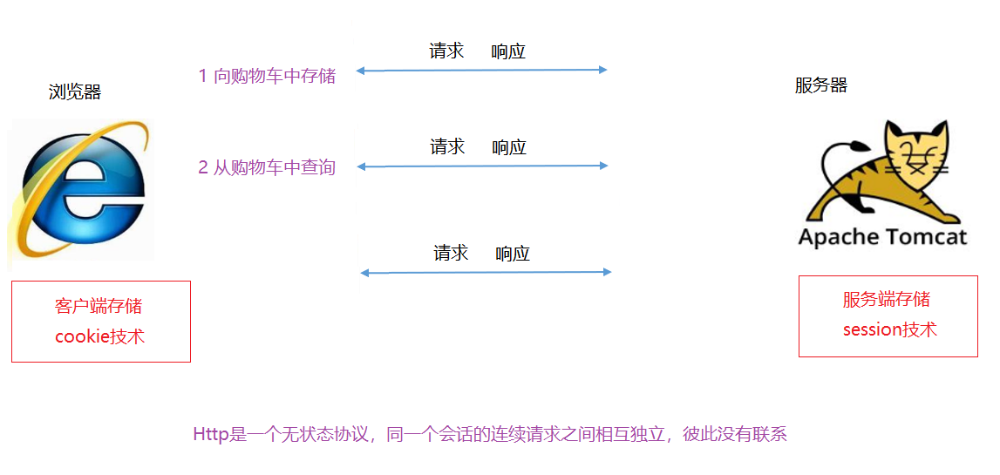
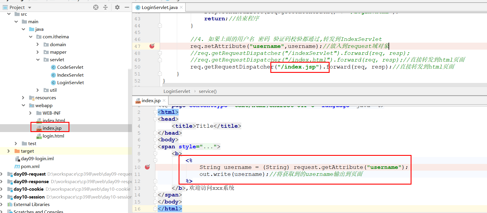

# 回顾

~~~markdown
* request:
	1. 接收参数
		req.getParameter("name")    
		req.getParameterValues("hobby")
		req.getParameterMap()------>BeanUtils.populate(obj,map)------>对象
	
	2. 请求转发
		request.getRequestDispatcher("流转路径{不需要写虚拟路径}").forward(req,resp);
		
	3. 在转发过程中传递数据
		 域对象: set  get  remove
		 
* response
	1. 重定向
		resp.sendRedirct(req.getContextPath()+"/资源路径")
		
	2. 设置编码
		resp.setContentType("text/html;charset=utf-8");  
	
	3. 输出字符
		resp.getWriter().write()
~~~


# 会话

> >1. 会话问题是怎么产生的?
> >2. 会话问题的解决方案有几种? 分别是什么?

## 什么是会话

>在日常生活中，从拨通电话到挂断电话之间的一连串的你问我答的过程就是一个会话。
>
>Web应用中的会话过程类似于生活中的打电话过程，它指的是一个浏览器与Web服务器之间连续发生的一系列请求和响应过程。

  

## 会话技术问题

>**会话问题：**由于Http是一个无状态协议，他不会记录每次请求的状态，这就造成了同一个会话的两请求之间相互独立，彼此没有联系
>
>**解决思路:**  在客户端或者服务端需要一种技术，来记录下一次会话过程中产生的一些数据
>
>**技术引出:**  客户端：cookie   服务端：session

  

 


# Cookie

> Cookie可以在一次会话的多次请求响应之间共享数据，将数据**保存到客户端（浏览器）** 
>
> 需求: 模拟一个基于cookie的购物车(  可以向购物车中存储商品，可以从购物车中查询商品  )

## 思路分析

> >在此案例中,使用cookie记录的内容是什么?这些内容是怎么到cookie中来的?

 

## 代码实现

>~~~markdown
>* Cookie常用的API
>	创建Cookie: Cookie cookie = new Cookie(key,value)
>	写回Cookie: resp.addCookie(cookie)
>	获取Cookie: Cookie[] cookies = request.getCookies()
>~~~

### 创建模块

 

### 创建index.html

 

### AddServlet

 

### ShowServlet

  


## 执行原理

~~~markdown
* Cookie的工作是基于HTTP的请求头和响应头的设置实现的
	响应头：Set-Cookie：product=XiaoMi   
	请求头：Cookie：product=xiaomi  
    
* 执行流程
	1. 浏览器向服务器发送一个添加购物车请求
	2. 服务请创建一个Cookie，并通过response对象将Cookie写回浏览器（通过Set-Cookie响应头）
	3. 浏览器接收到这个响应头之后，会取出里面的信息，存储在自己的cookie空间中
	4. 当浏览器发送查询请求的时候，会将cookie中的信息携带到服务器中（通过Cookie请求头）
	5. 服务器接收到请求之后，就可以通过request对象获取到请求头中的所有Cookie了
~~~

   

## 细节

### 存储中文

~~~markdown
* 问题：Cookie是否可以存储中文？
* 回答：在tomcat8版本之后支持中文，但是不支持一些特殊符号，比如说分号、逗号、空格等
		如果存储了，会出现错误：An invalid character [32] was present in the Cookie value
	   为了更好的存储数据，推荐在向cookie中存储数据之前，先进行编码处理；需要使用的时候，从cookie中读取之后再解码，对应的API如下：
		URLEncoder类：static String encode(String s, String enc)  将指定的字符串，按指定的编码表编码
		URLDecoder类：static String decode(String s, String enc)  将指定的字符串，按指定的编码表解码
~~~

 

 

### 有效时长

~~~markdown
* 问题：cookie的存活时长是多少?
* 回答：默认情况下，cookie会随着浏览器的关闭而销毁，但是可以通过使用cookie.setMaxAge(时长)来设置，时长参数支持：
		负数: 随着浏览器的关闭而销毁
		正数: 代表存活多少s(跟浏览器是否关闭无关)
		0: 立即销毁
~~~

 


## 小结

~~~markdown
1. cookie基本原理
	创建在服务器，保存在浏览器，用于记录一次会话中的请求和响应的信息
	使用的头:
		响应头: 服务器向浏览器保存cookie     Set-Cookie：product=xiaomi   
		请求头：浏览器向服务器报告cookie     Cookie：product=xiaomi   
2. api
	1) 创建cookie: new Cookie(key,value)
		设置存活时间: cookie.setMaxAge(正整数时长)
		中文和字符: 使用编码和解码技术 URL
	2) 将cookie写回浏览器: resp.addCookie(cookie)
	3) 从请求中获取cookie: req.getCookies()
	
3. Cookie特点
	1. cookie存储数据在客户端（浏览器）
	2. cookie只能存储字符串
	3. cookie单个大小不能超过4KB
~~~


# Session

> Session可以在一次会话的多次请求之间共享数据，它将数据保存到服务器，并且无大小限制
>
> 需求: 模拟一个基于session的购物车(  可以向购物车中存储商品，可以从购物车中查询商品  )

## 思路分析

 >>在此案例中,使用session记录的内容是什么?这些内容是怎么到session中来的?

 

## 代码实现

>~~~markdown
>* HttpSession也是一个域对象，它的API主要包含下面三个
>	1. 存储数据   void setAttribute(String name,Object value)
>	2. 获取数据   Object getAttribute(String name)
>	3. 删除数据   void removeAttribute(String name)
>~~~

###  创建模块

 

### 创建index.html

 

### AddServlet

 

### ShowServlet

 


## 执行原理

~~~markdown
* Session的工作是依赖于Cookie的，也要基于HTTP的请求头和响应头的设置实现的
	响应头：Set-Cookie: JSESSIONID=B72574042864B9C7C319684D269BA7C7; Path=/day08_session; HttpOnly
	请求头：Cookie: JSESSIONID=B72574042864B9C7C319684D269BA7C7
	 
* 执行流程
	1. 浏览器向服务器发送一个添加购物车请求
	2. 服务请创建一个Session
	3. 通过程序向Session中添加商品信息
	4. 服务器通过response将session的唯一标识JSESSIONID写回到浏览器的Cookie中（通过Set-Cookie响应头）
	5. 当浏览器发送查询请求的时候，会将cookie中的JSESSIONID信息携带到服务器中（通过Cookie请求头）
	6. 服务器接收到请求之后，通过session的唯一标识定位到session
	7. 我们就就可以通过程序从session获取信息了
~~~

  


## 细节

### 钝化与活化

```markdown
* 服务器重启，Session数据会不会丢失呢？
* 默认不会，因为服务器在关闭的过程中会将seesion信息保存到磁盘，启动的过程中再从磁盘读取回来，这两个过程分别称为钝化和活化
	钝化：我们tomcat服务器在关闭时，将内存的session数据，序列化到磁盘文件
	活化：我们tomcat服务器在重新启动时，将磁盘文件，反序列化到，服务器内存中...
* 前提条件，我们存放的对象，必须实现序列化接口...
```

 

### 销毁

```markdown
* session会在下面三种情况下销毁
	1) 用户非活跃状态30分钟（可以调整）
		<session-config>
			<session-timeout>30</session-timeout>
         </session-config>
	2) 服务器非正常关闭（服务器没有时间做钝化）
	3) 使用程序销毁 session.invalidate()
```

## 小结

~~~markdown
1. session基本原理
    创建服务器，保存在服务器，用于记录一次会话中的请求和响应的信息
    使用的头:
		响应头: 服务器向浏览器保存cookie     Set-Cookie：JESESSIONID=session标识   
		请求头：浏览器向服务器报告cookie     Cookie：JESESSIONID=session标识  
        
2. api
	1) 创建Session: req.getSession()
	2) 向session中保存数据:setAttribute(key,value)
	3) 从session中获取数据:getAttribue(key)
	4) 摧毁session:session.invlidate()
	
3. sessione特点
    1. session存储数据在服务器
    2. session存储类型任意
    3. session存储大小和数量没有限制
    4. session存储相对安全
~~~


# 登录案例

> 需求说明：用户访问带有验证码的登录页面，输入用户名，密码以及验证码实现登录功能。

## 需求分析

  

## 代码实现

### 加入依赖

 

### 创建CodeServlet

 

### 修改login.html

 

### 修改LoginServlet

 

### 优化

**添加依赖**

~~~xml
        <!--jsp-->
        <dependency>
            <groupId>javax.servlet.jsp</groupId>
            <artifactId>javax.servlet.jsp-api</artifactId>
            <version>2.3.3</version>
        </dependency>
~~~

**添加jsp**

 


# JSP技术

JSP（Java Server Pages）是SUN公司在Servlet的基础上推出的一种技术，它将Java代码和HTML语句混合在同一个文件中编写

JSP页面是由HTML语句 (输出静态部分)  和 Java代码(输出动态部分) 组成的文件，其后缀名为.jsp

## 入门案例

> 需求：编写一个JSP页面，实现一个输出当前时间的功能。显示效果为：`欢迎访问本网站，当前时间为: xxxx-xx-xx xx:xx`

 

>~~~java
>* <%  Java代码  %>  
>	jsp脚本作用: 在jsp中编写逻辑Java代码，这里面编写的代码, 编译之后会直接出现在servlet的service()方法中
>~~~

## 运行流程

> JSP本质上就是一个Servlet，其真正运行之前是要先转换成Servlet的。

~~~markdown
1. 客户端发出请求
2. web容器将jsp转化为servlet代码（.java）
3. web容器将转化为servlet代码编译（.class）
4. web容器加载编译后的代码并执行
5. 将执行结果响应给客户端
~~~


## EL表达式

>EL（Expression Language）表达式语言，主要用来简化jsp中对java代码的操作，它可以从jsp的域对象中获取数据
>
>语法：${表达式}

JavaWeb中目前我们有用的有两大域对象，分别是：

* request：当前请求有效
* session：当前会话有效

el 表达式获取数据，会依次从这2个域中寻找，直到找到为止。

 

 **AServlet** 

> 这个代码不用写 直接复制走,主要写下面两个jsp

 ~~~java
package com.itheima.servlet;

import com.itheima.domain.User;

import javax.servlet.ServletException;
import javax.servlet.annotation.WebServlet;
import javax.servlet.http.HttpServlet;
import javax.servlet.http.HttpServletRequest;
import javax.servlet.http.HttpServletResponse;
import java.io.IOException;
import java.util.ArrayList;

//向域对象中放入值
@WebServlet("/aServlet")
public class AServlet extends HttpServlet {
    @Override
    protected void service(HttpServletRequest req, HttpServletResponse resp) throws ServletException, IOException {
        //1. 向request域对象中放入name
        req.setAttribute("name", "requestName");

        //2. 向session域对象中放入name
        req.getSession().setAttribute("name", "sessionName");

        //4. 向域对象中放入不同类型的数据
        //4-1 对象
        User user = new User();
        user.setUsername("张三");
        user.setBalance(100f);
        req.setAttribute("user", user);

        //4-2 集合
        ArrayList<String> list = new ArrayList<String>();
        list.add("王五");
        list.add("赵六");
        req.setAttribute("userList", list);

        //请求转发到a.jsp
        req.getRequestDispatcher("/a.jsp").forward(req, resp);
    }
}
 ~~~

### 获取域对象中的数据

>~~~markdown
>* 获取精准域中数据
>	${requestScope.键名}       从HttpServletRequest域中获取
>	${sessionScope.键名}       从HttpSession域中获取
>
>* 简化写法
>	${键名}   按照上面的域范围从小到大依次从2个域中进行查找；如果从某一个域中找到了，立即返回；如果2个域中都没有，则返回空
>~~~

~~~jsp
<%@ page contentType="text/html;charset=UTF-8" language="java" %>
<html>
<head>
    <title>Title</title>
</head>
<body>

<h3>获取域对象中得值</h3>
request域对象中得name的值:${requestScope.name}<br>
session域对象中得name的值:${sessionScope.name}<br>

省略了域对象的标识: ${name}

</body>
</html>
~~~

### 获取不同类型的数据

>~~~markdown
>* 获取不同类型的数据:
>	简单类型：${键名}
>	对象类型：${键名.属性名}
>	集合类型：${键名[索引]}
>~~~

~~~jsp
<%@ page contentType="text/html;charset=UTF-8" language="java" %>
<html>
<head>
    <title>Title</title>
</head>
<body>

<h3>获取域对象中得值</h3>
request域对象中得name的值:${requestScope.name}<br>
session域对象中得name的值:${sessionScope.name}<br>

省略了域对象的标识: ${name}


<h3>获取域对象中各种类型的值</h3>
获取域对象中的对象:${user22.username}--${user22.balance}<br>
获取域对象中的集合:${userList[0]}--${userList[1]}
</body>
</html>
~~~

  
