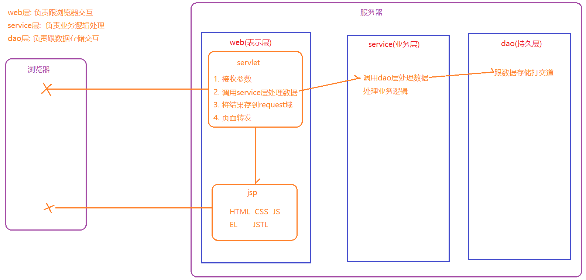
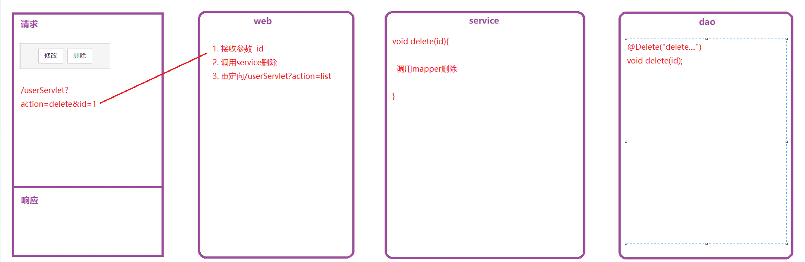
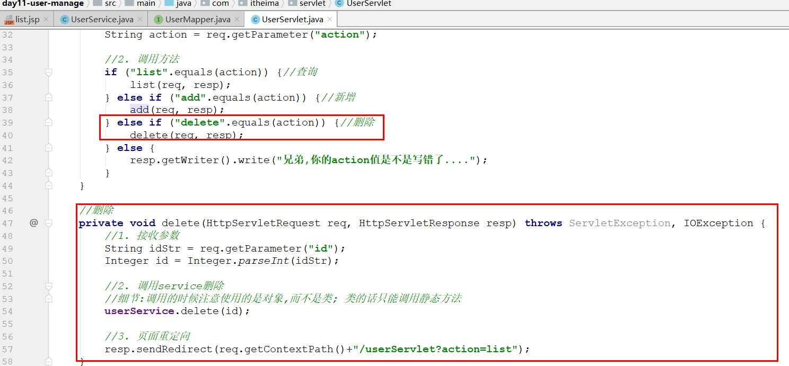
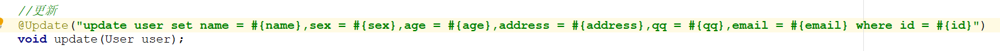
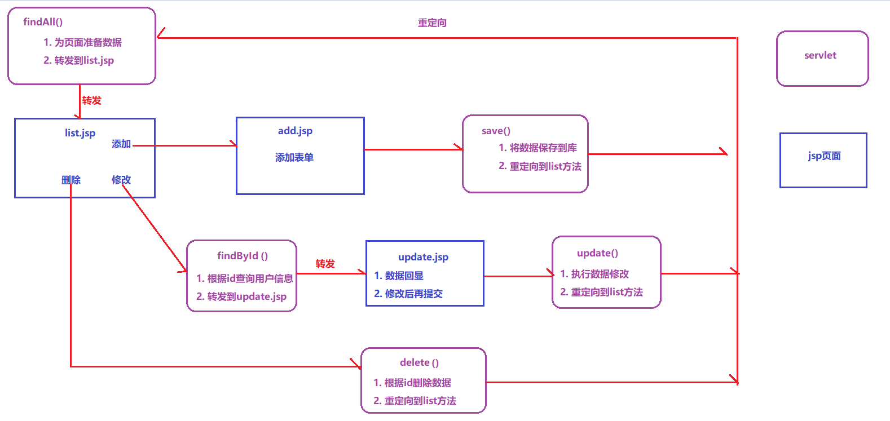

# 回顾

~~~markdown
1. 会话跟踪技术 cookie session

2. 页面渲染技术 jsp EL
~~~

# JSTL表达式

>JSTL (Jsp Standard Tag Library）Jsp标准标签库，是一套由Apache组织开源的jsp标签库，用来替换和简化jsp页面中java代码。

## 环境准备

### 添加依赖

 ~~~xml
<dependency>
    <groupId>jstl</groupId>
    <artifactId>jstl</artifactId>
    <version>1.2</version>
</dependency>
 ~~~

### User

 

### JstlServlet

~~~java
package com.itheima.servlet;

import com.itheima.domain.User;

import javax.servlet.ServletException;
import javax.servlet.annotation.WebServlet;
import javax.servlet.http.HttpServlet;
import javax.servlet.http.HttpServletRequest;
import javax.servlet.http.HttpServletResponse;
import java.io.IOException;
import java.util.ArrayList;

@WebServlet("/jstlServlet")
public class JstlServlet extends HttpServlet {
    @Override
    protected void service(HttpServletRequest req, HttpServletResponse resp) throws ServletException, IOException {

        //1. 模拟一个user对象,放入request
        User user = new User(1, "xiaoming", "123456", 12f);
        req.setAttribute("currentUser", user);

        //2. 模拟一个user集合放入request域中
        ArrayList<User> userList = new ArrayList<User>();
        userList.add(new User(2, "张三", "123456", 18f));
        userList.add(new User(3, "李四", "123456", 19f));
        userList.add(new User(4, "王五", "123456", 20f));
        req.setAttribute("userList", userList);

        req.getRequestDispatcher("/jstl.jsp").forward(req, resp);
    }
}
~~~

## if标签

~~~markdown
* if标签用于单分支条件判断，相当于Java中的`if(条件){}`的用法，它的常见用法如下：
    <c:if test="条件">
    	条件成立的逻辑
    </c:if>
* 注意: 它只有if的功能，没有else的功能，如果需要else，需要自己取反操作
~~~

 

  ~~~jsp
  <%@ page contentType="text/html;charset=UTF-8" language="java" %>

<%--使用JSTL必须引入下面这句话--%>
<%@ taglib prefix="c" uri="http://java.sun.com/jsp/jstl/core" %>

<html>
<head>
    <title>Title</title>
</head>
<body>
<h3>展示user对象</h3>
user的name:${currentUser.username} 
user的balance:${currentUser.balance} 

<h3>按照要求展示user对象</h3>
user的name:${currentUser.username},他有${currentUser.balance},我们称他为:
<c:if test="${currentUser.balance > 10}">高富帅</c:if>
<c:if test="${currentUser.balance <= 10}">矮穷矬</c:if>

</body>
</html> 
  ~~~

## forEach标签

~~~markdown
* forEach用于循环遍历，相当于java中的for关键字，它的常见属性如下：
	begin：设置循环的开始
	end：设置循环的结束
	var：声明循环过过程中的临时遍历
	step：设置步长——间隔几次循环，执行一次循环体中的内 
	items：指定要循环的对象
	varStatus：保存了当前循环过程中的信息（循环的开始、结束、步长、次数等）
* forEach标签的主要用法有下面两种：
	1.  增强for循环
		<c:forEach items="数据集合" var="x">
            ${x}
		</c:forEach>
	
	2.  普通for循环
		<c:forEach begin="1" end="10" step="1" var="x">
            ${x}
		</c:forEach>
	
~~~

### 增强for循环

>~~~java
>for(User user : userList){
>	user
>}
>~~~

 ~~~jsp
 <h3>userList遍历出来</h3>
<%--
    items="要遍历的集合"
    var="临时变量的名字"
    varStatus="status"   ${status.count}  循环到哪一次了
--%>
<c:forEach items="${userList}" var="user" varStatus="status">
    ${status.count}--${user.username} 
</c:forEach>
 ~~~

### 普通for循环

>~~~java
>for(int i = 0; i < 10; i++){
>    	i
>}
>~~~

 ~~~jsp
<h3>打印从0到10的偶数</h3>
<%--
    begin="开始"
    end="结束"
    step="步长"
    var="临时变量"
--%>
<c:forEach begin="0" end="10" step="2" var="i">
    ${i} 
</c:forEach>
 ~~~

# mvc模式（理解）

>MVC是Model-View-Controller（模型-视图-控制器）的简称，其主要作用是将视图展示和业务控制代码分离开来。
>

~~~markdown
* Model（模型）: 指的就是数据或者数据的来源

* View （视图）: 指的就是可视化界面

* Controller（控制器）: 控制器作用于模型和视图上，负责请求的调度，它使视图与模型分离开来
~~~

 

# 三层架构（重点）

> 为了实现代码的层次清晰，分工明确，通常会将一个应用划分成三层架构：表示层、业务逻辑层、数据访问层。

~~~markdown
* 表示层(web层)：与浏览器进行数据交互

* 业务层(service层): 专门用于处理业务逻辑 

* 持久层(dao层): 与数据库进行数据交换
~~~

 

  

# 用户管理（两遍）

## 总体分析

>按照三层架构开发程序 

 

## 环境搭建

### 创建数据库表

 

### 创建模块,导入依赖

 

~~~xml
    <dependencies>
        <dependency>
            <groupId>mysql</groupId>
            <artifactId>mysql-connector-java</artifactId>
            <version>5.1.47</version>
        </dependency>
        <dependency>
            <groupId>org.mybatis</groupId>
            <artifactId>mybatis</artifactId>
            <version>3.5.9</version>
        </dependency>
        <dependency>
            <groupId>log4j</groupId>
            <artifactId>log4j</artifactId>
            <version>1.2.17</version>
        </dependency>
        <dependency>
            <groupId>commons-beanutils</groupId>
            <artifactId>commons-beanutils</artifactId>
            <version>1.8.3</version>
        </dependency>
        <dependency>
            <groupId>javax.servlet.jsp</groupId>
            <artifactId>javax.servlet.jsp-api</artifactId>
            <version>2.3.3</version>
        </dependency>
        <dependency>
            <groupId>javax.servlet</groupId>
            <artifactId>javax.servlet-api</artifactId>
            <version>3.0.1</version>
        </dependency>
        <dependency>
            <groupId>jstl</groupId>
            <artifactId>jstl</artifactId>
            <version>1.2</version>
        </dependency>
    </dependencies>
~~~

### 创建包结构

>5个基础包
>
>servlet
>
>service
>
>mapper
>
>domain
>
>util

  

### 复制文件

  

### 复制界面

 

### 部署测试

 

## 用户查询

> **需求**：点击显示用户列表，完成显示用户列表功能 

 

### index.jsp

 

### UserListServlet

 

### UserService

 

### UserMapper

 

### list.jsp

 

## 添加用户

> **需求**：点击添加用户跳转添加用户页面，在添加用户页面，添加新的用户

### add.jsp

 

### UserAddServlet

 

### UserService

 

### UserMapper

 

### 注意问题

>==请求转发造成表单提交问题==

 

>==事务出现问题无法关闭的问题==

   

## Servlet优化(听一下视频)

>使用一个Servlet处理增删改查请求

 

### 创建一个新的servlet

 

>注意步骤:
>
>1. 不要忘记修改add方法最后重定向的路径
>2. 不要忘记提升UserService为成员变量
>3. 不要忘记删除add()方法中第一句设置字符集的语句

~~~java
package com.itheima.servlet;

import com.itheima.domain.User;
import com.itheima.service.UserService;
import org.apache.commons.beanutils.BeanUtils;

import javax.servlet.ServletException;
import javax.servlet.annotation.WebServlet;
import javax.servlet.http.HttpServlet;
import javax.servlet.http.HttpServletRequest;
import javax.servlet.http.HttpServletResponse;
import java.io.IOException;
import java.util.List;
import java.util.Map;

//此servlet可以接收关于user的所有请求, 包含增删改查
@WebServlet("/userServlet")
public class UserServlet extends HttpServlet {
    @Override
    protected void service(HttpServletRequest req, HttpServletResponse resp) throws ServletException, IOException {
        //0. 处理中文乱码
        req.setCharacterEncoding("utf-8");
        resp.setContentType("text/html;charset=utf-8");

        //1. 接收action的值,就可以判断出请求的目的
        String action = req.getParameter("action");

        //2. 调用方法
        if ("list".equals(action)) {//查询
            list(req, resp);
        } else if ("add".equals(action)) {//新增
            add(req, resp);
        } else {
            resp.getWriter().write("兄弟,你的action值是不是写错了....");
        }
    }

    //将UserService提升为了成员变量
    private UserService userService = new UserService();

    //查询
    private void list(HttpServletRequest req, HttpServletResponse resp) throws ServletException, IOException {
        //1. 调用service查询
        List<User> userList = userService.findAll();

        //2. 将查询结果保存到request域对象
        req.setAttribute("userList", userList);

        //3. 请求转发到list.jsp
        req.getRequestDispatcher("/list.jsp").forward(req, resp);
    }

    //新增
    private void add(HttpServletRequest req, HttpServletResponse resp) throws IOException {
        
        //1. 接收参数
        Map<String, String[]> map = req.getParameterMap();
        User user = new User();
        try {
            BeanUtils.populate(user, map);
        } catch (Exception e) {
            e.printStackTrace();
        }

        //2. 调用service保存
        userService.save(user);

        //3. 页面转发
        resp.sendRedirect(req.getContextPath() + "/userListServlet?action=list");//重定向
    }
}
~~~

### 修改页面的连接

 

## 删除用户

> **需求**：点击删除按钮删除当前一整行数据，删除之后重新查询全部用户列表

 

### list.jsp

 

### UserServlet

 

### UserService

 

### UserMapper

 

## 修改用户-信息回显

> **需求**：点击修改按钮，跳转到更新页面（回显数据）

### list.jsp

 

### UserServlet

 

### UserService

 

### UserMapper

 

### update.jsp

 

## 修改用户-信息修改

> **需求**：重写输入用户信息，点击提交，更新信息

 

### update.jsp

 

### UserServlet

 

### UserService

 

### UserMapper

 

## 调用关系总结

