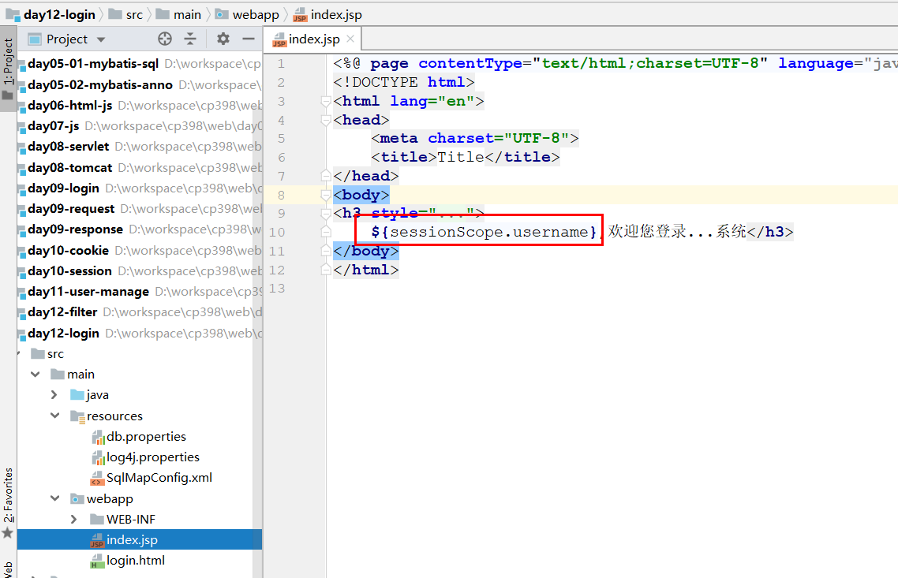

# 过滤器（重点）

## 介绍

> >1. 过滤器的两个核心操作是什么?
> >2. 过滤器的工作位置在什么地方?

~~~markdown
* 生活中的过滤器(先拦住  再处理)
	净水器、安检

* web中的过滤器
	当用户访问服务器资源时，过滤器将请求拦截下来，完成一些通用的功能
	
* 应用场景
	统一编码处理、登录验证
~~~

  


## 入门案例

>实现一个服务器资源的的访问，然后使用过滤器拦截住请求，打印日志(时间)。

> >1. 案例中的两个核心步骤是什么?
> >2. 两个核心步骤的作用是什么?

### 创建模块,导入依赖

 

~~~xml
    <dependencies>
        <dependency>
            <groupId>javax.servlet</groupId>
            <artifactId>javax.servlet-api</artifactId>
            <version>3.0.1</version>
        </dependency>
        <dependency>
            <groupId>javax.servlet.jsp</groupId>
            <artifactId>javax.servlet.jsp-api</artifactId>
            <version>2.3.3</version>
        </dependency>
    </dependencies>
~~~

### 创建资源文件

 

### 创建过滤器

>开发一个过滤的类，内容是过滤器应该怎么工作

 

### 配置过滤器

> 配置当前过滤器应该拦截哪些内容

 

## 执行流程

~~~markdown
* 一个Filter的执行流程：
	1. 客户端向服务器发起访问资源的请求
	2. Filter将请求拦截住，开始处理访问资源之前的逻辑
	3. Filter决定是否要放行访问请求，如果放行，请求继续向后运行
	4. 请求访问到相关资源，然后服务器给出响应
	5. Filter将响应拦截住，开始处理访问资源之后的逻辑
	6. 服务器将响应返回给浏览器
~~~

 


## 生命周期

> >Filter声明周期中的三个核心方法是什么? 每个方法在什么时候被调用?

~~~markdown
* 研究Filter的生命周期就是研究它的创建、销毁、工作时机。对应着这三个过程，Filter提供了三个方法：
	init：过滤器的初始化方法，服务器启动的时候执行一次。
	doFilter：当请求满足拦截路径条件时执行，可执行多次。
	destory：过滤器的销毁方法，服务器停止或者将项目从服务器中移除的时候执行一次。
~~~

  


## 拦截路径

> >Filter支持几种路径拦截方式?分别使用什么场景?

~~~markdown
* 在Filter中的url-pattern支持下面的匹配方式:
	1. 精确匹配：直接匹配到某个资源上
	2. 路径匹配：匹配某个目录，要求以/开头，以`*`结尾
	3. 后缀匹配：根据后缀匹配，要求以`*.`开头
~~~

  

  

## 注解写法

~~~markdown
* 使用注解可以简化xml的配置,常用注解选项如下:
	value 指定拦截的路径，等同于 urlPatterns
~~~

  


## 过滤器链

> 程序有时需要对同一个资源进行多重过滤，这就可以配置多个过滤器，称为过滤器链。
>
> 只有过滤器链中的所有的过滤器都对请求路径放行，请求才能访问到目标资源。

  

> >多个过滤器构成的过滤器链中,如何来设定它们的先后执行顺序?

**① 准备测试Filter**

> **AFilter**

~~~java
package com.itheima.filter;

import javax.servlet.*;
import java.io.IOException;

public class AFilter implements Filter {

    public void doFilter(ServletRequest servletRequest, ServletResponse servletResponse, FilterChain filterChain) throws IOException, ServletException {
        System.out.println("进入了AFilter,在访问资源之前...");
        
        //放行
        filterChain.doFilter(servletRequest,servletResponse);

        System.out.println("回到了AFilter,在访问资源之后...");
    }


    public void init(FilterConfig filterConfig) throws ServletException {
    }

    public void destroy() {
    }
}
~~~

> **BFilter**

~~~java
package com.itheima.filter;

import javax.servlet.*;
import java.io.IOException;

public class BFilter implements Filter {

    public void doFilter(ServletRequest servletRequest, ServletResponse servletResponse, FilterChain filterChain) throws IOException, ServletException {
        System.out.println("进入了BFilter,在访问资源之前...");

        //放行
        filterChain.doFilter(servletRequest,servletResponse);

        System.out.println("回到了BFilter,在访问资源之后...");
    }


    public void init(FilterConfig filterConfig) throws ServletException {
    }

    public void destroy() {
    }
}

~~~

**② xml版本**

> 根据filter-mapping的先后顺序来决定过滤器的顺序， 哪个过滤器的filter-mapping在前面先执行哪个

 

**③ 注解版本**

> 根据过滤器类名称的字符排序，值小的先执行

  

## 案例

> 实现一个用户登录和登录校验的功能
>
> 1. 实现一个用户登录功能，注意要使用post提交用户名和密码
>
> 2. 为了统一解决中文乱码问题，添加中文乱码过滤器
> 3. 为了保证只有用户登录之后才能访问系统首页，添加资源访问过滤器

 

### 用户登录

> 实现用户登录功能

 

### 中文乱码过滤器

>添加过滤器实现中文乱码处理

 

### 资源访问过滤器

>添加过滤器实现系统首页在未登录状态下不能被访问

   

**① LoginServlet**

 

**② LoginFilter**

 

**③ index.jsp**

 


# 监听器（了解）

~~~markdown
1. 生活中的监听器
	摄像头，可以监视客户的一举一动。如果客户有违法行为，商场可以采取相应的措施。
	
2. web中的监听器
	web程序中，监视器监视域对象对象，一旦其发生相应的变化，就采取相应的操作。
	
3. 主要应用场景
	统计在线人数、系统启动时初始化配置信息

4. 说明
	web中的监听器在开发中使用的比较少，主要用于监听web三大域对象：Request、Session、ServletContext.
	主要监听这三个域对象的创建和销毁以及域对象中存储对象的增加和减少.
	web中的监听器一共有8个(扩展):
        ServletContextListener   监听ServletContext对象的创建和销毁
        HttpSessionListener      监听HttpSession对象的创建和销毁
        ServletRequestListener   监听ServletRequest对象的创建和销毁
        
        ServletContextAttributeListener   监听ServletContext对象的数据的变化
        HttpSessionAttributeListener      监听HttpSession对象的数据的变化
        ServletRequestAttributeListener   监听ServletRequest对象的数据的变化
       
        HttpSessionBindingListener     监听自己被绑定、解绑到HttpSession中
        HttpSessionActivationListener  监听自己被钝化或激活了
    他们的使用方式是基本一致的，我们使用其中的一个(ServletContextListenner)来做演示
~~~

> 使用**ServletContextListener**来学习下监听器的使用步骤，因为这个监听器是监听器中使用率最高的一个，其它监听器的使用方式都类似。
>
> 我们使用这个监听器可以在项目启动和销毁的时候做一些事情，例如，在项目启动的时候加载配置文件。

## 开发Listener

 

## 配置Listener

### xml

 

### 注解

 


# JSON（重点）

## 概述 

> >1. JSON的本质什么? 作用又是什么? 
> >2. 我们在什么时候会用到JSON?

> JSON（JavaScript Object Notation）翻译为JavaScript对象，这是JS语言的对象表示形式，常用项目前后端之间的信息交互
>

```markdown
* java对象表示形式
    User user = new User();
    user.setUsername("后羿");
    user.setAge(23);
    user.setSex("男");
			
* javaScript对象(JSON)表示形式
    {
        "username":"后羿",
        "age":23,
        "sex":"男",
    }
* 注意： json中的键必须是字符串类型
```

 


## 基础语法

> >如何使用JSON来表示对象和集合?

> ~~~markdown
> * 对象类型(map  对象)
> 		{
> 			name:value,
> 			name:value
> 		}   
> 
> * 数组类型(数组 list)
> 		List<String>
> 		[
> 			"张三","李四","王五"
> 		]
> 		
> 		List<User>
> 		[
>             {"name":"zs","age":18},
>             {"name":"ls","age":19}
> 		]
> ~~~

**练习json的格式**

~~~html
<!DOCTYPE html>
<html lang="en">
<head>
    <meta charset="UTF-8">
    <title>Title</title>
</head>
<body>

<script>
    // 1.描述用户对象（张三丰、男、32岁）

    // 2.描述用户数组（张三丰、张翠山、张无忌）

    // 3.描述韦小宝（27岁，老婆、师傅）

</script>
</body>
</html>
~~~

```html
<!DOCTYPE html>
<html lang="en">
<head>
    <meta charset="UTF-8">
    <title>Title</title>
</head>
<body>

<script>
    // 1.描述用户对象（张三丰、男、32岁）
    let user = {
        "name": "张三丰",
        "sex": "男",
        "age": "32岁"
    };
    console.log(user.name + ":" + user.sex + ":" + user.age);

    // 2.描述用户数组（张三丰、张翠山、张无忌）
    let arr1 = ["张三丰", "张翠山", "张无忌"];
    for (let user of arr1) {
        console.log(user);
    }

    let arr2 = [
        {"name": "张三丰", "sex": "男", "age": "32岁"},
        {"name": "张翠山", "sex": "男", "age": "22岁"},
        {"name": "张无忌", "sex": "男", "age": "2岁"}
    ];

    for (let user of arr2) {
        console.log(user.name + ":" + user.sex + ":" + user.age);
    }

    // 3.描述韦小宝（27岁，老婆、师傅）
    let xiaobo = {
        "name": "韦小宝",
        "age": "27岁",
        "wife": [
            {"name": "双儿", "age": 18, "address": "扬州"},
            {"name": "苏荃", "age": 28, "address": "神龙岛"}
        ],
        "teacher": {
            "name": "独臂神尼", "age": "56"
        }
    };

    console.log("name="+xiaobo.name+",age="+xiaobo.age);
    for (let wife of xiaobo.wife) {
        console.log("name="+wife.name+",age="+wife.age);
    }
    console.log("name="+xiaobo.teacher.name+",age="+xiaobo.teacher.age);

</script>
</body>
</html>
```

## JAVA转换

| 工具名称    | 介绍                                                 |
| ----------- | ---------------------------------------------------- |
| Jsonlib     | Java类库，需要导入的jar包较多                        |
| Gson        | google提供的一个简单的json转换工具                   |
| Fastjson    | alibaba技术团队提供的一个高性能的json转换工具        |
| **Jackson** | 开源免费的json转换工具，springmvc转换默认使用jackson |

> >使用Jackson如何将一个对象转换成JSON, 又如何将一个JSON转换为对象

~~~markdown
* Jackson完成数据转换使用的类是ObjectMapper，它有两个主要方法:
	String writeValueAsString(Object obj): 将一个对象转换为json字符串
	T readValue(String json, Class clazz): 将一个字符串转换为指定类型的对象 
~~~

### 添加依赖

 

```xml
<!--json转换-->
<dependency>
    <groupId>com.fasterxml.jackson.core</groupId>
    <artifactId>jackson-databind</artifactId>
    <version>2.13.1</version>
</dependency>
<dependency>
    <groupId>junit</groupId>
    <artifactId>junit</artifactId>
    <version>4.13.2</version>
</dependency>
```

### java转为json

```java
package com.itheima.test;

import com.fasterxml.jackson.core.JsonProcessingException;
import com.fasterxml.jackson.databind.ObjectMapper;
import com.itheima.domain.User;
import org.junit.Test;

import java.util.ArrayList;
import java.util.HashMap;
import java.util.List;
import java.util.Map;

public class Java2Json {

    //对象转换为json
    @Test
    public void test1() throws JsonProcessingException {
        //1. 准备一个对象
        User user = new User("1", "张三", "男", 18, "北京", "123", "123@qq.com");

        //2. 对象转json
        String json = new ObjectMapper().writeValueAsString(user);
        System.out.println(json);
    }

    //集合转换为json
    @Test
    public void test2() throws JsonProcessingException {
        //1. 准备一个对象对象
        List<User> userList = new ArrayList<User>();
        userList.add(new User("1", "张三", "男", 18, "北京", "123", "123@qq.com"));
        userList.add(new User("2", "李四", "男", 18, "北京", "123", "123@qq.com"));

        //2. 对象转json
        String json = new ObjectMapper().writeValueAsString(userList);
        System.out.println(json);
    }


    //map转换为json
    @Test
    public void test3() throws JsonProcessingException {
        //1. 准备一个对象对象
        Map<String, String> map = new HashMap<String, String>();
        map.put("name","张三");
        map.put("sex","男");

        //2. 对象转json
        String json = new ObjectMapper().writeValueAsString(map);
        System.out.println(json);
    }
}

```

### json转为java

```java
package com.itheima.test;

import com.fasterxml.jackson.core.JsonProcessingException;
import com.fasterxml.jackson.databind.ObjectMapper;
import com.itheima.domain.User;
import org.junit.Test;

import java.util.ArrayList;
import java.util.HashMap;
import java.util.List;
import java.util.Map;

public class Json2Java {

    //对象转换为json
    @Test
    public void test1() throws JsonProcessingException {
        //1. 准备一个json串
        String json = "{\"id\":\"1\",\"name\":\"张三\",\"sex\":\"男\",\"age\":18,\"address\":\"北京\",\"qq\":\"123\",\"email\":\"123@qq.com\"}";

        //2. json转对象
        User user = new ObjectMapper().readValue(json, User.class);
        System.out.println(user);
    }


    //集合转换为json
    @Test
    public void test2() throws JsonProcessingException {
        //1. 准备一个字符串
        String json = "[{\"id\":\"1\",\"name\":\"张三\",\"sex\":\"男\",\"age\":18,\"address\":\"北京\",\"qq\":\"123\",\"email\":\"123@qq.com\"},{\"id\":\"2\",\"name\":\"李四\",\"sex\":\"男\",\"age\":18,\"address\":\"北京\",\"qq\":\"123\",\"email\":\"123@qq.com\"}]";

        //2. json转对象
        List list = new ObjectMapper().readValue(json, List.class);
        System.out.println(list);
    }
}
```


# AJAX（重点）

## 概述

> >AJAX技术的核心作用如果使用8个字总结,是什么?

~~~markdown
* AJAX = Asynchronous JavaScript and XML（异步的 JavaScript 和 XML）。
* 可以向服务器发送`异步请求`，实现在不重新加载整个网页情况下，`局部刷新`网页的内容，从而提高用户的体验。
	同步：客户端发送请求后，必须等待服务端的响应。在等待的期间客户端不能做其他操作。 
	异步：客户端发送请求后，不需要等待服务器的响应。在服务器处理的过程中，客户端可以进行其他操作。

* 应用场景
	搜索框提示
	表单数据验证 
~~~

## 语法

~~~js
//axios 发送get请求	
axios.get("url?username=zhangsan&password=123").then(resp=>{
	resp.data;//返回结果
})

// axios发送post请求
axios.post("url",{"username":"zhangsan","password":"123"}).then(resp=>{
	resp.data;//返回结果
})
~~~

## 案例：姓名可用性

> **需求:** 在用户添加页面，输入姓名，当输入框失去焦点时，发送异步请求，将输入框的用户名传递给服务器进行是否存在的校验，然后给出提示

### 前提

>保证数据库中目前没有重复的用户名

 

### 思路

 

### add.jsp

 

### UserServlet

 

### UserService

 

### UserMapper

 


>作业:
>
>1.  过滤器中案例
>2. json掌握: 1. 可以自己书写json字符串    2. 可以将对象转换为json
>3. ajax: 完成课上案例
>4. ajax作业: 完成QQ号校验 (自己先去数据库中将QQ号码都改成不一样的)
>5. 需要大家,自行复习js中第一章内容

