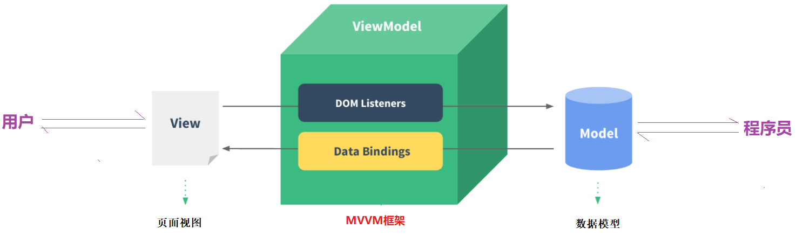
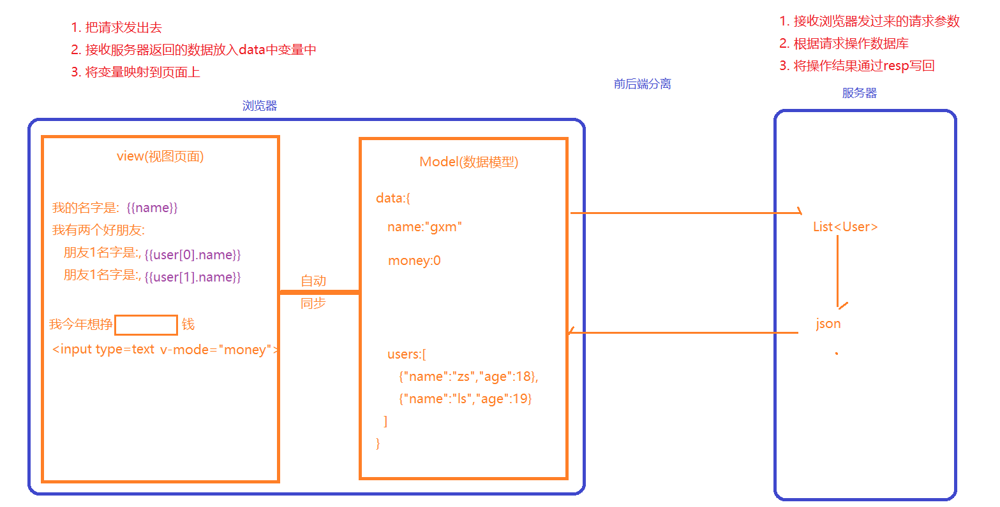
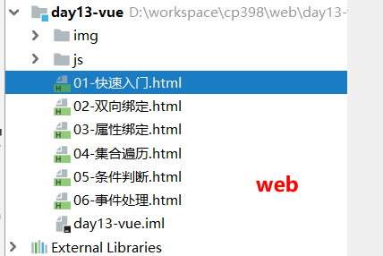
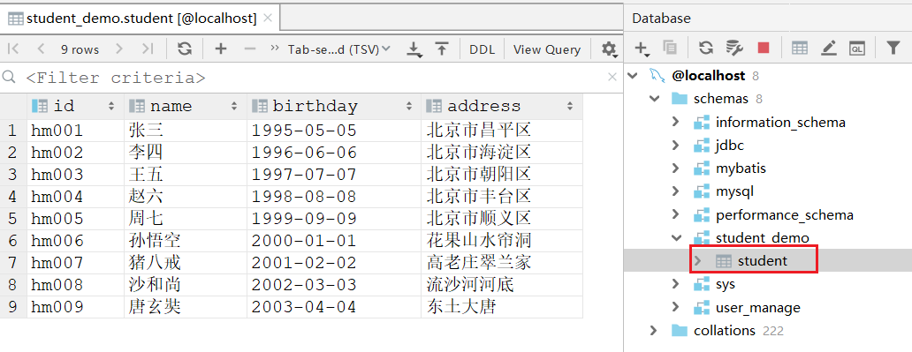
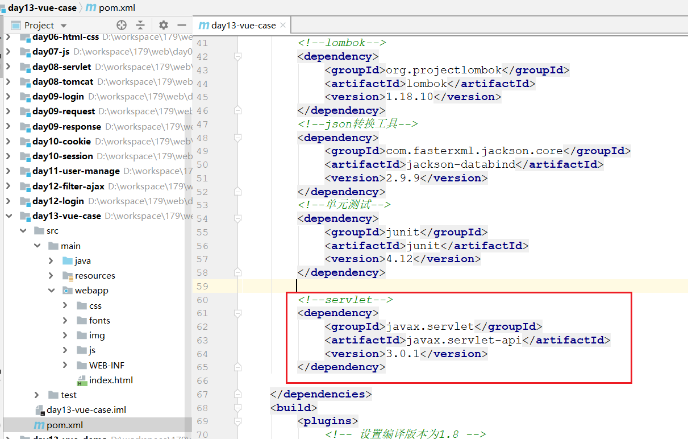
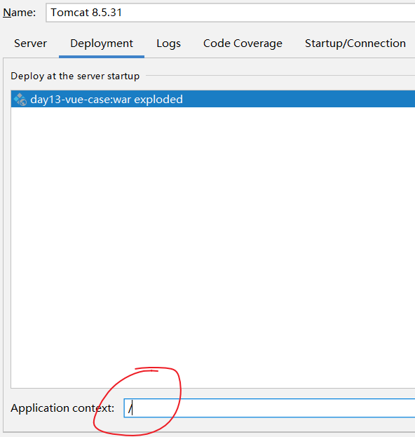
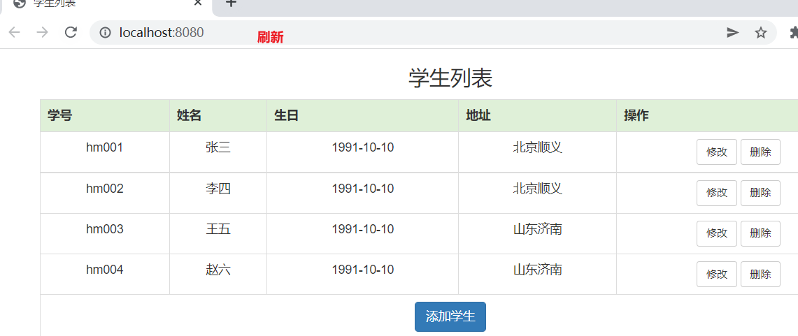

# Vue概述

~~~markdown
* MVVM是Model-View-ViewModel的简写，它本质上就是MVC的改进版；MVVM就是将其中的View的状态和行为抽象化，让我们将视图UI和业务逻辑分开。
	- M： 即Model，模型，指的就是数据
	- V： 即View， 视图，指的就是页面
	- VM：即View-Model，指的是模型和数据的双向绑定(即view和Model互相影响，Model变了，view随之改变；view变了，Model也随之改变)
	
* MVC和MVVM的使用区别
	在MVC模式中，
		开发人员需要从后端获取到数据(Model)，然后通过操作DOM渲染视图(View)。
		如果用户改变了视图(view)，开发人员还需要再通过DOM获取改变之后的数据，同步到Model中。
    在MVVM模式中，
    	Model和View是绑定的，Model变了，view自动变化；view变了，Model自动变化。
    	因此，程序员只需要关注Model即可。
    	
* 基于MVVM模式的前端框架三巨头：Vue、React、AngularJS，国内目前非常火的就是：Vue
~~~

 

 


# Vue语法

## 快速入门

### 创建工程

 

### Vue对象介绍

~~~html
<!DOCTYPE html>
<html lang="en">
<head>
    <meta charset="UTF-8">
    <title>快速入门</title>

    <!--1. 引入vue的js文件-->
    <script src="./js/vue-2.6.12.js"></script>
</head>
<body>
<div id="app">
    <!--在span中显示username变量对应的值-->
    <!--{{插值表达式}}: 作用就是将data中变量的值渲染到页面上-->
    <span>我的名字是: {{username}}</span> <br>
    <span>我有1个女朋友,它的名字:{{girlfriend.name}},它的年龄:{{girlfriend.age}}</span><br>
    <span>我有2个好朋友,它的名字:{{friends[0]}}和{{friends[1]}}</span>
</div>
<script>
    //创建Vue对象
    let app = new Vue({
        el: "#app",//指定当前vue管理的界面范围, 注意:vue管理的标签必须是双标签(html 和 body除外)
        data: { //定义数据,常用的就是键值对,数组和对象
            "username": "张三",
            "girlfriend": {
                "name": "王铁锤",
                "age": "18"
            },
            "friends": [
                "王五",
                "李四"
            ]
        }
    });
</script>

</body>
</html>

~~~

>~~~js
>// Vue对象的介绍
>const app = new Vue({
>        el: "#app",  // el用于挂载视图，即使用css选择器，选中当前vue可以管理的视图范围，注意: vue选择视图必须使用的是双标签，html和body除外
>        data:{       // data是一个对象，里面存储的就是视图数据，支持js的各种数据类型(简单  对象  数组)
>            message:""
>        }
>})
>~~~


## 双向绑定

>~~~markdown
>* v-model是双向绑定，视图（View）和模型（Model）之间会互相影响。
>* 目前v-model的可使用元素有：input、select、textarea
>~~~

~~~html
<!DOCTYPE html>
<html lang="zh-CN">
<head>
    <meta charset="UTF-8">
    <title>Title</title>
    <script src="./js/vue-2.6.12.js"></script>
</head>
<body>
<div id="app">

    <h3>姓名：</h3>
    <input type="text" v-model="username">
    <div>您写的姓名是:{{username}}</div>


    <h3>性别：</h3>
    <input type="radio" value="男" v-model="sex"> 男 <br>
    <input type="radio" value="女" v-model="sex"> 女 <br>
    <div>您选择的性别是:{{sex}}</div>


    <h3>爱好：</h3>
    <input type="checkbox" value="抽烟" v-model="hobby">抽烟<br>
    <input type="checkbox" value="喝酒" v-model="hobby">喝酒<br>
    <input type="checkbox" value="烫头" v-model="hobby">烫头<br>
    <div>您选择的爱好是:{{hobby}}</div>


    <h3>段位：</h3>
    <select v-model="level">
        <option value="">请选择</option>
        <option value="青铜">青铜</option>
        <option value="白银">白银</option>
        <option value="王者">王者</option>
    </select>
    <div>您选择的段位是:{{level}}</div>

</div>
<script>
    let app = new Vue({
        el: "#app",
        data: {
            "username":"张三",
            "sex":"女",
            "hobby":["喝酒"],
            "level":"王者"
        }
    })
</script>
</body>
</html>
~~~

## 属性绑定

> ~~~markdown
> * 对于HTML标签属性，如果想要动态传值，不能使用{{}}，而应该使用专门的属性绑定语法
> 	标准语法：   v-bind:属性名="Vue中的变量"
> 	简写语法：         :属性名='Vue中的变量'
> ~~~

```html
<!DOCTYPE html>
<html lang="zh-CN">
<head>
    <meta charset="UTF-8">
    <title>Title</title>
    <script src="./js/vue-2.6.12.js"></script>
</head>
<body>
<div id="app">
    <h3>属性绑定基本使用</h3>
    有两个图片地址分别是:./img/vue.png 和 ./img/lj.jpg,请在下面输入地址,改变图片:<br>
    图片地址: <input type="text" v-model="imgSrc">
    图片宽度: <input type="text" v-model="imgWidth">
    <br>
    

</div>
<script>
    const app = new Vue({
        el: '#app',
        data: {
            imgSrc: "./img/vue.png",
            imgWidth: "100px"
        },
    })
</script>
</body>
</html>
```

## 列表循环

>~~~markdown
>* 在vue中使用v-for实现数组的遍历，格式如下:
>* v-for="(item,index) in items"
>     items：要遍历的List
>     item： 每次遍历得到的临时变量
>     index：每次遍历的索引，从0开始计数(可省略)
>~~~

```html
<!DOCTYPE html>
<html lang="zh-CN">
<head>
    <meta charset="UTF-8">
    <title>Title</title>
    <script src="./js/vue-2.6.12.js"></script>
</head>
<body>
<!--
  v-for标签写在要遍历的元素上
  v-for="(item,index) in items"
    items：要遍历的List
    item： 每次遍历得到的临时变量
    index：每次遍历的索引，从0开始计数(可省略)
-->

<div id="app">
    <ul>
        <li v-for="(user,index) in users">
            {{index}}--{{user.id}}--{{user.name}}--{{user.address}}
        </li>
    </ul>
</div>
<script>
    const app = new Vue({
        el: '#app',
        data: {
            users: [
                {id: 1, name: 'jack', address: '北京顺义'},
                {id: 2, name: 'lucy', address: '上海虹桥'},
                {id: 3, name: 'jerry', address: '天津宝坻'}
            ]
        }
    })
</script>
</body>
</html>
```

## 条件判断

> ~~~markdown
> * 语法：
> 	v-if="布尔表达式"
> 	v-else-if="布尔表达式"
> 	v-else
> * 注意：
> 	v-else元素必须紧跟在带v-if或者v-else-if元素的后面，否则它将不会被识别
> 	v-if还可以和v-for联合使用，当二者出现在一起时，会先遍历再判断条件
> ~~~

```html
<!DOCTYPE html>
<html lang="zh-CN">
<head>
    <meta charset="UTF-8">
    <title>Title</title>
    <script src="./js/vue-2.6.12.js"></script>
</head>
<body>

<!--
* 语法：
	v-if="布尔表达式"
	v-else-if="布尔表达式"
	v-else
* 注意：
	v-else元素必须紧跟在带v-if或者v-else-if元素的后面，否则它将不会被识别
	v-if还可以和v-for联合使用，当二者出现在一起时，会先遍历再判断条件
-->

<div id="app">
    <!--从文本框输入成绩, 然后判断成绩是否及格  >=60:及格    <60:不及格   其他:未知-->
    <h3>考试成绩练习</h3>
    请输入成绩:<input type="text" v-model="score"><br>
    你本次开始成绩:
    <span v-if="score >= 60">及格</span>
    <span v-else-if="score < 60">不及格</span>
    <span v-else>未知</span>

    <!--遍历users, 但是要求只显示性别为女的用户-->
    <h3>用户列表</h3>
    <ul>
        <li v-for="(user,index) in users" v-if="user.gender == '女'">{{user.name}}--{{user.gender}}</li>
    </ul>
</div>
<script>
    const app = new Vue({
        el: '#app',
        data: {
            score: "未知",
            users: [
                {name: 'jack', gender: '女'},
                {name: 'lucy', gender: '女'},
                {name: 'jerry', gender: '男'}
            ]
        }
    })
</script>
</body>
</html>
```

## 事件处理

> ~~~markdown
> * 事件绑定
> 	1) 标准语法   v-on:事件名="js片段或函数名"   如果不想页面爆红,需要单独引入名称空间
> 	2) 简化语法   @事件名="js片段或函数名"       推荐使用
> ~~~

```html
<!DOCTYPE html>
<html lang="zh-CN">
<head>
    <meta charset="UTF-8">
    <title>Title</title>
    <script src="./js/vue-2.6.12.js"></script>
</head>
<body>
<div id="app">
    <b>数量：</b>
    <!--
        在vue中调用函数, 函数名后的()可以省略,但是不推荐
    -->
    <button @click="diff()">-</button>
    <input type="text" v-model="num" style="width: 30px;">
    <button @click="add()">+</button>
</div>
<script>
    const app = new Vue({
        el: '#app',
        data: {
            num: 1
        },
        methods: {
            //定义方法
            add() {
                //在vue中,如果你要在自定义的方法中调用自定义的变量或者方法,都要强制使用this关键字
                this.num++;
            },
            diff() {
                if (this.num <= 1) {
                    return;
                }
                this.num--;
            }
        }
    })
</script>
</body>
</html>
```

## 异步交互

### axios使用

> Vue并没有直接处理ajax的组件，需要使用第三方插件实现。Vue官网推荐使用 Axios 插件实现ajax功能。

```js
// 执行get请求
axios.get('/url?name=admin&password=123').then(resp=>{
	console.log(resp.data);
})


// 执行get请求参数比较多的时候
axios.get('/url',{
    params:{
		name: 'admin',
		password: '123'
    }
}).then(resp=>{
	console.log(resp.data);
})


//执行post请求
axios.post('/url', {
    name: 'admin',
    password: '123'
}).then(resp=>{
    console.log(resp.data);
})
```

### 页面加载完成

>created方法用于定义页面加载完毕之后需要执行的事情
>
>~~~js
>const app = new Vue({
>	created() {
>		console.log("页面加载完毕了......");
>	}
>});
>~~~


## 总结

~~~html
<!--Vue对象模板-->
<script>
    const app = new Vue({
        el: "#app", // 管理(挂载)的页面
        data: {}, // 页面中数据,不要写成date
        methods: {}, //定义方法, 不要写成method 
        created() {} //页面加载完毕之后要执行的方法, 注意:1. 不要写成create   2. 不要把这方法写到methods里面去
    });
</script>

1. 单方向赋值
	html文本: {{文本}}
	html属性: <span :color="color"> </span>

2. 双向绑定
	<input type="text" v-model="name"></input>

3. 遍历循环
	<li v-for="(item,index) in items"></li>

4. 判断
	<span v-if=""></span>
	<span v-else-if=""></span>
	<span v-else></span>

5. 事件绑定
	<a @click="add()"></a>

6. ajax请求
	get请求
        axios.get('/url?name=admin&password=123').then(resp=>{
            console.log(resp.data);
        })
	post请求
        axios.post('/url', {
            name: 'admin',
            password: '123'
        }).then(resp=>{
            console.log(resp.data);
        })
~~~


# 综合案例

## 导入工程

 

 

  

 

> ==一旦你发现你部署出来的项目有乱码,检查一下你的tomcat (Tomcat 8.5.31) ,如果不是,切换成我的,然后重启tomcat.还要去清理一下浏览器的缓存== 


## 功能开发

### 开发步骤

~~~markdown
* 列表查询
	1. 页面加载完毕之后发送查询列表的请求
	2. 后台返回列表[]
	3. 在model区声明变量接收后台列表
	4. 将model和view绑定在一起(for遍历)

* 新增
	1. 双向绑定,表单中的数据绑定student
	2. 为新增按钮绑定时间,点击之后调用发送新增请求方法
	3. 后台处理新增请求
	4. 页面变化: 1) 清空对象  2)关闭模态框  3)重新执行findList()方法   

* 回显修改数据
	1. 给修改按钮绑定点击事件
	2. 根据id调用后台查询对象信息
	3. 后台查询
	4. 声明一个变量接收查询的结果
	5. 将结果绑定到修改表单

* 修改
	1. 为修改按钮绑定事件,点击之后调用发送修改请求方法
	2. 后台处理修改请求
	3. 页面变化: 1) 关闭模态框   2)重新执行findList()方法   3) 清空对象

* 删除
	1. 为删除按钮添加一个点击事件
	2. 点击触发删除get请求,id作为参数
	3. 后台处理请求
	4. 页面重新执行findList()
~~~


### index.html

~~~html
<!DOCTYPE html>
<html lang="zh-CN">
<head>
    <!-- 指定字符集 -->
    <meta charset="utf-8">
    <title>学生列表</title>
    <style type="text/css">
        td, th {
            text-align: center;
        }
    </style>
    <link href="./css/bootstrap.min.css" rel="stylesheet">
    <script src="./js/jquery-2.1.0.min.js"></script>
    <script src="./js/bootstrap.min.js"></script>
    <script src="./js/vue-2.6.12.js"></script>
    <script src="./js/axios-0.20.0.js"></script>
</head>
<body>
<div class="container" id="app">
    <!--列表-->
    <div class="row">
        <h3 style="text-align: center">学生列表</h3>
        <div class="col-lg-3"></div>
        <div class="col-lg-6">
            <table border="1" class="table table-bordered table-hover">
                <tr class="success" style="text-align: center">
                    <th>学号</th>
                    <th>姓名</th>
                    <th>生日</th>
                    <th>地址</th>
                    <th>操作</th>
                </tr>
                <tr v-for="(student,index) in studentList">
                    <td>{{student.id}}</td>
                    <td>{{student.name}}</td>
                    <td>{{student.birthday}}</td>
                    <td>{{student.address}}</td>
                    <td>
                        <a class="btn btn-default btn-sm" data-toggle="modal" data-target="#updateModal"
                           @click="findById(student.id)">修改</a>

                        <!--
                            href="javascript:void(0)" 阻止超练级的跳转
                            delete 不能作为自定义的方法名称
                        -->
                        <a class="btn btn-default btn-sm" href="javascript:void(0)" @click="deleteStudent(student.id)">删除</a>
                    </td>
                </tr>


                <tr>
                    <td colspan="9" align="center">
                        <a class="btn btn-primary" data-toggle="modal" data-target="#addModal">添加学生</a>
                    </td>
                </tr>
            </table>
        </div>
        <div class="col-lg-3"></div>
    </div>

    <!-- 新增 -->
    <div class="modal fade" id="addModal" tabindex="-1" role="dialog" aria-labelledby="addModalLabel">
        <div class="modal-dialog" role="document">
            <div class="modal-content">
                <div class="modal-header">
                    <button type="button" class="close" data-dismiss="modal" aria-label="Close"><span
                            aria-hidden="true">&times;</span></button>
                    <h4 class="modal-title" id="addModalLabel">新增</h4>
                </div>
                <div class="modal-body">
                    <div class="form-group">
                        <label>学号：</label>
                        <input type="text" class="form-control" name="id" placeholder="请输入学号" v-model="studentAdd.id">
                    </div>
                    <div class="form-group">
                        <label>姓名：</label>
                        <input type="text" class="form-control" name="name" placeholder="请输入姓名"
                               v-model="studentAdd.name">
                    </div>
                    <div class="form-group">
                        <label>生日：</label>
                        <input type="text" class="form-control" name="birthday" placeholder="请输入生日"
                               v-model="studentAdd.birthday">
                    </div>
                    <div class="form-group">
                        <label>地址：</label>
                        <input type="text" class="form-control" name="address" placeholder="请输入地址"
                               v-model="studentAdd.address">
                    </div>
                </div>
                <div class="modal-footer">
                    <button type="button" class="btn btn-primary" @click="addStudent()">新增</button>
                </div>
            </div>
        </div>
    </div>

    <!-- 修改 -->
    <div class="modal fade" id="updateModal" tabindex="-1" role="dialog" aria-labelledby="updateModalLabel">
        <div class="modal-dialog" role="document">
            <div class="modal-content">
                <div class="modal-header">
                    <button type="button" class="close" data-dismiss="modal" aria-label="Close"><span
                            aria-hidden="true">&times;</span></button>
                    <h4 class="modal-title" id="updateModalLabel">修改</h4>
                </div>
                <div class="modal-body">
                    <div class="form-group">
                        <label>学号：</label>
                        <input type="text" class="form-control" name="id" disabled v-model="studentUpdate.id">
                    </div>
                    <div class="form-group">
                        <label>姓名：</label>
                        <input type="text" class="form-control" name="name" placeholder="请输入学号"
                               v-model="studentUpdate.name">
                    </div>
                    <div class="form-group">
                        <label>生日：</label>
                        <input type="text" class="form-control" name="birthday" placeholder="请输入姓名"
                               v-model="studentUpdate.birthday">
                    </div>
                    <div class="form-group">
                        <label>地址：</label>
                        <input type="text" class="form-control" name="address" placeholder="请输入地址"
                               v-model="studentUpdate.address">
                    </div>
                </div>
                <div class="modal-footer">
                    <button type="button" class="btn btn-primary" @click="updateStudent()">修改</button>
                </div>
            </div>
        </div>
    </div>
</div>


<script>
    let app = new Vue({
        el: "#app",
        data: {
            studentList: [],//接收学生列表
            studentAdd: {},//声明一个对象用于接收添加的表单数据
            studentUpdate: {},//声明一个对象用于接收修改的表单数据
        },
        //查询 删除使用get请求 ;  添加 修改 post请求
        methods: {
            //查询学生列表
            findList() {
                axios.get("/studentServlet?action=findList").then(resp => {
                    this.studentList = resp.data;//不要写成date或者data()
                    //console.log(this.studentList);
                })
            },
            //添加学生
            addStudent() {
                axios.post("/studentServlet?action=add", this.studentAdd).then(resp => {
                    if (resp.data == "OK") {
                        //1. 清空添加表单
                        this.studentAdd = {};

                        //2. 关闭添加框
                        $("#addModal").modal('hide');

                        //3. 重新查询列表
                        this.findList();
                    }
                })
            },
            //根据id查询学生信息
            findById(studentId) {
                axios.get("/studentServlet?action=findById&id=" + studentId).then(resp => {
                    this.studentUpdate = resp.data;
                })
            },
            //更新学生
            updateStudent() {
                axios.post("/studentServlet?action=update", this.studentUpdate).then(resp => {
                    //1. 清空修改表单
                    this.studentUpdate = {};

                    //2. 关闭修改框
                    $("#updateModal").modal('hide');

                    //3. 重新查询列表
                    this.findList();
                })
            },
            //删除学生
            deleteStudent(studentId) {
                axios.get("/studentServlet?action=deleteById&id=" + studentId).then(resp => {
                    if (resp.data == 'OK') {
                        this.findList();
                    }
                })
            }
        },
        created() {
            //页面加载完成之后,立即发送查询学生列表请求
            this.findList();
        }
    })
</script>

</body>
</html>

~~~

### StudentServlet

~~~java
package com.itheima.web.servlet;

import cn.hutool.core.io.IoUtil;
import com.fasterxml.jackson.databind.ObjectMapper;
import com.itheima.domain.Student;
import com.itheima.service.StudentService;
import com.itheima.service.impl.StudentServiceImpl;

import javax.servlet.ServletException;
import javax.servlet.ServletInputStream;
import javax.servlet.annotation.WebServlet;
import javax.servlet.http.HttpServlet;
import javax.servlet.http.HttpServletRequest;
import javax.servlet.http.HttpServletResponse;
import java.awt.image.RescaleOp;
import java.io.IOException;
import java.util.List;

@WebServlet("/studentServlet")
public class StudentServlet extends HttpServlet {

    StudentService studentService = new StudentServiceImpl();

    protected void service(HttpServletRequest request, HttpServletResponse response) throws ServletException, IOException {
        //1. 接收action的值,确定调用的方法
        String action = request.getParameter("action");

        if ("findList".equals(action)) {
            findList(request, response);
        } else if ("add".equals(action)) {
            add(request, response);
        } else if ("findById".equals(action)) {
            findById(request, response);
        } else if ("update".equals(action)) {
            update(request, response);
        } else if ("deleteById".equals(action)) {
            deleteById(request, response);
        } else {
            response.getWriter().write("action值有问题");
        }
    }

    //根据id删除
    private void deleteById(HttpServletRequest request, HttpServletResponse response) throws IOException {
        //1. 接收请求参数id
        String id = request.getParameter("id");

        //2. 调用service删除
        studentService.deleteById(id);

        //3. 返回结果
        response.getWriter().write("OK");
    }

    //更新
    private void update(HttpServletRequest request, HttpServletResponse response) throws IOException {
        //1. 接收请求参数
        //1-1 接收输入流
        ServletInputStream inputStream = request.getInputStream();
        //1-2 将输入流转换成字符串
        String json = IoUtil.read(inputStream, "utf-8");
        //1-3 json字符串转换为对象
        Student student = new ObjectMapper().readValue(json, Student.class);

        //2. 调用service更新
        studentService.update(student);

        //3. 返回结果
        response.getWriter().write("OK");
    }

    //根据id查询
    private void findById(HttpServletRequest request, HttpServletResponse response) throws IOException {
        //1. 接收请求参数 id
        String id = request.getParameter("id");

        //2. 调用service查询
        Student student = studentService.findById(id);

        //3. 结果转json返回
        String json = new ObjectMapper().writeValueAsString(student);
        response.getWriter().write(json);
    }

    //新增
    private void add(HttpServletRequest request, HttpServletResponse response) throws IOException {
        //1. 接收请求(通过ajax使用post的请求体发送参数,后台使用数据流接收)
        //1-1 接收输入流
        ServletInputStream inputStream = request.getInputStream();
        //1-2 将输入流转换成字符串
        String json = IoUtil.read(inputStream, "utf-8");
        //1-3 json字符串转换为对象
        Student student = new ObjectMapper().readValue(json, Student.class);

        //2. 调用service保存学生对象
        studentService.add(student);

        //3. 返回结果
        response.getWriter().write("OK");
    }

    //查询学生列表
    private void findList(HttpServletRequest request, HttpServletResponse response) throws IOException {
        //1. 调用service查询
        List<Student> studentList = studentService.findList();

        //2. 将查询结果转json返回
        String json = new ObjectMapper().writeValueAsString(studentList);
        response.getWriter().write(json);
    }
}

~~~

### StudentService

~~~java
package com.itheima.service;

import com.itheima.domain.Student;

import java.util.List;

public interface StudentService {

    //查询学生列表
    List<Student> findList();

    //保存用户
    void add(Student student);

    //根据id查询
    Student findById(String id);

    //更新
    void update(Student student);

    //根据id删除
    void deleteById(String id);
}

~~~

### StudentServiceImpl

~~~java
package com.itheima.service.impl;

import com.itheima.domain.Student;
import com.itheima.mapper.StudentMapper;
import com.itheima.service.StudentService;
import com.itheima.util.MyBatisUtil;
import org.apache.ibatis.session.SqlSession;

import java.util.List;

public class StudentServiceImpl implements StudentService {

    @Override
    public List<Student> findList() {
        //1. 获取SqlSession
        SqlSession sqlSession = MyBatisUtil.openSession();

        //2. 获取mapper
        StudentMapper mapper = sqlSession.getMapper(StudentMapper.class);

        //3. 调用mapper方法
        List<Student> studentList = mapper.findList();

        //4. 关闭sqlSession
        MyBatisUtil.close(sqlSession);

        //5. 返回结果
        return studentList;
    }

    @Override
    public void add(Student student) {
        //1. 获取SqlSession
        SqlSession sqlSession = MyBatisUtil.openSession();

        //2. 获取mapper
        StudentMapper mapper = sqlSession.getMapper(StudentMapper.class);

        //3. 调用mapper方法
        mapper.add(student);

        //4. 关闭sqlSession
        MyBatisUtil.close(sqlSession);
    }

    @Override
    public Student findById(String id) {
        //1. 获取SqlSession
        SqlSession sqlSession = MyBatisUtil.openSession();

        //2. 获取mapper
        StudentMapper mapper = sqlSession.getMapper(StudentMapper.class);

        //3. 调用mapper方法
        Student student = mapper.findById(id);

        //4. 关闭sqlSession
        MyBatisUtil.close(sqlSession);

        //5. 返回结果
        return student;
    }

    @Override
    public void update(Student student) {
        //1. 获取SqlSession
        SqlSession sqlSession = MyBatisUtil.openSession();

        //2. 获取mapper
        StudentMapper mapper = sqlSession.getMapper(StudentMapper.class);

        //3. 调用mapper方法
        mapper.update(student);

        //4. 关闭sqlSession
        MyBatisUtil.close(sqlSession);
    }

    @Override
    public void deleteById(String id) {
        //1. 获取SqlSession
        SqlSession sqlSession = MyBatisUtil.openSession();

        //2. 获取mapper
        StudentMapper mapper = sqlSession.getMapper(StudentMapper.class);

        //3. 调用mapper方法
        mapper.deleteById(id);

        //4. 关闭sqlSession
        MyBatisUtil.close(sqlSession);
    }
}

~~~

### StudentMapper

~~~java
package com.itheima.mapper;

import com.itheima.domain.Student;
import org.apache.ibatis.annotations.Delete;
import org.apache.ibatis.annotations.Insert;
import org.apache.ibatis.annotations.Select;
import org.apache.ibatis.annotations.Update;

import java.util.List;

public interface StudentMapper {

    //查询学生列表
    @Select("select * from student")
    List<Student> findList();

    //保存用户
    @Insert("insert into student values(#{id},#{name},#{birthday},#{address})")
    void add(Student student);

    //根据id查询
    @Select("select * from student where id = #{id}")
    Student findById(String id);

    //更新
    @Update("update student set name = #{name},birthday = #{birthday},address = #{address} where id = #{id}")
    void update(Student student);

    //删除
    @Delete("delete from student where id = #{id}")
    void deleteById(String id);
}

~~~
