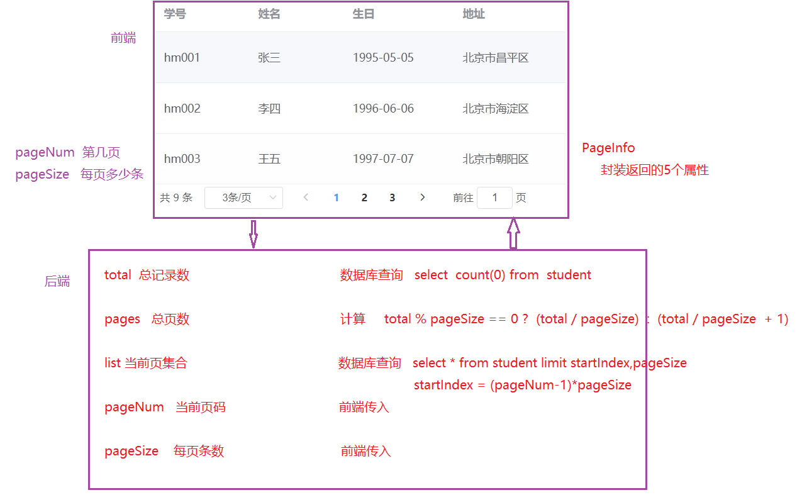
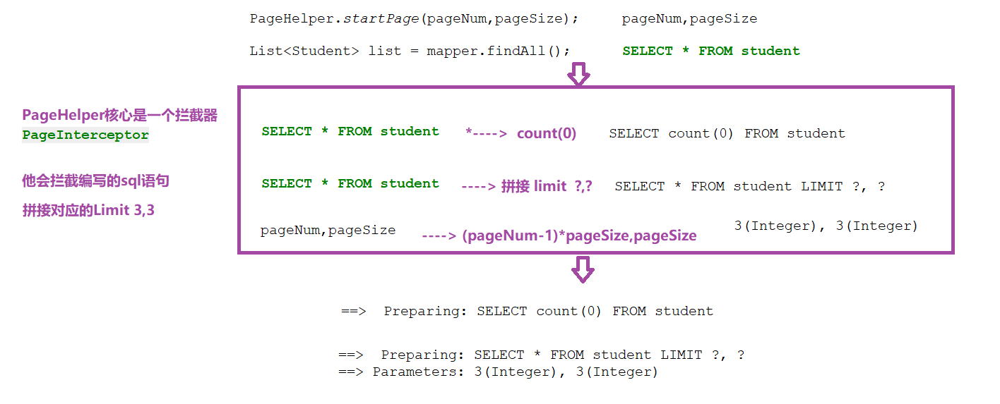

# 后端分页
## 分页类型
```markdown
逻辑分页: 一次将数据表中的所有数据查询回来,然后通过java代码在内存中完成分页, 只适合小数据量情况下

物理分页: 通过sql语句精确提取每页数据, 适合所有情况
```
## 分页函数
    在mysql中使用limit关键字可以完成数据的分页
```mysql
select * from 表名 limit 起始数据,查询数量;
```
## 分页思想

## 分页实现
      实体类
```java
import lombok.AllArgsConstructor;
import lombok.Data;
import lombok.NoArgsConstructor;

@Data
@NoArgsConstructor
@AllArgsConstructor
public class Student {
    private String id;  //学号
    private String name;    //姓名
    private String birthday;  //生日
    private String address; //地址

}
```
    表示层(UserServlet)
```java
 //分页查询
    private void findByPage(HttpServletRequest request, HttpServletResponse response) throws IOException {
        //1. 接收参数
        Integer pageNum = Integer.parseInt(request.getParameter("pageNum"));
        Integer pageSize = Integer.parseInt(request.getParameter("pageSize"));

        //2. 调用service查询
        PageInfo<Student> pageInfo = studentService.findByPage(pageNum, pageSize);

        //3. 结果转json返回
        String json = new ObjectMapper().writeValueAsString(pageInfo);
        response.getWriter().write(json);
    }
```
### 自己书写
    页面显示的数据用到的类
```java
package com.itheima.vo;

import lombok.AllArgsConstructor;
import lombok.Data;
import lombok.NoArgsConstructor;

import java.util.List;

@Data
@AllArgsConstructor
@NoArgsConstructor
public class PageInfo<T> {
    private Integer total;
    private Integer pages;
    private List<T> list;
    private Integer pageNum;
    private Integer pageSize;
}
```
    业务层(UserService)
```java
//接口
package com.itheima.service;

import com.github.pagehelper.PageInfo;
import com.itheima.domain.Student;

public interface StudentService {
    //分页查询
    PageInfo<Student> findByPage(Integer pageNum, Integer pageSize);
}
```
```java
//实现类
    @Override
    public PageInfo<Student> findByPage(Integer pageNum, Integer pageSize) {
        //1. 获取mapper对象
        SqlSession sqlSession = MyBatisUtil.openSession();
        StudentMapper mapper = sqlSession.getMapper(StudentMapper.class);

        //2-1 调用mapper查询total总记录数
        Integer total = mapper.findTotal();
        //2-2 计算pages, 总页数
        Integer pages = total % pageSize == 0 ? (total / pageSize) : (total / pageSize + 1);
        //2-3 计算startIndex 开始索引
        Integer startIndex = (pageNum - 1) * pageSize;
        //2-4 调用mapper查询list
        List<Student> list = mapper.findList(startIndex, pageSize);
        //2-5 创建PageInfo,封装结果
        PageInfo<Student> pageInfo = new PageInfo<>(total, pages, list, pageNum, pageSize);


        //3. 关闭sqlSession
        MyBatisUtil.close(sqlSession);

        //不要忘了这句
        return pageInfo;
    }
```
    持久层(UserMapper)
```java
    //查询总记录数
    @Select("select count(0) from student")
    Integer findTotal();

    //查询指定记录
    @Select("select * from student limit #{startIndex},#{pageSize}")
    List<Student> findList(@Param("startIndex") Integer startIndex, @Param("pageSize") Integer pageSize);
```
### 分页插件
```markdown
**PageHelper** 是国内非常优秀的一款开源的mybatis分页插件，它支持基本主流与常用的数据库，

他可以帮助程序员构建PageInfo对象，内部实现了分页逻辑，程序员可以直接使用。

官网：https://pagehelper.github.io/
```
    在mybatis中添加配置
    注：在mybatis的主配置文件要在environments标签的上方加入配置
```xml
<?xml version="1.0" encoding="UTF-8" ?>
<!DOCTYPE configuration PUBLIC "-//mybatis.org//DTD Config 3.0//EN" "http://mybatis.org/dtd/mybatis-3-config.dtd">
<configuration>

    <!--第三方属性配置-->
    <properties resource="jdbc.properties"></properties>

    <!--打印sql-->
    <settings>
        <setting name="logImpl" value="STDOUT_LOGGING"/>
    </settings>

    <!--分页插件-->
    <plugins>
        <plugin interceptor="com.github.pagehelper.PageInterceptor">
            <property name="autoRuntimeDialect" value="true"/>
        </plugin>
    </plugins>

    <!--数据库环境配置-->
    <environments default="mysql">
        <environment id="mysql">
            <transactionManager type="JDBC"/>
            <dataSource type="POOLED">
                <property name="driver" value="${jdbc.driver}"/>
                <property name="url" value="${jdbc.url}"/>
                <property name="username" value="${jdbc.username}"/>
                <property name="password" value="${jdbc.password}"/>
            </dataSource>
        </environment>
    </environments>

    <!--映射关系配置-->
    <mappers>
        <package name="com.itheima.mapper"></package>
    </mappers>
</configuration>
```
    不需要我们自己写的PageInfo类了
    修改业务层(UserService)
```java
//注意的是这边使用PageInfo是import com.github.pagehelper.PageInfo下面的，不是自己书写的
@Override
    public PageInfo<Student> findByPage(Integer pageNum, Integer pageSize) {
        SqlSession sqlSession = MyBatisUtil.openSession();
        StudentMapper mapper = sqlSession.getMapper(StudentMapper.class);
        //开始分页
        PageHelper.startPage(pageNum,pageSize);

        //调用查询所有方法(不包含分页limit)
        List<Student> list = mapper.findAll();

        //创建PageInfo对象
        PageInfo<Student> pageInfo = new PageInfo<>(list);
        MyBatisUtil.close(sqlSession);
        return pageInfo;
    }
```
    持久层
```java
//查询全部方法
    @Select("SELECT * FROM student")
    List<Student> findAll();
```
## PageHelper插件的原理
    PageHelper会拦截查询全部的语句，对查询全部的语句进行拼接，完成分页的操作


