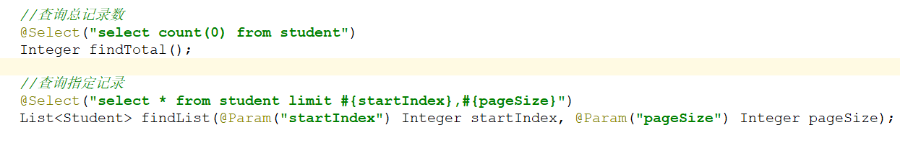

# 回顾

```markdown
<!--Vue对象模板-->
<script>
    const app = new Vue({
        el: "#app", // 管理(挂载)的页面
        data: {}, // 页面中数据,不要写成date
        methods: {}, //定义方法, 不要写成method 
        created() {} //页面加载完毕之后要执行的方法, 注意:1. 不要写成create   2. 不要把这方法写到methods里面去
    });
</script>

1. 单方向赋值
	html文本: {{文本}}
	html属性: <span :color="color"> </span>

2. 双向绑定
	<input type="text" v-model="name"></input>

3. 遍历循环
	<li v-for="(item,index) in items"></li>

4. 判断
	<span v-if=""></span>
	<span v-else-if=""></span>
	<span v-else></span>

5. 事件绑定
	<a @click="add()"></a>

6. ajax请求
	get请求
        axios.get('/url?name=admin&password=123').then(resp=>{
            console.log(resp.data);
        })
	post请求
        axios.post('/url', {
            name: 'admin',
            password: '123'
        }).then(resp=>{
            console.log(resp.data);
        })
```

 


# Element（了解）

## 介绍

>- Element是饿了么公司前端开发团队提供的一套基于Vue的网站组件库，作用是帮助开发人员快速搭建网站
>
>- Element提供了大量的写好的页面组件，例如按钮、图片、表格、导航条、表单等等，开发人员可以直接复制使用
>
>- Element官网：https://element.eleme.cn/#/zh-CN

**我们自己编写的按钮**

 

**Element提供的按钮**

 

## 快速入门

> **需求：使用element的按钮组件**

 

```html
<!DOCTYPE html>
<html lang="zh-CN">
<head>
    <meta charset="UTF-8">
    <title>快速入门</title>

    <!--1. 引入Vue的JS 和 Element的JS CSS   (顺序不能变)-->
    <script src="./js/vue.js"></script>
    <script src="element-ui/lib/index.js"></script>
    <link rel="stylesheet" href="element-ui/lib/theme-chalk/index.css">


</head>
<body>
<button>普通按钮</button>

<div id="app">
    <!--3. 在这个位置上需要什么组件  就去复制什么组件-->
    <el-button type="danger">危险按钮</el-button>


    <el-button type="danger" icon="el-icon-delete" circle></el-button>


    <el-button type="primary" :loading="true">加载中</el-button>
</div>


<script>
    //2. 构建Vue对象
    let app = new Vue({
        el: "#app",
        data: {},
        methods: {},
        created() {
        }
    })
</script>

</body>
</html>
```

## 栅格布局

> Element的栅格系统，将一行划分成了24份，程序员通过指定一块布局占用多少份可以轻松实现栅格布局
>
> https://element.eleme.cn/#/zh-CN/component/layout

 

```html
<!DOCTYPE html>
<html lang="zh-CN">
<head>
    <meta charset="UTF-8">
    <title>栅格布局</title>
    <script src="./js/vue.js"></script>
    <script src="./element-ui/lib/index.js"></script>
    <link rel="stylesheet" href="./element-ui/lib/theme-chalk/index.css">

    <style>
        .el-row {
            margin-bottom: 20px;

        &
        :last-child {
            margin-bottom: 0;
        }

        }
        .el-col {
            border-radius: 4px;
        }

        .bg-purple-dark {
            background: #99a9bf;
        }

        .bg-purple {
            background: #d3dce6;
        }

        .bg-purple-light {
            background: #e5e9f2;
        }

        .grid-content {
            border-radius: 4px;
            min-height: 36px;
        }

        .row-bg {
            padding: 10px 0;
            background-color: #f9fafc;
        }
    </style>

</head>
<body>
<div id="app">

    <!--
        el-row: 行

        el-col: 列
            :span="6" 控制列的宽度[element将一列的总宽度设置为24, 你写的这个数是占n/24]
    -->
    <el-row>
        <el-col :span="6">
            <div class="grid-content bg-purple-dark"></div>
        </el-col>
    </el-row>
    <el-row>
        <el-col :span="12">
            <div class="grid-content bg-purple"></div>
        </el-col>
        <el-col :span="12">
            <div class="grid-content bg-purple-light"></div>
        </el-col>
    </el-row>
    <el-row>
        <el-col :span="6">
            <div class="grid-content bg-purple"></div>
        </el-col>
        <el-col :span="12">
            <div class="grid-content bg-purple-light"></div>
        </el-col>
        <el-col :span="6">
            <div class="grid-content bg-purple"></div>
        </el-col>
    </el-row>
</div>
<script>
    let app = new Vue({
        el: '#app'
    })
</script>
</body>
</html>
```


## 容器布局

>Element的容器布局将页面分成头部区域、侧边栏区域、主区域、底部区域。
>
>https://element.eleme.cn/#/zh-CN/component/container

 

```html
<!DOCTYPE html>
<html lang="zh-CN">
<head>
    <meta charset="UTF-8">
    <title>容器布局</title>
    <script src="./js/vue.js"></script>
    <script src="./element-ui/lib/index.js"></script>
    <link rel="stylesheet" href="./element-ui/lib/theme-chalk/index.css">
    <style>
        .el-header, .el-footer {
            background-color: #B3C0D1;
            color: #333;
            text-align: center;
            line-height: 60px;
        }

        .el-aside {
            background-color: #D3DCE6;
            color: #333;
            text-align: center;
            line-height: 200px;
        }

        .el-main {
            background-color: #E9EEF3;
            color: #333;
            text-align: center;
            line-height: 160px;
        }

        body > .el-container {
            margin-bottom: 40px;
        }

        .el-container:nth-child(5) .el-aside,
        .el-container:nth-child(6) .el-aside {
            line-height: 260px;
        }

        .el-container:nth-child(7) .el-aside {
            line-height: 320px;
        }
    </style>
</head>
<body>
<div id="app">
    <el-container>
        <el-header>Header</el-header>
        <el-main>Main</el-main>
    </el-container>

    <br>

    <el-container>
        <el-header>Header</el-header>
        <el-main>Main</el-main>
        <el-footer>Footer</el-footer>
    </el-container>
    <br>

    <el-container>
        <el-aside width="200px">Aside</el-aside>
        <el-main>Main</el-main>
    </el-container>
    <br>
    <el-container>
        <el-header>Header</el-header>
        <el-container>
            <el-aside width="200px">Aside</el-aside>
            <el-main>Main</el-main>
        </el-container>
    </el-container>
    <br>
    <el-container>
        <el-header>Header</el-header>
        <el-container>
            <el-aside width="200px">Aside</el-aside>
            <el-container>
                <el-main>Main</el-main>
                <el-footer>Footer</el-footer>
            </el-container>
        </el-container>
    </el-container>
    <br>
    <el-container>
        <el-aside width="200px">Aside</el-aside>
        <el-container>
            <el-header>Header</el-header>
            <el-main>Main</el-main>
        </el-container>
    </el-container>
    <br>
    <el-container>
        <el-aside width="200px">Aside</el-aside>
        <el-container>
            <el-header>Header</el-header>
            <el-main>Main</el-main>
            <el-footer>Footer</el-footer>
        </el-container>
    </el-container>


</div>
<script>
    new Vue({
        el: '#app'
    })
</script>
</body>
</html>
```


## 表格组件

> 表格组件用于展示多条结构类似的数据，可对数据进行编辑、删除或其他自定义操作。
>
> https://element.eleme.cn/#/zh-CN/component/table 

 

```html
<!DOCTYPE html>
<html lang="zh-CN">
<head>
    <meta charset="UTF-8">
    <title>表格组件</title>
    <script src="./js/vue.js"></script>
    <script src="./element-ui/lib/index.js"></script>
    <link rel="stylesheet" href="./element-ui/lib/theme-chalk/index.css">
</head>
<body>
<div id="app">
    <!--
       el-table: 表格
           data: 指定当前表格渲染的数据
           @selection-change="复选框值改变的事件"
       el-table-column: 列
            label: 列名
            prop: 要将json数据中对象的哪个属性的值赋值到当前列
    -->
    <el-table
            :data="tableData"
            style="width: 100%"
            @selection-change="handleSelectionChange"
    >
        <el-table-column type="selection" width="55"></el-table-column>
        <el-table-column prop="date" label="日期" width="180"></el-table-column>
        <el-table-column prop="name" label="姓名" width="180"></el-table-column>
        <el-table-column prop="address" label="地址"></el-table-column>
        <el-table-column label="操作">
            <template slot-scope="scope">
                <el-button
                        type="warning"
                        size="mini"
                        @click="handleEdit(scope.$index, scope.row)">编辑
                </el-button>
                <el-button
                        size="mini"
                        type="danger"
                        @click="handleDelete(scope.$index, scope.row)">删除
                </el-button>
            </template>
        </el-table-column>
    </el-table>
</div>
<script>
    new Vue({
        el: '#app',
        data: {
            multipleSelection: [],//接收选中的行
            tableData: [{
                date: '2016-05-02',
                name: '王小虎',
                address: '上海市普陀区金沙江路 1518 弄'
            }, {
                date: '2016-05-04',
                name: '王小虎',
                address: '上海市普陀区金沙江路 1517 弄'
            }, {
                date: '2016-05-01',
                name: '王小虎',
                address: '上海市普陀区金沙江路 1519 弄'
            }, {
                date: '2016-05-03',
                name: '王小虎',
                address: '上海市普陀区金沙江路 1516 弄'
            }]
        },
        methods: {
            //index: 表示当前行的索引号
            //row: 当前行数据
            handleEdit(index, row) {
                console.log(index, row);
            },
            handleDelete(index, row) {
                console.log(index, row);
            },

            //复选框值改变的时候触发
            //val: 最终选中的记录集合
            handleSelectionChange(val) {
                this.multipleSelection = val;
                console.log(this.multipleSelection);
            }
        }
    })
</script>
</body>
</html>
```


## 表单组件

> 表单组件由输入框、下拉列表、单选框、多选框等控件组成，用以收集、提交数据。
>
> https://element.eleme.cn/#/zh-CN/component/form

  

```html
<!DOCTYPE html>
<html lang="zh-CN">
<head>
    <meta charset="UTF-8">
    <title>表单组件</title>
    <script src="./js/vue.js"></script>
    <script src="./element-ui/lib/index.js"></script>
    <link rel="stylesheet" href="./element-ui/lib/theme-chalk/index.css">
</head>
<body>
<div id="app">
    <!--
        el-form: 表单
            ref="form" 表单的标识,相当于id
            :model="form" 表单中的数据绑定哪个变量
        el-form-item  表单项
             label="表单项名称"

        el-input 输入框
        el-select 下拉框  el-option 下拉选项
        el-date-picker  日期框
        el-time-picker  时间框
        el-switch  开关
        el-checkbox-group 复选框组    el-checkbox  复选框
        el-radio-group    单选框组    el-radio  单选框
        el-button  按钮
    -->
    <el-form ref="form" :model="form" label-width="80px">
        <el-form-item label="活动名称">
            <el-input v-model="form.name"></el-input>
        </el-form-item>
        <el-form-item label="活动区域">
            <el-select v-model="form.region" placeholder="请选择活动区域">
                <el-option label="区域一" value="shanghai"></el-option>
                <el-option label="区域二" value="beijing"></el-option>
            </el-select>
        </el-form-item>
        <el-form-item label="活动时间">
            <el-col :span="11">
                <el-date-picker type="date" placeholder="选择日期" v-model="form.date1"
                                style="width: 100%;"></el-date-picker>
            </el-col>
            <el-col class="line" :span="2">-</el-col>
            <el-col :span="11">
                <el-time-picker placeholder="选择时间" v-model="form.date2" style="width: 100%;"></el-time-picker>
            </el-col>
        </el-form-item>
        <el-form-item label="即时配送">
            <el-switch v-model="form.delivery"></el-switch>
        </el-form-item>
        <el-form-item label="活动性质">
            <el-checkbox-group v-model="form.type">
                <el-checkbox label="美食/餐厅线上活动" name="type"></el-checkbox>
                <el-checkbox label="地推活动" name="type"></el-checkbox>
                <el-checkbox label="线下主题活动" name="type"></el-checkbox>
                <el-checkbox label="单纯品牌曝光" name="type"></el-checkbox>
            </el-checkbox-group>
        </el-form-item>
        <el-form-item label="特殊资源">
            <el-radio-group v-model="form.resource">
                <el-radio label="线上品牌商赞助"></el-radio>
                <el-radio label="线下场地免费"></el-radio>
            </el-radio-group>
        </el-form-item>
        <el-form-item label="活动形式">
            <el-input type="textarea" v-model="form.desc"></el-input>
        </el-form-item>
        <el-form-item>
            <el-button type="primary" @click="onSubmit">立即创建</el-button>
            <el-button>取消</el-button>
        </el-form-item>
    </el-form>
</div>
<script>
    new Vue({
        el: '#app',
        data: {
            form: {  //表单对象
                name: '',
                region: '',
                date1: '',
                date2: '',
                delivery: false,
                type: [],
                resource: '',
                desc: ''
            }
        },
        methods: {
            onSubmit() {
                console.log('submit!');
            }
        }
    })
</script>
</body>
</html>
```


## 对话框组件

>Dialog 弹出一个对话框，在对话框中可以显示表单、表格等等。
>
>https://element.eleme.cn/#/zh-CN/component/dialog

 

~~~html
<!DOCTYPE html>
<html lang="zh-CN">
<head>
    <meta charset="UTF-8">
    <title>对话框</title>
    <script src="./js/vue.js"></script>
    <script src="./element-ui/lib/index.js"></script>
    <link rel="stylesheet" href="./element-ui/lib/theme-chalk/index.css">
</head>
<body>
<div id="app">
    <!-- Form -->
    <el-button type="text" @click="dialogFormVisible = true">打开嵌套表单的 Dialog</el-button>

    <!--
        el-dialog: 对话框
            title="对话框标题"
            :visible.sync= 控制当前对话框是否显示 true:显示  false:隐藏
    -->
    <el-dialog title="收货地址" :visible.sync="dialogFormVisible">
        <el-form :model="form">
            <el-form-item label="活动名称" :label-width="formLabelWidth">
                <el-input v-model="form.name" autocomplete="off"></el-input>
            </el-form-item>
            <el-form-item label="活动区域" :label-width="formLabelWidth">
                <el-select v-model="form.region" placeholder="请选择活动区域">
                    <el-option label="区域一" value="shanghai"></el-option>
                    <el-option label="区域二" value="beijing"></el-option>
                </el-select>
            </el-form-item>
        </el-form>
        <div slot="footer" class="dialog-footer">
            <el-button @click="dialogFormVisible = false">取 消</el-button>
            <el-button type="primary" @click="dialogFormVisible = false">确 定</el-button>
        </div>
    </el-dialog>
</div>
<script>
    new Vue({
        el: '#app',
        data() {
            return {
                dialogFormVisible: false, //控制当前对话框是否显示变量
                form: {
                    name: '',
                    region: '',
                    date1: '',
                    date2: '',
                    delivery: false,
                    type: [],
                    resource: '',
                    desc: ''
                },
                formLabelWidth: '120px'
            };
        }
    })
</script>
</body>
</html>

~~~


## 案例（重点）

> 通过element页面完成学生模块的增删改查，后台系统已经编写完毕

==今天的工程导入之后，先执行一下maven clean package，然后检查一下编译之后的Student中是否有属性的get set方法==

==项目启动完毕之后，大家一定要刷新一下浏览器，实在不行，清空浏览器缓存再试==

 

 

 ~~~html
 <!DOCTYPE html>
<html lang="en">
<head>
    <meta charset="UTF-8">
    <meta name="viewport" content="width=device-width, initial-scale=1.0">
    <title>学生管理系统</title>
    <link rel="stylesheet" href="element-ui/lib/theme-chalk/index.css">
    <script src="js/vue.js"></script>
    <script src="element-ui/lib/index.js"></script>
    <script src="js/axios-0.18.0.js"></script>
</head>
<body>
<div id="div">

    <div style="float: left;">
        <el-button type="primary" @click="showAddStu()">添加学生</el-button>
        <el-button type="danger" @click="batchDelete()">批量删除</el-button>
    </div>

    <el-table :data="tableData">
        <el-table-column prop="id" label="学号" width="120"></el-table-column>
        <el-table-column prop="name" label="姓名" width="120"></el-table-column>
        <el-table-column prop="birthday" label="生日" width="140"></el-table-column>
        <el-table-column prop="address" label="地址"></el-table-column>
        <el-table-column label="操作" width="180">
            <template slot-scope="props">
                <el-button type="warning" @click="showEditStu(props.row)">编辑</el-button>
                <el-button type="danger" @click="deleteStu(props.row)">删除</el-button>
            </template>
        </el-table-column>
    </el-table>

    <el-dialog title="添加学生信息" :visible.sync="dialogTableVisible4Add" @close="resetForm('addForm')">
        <el-form :model="formData" ref="addForm" label-width="100px" class="demo-ruleForm">
            <el-form-item label="学生学号">
                <el-input v-model="formData.id"></el-input>
            </el-form-item>
            <el-form-item label="学生姓名">
                <el-input v-model="formData.name"></el-input>
            </el-form-item>
            <el-form-item label="学生生日">
                <el-input v-model="formData.birthday" type="date"></el-input>
            </el-form-item>
            <el-form-item label="学生地址">
                <el-input v-model="formData.address"></el-input>
            </el-form-item>
            <el-form-item align="right">
                <el-button type="primary" @click="addStudent()">添加</el-button>
                <el-button @click="resetForm('addForm')">重置</el-button>
            </el-form-item>
        </el-form>
    </el-dialog>

    <el-dialog title="编辑学生信息" :visible.sync="dialogTableVisible4Edit" @close="resetForm('editForm')">
        <el-form :model="editFormData" ref="editForm" label-width="100px" class="demo-ruleForm">
            <el-form-item label="学生学号">
                <el-input v-model="editFormData.id" disabled></el-input>
            </el-form-item>
            <el-form-item label="学生姓名">
                <el-input v-model="editFormData.name"></el-input>
            </el-form-item>
            <el-form-item label="学生生日">
                <!--v-model : 双向绑定 -->
                <el-input v-model="editFormData.birthday" type="date"></el-input>
            </el-form-item>
            <el-form-item label="学生地址">
                <el-input v-model="editFormData.address"></el-input>
            </el-form-item>

            <el-form-item align="right">
                <el-button type="warning" @click="updateStudent()">修改</el-button>
            </el-form-item>
        </el-form>
    </el-dialog>

</div>
</body>
<script>
    new Vue({
        el: "#div",
        data: {
            dialogTableVisible4Add: false,  //添加窗口显示状态
            dialogTableVisible4Edit: false, //编辑窗口显示状态
            formData: {},//添加表单的数据
            editFormData: {},//编辑表单的数据
            tableData: [],//表格数据
            pagination: {
                pageNum: 1,  //当前页
                pageSize: 3, //每页显示条数
                total: 0, //总条数
                pages: 0, //总页数
                list: [],//当前页数据集合
            }
        },
        methods: {
            //查询列表
            findList() {
                axios.get("/studentServlet?action=findAll").then(resp => {
                    this.tableData = resp.data;
                })
            },

            //添加学生
            addStudent() {
                axios.post("/studentServlet?action=save", this.formData).then(resp => {
                    if (resp.data == 'OK') {
                        //1. 清空表单
                        this.formData = {};

                        //2. 关闭弹框
                        this.dialogTableVisible4Add = false;

                        //3. 重新查询
                        this.findList();
                    }
                })
            },

            //打开添加框
            showAddStu(row) {
                this.dialogTableVisible4Add = true;

                console.log("打开添加框");
            },

            //打开编辑框
            showEditStu(row) {
                this.dialogTableVisible4Edit = true;
                //console.log(row.id);
                //console.log("打开编辑框");
                axios.get("/studentServlet?action=findById&id=" + row.id).then(resp => {
                    this.editFormData = resp.data;
                })

            },

            //更新学生
            updateStudent() {
                axios.post("/studentServlet?action=update", this.editFormData).then(resp => {
                    if (resp.data == 'OK') {
                        //1. 清空表单
                        this.editFormData = {};

                        //2. 关闭弹框
                        this.dialogTableVisible4Edit = false;

                        //3. 重新查询
                        this.findList();
                    }
                })
            },

            //删除学生
            deleteStu(row) {
                axios.get("/studentServlet?action=delete&id=" + row.id).then(resp => {
                    if (resp.data == 'OK') {
                        this.findList();
                    }
                })
            },

            //重置
            resetForm(addForm) {
                //双向绑定，输入的数据都赋值给了formData， 清空formData数据
                this.formData = {};
                this.editFormData = {};
            },
        },
        created() {
            //查询列表
            this.findList();
        }

    });
</script>
</html>
 ~~~


# 后端分页（掌握）

>`浏览安装JSON view插件`
>
>https://dandelioncloud.cn/article/details/1495259348967456770

## 分页类型

>逻辑分页: 一次将数据表中的所有数据查询回来,然后通过java代码在内存中完成分页, 只适合小数据量情况下
>
>物理分页: 通过sql语句精确提取每页数据, 适合所有情况

## 分页函数

>在mysql中使用limit关键字可以完成数据的分页

  

## 分页思想

>PageInfo对象中5个属性来源

  

## 分页实现

### 思路分析

 

### PageInfo

 

### UserServlet

 

### UserService

 

### UserServiceImpl

 

### UserMapper

 


## 分页插件

> **PageHelper** 是国内非常优秀的一款开源的mybatis分页插件，它支持基本主流与常用的数据库，
>
> 他可以帮助程序员构建PageInfo对象，内部实现了分页逻辑，程序员可以直接使用。
>
> 官网：https://pagehelper.github.io/

### 添加依赖(已完成)

~~~xml
<dependency>
    <groupId>com.github.pagehelper</groupId>
    <artifactId>pagehelper</artifactId>
    <version>5.1.3</version>
</dependency>
~~~

### 添加配置

>在mybatis的主配置文件的environments上方加入下面配置

```xml
    <!--打印sql-->
    <settings>
        <setting name="logImpl" value="STDOUT_LOGGING"/>
    </settings>

    <!--分页插件-->
    <plugins>
        <plugin interceptor="com.github.pagehelper.PageInterceptor">
            <property name="autoRuntimeDialect" value="true"/>
        </plugin>
    </plugins>
```

### 分页对象

>pageHelper内置一个分页对象，就叫PageInfo，我们直接使用即可

 

### 删除自己的PageInfo(略)

 

### UserServiceImpl

 

### 插件原理

 


# 前端分页（了解）

>https://element.eleme.cn/#/zh-CN/component/pagination

~~~html
<!DOCTYPE html>
<html lang="en">
<head>
    <meta charset="UTF-8">
    <meta name="viewport" content="width=device-width, initial-scale=1.0">
    <title>学生管理系统</title>
    <link rel="stylesheet" href="element-ui/lib/theme-chalk/index.css">
    <script src="js/vue.js"></script>
    <script src="element-ui/lib/index.js"></script>
    <script src="js/axios-0.18.0.js"></script>
</head>
<body>
<div id="div">

    <div style="float: left;">
        <el-button type="primary" @click="showAddStu()">添加学生</el-button>
        <el-button type="danger" @click="batchDelete()">批量删除</el-button>
    </div>

    <el-table :data="pagination.list" @selection-change="handleSelectionChange">
        <el-table-column type="selection" width="55"></el-table-column>
        <el-table-column prop="id" label="学号" width="120"></el-table-column>
        <el-table-column prop="name" label="姓名" width="120"></el-table-column>
        <el-table-column prop="birthday" label="生日" width="140"></el-table-column>
        <el-table-column prop="address" label="地址"></el-table-column>
        <el-table-column label="操作" width="180">
            <template slot-scope="props">
                <el-button type="warning" @click="showEditStu(props.row)">编辑</el-button>
                <el-button type="danger" @click="deleteStu(props.row)">删除</el-button>
            </template>
        </el-table-column>
    </el-table>

    <!--
        分页组件
        layout: 控制分页栏显示哪些组件
        total: 总记录数
        current-page: 当前页码
        page-size: 每页条数
        page-sizes="[3, 6, 9]"  用户可以选择的每页条数

         @size-change="handleSizeChange"  每页条数改变的时候触发
         @current-change="handleCurrentChange"  当前页码改变的时候触发的事件
    -->
    <el-pagination
            layout="total, sizes, prev, pager, next, jumper"
            :total="pagination.total"
            :current-page="pagination.pageNum"
            :page-sizes="[3, 6, 9]"
            :page-size="pagination.pageSize"
            @size-change="handleSizeChange"
            @current-change="handleCurrentChange"
    >
    </el-pagination>


    <el-dialog title="添加学生信息" :visible.sync="dialogTableVisible4Add" @close="resetForm('addForm')">
        <el-form :model="formData" ref="addForm" label-width="100px" class="demo-ruleForm">
            <el-form-item label="学生学号">
                <el-input v-model="formData.id"></el-input>
            </el-form-item>
            <el-form-item label="学生姓名">
                <el-input v-model="formData.name"></el-input>
            </el-form-item>
            <el-form-item label="学生生日">
                <el-input v-model="formData.birthday" type="date"></el-input>
            </el-form-item>
            <el-form-item label="学生地址">
                <el-input v-model="formData.address"></el-input>
            </el-form-item>
            <el-form-item align="right">
                <el-button type="primary" @click="addStudent()">添加</el-button>
                <el-button @click="resetForm('addForm')">重置</el-button>
            </el-form-item>
        </el-form>
    </el-dialog>

    <el-dialog title="编辑学生信息" :visible.sync="dialogTableVisible4Edit" @close="resetForm('editForm')">
        <el-form :model="editFormData" ref="editForm" label-width="100px" class="demo-ruleForm">
            <el-form-item label="学生学号">
                <el-input v-model="editFormData.id" disabled></el-input>
            </el-form-item>
            <el-form-item label="学生姓名">
                <el-input v-model="editFormData.name"></el-input>
            </el-form-item>
            <el-form-item label="学生生日">
                <!--v-model : 双向绑定 -->
                <el-input v-model="editFormData.birthday" type="date"></el-input>
            </el-form-item>
            <el-form-item label="学生地址">
                <el-input v-model="editFormData.address"></el-input>
            </el-form-item>

            <el-form-item align="right">
                <el-button type="warning" @click="updateStudent()">修改</el-button>
            </el-form-item>
        </el-form>
    </el-dialog>

</div>
</body>
<script>
    new Vue({
        el: "#div",
        data: {
            multipleSelection: [],//接收选中的行
            dialogTableVisible4Add: false,  //添加窗口显示状态
            dialogTableVisible4Edit: false, //编辑窗口显示状态
            formData: {},//添加表单的数据
            editFormData: {},//编辑表单的数据
            tableData: [],//表格数据
            pagination: {
                pageNum: 1,  //当前页
                pageSize: 3, //每页显示条数
                total: 0, //总条数
                pages: 0, //总页数
                list: [],//当前页数据集合
            }
        },
        methods: {

            //每页条数改变的时候触发, 参数就是最新的每页条数
            handleSizeChange(val) {
                console.log(`每页 ${val} 条`);
                this.pagination.pageSize = val;
                this.findList();//重新查询
            },

            //当前页码改变的时候触发的事件   参数就是最新的页码
            handleCurrentChange(val) {
                console.log(`当前页: ${val}`);
                this.pagination.pageNum = val;
                this.findList();//重新查询
            },


            //收集选中的记录到集合
            handleSelectionChange(val) {
                this.multipleSelection = val;
            },

            //查询列表
            findList() {
                // //查询所有
                // axios.get("/studentServlet?action=findAll").then(resp => {
                //     this.tableData = resp.data;
                // });

                //分页查询
                axios.get("/studentServlet", {
                    params: {
                        "action": "findByPage",
                        "pageNum": this.pagination.pageNum,
                        "pageSize": this.pagination.pageSize,
                    }
                }).then(resp => {
                    this.pagination = resp.data;
                    console.log(this.pagination);
                });

            },

            //添加学生
            addStudent() {
                axios.post("/studentServlet?action=save", this.formData).then(resp => {
                    if (resp.data == 'OK') {
                        //1. 清空表单
                        this.formData = {};

                        //2. 关闭弹框
                        this.dialogTableVisible4Add = false;

                        //3. 重新查询
                        this.findList();
                    }
                })
            },

            //打开添加框
            showAddStu(row) {
                this.dialogTableVisible4Add = true;

                console.log("打开添加框");
            },

            //打开编辑框
            showEditStu(row) {
                this.dialogTableVisible4Edit = true;
                //console.log(row.id);
                //console.log("打开编辑框");
                axios.get("/studentServlet?action=findById&id=" + row.id).then(resp => {
                    this.editFormData = resp.data;
                })

            },

            //更新学生
            updateStudent() {
                axios.post("/studentServlet?action=update", this.editFormData).then(resp => {
                    if (resp.data == 'OK') {
                        //1. 清空表单
                        this.editFormData = {};

                        //2. 关闭弹框
                        this.dialogTableVisible4Edit = false;

                        //3. 重新查询
                        this.findList();
                    }
                })
            },

            //删除学生
            deleteStu(row) {
                axios.get("/studentServlet?action=delete&id=" + row.id).then(resp => {
                    if (resp.data == 'OK') {
                        this.findList();
                    }
                })
            },

            //批量删除
            batchDelete() {
                let ids = [];//获取选中的记录id
                for (let student of this.multipleSelection) {
                    ids.push(student.id);
                }
                axios.get("/studentServlet?action=batchDelete&ids=" + ids).then(resp => {
                    if (resp.data == 'ok') {//注意,后端返回的ok是小写的
                        this.findList();
                    }
                })
            },

            //重置
            resetForm(addForm) {
                //双向绑定，输入的数据都赋值给了formData， 清空formData数据
                this.formData = {};
                this.editFormData = {};
            },
        },
        created() {
            //查询列表
            this.findList();
        }

    });
</script>
</html>
~~~


