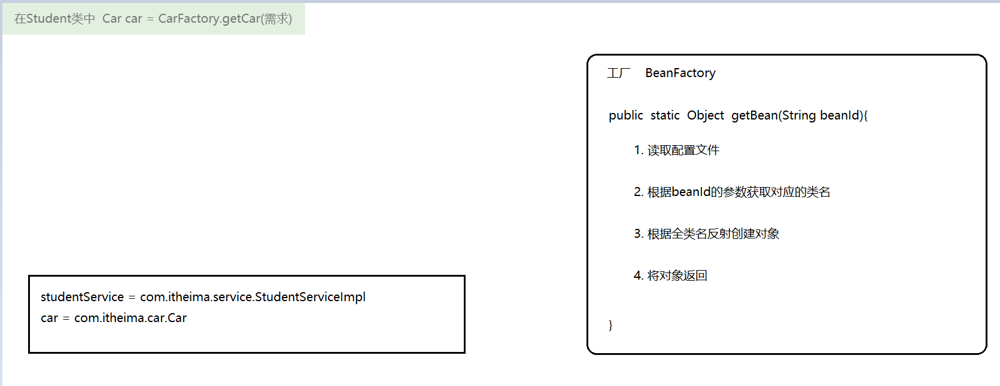
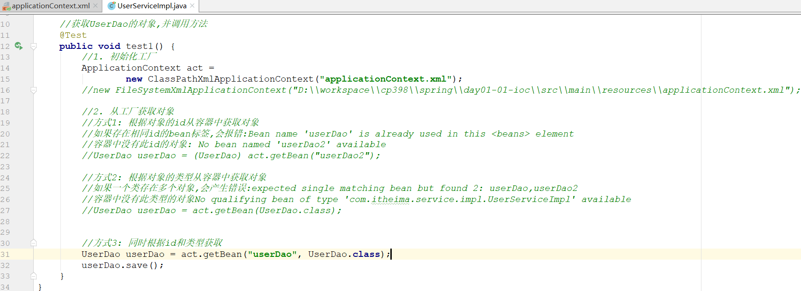

# 工厂解耦
## 为什么要学习工厂解耦
    当我们实现用mysql数据库完成一个增加的时候，突然说要改为Oracle数据库的时候，我们是不是需要重新去创建持久层(dao)来实现数据库的操作，
    那这时候业务层(service)是不是要重写定义持久层的对象，重新书写，当这种操作多的时候，是不是感觉变动很大，很麻烦，而造成这一现象的原因
    就是因为代码的耦合性(代码之间的关联关系)造成的，这时候如果代码之间比较单一的时候，是不是就不会发生了，只需要改动小地方即可。
    
    这时候便可以使用工厂模式来进行解耦
## 工厂解耦的方式
### 思路

### 配置文件(beans.properties)
```properties
#别名(用类名类写) = 实现类的具体位置
StudentService = com.itheima.service.impl.StudentServiceImpl
```
### 工厂类
```java
package com.itheima.factory;

import java.util.Enumeration;
import java.util.HashMap;
import java.util.Map;
import java.util.ResourceBundle;

//工厂类
public class BeanFactory {
    //1. 工厂什么时候创建对象的?
    //调用getBean方法的时候,创建对象, 效率比较低,我们更希望是提前创建好对象,getBean的时候直接返回

    //2. 工厂创建的对象是单例的还是多例的?
    //多例  如果创建的对象只有使用,而没有增删改的需求, 多例的话就比较浪费; 我们希望他可以是单例

    //解决思路:
    //static{}  里面的内容会在类加载到内存时候运行, 而且里面的代码仅仅会被运行一次
    //准备一个Map来进行存储
    private static Map<String, Object> map = new HashMap<>();

    static {
        try {
            //1. 读取配置文件
            ResourceBundle rb = ResourceBundle.getBundle("beans");

            //2. 获取配置文件中所有的key, 再遍历
            Enumeration<String> keys = rb.getKeys();
            while (keys.hasMoreElements()) {
                String key = keys.nextElement();

                //3. 根据key获取对应的全类名
                String className = rb.getString(key);

                //4. 根据全类名反射创建对象
                Class clazz = Class.forName(className);
                Object instance = clazz.newInstance();

                //5. 将创建的对象保存到Map中
                map.put(key, instance);
            }
        } catch (Exception e) {
            e.printStackTrace();
            throw new RuntimeException(e);
        }
    }

    //生产对象的方法
    public static Object getBean(String beanId) {
        return map.get(beanId);
    }
}
```
### 对象的获取
```java
//创建studentService对象
StudentService studentService = (StudentService) BeanFactory.getBean("StudentService");
```
# 动态代理
## 需求分析
```markdown
需求：在不修改现有代码的基础上，添加日志代码，记录所有业务层方法的执行时刻和信息（包括类名、方法名、入参、异常信息等等）

方案：动态代理，在程序运行期间，动态创建一个代理对象，实现对目标方法的增强
```
## 工厂解耦中的动态代理的实现
    修改的是：StudentServiceImpl
    目的：在不修改源码的基础上增加新的内容
```java
package com.itheima.factory;

import java.lang.reflect.InvocationHandler;
import java.lang.reflect.Method;
import java.lang.reflect.Proxy;
import java.util.*;

//工厂类
public class BeanFactory {
    //1. 工厂什么时候创建对象的?
    //调用getBean方法的时候,创建对象, 效率比较低,我们更希望是提前创建好对象,getBean的时候直接返回

    //2. 工厂创建的对象是单例的还是多例的?
    //多例  如果创建的对象只有使用,而没有增删改的需求, 多例的话就比较浪费; 我们希望他可以是单例

    //解决思路:
    //static{}  里面的内容会在类加载到内存时候运行, 而且里面的代码仅仅会被运行一次
    //准备一个Map来进行存储
    private static Map<String, Object> map = new HashMap<>();

    static {
        try {
            //1. 读取配置文件
            ResourceBundle rb = ResourceBundle.getBundle("beans");

            //2. 获取配置文件中所有的key, 再遍历
            Enumeration<String> keys = rb.getKeys();
            while (keys.hasMoreElements()) {
                String key = keys.nextElement();

                //3. 根据key获取对应的全类名
                String className = rb.getString(key);

                //4. 根据全类名反射创建对象
                Class clazz = Class.forName(className);
                Object instance = clazz.newInstance();

                //动态代理
                //5-1 上面创建好的instance就是目标对象

                //5-2 编写代理逻辑
                InvocationHandler invocationHandler = new InvocationHandler() {
                    @Override
                    public Object invoke(Object proxy, Method method, Object[] args) throws Throwable {
                        Object obj = null;


                        //创建字符串
                        StringBuilder sb = new StringBuilder();
                        sb.append("执行时间:" + new Date().toLocaleString());
                        sb.append(",原始类名:" + instance.getClass().getName());
                        sb.append("方法名:" + method.getName());
                        sb.append("传入参数:" + Arrays.toString(args));

                        try {
                            //调用目标对象方法
                            obj = method.invoke(instance, args);

                            sb.append("返回结果:" + obj);
                        } catch (Exception e) {
                            sb.append("异常信息:" + e.getMessage());
                            //千万不要忘记, 这个异常还需要给客户抛出去
                            throw new RuntimeException(e);
                        } finally {
                            System.out.println(sb.toString());
                            return obj;
                        }
                    }
                };

                //5-3 创建代理对象
                Object proxyInstance = Proxy.newProxyInstance(
                        instance.getClass().getClassLoader(),
                        instance.getClass().getInterfaces(),
                        invocationHandler
                );

                //5-4. 将创建的对象保存到Map中
                map.put(key, proxyInstance);
            }
        } catch (Exception e) {
            e.printStackTrace();
            throw new RuntimeException(e);
        }
    }

    //生产对象的方法
    public static Object getBean(String beanId) {
        return map.get(beanId);
    }
}
```
# spring工厂(IOC)
## IOC(控制反转)的介绍
```markdown
> 对象的创建由原来的==使用new关键字在类中主动创建==变成了==从工厂中获取==，而对象的创建过程由工厂内部来实现，

> 而这个工厂就是Spring的IOC容器，也就是以后我们的==对象不再自己创建，而是直接向Spring要==，这种思想就是==IOC==

> IOC( 控制 反转 )是一种设计思想，它的目的是指导我们设计出更加松耦合的程序

> 控制：指的是对象控制权，现在可以简单理解为对象的创建权

> 反转：指的对象的控制权由程序员在类中主动控制(new)反转到由Spring容器来控制
```
## 案例实现
    maven配置
```xml
<dependencies>
        <dependency>
            <groupId>org.springframework</groupId>
            <artifactId>spring-context</artifactId>
            <version>5.1.6.RELEASE</version>
        </dependency>
        <dependency>
            <groupId>junit</groupId>
            <artifactId>junit</artifactId>
            <version>4.13.2</version>
        </dependency>
    </dependencies>
```
    创建一个实体类
```java
package com.itmhw.domain;

public class Book {
}
```

    创建BookFactory工厂
```java
package com.itmhw.factory;

import com.itmhw.domain.Book;

public class BookFactory {
    public static Book getBook1(){
        return new Book();
    }

    public Book getBook2(){
        return new Book();
    }
}

```

    在applicationContext.xml配置
```xml
<?xml version="1.0" encoding="UTF-8"?>
<beans xmlns="http://www.springframework.org/schema/beans"
       xmlns:xsi="http://www.w3.org/2001/XMLSchema-instance"
       xmlns:p="http://www.springframework.org/schema/p"
       xsi:schemaLocation="http://www.springframework.org/schema/beans
        https://www.springframework.org/schema/beans/spring-beans.xsd">
<!--  对象创建的三种方式，在spring配置中表示方式  -->
<!--直接调用构造函数创建(直接new 对象)
    Book book = new Book();
-->
    <bean id="book" class="com.itmhw.domain.Book"></bean>

<!--  调用静态工厂创建
      Book book1 = BookFactory.getBook1();
  -->
    <bean id="book1" class="com.itmhw.factory.BookFactory" factory-method="getBook1"></bean>

<!--  调用实例化工厂创建
     BookFactory bookFactory = new BookFactory();
     Book book2 = bookFactory.getBook2();
  -->
    <bean id="bookFactory" class="com.itmhw.factory.BookFactory"></bean>
    <bean id="book2" factory-bean="bookFactory" factory-method="getBook2"></bean>
</beans>
```
    创建dao层
```java
//接口
package com.itmhw.dao;

public interface UserDao {
    void save();
}
```
```java
//实现类
package com.itmhw.dao.impl;

import com.itmhw.dao.UserDao;

public class UserDaoImpl implements UserDao {
    public void save() {
        System.out.println("用户创建成功");
    }
}
```
    创建service层
```java
//接口
public interface UserService(){
    void test2();
}
```
```java
//实现类
package com.itmhw.service.impl;

import com.itmhw.domain.Book;
import org.junit.Test;
import org.springframework.context.ApplicationContext;
import org.springframework.context.support.ClassPathXmlApplicationContext;

public class UserServiceImpl implements UserService {
    @Test
    public void test2(){
        ApplicationContext act = new ClassPathXmlApplicationContext("applicationContext.xml");
        Book book = (Book) act.getBean("book");
        System.out.println("book = " + book);

        Book book1 = (Book) act.getBean("book1");
        System.out.println("book1 = " + book1);

        Book book2 = (Book) act.getBean("book2");
        System.out.println("book2 = " + book2);

    }
}
```
## API
### 两个接口
```markdown
BeanFactory  ApplicationContext 区别在哪?
* BeanFactory
	1.这是SpringIOC容器的顶级接口，它定义了SpringIOC的最基础的功能，但是其功能比较简单，一般面向Spring自身使用
	2.BeanFactroy在第一次使用到某个Bean时(调用getBean())，才对该Bean进行加载实例化

* ApplicationContext
	1.这是在BeanFactory基础上衍生出的接口，它扩展了BeanFactory的功能，一般面向程序员使用 
	2.ApplicationContext是在容器启动时，一次性创建并加载了所有的Bean

* 注意: 上面两种方式创建的对象都是单例，只是创建对象的时机不同
```
### 三个实现类
```markdown
* 这三个类的作用都是：读取配置文件, 初始化Spring的IOC容器,  不一样的是加载配置文件的位置
	- ClassPathXmlApplicationContext("配置文件名")         读取类路径下的xml作为配置文件
	- FileSystemXmlApplicationContext("配置文件的全路径，从模块开始")        读取本地目录下的xml作为配置文件	
	- AnnotationConfigApplicationContext     读取一个注解配置作为配置文件
```
### 一个方法
```markdown
* getBean() 用于从Spring容器中获取Bean对象，参数可以使用三种情况：
	getBean("id")                     使用bean的id从容器中查找对象
	getBean(Bean.class)               使用bean的class类型从容器中查找对象
	getBean("id", Bean.class)         使用bean的id 和 class类型从容器中查找对象 
```

```markdown
容器(spring配置文件)中没有此id对象(配置文件中没有此id名)：No bean named 'userDao1' available

容器中存在相同id的bean标签(完全相同的2个标签)：Configuration problem: Bean name 'userDao' is already used in this <beans> element

容器中没有此类型的对象(查找配置文件中class属性没有此对象)：No qualifying bean of type 'com.itheima.dao.UserDao' available 

容器中一个类存在多个对象(id不同，class相同的情况下)：No qualifying bean of type 'com.itheima.dao.UserDao' available: expected single matching bean but found 2: userDao,userDao2

```
