# 工厂解耦（理解）

## 面向接口编程(视频)

> 面向接口编程就是在开发程序之前先定义接口(接口中定义方法)，然后开发人员再按照接口定义好的方法去写实现类
>


## 工厂解耦

>先要明确，所谓的解耦合解的是编译阶段的耦合，运行阶段还是要耦合工作的

>Student   想拥有一辆   Car
>
>方式1: 自己买零件,自己攒车
>
>​		   在Student类中创建Car的对象: Car car = new Car()
>
>方式2: Student将自己对车的需求告诉Factory, 具体的车的创建是由工厂负责, 然后交到Student手中
>
>​	      在Student类中  Car car = CarFactory.getCar(需求)

### 思路

 

### 配置文件

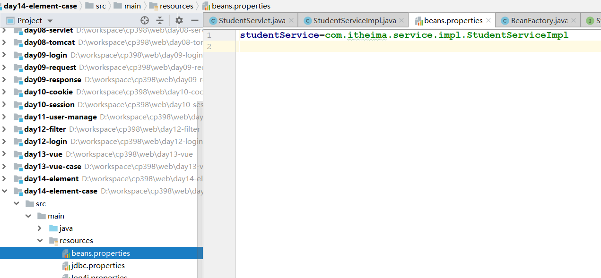 

### 工厂类

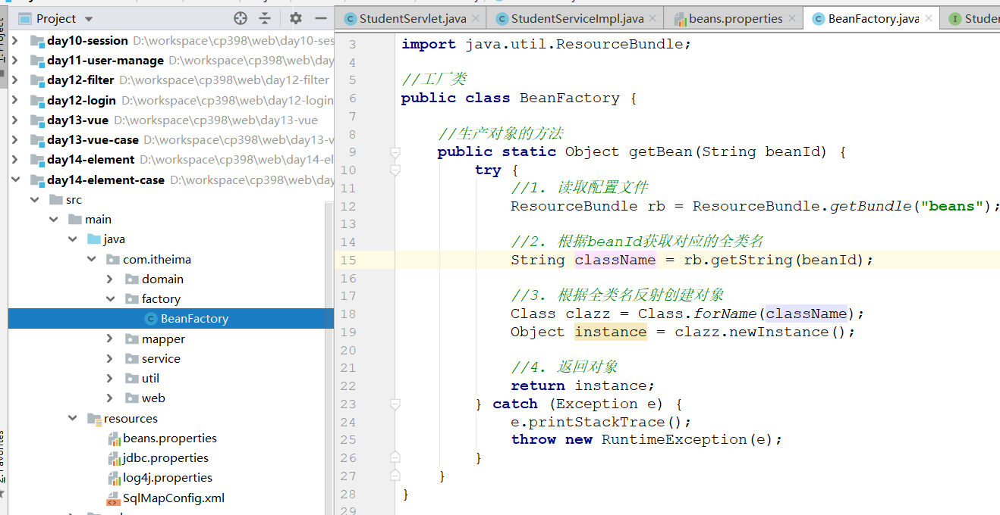 

### 获取对象

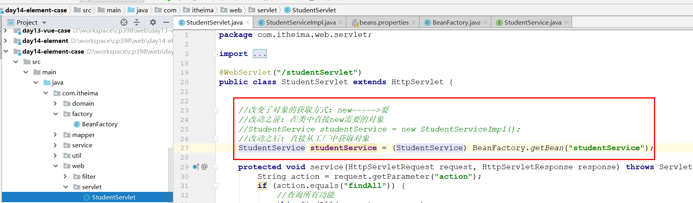 

### 优化工厂

```java
package com.itheima.factory;

import java.util.Enumeration;
import java.util.HashMap;
import java.util.Map;
import java.util.ResourceBundle;

//工厂类
public class BeanFactory {
    //1. 工厂什么时候创建对象的?
    //调用getBean方法的时候,创建对象, 效率比较低,我们更希望是提前创建好对象,getBean的时候直接返回

    //2. 工厂创建的对象是单例的还是多例的?
    //多例  如果创建的对象只有使用,而没有增删改的需求, 多例的话就比较浪费; 我们希望他可以是单例

    //解决思路:
    //static{}  里面的内容会在类加载到内存时候运行, 而且里面的代码仅仅会被运行一次
    //准备一个Map来进行存储
    private static Map<String, Object> map = new HashMap<>();

    static {
        try {
            //1. 读取配置文件
            ResourceBundle rb = ResourceBundle.getBundle("beans");

            //2. 获取配置文件中所有的key, 再遍历
            Enumeration<String> keys = rb.getKeys();
            while (keys.hasMoreElements()) {
                String key = keys.nextElement();

                //3. 根据key获取对应的全类名
                String className = rb.getString(key);

                //4. 根据全类名反射创建对象
                Class clazz = Class.forName(className);
                Object instance = clazz.newInstance();

                //5. 将创建的对象保存到Map中
                map.put(key, instance);
            }
        } catch (Exception e) {
            e.printStackTrace();
            throw new RuntimeException(e);
        }
    }

    //生产对象的方法
    public static Object getBean(String beanId) {
        return map.get(beanId);
    }
}
```

# 动态代理（理解）

## 需求分析

> 需求：在不修改现有代码的基础上，添加日志代码，记录所有业务层方法的执行时刻和信息（包括类名、方法名、入参、异常信息等等）
>
> 方案：动态代理，在程序运行期间，动态创建一个代理对象，实现对目标方法的增强

## 动态代理

### Performer

~~~java
package com.itheima.test.proxy;

//演员接口
public interface Performer {

    //唱歌
    void sing();

    //跳舞
    void dance();
}
~~~

### BaoQiang

~~~java
package com.itheima.test.proxy;

public class BaoQiang implements Performer {
    @Override
    public void sing() {
        System.out.println("宝强在唱歌");
    }

    @Override
    public void dance() {
        System.out.println("宝强在跳舞");
    }
}
~~~

### App

~~~java
package com.itheima.test.proxy;

import java.lang.reflect.InvocationHandler;
import java.lang.reflect.Method;
import java.lang.reflect.Proxy;

public class App {

    public static void main(String[] args) {
//        //1. 创建宝强对象,调用方法
//        Performer performer = new BaoQiang();
//        performer.sing();
//        performer.dance();

//        //2. 创建宝强的代理对象
//        Performer performer = new SongZhe();
//        performer.sing();
//        performer.dance();


        //动态代理: 动态的创建代理对象
        //1. 创建目标对象
        Performer performer = new BaoQiang();

        //2. 编写代理逻辑
        InvocationHandler invocationHandler = new InvocationHandler() {
            @Override
            public Object invoke(Object proxy, Method method, Object[] args) throws Throwable {
                Object obj = null;

                System.out.println("弹费用....");

                //直接调用目标对象的方法
                //参数1: 目标对象,  参数2: args
                //返回结果: 如果目标方法有返回值, 这个值就是返回结果; 如果目标方法是void修饰, 这个结果就是null
                obj = method.invoke(performer, args);


                System.out.println("收费....");

                return obj;
            }
        };

        //3. 使用JDK动态代理创建代理对象(本质上就是把上面的两块功能拼在一起)
        Performer proxyInstance = (Performer) Proxy.newProxyInstance(
                performer.getClass().getClassLoader(),//类加载器, 固定写法,代理对象要跟目标对象使用相同的
                performer.getClass().getInterfaces(),//接口,固定写法,代理对象要跟目标对象使用相同的
                invocationHandler//代理逻辑
        );

        //4. 调用代理对象的方法
        proxyInstance.sing();
        proxyInstance.dance();
    }
}
~~~

## 功能实现

>目标对象: StudentServiceImpl
>
>增强逻辑: 日志
>
>代理对象: 

~~~java
package com.itheima.factory;

import java.lang.reflect.InvocationHandler;
import java.lang.reflect.Method;
import java.lang.reflect.Proxy;
import java.util.*;

//工厂类
public class BeanFactory {
    //1. 工厂什么时候创建对象的?
    //调用getBean方法的时候,创建对象, 效率比较低,我们更希望是提前创建好对象,getBean的时候直接返回

    //2. 工厂创建的对象是单例的还是多例的?
    //多例  如果创建的对象只有使用,而没有增删改的需求, 多例的话就比较浪费; 我们希望他可以是单例

    //解决思路:
    //static{}  里面的内容会在类加载到内存时候运行, 而且里面的代码仅仅会被运行一次
    //准备一个Map来进行存储
    private static Map<String, Object> map = new HashMap<>();

    static {
        try {
            //1. 读取配置文件
            ResourceBundle rb = ResourceBundle.getBundle("beans");

            //2. 获取配置文件中所有的key, 再遍历
            Enumeration<String> keys = rb.getKeys();
            while (keys.hasMoreElements()) {
                String key = keys.nextElement();

                //3. 根据key获取对应的全类名
                String className = rb.getString(key);

                //4. 根据全类名反射创建对象
                Class clazz = Class.forName(className);
                Object instance = clazz.newInstance();

                //动态代理
                //5-1 上面创建好的instance就是目标对象

                //5-2 编写代理逻辑
                InvocationHandler invocationHandler = new InvocationHandler() {
                    @Override
                    public Object invoke(Object proxy, Method method, Object[] args) throws Throwable {
                        Object obj = null;


                        //创建字符串
                        StringBuilder sb = new StringBuilder();
                        sb.append("执行时间:" + new Date().toLocaleString());
                        sb.append(",原始类名:" + instance.getClass().getName());
                        sb.append("方法名:" + method.getName());
                        sb.append("传入参数:" + Arrays.toString(args));

                        try {
                            //调用目标对象方法
                            obj = method.invoke(instance, args);

                            sb.append("返回结果:" + obj);
                        } catch (Exception e) {
                            sb.append("异常信息:" + e.getMessage());
                            //千万不要忘记, 这个异常还需要给客户抛出去
                            throw new RuntimeException(e);
                        } finally {
                            System.out.println(sb.toString());
                            return obj;
                        }
                    }
                };

                //5-3 创建代理对象
                Object proxyInstance = Proxy.newProxyInstance(
                        instance.getClass().getClassLoader(),
                        instance.getClass().getInterfaces(),
                        invocationHandler
                );

                //5-4. 将创建的对象保存到Map中
                map.put(key, proxyInstance);
            }
        } catch (Exception e) {
            e.printStackTrace();
            throw new RuntimeException(e);
        }
    }

    //生产对象的方法
    public static Object getBean(String beanId) {
        return map.get(beanId);
    }
}
~~~


# Spring（了解）

> Spring是`分层`的Java应用`轻量级`开源框架，核心是IOC和AOP

~~~markdown
* 分层：Spring在三层上都有自己的解决方案
	web层 : Springmvc
	service层 : Spring
	dao层 : SpringJdbc  (mybatis  mybatisplus  jpa)

* 轻量级：只启动Spring核心容器的时候，占用的内存少，耗费的资源少

* 开源：源代码开放

* 核心：IOC（Inverse Of Control：反转控制）和 AOP（Aspect Oriented Programming：面向切面编程）
~~~

>体系架构图

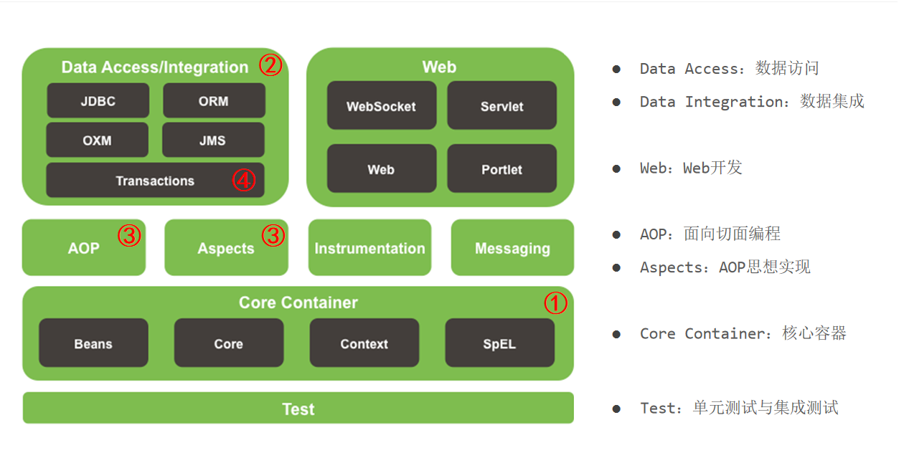 


# IOC入门（重点）

## IOC介绍

> 对象的创建由原来的==使用new关键字在类中主动创建==变成了==从工厂中获取==，而对象的创建过程由工厂内部来实现，
>
> 而这个工厂就是Spring的IOC容器，也就是以后我们的==对象不再自己创建，而是直接向Spring要==，这种思想就是==IOC==

> IOC( 控制 反转 )是一种设计思想，它的目的是指导我们设计出更加松耦合的程序
>
> 控制：指的是对象控制权，现在可以简单理解为对象的创建权
>
> 反转：指的对象的控制权由程序员在类中主动控制(new)反转到由Spring容器来控制
>

## 案例实现

>使用Spring的IOC来实现service和dao代码的解耦

### 创建空工程

>工程创建完毕之后,自己检查一下maven的三个选项是否配置的正确

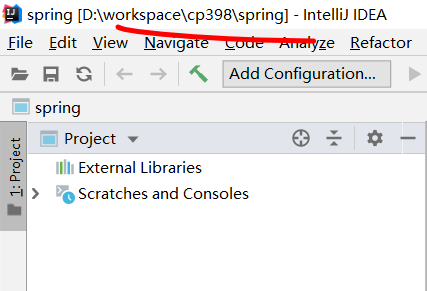 

### 创建子模块

 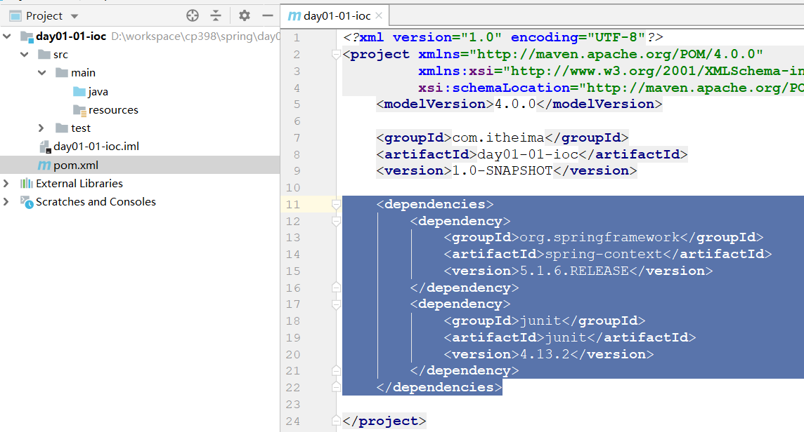 

~~~xml
    <dependencies>
        <dependency>
            <groupId>org.springframework</groupId>
            <artifactId>spring-context</artifactId>
            <version>5.1.6.RELEASE</version>
        </dependency>
        <dependency>
            <groupId>junit</groupId>
            <artifactId>junit</artifactId>
            <version>4.13.2</version>
        </dependency>
    </dependencies>
~~~

### 创建dao接口和实现类

 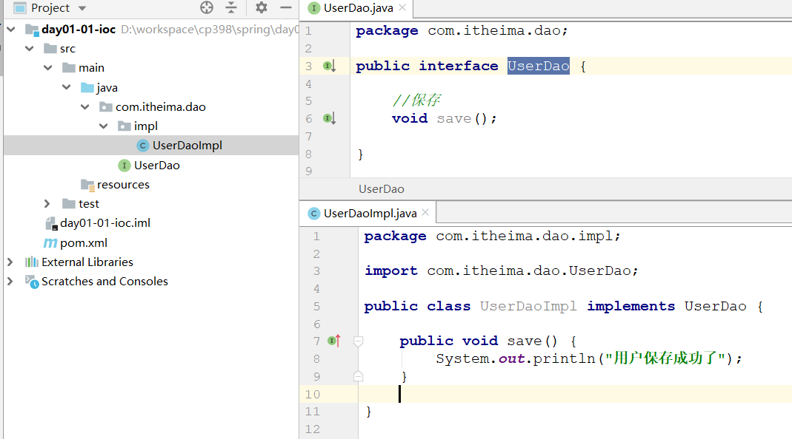 

### 提供Spring的配置文件

 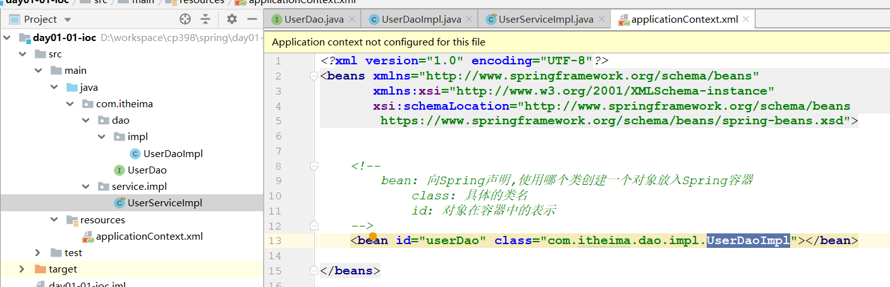 

### 创建service实现类

>在service实现类获取dao对象 

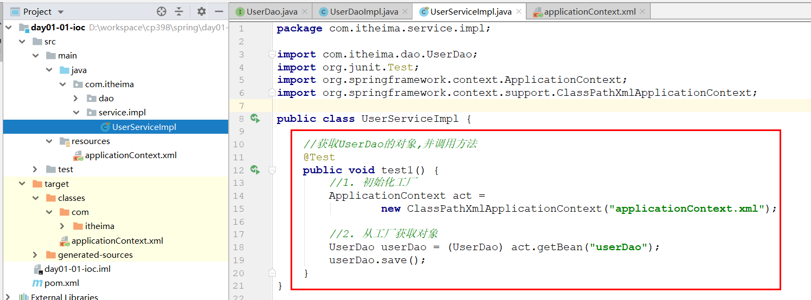 

## 要点分析

> SpringIOC容器启动过程中要做哪些操作

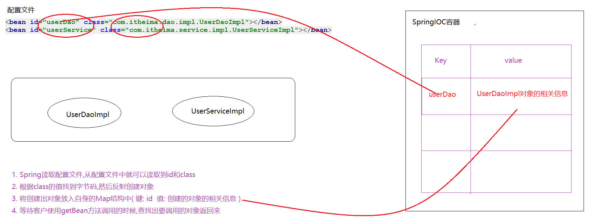 

> SpringIOC存储对象的Map到底在哪里

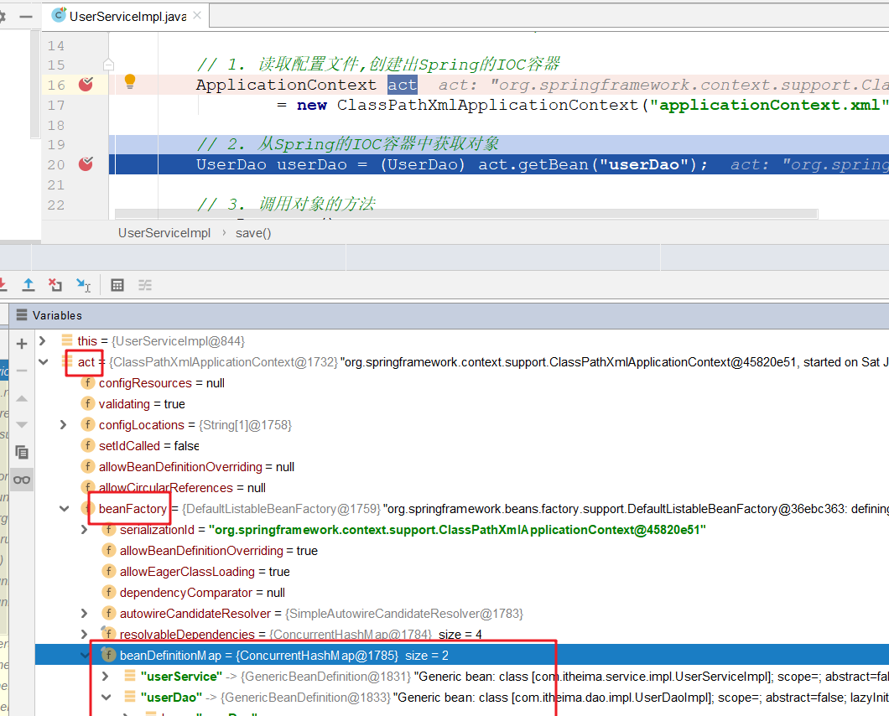 

## API（了解）

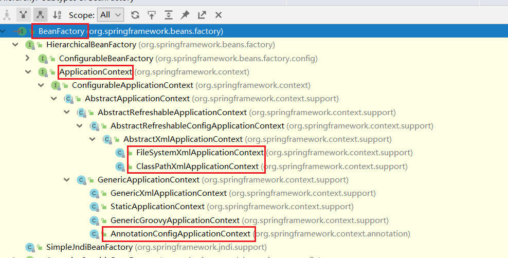 

### 两个接口

~~~markdown
* BeanFactory
	这是SpringIOC容器的顶级接口，它定义了SpringIOC的最基础的功能，但是其功能比较简单，一般面向Spring自身使用
	BeanFactroy在第一次使用到某个Bean时(调用getBean())，才对该Bean进行加载实例化

* ApplicationContext
	这是在BeanFactory基础上衍生出的接口，它扩展了BeanFactory的功能，一般面向程序员使用 
	ApplicationContext是在容器启动时，一次性创建并加载了所有的Bean

* 注意: 上面两种方式创建的对象都是单例，只是创建对象的时机不同
~~~

>==面试题: BeanFactory  ApplicationContext 区别在哪==

### 三个实现类

~~~markdown
* 这三个类的作用都是：读取配置文件, 初始化Spring的IOC容器,  不一样的是加载配置文件的位置
	- ClassPathXmlApplicationContext         读取类路径下的xml作为配置文件
	- FileSystemXmlApplicationContext        读取本地目录下的xml作为配置文件	
	- AnnotationConfigApplicationContext     读取一个注解配置作为配置文件
~~~

### 一个方法

~~~markdown
* getBean() 用于从Spring容器中获取Bean对象，参数可以使用三种情况：
	getBean("id")                     使用bean的id从容器中查找对象
	getBean(Bean.class)               使用bean的class类型从容器中查找对象
	getBean("id", Bean.class)         使用bean的id 和 class类型从容器中查找对象 
~~~

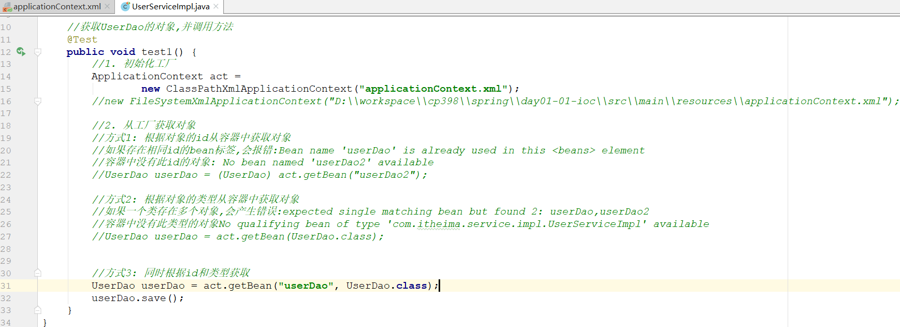 

>容器(spring配置文件)中没有此id对象：No bean named 'userDao1' available
>
>容器中存在相同id的bean标签：Configuration problem: Bean name 'userDao' is already used in this <beans> element
>
>容器中没有此类型的对象：No qualifying bean of type 'com.itheima.dao.UserDao' available 
>
>容器中一个类存在多个对象：No qualifying bean of type 'com.itheima.dao.UserDao' available: expected single matching bean but found 2: userDao,userDao2


## 创建对象(了解)

> 创建对象的方式有三种：
>
> 1. 直接调用构造函数创建
> 2. 使用静态工厂创建
> 3. 使用实例化工厂创建

### Book

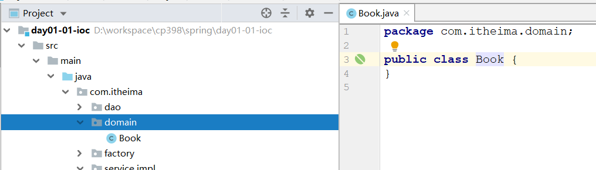 

### BookFactory

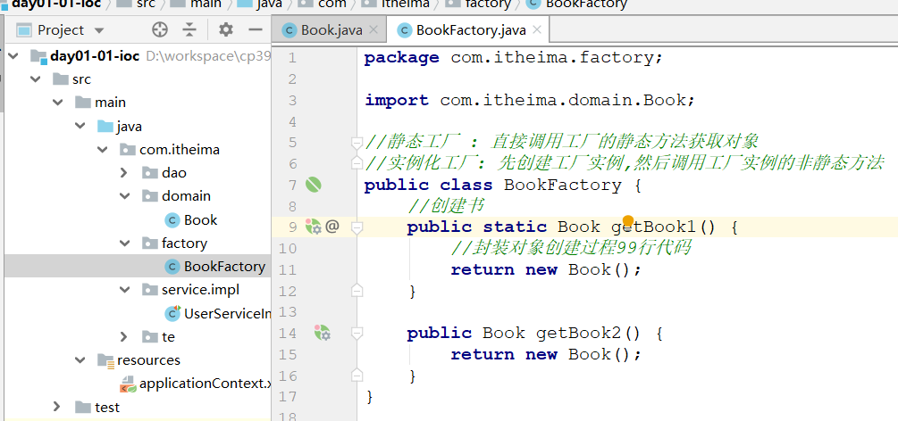 

### 配置文件

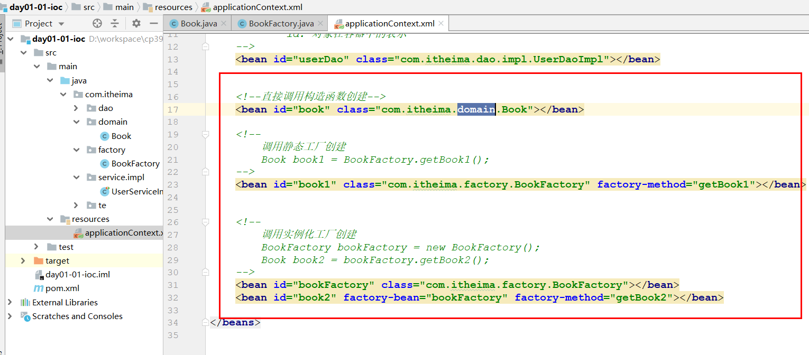 

### 测试

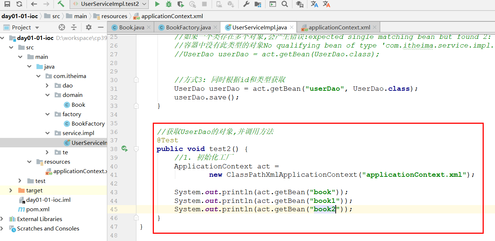 


