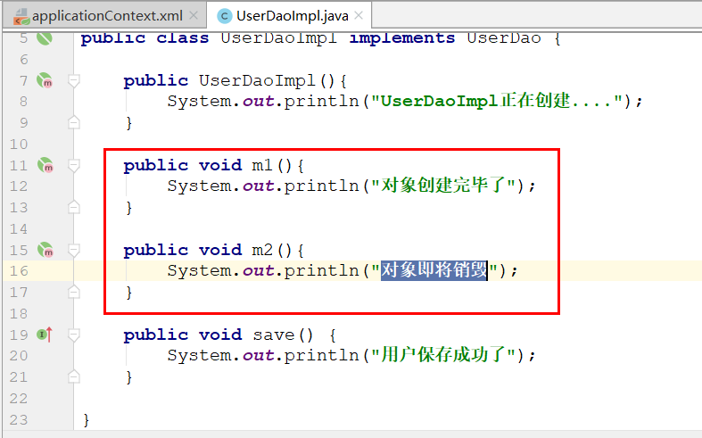
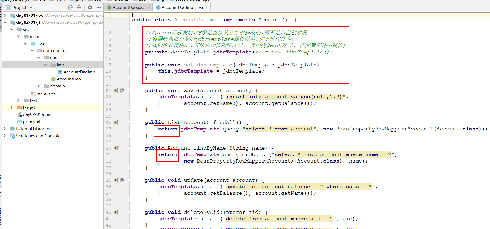

# 回顾

~~~markdown
1. Spring  IOC  AOP

2. IOC 
	类  配置文件
	启动Spring容器
	act.getBean()
~~~


# Bean的配置（重点）

## 作用域

> ~~~markdown
> * 在Spring中，对于bean支持多种作用域，常见的有下面几个：
> - singleton(默认)    单例模式，即对象只创建一次，然后一直存在
> - prototype          多例模式，即每次获取bean的时候，IOC都给我们创建一个新对象
> - request            web项目中，Spring创建一个Bean的对象，将对象存入到request域中
> - session            web项目中，Spring创建一个Bean的对象，将对象存入到session域中
> ~~~

### singleton


### prototype

 

## 生命周期

> 研究bean的生命周期，无非就是弄明白bean是什么时候创建的，什么时候销毁的
>
> 在Spring中，bean的作用范围会影响到其生命周期，所以我们要分单例和多例对象来研究bean的生命周期

### 单例对象

>创建：容器启动的时候
>
>销毁：容器关闭的时候

 


### 多例对象

>创建：调用getBean方法从容器中获取的时候
>
>销毁：Spring是不知道对象的销毁的时机

 

## 依赖注入

> 依赖注入(Dependency Injection，DI) 其实就是给对象中的属性赋值的过程
>
> 依赖注入有两种方式，分别是使用构造函数和set方法

### 构造函数

**① 在类中创建构造函数**

 

**② 在配置文件中赋值**

 

**③ 给UserDaoImpl添加toString**

 

**④ 测试**

 

### set方法

**① 在类中创建set方法**

 

**② 在配置文件中赋值**

 

**③ 测试**

 

## 注入集合属性(了解)

### 修改UserDaoImpl

```java
package com.itheima.dao.impl;

import com.itheima.dao.UserDao;

import java.util.*;

//只要想添加带参数构造函数, 那么就必须生成一个无参构造
public class UserDaoImpl implements UserDao {
    public UserDaoImpl(){
        System.out.println("UserDaoImpl正在创建....");
    }

    public UserDaoImpl(String name, Integer age, Date birthday) {
        this.name = name;
        this.age = age;
        this.birthday = birthday;
    }

    private String name;
    private Integer age;
    private Date birthday;
    
    private List<String> myList = new ArrayList<String>();
    private Set<String> mySet = new HashSet<String>();
    private String[] myArr;
    private Map<String,String> myMap = new HashMap<String, String>();

    public void setMyList(List<String> myList) {
        this.myList = myList;
    }

    public void setMySet(Set<String> mySet) {
        this.mySet = mySet;
    }

    public void setMyArr(String[] myArr) {
        this.myArr = myArr;
    }

    public void setMyMap(Map<String, String> myMap) {
        this.myMap = myMap;
    }

    public void setName(String name) {
        this.name = name;
    }

    public void setAge(Integer age) {
        this.age = age;
    }

    public void setBirthday(Date birthday) {
        this.birthday = birthday;
    }

    @Override
    protected void finalize() throws Throwable {
        System.out.println("对象销毁");
    }

    public void m1(){
        System.out.println("对象创建完毕了");
    }

    public void m2(){
        System.out.println("对象即将销毁");
    }

    public void save() {
        System.out.println("用户保存成功了");
    }

    @Override
    public String toString() {
        return "UserDaoImpl{" +
                "name='" + name + '\'' +
                ", age=" + age +
                ", birthday=" + birthday +
                ", myList=" + myList +
                ", mySet=" + mySet +
                ", myArr=" + Arrays.toString(myArr) +
                ", myMap=" + myMap +
                '}';
    }
}
```

### 配置文件赋值

 

### 测试

 


## 多配置文件

~~~markdown
* 我们现在的配置都集中配在了一个applicationContext.xml文件中，这样会使这个文件很难维护。
* 针对这个问题，Spring给我们提供了两种解决方案:
	1. 同时引入多个配置文件
	2. 引入一个主配置文件，在主配置文件中引入其他配置文件

* 注意:
	1. 同一个xml文件中不允许出现相同id的bean，如果出现会报错
	2. 多个xml文件如果出现相同id的bean，不会报错，但是后加载的会覆盖前加载，所以尽量保证bean的名称是唯一的
~~~

>同时引入多个配置文件 

 

>引入一个主配置文件，在主配置文件中引入其他配置文件 

 


# JdbcTemplate（会用）

## JdbcTemplate介绍

~~~markdown
* JdbcTemplate是Spring提供的持久层技术，用于操作数据库，它底层封装了JDBC技术。
* 核心类：
	JdbcTemplate              用于执行增删改查的SQL语句
	BeanPropertyRowMapper     主要作用是将数据库返回的记录封装进实体对象
* 核心方法：
	update               用来执行增、删、改语句
	query/queryForObject 用来执行查询语句
~~~

~~~java
//创建一个JdbcTemplate对象，用来执行增删改查, 需要给一个数据源
JdbcTemplate jdbcTemplate = new JdbcTemplate(dataSource);

//update方法，用于执行增删改语句
//第一个参数:sql语句   后面的参数:sql语句中的所需要的的值
jdbcTemplate.update("insert into account value(null,?,?)",1,2);

//query或者queryForObject方法，用于执行查询语句
//query 用于查询多条记录,返回一个集合   queryForObject用于查询一条记录,返回一个实体
//第一个参数:sql语句   第二个参数:封装返回值   后面的参数:sql语句中的所需要的的值
jdbcTemplate.query("select * from account", new BeanPropertyRowMapper<Account>(Account.class)); 
jdbcTemplate.queryForObject("select * from account where aid = ?",  new BeanPropertyRowMapper<Account>(Account.class), 1);
~~~

## JdbcTemplate使用

>使用JdbcTemplate完成对数据库的增删改查

### 准备数据环境 

 

### 创建模块,引入依赖 

 

~~~xml
    <dependencies>
        <!--mysql-->
        <dependency>
            <groupId>mysql</groupId>
            <artifactId>mysql-connector-java</artifactId>
            <version>5.1.47</version>
        </dependency>
        <!--druid-->
        <dependency>
            <groupId>com.alibaba</groupId>
            <artifactId>druid</artifactId>
            <version>1.1.15</version>
        </dependency>

        <!--jdbcTemplate依赖所在-->
        <dependency>
            <groupId>org.springframework</groupId>
            <artifactId>spring-jdbc</artifactId>
            <version>5.1.6.RELEASE</version>
        </dependency>

        <!--lombok-->
        <dependency>
            <groupId>org.projectlombok</groupId>
            <artifactId>lombok</artifactId>
            <version>1.18.22</version>
        </dependency>

        <!--junit-->
        <dependency>
            <groupId>junit</groupId>
            <artifactId>junit</artifactId>
            <version>4.13.2</version>
        </dependency>
    </dependencies>
~~~

### 创建实体类

  

### 测试

~~~java
package com.itheima.test;

import com.alibaba.druid.pool.DruidDataSource;
import com.itheima.domain.Account;
import org.junit.Test;
import org.springframework.jdbc.core.BeanPropertyRowMapper;
import org.springframework.jdbc.core.JdbcTemplate;

import java.util.List;

public class JdbcTemplateTest {

    @Test
    public void save() {
        //1. 创建数据源, 设置四要素
        DruidDataSource dataSource = new DruidDataSource();
        dataSource.setDriverClassName("com.mysql.jdbc.Driver");
        dataSource.setUrl("jdbc:mysql:///spring");
        dataSource.setUsername("root");
        dataSource.setPassword("root");

        //2. 创建JdbcTemplate
        JdbcTemplate jdbcTemplate = new JdbcTemplate(dataSource);

        //3. 调用方法
        jdbcTemplate.update("insert into account values(null,?,?)", "B02", 1000000);
    }


    @Test
    public void findAll() {
        //1. 创建数据源, 设置四要素
        DruidDataSource dataSource = new DruidDataSource();
        dataSource.setDriverClassName("com.mysql.jdbc.Driver");
        dataSource.setUrl("jdbc:mysql:///spring");
        dataSource.setUsername("root");
        dataSource.setPassword("root");

        //2. 创建JdbcTemplate
        JdbcTemplate jdbcTemplate = new JdbcTemplate(dataSource);

        //3. 调用方法
        List<Account> accountList =
                jdbcTemplate.query("select * from account", new BeanPropertyRowMapper<Account>(Account.class));
        for (Account account : accountList) {
            System.out.println(account);
        }
    }

    @Test
    public void findByName() {
        //1. 创建数据源, 设置四要素
        DruidDataSource dataSource = new DruidDataSource();
        dataSource.setDriverClassName("com.mysql.jdbc.Driver");
        dataSource.setUrl("jdbc:mysql:///spring");
        dataSource.setUsername("root");
        dataSource.setPassword("root");

        //2. 创建JdbcTemplate
        JdbcTemplate jdbcTemplate = new JdbcTemplate(dataSource);

        //3. 调用方法
        Account account = jdbcTemplate.queryForObject("select * from account where name = ?",
                new BeanPropertyRowMapper<Account>(Account.class), "B01");
        System.out.println(account);
    }
}
~~~


# 综合练习（重点）

> 使用Spring和JdbcTemplate完成对数据库的crud操作
>
> - dao          JdbcTemplate
>
> - service  
>
> - junit

## 添加依赖

~~~xml
<!--spring核心-->
<dependency>
    <groupId>org.springframework</groupId>
    <artifactId>spring-context</artifactId>
    <version>5.1.6.RELEASE</version>
</dependency>
~~~

## 创建dao层接口

 

## 创建dao层实现类

 

## 创建service层接口

 

## 创建service层实现类

 

## 加入spring的配置文件

~~~xml
<?xml version="1.0" encoding="UTF-8"?>
<beans xmlns="http://www.springframework.org/schema/beans"
       xmlns:p="http://www.springframework.org/schema/p"
       xmlns:xsi="http://www.w3.org/2001/XMLSchema-instance"
       xmlns:context="http://www.springframework.org/schema/context"
       xsi:schemaLocation="http://www.springframework.org/schema/beans
			    http://www.springframework.org/schema/beans/spring-beans.xsd
			    http://www.springframework.org/schema/context
			    http://www.springframework.org/schema/context/spring-context.xsd">

    <!--
        DataSource dataSource = new DruidDataSource();

        dataSource.setDriverClassName("com.mysql.jdbc.Driver");
        dataSource.setUrl("jdbc:mysql:///spring");
        dataSource.setUsername("root");
        dataSource.setPassword("root");
    -->
    <bean id="dataSource" class="com.alibaba.druid.pool.DruidDataSource">
        <property name="driverClassName" value="com.mysql.jdbc.Driver"></property>
        <property name="url" value="jdbc:mysql:///spring"></property>
        <property name="username" value="root"></property>
        <property name="password" value="root"></property>
    </bean>


    <!--
        JdbcTemplate jdbcTemplate = new JdbcTemplate()
        jdbcTemplate.setDataSource(dataSource);
    -->
    <bean id="jdbcTemplate" class="org.springframework.jdbc.core.JdbcTemplate">
        <property name="dataSource" ref="dataSource"/>
    </bean>

    <!--
        AccountDao accountDao = new AccountDaoImpl()
        accountDao.setJdbcTemplate(jdbcTemplate)
    -->
    <bean id="accountDao" class="com.itheima.dao.impl.AccountDaoImpl">
        <property name="jdbcTemplate" ref="jdbcTemplate"/>
    </bean>


    <!--
        AccountService accountService = new AccountServiceImpl()
        accountService.setAccountDao(accountDao);
    -->
    <bean id="accountService" class="com.itheima.service.impl.AccountServiceImpl">
        <property name="accountDao" ref="accountDao"></property>
    </bean>
</beans>
~~~

## 测试

 


# 常见注解（重点）

>本章节我们开始学习Spring的注解，首先明确注解就是对原来XML配置的简化，二者实现的功能是一样的。

## 创建对象

### 复制工程

 

### 修改配置文件

>1. 删除所有的bean
>2. 加入一个注解扫描的标签

 

### 创建dao对象

 

### 测试

 

### 总结

~~~markdown
* @Component
	用于实例化对象，相当于配置文件中的<bean id="" class=""/>
	它支持一个value属性，相当于xml中bean的id，如果不写，默认值为类名的首字母小写

* @Controller  @Service  @Repository
	这三个注解的功能跟@Component类似，他们分别标注在不同的层上。
        @Controller  标注在表示层的类上
        @Service     标注在业务层的类上
        @Repository  标注在持久层的类上
	推荐使用这三个，当一个类实在不好归属在这三个层上时，再使用@Component
~~~

## 作用域

### 验证单例

 

### 验证多例 

 

### 总结

~~~markdown
* @Scope用于指定bean的作用范围(单例和多例)，相当于配置文件中的<bean scope="">
~~~

## 生命周期

### 配置

  

### 总结

~~~markdown
* @PostConstruct @PreDestroy 这两个注解标注方法分别在对象的创建之后和销毁之前执行。
* 相当于<bean init-method="init" destroy-method="destory" /> 
~~~

## 依赖注入

### 创建service对象,并且中注入dao  

 

### 总结

~~~markdown
1. @Autowired
	这个注解表示依赖注入，他可以标注在属性上，也可以标注在方法上，当@Autowired标注在属性上的时候，属性对应的set方法可以省略不写
	Spring会在他的IOC容器中按照被标注属性的类型进行寻找，如果查找到了一个就进行注入，如果查找不到或者查找到多个就报错
         
2. @Qualifier
	跟@Autowired联合使用，代表在按照类型匹配的基础上，再按照名称匹配
~~~

## 注解总结

| xml配置                                               | 注解配置                                         | 说明                       |
| ----------------------------------------------------- | ------------------------------------------------ | -------------------------- |
| < bean id="" class="" >                               | ==@Component @Controller @Service  @Repository== | bean的实例化               |
| < property name="" ref="">                            | ==@Autowired== @Qualifier                        | bean的对象属性注入         |
| < property name="" value="">                          | @Value                                           | bean的简单属性注入         |
| < bean scope="">                                      | @Scope                                           | 控制bean的作用范围         |
| < bean init-method="init" destroy-method="destory" /> | @PostConstruct @PreDestroy                       | bean创建之后和销毁之前调用 |

## 案例

> 常用注解: 我们自己写的类使用注解配置,  第三方的类使用xml配置

### 复制工程

 

### 修改配置文件

 

### 修改dao

 

### 修改service

 

### 测试

 

>任务:
>
>1. bean的配置注解和xml
>2. jdbcTemplate(使用两个方法)
>3. 增删改查案例(至少两遍) 对于常用注解案例, 大家独立写一遍, 不要复制工程,然后改, 而是从0开始写