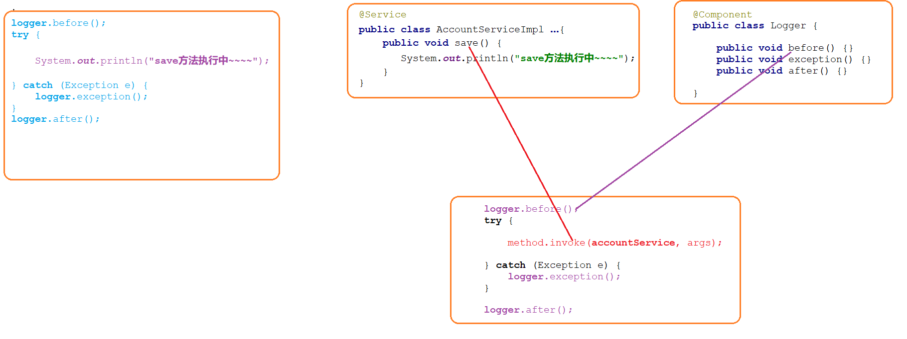

# 纯注解(配置文件)
    这里的不在用xml使用java类通过注解来进行配置
## 扫描组件
    @ComponentScan("扫描的包")，该组件要写在类名的前面
## bean标签
    @Bean
    只能标注方法上,作用就是将方法的返回值对象放入容器
    在容器中默认的id是当前方法名称; 也可以使用注解的value属性指定id
    如果当前方法是需要参数的,Spring会自动在自己的容器中查找需要参数的值
##  获取properties文件
    @PropertySource("properties文件")
    赋值的话要先定义成员变量将值先给成员变量使用@Value("${主键名}")
##  获取配置文件
    使用注解来获取配置文件，必须得先获取spring的指定运行器,事先要使用maven导入两个包
```xml
 <dependency>
            <groupId>org.springframework</groupId>
            <artifactId>spring-test</artifactId>
            <version>5.1.6.RELEASE</version>
        </dependency>
```
```java
import org.springframework.test.context.junit4.SpringJUnit4ClassRunner;
@RunWith(SpringJUnit4ClassRunner.class)//指定运行器  这个运行器可以读取配置文件,创建spring容器
@ContextConfiguration(classes = SpringConfig.class)//SpringConfig.class为指定配置类
```
## 导入另一个配置文件
 1. 方法一：在主配置文件中导入其他配置文件使用@Import(DbConfig.class)//导入另外一个配置类DbConfig.class
 2. 方法二：@Configuration 被此注解标注的类，会被Spring认为是配置类。Spring在启动的时候会自动扫描并加载所有配置类，然后将配置类中bean放入容器。
## 配置类
```java
package com.itheima.config;

import com.alibaba.druid.pool.DruidDataSource;
import org.springframework.context.annotation.Bean;
import org.springframework.context.annotation.ComponentScan;
import org.springframework.jdbc.core.JdbcTemplate;
import org.springframework.jdbc.datasource.DataSourceTransactionManager;
import org.springframework.transaction.annotation.EnableTransactionManagement;

import javax.sql.DataSource;

@ComponentScan("com.itheima")
@EnableTransactionManagement//激活事务管理,相当于tx:annotation-driven
public class SpringConfig {

    @Bean("dataSource")
    public DruidDataSource getDataSource() {
        DruidDataSource dataSource = new DruidDataSource();
        dataSource.setDriverClassName("com.mysql.jdbc.Driver");
        dataSource.setUrl("jdbc:mysql:///spring");
        dataSource.setUsername("root");
        dataSource.setPassword("root");
        return dataSource;
    }

    @Bean
    public JdbcTemplate jdbcTemplate(DataSource dataSource) {
        JdbcTemplate jdbcTemplate = new JdbcTemplate();
        jdbcTemplate.setDataSource(dataSource);
        return jdbcTemplate;
    }

    @Bean
    public DataSourceTransactionManager transactionManager(DataSource dataSource){
        DataSourceTransactionManager transactionManager = new DataSourceTransactionManager();
        transactionManager.setDataSource(dataSource);
        return transactionManager;
    }
}

```
# cglib动态代理
```java
package com.itheima.test;

import com.itheima.config.SpringConfig;
import com.itheima.log.Logger;
import com.itheima.service.impl.AccountServiceImpl;
import org.junit.Test;
import org.junit.runner.RunWith;
import org.springframework.beans.factory.annotation.Autowired;
import org.springframework.cglib.proxy.Enhancer;
import org.springframework.cglib.proxy.InvocationHandler;
import org.springframework.test.context.ContextConfiguration;
import org.springframework.test.context.junit4.SpringJUnit4ClassRunner;

import java.lang.reflect.Method;
import java.lang.reflect.Proxy;

@RunWith(SpringJUnit4ClassRunner.class)
@ContextConfiguration(classes = SpringConfig.class)
public class AccountServiceTest {

    @Autowired
    private AccountServiceImpl accountService;

    @Autowired
    private Logger logger;

    @Test
    public void testSave() {

        //1. accountService其实就是目标对象

        //2. 编写增强逻辑
        InvocationHandler invocationHandler = new InvocationHandler() {
            public Object invoke(Object proxy, Method method, Object[] args) throws Throwable {
                Object obj = null;

                logger.m1();

                try {
                    //代表的就是目标对象的方法
                    obj = method.invoke(accountService, args);
                } catch (Exception e) {
                    logger.m3();
                }

                logger.m2();

                return obj;
            }
        };

        //3. 创建代理对象
        //3-1 创建一个增强器
        Enhancer enhancer = new Enhancer();

        //3-2 设置从哪个类进行代理
        enhancer.setSuperclass(AccountServiceImpl.class);

        //3-3 设置增强逻辑
        enhancer.setCallback(invocationHandler);

        //3-4  创建代理对象
        AccountServiceImpl proxyInstance = (AccountServiceImpl) enhancer.create();


        //4. 调用代理对象的方法
        proxyInstance.save();
        proxyInstance.find();
    }
}
```
## 总结


```markdown
当核心业务（保存）和增强业务（日志）同时出现时，我们可以在开发时对他们分别开发，运行时再组装在一起（使用动态代理的方式）。

这样做的好处是：

1. 逻辑清晰：开发核心业务的时候，不必关注增强业务的代码
2. 代码复用性高：增强代码不用重复书写

这就是一种 AOP ( 面向切面编程 ) 的思想，它的目的就是在不修改源代码的基础上，对原有功能进行增强。

我的总结: ==开发阶段分别开发,运行阶段组装运行==
```


# AOP
## 概念
```markdown
AOP( 面向切面编程 )是一种思想，它的目的就是在不修改源代码的基础上，对原有功能进行增强。

SpringAOP是对AOP思想的一种实现，Spring底层同时支持jdk和cglib动态代理。

Spring会根据被代理的类是否有接口自动选择代理方式：

- 如果有接口，就采用jdk动态代理(当然，也可以强制使用cglib)
- 没有接口就采用cglib的方式
```
## 术语
```markdown
* 目标对象
  被代理的对象

* 连接点
  目标对象中得所有方法

* 切入点
  目标对象中得要进行功能增强那部分方法

* 增强(通知)
  一个具体增强功能(增强对象  增强方法)

* 织入
  将增强方法跟切点方法拼接起来动作

* 代理对象
  功能增强之后的对象

* 切面 (切点 +  增强)
  切面是一种描述,描述的是: 哪个增强方法   加入到了  哪个切点  的   什么位置
  增强方法和切点方法的执行顺序
```


## 案例
    1. 使用四大通知案例
### maven配置
```xml
<dependencies>
        <dependency>
            <groupId>junit</groupId>
            <artifactId>junit</artifactId>
            <version>4.13.2</version>
            <scope>test</scope>
        </dependency>

        <dependency>
            <groupId>org.springframework</groupId>
            <artifactId>spring-test</artifactId>
            <version>5.1.6.RELEASE</version>
        </dependency>

        <dependency>
            <groupId>org.springframework</groupId>
            <artifactId>spring-context</artifactId>
            <version>5.1.6.RELEASE</version>
        </dependency>

<!--   切点表达式解析坐标     -->
        <dependency>
            <groupId>org.aspectj</groupId>
            <artifactId>aspectjweaver</artifactId>
            <version>1.8.7</version>
        </dependency>
```
### 创建业务层
    接口AccountService
```java
package com.itmhw.service;

import java.util.List;

public interface AccountService {
    void save(Object obj);
    List findAll();
    Object findById(Integer id);
}
```
    实现类AccountServiceImpl
```java
package com.itmhw.service.impl;

import com.itmhw.service.AccountService;
import org.springframework.stereotype.Service;

import java.util.List;

@Service
public class AccountServiceImpl implements AccountService {
    @Override
    public void save(Object obj) {
        System.out.println("save");
    }

    @Override
    public List findAll() {
        System.out.println("findAll");
        //int a = 1/0;
        return null;
    }

    @Override
    public Object findById(Integer id) {
        System.out.println("findById");
        return null;
    }
}
```
    日志类 Logger
```java
package com.itmhw.log;

import org.aspectj.lang.ProceedingJoinPoint;
import org.springframework.stereotype.Component;

import java.util.Date;

@Component
public class Logger {
    //四大通知
    public void init(){
        System.out.println("正在创建"+new Date().toLocaleString());
    }

    public void destroy(){
        System.out.println("对象正在销毁"+new Date().toLocaleString());
    }

    public void ex(){
        System.out.println("发生异常了"+new Date().toLocaleString());

    }
    public void Finally(){
        System.out.println("执意执行"+new Date().toLocaleString());
    }
}
```
    配置文件
```markdown
1. 切点表达式:
    1. * 代表的是占位符, 占的是1个或者多个位置 
    2. .. 代表的是占位符, 占的是0个或者多个位置
2. 四大通知：
    1. 前置通知(before) ：增强方法在切点运行之前执行
    2. 后置通知(after-returning)：增强方法在切点正常运行结束之后执行
    3. 异常通知(after-throwing)：增强方法在切点发生异常的时候执行
    4. 最终通知(after)：增强方法在切点的最终执行
```
```xml
<?xml version="1.0" encoding="UTF-8"?>
<beans xmlns="http://www.springframework.org/schema/beans"
       xmlns:xsi="http://www.w3.org/2001/XMLSchema-instance"
       xmlns:context="http://www.springframework.org/schema/context"
       xmlns:aop="http://www.springframework.org/schema/aop"
       xmlns:tx="http://www.springframework.org/schema/tx"
       xsi:schemaLocation="http://www.springframework.org/schema/beans
			    http://www.springframework.org/schema/beans/spring-beans.xsd
			    http://www.springframework.org/schema/context
			    http://www.springframework.org/schema/context/spring-context.xsd
			    http://www.springframework.org/schema/tx
			    http://www.springframework.org/schema/tx/spring-tx.xsd
                http://www.springframework.org/schema/aop
                https://www.springframework.org/schema/aop/spring-aop.xsd">

    <!--  扫描器组件配置  -->
    <context:component-scan base-package="com.itmhw"></context:component-scan>

<!--  代表这是一段关于aop的配置  -->
    <aop:config>
<!--   切点表达式：选定切点     -->
        <aop:pointcut id="pt" expression="execution(java.util.List com.itmhw.service.impl.AccountServiceImpl.findAll())"/>
<!--   配置切面：增强方法和切点方法的执行操作
       ref + method：增强方法
       pointcut-ref：指向切点表达式
       before：执行顺序(增强在切点的什么位置)
   -->
        <aop:aspect ref="logger">
<!--    四大通知(最好按顺利来，这个配置中顺序对输出的顺序有影响)        -->
            <aop:before method="init" pointcut-ref="pt"></aop:before>
            <aop:after-returning method="destroy" pointcut-ref="pt"></aop:after-returning>
            <aop:after-throwing method="ex" pointcut-ref="pt"></aop:after-throwing>
            <aop:after method="Finally" pointcut-ref="pt"></aop:after>

        </aop:aspect>
    </aop:config>

</beans>
```
    测试类
```java
package com.itmhw.test;

import com.itmhw.log.Logger;
import com.itmhw.service.AccountService;
import org.junit.Test;
import org.junit.runner.RunWith;
import org.springframework.beans.factory.annotation.Autowired;
import org.springframework.test.context.ContextConfiguration;
import org.springframework.test.context.junit4.SpringJUnit4ClassRunner;

import java.lang.reflect.InvocationHandler;
import java.lang.reflect.Method;
import java.lang.reflect.Proxy;

@RunWith(SpringJUnit4ClassRunner.class)

//读取配置的xml方式
@ContextConfiguration("classpath:applicationContext.xml")

public class AccountServiceImplTest {
    @Autowired
    private AccountService accountService;
    //这个accountService对象到底是代理对象还是被代理对象？ 代理对象，这个时候在容器已经没有被代理对象

    @Test
    public void test(){
        try {
            accountService.findAll();
        } catch (Exception e) {
            e.printStackTrace();
        }
    }
}
```
    2. 使用环绕通知
    在其他不变的情况下，修改日志类，将四大通知的内容换为环绕通知
```java
//环绕通知
    //ProceedingJoinPoint使用这个获取切点
    public void m5(ProceedingJoinPoint pjp){
        Object obj = null;
        try {
            init();
            //切点的执行位置
            obj = pjp.proceed();
            //int a = 1/0;
            destroy();
            //Throwable是Exception的父类
        }catch (Throwable throwable) {
            throwable.printStackTrace();
            ex();
        } finally {
            Finally();
        }
    }
```
    修改配置文件
```xml
<aop:config>
    <!--   切点表达式：选定切点     -->
    <aop:pointcut id="pt" expression="execution(java.util.List com.itmhw.service.impl.AccountServiceImpl.findAll())"/>
    <!--   配置切面：增强方法和切点方法的执行操作
           ref + method：增强方法
           pointcut-ref：指向切点表达式
           before：执行顺序(增强在切点的什么位置)
       -->
<!--    环绕通知        -->
    <aop:aspect ref="logger">
    <!--    环绕通知        -->
        <aop:around method="m5" pointcut-ref="pt"></aop:around>
    </aop:aspect>
</aop:config>
```