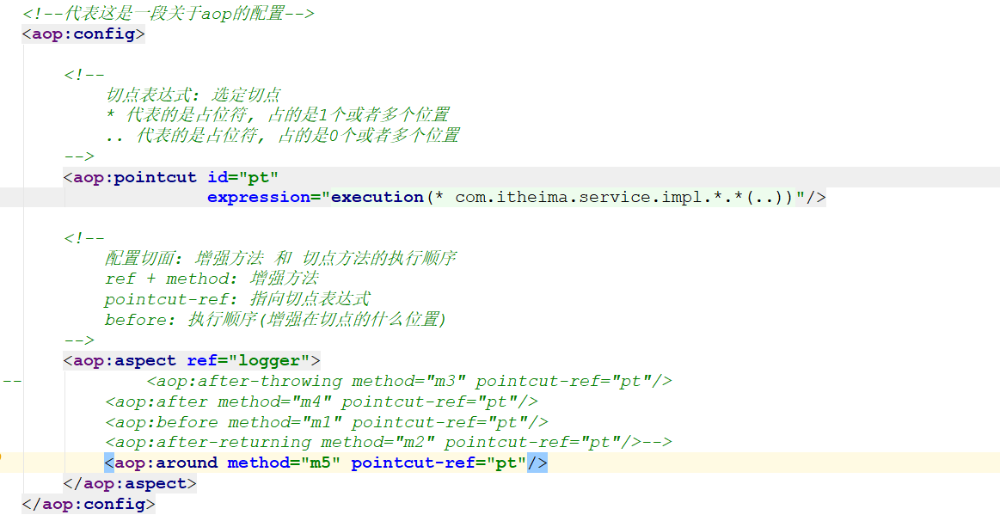

# 回顾

| xml配置                                               | 注解配置                                           | 说明                       |
| ----------------------------------------------------- | -------------------------------------------------- | -------------------------- |
| < bean id="" class="" >                               | @Component   @Controller   @Service    @Repository | bean的实例化               |
| < property name="" ref="">                            | @Autowired   @Qualifier                            | bean的对象属性注入         |
| < property name="" value="">                          | @Value                                             | bean的简单属性注入         |
| < bean scope="">                                      | @Scope                                             | 控制bean的作用范围         |
| < bean init-method="init" destroy-method="destory" /> | @PostConstruct @PreDestroy                         | bean创建之后和销毁之前调用 |

# 纯注解（重点）

>随着SpringBoot的兴起，纯注解方式也变得越来越重要，纯注解就是将xml中的所有配置项都使用注解替代。

## 纯注解使用

### 去掉xml中所有配置(略)


### 创建配置类

 

### 测试

 

### 提取properties配置文件

 

### 多配置类

 

### @Configuration声明配置类

 

## 纯注解总结

~~~markdown
@ComponentScan
	组件扫描注解。 相当于xml配置文件中的< context:component-scan base-package=""/> 

@Bean
	该注解只能写在方法上，表明使用此方法创建一个对象，并且放入spring容器。 

@PropertySource
	用于引入其它的properties配置文件

@Import
	在一个配置类中导入其它配置类的内容

@Configuration
	被此注解标注的类，会被Spring认为是配置类。Spring在启动的时候会自动扫描并加载所有配置类，然后将配置类中bean放入容器。
~~~

## 整合Junit

### 添加依赖

~~~xml
        <dependency>
            <groupId>org.springframework</groupId>
            <artifactId>spring-test</artifactId>
            <version>5.1.6.RELEASE</version>
        </dependency>
~~~

### 修改测试类

 


# 日志功能（理解）

>需求：在业务层类中的方法中打印日志，记录进入和离开以及发生异常的时间点

## 基本方式实现

### 创建模块，导入依赖

 

~~~xml
    <dependencies>
        <dependency>
            <groupId>org.springframework</groupId>
            <artifactId>spring-context</artifactId>
            <version>5.1.6.RELEASE</version>
        </dependency>
        <dependency>
            <groupId>junit</groupId>
            <artifactId>junit</artifactId>
            <version>4.13.2</version>
        </dependency>
        <dependency>
            <groupId>org.springframework</groupId>
            <artifactId>spring-test</artifactId>
            <version>5.1.6.RELEASE</version>
        </dependency>
    </dependencies>

~~~

### 编写业务层接口和实现类

 

### 创建日志类

 

### 注解扫描

 

### 日志功能添加

 

### 测试

 

## jdk动态代理

>目标对象  + 增强逻辑  =  代理对象

 

### 复制工程

 

### 准备目标对象

 

### 准备增强对象

 

### 创建代理对象

~~~java
package com.itheima.test;

import com.itheima.config.SpringConfig;
import com.itheima.log.Logger;
import com.itheima.service.AccountService;
import org.junit.Test;
import org.junit.runner.RunWith;
import org.springframework.beans.factory.annotation.Autowired;
import org.springframework.test.context.ContextConfiguration;
import org.springframework.test.context.junit4.SpringJUnit4ClassRunner;

import java.lang.reflect.InvocationHandler;
import java.lang.reflect.Method;
import java.lang.reflect.Proxy;

@RunWith(SpringJUnit4ClassRunner.class)
@ContextConfiguration(classes = SpringConfig.class)
public class AccountServiceTest {

    @Autowired
    private AccountService accountService;

    @Autowired
    private Logger logger;

    @Test
    public void testSave() {

        //1. accountService其实就是目标对象

        //2. 编写增强逻辑
        InvocationHandler invocationHandler = new InvocationHandler() {
            public Object invoke(Object proxy, Method method, Object[] args) throws Throwable {
                Object obj = null;

                logger.m1();

                try {
                    //代表的就是目标对象的方法
                    obj = method.invoke(accountService, args);
                } catch (Exception e) {
                    logger.m3();
                }

                logger.m2();

                return obj;
            }
        };

        //3. 创建代理对象
        AccountService proxyInstance = (AccountService) Proxy.newProxyInstance(
                accountService.getClass().getClassLoader(),
                accountService.getClass().getInterfaces(),
                invocationHandler
        );

        //4. 调用代理对象的方法
        proxyInstance.save();
    }
}
~~~


## cglib动态代理（了解）

 

### 复制工程(略)

 

### 删除接口

### 使用cglib创建代理对象

~~~java
package com.itheima.test;

import com.itheima.config.SpringConfig;
import com.itheima.log.Logger;
import com.itheima.service.impl.AccountServiceImpl;
import org.junit.Test;
import org.junit.runner.RunWith;
import org.springframework.beans.factory.annotation.Autowired;
import org.springframework.cglib.proxy.Enhancer;
import org.springframework.cglib.proxy.InvocationHandler;
import org.springframework.test.context.ContextConfiguration;
import org.springframework.test.context.junit4.SpringJUnit4ClassRunner;

import java.lang.reflect.Method;
import java.lang.reflect.Proxy;

@RunWith(SpringJUnit4ClassRunner.class)
@ContextConfiguration(classes = SpringConfig.class)
public class AccountServiceTest {

    @Autowired
    private AccountServiceImpl accountService;

    @Autowired
    private Logger logger;

    @Test
    public void testSave() {

        //1. accountService其实就是目标对象

        //2. 编写增强逻辑
        InvocationHandler invocationHandler = new InvocationHandler() {
            public Object invoke(Object proxy, Method method, Object[] args) throws Throwable {
                Object obj = null;

                logger.m1();

                try {
                    //代表的就是目标对象的方法
                    obj = method.invoke(accountService, args);
                } catch (Exception e) {
                    logger.m3();
                }

                logger.m2();

                return obj;
            }
        };

        //3. 创建代理对象
        //3-1 创建一个增强器
        Enhancer enhancer = new Enhancer();

        //3-2 设置从哪个类进行代理
        enhancer.setSuperclass(AccountServiceImpl.class);

        //3-3 设置增强逻辑
        enhancer.setCallback(invocationHandler);

        //3-4  创建代理对象
        AccountServiceImpl proxyInstance = (AccountServiceImpl) enhancer.create();


        //4. 调用代理对象的方法
        proxyInstance.save();
        proxyInstance.find();
    }
}
~~~


## 代理方式的选择

>首先明确在创建代理实现类时，jdk的速度要高于cglib，所以选择的时候:
>
>- 当被代理类有接口的时候，使用jdk动态代理，因为它的效率高
>- 当被代理类没有接口的时候，使用cglib动态代理，因为没办法


## 总结（重要）


>当核心业务（保存）和增强业务（日志）同时出现时，我们可以在开发时对他们分别开发，运行时再组装在一起（使用动态代理的方式）。
>
>这样做的好处是：
>
>1. 逻辑清晰：开发核心业务的时候，不必关注增强业务的代码
>2. 代码复用性高：增强代码不用重复书写
>
>这就是一种 AOP ( 面向切面编程 ) 的思想，它的目的就是在不修改源代码的基础上，对原有功能进行增强。
>
>我的总结: ==开发阶段分别开发,运行阶段组装运行==

 


# AOP入门（重点）

## 概念

AOP( 面向切面编程 )是一种思想，它的目的就是在不修改源代码的基础上，对原有功能进行增强。

SpringAOP是对AOP思想的一种实现，Spring底层同时支持jdk和cglib动态代理。

Spring会根据被代理的类是否有接口自动选择代理方式：

- 如果有接口，就采用jdk动态代理(当然，也可以强制使用cglib)
- 没有接口就采用cglib的方式

## 术语

~~~markdown
* 目标对象
	被代理的对象

* 连接点
	目标对象中得所有方法

* 切入点
	目标对象中得要进行功能增强那部分方法

* 增强(通知)
	一个具体增强功能(增强对象  增强方法)
	
* 织入
	将增强方法跟切点方法拼接起来动作
	
* 代理对象
	功能增强之后的对象

* 切面 (切点 +  增强)
	切面是一种描述,描述的是: 哪个增强方法   加入到了  哪个切点  的   什么位置
	增强方法和切点方法的执行顺序
~~~

 

## 入门案例

>使用SpringAop完成在业务层类中的方法上打印日志 

### 创建模块,导入依赖

 

```xml
<dependencies>
    <dependency>
        <groupId>org.springframework</groupId>
        <artifactId>spring-context</artifactId>
        <version>5.1.6.RELEASE</version>
    </dependency>

    <!--切点表达式解析坐标-->
    <dependency>
        <groupId>org.aspectj</groupId>
        <artifactId>aspectjweaver</artifactId>
        <version>1.8.7</version>
    </dependency>

    <dependency>
        <groupId>junit</groupId>
        <artifactId>junit</artifactId>
        <version>4.13.2</version>
    </dependency>
    <dependency>
        <groupId>org.springframework</groupId>
        <artifactId>spring-test</artifactId>
        <version>5.1.6.RELEASE</version>
    </dependency>
</dependencies>
```

### 创建业务层接口和实现类

 

### 创建日志类

 

### 添加配置文件

 

### 测试

 


## 配置解释

### 切点表达式

> 切点表达式的作用:  定义一组规则, 用于在连接点中挑选切点

  

### 四大通知(了解)

>四大通知描述的就是增强方法在切点方法的什么位置上执行
>
>~~~markdown
>- 前置通知(before) ：增强方法在切点运行之前执行
>- 后置通知(after-returning)：增强方法在切点正常运行结束之后执行
>- 异常通知(after-throwing)：增强方法在切点发生异常的时候执行
>- 最终通知(after)：增强方法在切点的最终执行
>~~~
>
>~~~java
>try{
>    //前置通知(before) ：增强方法在切点运行之前执行
>    
>    //切点执行位置
>    
>    //后置通知(after-returning)：增强方法在切点正常运行结束之后执行
>    
>}catch(Execption e){
>    //异常通知(after-throwing)：增强方法在切点发生异常的时候执行 
>}finally{
>    //最终通知(after)：增强方法在切点的最终执行
>}
>~~~

**①  准备四个增强方法**

 

**② 配置四大通知**

 

**③ 测试**

 

>==如果需要同时使用四大通知, 注意它的顺序会受到配置文件中配置顺序影响; 此时我们不推荐使用四大通知了, 而改用环绕通知==


### 环绕通知(掌握)

> 它是一种特殊的通知，他允许以编码的形式实现四大通知

**① 修改增强**

 

**② 修改配置文件**

 

**③ 测试(略)**


>1. 纯注解
>
>2. 动态代理( 理解  )
>
>3. aop案例
>
>   