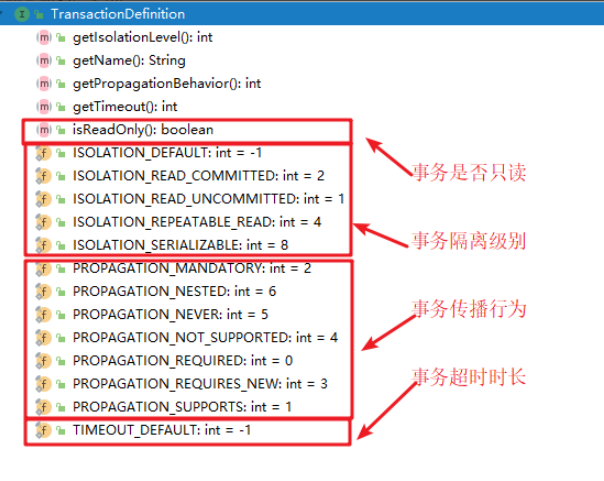

# AOP注解
    配置类 
    @EnableAspectJAutoProxy //激活面自动代理
```java
@ComponentScan("com.itmhw")//扫描组件
@EnableAspectJAutoProxy //激活面自动代理
public class SpringConfig {
}
```
## 四大通知
```markdown
@Aspect //切面
@Pointcut("execution(* com.itmhw.service.impl.*.*(..))")//切点
@Before("切点方法名")//切点方法前执行
@AfterReturning("切点方法名")//切点方法执行完执行
@AfterThrowing("切点方法名")//切点方法异常时执行
@After("切点方法名")//切点方法无论如何都都执行
```
```java
@Component //将改类放入容器中
@Aspect //切面
public class Logger {

    @Pointcut("execution(* com.itmhw.service.impl.*.*(..))")
    public void pt(){}
    //四大通知
    @Before("pt()")
    public void init(){
        System.out.println("正在创建"+new Date().toLocaleString());
    }

    @AfterReturning("pt()")
    public void destroy(){
        System.out.println("对象正在销毁"+new Date().toLocaleString());
    }

    @AfterThrowing("pt()")
    public void ex(){
        System.out.println("发生异常了"+new Date().toLocaleString());

    }
    @After("pt()")
    public void Finally(){
        System.out.println("执意执行"+new Date().toLocaleString());
    }
}
```
## 环绕通知
    @Around("切点方法")
```java
   //环绕通知
    //ProceedingJoinPoint使用这个获取切点
    @Around("pt()")
    public void m5(ProceedingJoinPoint pjp){
        Object obj = null;
        try {
            init();
            //切点的执行位置
            obj = pjp.proceed();
            //int a = 1/0;
            destroy();
            //Throwable是Exception的父类
        }catch (Throwable throwable) {
            throwable.printStackTrace();
            ex();
        } finally {
            Finally();
        }
    }
```
## 通过切点方法获取其他元素
```markdown
执行时间: new Date().toLocaleString());
类名:pjp.getTarget().getClass().getName());
方法名: MethodSignature methodSignature = (MethodSignature) pjp.getSignature();
       methodSignature.getMethod().getName());
参数: Arrays.toString(pjp.getArgs()));
```
# 事务
## 事务的管理方式
```markdown
Spring支持两种事务管理方式：编程式事务和声明式事务

- 编程式事务就是将业务代码和事务代码放在一起书写，它的耦合性太高，开发中不使用

- 声明式事务其实就是将事务代码和业务代码隔离开发，然后通过一段配置让他们组装运行，最后达到事务控制的目的

声明式事务就是通过AOP原理实现的
```
## API
### PlatformTransactionManager 

```markdown
PlatformTransactionManager这是Spring进行事务管理的一个根接口，我们要使用它的实现类做事务管理

我们需要知道的是:mybatis和jdbcTemplate都可以使用它的一个子类(DataSourceTransactionManager)做事务管理
```
### TransactionDefinition
    TransactionDefinition这个API是用来做事务定义的

### 隔离级别

### 传播行为
```markdown
事务传播行为指的就是当一个业务方法【被】另一个业务方法调用时，应该如何进行事务控制
//事务: 吃饭
同桌(){
你()
}

//你:
你(){
//必须
//支持
//必须是新的
//不支持
}
```

### 只读性

    只读事务(增 删  改不能使用,只能查询使用)
    换句话说,只读事务只能用于查询方法

### 超时时长

    事务超时时间, 此属性需要底层数据库的支持
    它的默认值是-1, 代表不限制

### TransactionStatus

    TransactionStatus代表的是事务的当前状态

## 三个API之间的关系

    PlatformTransactionManager通过读取TransactionDefinition中定义事务信息参数,来管理事务,
    管理之后会产生一些列的TransactionStatu

## 声明事务
```markdown
* 声明式事务的底层原理是aop

* 准备目标对象: AccountServiceImpl

* 准备增强对象: DataSourceTransactionManager
               这个事务管理器要工作,必须接收程序员传入的  TransactionDefinition

* 配置切面: 切点方法(目标对象)和增强方法(增强对象)执行顺序
```
### xml配置
    需要配置事务的类
```java
@Service
public class AccountServiceImpl implements AccountService {

    @Autowired
    private AccountDao accountDao;

    /**
     * 转账
     * @param accountName 转账人
     * @param targetName 收账人
     * @param amount 钱数
     */
    @Override
    //@Transactional//事务控制注解
    public void transfer(String accountName, String targetName, Float amount) {
        accountDao.diff(accountName,amount);
        //int a = 1/0;
        accountDao.add(targetName,amount);
    }
}
```
    配置增强方法
```xml
<tx:advice id="txAdvice" transaction-manager="transactionManager">
    <tx:attributes>
        <tx:method name="*"/>
    </tx:attributes>
</tx:advice>
```
```xml
<!--
        name="切点方法的名字"  支持模糊匹配
            匹配顺序是从上往下,一旦说匹配成功1个,就结束匹配
        isolation="DEFAULT" 事务隔离级别
        propagation="REQUIRED"  事务传播行为
        timeout="-1"  事务超时时间  -1代表永不超时
        read-only="false"  只读事务
        rollback-for="异常" 仅仅为哪一种异常回滚,其他异常的都不回滚 TransferEx
        no-rollback-for="异常" 除了哪种异常之外的异常才回滚  LogEx
    -->
    <tx:advice id="txAdvice" transaction-manager="transactionManager">
        <tx:attributes>
            <tx:method name="find*" read-only="true"/>
            <tx:method name="*"/>
        </tx:attributes>
    </tx:advice>
```
    配置切面
```xml
<!--配置事务的切面-->
    <aop:config>
        <aop:pointcut id="pt()" expression="execution(* com.itmhw.service.impl.*.*(..))"/>
        <!--
        这是一个特殊的配置切面，仅仅适用于声明式事务的配置
        advice-ref="增强方式" pointcut-ref="切点(不能更改的代码)"
        -->
        <aop:advisor advice-ref="txAdvice" pointcut-ref="pt()"></aop:advisor>
    </aop:config>
```
### 注解配置
    配置类中
```java
@ComponentScan("com.itmhw") //扫描组件
@EnableTransactionManagement //激活事务管理，相当于tx:annotation-driven
public class SpringConfig {
    /**
     * 数据库连接
     * @return
     */
    @Bean
    public DruidDataSource dataSource(){
        DruidDataSource druidDataSource = new DruidDataSource();
        druidDataSource.setDriverClassName("com.mysql.jdbc.Driver");
        druidDataSource.setUrl("jdbc:mysql://localhost:3306/db1");
        druidDataSource.setUsername("root");
        druidDataSource.setPassword("123");
        return druidDataSource;
    }

    /**
     * jdbcTemplate配置
     * @param dataSource 从spring容器中获取数据库连接
     * @return
     */
    @Bean
    public JdbcTemplate jdbcTemplate(DataSource dataSource){
        JdbcTemplate jdbcTemplate = new JdbcTemplate();
        jdbcTemplate.setDataSource(dataSource);
        return jdbcTemplate;
    }

    /**
     * 事务声明
     * @DataSourceTransactionManager 事务的方法从这个类中获取
     * @param dataSource 从spring容器中获取数据库连接
     * @return
     */
    @Bean
    public DataSourceTransactionManager transactionManager(DataSource dataSource){
        DataSourceTransactionManager transactionManager = new DataSourceTransactionManager();
        transactionManager.setDataSource(dataSource);
        return transactionManager;
    }
}
```
    目标对象(需要事务的类)
```java
//类名上书写，也可以不写类名的参数
@Transactional(
        isolation = Isolation.DEFAULT,
        propagation = Propagation.REQUIRED,
        readOnly = false,
        timeout = -1
)//事务控制注解, 代表所有方法上都有此注解; 如果方法上和类上都有, 方法上的优先级搞
```
```java

import com.itheima.dao.AccountDao;
import com.itheima.service.AccountService;
import org.springframework.beans.factory.annotation.Autowired;
import org.springframework.stereotype.Service;
import org.springframework.transaction.annotation.Isolation;
import org.springframework.transaction.annotation.Propagation;
import org.springframework.transaction.annotation.Transactional;

@Service
@Transactional(
        isolation = Isolation.DEFAULT,
        propagation = Propagation.REQUIRED,
        readOnly = false,
        timeout = -1
)//事务控制注解, 代表所有方法上都有此注解; 如果方法上和类上都有, 方法上的优先级搞
public class AccountServiceImpl implements AccountService {

    @Autowired
    private AccountDao accountDao;

    //@Transactional(readOnly = true)//事务控制注解
    public void transfer(String accountName, String targetName, Float amount) {
        //1. 原账户减钱
        accountDao.diff(accountName, amount);

        //中间代码
        int i = 1 / 0;

        //2. 目标账户加钱
        accountDao.add(targetName, amount);
    }

    void findById() {
        //1. 转账代码  TransferEx

        //2. 日志记录代码 LogEx
    }
}
```
    测试类
```java
@RunWith(SpringJUnit4ClassRunner.class)//spring的单元测试
//@ContextConfiguration("classpath:applicationContext.xml")
@ContextConfiguration(classes = SpringConfig.class)//扫描类配置
public class AccountServiceTest {
    @Autowired
    private AccountService accountService;

    @Test
    public void test() {
        accountService.transfer("B01", "B04", 100F);
    }
}
```