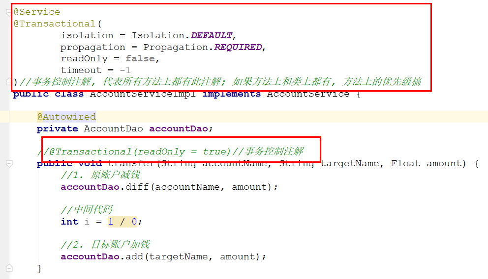
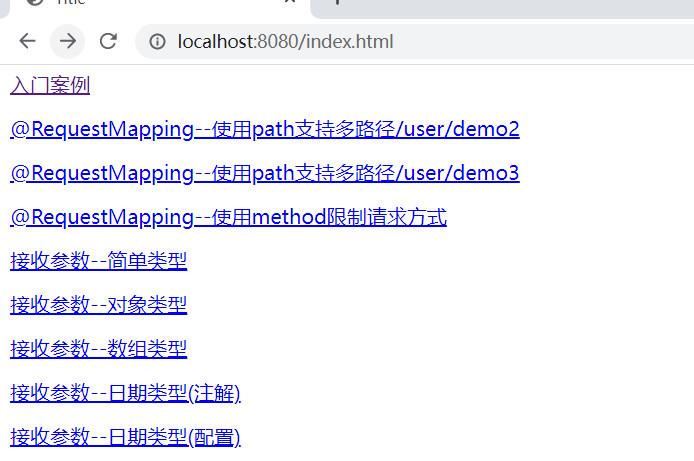

# 回顾

~~~markdown
1. IOC
	//将对象放入容器 
	@Service   @Component   @Repository   @Controller
	public class AccountServiceImpl  implements  AccountService(){
		@Value("${}")
		private String name;
		
		@Autowired
		@Qulifier("accountDao")
		private AccountDao accountDao;
	}
 	
 	@Bean
 	public AccountService create(){
 		return new AccountServiceImpl();
 	}

	@Import
	@Configrutaion

2. AOP
	一些共用功能:  日志   事务 
	7个术语
	实现:
		1. 找到目标对象
		2. 找到增强对象
		3. 配置切面(增强对象中得增强方法   会在   目标对象中得切点方法   什么位置)
	环绕通知(xml)
    	

~~~

# AOP注解版

## 四大通知(了解) 

### 修改配置文件

>1. 去掉了aop:config
>2. 添加了aop:aspectj-autoproxy

 

### 配置增强类

 

> ==同时使用注解版四大通知,执行顺序是有问题的,因此推荐使用环绕通知==

## 环绕通知(掌握) 

 

## 纯注解版

 

>模拟真实日志记录

~~~java
package com.itheima.log;

import org.aspectj.lang.ProceedingJoinPoint;
import org.aspectj.lang.annotation.*;
import org.aspectj.lang.reflect.MemberSignature;
import org.aspectj.lang.reflect.MethodSignature;
import org.springframework.stereotype.Component;

import java.util.Arrays;
import java.util.Date;

@Component
@Aspect//切面
public class Logger {

    //配置切点
    @Pointcut("execution(* com.itheima.service.impl.*.*(..))")
    public void pt() {
    }

    //执行时间  类  方法   参数  结果  异常
    //环绕通知
    @Around("pt()")
    public Object m5(ProceedingJoinPoint pjp) {//pjp切点方法
        Object obj = null;

        System.out.println("执行时间:" + new Date().toLocaleString());
        System.out.println("类名:" + pjp.getTarget().getClass().getName());
        MethodSignature methodSignature = (MethodSignature) pjp.getSignature();
        System.out.println("方法名:" + methodSignature.getMethod().getName());

        System.out.println("参数:" + Arrays.toString(pjp.getArgs()));
        try {

            //切点执行位置
            obj = pjp.proceed();

            System.out.println("结果:" + obj);
        } catch (Throwable e) {
            System.out.println("异常信息:" + e.getMessage());
            throw new RuntimeException(e);
        } finally {
            return obj;
        }
    }

}
~~~

# 转账案例

## 思路分析

  

## 创建模块，导入依赖

  

~~~xml
    <dependencies>
        <dependency>
            <groupId>mysql</groupId>
            <artifactId>mysql-connector-java</artifactId>
            <version>5.1.47</version>
        </dependency>
        <dependency>
            <groupId>com.alibaba</groupId>
            <artifactId>druid</artifactId>
            <version>1.1.15</version>
        </dependency>
        <dependency>
            <groupId>org.springframework</groupId>
            <artifactId>spring-jdbc</artifactId>
            <version>5.1.6.RELEASE</version>
        </dependency>
        <dependency>
            <groupId>org.springframework</groupId>
            <artifactId>spring-context</artifactId>
            <version>5.1.6.RELEASE</version>
        </dependency>
        <dependency>
            <groupId>junit</groupId>
            <artifactId>junit</artifactId>
            <version>4.12</version>
        </dependency>
        <dependency>
            <groupId>org.springframework</groupId>
            <artifactId>spring-test</artifactId>
            <version>5.1.6.RELEASE</version>
        </dependency>
        <dependency>
            <groupId>org.projectlombok</groupId>
            <artifactId>lombok</artifactId>
            <version>1.18.22</version>
        </dependency>
        <dependency>
            <groupId>org.aspectj</groupId>
            <artifactId>aspectjweaver</artifactId>
            <version>1.8.7</version>
        </dependency>
    </dependencies>
~~~

## 创建实体类

  

## 创建dao接口

  

## 创建dao实现类

 

## 创建service接口

  

## 创建service实现类

 

## 加入Spring的配置

~~~xml
<?xml version="1.0" encoding="UTF-8"?>
<beans xmlns="http://www.springframework.org/schema/beans"
       xmlns:xsi="http://www.w3.org/2001/XMLSchema-instance"
       xmlns:context="http://www.springframework.org/schema/context"
       xmlns:aop="http://www.springframework.org/schema/aop"
       xmlns:tx="http://www.springframework.org/schema/tx"
       xsi:schemaLocation="http://www.springframework.org/schema/beans
			    http://www.springframework.org/schema/beans/spring-beans.xsd
			    http://www.springframework.org/schema/context
			    http://www.springframework.org/schema/context/spring-context.xsd
			    http://www.springframework.org/schema/tx
			    http://www.springframework.org/schema/tx/spring-tx.xsd
                http://www.springframework.org/schema/aop
                https://www.springframework.org/schema/aop/spring-aop.xsd">

    <!--注解扫描-->
    <context:component-scan base-package="com.itheima"></context:component-scan>

    <!--数据源-->
    <bean id="dataSource" class="com.alibaba.druid.pool.DruidDataSource">
        <property name="driverClassName" value="com.mysql.jdbc.Driver"></property>
        <property name="url" value="jdbc:mysql:///spring"></property>
        <property name="username" value="root"></property>
        <property name="password" value="root"></property>
    </bean>

    <!--jdbcTemplate-->
    <bean id="jdbcTemplate" class="org.springframework.jdbc.core.JdbcTemplate">
        <property name="dataSource" ref="dataSource"/>
    </bean>
</beans>

~~~

## 测试

 

# Spring事务

## 事务管理方式

Spring支持两种事务管理方式：编程式事务和声明式事务

- 编程式事务就是将业务代码和事务代码放在一起书写，它的耦合性太高，开发中不使用

- 声明式事务其实就是将事务代码和业务代码隔离开发，然后通过一段配置让他们组装运行，最后达到事务控制的目的

声明式事务就是通过AOP原理实现的

## API(了解)

### PlatformTransactionManager

 

PlatformTransactionManager这是Spring进行事务管理的一个根接口，我们要使用它的实现类做事务管理

我们需要知道的是:mybatis和jdbcTemplate都可以使用它的一个子类(DataSourceTransactionManager)做事务管理

### TransactionDefinition

TransactionDefinition这个API是用来做事务定义的

 

#### 隔离级别

 

#### 传播行为

事务传播行为指的就是当一个业务方法【被】另一个业务方法调用时，应该如何进行事务控制 

~~~java
a(){
    b();
}

//a--->b 事务状态传递给b
b(){
    //必须 
}

//事务: 吃饭
同桌(){
    你()
}

//你: 
你(){
    //必须
    //支持
    //必须是新的
    //不支持
}

~~~

 

#### 只读性

只读事务(增 删  改不能使用,只能查询使用)

换句话说,只读事务只能用于查询方法

#### 超时时长

事务超时时间, 此属性需要底层数据库的支持

它的默认值是-1, 代表不限制

### TransactionStatus

TransactionStatus代表的是事务的当前状态

### 三个API之间的关系

PlatformTransactionManager通过读取TransactionDefinition中定义事务信息参数,来管理事务,

管理之后会产生一些列的TransactionStatus

# 声明式事务

## 思路

~~~markdown
* 声明式事务的底层原理是aop

* 准备目标对象: AccountServiceImpl

* 准备增强对象: DataSourceTransactionManager
               这个事务管理器要工作,必须接收程序员传入的  TransactionDefinition

* 配置切面: 切点方法(目标对象)和增强方法(增强对象)执行顺序
~~~

## xml版(重点)

### 准备目标对象

 

### 配置增强对象

 

### 配置切面

 

### 测试

 

### 事务参数说明

 

## 注解版(重点) 

### 复制工程

 

### 配置文件

>1. 删除tx:advice
>2. 删除aop:config
>3. 添加事务注解驱动

 

### 注解控制事务

 

## 纯注解版

 

 

>==aop面试题==
>
>1. aop使用场景: 日志  性能检测  事务
>2. 出场景: aop
>3. Spring的两个核心

# SpringMVC

## 介绍

SpringMVC将Servlet一些通用功能进行了抽取和封装，使用它之后，代码主要有两部分组成：

- 前端控制器：由SpringMVC提供，主要负责接收参数和返回页面和数据
- 处理器：由程序员编写，主要负责参数的处理和业务层调用

 

## 入门案例

>发送一个请求`name=张三&age=18`，后台接收参数，封装一个`User对象返回json数据`

 

### 创建web工程

 

~~~xml
    <dependencies>
        <!--springmvc核心-->
        <dependency>
            <groupId>org.springframework</groupId>
            <artifactId>spring-webmvc</artifactId>
            <version>5.1.6.RELEASE</version>
        </dependency>
        <!--jackson-->
        <dependency>
            <groupId>com.fasterxml.jackson.core</groupId>
            <artifactId>jackson-databind</artifactId>
            <version>2.9.10</version>
        </dependency>
        <!--lombok-->
        <dependency>
            <groupId>org.projectlombok</groupId>
            <artifactId>lombok</artifactId>
            <version>1.18.22</version>
        </dependency>
    </dependencies>
~~~

### 加入配置文件

>此配置文件是给前端控制器用的DispatcherServlet

 

### 配置前端控制器

>web.xml最终是由tomcat读取

 

### 创建实体类 

 

### 创建处理器 

 

### 部署项目 

 

## 执行流程说明

 

## 释放指定资源

>现在SpringMVC的前端控制器拦截路径是/，在目前项目中，代表拦截所有请求，然后按照请求路径去Controller中寻找方法
>
>但是对应一些静态文件，比如js、html、css、jpg等等，是不需要寻找对应方法的，而是应该直接寻找对应的资源位置即可，
>
>所以我们要在SpringMVC中添加配置项，将不需要寻找方法的资源路径通知给它。

### 导入页面资源

 

### 修改配置文件

 

### 页面访问

  

## @RequestMapping

>@RequestMapping注解用于建立请求URL和处理方法之间的对应关系, 常见属性如下:
>
>*	value：    等同于path，用于为当前方法绑定访问路径
>*	method：用于限制请求类型，如果省略此选项，代表不对请求类型做限制
>
>注意：此注解可以标注在方法上，也可以标注在类上，标注在类上代表类中的所有方法都可以共用一段URL

  

 

>==400报错: 请求参数有问题==
>
>

>==500:服务器错误, 目前这个错误由于两个方法绑定了同一访问路径导致==
>
>

>==405: 请求方式跟服务器的接收方式不匹配==
>
> 

>==练习顺序:==
>
>1. springmvc(2遍)
>
>2. springaop注解
>
>3. 声明式事务(1. 会配置   2. 面试:隔离级别和传播行为)
>
>4. 常见响应状态
>
>   200: 成功
>
>   302: 重定向
>
>   304: 从浏览器缓存读取数据
>
>   400: 请求参数有问题
>
>   401: 未登录
>
>   403: 登录了,但权限不足
>
>   404: 访问资源路径不存在
>
>   405: 请求方式错误
>
>   500: 服务器错误