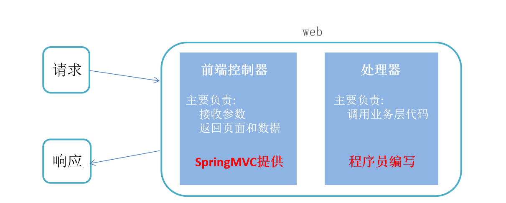
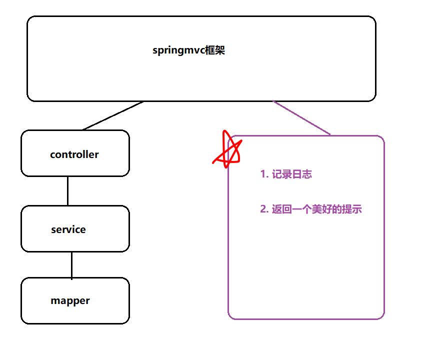
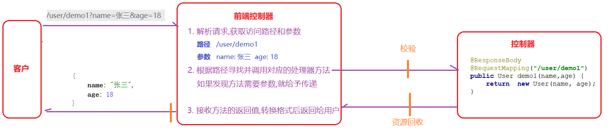

# SpringMVC接收请求参数的方式
```markdown
SpringMVC将Servlet一些通用功能进行了抽取和封装，使用它之后，代码主要有两部分组成：

- 前端控制器：由SpringMVC提供，主要负责接收参数和返回页面和数据
- 处理器：由程序员编写，主要负责参数的处理和业务层调用
```

```markdown
@Controller
@RequestMapping("/user")//前端传值的路径
@ResponseBody//改形式写到类名上的时候，相当于为每个方法添加一个这样的属性，将返回的类型转为json数据
```
```markdown
将上述三个注解写入controller层的类上
@Controller可以和@ResponseBody和起来使用为@RestController
```
## 简单类型
```markdown
请求在经过前端控制器也就是servlet的时候，spring会自动获取get请求参数，通过名字相同将值赋值给处理器
在SpringMvc框架的底层,对于一些简单的类型参数,存在类型转换机制
```
    前端数据
```html
<a href="/user/demo5?name=张三&age=18">接收参数--简单类型</a><br>
```
    Controller层
```java
    //接收参数-简单类型
    @RequestMapping("/demo5")
    public String demo5(String name,Integer age){
        System.out.println("name=" + name + ",age="+age);
        return "ok";
    }
```
## 对象类型
```markdown
请求在经过前端控制器也就是servlet的时候，spring会自动获取get请求参数，通过名字相同将值赋值给处理器
```
    前端界面
```html
<a href="/user/demo6?name=张三&age=18">接收参数--对象类型</a><br>
```
    Controller层
```java
//接收参数-对象类型
    @RequestMapping("/demo6")
    public String demo6(User user){
        System.out.println("user = " + user);
        return "ok";
    }
```
## 数组类型
```markdown
请求在经过前端控制器也就是servlet的时候，spring会自动获取get请求参数，通过名字相同将值赋值给处理器
如果前台提交的参数中存在键一样的情况[names=张三&names=李四],后台接收时:
    如果使用字符串接收,会得到一个使用分割的字符串   demo7(String names)--->张三,李四 
    如果使用数组接收,会得到一个数组 demo7(String[] names)   ---->[张三, 李四]
```
    前端界面
```html
<a href="/user/demo7?names=张三&names=李四">接收参数--数组类型</a><br>
```
    Controller层
```java
//接收参数-数组类型
    @RequestMapping("/demo7")
    public String demo7(String[] names){
        System.out.println("names = " + Arrays.toString(names));
        return "ok";
    }
```
## 日期类型
```markdown
请求在经过前端控制器也就是servlet的时候，spring会自动获取get请求参数，通过名字相同将值赋值给处理器
```
```markdown
@DateTimeFormat(pattern ="转换规则")：在参数前面添加，如果是实体类(User)的话，可以在实体类的的成员变量前面添加
```
    前端界面
```html
<!--注解-->
<a href="/user/demo8?myDate=2019-10-10">接收参数--日期类型(注解)</a><br>
```
    Controller层
```java
//接收参数-日期类型
    @RequestMapping("/demo8")
    public String demo8(@DateTimeFormat(pattern ="yyyy-mm-dd") Date myDate){
        System.out.println("date = " + myDate);
        return "ok";
    }
```
```html
<!--配置-->
<a href="/user/demo9?myDate=2019-10-10">接收参数--日期类型(配置)</a><br>
```
    配置转换器
```xml
<!--类型转换器-->
<bean id="conversionService2" class="org.springframework.context.support.ConversionServiceFactoryBean">
    <property name="converters">
        <set>
            <bean class="com.itheima.converter.DateConverter"></bean>
        </set>
    </property>
</bean>
```
    转换器的转换方法
```java
package com.itheima.converter;

import org.springframework.core.convert.converter.Converter;

import java.text.ParseException;
import java.text.SimpleDateFormat;
import java.util.Date;

//自定义类型转换器必须实现Converter<原始类型, 目标类型>,并在转换方法中实现转换逻辑
public class DateConverter implements Converter<String, Date> {

    public Date convert(String s) {
        try {
            return new SimpleDateFormat("yyyy-MM-dd").parse(s);
        } catch (ParseException e) {
            e.printStackTrace();
            throw new RuntimeException(e);
        }
    }
}
```
    Controller层
```java
//接收参数--日期类型
//配置:1 自定义一个类型转换器类,完成转换方法  2. 转换器的类交给Springmvc
    @RequestMapping("/demo9")
    //@ResponseBody
    public String demo9(Date myDate) {
        System.out.println(myDate);
        return "ok";
    }
```
## 文件类型
```markdown
在方法形参中直接接收MultipartFile类型的文件
细节1: 接收参数类型必须是MultipartFile
细节2: 参数的名称必须跟前端表单中文件上传框name一致
```
    前端界面
```html
<form action="/user/demo10" method="post" enctype="multipart/form-data">
    <input type="file" name="picture">
    <input type="submit" value="文件上传">
</form>
```
    Controller层
```java
    //在方法形参中直接接收MultipartFile类型的文件
    //细节1: 接收参数类型必须是MultipartFile
    //细节2: 参数的名称必须跟前端表单中文件上传框name一致
    @RequestMapping("/demo10")
    public String demo10(MultipartFile picture) throws IOException {
        System.out.println(picture);
        //接收到文件之后, 保存到目录下
        //1. 设置文件名(唯一)
        //UUID.randomUUID().toString()  生成唯一字符串
        String fileName = UUID.randomUUID().toString() + picture.getOriginalFilename();

        //2. 设置新文件
        File file = new File("D:/upload/" + fileName);

        //3. 上传
        picture.transferTo(file);

        return "ok";
    }
```
## 集合类型
```markdown
请求在经过前端控制器也就是servlet的时候，spring会自动获取get请求参数，通过名字相同将值赋值给处理器
```
    前端界面
```html
<form action="/user/demo11" method="post">
    抽烟:<input type="checkbox" name="hobby" value="smoke">
    喝酒:<input type="checkbox" name="hobby" value="喝酒">
    烫头:<input type="checkbox" name="hobby" value="烫头">
    <input type="submit" value="提交爱好列表">
</form>
```
    Controller层
```java
//方式一：可以采用数组来书写
//方式二：可以采用对象来接收，但需要在对象中书写一个集合，将前端的集合内容复制给对象，写法和对象的获取相同
//方式三：可以采用@RequestParam
//@RequestParam使用场景三：用于接收一个list集合
@RequestMapping("/demo11")
public String demo11(@RequestParam("hobby") List<String> hobby){
        System.out.println("hobby = " + hobby);
        return "ok";
        }
```
## @RequestParam
```markdown
使用场景一：标注在形参之前，用于指定当前参数要接收前端哪个变量的值
使用场景二：标注在形参之前，用于给当前参数设置默认值 使用defaultValue属性来赋值
使用场景三：用于接收一个list集合(必须和前端name的值相同)
```
    前端界面
```html
<a href="/user/demo12?usERName=张三&password=">@RequestParam的其他使用场景</a><br>
```
    Controller层
```java
@RequestMapping("/demo12")
    public String demo12(@RequestParam("usERName") String username,@RequestParam(defaultValue = "1234") String password){
        System.out.println("usERName = " + username+".password="+password);
        return "ok";
    }
```
## Ajax提交参数
1. 获取地址栏中的参数(没有请求体)
```markdown
这个不看前端的提交方式，获取方式跟获取get方法的方法一样
请求在经过前端控制器也就是servlet的时候，spring会自动获取get请求参数，通过名字相同将值赋值给处理器
```
    前端界面
```html
<!--获取地址栏中的参数(没有请求体)-->
<button onclick="submitURL()">ajax请求--获取地址栏中的参数</button>
<script>
    function submitURL() {
        axios.get("/user/demo13?name=张三&age=18").then(resp => {
            console.log(resp.data);
        });

        // axios.get("/user/demo13",{
        //     params:{
        //         name:"李四",
        //         age: 19
        //     }
        // }).then(resp => {
        //     console.log(resp.data);
        // });

        // axios.post("/user/demo13?name=王五&age=20").then(resp => {
        //     console.log(resp.data);
        // });
    }
</script>
```
    Controller层
```java
@RequestMapping("/demo13")
    public String demo13(String name,Integer age){
        String names = "name=" + name + ",age=" + age;
        System.out.println(names);
        return names;
    }
```
2. 获取请求体中的参数(有请求体)
```markdown
@RequestBody 放在参数前面，而且要求这个参数必须是对象类型或者是一个map集合
作用域接收将请求体json数据转换成指定的java代码
```
    前端界面
```html
<script>
    /*注意: 只有post请求有请求体,get请求是没有请求体的*/
    function submitBody() {
        axios.post("/user/demo14", {name: "赵六", age: "21"}).then(resp => {
            console.log(resp.data);
        })
    }
</script>
```
    Controller层
```java
/*@RequestMapping("/demo14")
    public String demo14(@RequestBody User user){
        System.out.println("user = " + user);
        return "ok";
    }*/
    @RequestMapping("/demo14")
    public String demo14(@RequestBody Map<String,Object> map){
        System.out.println("map = " + map);
        return "ok";
    }
```
# 统一异常处理
```markdown
使用Spring框架后，异常就不必在三层代码去处理了，而是直接抛给框架，框架会将所有的异常统一转交给我们自定义的统一异常处理类来处理。

SpringMVC支持下面两个注解来实现全局异常处理

    @ControllerAdvice  标注在类上，声明当前类是一个用于专门处理异常的类

    @ExceptionHandler 标注在方法上，声明当前方法可以处理哪些异常
```

    前端界面
```html
<a href="/user/demo15?type=1">空指针异常模拟</a><br>

<a href="/user/demo15?type=2">数学异常模拟</a><br>
```
    Controller层
```java
@RequestMapping("/demo15")
    //@Test
    public void demo15(Integer type){
        if (1 == type){
            String a = null;
            a.length();
        }else if (2 == type){
            int a=1/0;

        }else{
            String[] array = new String[2];
            System.out.println(array[10]);
        }

    }
```
    异常解决类
    @ControllerAdvice //此注解标注在类上,用于声明这是一个全局异常处理类
    @ExceptionHandler(value = 那种异常.class)//此注解用于指定当前方法可以处理的异常类型
```java
package com.itheima.handler;

import org.springframework.web.bind.annotation.ControllerAdvice;
import org.springframework.web.bind.annotation.ExceptionHandler;
import org.springframework.web.bind.annotation.ResponseBody;

@ControllerAdvice //此注解标注在类上,用于声明这是一个全局异常处理类
@ResponseBody
public class CommonExceptionHandler {

    //处理异常的方法
    @ExceptionHandler(value = Exception.class)//此注解用于指定当前方法可以处理的异常类型
    public String handlerException(Exception e) {
        //1. 记录异常信息
        e.printStackTrace();

        //2. 返回错误提示
        return "NETWORK ERROR";
    }

    //处理异常的方法
    @ExceptionHandler(value = NullPointerException.class)
    public String handlerNullPointerException(Exception e) {
        //1. 记录异常信息
        System.out.println("给张三发个邮件");

        //2. 返回错误提示
        return "NETWORK ERROR";
    }

    //处理异常的方法
    @ExceptionHandler(value = ArithmeticException.class)
    public String handlerArithmeticException(Exception e) {
        //1. 记录异常信息
        System.out.println("给李四发个邮件");

        //2. 返回错误提示
        return "NETWORK ERROR";
    }
}
```
# 拦截器
```markdown
拦截器是Spring提供的一种技术，它的功能似于过滤器，它会在进入controller之前，离开controller之后以及响应离开服务时进行拦截。
拦截器要实现HandlerInterceptor接口，选择性重写三个方法，其中preHandle()方法必须实现
```


    拦截器maven配置
```xml
<!--servlet-->
        <dependency>
            <groupId>javax.servlet</groupId>
            <artifactId>javax.servlet-api</artifactId>
            <version>3.0.1</version>
        </dependency>
```
## 自定义拦截器
### 写拦截器类
```java
package com.itmhw.interceptor;

import org.springframework.web.servlet.HandlerInterceptor;
import org.springframework.web.servlet.ModelAndView;

import javax.servlet.http.HttpServletRequest;
import javax.servlet.http.HttpServletResponse;
import java.util.Map;

public class MyInterceptor1 implements HandlerInterceptor {
    @Override
    public boolean preHandle(HttpServletRequest request, HttpServletResponse response, Object handler) throws Exception {
        request.setCharacterEncoding("utf-8");
        response.setContentType("text/html;charset=utf-8");
        Map<String, String[]> parameterMap = request.getParameterMap();
        System.out.println(parameterMap);
        System.out.println("进入Controller之前");
        //此返回值用于控制请求是否放行 true放行 false禁止通行
        return true;
    }

    @Override
    public void postHandle(HttpServletRequest request, HttpServletResponse response, Object handler, ModelAndView modelAndView) throws Exception {
        System.out.println("离开Controller之后");
    }

    @Override
    public void afterCompletion(HttpServletRequest request, HttpServletResponse response, Object handler, Exception ex) throws Exception {
        System.out.println("请求即将离前端控制器1");
    }
}
```
### 写拦截器配置
```xml
    <!--配置拦截器-->
<mvc:interceptors>
    <!--1个拦截器-->
    <mvc:interceptor>
        <!--设置拦截请求路径-->
        <mvc:mapping path="/**"/>
        <!--设置不拦截路径-->
        <mvc:exclude-mapping path="/user/demo16"/>
        <!--拦截主的请求交给哪个拦截器处理-->
        <bean class="com.itheima.interceptor.MyInterceptor1"></bean>
    </mvc:interceptor>
</mvc:interceptors>
```
### 前端界面
```html
<a href="/user/demo16?name=张三">拦截器模拟</a><br>
```
### 测试
```java
@RequestMapping("/demo16")
    public String demo16(String name){
        System.out.println("name = " + name);
        return "ok";
    }
```
## 自定义拦截器链
### 再写一个拦截器
```java
package com.itheima.interceptor;

import org.springframework.web.servlet.HandlerInterceptor;
import org.springframework.web.servlet.ModelAndView;

//自定义的拦截器必须实现HandlerInterceptor接口
public class MyInterceptor2 implements HandlerInterceptor {
    public boolean preHandle(javax.servlet.http.HttpServletRequest request, javax.servlet.http.HttpServletResponse response, Object handler) throws Exception {
        System.out.println("进入到Controller之前2");

        //此返回值用于控制请求是否放行  true放行  false禁止通行
        return true;
    }

    public void postHandle(javax.servlet.http.HttpServletRequest request, javax.servlet.http.HttpServletResponse response, Object handler, ModelAndView modelAndView) throws Exception {
        System.out.println("离开Controller之后2");

    }

    public void afterCompletion(javax.servlet.http.HttpServletRequest request, javax.servlet.http.HttpServletResponse response, Object handler, Exception ex) throws Exception {
        System.out.println("请求即将离开服务器2");
    }
}
```
### 再写拦截器配置文件
    注意：注册的顺序代表了拦截器执行的顺序
```xml
<!--配置拦截器:注意这里注册的顺序就代表拦截器执行的顺序-->
    <mvc:interceptors>
        <mvc:interceptor>
            <mvc:mapping path="/user/demo16"/>
            <bean class="com.itheima.interceptor.MyInterceptor2"></bean>
        </mvc:interceptor>

        <mvc:interceptor>
            <mvc:mapping path="/user/demo16"/>
            <bean class="com.itheima.interceptor.MyInterceptor1"></bean>
        </mvc:interceptor>
    </mvc:interceptors>
```
# Restful
## 介绍
```markdown
REST是一种软件架构风格，其强调HTTP应当以资源为中心[==在请求地址中尽量的不要出现动词==]。

REST规范了HTTP请求动作，使用四个词语分别表示对资源的CRUD操作:  GET(获取)、POST(新建)、PUT(更新)、DELETE(删除) 

注意的是使用该架构必须要和前端商量，这个路劲不能随便书写，不然会导致获取不到值
```
| |原来|Restful|
| :----: | :----: | :----:|
|保存|/saveUser|post方式    /user|
|修改|/updateUser?id=1p|put方式     /user/id/1|
|删除|/deleteUser?id=1|delete方式  /user/1|
|查询所有|/findAllUser|get方式      /user|
|查询一个|/findByUserId?id=1|get方式      /user/1|
## 保存和查询所有
### 前端界面
 ```html
<!DOCTYPE html>
<html lang="en">
<head>
    <meta charset="UTF-8">
    <title>Title</title>
    <script src="/js/axios-0.18.0.js"></script>
    <style>
        button {
            display: block;
            line-height: 15px;
        }
    </style>
</head>
<body>

<button onclick="saveUser()">保存用户</button>
<script>
    function saveUser() {
        let user = {
            name: "张三",
            age: 18
        };
        axios.post("/user", user).then(resp => {
            console.log(resp.data);
        });
    }
</script>
<br>

<button onclick="findAll()">查询所有用户</button>
<script>
    function findAll() {
        axios.get("/user").then(resp => {
            console.log(resp.data);
        })
    }
</script>
<br>
</body>
</html>
```
### controller层实现
    method = RequestMethod.POST这是一个提交方式的现在，也就是上面提到的各个方式
```java
@RestController
public class UserController {

    @RequestMapping(value = "/user",method = RequestMethod.POST)
    public User save(@RequestBody User user){
        System.out.println("user = " + user);
        return user;
    }

    @RequestMapping(value = "/user",method = RequestMethod.GET)
    public List<User> findAll(){
        List<User> list = new ArrayList<User>();
        list.add(new User(1,"张三",18));
        list.add(new User(2,"李四",19));
        return list;
    }
}
```
## 主键和条件查询
    @PathVariable("id") 标注在方法的参数之前, 用于获取请求路径中得值赋值给参数
    当{}的值跟方法参数一样的时候, 注解@PathVariable的value属性可以不写
### 前端界面
```html
<!DOCTYPE html>
<html lang="en">
<head>
    <meta charset="UTF-8">
    <title>Title</title>
    <script src="/js/axios-0.18.0.js"></script>
    <style>
        button {
            display: block;
            line-height: 15px;
        }
    </style>
</head>
<body>

<button onclick="findById()">根据id查询</button>
<script>
    function findById() {
        axios.get("/user/1").then(resp => {
            console.log(resp.data);
        })
    }
</script>
<br>

<button onclick="findByCondition()">根据条件查询</button>
<script>
    function findByCondition() {
        axios.get("/user/name/zhangsan/age/18").then(resp => {
            console.log(resp.data);
        })
    }
</script>
<br>

</body>
</html>
```
### controller层实现
```java
package com.itheima.controller;

import com.itheima.domain.User;
import org.springframework.web.bind.annotation.*;

import java.util.ArrayList;
import java.util.List;

@RestController
public class UserController {
    //@PathVariable("id") 标注在方法的参数之前, 用于获取请求路径中得值赋值给参数
    //当{}的值跟方法参数一样的时候, 注解@PathVariable的value属性可以不写
    //注意的是占位符:{}    不是#{}    ${}   ()
    //根据id查询
    @GetMapping("/user/{id}")
    public User findById(@PathVariable("id") Integer myId) {
        System.out.println("id的值:" + myId);
        return new User(myId, "张三", 18);
    }


    //@GetMapping("/user/name/{name}/age/{age}")
    @GetMapping("/user/{name}/{age}")
    public User findByCondition(
            @PathVariable("name") String name,
            @PathVariable("age") Integer age
    ) {

        return new User(1, name, age);
    }
}
```