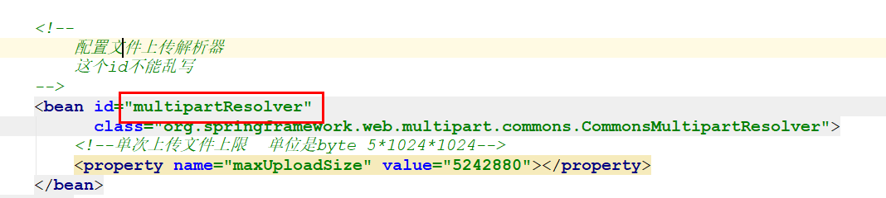

# 回顾

~~~markdown
* Servlet   =  Springmvc 前端控制器      +  程序员  处理器 

* 前端控制器 DispatcherServlet  配置在tomcat

* 处理器  xxxController

* @Controller

* @ReqeustMapping(value="路径", method=请求方式)

* @ResponseBody 返回结果JSON
~~~

# 接收请求参数（重点）

> 在SpringMVC中，可以使用多种数据类型来接收前端传入的参数

## 简单类型

> 需要保证前端传递的参数名称跟方法的形参名称一致

 

## 对象类型

> 需要保证前端传递的参数名称跟实体类的属性名称一致

  

## 数组类型

> 需要保证前端传递的参数名称跟方法中的数组形参名称一致

 

## 日期类型

> 对于一些常见的类型,  SpringMVC内置了类型转换器,  但是对于一些格式比较灵活的参数，它无法完成类型转换，这时候就必须自定义类型转换器。

### 注解类型

 

### 配置类型

**① 自定义转换器类**

 

**② 将类配置到Springmvc**

 

**③ controller**

 

## 文件类型

>文件上传是项目开发中最常见的功能，使用SpringMVC可以轻松完成文件的上传功能

### 添加依赖

~~~xml
        <!--文件上传-->
        <dependency>
            <groupId>commons-fileupload</groupId>
            <artifactId>commons-fileupload</artifactId>
            <version>1.4</version>
        </dependency>
~~~

### 配置上传解析器

 

### 接收文件

 

## 集合类型

> 获取集合参数时，需要将集合参数包装到一个实体中才可以

 

 

> SpringMVC在使用post提交请求时，对于中文参数是有乱码问题的，针对这种情况它提供了一个中文乱码过滤器，我们只需要进行配置一下就可以了。

 

## @RequestParam

>@RequestParam标注在方法参数之前，用于对传入的参数做一些限制，常见属性如下:
>
>- value：默认属性，用于指定前端传入的参数名称
>- defaultValue：当参数为非必传参数且前端没有传入参数时，指定一个默认值

  

## Ajax提交参数

>使用Ajax提交请求参数时，要注意的是post请求中请求体中参数的提交，需要使用@RequestBody接收

 

# 统一异常处理（掌握）

>使用Spring框架后，异常就不必在三层代码去处理了，而是直接抛给框架，框架会将所有的异常统一转交给我们自定义的统一异常处理类来处理。
>
>SpringMVC支持下面两个注解来实现全局异常处理
>
>​	@ControllerAdvice  标注在类上，声明当前类是一个用于专门处理异常的类
>
>​	@ExceptionHandler 标注在方法上，声明当前方法可以处理哪些异常

 

~~~java
package com.itheima.handler;

import org.springframework.web.bind.annotation.ControllerAdvice;
import org.springframework.web.bind.annotation.ExceptionHandler;
import org.springframework.web.bind.annotation.ResponseBody;

@ControllerAdvice //此注解标注在类上,用于声明这是一个全局异常处理类
@ResponseBody
public class CommonExceptionHandler {

    //处理异常的方法
    @ExceptionHandler(value = Exception.class)//此注解用于指定当前方法可以处理的异常类型
    public String handlerException(Exception e) {
        //1. 记录异常信息
        e.printStackTrace();

        //2. 返回错误提示
        return "NETWORK ERROR";
    }

    //处理异常的方法
    @ExceptionHandler(value = NullPointerException.class)
    public String handlerNullPointerException(Exception e) {
        //1. 记录异常信息
        System.out.println("给张三发个邮件");

        //2. 返回错误提示
        return "NETWORK ERROR";
    }

    //处理异常的方法
    @ExceptionHandler(value = ArithmeticException.class)
    public String handlerArithmeticException(Exception e) {
        //1. 记录异常信息
        System.out.println("给李四发个邮件");

        //2. 返回错误提示
        return "NETWORK ERROR";
    }
}
~~~

# 拦截器（掌握）

> 拦截器是Spring提供的一种技术，它的功能似于过滤器，它会在进入controller之前，离开controller之后以及响应离开服务时进行拦截。

## 自定义拦截器

### 开发拦截器

> 要对拦截的资源做什么

~~~xml
        <!--servlet-->
        <dependency>
            <groupId>javax.servlet</groupId>
            <artifactId>javax.servlet-api</artifactId>
            <version>3.0.1</version>
        </dependency>
~~~

 

### 配置拦截器

>确定你要拦截那些资源

 

### 测试

 

## 自定义拦截器链

> 开发中拦截器可以单独使用，也可以同时使用多个拦截器形成一条拦截器链。
>
> 开发步骤和单个拦截器是一样的，只不过注册的时候注册多个，==注意这里注册的顺序就代表拦截器执行的顺序==。

### 再开发拦截器

 

### 再配置拦截器

 

# Restful（理解）

## 介绍

> REST是一种软件架构风格，其强调HTTP应当以资源为中心[==在请求地址中尽量的不要出现动词==]。
>
> REST规范了HTTP请求动作，使用四个词语分别表示对资源的CRUD操作:  GET(获取)、POST(新建)、PUT(更新)、DELETE(删除) 

|          | 原来               | Restful            |
| -------- | ------------------ | ------------------ |
| 保存     | /saveUser          | post    /user      |
| 修改     | /updateUser?id=1   | put     /user/id/1 |
| 删除     | /deleteUser?id=1   | delete  /user/1    |
| 查询所有 | /findAllUser       | get      /user     |
| 查询一个 | /findByUserId?id=1 | get      /user/1   |

## 复制工程

 

## 保存和查询所有

  

## 主键和条件查询 

  

>1. SpringMVC注解使用场景
>
>~~~markdown
>@Controller
>
>@RequestMapping     @PostMapping    @PutMapping    @GetMapping    @DeleteMapping    
>
>@ResponseBody
>
>@RequestBody
>
>@RequestParam
>
>@DateTimeFormat 设置日期格式
>
>@RestController
>
>@PathVariable
>~~~
>
>2. 接收请求参数
>3. 统一异常处理(理解)
>4. 拦截器(理解)
>5. restful(了解)

==明天==

1. SpringBoot课程看一遍
2. 最后面试题, 明天理解下最后一个面试题: Springboot自动装配原理
3. Spring面试题

